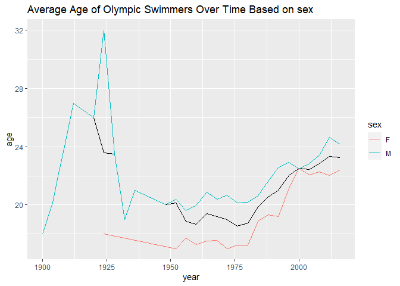

# 1) Data visualization: flights at ABIA

Your task is to create a figure, or set of related figures, that tell an
interesting story about flights into and out of Austin.

The graph shows that average time of departure delays are similar to
each other and slightly above 0 when the time of flight is between 50 to
200 minutes. When it exceeds 200 minutes, the average length of delay
became larger and more volatile. When the air time is 281 minutes, the
average departure delay is 413 minutes.

We can see the result that in most time, the delay time fluctulate
between 0 and 20, and around Oct, the delay time is relatively small.

We can find from 6am, the average delay time is increased in general,
and due to schedule arrangement, there is no flight delarture between 00
and 06. So we give a suggestion: try to catch earlier flight rather than
later flight.

From 0AM-5AM,there are fewer flights and longer delays during this time
period. The best time of day to fly to minimize the delays will be 5-8
AM, and the average delay time is less than 10 minutes. For 8-10 AM, the
average delay time is still less than 20 minutes.

The above trends may differ depends on airlines. In 7-8AM, the EV
airline has an average delay departure time more than one hour. In other
case, for example, F9 may has extreme delay departure time, more than
200 minutes, for 9-10 AM.

# 2) Wrangling the Olympics

## A) What is the 95th percentile of heights for female competitors across all Athletics events (i.e., track and field)? Note that `sport` is the broad sport (e.g. Athletics) whereas `event` is the specific event (e.g. 100 meter sprint).

<table>
<caption>95% heights for female competitors</caption>
<thead>
<tr class="header">
<th style="text-align: left;"></th>
<th style="text-align: left;">quantile</th>
<th style="text-align: right;">height</th>
</tr>
</thead>
<tbody>
<tr class="odd">
<td style="text-align: left;">95%</td>
<td style="text-align: left;">95%</td>
<td style="text-align: right;">183</td>
</tr>
</tbody>
</table>

95% heights for female competitors

The 95th percentile of heights for female competitors across all
Athletics events is 183cm.

## B) Which single women’s `event` had the greatest variability in competitor’s heights across the entire history of the Olympics, as measured by the standard deviation?

<table>
<caption>Top 5 Female Events that Have the Greatest Variability in
Height</caption>
<colgroup>
<col style="width: 41%" />
<col style="width: 41%" />
<col style="width: 16%" />
</colgroup>
<thead>
<tr class="header">
<th style="text-align: left;"></th>
<th style="text-align: left;">event</th>
<th style="text-align: right;">height_std_dev</th>
</tr>
</thead>
<tbody>
<tr class="odd">
<td style="text-align: left;">Rowing Women’s Coxed Fours</td>
<td style="text-align: left;">Rowing Women’s Coxed Fours</td>
<td style="text-align: right;">10.865490</td>
</tr>
<tr class="even">
<td style="text-align: left;">Basketball Women’s Basketball</td>
<td style="text-align: left;">Basketball Women’s Basketball</td>
<td style="text-align: right;">9.700255</td>
</tr>
<tr class="odd">
<td style="text-align: left;">Rowing Women’s Coxed Quadruple Sculls</td>
<td style="text-align: left;">Rowing Women’s Coxed Quadruple Sculls</td>
<td style="text-align: right;">9.246396</td>
</tr>
<tr class="even">
<td style="text-align: left;">Rowing Women’s Coxed Eights</td>
<td style="text-align: left;">Rowing Women’s Coxed Eights</td>
<td style="text-align: right;">8.741931</td>
</tr>
<tr class="odd">
<td style="text-align: left;">Swimming Women’s 100 metres Butterfly</td>
<td style="text-align: left;">Swimming Women’s 100 metres Butterfly</td>
<td style="text-align: right;">8.134398</td>
</tr>
<tr class="even">
<td style="text-align: left;">Volleyball Women’s Volleyball</td>
<td style="text-align: left;">Volleyball Women’s Volleyball</td>
<td style="text-align: right;">8.101521</td>
</tr>
</tbody>
</table>

Top 5 Female Events that Have the Greatest Variability in Height

The Rowing Women’s Coxed Fours had the greatest variability in
competitor’s heights across the entire history of the Olympics, as
measured by the standard deviation of 10.865490.

## C) How has the average age of Olympic swimmers changed over time? Does the trend look different for male swimmers relative to female swimmers?

The average age of Olympic swimmers decreased after 1924, when female
swimmers joined Olympic for the first time. Before 1924, there was only
male Olympic swimmers. From 1950 to 2008, the average age shows an
increasing trend, with a gap between 2-3 years old. The age of male
swimmers is higher than female, except for 2000, when female swimmer’s
average age spiked and overlapped with male swimmer’s average age.

# 3) K-nearest neighbors: cars

The data in [sclass.csv](../data/sclass.csv) contains data on over
29,000 Mercedes S Class vehicles—essentially every such car in this
class that was advertised on the secondary automobile market during
2014. For websites like Cars.com or Truecar that aim to provide
market-based pricing information to consumers, the Mercedes S class is a
notoriously difficult case. There is a huge range of sub-models that are
all labeled “S Class,”” from large luxury sedans to high-performance
sports cars; one sub-category of S class has even served as the safety
car in Formula 1 Races. Moreover, individual submodels involve cars with
many different features. This extreme diversity—unusual for a single
model of car—makes it difficult to provide accurate pricing predictions
to consumers.

Use K-nearest neighbors to build a predictive model for price, given
mileage, separately for each of two trim levels: 350 and 65 AMG. That
is, Treating the 350’s and the 65 AMG’s as two separate data sets.

## Trim 350

### KNN Test Plot

For Trim 350, K=32 is a ideal selection.

### Trim 350 Prediction Plot

## Trim 65 AMG

### Trim 65 AMG KNN Test Plot

For Trim 65 AMG, k=30 is an ideal selection with the lowest RMSE.

### Trim 65 AMG Prediction Plot

There are 292 samples of Trim 65 AMG and 416 samples of Trim 350. By
eyeballing, Trim 350 has the most optimal trade off between bias and
variance at k=32. Trim 65 AMG has the most optimal trade off at k=30.
