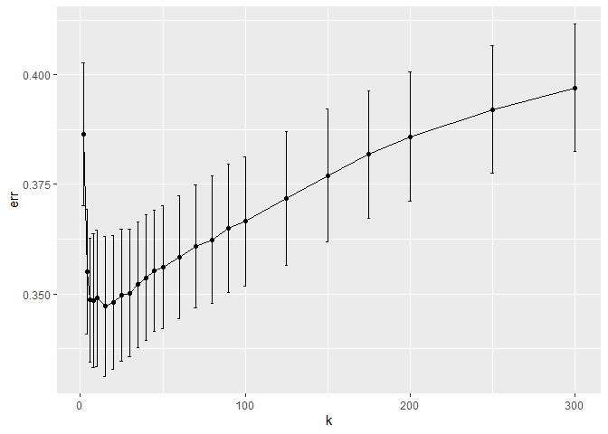

# Question 1: Saratoga house prices

    ## [1] 0.3035388

    ## [1] 0.2841732

    ## [1] 0.2836411

## Since lm3 has the least rmse, lm3 is the best model among these above 3 lm models

    ##           k       err    std_err
    ## result.1  2 0.3864492 0.01633367
    ## result.2  4 0.3550662 0.01415156
    ## result.3  6 0.3486071 0.01406188
    ## result.4  8 0.3484506 0.01526667
    ## result.5 10 0.3490365 0.01557582
    ## result.6 15 0.3471661 0.01590513

 \##
We can get the best k according to the following:

    ## [1] 15

## Then we calculate the best knn method’s error

    ##         1         2         3         4         5 
    ## 0.3994743 0.3666938 0.3122592 0.3241397 0.3332636

    ## [1] 0.3471661

## then we calculate the best lm model’s error

    ##         1         2         3         4         5 
    ## 0.3633087 0.2995797 0.2624499 0.2816947 0.2746733

    ## [1] 0.2963413

## The error from the optimal knn model is 0.3441, larger than that of linear model 3, which is 0.2945.

## Thus linear model seems to do better at achieving lower out-of-sample mean-squared error.

## Therefore as for price-modeling strategies for a local taxing authority, we should pay more attention to the linear model’s prediction to estimate market values for properties.

# Question 2: Classification and retrospective sampling

## After running the regression, a out-of-sample performance is examined.

<table>
<thead>
<tr class="header">
<th style="text-align: left;"></th>
<th style="text-align: right;">coef</th>
</tr>
</thead>
<tbody>
<tr class="odd">
<td style="text-align: left;">(Intercept)</td>
<td style="text-align: right;">-1.09</td>
</tr>
<tr class="even">
<td style="text-align: left;">duration</td>
<td style="text-align: right;">0.02</td>
</tr>
<tr class="odd">
<td style="text-align: left;">amount</td>
<td style="text-align: right;">0.00</td>
</tr>
<tr class="even">
<td style="text-align: left;">installment</td>
<td style="text-align: right;">0.29</td>
</tr>
<tr class="odd">
<td style="text-align: left;">age</td>
<td style="text-align: right;">-0.02</td>
</tr>
<tr class="even">
<td style="text-align: left;">historypoor</td>
<td style="text-align: right;">-1.02</td>
</tr>
<tr class="odd">
<td style="text-align: left;">historyterrible</td>
<td style="text-align: right;">-2.01</td>
</tr>
<tr class="even">
<td style="text-align: left;">purposeedu</td>
<td style="text-align: right;">0.86</td>
</tr>
<tr class="odd">
<td style="text-align: left;">purposegoods/repair</td>
<td style="text-align: right;">0.16</td>
</tr>
<tr class="even">
<td style="text-align: left;">purposenewcar</td>
<td style="text-align: right;">0.99</td>
</tr>
<tr class="odd">
<td style="text-align: left;">purposeusedcar</td>
<td style="text-align: right;">-0.80</td>
</tr>
<tr class="even">
<td style="text-align: left;">foreigngerman</td>
<td style="text-align: right;">-1.35</td>
</tr>
</tbody>
</table>

<table>
<thead>
<tr class="header">
<th style="text-align: left;"></th>
<th style="text-align: right;">0</th>
<th style="text-align: right;">1</th>
</tr>
</thead>
<tbody>
<tr class="odd">
<td style="text-align: left;">0</td>
<td style="text-align: right;">124</td>
<td style="text-align: right;">11</td>
</tr>
<tr class="even">
<td style="text-align: left;">1</td>
<td style="text-align: right;">50</td>
<td style="text-align: right;">15</td>
</tr>
</tbody>
</table>

## The coefficients for having poor and terrible credit history are negative. They are also statsitically signicifant. Having a poor or terrible credit history multiplies odds of default, which counter-intuitively has negative effect on default. The retrospective, “case-control” method that the bank used to select samples resulted in a substantial oversampling of defaults, relative to a random sample of loans in the bank’s overall portfolio. If the purpose of the model is to screen prospective borrowers to classify them into “high” versus “low” probability of default, this data set is not appropriate for building a predictive model.

<table>
<caption>Default Sample Size</caption>
<thead>
<tr class="header">
<th style="text-align: left;">Default Type</th>
<th style="text-align: right;">Sample Size</th>
</tr>
</thead>
<tbody>
<tr class="odd">
<td style="text-align: left;">0</td>
<td style="text-align: right;">700</td>
</tr>
<tr class="even">
<td style="text-align: left;">1</td>
<td style="text-align: right;">300</td>
</tr>
</tbody>
</table>

Default Sample Size

## To improve the sampling scheme under limited resources to get the data on all subjects in the loans, it requires a method to reduce the oversampling of defaults. Previously, the set of non-defauled loans (“controls”) is matched with similar set of defaulted loans, leaving “controls” less independent of the set of defaulted loans, the “controls” are not reprensentative of the source population that produced the default cases either. Selection bias resulted. A better sampling scheme should adhere to fixing these two issues. A random sampling method will give defaulted loans and non-defaulted loans equal chance of being selected, and the “controls” is selected independently from the cases.

## The second step is to increase the ratio between non-defaulted loan and defaulted loan. Since defaulted loans are rare cases and non-defaulted loans are plentiful, the statistical power of the study can be increased by enrolling more non-defaulted loans than the defaulted. However, ratio more than 4 controls over 1 case adds little impact on power. Therefore, if it is time-consuming or expensive to collect sets of controls, the ratio should not exceed 4:1. Alternatively, if it is not expensive, there is no reason to limit the number of non-defaulted loans. In this case of 300 defaulted loans, the number of non-defaulted loans can be increased from 700 to 1200 or even more. With these two steps, the sampling scheme will be improved.

# Question 3: Children and hotel reservations

    ##          hotel lead_time stays_in_weekend_nights stays_in_week_nights adults
    ## 1   City_Hotel       217                       1                    3      2
    ## 2   City_Hotel         2                       0                    1      2
    ## 3 Resort_Hotel        95                       2                    5      2
    ## 4 Resort_Hotel       143                       2                    6      2
    ## 5 Resort_Hotel       136                       1                    4      2
    ## 6   City_Hotel        67                       2                    2      2
    ##   children meal market_segment distribution_channel is_repeated_guest
    ## 1        0   BB  Offline_TA/TO                TA/TO                 0
    ## 2        0   BB         Direct               Direct                 0
    ## 3        0   BB      Online_TA                TA/TO                 0
    ## 4        0   HB      Online_TA                TA/TO                 0
    ## 5        0   HB         Direct               Direct                 0
    ## 6        0   SC      Online_TA                TA/TO                 0
    ##   previous_cancellations previous_bookings_not_canceled reserved_room_type
    ## 1                      0                              0                  A
    ## 2                      0                              0                  D
    ## 3                      0                              0                  A
    ## 4                      0                              0                  A
    ## 5                      0                              0                  F
    ## 6                      0                              0                  A
    ##   assigned_room_type booking_changes deposit_type days_in_waiting_list
    ## 1                  A               0   No_Deposit                    0
    ## 2                  K               0   No_Deposit                    0
    ## 3                  A               2   No_Deposit                    0
    ## 4                  A               0   No_Deposit                    0
    ## 5                  F               0   No_Deposit                    0
    ## 6                  A               0   No_Deposit                    0
    ##     customer_type average_daily_rate required_car_parking_spaces
    ## 1 Transient-Party              80.75                        none
    ## 2       Transient             170.00                        none
    ## 3       Transient               8.00                        none
    ## 4       Transient              81.00                        none
    ## 5       Transient             157.60                        none
    ## 6       Transient              49.09                        none
    ##   total_of_special_requests arrival_date
    ## 1                         1   2016-09-01
    ## 2                         3   2017-08-25
    ## 3                         2   2016-11-19
    ## 4                         1   2016-04-26
    ## 5                         4   2016-12-28
    ## 6                         1   2016-03-13

    ##          hotel lead_time stays_in_weekend_nights stays_in_week_nights adults
    ## 1 Resort_Hotel        47                       0                    2      2
    ## 2 Resort_Hotel        46                       0                    2      2
    ## 3   City_Hotel        22                       1                    2      2
    ## 4 Resort_Hotel       209                       2                    5      2
    ## 5   City_Hotel         1                       1                    0      2
    ## 6 Resort_Hotel       171                       2                    5      2
    ##   children meal market_segment distribution_channel is_repeated_guest
    ## 1        1   BB         Direct               Direct                 0
    ## 2        0   BB  Offline_TA/TO                TA/TO                 0
    ## 3        0   BB      Online_TA                TA/TO                 0
    ## 4        0   BB  Offline_TA/TO                TA/TO                 0
    ## 5        0   SC      Online_TA                TA/TO                 0
    ## 6        0   BB      Online_TA                TA/TO                 0
    ##   previous_cancellations previous_bookings_not_canceled reserved_room_type
    ## 1                      0                              0                  C
    ## 2                      0                              0                  D
    ## 3                      0                              0                  D
    ## 4                      0                              0                  A
    ## 5                      0                              0                  A
    ## 6                      0                              0                  D
    ##   assigned_room_type booking_changes deposit_type days_in_waiting_list
    ## 1                  C               0   No_Deposit                    0
    ## 2                  D               0   No_Deposit                    0
    ## 3                  D               0   No_Deposit                    0
    ## 4                  A               0   No_Deposit                    0
    ## 5                  B               0   No_Deposit                    0
    ## 6                  D               2   No_Deposit                    0
    ##     customer_type average_daily_rate required_car_parking_spaces
    ## 1       Transient             289.00                        none
    ## 2       Transient             162.00                        none
    ## 3       Transient             121.33                        none
    ## 4       Transient              76.22                        none
    ## 5       Transient              98.00                        none
    ## 6 Transient-Party             182.86                        none
    ##   total_of_special_requests arrival_date
    ## 1                         1   2017-08-23
    ## 2                         0   2016-12-30
    ## 3                         0   2017-03-13
    ## 4                         0   2016-07-12
    ## 5                         0   2016-08-07
    ## 6                         1   2017-07-25

    ## fold 1,2,3,4,5,6,7,8,9,10,done.

    ## fold 1,2,3,4,5,6,7,8,9,10,done.

    ## 49 x 1 sparse Matrix of class "dgCMatrix"
    ##                                           seg100
    ## intercept                          -4.4302258074
    ## hotelCity_Hotel                     0.6537078924
    ## hotelResort_Hotel                  -0.0007872628
    ## lead_time                           0.0007908457
    ## stays_in_weekend_nights             0.0333225532
    ## stays_in_week_nights                .           
    ## adults                             -0.5291212877
    ## mealFB                              0.2788085098
    ## mealHB                              .           
    ## mealSC                             -1.0638765927
    ## mealUndefined                       0.0791159248
    ## market_segmentComplementary         0.2702421837
    ## market_segmentCorporate            -0.9874510694
    ## market_segmentDirect                .           
    ## market_segmentGroups               -1.0404025138
    ## market_segmentOffline_TA/TO         .           
    ## market_segmentOnline_TA             0.1119764977
    ## distribution_channelDirect          0.1393770836
    ## distribution_channelGDS            -1.3136827599
    ## distribution_channelTA/TO           .           
    ## is_repeated_guest                  -0.8104887083
    ## previous_cancellations              .           
    ## previous_bookings_not_canceled     -0.1146398055
    ## reserved_room_typeB                 1.8251809781
    ## reserved_room_typeC                 2.8027891569
    ## reserved_room_typeD                -1.0402000356
    ## reserved_room_typeE                -0.1676384459
    ## reserved_room_typeF                 1.5268561229
    ## reserved_room_typeG                 2.2482184921
    ## reserved_room_typeH                 3.1285803246
    ## assigned_room_typeB                 0.1058085217
    ## assigned_room_typeC                 1.4171770822
    ## assigned_room_typeD                 1.0320952002
    ## assigned_room_typeE                 0.7113518110
    ## assigned_room_typeF                 0.9436144131
    ## assigned_room_typeG                 1.0869334958
    ## assigned_room_typeH                 1.2762822519
    ## assigned_room_typeI                 1.1558309377
    ## assigned_room_typeK                 0.4429218068
    ## booking_changes                     0.2734686056
    ## deposit_typeNon_Refund              .           
    ## deposit_typeRefundable              .           
    ## days_in_waiting_list               -0.0007326041
    ## customer_typeGroup                 -0.2461350216
    ## customer_typeTransient              0.3071804344
    ## customer_typeTransient-Party       -0.4387672208
    ## average_daily_rate                  0.0101739609
    ## required_car_parking_spacesparking  .           
    ## total_of_special_requests           0.4679821991

    ##                                   strong_interaction_name
    ## 1                   hotelResort_Hotel:reserved_room_typeB
    ## 2                       mealUndefined:reserved_room_typeG
    ## 3                  reserved_room_typeF:customer_typeGroup
    ## 4                 reserved_room_typeB:assigned_room_typeB
    ## 5                              mealHB:reserved_room_typeF
    ## 6         market_segmentComplementary:reserved_room_typeC
    ## 7                 reserved_room_typeB:assigned_room_typeI
    ## 8                 reserved_room_typeD:assigned_room_typeB
    ## 9                 reserved_room_typeG:assigned_room_typeG
    ## 10            market_segmentOnline_TA:reserved_room_typeB
    ## 11        market_segmentOffline_TA/TO:reserved_room_typeH
    ## 12             reserved_room_typeB:deposit_typeRefundable
    ## 13                reserved_room_typeB:assigned_room_typeG
    ## 14                             mealSC:reserved_room_typeF
    ## 15                  hotelResort_Hotel:reserved_room_typeE
    ## 16                reserved_room_typeD:assigned_room_typeD
    ## 17                      mealUndefined:assigned_room_typeB
    ## 18                             mealSC:reserved_room_typeG
    ## 19                reserved_room_typeF:assigned_room_typeE
    ## 20               market_segmentGroups:assigned_room_typeH
    ## 21                                    reserved_room_typeE
    ## 22        market_segmentComplementary:reserved_room_typeF
    ## 23                  adults:previous_bookings_not_canceled
    ## 24                      mealUndefined:assigned_room_typeD
    ## 25                reserved_room_typeF:assigned_room_typeB
    ## 26               market_segmentDirect:assigned_room_typeC
    ## 27                reserved_room_typeB:assigned_room_typeF
    ## 28 market_segmentOnline_TA:previous_bookings_not_canceled
    ## 29               market_segmentDirect:reserved_room_typeB
    ## 30                reserved_room_typeF:assigned_room_typeK
    ##    strong_interaction_beta abs_beta
    ## 1         3.64967410934751 3.649674
    ## 2         -3.4980532938879 3.498053
    ## 3         3.43596719805278 3.435967
    ## 4        -3.22014793846157 3.220148
    ## 5         3.17556488625004 3.175565
    ## 6          3.0751673163981 3.075167
    ## 7         2.90341761308941 2.903418
    ## 8         2.88009714301464 2.880097
    ## 9         2.83442125766303 2.834421
    ## 10       -2.83160959210798 2.831610
    ## 11        2.77428934362268 2.774289
    ## 12        -2.6137414414657 2.613741
    ## 13        2.46730905559058 2.467309
    ## 14       -2.40158937904104 2.401589
    ## 15       -2.35801776859988 2.358018
    ## 16       -2.26763432030418 2.267634
    ## 17       -2.26238992192467 2.262390
    ## 18        2.24386122329267 2.243861
    ## 19        2.16968321310524 2.169683
    ## 20        2.14065931086141 2.140659
    ## 21        2.13827554877586 2.138276
    ## 22         2.1367712357851 2.136771
    ## 23       -2.11829238689582 2.118292
    ## 24       -2.07664575670974 2.076646
    ## 25        2.03695629161541 2.036956
    ## 26        1.95993343915385 1.959933
    ## 27        1.93551768285523 1.935518
    ## 28        1.85876090937374 1.858761
    ## 29        1.84532345707417 1.845323
    ## 30        1.83259448825742 1.832594

    ##                                              (Intercept) 
    ##                                            -4.503598e+15 
    ##                                        hotelResort_Hotel 
    ##                                             7.186977e+04 
    ##                                                lead_time 
    ##                                             6.584229e+02 
    ##                                  stays_in_weekend_nights 
    ##                                             1.275938e+05 
    ##                                     stays_in_week_nights 
    ##                                            -2.701759e+04 
    ##                                                   adults 
    ##                                             5.416984e+05 
    ##                                                   mealFB 
    ##                                            -3.023488e+05 
    ##                                                   mealHB 
    ##                                            -1.873015e+05 
    ##                                                   mealSC 
    ##                                            -1.748197e+04 
    ##                                            mealUndefined 
    ##                                            -4.448960e+05 
    ##                              market_segmentComplementary 
    ##                                             8.012638e+14 
    ##                                  market_segmentCorporate 
    ##                                             4.503598e+15 
    ##                                     market_segmentDirect 
    ##                                             4.503598e+15 
    ##                                     market_segmentGroups 
    ##                                             1.096219e+11 
    ##                              market_segmentOffline_TA/TO 
    ##                                             4.503598e+15 
    ##                                  market_segmentOnline_TA 
    ##                                             4.503598e+15 
    ##                               distribution_channelDirect 
    ##                                            -4.732722e+04 
    ##                                  distribution_channelGDS 
    ##                                            -8.500099e+13 
    ##                                distribution_channelTA/TO 
    ##                                             2.725987e+05 
    ##                                        is_repeated_guest 
    ##                                             2.919478e+05 
    ##                                   previous_cancellations 
    ##                                            -8.454758e+03 
    ##                           previous_bookings_not_canceled 
    ##                                            -9.142453e+04 
    ##                                      reserved_room_typeB 
    ##                                            -2.764873e+05 
    ##                                      reserved_room_typeC 
    ##                                            -3.940650e+15 
    ##                                      reserved_room_typeD 
    ##                                            -2.568404e+09 
    ##                                      reserved_room_typeE 
    ##                                            -2.622907e+09 
    ##                                      reserved_room_typeF 
    ##                                            -4.135202e+05 
    ##                                      reserved_room_typeG 
    ##                                             5.446122e+07 
    ##                                      reserved_room_typeH 
    ##                                             6.155820e+21 
    ##                                      assigned_room_typeB 
    ##                                             3.501969e+02 
    ##                                      assigned_room_typeC 
    ##                                            -4.574505e+02 
    ##                                      assigned_room_typeD 
    ##                                             9.826406e+02 
    ##                                      assigned_room_typeE 
    ##                                             1.241584e+03 
    ##                                      assigned_room_typeF 
    ##                                             1.432475e+02 
    ##                                      assigned_room_typeG 
    ##                                             4.020266e+03 
    ##                                      assigned_room_typeH 
    ##                                            -3.202738e+04 
    ##                                      assigned_room_typeI 
    ##                                            -1.842374e+03 
    ##                                      assigned_room_typeK 
    ##                                             8.811530e+02 
    ##                                          booking_changes 
    ##                                             2.597204e+02 
    ##                                     days_in_waiting_list 
    ##                                            -3.136825e+01 
    ##                                       customer_typeGroup 
    ##                                            -8.579465e+11 
    ##                                   customer_typeTransient 
    ##                                             4.503600e+15 
    ##                             customer_typeTransient-Party 
    ##                                             7.156832e+04 
    ##                                       average_daily_rate 
    ##                                             6.299001e+00 
    ##                       required_car_parking_spacesparking 
    ##                                            -1.319236e+02 
    ##                                total_of_special_requests 
    ##                                             3.106219e+02 
    ##                               mealFB:reserved_room_typeB 
    ##                                                       NA 
    ##                               mealHB:reserved_room_typeB 
    ##                                            -3.618286e+04 
    ##                               mealSC:reserved_room_typeB 
    ##                                             6.434568e+03 
    ##                        mealUndefined:reserved_room_typeB 
    ##                                                       NA 
    ##                               mealFB:reserved_room_typeC 
    ##                                            -1.202054e+04 
    ##                               mealHB:reserved_room_typeC 
    ##                                             8.931266e+03 
    ##                               mealSC:reserved_room_typeC 
    ##                                            -2.251800e+15 
    ##                        mealUndefined:reserved_room_typeC 
    ##                                             1.437558e+05 
    ##                               mealFB:reserved_room_typeD 
    ##                                            -1.076113e+03 
    ##                               mealHB:reserved_room_typeD 
    ##                                            -7.833470e+02 
    ##                               mealSC:reserved_room_typeD 
    ##                                            -4.034816e+03 
    ##                        mealUndefined:reserved_room_typeD 
    ##                                             8.617996e+03 
    ##                               mealFB:reserved_room_typeE 
    ##                                            -4.014078e+15 
    ##                               mealHB:reserved_room_typeE 
    ##                                            -9.452284e+02 
    ##                               mealSC:reserved_room_typeE 
    ##                                             1.224014e+15 
    ##                        mealUndefined:reserved_room_typeE 
    ##                                             8.929803e+03 
    ##                               mealFB:reserved_room_typeF 
    ##                                             4.185637e+14 
    ##                               mealHB:reserved_room_typeF 
    ##                                            -6.668849e+03 
    ##                               mealSC:reserved_room_typeF 
    ##                                            -1.166558e+14 
    ##                        mealUndefined:reserved_room_typeF 
    ##                                            -4.961881e+07 
    ##                               mealFB:reserved_room_typeG 
    ##                                             5.554440e+15 
    ##                               mealHB:reserved_room_typeG 
    ##                                            -5.429149e+04 
    ##                               mealSC:reserved_room_typeG 
    ##                                            -1.801440e+15 
    ##                        mealUndefined:reserved_room_typeG 
    ##                                            -3.445831e+07 
    ##                               mealFB:reserved_room_typeH 
    ##                                            -4.503021e+15 
    ##                               mealHB:reserved_room_typeH 
    ##                                             1.158532e+05 
    ##                               mealSC:reserved_room_typeH 
    ##                                                       NA 
    ##                        mealUndefined:reserved_room_typeH 
    ##                                                       NA 
    ##                  reserved_room_typeB:assigned_room_typeB 
    ##                                            -5.932967e+03 
    ##                  reserved_room_typeC:assigned_room_typeB 
    ##                                            -4.503599e+15 
    ##                  reserved_room_typeD:assigned_room_typeB 
    ##                                             5.221838e+03 
    ##                  reserved_room_typeE:assigned_room_typeB 
    ##                                             1.639793e+15 
    ##                  reserved_room_typeF:assigned_room_typeB 
    ##                                            -2.116918e+04 
    ##                  reserved_room_typeG:assigned_room_typeB 
    ##                                            -3.046665e+08 
    ##                  reserved_room_typeH:assigned_room_typeB 
    ##                                                       NA 
    ##                  reserved_room_typeB:assigned_room_typeC 
    ##                                                       NA 
    ##                  reserved_room_typeC:assigned_room_typeC 
    ##                                             2.276222e+08 
    ##                  reserved_room_typeD:assigned_room_typeC 
    ##                                             3.734372e+07 
    ##                  reserved_room_typeE:assigned_room_typeC 
    ##                                            -3.344461e+15 
    ##                  reserved_room_typeF:assigned_room_typeC 
    ##                                                       NA 
    ##                  reserved_room_typeG:assigned_room_typeC 
    ##                                            -5.512772e+07 
    ##                  reserved_room_typeH:assigned_room_typeC 
    ##                                                       NA 
    ##                  reserved_room_typeB:assigned_room_typeD 
    ##                                             6.061645e+03 
    ##                  reserved_room_typeC:assigned_room_typeD 
    ##                                             2.276293e+08 
    ##                  reserved_room_typeD:assigned_room_typeD 
    ##                                            -2.082344e+03 
    ##                  reserved_room_typeE:assigned_room_typeD 
    ##                                            -4.006674e+15 
    ##                  reserved_room_typeF:assigned_room_typeD 
    ##                                                       NA 
    ##                  reserved_room_typeG:assigned_room_typeD 
    ##                                                       NA 
    ##                  reserved_room_typeH:assigned_room_typeD 
    ##                                            -6.155820e+21 
    ##                  reserved_room_typeB:assigned_room_typeE 
    ##                                            -6.113435e+03 
    ##                  reserved_room_typeC:assigned_room_typeE 
    ##                                             2.276240e+08 
    ##                  reserved_room_typeD:assigned_room_typeE 
    ##                                            -3.631798e+03 
    ##                  reserved_room_typeE:assigned_room_typeE 
    ##                                            -3.428068e+03 
    ##                  reserved_room_typeF:assigned_room_typeE 
    ##                                            -2.071436e+04 
    ##                  reserved_room_typeG:assigned_room_typeE 
    ##                                             6.734397e+07 
    ##                  reserved_room_typeH:assigned_room_typeE 
    ##                                                       NA 
    ##                  reserved_room_typeB:assigned_room_typeF 
    ##                                             4.503601e+15 
    ##                  reserved_room_typeC:assigned_room_typeF 
    ##                                             2.421207e+08 
    ##                  reserved_room_typeD:assigned_room_typeF 
    ##                                            -2.775651e+03 
    ##                  reserved_room_typeE:assigned_room_typeF 
    ##                                            -4.868914e+03 
    ##                  reserved_room_typeF:assigned_room_typeF 
    ##                                            -1.703508e+04 
    ##                  reserved_room_typeG:assigned_room_typeF 
    ##                                            -5.519603e+07 
    ##                  reserved_room_typeH:assigned_room_typeF 
    ##                                                       NA 
    ##                  reserved_room_typeB:assigned_room_typeG 
    ##                                            -9.214127e+03 
    ##                  reserved_room_typeC:assigned_room_typeG 
    ##                                             4.503600e+15 
    ##                  reserved_room_typeD:assigned_room_typeG 
    ##                                            -8.014878e+03 
    ##                  reserved_room_typeE:assigned_room_typeG 
    ##                                             4.380971e+03 
    ##                  reserved_room_typeF:assigned_room_typeG 
    ##                                            -2.256404e+04 
    ##                  reserved_room_typeG:assigned_room_typeG 
    ##                                            -5.520212e+07 
    ##                  reserved_room_typeH:assigned_room_typeG 
    ##                                            -6.155820e+21 
    ##                  reserved_room_typeB:assigned_room_typeH 
    ##                                                       NA 
    ##                  reserved_room_typeC:assigned_room_typeH 
    ##                                             2.275542e+08 
    ##                  reserved_room_typeD:assigned_room_typeH 
    ##                                            -3.061830e+04 
    ##                  reserved_room_typeE:assigned_room_typeH 
    ##                                            -4.553271e+08 
    ##                  reserved_room_typeF:assigned_room_typeH 
    ##                                             1.951245e+08 
    ##                  reserved_room_typeG:assigned_room_typeH 
    ##                                            -5.520368e+07 
    ##                  reserved_room_typeH:assigned_room_typeH 
    ##                                            -6.155820e+21 
    ##                  reserved_room_typeB:assigned_room_typeI 
    ##                                                       NA 
    ##                  reserved_room_typeC:assigned_room_typeI 
    ##                                             3.377700e+15 
    ##                  reserved_room_typeD:assigned_room_typeI 
    ##                                             1.127069e+04 
    ##                  reserved_room_typeE:assigned_room_typeI 
    ##                                             2.548963e+05 
    ##                  reserved_room_typeF:assigned_room_typeI 
    ##                                            -4.666233e+14 
    ##                  reserved_room_typeG:assigned_room_typeI 
    ##                                            -5.519252e+07 
    ##                  reserved_room_typeH:assigned_room_typeI 
    ##                                            -6.155815e+21 
    ##                  reserved_room_typeB:assigned_room_typeK 
    ##                                            -3.920415e+03 
    ##                  reserved_room_typeC:assigned_room_typeK 
    ##                                                       NA 
    ##                  reserved_room_typeD:assigned_room_typeK 
    ##                                            -1.636290e+02 
    ##                  reserved_room_typeE:assigned_room_typeK 
    ##                                            -3.519724e+15 
    ##                  reserved_room_typeF:assigned_room_typeK 
    ##                                            -3.357485e+04 
    ##                  reserved_room_typeG:assigned_room_typeK 
    ##                                             3.602880e+15 
    ##                  reserved_room_typeH:assigned_room_typeK 
    ##                                                       NA 
    ##                    hotelResort_Hotel:reserved_room_typeB 
    ##                                            -3.937536e+06 
    ##                    hotelResort_Hotel:reserved_room_typeC 
    ##                                             3.940649e+15 
    ##                    hotelResort_Hotel:reserved_room_typeD 
    ##                                            -3.853941e+02 
    ##                    hotelResort_Hotel:reserved_room_typeE 
    ##                                             1.720838e+03 
    ##                    hotelResort_Hotel:reserved_room_typeF 
    ##                                            -1.713147e+03 
    ##                    hotelResort_Hotel:reserved_room_typeG 
    ##                                             1.444740e+03 
    ##                    hotelResort_Hotel:reserved_room_typeH 
    ##                                                       NA 
    ##          market_segmentComplementary:reserved_room_typeB 
    ##                                            -2.626521e+15 
    ##              market_segmentCorporate:reserved_room_typeB 
    ##                                             2.988066e+15 
    ##                 market_segmentDirect:reserved_room_typeB 
    ##                                             3.887055e+03 
    ##                 market_segmentGroups:reserved_room_typeB 
    ##                                            -1.137707e+03 
    ##          market_segmentOffline_TA/TO:reserved_room_typeB 
    ##                                             2.979880e+04 
    ##              market_segmentOnline_TA:reserved_room_typeB 
    ##                                                       NA 
    ##          market_segmentComplementary:reserved_room_typeC 
    ##                                             1.126479e+15 
    ##              market_segmentCorporate:reserved_room_typeC 
    ##                                             3.594077e+15 
    ##                 market_segmentDirect:reserved_room_typeC 
    ##                                             2.773152e+03 
    ##                 market_segmentGroups:reserved_room_typeC 
    ##                                            -4.848537e+08 
    ##          market_segmentOffline_TA/TO:reserved_room_typeC 
    ##                                             1.961019e+03 
    ##              market_segmentOnline_TA:reserved_room_typeC 
    ##                                                       NA 
    ##          market_segmentComplementary:reserved_room_typeD 
    ##                                            -1.320573e+13 
    ##              market_segmentCorporate:reserved_room_typeD 
    ##                                             3.769836e+13 
    ##                 market_segmentDirect:reserved_room_typeD 
    ##                                             2.568096e+09 
    ##                 market_segmentGroups:reserved_room_typeD 
    ##                                             2.568098e+09 
    ##          market_segmentOffline_TA/TO:reserved_room_typeD 
    ##                                             2.568097e+09 
    ##              market_segmentOnline_TA:reserved_room_typeD 
    ##                                             2.568097e+09 
    ##          market_segmentComplementary:reserved_room_typeE 
    ##                                            -2.892333e+15 
    ##              market_segmentCorporate:reserved_room_typeE 
    ##                                            -1.357561e+13 
    ##                 market_segmentDirect:reserved_room_typeE 
    ##                                             2.622328e+09 
    ##                 market_segmentGroups:reserved_room_typeE 
    ##                                            -4.431611e+13 
    ##          market_segmentOffline_TA/TO:reserved_room_typeE 
    ##                                             2.622326e+09 
    ##              market_segmentOnline_TA:reserved_room_typeE 
    ##                                             2.622328e+09 
    ##          market_segmentComplementary:reserved_room_typeF 
    ##                                            -2.929368e+15 
    ##              market_segmentCorporate:reserved_room_typeF 
    ##                                             1.482917e+15 
    ##                 market_segmentDirect:reserved_room_typeF 
    ##                                            -5.245277e+02 
    ##                 market_segmentGroups:reserved_room_typeF 
    ##                                             4.364081e+08 
    ##          market_segmentOffline_TA/TO:reserved_room_typeF 
    ##                                            -3.946377e+03 
    ##              market_segmentOnline_TA:reserved_room_typeF 
    ##                                                       NA 
    ##          market_segmentComplementary:reserved_room_typeG 
    ##                                            -4.052661e+15 
    ##              market_segmentCorporate:reserved_room_typeG 
    ##                                             1.113541e+15 
    ##                 market_segmentDirect:reserved_room_typeG 
    ##                                            -1.615042e+03 
    ##                 market_segmentGroups:reserved_room_typeG 
    ##                                             2.344633e+07 
    ##          market_segmentOffline_TA/TO:reserved_room_typeG 
    ##                                             3.972464e+03 
    ##              market_segmentOnline_TA:reserved_room_typeG 
    ##                                                       NA 
    ##          market_segmentComplementary:reserved_room_typeH 
    ##                                                       NA 
    ##              market_segmentCorporate:reserved_room_typeH 
    ##                                                       NA 
    ##                 market_segmentDirect:reserved_room_typeH 
    ##                                             1.704537e+05 
    ##                 market_segmentGroups:reserved_room_typeH 
    ##                                                       NA 
    ##          market_segmentOffline_TA/TO:reserved_room_typeH 
    ##                                                       NA 
    ##              market_segmentOnline_TA:reserved_room_typeH 
    ##                                                       NA 
    ##                                 mealFB:is_repeated_guest 
    ##                                             1.501200e+15 
    ##                                 mealHB:is_repeated_guest 
    ##                                            -1.384919e+04 
    ##                                 mealSC:is_repeated_guest 
    ##                                            -8.381222e+03 
    ##                          mealUndefined:is_repeated_guest 
    ##                                            -1.707846e+03 
    ##                    adults:previous_bookings_not_canceled 
    ##                                             7.321464e+02 
    ##                    mealFB:previous_bookings_not_canceled 
    ##                                            -1.501200e+15 
    ##                    mealHB:previous_bookings_not_canceled 
    ##                                             9.409120e+03 
    ##                    mealSC:previous_bookings_not_canceled 
    ##                                            -4.006325e+14 
    ##             mealUndefined:previous_bookings_not_canceled 
    ##                                             1.100355e+07 
    ##           market_segmentComplementary:customer_typeGroup 
    ##                                            -8.004071e+14 
    ##               market_segmentCorporate:customer_typeGroup 
    ##                                            -4.168393e+12 
    ##                  market_segmentDirect:customer_typeGroup 
    ##                                             8.579465e+11 
    ##                  market_segmentGroups:customer_typeGroup 
    ##                                             4.509271e+15 
    ##           market_segmentOffline_TA/TO:customer_typeGroup 
    ##                                            -4.404837e+15 
    ##               market_segmentOnline_TA:customer_typeGroup 
    ##                                                       NA 
    ##       market_segmentComplementary:customer_typeTransient 
    ##                                            -8.018442e+14 
    ##           market_segmentCorporate:customer_typeTransient 
    ##                                            -4.485316e+15 
    ##              market_segmentDirect:customer_typeTransient 
    ##                                            -4.503600e+15 
    ##              market_segmentGroups:customer_typeTransient 
    ##                                            -1.109487e+11 
    ##       market_segmentOffline_TA/TO:customer_typeTransient 
    ##                                            -4.503600e+15 
    ##           market_segmentOnline_TA:customer_typeTransient 
    ##                                            -4.503600e+15 
    ## market_segmentComplementary:customer_typeTransient-Party 
    ##                                             4.053853e+14 
    ##     market_segmentCorporate:customer_typeTransient-Party 
    ##                                             6.431840e+12 
    ##        market_segmentDirect:customer_typeTransient-Party 
    ##                                            -7.868914e+04 
    ##        market_segmentGroups:customer_typeTransient-Party 
    ##                                             4.503489e+15 
    ## market_segmentOffline_TA/TO:customer_typeTransient-Party 
    ##                                            -7.749130e+04 
    ##     market_segmentOnline_TA:customer_typeTransient-Party 
    ##                                                       NA 
    ##                    is_repeated_guest:assigned_room_typeB 
    ##                                             1.597353e+04 
    ##                    is_repeated_guest:assigned_room_typeC 
    ##                                             7.873005e+02 
    ##                    is_repeated_guest:assigned_room_typeD 
    ##                                            -1.743626e+03 
    ##                    is_repeated_guest:assigned_room_typeE 
    ##                                            -4.421059e+03 
    ##                    is_repeated_guest:assigned_room_typeF 
    ##                                            -1.053865e+04 
    ##                    is_repeated_guest:assigned_room_typeG 
    ##                                             1.210131e+04 
    ##                    is_repeated_guest:assigned_room_typeH 
    ##                                             2.240632e+04 
    ##                    is_repeated_guest:assigned_room_typeI 
    ##                                             1.030365e+06 
    ##                    is_repeated_guest:assigned_room_typeK 
    ##                                            -2.645528e+03 
    ##   assigned_room_typeB:required_car_parking_spacesparking 
    ##                                            -4.847045e+03 
    ##   assigned_room_typeC:required_car_parking_spacesparking 
    ##                                            -1.450753e+03 
    ##   assigned_room_typeD:required_car_parking_spacesparking 
    ##                                            -1.857976e+03 
    ##   assigned_room_typeE:required_car_parking_spacesparking 
    ##                                            -2.558075e+03 
    ##   assigned_room_typeF:required_car_parking_spacesparking 
    ##                                             1.114118e+03 
    ##   assigned_room_typeG:required_car_parking_spacesparking 
    ##                                            -1.502914e+03 
    ##   assigned_room_typeH:required_car_parking_spacesparking 
    ##                                             9.854058e+04 
    ##   assigned_room_typeI:required_car_parking_spacesparking 
    ##                                             9.116154e+03 
    ##   assigned_room_typeK:required_car_parking_spacesparking 
    ##                                            -2.069515e+09

    ##                     [,1]       [,2]    [,3]    [,4]   
    ## measurement         "Deviance" "TPR"   "FPR"   "FDR"  
    ## eval_baseline1      "4855.002" "0"     "0"     "NaN"  
    ## eval_baseline2      "3497.158" "0.334" "0.011" "0.287"
    ## eval_lasso_selected "3425.315" "0.364" "0.011" "0.26"

## We can see that the lasso model has the smallest deviance, the highest TPR(higher is better)

## and the lowest FPR & FDR (Both 2 are “lower is better”)

\## The ROC curve of our best model

 \##
We can see that our model doesn’t perform well \## The prediction isn’t
accurate. The predict numbers wiggle more than actual number.
