# Question 1 : What causes what?

## Problem 1: Why can’t I just get data from a few different cities and run the regression of “Crime” on “Police” to understand how more cops in the streets affect crime? (“Crime” refers to some measure of crime rate and “Police” measures the number of cops in a city.)

We could not just get data from a few different cities and run
regression of “Crime” on “Police” because in most cases, high-crime
cities have an incentive to hire a lot of cops, which adds confounders
in the analysis of the causal effect of cops on crime.

## Problem 2: How were the researchers from UPenn able to isolate this effect? Briefly describe their approach and discuss their result in the “Table 2” below, from the researchers’ paper.

They used the district and day fixed effect so they controlled their
analyses in Washington DC. In this situation, the researchers find an
example where they get a lot of police for reasons unrelated to crime to
explore whether there is a causal relationship between more police and
less crime.

They firstly regressed the daily total number of crimes in D.C. on the
high alert level, and secondly regressed the daily total number of
crimes in D.C. on both the high alert level and logged midday METRO
ridership. In the first regression (results in 1st column), the
coefficient -7.316 indicates that daily total number of crimes in D.C.
would decrease by about 7.3 on the high alert days and it is
statistically significant at the 5% level. In the second column (results
in 2nd column), after controlling the ridership, the coefficients
indicate that the coefficient of the high alert level drops to about
6.05, and the number of daily crimes in D.C. would increase by about 1.7
if Metro ridership increases by 10%, and this estimated coefficient is
statistically significant at 1% level. Since this increase is small, we
can learn that the change in ridership is not strongly correlated with
the change in the number of daily crimes in D.C. on high-alert days. We
can conclude that more police results in less crime.

## Problem 3: Why did they have to control for Metro ridership? What was that trying to capture?

Since after adding more cops, they made a hypothesis that the tourists
were less likely to visit Washington or to go out during that particular
time. Then they checked that hypothesis by looking at ridership levels
on the Metro system, and the number of tourists actually was not
diminished on high terror days, so they suggested the number of victims
was largely unchanged. They wanted to capture that the number of
tourists was the same during the high terror days, and then the
reductions of number of crimes was less likely to be related to the
number of tourists.

## Problem 4: Below I am showing you “Table 4” from the researchers’ paper. Just focus on the first column of the table. Can you describe the model being estimated here? What is the conclusion?

The model here describes the effect of high alerts in different
districts on the number of crimes. The regression tells us that the
expected number of daily crimes would decrease by about 2.62 in District
1 (the national mall) during the high alert days, and this estimated
coefficient is statistically significant at a 1% level. The expected
number of daily crimes would decrease by about 0.57 in other districts
but this estimated coefficient is not statistically significant at the
5% level. And in this case, the expected number of daily crimes in D.C.
would increase by about 0.024 if Metro ridership increases by 1%. Since
the coefficient of interaction between high-alert and District 1(the
national mall) is obviously larger than that between high-alert and
other districts, we could believe that the total crime decline during
high-alert periods is mainly concentrated in District 1.

# Question 2: Tree modeling: dengue cases

    ##   city season total_cases   ndvi_ne   ndvi_nw   ndvi_se   ndvi_sw
    ## 1   sj spring           4 0.1226000 0.1037250 0.1984833 0.1776167
    ## 2   sj spring           5 0.1699000 0.1421750 0.1623571 0.1554857
    ## 3   sj spring           4 0.0322500 0.1729667 0.1572000 0.1708429
    ## 4   sj spring           3 0.1286333 0.2450667 0.2275571 0.2358857
    ## 5   sj spring           6 0.1962000 0.2622000 0.2512000 0.2473400
    ## 6   sj summer           2        NA 0.1748500 0.2543143 0.1817429
    ##   precipitation_amt air_temp_k avg_temp_k dew_point_temp_k max_air_temp_k
    ## 1             12.42   297.5729   297.7429         292.4143          299.8
    ## 2             22.82   298.2114   298.4429         293.9514          300.9
    ## 3             34.54   298.7814   298.8786         295.4343          300.5
    ## 4             15.36   298.9871   299.2286         295.3100          301.4
    ## 5              7.52   299.5186   299.6643         295.8214          301.9
    ## 6              9.58   299.6300   299.7643         295.8514          302.4
    ##   min_air_temp_k precip_amt_kg_per_m2 relative_humidity_percent
    ## 1          295.9                32.00                  73.36571
    ## 2          296.4                17.94                  77.36857
    ## 3          297.3                26.10                  82.05286
    ## 4          297.0                13.90                  80.33714
    ## 5          297.5                12.20                  80.46000
    ## 6          298.1                26.49                  79.89143
    ##   specific_humidity   tdtr_k
    ## 1          14.01286 2.628571
    ## 2          15.37286 2.371429
    ## 3          16.84857 2.300000
    ## 4          16.67286 2.428571
    ## 5          17.21000 3.014286
    ## 6          17.21286 2.100000

    ##   city season total_cases   ndvi_ne   ndvi_nw   ndvi_se   ndvi_sw
    ## 1   sj spring           4 0.1226000 0.1037250 0.1984833 0.1776167
    ## 2   sj spring           5 0.1699000 0.1421750 0.1623571 0.1554857
    ## 3   sj spring           4 0.0322500 0.1729667 0.1572000 0.1708429
    ## 4   sj spring           3 0.1286333 0.2450667 0.2275571 0.2358857
    ## 5   sj spring           6 0.1962000 0.2622000 0.2512000 0.2473400
    ## 6   sj summer           2 0.1468334 0.1748500 0.2543143 0.1817429
    ##   precipitation_amt air_temp_k avg_temp_k dew_point_temp_k max_air_temp_k
    ## 1             12.42   297.5729   297.7429         292.4143          299.8
    ## 2             22.82   298.2114   298.4429         293.9514          300.9
    ## 3             34.54   298.7814   298.8786         295.4343          300.5
    ## 4             15.36   298.9871   299.2286         295.3100          301.4
    ## 5              7.52   299.5186   299.6643         295.8214          301.9
    ## 6              9.58   299.6300   299.7643         295.8514          302.4
    ##   min_air_temp_k precip_amt_kg_per_m2 relative_humidity_percent
    ## 1          295.9                32.00                  73.36571
    ## 2          296.4                17.94                  77.36857
    ## 3          297.3                26.10                  82.05286
    ## 4          297.0                13.90                  80.33714
    ## 5          297.5                12.20                  80.46000
    ## 6          298.1                26.49                  79.89143
    ##   specific_humidity   tdtr_k
    ## 1          14.01286 2.628571
    ## 2          15.37286 2.371429
    ## 3          16.84857 2.300000
    ## 4          16.67286 2.428571
    ## 5          17.21000 3.014286
    ## 6          17.21286 2.100000

    ## Distribution not specified, assuming gaussian ...

We predicted the dengue cases with CART model, Random Forest model and
Gradient-boosted model, and find the best model with lowest RMSE.
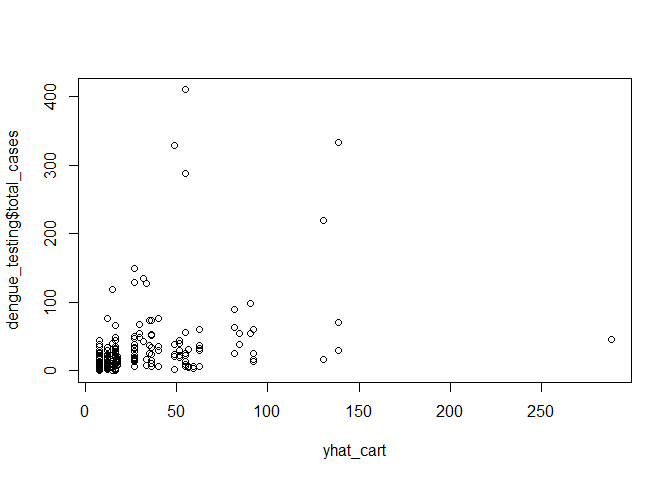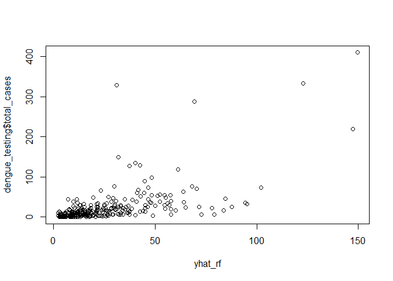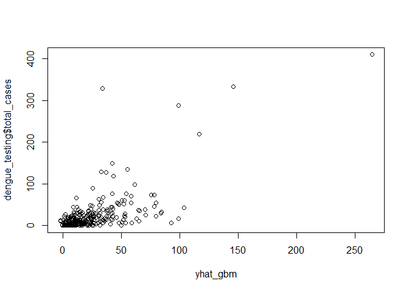

    ## The RMSE of CART model is  43.31995

    ## The RMSE of RandomForest model is  36.50729

    ## The RMSE of Gradient Boosting model is  33.73103

We also evaluate the performance of three models by comparing their MSE.

    ## Distribution not specified, assuming gaussian ...

    ## The MSE of CART Model is  1831.075

    ## The MSE of randomForest is  1317.732

    ## The MSE of Gradient Boosting is  1068.93

Because the gradient-boosted model has the smallest out-of-sample RMSE
and MSE, we decided to choose it as the model to make partial dependence
plots
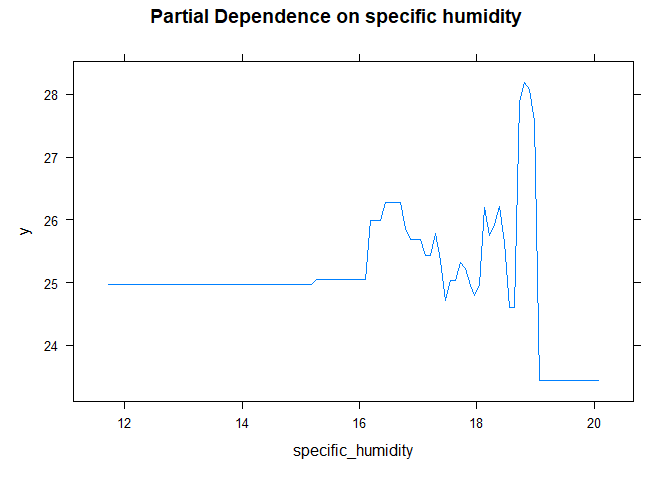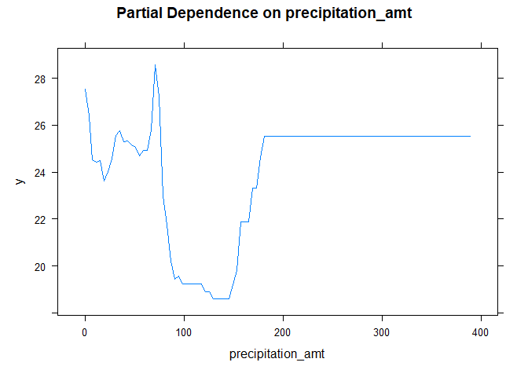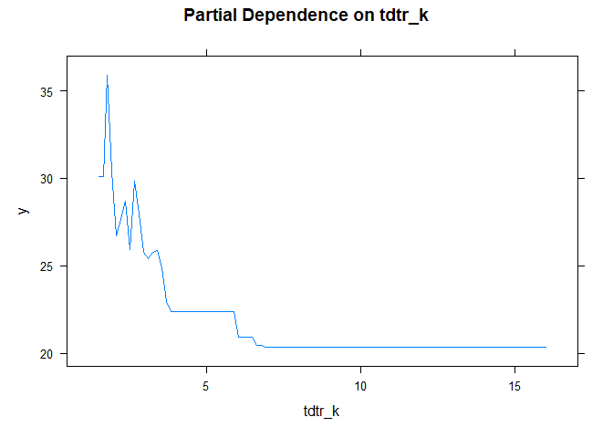
We choose “tdtr\_k” to make a partial dependence plots because we think
that if the DTR is bigger, it’s more difficult for mosquito to live as a
result, we want to know whether DTR affect the total dengue fever cases
and we can see that it has big influence on the infection cases.

# Question 3: Predictive model building: green certification

Our goal for this problem: find the best predictive model. The revenue
per square foot per calendar year and use this model to quantify the
average change in rental income per square foot(whether in absolute or
percentage terms) associated with green certification.

Step description Step1. Build many models Step2. Model selection(compare
the RMSE of every model and choose the best model) Step3. write the
report tells that why you choose this method, modeling choice and
conclusion

    ##   CS_PropertyID cluster   size empl_gr  Rent leasing_rate stories age renovated
    ## 1        379105       1 260300    2.22 38.56        91.39      14  16         0
    ## 2        122151       1  67861    2.22 28.57        87.14       5  27         0
    ## 3        379839       1 164848    2.22 33.31        88.94      13  36         1
    ## 4         94614       1  93372    2.22 35.00        97.04      13  46         1
    ## 5        379285       1 174307    2.22 40.69        96.58      16   5         0
    ## 6         94765       1 231633    2.22 43.16        92.74      14  20         0
    ##   class_a class_b LEED Energystar green_rating net amenities cd_total_07
    ## 1       1       0    0          1            1   0         1        4988
    ## 2       0       1    0          0            0   0         1        4988
    ## 3       0       1    0          0            0   0         1        4988
    ## 4       0       1    0          0            0   0         0        4988
    ## 5       1       0    0          0            0   0         1        4988
    ## 6       1       0    0          0            0   0         1        4988
    ##   hd_total07 total_dd_07 Precipitation  Gas_Costs Electricity_Costs
    ## 1         58        5046         42.57 0.01370000        0.02900000
    ## 2         58        5046         42.57 0.01373149        0.02904455
    ## 3         58        5046         42.57 0.01373149        0.02904455
    ## 4         58        5046         42.57 0.01373149        0.02904455
    ## 5         58        5046         42.57 0.01373149        0.02904455
    ## 6         58        5046         42.57 0.01373149        0.02904455
    ##   City_Market_Rent
    ## 1            36.78
    ## 2            36.78
    ## 3            36.78
    ## 4            36.78
    ## 5            36.78
    ## 6            36.78

**Step 1 : Build the model**

    ## Start:  AIC=29072
    ## revenue ~ (CS_PropertyID + cluster + size + empl_gr + Rent + 
    ##     leasing_rate + stories + age + renovated + class_a + class_b + 
    ##     LEED + Energystar + green_rating + net + amenities + cd_total_07 + 
    ##     hd_total07 + total_dd_07 + Precipitation + Gas_Costs + Electricity_Costs + 
    ##     City_Market_Rent) - cluster - CS_PropertyID - LEED - Rent - 
    ##     leasing_rate - cd_total_07 - hd_total07
    ## 
    ##                                      Df Sum of Sq     RSS   AIC
    ## + size:City_Market_Rent               1     43294  605533 28642
    ## + size:Electricity_Costs              1     32196  616631 28756
    ## + stories:City_Market_Rent            1     22704  626122 28851
    ## + stories:Electricity_Costs           1     12740  636087 28950
    ## + class_a:City_Market_Rent            1     11426  637400 28963
    ## + amenities:City_Market_Rent          1      8352  640474 28993
    ## + age:City_Market_Rent                1      5391  643435 29022
    ## + amenities:Electricity_Costs         1      5019  643807 29025
    ## + class_b:City_Market_Rent            1      4440  644386 29031
    ## + class_a:Electricity_Costs           1      4395  644431 29031
    ## + size:total_dd_07                    1      3014  645812 29045
    ## + Electricity_Costs:City_Market_Rent  1      2409  646418 29051
    ## + empl_gr:Electricity_Costs           1      1805  647021 29057
    ## + size:green_rating                   1      1769  647058 29057
    ## + class_b:Electricity_Costs           1      1663  647163 29058
    ## + size:net                            1      1642  647184 29058
    ## + size:Energystar                     1      1530  647296 29059
    ## + size:amenities                      1      1488  647338 29060
    ## + stories:total_dd_07                 1      1349  647477 29061
    ## + size:Gas_Costs                      1      1343  647483 29061
    ## + stories:green_rating                1      1322  647504 29061
    ## + stories:net                         1      1202  647624 29062
    ## + stories:Energystar                  1      1182  647644 29063
    ## + stories:renovated                   1      1107  647719 29063
    ## + age:Electricity_Costs               1      1069  647758 29064
    ## + total_dd_07:Precipitation           1      1040  647786 29064
    ## + stories:age                         1       992  647834 29064
    ## + green_rating:amenities              1       944  647883 29065
    ## + net:Gas_Costs                       1       894  647932 29065
    ## + size:class_b                        1       875  647951 29066
    ## + empl_gr:total_dd_07                 1       847  647979 29066
    ## + class_a:amenities                   1       845  647981 29066
    ## + renovated:City_Market_Rent          1       840  647986 29066
    ## + renovated:Precipitation             1       830  647996 29066
    ## + size:Precipitation                  1       803  648023 29066
    ## + empl_gr:class_a                     1       738  648088 29067
    ## + stories:amenities                   1       719  648107 29067
    ## + amenities:Gas_Costs                 1       695  648131 29067
    ## + Energystar:amenities                1       654  648172 29068
    ## + net:Electricity_Costs               1       653  648174 29068
    ## + empl_gr:class_b                     1       632  648194 29068
    ## + class_a:total_dd_07                 1       599  648227 29068
    ## + age:renovated                       1       566  648260 29069
    ## + green_rating:total_dd_07            1       563  648263 29069
    ## + empl_gr:Gas_Costs                   1       552  648274 29069
    ## + stories:class_a                     1       521  648305 29069
    ## + stories:Gas_Costs                   1       508  648318 29069
    ## + size:renovated                      1       483  648343 29069
    ## + class_a:Gas_Costs                   1       474  648352 29069
    ## + age:class_b                         1       465  648362 29070
    ## + class_a:green_rating                1       461  648365 29070
    ## + net:amenities                       1       445  648381 29070
    ## + size:stories                        1       429  648397 29070
    ## + green_rating:Precipitation          1       418  648408 29070
    ## + age:class_a                         1       409  648418 29070
    ## - stories                             1         7  648834 29070
    ## + Energystar:total_dd_07              1       393  648434 29070
    ## + class_b:net                         1       328  648499 29071
    ## + green_rating:Electricity_Costs      1       310  648516 29071
    ## + amenities:total_dd_07               1       305  648521 29071
    ## + class_a:net                         1       294  648532 29071
    ## - Energystar                          1       121  648948 29071
    ## + Gas_Costs:City_Market_Rent          1       291  648535 29071
    ## + class_b:green_rating                1       288  648538 29071
    ## + class_a:Energystar                  1       278  648549 29071
    ## - Precipitation                       1       149  648975 29071
    ## + empl_gr:green_rating                1       260  648566 29071
    ## + empl_gr:Energystar                  1       258  648569 29072
    ## + Energystar:Precipitation            1       255  648572 29072
    ## + age:amenities                       1       246  648581 29072
    ## + renovated:amenities                 1       238  648588 29072
    ## + Energystar:Electricity_Costs        1       238  648588 29072
    ## + size:class_a                        1       228  648598 29072
    ## + renovated:class_a                   1       218  648608 29072
    ## + class_b:total_dd_07                 1       217  648609 29072
    ## <none>                                             648826 29072
    ## + net:Precipitation                   1       204  648622 29072
    ## + green_rating:City_Market_Rent       1       185  648641 29072
    ## + renovated:net                       1       184  648642 29072
    ## + class_b:amenities                   1       181  648645 29072
    ## + empl_gr:amenities                   1       168  648658 29072
    ## - empl_gr                             1       253  649079 29072
    ## - renovated                           1       257  649083 29072
    ## + class_b:Energystar                  1       144  648683 29073
    ## + age:net                             1       132  648695 29073
    ## + age:green_rating                    1       107  648719 29073
    ## + Energystar:City_Market_Rent         1       106  648721 29073
    ## + empl_gr:Precipitation               1        92  648735 29073
    ## + stories:class_b                     1        76  648750 29073
    ## + empl_gr:age                         1        72  648754 29073
    ## - green_rating                        1       349  649175 29073
    ## - Gas_Costs                           1       352  649178 29073
    ## + class_b:Precipitation               1        61  648765 29073
    ## + empl_gr:City_Market_Rent            1        52  648774 29073
    ## + empl_gr:net                         1        42  648784 29074
    ## + green_rating:Gas_Costs              1        40  648786 29074
    ## + total_dd_07:City_Market_Rent        1        38  648789 29074
    ## + amenities:Precipitation             1        33  648793 29074
    ## + empl_gr:renovated                   1        30  648796 29074
    ## + stories:Precipitation               1        30  648796 29074
    ## + renovated:total_dd_07               1        20  648806 29074
    ## + age:total_dd_07                     1        19  648807 29074
    ## + Precipitation:Electricity_Costs     1        18  648808 29074
    ## + renovated:class_b                   1        17  648810 29074
    ## + total_dd_07:Gas_Costs               1        16  648810 29074
    ## + Precipitation:Gas_Costs             1        15  648811 29074
    ## + age:Gas_Costs                       1        14  648812 29074
    ## - age                                 1       401  649227 29074
    ## + Energystar:Gas_Costs                1        13  648814 29074
    ## + total_dd_07:Electricity_Costs       1        12  648814 29074
    ## + class_a:Precipitation               1        12  648815 29074
    ## + green_rating:net                    1        11  648815 29074
    ## + net:City_Market_Rent                1        11  648815 29074
    ## + Gas_Costs:Electricity_Costs         1         9  648818 29074
    ## + age:Energystar                      1         7  648819 29074
    ## + Energystar:net                      1         7  648820 29074
    ## + age:Precipitation                   1         5  648821 29074
    ## + class_b:Gas_Costs                   1         5  648821 29074
    ## + empl_gr:stories                     1         4  648822 29074
    ## + size:age                            1         3  648823 29074
    ## + size:empl_gr                        1         2  648824 29074
    ## + renovated:Energystar                1         2  648824 29074
    ## + renovated:green_rating              1         2  648825 29074
    ## + Precipitation:City_Market_Rent      1         2  648825 29074
    ## + renovated:Gas_Costs                 1         0  648826 29074
    ## + renovated:Electricity_Costs         1         0  648826 29074
    ## + net:total_dd_07                     1         0  648826 29074
    ## - net                                 1       959  649786 29079
    ## - Electricity_Costs                   1      1102  649928 29081
    ## - amenities                           1      1996  650823 29089
    ## - total_dd_07                         1      2093  650919 29090
    ## - class_b                             1      5705  654531 29125
    ## - class_a                             1      9584  658410 29162
    ## - size                                1      9742  658569 29163
    ## - City_Market_Rent                    1    396280 1045106 32052
    ## 
    ## Step:  AIC=28641.98
    ## revenue ~ size + empl_gr + stories + age + renovated + class_a + 
    ##     class_b + Energystar + green_rating + net + amenities + total_dd_07 + 
    ##     Precipitation + Gas_Costs + Electricity_Costs + City_Market_Rent + 
    ##     size:City_Market_Rent
    ## 
    ##                                      Df Sum of Sq    RSS   AIC
    ## + stories:class_a                     1      2420 603113 28619
    ## + total_dd_07:City_Market_Rent        1      2005 603528 28623
    ## + age:City_Market_Rent                1      1652 603880 28627
    ## + size:stories                        1      1513 604019 28628
    ## + Precipitation:City_Market_Rent      1      1448 604084 28629
    ## + size:class_a                        1      1436 604097 28629
    ## + size:amenities                      1      1348 604185 28630
    ## + empl_gr:Electricity_Costs           1      1262 604271 28631
    ## + stories:class_b                     1      1185 604348 28632
    ## + empl_gr:total_dd_07                 1      1183 604350 28632
    ## + empl_gr:class_a                     1      1052 604481 28633
    ## + Precipitation:Electricity_Costs     1      1045 604488 28633
    ## + size:Precipitation                  1       945 604587 28634
    ## + empl_gr:class_b                     1       818 604715 28636
    ## + renovated:City_Market_Rent          1       797 604736 28636
    ## + class_a:amenities                   1       784 604749 28636
    ## + total_dd_07:Electricity_Costs       1       767 604766 28636
    ## + stories:Precipitation               1       761 604771 28636
    ## + green_rating:amenities              1       742 604791 28636
    ## + size:Electricity_Costs              1       731 604802 28636
    ## + size:green_rating                   1       666 604866 28637
    ## + amenities:Gas_Costs                 1       650 604883 28637
    ## + amenities:Electricity_Costs         1       619 604914 28638
    ## + stories:amenities                   1       594 604939 28638
    ## + renovated:Precipitation             1       566 604967 28638
    ## + Energystar:amenities                1       559 604973 28638
    ## + net:Gas_Costs                       1       549 604984 28638
    ## + size:class_b                        1       527 605006 28639
    ## + size:Energystar                     1       485 605048 28639
    ## + stories:green_rating                1       473 605060 28639
    ## + stories:City_Market_Rent            1       425 605108 28640
    ## + stories:Energystar                  1       403 605130 28640
    ## - Electricity_Costs                   1         0 605533 28640
    ## - Gas_Costs                           1         2 605535 28640
    ## + age:total_dd_07                     1       379 605154 28640
    ## + age:renovated                       1       368 605165 28640
    ## + class_a:Precipitation               1       323 605209 28641
    ## + class_a:Gas_Costs                   1       316 605216 28641
    ## + empl_gr:Precipitation               1       288 605245 28641
    ## - Energystar                          1       101 605633 28641
    ## + green_rating:Precipitation          1       283 605250 28641
    ## + empl_gr:City_Market_Rent            1       275 605257 28641
    ## + class_a:green_rating                1       255 605278 28641
    ## + amenities:City_Market_Rent          1       249 605284 28641
    ## + class_b:amenities                   1       246 605287 28641
    ## + size:renovated                      1       241 605292 28642
    ## + net:Electricity_Costs               1       239 605294 28642
    ## + empl_gr:green_rating                1       237 605296 28642
    ## + empl_gr:Energystar                  1       236 605297 28642
    ## + empl_gr:Gas_Costs                   1       228 605305 28642
    ## + class_b:Precipitation               1       213 605320 28642
    ## + empl_gr:amenities                   1       205 605327 28642
    ## + Electricity_Costs:City_Market_Rent  1       203 605330 28642
    ## - total_dd_07                         1       187 605720 28642
    ## <none>                                            605533 28642
    ## + net:total_dd_07                     1       170 605363 28642
    ## + class_a:City_Market_Rent            1       170 605363 28642
    ## + size:empl_gr                        1       168 605364 28642
    ## + net:amenities                       1       165 605368 28642
    ## + green_rating:total_dd_07            1       159 605373 28642
    ## + Energystar:Precipitation            1       155 605378 28642
    ## - net                                 1       236 605769 28642
    ## + class_a:Electricity_Costs           1       138 605394 28643
    ## + empl_gr:age                         1       137 605395 28643
    ## + class_a:Energystar                  1       130 605402 28643
    ## + class_b:green_rating                1       130 605403 28643
    ## + size:net                            1       129 605403 28643
    ## + Precipitation:Gas_Costs             1       114 605418 28643
    ## + age:green_rating                    1       108 605425 28643
    ## + total_dd_07:Gas_Costs               1       102 605431 28643
    ## + amenities:Precipitation             1       100 605432 28643
    ## + stories:age                         1        98 605435 28643
    ## + net:City_Market_Rent                1        88 605445 28643
    ## + green_rating:Electricity_Costs      1        85 605447 28643
    ## + stories:net                         1        85 605448 28643
    ## + age:net                             1        84 605449 28643
    ## + stories:Gas_Costs                   1        83 605449 28643
    ## + renovated:total_dd_07               1        79 605453 28643
    ## + renovated:amenities                 1        76 605457 28643
    ## + class_b:net                         1        75 605457 28643
    ## + Energystar:total_dd_07              1        74 605459 28643
    ## + net:Precipitation                   1        73 605460 28643
    ## + class_a:total_dd_07                 1        73 605460 28643
    ## + Energystar:Electricity_Costs        1        72 605461 28643
    ## + Gas_Costs:City_Market_Rent          1        71 605461 28643
    ## + size:total_dd_07                    1        69 605464 28643
    ## + class_a:net                         1        67 605465 28643
    ## + renovated:class_b                   1        65 605468 28643
    ## + age:Gas_Costs                       1        62 605470 28643
    ## + stories:Electricity_Costs           1        60 605473 28643
    ## + empl_gr:net                         1        59 605473 28643
    ## + Gas_Costs:Electricity_Costs         1        59 605474 28643
    ## + stories:renovated                   1        58 605474 28643
    ## + size:age                            1        51 605482 28644
    ## + age:Electricity_Costs               1        50 605483 28644
    ## + green_rating:Gas_Costs              1        50 605483 28644
    ## + class_b:total_dd_07                 1        48 605485 28644
    ## + class_b:Energystar                  1        43 605490 28644
    ## + age:class_a                         1        39 605494 28644
    ## + size:Gas_Costs                      1        29 605503 28644
    ## + empl_gr:renovated                   1        28 605504 28644
    ## + renovated:class_a                   1        28 605505 28644
    ## + amenities:total_dd_07               1        26 605507 28644
    ## - stories                             1       362 605895 28644
    ## + age:class_b                         1        24 605508 28644
    ## - green_rating                        1       365 605897 28644
    ## + Energystar:Gas_Costs                1        20 605513 28644
    ## + renovated:Energystar                1        19 605514 28644
    ## + Energystar:City_Market_Rent         1        19 605514 28644
    ## + renovated:green_rating              1        15 605518 28644
    ## + class_b:Gas_Costs                   1        15 605518 28644
    ## + renovated:Electricity_Costs         1        14 605518 28644
    ## + empl_gr:stories                     1        13 605520 28644
    ## + age:amenities                       1        13 605520 28644
    ## + renovated:net                       1        12 605521 28644
    ## + renovated:Gas_Costs                 1        10 605523 28644
    ## + age:Energystar                      1         8 605524 28644
    ## + class_b:Electricity_Costs           1         7 605526 28644
    ## + green_rating:City_Market_Rent       1         3 605529 28644
    ## + green_rating:net                    1         3 605530 28644
    ## + total_dd_07:Precipitation           1         3 605530 28644
    ## + age:Precipitation                   1         1 605531 28644
    ## + class_b:City_Market_Rent            1         0 605532 28644
    ## + Energystar:net                      1         0 605532 28644
    ## + stories:total_dd_07                 1         0 605533 28644
    ## - renovated                           1       469 606002 28645
    ## - empl_gr                             1       652 606184 28647
    ## - Precipitation                       1       937 606470 28650
    ## - age                                 1       981 606514 28650
    ## - amenities                           1      2201 607734 28663
    ## - class_b                             1      5818 611351 28700
    ## - class_a                             1      8240 613773 28725
    ## - size:City_Market_Rent               1     43294 648826 29072
    ## 
    ## Step:  AIC=28618.93
    ## revenue ~ size + empl_gr + stories + age + renovated + class_a + 
    ##     class_b + Energystar + green_rating + net + amenities + total_dd_07 + 
    ##     Precipitation + Gas_Costs + Electricity_Costs + City_Market_Rent + 
    ##     size:City_Market_Rent + stories:class_a
    ## 
    ##                                      Df Sum of Sq    RSS   AIC
    ## + total_dd_07:City_Market_Rent        1      1848 601265 28602
    ## + age:City_Market_Rent                1      1455 601658 28606
    ## + empl_gr:Electricity_Costs           1      1312 601801 28607
    ## + Precipitation:City_Market_Rent      1      1249 601864 28608
    ## + empl_gr:total_dd_07                 1      1029 602084 28610
    ## + size:Precipitation                  1       930 602183 28611
    ## + Precipitation:Electricity_Costs     1       911 602202 28612
    ## + renovated:City_Market_Rent          1       853 602259 28612
    ## + empl_gr:class_a                     1       834 602278 28612
    ## + size:age                            1       824 602289 28612
    ## + amenities:Gas_Costs                 1       767 602346 28613
    ## + size:amenities                      1       748 602365 28613
    ## + size:Electricity_Costs              1       712 602401 28614
    ## + stories:Precipitation               1       686 602427 28614
    ## + total_dd_07:Electricity_Costs       1       668 602445 28614
    ## + empl_gr:class_b                     1       647 602466 28614
    ## + amenities:Electricity_Costs         1       644 602469 28614
    ## + green_rating:amenities              1       597 602516 28615
    ## + renovated:Precipitation             1       580 602532 28615
    ## + size:stories                        1       508 602605 28616
    ## + net:Gas_Costs                       1       491 602622 28616
    ## + stories:class_b                     1       487 602625 28616
    ## + age:total_dd_07                     1       450 602663 28616
    ## + Energystar:amenities                1       447 602666 28616
    ## - Gas_Costs                           1        21 603134 28617
    ## - Electricity_Costs                   1        21 603134 28617
    ## + stories:age                         1       363 602749 28617
    ## + size:green_rating                   1       358 602754 28617
    ## + age:renovated                       1       346 602767 28617
    ## + class_a:Gas_Costs                   1       342 602771 28617
    ## + class_a:green_rating                1       330 602783 28618
    ## - total_dd_07                         1        62 603175 28618
    ## + Electricity_Costs:City_Market_Rent  1       315 602797 28618
    ## + stories:renovated                   1       284 602829 28618
    ## + class_a:amenities                   1       276 602837 28618
    ## + empl_gr:Gas_Costs                   1       275 602838 28618
    ## - Energystar                          1       114 603227 28618
    ## + amenities:City_Market_Rent          1       260 602853 28618
    ## + empl_gr:City_Market_Rent            1       257 602856 28618
    ## + green_rating:Precipitation          1       242 602870 28618
    ## + size:Energystar                     1       235 602878 28619
    ## - net                                 1       160 603273 28619
    ## + net:total_dd_07                     1       224 602889 28619
    ## + empl_gr:green_rating                1       218 602895 28619
    ## + empl_gr:Energystar                  1       217 602896 28619
    ## + empl_gr:Precipitation               1       214 602898 28619
    ## + stories:green_rating                1       201 602911 28619
    ## + class_b:green_rating                1       200 602913 28619
    ## + stories:City_Market_Rent            1       193 602920 28619
    ## <none>                                            603113 28619
    ## + net:Electricity_Costs               1       187 602925 28619
    ## + renovated:class_b                   1       177 602935 28619
    ## + class_a:Energystar                  1       177 602936 28619
    ## + stories:Energystar                  1       168 602944 28619
    ## + size:class_b                        1       154 602959 28619
    ## + empl_gr:amenities                   1       151 602962 28619
    ## + stories:amenities                   1       145 602968 28619
    ## + empl_gr:age                         1       143 602970 28620
    ## + age:green_rating                    1       142 602971 28620
    ## + Energystar:Precipitation            1       135 602978 28620
    ## + size:renovated                      1       131 602981 28620
    ## + stories:Gas_Costs                   1       127 602986 28620
    ## + size:empl_gr                        1       120 602992 28620
    ## + renovated:amenities                 1       114 602998 28620
    ## + age:class_b                         1       113 602999 28620
    ## + total_dd_07:Gas_Costs               1       113 603000 28620
    ## + Gas_Costs:Electricity_Costs         1       109 603004 28620
    ## + net:amenities                       1       108 603005 28620
    ## + green_rating:total_dd_07            1       107 603006 28620
    ## + net:City_Market_Rent                1        99 603014 28620
    ## + Precipitation:Gas_Costs             1        97 603016 28620
    ## + amenities:Precipitation             1        87 603025 28620
    ## + stories:Electricity_Costs           1        86 603027 28620
    ## + size:total_dd_07                    1        84 603029 28620
    ## + class_a:Precipitation               1        82 603031 28620
    ## + class_b:Energystar                  1        82 603031 28620
    ## + age:net                             1        78 603035 28620
    ## + net:Precipitation                   1        68 603045 28620
    ## + Gas_Costs:City_Market_Rent          1        67 603046 28620
    ## - renovated                           1       322 603435 28620
    ## + green_rating:Electricity_Costs      1        57 603056 28620
    ## + class_b:net                         1        56 603056 28620
    ## + class_a:City_Market_Rent            1        56 603056 28620
    ## + green_rating:Gas_Costs              1        54 603059 28620
    ## + size:Gas_Costs                      1        54 603059 28620
    ## + renovated:total_dd_07               1        50 603063 28620
    ## + Energystar:Electricity_Costs        1        46 603066 28620
    ## + class_a:net                         1        45 603068 28621
    ## + age:Electricity_Costs               1        44 603069 28621
    ## + class_b:amenities                   1        43 603070 28621
    ## + Energystar:total_dd_07              1        41 603072 28621
    ## + empl_gr:renovated                   1        39 603073 28621
    ## + size:net                            1        37 603075 28621
    ## + Energystar:City_Market_Rent         1        36 603076 28621
    ## + class_b:Precipitation               1        36 603076 28621
    ## + total_dd_07:Precipitation           1        29 603084 28621
    ## + empl_gr:net                         1        28 603085 28621
    ## - green_rating                        1       360 603473 28621
    ## + Energystar:Gas_Costs                1        26 603087 28621
    ## + class_b:City_Market_Rent            1        26 603087 28621
    ## + amenities:total_dd_07               1        24 603088 28621
    ## + class_b:total_dd_07                 1        24 603088 28621
    ## + class_a:total_dd_07                 1        21 603091 28621
    ## + age:Gas_Costs                       1        20 603092 28621
    ## + size:class_a                        1        19 603093 28621
    ## + class_b:Electricity_Costs           1        16 603096 28621
    ## + class_a:Electricity_Costs           1        15 603098 28621
    ## + renovated:Energystar                1        14 603099 28621
    ## + stories:net                         1        13 603099 28621
    ## + green_rating:City_Market_Rent       1        13 603100 28621
    ## + renovated:green_rating              1         9 603104 28621
    ## + renovated:Electricity_Costs         1         8 603105 28621
    ## + renovated:net                       1         7 603105 28621
    ## + age:Energystar                      1         4 603109 28621
    ## + class_b:Gas_Costs                   1         4 603109 28621
    ## + renovated:Gas_Costs                 1         3 603110 28621
    ## + green_rating:net                    1         3 603110 28621
    ## + stories:total_dd_07                 1         1 603111 28621
    ## + age:Precipitation                   1         1 603111 28621
    ## + empl_gr:stories                     1         1 603112 28621
    ## + renovated:class_a                   1         1 603112 28621
    ## + age:amenities                       1         1 603112 28621
    ## + age:class_a                         1         0 603112 28621
    ## + Energystar:net                      1         0 603113 28621
    ## - empl_gr                             1       764 603876 28625
    ## - age                                 1      1236 604349 28630
    ## - amenities                           1      1282 604395 28630
    ## - Precipitation                       1      1290 604403 28630
    ## - stories:class_a                     1      2420 605533 28642
    ## - class_b                             1      4552 607665 28664
    ## - size:City_Market_Rent               1     45192 648305 29069
    ## 
    ## Step:  AIC=28601.73
    ## revenue ~ size + empl_gr + stories + age + renovated + class_a + 
    ##     class_b + Energystar + green_rating + net + amenities + total_dd_07 + 
    ##     Precipitation + Gas_Costs + Electricity_Costs + City_Market_Rent + 
    ##     size:City_Market_Rent + stories:class_a + total_dd_07:City_Market_Rent
    ## 
    ##                                      Df Sum of Sq    RSS   AIC
    ## + empl_gr:Electricity_Costs           1      1779 599486 28585
    ## + size:Precipitation                  1       957 600307 28594
    ## + amenities:Gas_Costs                 1       929 600335 28594
    ## + empl_gr:class_a                     1       909 600356 28594
    ## + size:age                            1       811 600454 28595
    ## + empl_gr:total_dd_07                 1       801 600463 28595
    ## + renovated:City_Market_Rent          1       788 600477 28596
    ## + size:Electricity_Costs              1       777 600487 28596
    ## + size:amenities                      1       777 600488 28596
    ## + age:total_dd_07                     1       755 600510 28596
    ## + age:City_Market_Rent                1       745 600520 28596
    ## + empl_gr:class_b                     1       697 600568 28597
    ## + stories:Precipitation               1       671 600593 28597
    ## + green_rating:amenities              1       651 600614 28597
    ## + amenities:Electricity_Costs         1       593 600671 28598
    ## + size:stories                        1       557 600708 28598
    ## + stories:class_b                     1       526 600738 28598
    ## + Energystar:amenities                1       499 600765 28599
    ## + total_dd_07:Precipitation           1       475 600790 28599
    ## + net:Gas_Costs                       1       390 600875 28600
    ## + renovated:Precipitation             1       382 600883 28600
    ## - Gas_Costs                           1         7 601271 28600
    ## + class_a:green_rating                1       371 600894 28600
    ## + class_a:Gas_Costs                   1       370 600894 28600
    ## + stories:age                         1       354 600911 28600
    ## + empl_gr:Precipitation               1       349 600915 28600
    ## + empl_gr:Gas_Costs                   1       347 600918 28600
    ## - Electricity_Costs                   1        41 601306 28600
    ## + size:green_rating                   1       336 600928 28600
    ## + age:renovated                       1       321 600944 28600
    ## + stories:renovated                   1       311 600953 28601
    ## + class_a:amenities                   1       303 600962 28601
    ## + green_rating:Precipitation          1       273 600992 28601
    ## + Gas_Costs:Electricity_Costs         1       262 601003 28601
    ## + Gas_Costs:City_Market_Rent          1       257 601007 28601
    ## + empl_gr:City_Market_Rent            1       254 601011 28601
    ## - Energystar                          1       131 601395 28601
    ## + empl_gr:green_rating                1       241 601024 28601
    ## + empl_gr:Energystar                  1       239 601026 28601
    ## - net                                 1       156 601420 28601
    ## + class_b:green_rating                1       228 601037 28601
    ## + Precipitation:Electricity_Costs     1       215 601050 28602
    ## + class_a:Energystar                  1       214 601051 28602
    ## + size:Energystar                     1       209 601056 28602
    ## + renovated:class_b                   1       204 601061 28602
    ## + empl_gr:age                         1       203 601062 28602
    ## + Energystar:City_Market_Rent         1       195 601069 28602
    ## <none>                                            601265 28602
    ## + stories:green_rating                1       190 601075 28602
    ## + stories:Electricity_Costs           1       185 601080 28602
    ## + net:Electricity_Costs               1       178 601087 28602
    ## - Precipitation                       1       211 601476 28602
    ## + net:total_dd_07                     1       166 601098 28602
    ## + empl_gr:amenities                   1       165 601099 28602
    ## + amenities:City_Market_Rent          1       162 601102 28602
    ## + size:class_b                        1       154 601111 28602
    ## + stories:Energystar                  1       152 601112 28602
    ## + Energystar:Precipitation            1       151 601113 28602
    ## + size:total_dd_07                    1       148 601117 28602
    ## + stories:amenities                   1       146 601119 28602
    ## + age:class_b                         1       141 601123 28602
    ## + age:green_rating                    1       133 601132 28602
    ## + size:renovated                      1       130 601135 28602
    ## + green_rating:City_Market_Rent       1       125 601140 28602
    ## + size:empl_gr                        1       124 601140 28602
    ## + class_b:City_Market_Rent            1       124 601141 28602
    ## - empl_gr                             1       261 601526 28603
    ## + renovated:amenities                 1       109 601155 28603
    ## + class_a:total_dd_07                 1       105 601159 28603
    ## + class_b:Energystar                  1       105 601160 28603
    ## + net:amenities                       1       101 601164 28603
    ## + amenities:Precipitation             1        91 601174 28603
    ## + stories:Gas_Costs                   1        90 601175 28603
    ## - renovated                           1       295 601560 28603
    ## + class_b:total_dd_07                 1        77 601188 28603
    ## + green_rating:total_dd_07            1        73 601191 28603
    ## + Electricity_Costs:City_Market_Rent  1        71 601193 28603
    ## + total_dd_07:Gas_Costs               1        66 601199 28603
    ## + age:net                             1        65 601199 28603
    ## + green_rating:Gas_Costs              1        59 601205 28603
    ## + class_b:amenities                   1        54 601211 28603
    ## + class_b:Electricity_Costs           1        52 601212 28603
    ## + size:Gas_Costs                      1        52 601213 28603
    ## + class_b:net                         1        51 601213 28603
    ## + net:City_Market_Rent                1        48 601217 28603
    ## + empl_gr:renovated                   1        43 601222 28603
    ## + Precipitation:Gas_Costs             1        41 601224 28603
    ## + class_a:net                         1        39 601226 28603
    ## + class_a:Precipitation               1        38 601227 28603
    ## + net:Precipitation                   1        37 601227 28603
    ## + renovated:Electricity_Costs         1        35 601230 28603
    ## + size:net                            1        31 601233 28603
    ## + Energystar:Gas_Costs                1        27 601237 28603
    ## + age:Gas_Costs                       1        26 601239 28604
    ## + stories:total_dd_07                 1        24 601241 28604
    ## + size:class_a                        1        24 601241 28604
    ## + Precipitation:City_Market_Rent      1        23 601242 28604
    ## + amenities:total_dd_07               1        22 601243 28604
    ## + class_b:Precipitation               1        21 601243 28604
    ## + renovated:Energystar                1        20 601245 28604
    ## + Energystar:total_dd_07              1        19 601246 28604
    ## + green_rating:Electricity_Costs      1        19 601246 28604
    ## + stories:City_Market_Rent            1        18 601247 28604
    ## + empl_gr:net                         1        14 601250 28604
    ## + renovated:green_rating              1        14 601251 28604
    ## + total_dd_07:Electricity_Costs       1        12 601253 28604
    ## + Energystar:Electricity_Costs        1        12 601253 28604
    ## + stories:net                         1        12 601253 28604
    ## + age:class_a                         1         9 601256 28604
    ## + age:Precipitation                   1         8 601256 28604
    ## + renovated:Gas_Costs                 1         7 601258 28604
    ## + renovated:net                       1         5 601259 28604
    ## + renovated:class_a                   1         5 601259 28604
    ## + class_b:Gas_Costs                   1         3 601262 28604
    ## + age:Energystar                      1         3 601262 28604
    ## + age:Electricity_Costs               1         2 601263 28604
    ## + age:amenities                       1         1 601263 28604
    ## + green_rating:net                    1         1 601264 28604
    ## + renovated:total_dd_07               1         1 601264 28604
    ## + class_a:City_Market_Rent            1         1 601264 28604
    ## - green_rating                        1       384 601649 28604
    ## + Energystar:net                      1         0 601264 28604
    ## + class_a:Electricity_Costs           1         0 601265 28604
    ## + empl_gr:stories                     1         0 601265 28604
    ## - age                                 1      1406 602671 28614
    ## - amenities                           1      1446 602711 28615
    ## - total_dd_07:City_Market_Rent        1      1848 603113 28619
    ## - stories:class_a                     1      2263 603528 28623
    ## - class_b                             1      4591 605856 28647
    ## - size:City_Market_Rent               1     47017 648282 29071
    ## 
    ## Step:  AIC=28585.19
    ## revenue ~ size + empl_gr + stories + age + renovated + class_a + 
    ##     class_b + Energystar + green_rating + net + amenities + total_dd_07 + 
    ##     Precipitation + Gas_Costs + Electricity_Costs + City_Market_Rent + 
    ##     size:City_Market_Rent + stories:class_a + total_dd_07:City_Market_Rent + 
    ##     empl_gr:Electricity_Costs
    ## 
    ##                                      Df Sum of Sq    RSS   AIC
    ## + size:Precipitation                  1      1205 598280 28575
    ## + stories:Precipitation               1       837 598649 28579
    ## + size:age                            1       789 598697 28579
    ## + age:City_Market_Rent                1       783 598702 28579
    ## + size:Electricity_Costs              1       758 598728 28579
    ## + empl_gr:class_a                     1       746 598740 28579
    ## + amenities:Gas_Costs                 1       739 598747 28580
    ## + renovated:City_Market_Rent          1       723 598763 28580
    ## + size:amenities                      1       720 598765 28580
    ## + age:total_dd_07                     1       695 598791 28580
    ## + empl_gr:class_b                     1       667 598818 28580
    ## + green_rating:amenities              1       586 598900 28581
    ## + stories:class_b                     1       578 598908 28581
    ## + amenities:Electricity_Costs         1       577 598909 28581
    ## + size:stories                        1       576 598910 28581
    ## + size:empl_gr                        1       452 599033 28583
    ## + Energystar:amenities                1       448 599038 28583
    ## + net:Gas_Costs                       1       440 599046 28583
    ## + Precipitation:Electricity_Costs     1       427 599059 28583
    ## + green_rating:Precipitation          1       402 599083 28583
    ## + class_a:amenities                   1       390 599095 28583
    ## + class_a:Gas_Costs                   1       385 599101 28583
    ## + renovated:Precipitation             1       362 599124 28583
    ## - Gas_Costs                           1        30 599515 28584
    ## + empl_gr:green_rating                1       350 599135 28584
    ## + empl_gr:Energystar                  1       348 599137 28584
    ## + size:green_rating                   1       320 599165 28584
    ## + stories:age                         1       317 599169 28584
    ## + empl_gr:Precipitation               1       311 599174 28584
    ## + class_a:green_rating                1       301 599185 28584
    ## + age:renovated                       1       298 599187 28584
    ## + stories:renovated                   1       280 599206 28584
    ## - Energystar                          1       128 599614 28585
    ## + Energystar:Precipitation            1       255 599231 28585
    ## - net                                 1       131 599617 28585
    ## + net:total_dd_07                     1       215 599270 28585
    ## + renovated:class_b                   1       206 599280 28585
    ## + size:Energystar                     1       200 599286 28585
    ## + stories:Electricity_Costs           1       199 599286 28585
    ## + class_b:green_rating                1       199 599287 28585
    ## + Gas_Costs:City_Market_Rent          1       195 599291 28585
    ## + stories:green_rating                1       193 599292 28585
    ## <none>                                            599486 28585
    ## + total_dd_07:Precipitation           1       186 599300 28585
    ## + net:Electricity_Costs               1       181 599305 28585
    ## + size:class_b                        1       165 599320 28586
    ## + size:total_dd_07                    1       164 599322 28586
    ## + class_a:Energystar                  1       160 599326 28586
    ## + stories:Energystar                  1       158 599328 28586
    ## + age:green_rating                    1       149 599336 28586
    ## + size:renovated                      1       148 599337 28586
    ## + age:class_b                         1       146 599340 28586
    ## + stories:amenities                   1       142 599344 28586
    ## + amenities:City_Market_Rent          1       133 599353 28586
    ## + Energystar:City_Market_Rent         1       131 599354 28586
    ## + class_b:City_Market_Rent            1       129 599357 28586
    ## + empl_gr:amenities                   1       121 599364 28586
    ## + amenities:Precipitation             1       106 599380 28586
    ## + stories:Gas_Costs                   1       103 599383 28586
    ## + renovated:amenities                 1        99 599386 28586
    ## + empl_gr:stories                     1        91 599394 28586
    ## - Precipitation                       1       295 599781 28586
    ## + Gas_Costs:Electricity_Costs         1        85 599400 28586
    ## + empl_gr:net                         1        85 599401 28586
    ## + class_b:Energystar                  1        81 599405 28586
    ## + net:City_Market_Rent                1        77 599408 28586
    ## + green_rating:City_Market_Rent       1        75 599411 28586
    ## + green_rating:total_dd_07            1        74 599412 28586
    ## + net:amenities                       1        70 599415 28587
    ## + green_rating:Gas_Costs              1        70 599416 28587
    ## + class_a:total_dd_07                 1        66 599420 28587
    ## + class_b:amenities                   1        64 599422 28587
    ## + class_b:total_dd_07                 1        58 599428 28587
    ## + age:net                             1        58 599428 28587
    ## + net:Precipitation                   1        52 599434 28587
    ## + empl_gr:age                         1        47 599438 28587
    ## + class_b:Electricity_Costs           1        42 599443 28587
    ## + age:Gas_Costs                       1        39 599446 28587
    ## + Energystar:Gas_Costs                1        38 599447 28587
    ## + class_a:Precipitation               1        38 599448 28587
    ## + renovated:Electricity_Costs         1        37 599448 28587
    ## + class_b:Precipitation               1        33 599453 28587
    ## + class_b:net                         1        32 599454 28587
    ## + size:Gas_Costs                      1        30 599456 28587
    ## + stories:City_Market_Rent            1        26 599460 28587
    ## - green_rating                        1       360 599845 28587
    ## + stories:total_dd_07                 1        24 599462 28587
    ## + green_rating:Electricity_Costs      1        21 599465 28587
    ## + Energystar:total_dd_07              1        20 599466 28587
    ## + class_a:net                         1        20 599466 28587
    ## + size:class_a                        1        20 599466 28587
    ## + size:net                            1        19 599466 28587
    ## + total_dd_07:Gas_Costs               1        17 599468 28587
    ## + empl_gr:renovated                   1        17 599469 28587
    ## + renovated:Gas_Costs                 1        14 599472 28587
    ## + Energystar:Electricity_Costs        1        14 599472 28587
    ## + age:Precipitation                   1        14 599472 28587
    ## + age:class_a                         1        13 599473 28587
    ## + empl_gr:City_Market_Rent            1        12 599474 28587
    ## + renovated:Energystar                1        12 599474 28587
    ## + total_dd_07:Electricity_Costs       1        12 599474 28587
    ## + renovated:green_rating              1         7 599479 28587
    ## + renovated:class_a                   1         6 599480 28587
    ## + amenities:total_dd_07               1         5 599481 28587
    ## + Precipitation:City_Market_Rent      1         4 599482 28587
    ## + Electricity_Costs:City_Market_Rent  1         4 599482 28587
    ## + stories:net                         1         3 599483 28587
    ## + renovated:net                       1         3 599483 28587
    ## + class_b:Gas_Costs                   1         2 599484 28587
    ## + Energystar:net                      1         2 599484 28587
    ## + Precipitation:Gas_Costs             1         2 599484 28587
    ## + empl_gr:total_dd_07                 1         1 599484 28587
    ## + renovated:total_dd_07               1         1 599485 28587
    ## + class_a:Electricity_Costs           1         1 599485 28587
    ## + age:Energystar                      1         1 599485 28587
    ## + age:Electricity_Costs               1         0 599486 28587
    ## + class_a:City_Market_Rent            1         0 599486 28587
    ## + age:amenities                       1         0 599486 28587
    ## + green_rating:net                    1         0 599486 28587
    ## + empl_gr:Gas_Costs                   1         0 599486 28587
    ## - renovated                           1       397 599882 28587
    ## - age                                 1      1674 601160 28601
    ## - amenities                           1      1686 601172 28601
    ## - empl_gr:Electricity_Costs           1      1779 601265 28602
    ## - stories:class_a                     1      2301 601786 28607
    ## - total_dd_07:City_Market_Rent        1      2315 601801 28607
    ## - class_b                             1      4232 603718 28627
    ## - size:City_Market_Rent               1     46866 646351 29054
    ## 
    ## Step:  AIC=28574.6
    ## revenue ~ size + empl_gr + stories + age + renovated + class_a + 
    ##     class_b + Energystar + green_rating + net + amenities + total_dd_07 + 
    ##     Precipitation + Gas_Costs + Electricity_Costs + City_Market_Rent + 
    ##     size:City_Market_Rent + stories:class_a + total_dd_07:City_Market_Rent + 
    ##     empl_gr:Electricity_Costs + size:Precipitation
    ## 
    ##                                      Df Sum of Sq    RSS   AIC
    ## + amenities:Gas_Costs                 1      1177 597103 28564
    ## + size:Gas_Costs                      1      1154 597126 28565
    ## + stories:Gas_Costs                   1       895 597385 28567
    ## + class_a:Gas_Costs                   1       886 597394 28567
    ## + age:total_dd_07                     1       883 597398 28567
    ## + renovated:City_Market_Rent          1       825 597455 28568
    ## + size:age                            1       678 597602 28570
    ## + age:City_Market_Rent                1       668 597613 28570
    ## + empl_gr:class_a                     1       624 597656 28570
    ## + green_rating:amenities              1       610 597671 28570
    ## + empl_gr:class_b                     1       604 597676 28570
    ## + size:amenities                      1       575 597705 28571
    ## + stories:class_b                     1       561 597719 28571
    ## + net:Gas_Costs                       1       538 597742 28571
    ## + Precipitation:Electricity_Costs     1       535 597745 28571
    ## + Energystar:amenities                1       489 597791 28572
    ## + size:green_rating                   1       416 597864 28572
    ## + class_a:amenities                   1       408 597872 28572
    ## + size:stories                        1       383 597898 28573
    ## + amenities:Electricity_Costs         1       345 597935 28573
    ## + size:Energystar                     1       338 597942 28573
    ## - Gas_Costs                           1        56 598336 28573
    ## + class_a:green_rating                1       322 597958 28573
    ## + renovated:Precipitation             1       312 597969 28573
    ## + age:renovated                       1       305 597976 28573
    ## + empl_gr:green_rating                1       292 597988 28574
    ## + empl_gr:Energystar                  1       290 597991 28574
    ## + stories:age                         1       277 598003 28574
    ## + stories:renovated                   1       262 598019 28574
    ## + class_a:total_dd_07                 1       258 598022 28574
    ## + stories:Energystar                  1       251 598029 28574
    ## + empl_gr:Precipitation               1       248 598032 28574
    ## + stories:green_rating                1       246 598034 28574
    ## + green_rating:Precipitation          1       240 598040 28574
    ## - net                                 1       155 598436 28574
    ## - Energystar                          1       158 598438 28574
    ## + net:total_dd_07                     1       220 598060 28574
    ## + renovated:class_b                   1       215 598065 28574
    ## + class_b:green_rating                1       214 598066 28574
    ## + size:empl_gr                        1       204 598076 28575
    ## + net:Electricity_Costs               1       203 598077 28575
    ## <none>                                            598280 28575
    ## + class_a:Energystar                  1       190 598090 28575
    ## + age:Precipitation                   1       182 598099 28575
    ## + age:class_b                         1       163 598117 28575
    ## + age:Gas_Costs                       1       158 598122 28575
    ## + size:Electricity_Costs              1       149 598131 28575
    ## + Energystar:City_Market_Rent         1       145 598135 28575
    ## + size:renovated                      1       144 598136 28575
    ## + class_b:total_dd_07                 1       140 598140 28575
    ## + net:Precipitation                   1       136 598144 28575
    ## + class_a:Precipitation               1       133 598147 28575
    ## + age:green_rating                    1       133 598148 28575
    ## + Energystar:Precipitation            1       132 598148 28575
    ## + stories:total_dd_07                 1       131 598149 28575
    ## + size:class_b                        1       126 598154 28575
    ## + class_b:City_Market_Rent            1       125 598156 28575
    ## + stories:amenities                   1       112 598168 28575
    ## + total_dd_07:Precipitation           1       105 598175 28576
    ## + class_b:Energystar                  1        99 598182 28576
    ## + renovated:amenities                 1        96 598184 28576
    ## + class_b:Electricity_Costs           1        91 598190 28576
    ## + amenities:City_Market_Rent          1        90 598191 28576
    ## + Gas_Costs:City_Market_Rent          1        88 598192 28576
    ## + net:amenities                       1        84 598196 28576
    ## + green_rating:City_Market_Rent       1        84 598196 28576
    ## + class_b:amenities                   1        79 598201 28576
    ## + amenities:total_dd_07               1        75 598206 28576
    ## + green_rating:total_dd_07            1        74 598206 28576
    ## + empl_gr:amenities                   1        74 598206 28576
    ## + empl_gr:net                         1        73 598207 28576
    ## + age:net                             1        71 598209 28576
    ## + renovated:Electricity_Costs         1        70 598210 28576
    ## + Gas_Costs:Electricity_Costs         1        68 598212 28576
    ## + size:total_dd_07                    1        62 598219 28576
    ## + stories:City_Market_Rent            1        60 598220 28576
    ## + size:net                            1        56 598225 28576
    ## + net:City_Market_Rent                1        54 598226 28576
    ## - renovated                           1       347 598627 28576
    ## + class_b:net                         1        35 598245 28576
    ## + green_rating:Gas_Costs              1        33 598247 28576
    ## + size:class_a                        1        33 598247 28576
    ## + empl_gr:age                         1        32 598248 28576
    ## + Precipitation:City_Market_Rent      1        29 598251 28576
    ## + class_a:net                         1        25 598255 28576
    ## + age:class_a                         1        25 598255 28576
    ## + renovated:net                       1        25 598255 28576
    ## + Energystar:total_dd_07              1        23 598257 28576
    ## + class_a:Electricity_Costs           1        21 598259 28576
    ## + class_b:Gas_Costs                   1        20 598260 28576
    ## + class_b:Precipitation               1        19 598261 28576
    ## + age:Electricity_Costs               1        19 598262 28576
    ## + renovated:Energystar                1        16 598264 28576
    ## + empl_gr:stories                     1        16 598264 28576
    ## + renovated:Gas_Costs                 1        15 598265 28576
    ## + empl_gr:renovated                   1        15 598266 28576
    ## + total_dd_07:Gas_Costs               1        14 598266 28577
    ## + stories:net                         1        13 598267 28577
    ## + renovated:green_rating              1        12 598269 28577
    ## + amenities:Precipitation             1        11 598269 28577
    ## + renovated:class_a                   1        11 598269 28577
    ## + Energystar:Gas_Costs                1        10 598270 28577
    ## + green_rating:Electricity_Costs      1         9 598271 28577
    ## + empl_gr:total_dd_07                 1         7 598274 28577
    ## + Energystar:Electricity_Costs        1         6 598274 28577
    ## + stories:Electricity_Costs           1         5 598275 28577
    ## + empl_gr:Gas_Costs                   1         4 598276 28577
    ## + age:amenities                       1         2 598278 28577
    ## + Electricity_Costs:City_Market_Rent  1         2 598278 28577
    ## + class_a:City_Market_Rent            1         1 598279 28577
    ## + empl_gr:City_Market_Rent            1         1 598279 28577
    ## + Precipitation:Gas_Costs             1         1 598279 28577
    ## + Energystar:net                      1         1 598280 28577
    ## + green_rating:net                    1         1 598280 28577
    ## + age:Energystar                      1         0 598280 28577
    ## + total_dd_07:Electricity_Costs       1         0 598280 28577
    ## + renovated:total_dd_07               1         0 598280 28577
    ## + stories:Precipitation               1         0 598280 28577
    ## - green_rating                        1       388 598668 28577
    ## - size:Precipitation                  1      1205 599486 28585
    ## - amenities                           1      1579 599859 28589
    ## - age                                 1      1753 600033 28591
    ## - empl_gr:Electricity_Costs           1      2027 600307 28594
    ## - stories:class_a                     1      2285 600565 28596
    ## - total_dd_07:City_Market_Rent        1      2387 600667 28598
    ## - class_b                             1      4356 602636 28618
    ## - size:City_Market_Rent               1     47405 645685 29050
    ## 
    ## Step:  AIC=28564.28
    ## revenue ~ size + empl_gr + stories + age + renovated + class_a + 
    ##     class_b + Energystar + green_rating + net + amenities + total_dd_07 + 
    ##     Precipitation + Gas_Costs + Electricity_Costs + City_Market_Rent + 
    ##     size:City_Market_Rent + stories:class_a + total_dd_07:City_Market_Rent + 
    ##     empl_gr:Electricity_Costs + size:Precipitation + amenities:Gas_Costs
    ## 
    ##                                      Df Sum of Sq    RSS   AIC
    ## + stories:Gas_Costs                   1       991 596113 28556
    ## + class_a:Gas_Costs                   1       822 596282 28558
    ## + renovated:City_Market_Rent          1       779 596324 28558
    ## + age:total_dd_07                     1       721 596382 28559
    ## + size:Gas_Costs                      1       621 596483 28560
    ## + size:amenities                      1       620 596483 28560
    ## + age:City_Market_Rent                1       603 596501 28560
    ## + size:age                            1       601 596503 28560
    ## + class_a:amenities                   1       592 596511 28560
    ## + stories:class_b                     1       585 596518 28560
    ## + empl_gr:class_a                     1       578 596526 28560
    ## + green_rating:amenities              1       563 596540 28560
    ## + empl_gr:class_b                     1       558 596546 28560
    ## + amenities:Precipitation             1       511 596592 28561
    ## + size:green_rating                   1       450 596653 28562
    ## + Energystar:amenities                1       429 596674 28562
    ## + renovated:Precipitation             1       382 596722 28562
    ## + size:Energystar                     1       367 596736 28562
    ## + class_a:green_rating                1       345 596759 28563
    ## + Precipitation:Electricity_Costs     1       338 596765 28563
    ## + size:stories                        1       336 596767 28563
    ## + age:renovated                       1       304 596799 28563
    ## + stories:age                         1       298 596805 28563
    ## + green_rating:Precipitation          1       289 596814 28563
    ## + empl_gr:green_rating                1       274 596829 28563
    ## + empl_gr:Energystar                  1       272 596832 28563
    ## + stories:Energystar                  1       267 596837 28564
    ## + stories:green_rating                1       265 596838 28564
    ## + stories:renovated                   1       251 596852 28564
    ## + net:Gas_Costs                       1       243 596860 28564
    ## + class_b:green_rating                1       230 596873 28564
    ## - Energystar                          1       154 597257 28564
    ## + net:total_dd_07                     1       222 596881 28564
    ## + amenities:Electricity_Costs         1       218 596885 28564
    ## + class_a:Energystar                  1       204 596900 28564
    ## + stories:total_dd_07                 1       202 596901 28564
    ## + renovated:class_b                   1       193 596910 28564
    ## <none>                                            597103 28564
    ## + net:amenities                       1       188 596915 28564
    ## + class_a:total_dd_07                 1       183 596920 28564
    ## + empl_gr:Precipitation               1       179 596925 28564
    ## + Energystar:Precipitation            1       173 596930 28565
    ## + stories:amenities                   1       172 596931 28565
    ## + size:renovated                      1       167 596936 28565
    ## + age:class_b                         1       161 596943 28565
    ## - net                                 1       236 597339 28565
    ## + class_b:amenities                   1       146 596958 28565
    ## + age:green_rating                    1       142 596961 28565
    ## + size:total_dd_07                    1       138 596966 28565
    ## + age:Gas_Costs                       1       135 596968 28565
    ## + size:empl_gr                        1       134 596969 28565
    ## + total_dd_07:Precipitation           1       127 596977 28565
    ## + class_b:total_dd_07                 1       126 596977 28565
    ## + Energystar:City_Market_Rent         1       125 596978 28565
    ## + class_b:City_Market_Rent            1       124 596979 28565
    ## + class_b:Energystar                  1       107 596997 28565
    ## + empl_gr:net                         1        98 597005 28565
    ## + green_rating:total_dd_07            1        97 597006 28565
    ## + size:Electricity_Costs              1        92 597012 28565
    ## + size:class_a                        1        80 597023 28565
    ## + class_b:Gas_Costs                   1        74 597029 28566
    ## + net:Electricity_Costs               1        74 597029 28566
    ## + green_rating:City_Market_Rent       1        72 597031 28566
    ## + renovated:amenities                 1        72 597031 28566
    ## + size:class_b                        1        72 597032 28566
    ## + age:Precipitation                   1        66 597037 28566
    ## + empl_gr:amenities                   1        59 597044 28566
    ## + size:net                            1        57 597046 28566
    ## + Precipitation:City_Market_Rent      1        56 597047 28566
    ## + renovated:Electricity_Costs         1        56 597047 28566
    ## + net:Precipitation                   1        56 597048 28566
    ## + green_rating:Gas_Costs              1        45 597059 28566
    ## + stories:City_Market_Rent            1        43 597060 28566
    ## + age:net                             1        39 597064 28566
    ## + class_a:Precipitation               1        39 597064 28566
    ## + empl_gr:age                         1        38 597065 28566
    ## + Energystar:total_dd_07              1        37 597066 28566
    ## + amenities:City_Market_Rent          1        36 597067 28566
    ## + Gas_Costs:Electricity_Costs         1        34 597069 28566
    ## + net:City_Market_Rent                1        31 597072 28566
    ## + stories:Electricity_Costs           1        26 597077 28566
    ## + class_b:Electricity_Costs           1        26 597077 28566
    ## + Precipitation:Gas_Costs             1        26 597077 28566
    ## + age:class_a                         1        25 597078 28566
    ## + Energystar:Gas_Costs                1        23 597081 28566
    ## + renovated:Energystar                1        18 597085 28566
    ## + age:amenities                       1        18 597085 28566
    ## + renovated:net                       1        17 597087 28566
    ## - renovated                           1       366 597469 28566
    ## + green_rating:Electricity_Costs      1        16 597087 28566
    ## + empl_gr:total_dd_07                 1        15 597088 28566
    ## + empl_gr:renovated                   1        15 597088 28566
    ## + renovated:green_rating              1        13 597090 28566
    ## + Energystar:Electricity_Costs        1        11 597092 28566
    ## + class_b:Precipitation               1        11 597093 28566
    ## + class_b:net                         1        11 597093 28566
    ## + empl_gr:Gas_Costs                   1         9 597094 28566
    ## + renovated:class_a                   1         9 597095 28566
    ## + amenities:total_dd_07               1         8 597095 28566
    ## + total_dd_07:Gas_Costs               1         7 597096 28566
    ## + class_a:net                         1         7 597096 28566
    ## + stories:net                         1         6 597097 28566
    ## + Energystar:net                      1         4 597100 28566
    ## + renovated:total_dd_07               1         4 597100 28566
    ## + renovated:Gas_Costs                 1         3 597101 28566
    ## + empl_gr:City_Market_Rent            1         3 597101 28566
    ## + stories:Precipitation               1         2 597101 28566
    ## + Electricity_Costs:City_Market_Rent  1         2 597102 28566
    ## + empl_gr:stories                     1         2 597102 28566
    ## + class_a:City_Market_Rent            1         1 597102 28566
    ## + Gas_Costs:City_Market_Rent          1         1 597102 28566
    ## + age:Energystar                      1         1 597103 28566
    ## + age:Electricity_Costs               1         1 597103 28566
    ## + total_dd_07:Electricity_Costs       1         0 597103 28566
    ## + green_rating:net                    1         0 597103 28566
    ## + class_a:Electricity_Costs           1         0 597103 28566
    ## - green_rating                        1       387 597490 28566
    ## - amenities:Gas_Costs                 1      1177 598280 28575
    ## - size:Precipitation                  1      1643 598747 28580
    ## - age                                 1      1732 598835 28580
    ## - empl_gr:Electricity_Costs           1      1823 598926 28581
    ## - stories:class_a                     1      2417 599521 28588
    ## - total_dd_07:City_Market_Rent        1      2576 599680 28589
    ## - class_b                             1      4183 601286 28606
    ## - size:City_Market_Rent               1     48179 645283 29048
    ## 
    ## Step:  AIC=28555.89
    ## revenue ~ size + empl_gr + stories + age + renovated + class_a + 
    ##     class_b + Energystar + green_rating + net + amenities + total_dd_07 + 
    ##     Precipitation + Gas_Costs + Electricity_Costs + City_Market_Rent + 
    ##     size:City_Market_Rent + stories:class_a + total_dd_07:City_Market_Rent + 
    ##     empl_gr:Electricity_Costs + size:Precipitation + amenities:Gas_Costs + 
    ##     stories:Gas_Costs
    ## 
    ##                                      Df Sum of Sq    RSS   AIC
    ## + age:total_dd_07                     1       825 595288 28549
    ## + renovated:City_Market_Rent          1       800 595312 28550
    ## + age:City_Market_Rent                1       683 595430 28551
    ## + size:age                            1       628 595485 28551
    ## + green_rating:amenities              1       591 595522 28552
    ## + amenities:Precipitation             1       554 595559 28552
    ## + stories:class_b                     1       515 595597 28553
    ## + empl_gr:class_b                     1       506 595606 28553
    ## + empl_gr:class_a                     1       504 595609 28553
    ## + size:amenities                      1       498 595614 28553
    ## + class_a:amenities                   1       481 595631 28553
    ## + size:green_rating                   1       460 595652 28553
    ## + Energystar:amenities                1       434 595679 28553
    ## + Precipitation:Electricity_Costs     1       431 595682 28553
    ## + size:Energystar                     1       366 595746 28554
    ## + renovated:Precipitation             1       353 595760 28554
    ## + class_a:green_rating                1       336 595776 28554
    ## + age:renovated                       1       305 595808 28555
    ## + size:total_dd_07                    1       289 595824 28555
    ## + amenities:Electricity_Costs         1       280 595832 28555
    ## + stories:total_dd_07                 1       279 595833 28555
    ## + stories:age                         1       270 595843 28555
    ## + green_rating:Precipitation          1       260 595853 28555
    ## + stories:green_rating                1       255 595857 28555
    ## + stories:Energystar                  1       247 595866 28555
    ## + empl_gr:green_rating                1       246 595866 28555
    ## + empl_gr:Energystar                  1       245 595868 28555
    ## + class_a:total_dd_07                 1       233 595880 28555
    ## + net:total_dd_07                     1       227 595885 28556
    ## + class_b:green_rating                1       223 595889 28556
    ## - Energystar                          1       172 596284 28556
    ## + renovated:class_b                   1       199 595913 28556
    ## + size:stories                        1       197 595916 28556
    ## + class_a:Gas_Costs                   1       196 595917 28556
    ## + size:renovated                      1       194 595918 28556
    ## + net:Gas_Costs                       1       193 595919 28556
    ## <none>                                            596113 28556
    ## + class_a:Energystar                  1       189 595924 28556
    ## + stories:renovated                   1       184 595929 28556
    ## + empl_gr:Precipitation               1       166 595946 28556
    ## + age:green_rating                    1       163 595950 28556
    ## + class_b:total_dd_07                 1       158 595955 28556
    ## + Energystar:Precipitation            1       155 595957 28556
    ## + net:amenities                       1       145 595967 28556
    ## + age:class_b                         1       145 595967 28556
    ## + stories:Precipitation               1       143 595969 28556
    ## + Energystar:City_Market_Rent         1       136 595977 28557
    ## + class_b:amenities                   1       130 595982 28557
    ## + class_b:City_Market_Rent            1       126 595986 28557
    ## - net                                 1       260 596372 28557
    ## + empl_gr:net                         1       110 596003 28557
    ## + class_b:Energystar                  1        96 596017 28557
    ## + size:class_b                        1        96 596017 28557
    ## + total_dd_07:Precipitation           1        90 596022 28557
    ## + green_rating:total_dd_07            1        90 596023 28557
    ## + stories:amenities                   1        85 596027 28557
    ## + renovated:amenities                 1        81 596031 28557
    ## + green_rating:City_Market_Rent       1        81 596032 28557
    ## + renovated:Electricity_Costs         1        78 596034 28557
    ## + Precipitation:City_Market_Rent      1        77 596036 28557
    ## + size:empl_gr                        1        75 596038 28557
    ## + class_a:Electricity_Costs           1        70 596043 28557
    ## + size:net                            1        66 596046 28557
    ## + class_b:Electricity_Costs           1        62 596051 28557
    ## + age:Precipitation                   1        60 596053 28557
    ## + age:net                             1        54 596058 28557
    ## + net:Electricity_Costs               1        53 596059 28557
    ## + stories:City_Market_Rent            1        46 596067 28557
    ## + net:Precipitation                   1        45 596067 28557
    ## + size:class_a                        1        45 596068 28557
    ## + stories:Electricity_Costs           1        44 596069 28557
    ## + amenities:City_Market_Rent          1        37 596076 28558
    ## + Energystar:total_dd_07              1        35 596078 28558
    ## + green_rating:Gas_Costs              1        35 596078 28558
    ## + net:City_Market_Rent                1        35 596078 28558
    ## + empl_gr:amenities                   1        34 596079 28558
    ## + age:class_a                         1        33 596079 28558
    ## + age:Electricity_Costs               1        33 596079 28558
    ## + Energystar:Gas_Costs                1        30 596082 28558
    ## + empl_gr:age                         1        29 596083 28558
    ## + size:Gas_Costs                      1        26 596086 28558
    ## + stories:net                         1        23 596089 28558
    ## + class_b:net                         1        22 596090 28558
    ## + green_rating:Electricity_Costs      1        20 596093 28558
    ## + renovated:Energystar                1        19 596094 28558
    ## + renovated:class_a                   1        18 596095 28558
    ## + empl_gr:total_dd_07                 1        16 596096 28558
    ## + renovated:net                       1        16 596097 28558
    ## + Gas_Costs:City_Market_Rent          1        15 596097 28558
    ## + class_a:net                         1        15 596097 28558
    ## + renovated:green_rating              1        15 596098 28558
    ## + empl_gr:renovated                   1        14 596098 28558
    ## + amenities:total_dd_07               1        13 596100 28558
    ## + empl_gr:Gas_Costs                   1        10 596102 28558
    ## + Energystar:Electricity_Costs        1         9 596104 28558
    ## + class_b:Gas_Costs                   1         8 596104 28558
    ## + age:amenities                       1         6 596106 28558
    ## + empl_gr:City_Market_Rent            1         6 596107 28558
    ## + Gas_Costs:Electricity_Costs         1         6 596107 28558
    ## + Energystar:net                      1         5 596107 28558
    ## + class_a:Precipitation               1         5 596107 28558
    ## + class_b:Precipitation               1         4 596109 28558
    ## + Precipitation:Gas_Costs             1         3 596109 28558
    ## + total_dd_07:Electricity_Costs       1         3 596110 28558
    ## + renovated:total_dd_07               1         2 596110 28558
    ## + empl_gr:stories                     1         1 596111 28558
    ## + size:Electricity_Costs              1         1 596111 28558
    ## + Electricity_Costs:City_Market_Rent  1         1 596112 28558
    ## + green_rating:net                    1         1 596112 28558
    ## + renovated:Gas_Costs                 1         0 596112 28558
    ## + age:Energystar                      1         0 596112 28558
    ## + class_a:City_Market_Rent            1         0 596112 28558
    ## + total_dd_07:Gas_Costs               1         0 596113 28558
    ## + age:Gas_Costs                       1         0 596113 28558
    ## - renovated                           1       387 596500 28558
    ## - green_rating                        1       410 596522 28558
    ## - stories:Gas_Costs                   1       991 597103 28564
    ## - amenities:Gas_Costs                 1      1272 597385 28567
    ## - age                                 1      1743 597855 28572
    ## - empl_gr:Electricity_Costs           1      1982 598094 28575
    ## - total_dd_07:City_Market_Rent        1      2479 598592 28580
    ## - size:Precipitation                  1      2557 598669 28581
    ## - stories:class_a                     1      2568 598681 28581
    ## - class_b                             1      3878 599991 28595
    ## - size:City_Market_Rent               1     48958 645070 29048
    ## 
    ## Step:  AIC=28549.23
    ## revenue ~ size + empl_gr + stories + age + renovated + class_a + 
    ##     class_b + Energystar + green_rating + net + amenities + total_dd_07 + 
    ##     Precipitation + Gas_Costs + Electricity_Costs + City_Market_Rent + 
    ##     size:City_Market_Rent + stories:class_a + total_dd_07:City_Market_Rent + 
    ##     empl_gr:Electricity_Costs + size:Precipitation + amenities:Gas_Costs + 
    ##     stories:Gas_Costs + age:total_dd_07
    ## 
    ##                                      Df Sum of Sq    RSS   AIC
    ## + age:City_Market_Rent                1      1817 593471 28532
    ## + renovated:Precipitation             1       655 594633 28544
    ## + green_rating:amenities              1       640 594648 28545
    ## + stories:class_b                     1       632 594656 28545
    ## + amenities:Precipitation             1       612 594675 28545
    ## + class_a:amenities                   1       558 594729 28545
    ## + renovated:City_Market_Rent          1       535 594753 28546
    ## + size:green_rating                   1       507 594781 28546
    ## + size:amenities                      1       499 594789 28546
    ## + amenities:Electricity_Costs         1       492 594796 28546
    ## + Energystar:amenities                1       483 594805 28546
    ## + empl_gr:class_b                     1       476 594812 28546
    ## + age:Electricity_Costs               1       473 594815 28546
    ## + empl_gr:class_a                     1       459 594828 28546
    ## + size:age                            1       439 594849 28547
    ## + size:Energystar                     1       408 594880 28547
    ## + class_a:green_rating                1       382 594906 28547
    ## + Precipitation:Electricity_Costs     1       362 594926 28547
    ## + green_rating:Precipitation          1       341 594947 28548
    ## + renovated:class_b                   1       338 594950 28548
    ## + age:renovated                       1       310 594978 28548
    ## + stories:green_rating                1       281 595007 28548
    ## + stories:Energystar                  1       273 595015 28548
    ## + size:renovated                      1       268 595020 28548
    ## + class_b:green_rating                1       266 595022 28548
    ## + green_rating:total_dd_07            1       246 595042 28549
    ## + empl_gr:green_rating                1       225 595062 28549
    ## + empl_gr:Energystar                  1       223 595064 28549
    ## - Energystar                          1       158 595446 28549
    ## + renovated:total_dd_07               1       221 595066 28549
    ## + Energystar:Precipitation            1       219 595069 28549
    ## + class_a:Energystar                  1       216 595071 28549
    ## + age:class_b                         1       211 595077 28549
    ## + net:Gas_Costs                       1       210 595078 28549
    ## <none>                                            595288 28549
    ## + age:green_rating                    1       182 595105 28549
    ## + stories:total_dd_07                 1       178 595110 28549
    ## + net:total_dd_07                     1       170 595118 28549
    ## + size:stories                        1       161 595126 28550
    ## + empl_gr:Precipitation               1       161 595127 28550
    ## + stories:age                         1       155 595133 28550
    ## + net:amenities                       1       152 595136 28550
    ## + Energystar:total_dd_07              1       149 595139 28550
    ## + size:total_dd_07                    1       136 595152 28550
    ## + class_a:Gas_Costs                   1       124 595164 28550
    ## + stories:renovated                   1       124 595164 28550
    ## - net                                 1       261 595549 28550
    ## + class_b:amenities                   1       119 595169 28550
    ## + class_b:Energystar                  1       118 595169 28550
    ## - renovated                           1       278 595566 28550
    ## + empl_gr:net                         1        98 595190 28550
    ## + Energystar:City_Market_Rent         1        86 595202 28550
    ## + stories:amenities                   1        82 595206 28550
    ## + net:Electricity_Costs               1        79 595209 28550
    ## + stories:Precipitation               1        77 595211 28550
    ## + amenities:City_Market_Rent          1        76 595212 28550
    ## + size:class_a                        1        73 595214 28551
    ## + size:net                            1        73 595215 28551
    ## + class_b:City_Market_Rent            1        72 595216 28551
    ## + size:class_b                        1        72 595216 28551
    ## + size:empl_gr                        1        71 595217 28551
    ## + green_rating:Electricity_Costs      1        70 595218 28551
    ## + age:net                             1        70 595218 28551
    ## + age:class_a                         1        51 595236 28551
    ## + age:amenities                       1        51 595236 28551
    ## + Energystar:Electricity_Costs        1        51 595237 28551
    ## + total_dd_07:Electricity_Costs       1        50 595238 28551
    ## + green_rating:Gas_Costs              1        49 595239 28551
    ## + green_rating:City_Market_Rent       1        46 595242 28551
    ## + renovated:amenities                 1        45 595242 28551
    ## + Energystar:Gas_Costs                1        45 595243 28551
    ## + class_b:total_dd_07                 1        44 595244 28551
    ## + net:Precipitation                   1        41 595247 28551
    ## + class_b:net                         1        39 595248 28551
    ## + Precipitation:City_Market_Rent      1        39 595249 28551
    ## + total_dd_07:Precipitation           1        32 595256 28551
    ## + renovated:class_a                   1        30 595257 28551
    ## + class_a:City_Market_Rent            1        30 595258 28551
    ## + stories:net                         1        28 595259 28551
    ## + age:Gas_Costs                       1        28 595259 28551
    ## + net:City_Market_Rent                1        28 595260 28551
    ## + empl_gr:amenities                   1        28 595260 28551
    ## + class_a:net                         1        25 595263 28551
    ## + size:Electricity_Costs              1        25 595263 28551
    ## + empl_gr:Gas_Costs                   1        24 595264 28551
    ## + stories:City_Market_Rent            1        23 595265 28551
    ## + size:Gas_Costs                      1        22 595266 28551
    ## + renovated:Energystar                1        17 595271 28551
    ## + empl_gr:age                         1        15 595273 28551
    ## + class_b:Electricity_Costs           1        15 595273 28551
    ## + stories:Electricity_Costs           1        15 595273 28551
    ## + Gas_Costs:City_Market_Rent          1        14 595274 28551
    ## + class_a:Precipitation               1        12 595275 28551
    ## + renovated:green_rating              1        10 595278 28551
    ## + age:Precipitation                   1        10 595278 28551
    ## + renovated:net                       1         9 595278 28551
    ## + empl_gr:renovated                   1         9 595279 28551
    ## + empl_gr:total_dd_07                 1         8 595280 28551
    ## + amenities:total_dd_07               1         8 595280 28551
    ## + Gas_Costs:Electricity_Costs         1         6 595282 28551
    ## + total_dd_07:Gas_Costs               1         6 595282 28551
    ## + empl_gr:City_Market_Rent            1         5 595282 28551
    ## + renovated:Gas_Costs                 1         4 595283 28551
    ## + Electricity_Costs:City_Market_Rent  1         2 595285 28551
    ## + class_b:Gas_Costs                   1         2 595285 28551
    ## + class_a:total_dd_07                 1         2 595286 28551
    ## + Energystar:net                      1         2 595286 28551
    ## + class_a:Electricity_Costs           1         1 595286 28551
    ## + empl_gr:stories                     1         1 595286 28551
    ## + age:Energystar                      1         1 595287 28551
    ## + renovated:Electricity_Costs         1         1 595287 28551
    ## + Precipitation:Gas_Costs             1         0 595287 28551
    ## + green_rating:net                    1         0 595288 28551
    ## + class_b:Precipitation               1         0 595288 28551
    ## - green_rating                        1       403 595691 28552
    ## - age:total_dd_07                     1       825 596113 28556
    ## - stories:Gas_Costs                   1      1094 596382 28559
    ## - amenities:Gas_Costs                 1      1099 596387 28559
    ## - empl_gr:Electricity_Costs           1      1957 597245 28568
    ## - stories:class_a                     1      2652 597940 28575
    ## - size:Precipitation                  1      2812 598100 28577
    ## - total_dd_07:City_Market_Rent        1      2823 598111 28577
    ## - class_b                             1      3848 599135 28588
    ## - size:City_Market_Rent               1     49779 645067 29050
    ## 
    ## Step:  AIC=28532.11
    ## revenue ~ size + empl_gr + stories + age + renovated + class_a + 
    ##     class_b + Energystar + green_rating + net + amenities + total_dd_07 + 
    ##     Precipitation + Gas_Costs + Electricity_Costs + City_Market_Rent + 
    ##     size:City_Market_Rent + stories:class_a + total_dd_07:City_Market_Rent + 
    ##     empl_gr:Electricity_Costs + size:Precipitation + amenities:Gas_Costs + 
    ##     stories:Gas_Costs + age:total_dd_07 + age:City_Market_Rent
    ## 
    ##                                      Df Sum of Sq    RSS   AIC
    ## + renovated:City_Market_Rent          1      1097 592373 28523
    ## + renovated:Precipitation             1       740 592731 28526
    ## + amenities:Precipitation             1       648 592823 28527
    ## + green_rating:amenities              1       639 592832 28527
    ## + size:green_rating                   1       545 592926 28528
    ## + stories:class_b                     1       528 592942 28529
    ## + empl_gr:class_b                     1       503 592967 28529
    ## + Energystar:amenities                1       478 592992 28529
    ## + empl_gr:class_a                     1       471 593000 28529
    ## + class_a:amenities                   1       457 593013 28529
    ## + size:Energystar                     1       424 593046 28530
    ## + size:amenities                      1       419 593051 28530
    ## + class_b:City_Market_Rent            1       378 593092 28530
    ## + class_a:green_rating                1       368 593102 28530
    ## + renovated:class_b                   1       349 593122 28530
    ## + amenities:Electricity_Costs         1       329 593142 28531
    ## + green_rating:Precipitation          1       320 593150 28531
    ## + stories:green_rating                1       314 593156 28531
    ## + stories:Energystar                  1       296 593174 28531
    ## + net:Gas_Costs                       1       294 593177 28531
    ## + age:class_b                         1       287 593184 28531
    ## + size:age                            1       274 593196 28531
    ## + size:renovated                      1       270 593200 28531
    ## + renovated:total_dd_07               1       259 593211 28531
    ## + class_b:green_rating                1       257 593213 28531
    ## + empl_gr:Precipitation               1       242 593229 28532
    ## - Energystar                          1       141 593611 28532
    ## + green_rating:total_dd_07            1       235 593235 28532
    ## + Energystar:City_Market_Rent         1       225 593246 28532
    ## + Precipitation:Electricity_Costs     1       209 593262 28532
    ## + class_a:Energystar                  1       208 593262 28532
    ## + empl_gr:green_rating                1       199 593272 28532
    ## + empl_gr:Energystar                  1       194 593276 28532
    ## + age:class_a                         1       192 593278 28532
    ## <none>                                            593471 28532
    ## + class_a:City_Market_Rent            1       189 593281 28532
    ## + Energystar:Precipitation            1       188 593283 28532
    ## + stories:total_dd_07                 1       173 593297 28532
    ## + age:green_rating                    1       170 593301 28532
    ## + green_rating:City_Market_Rent       1       169 593301 28532
    ## + size:stories                        1       167 593304 28532
    ## + net:total_dd_07                     1       151 593319 28533
    ## + age:renovated                       1       148 593322 28533
    ## - net                                 1       237 593708 28533
    ## + Energystar:total_dd_07              1       138 593332 28533
    ## + age:Precipitation                   1       133 593337 28533
    ## + stories:renovated                   1       121 593349 28533
    ## - renovated                           1       260 593730 28533
    ## + net:amenities                       1       119 593351 28533
    ## + Electricity_Costs:City_Market_Rent  1       116 593355 28533
    ## + class_b:Energystar                  1       114 593357 28533
    ## + age:Gas_Costs                       1       113 593358 28533
    ## + size:total_dd_07                    1       109 593362 28533
    ## + net:Electricity_Costs               1       106 593365 28533
    ## + size:class_b                        1       103 593367 28533
    ## + empl_gr:net                         1       102 593368 28533
    ## + class_b:amenities                   1        96 593375 28533
    ## + empl_gr:Gas_Costs                   1        88 593382 28533
    ## + renovated:class_a                   1        83 593387 28533
    ## + class_a:Gas_Costs                   1        83 593388 28533
    ## + size:net                            1        81 593390 28533
    ## + size:empl_gr                        1        77 593394 28533
    ## + total_dd_07:Precipitation           1        71 593399 28533
    ## + class_b:Electricity_Costs           1        67 593404 28533
    ## + stories:amenities                   1        67 593404 28533
    ## + size:Electricity_Costs              1        54 593416 28534
    ## + net:City_Market_Rent                1        54 593417 28534
    ## + stories:Precipitation               1        54 593417 28534
    ## + net:Precipitation                   1        49 593421 28534
    ## + class_a:Precipitation               1        48 593422 28534
    ## + age:net                             1        46 593425 28534
    ## + age:amenities                       1        44 593427 28534
    ## + class_b:total_dd_07                 1        43 593428 28534
    ## + green_rating:Gas_Costs              1        42 593428 28534
    ## + Gas_Costs:City_Market_Rent          1        42 593429 28534
    ## + class_a:Electricity_Costs           1        40 593430 28534
    ## + empl_gr:amenities                   1        38 593433 28534
    ## + total_dd_07:Electricity_Costs       1        38 593433 28534
    ## + stories:net                         1        37 593434 28534
    ## + size:class_a                        1        32 593438 28534
    ## + Energystar:Gas_Costs                1        32 593439 28534
    ## + green_rating:Electricity_Costs      1        29 593441 28534
    ## + class_b:net                         1        27 593443 28534
    ## + Energystar:Electricity_Costs        1        22 593448 28534
    ## + stories:age                         1        22 593448 28534
    ## + renovated:amenities                 1        22 593449 28534
    ## + Gas_Costs:Electricity_Costs         1        21 593450 28534
    ## + size:Gas_Costs                      1        20 593450 28534
    ## + empl_gr:age                         1        18 593452 28534
    ## + renovated:net                       1        17 593454 28534
    ## + Precipitation:City_Market_Rent      1        14 593456 28534
    ## + renovated:Gas_Costs                 1        14 593457 28534
    ## + class_a:net                         1        13 593457 28534
    ## + stories:City_Market_Rent            1        12 593458 28534
    ## + renovated:Energystar                1        11 593460 28534
    ## + Precipitation:Gas_Costs             1         9 593462 28534
    ## + stories:Electricity_Costs           1         8 593462 28534
    ## + class_b:Precipitation               1         7 593464 28534
    ## + renovated:green_rating              1         7 593464 28534
    ## + empl_gr:renovated                   1         6 593465 28534
    ## + amenities:total_dd_07               1         5 593466 28534
    ## + Energystar:net                      1         5 593466 28534
    ## + class_b:Gas_Costs                   1         2 593468 28534
    ## + age:Energystar                      1         1 593469 28534
    ## + renovated:Electricity_Costs         1         1 593469 28534
    ## + class_a:total_dd_07                 1         1 593470 28534
    ## + age:Electricity_Costs               1         1 593470 28534
    ## + total_dd_07:Gas_Costs               1         1 593470 28534
    ## + empl_gr:stories                     1         1 593470 28534
    ## + green_rating:net                    1         0 593470 28534
    ## + empl_gr:total_dd_07                 1         0 593470 28534
    ## + amenities:City_Market_Rent          1         0 593470 28534
    ## + empl_gr:City_Market_Rent            1         0 593471 28534
    ## - green_rating                        1       400 593871 28534
    ## - amenities:Gas_Costs                 1       880 594351 28539
    ## - stories:Gas_Costs                   1      1328 594799 28544
    ## - total_dd_07:City_Market_Rent        1      1675 595145 28548
    ## - age:City_Market_Rent                1      1817 595288 28549
    ## - age:total_dd_07                     1      1959 595430 28551
    ## - empl_gr:Electricity_Costs           1      2008 595478 28551
    ## - stories:class_a                     1      2508 595978 28557
    ## - size:Precipitation                  1      2822 596292 28560
    ## - class_b                             1      3925 597395 28571
    ## - size:City_Market_Rent               1     44436 637906 28982
    ## 
    ## Step:  AIC=28522.53
    ## revenue ~ size + empl_gr + stories + age + renovated + class_a + 
    ##     class_b + Energystar + green_rating + net + amenities + total_dd_07 + 
    ##     Precipitation + Gas_Costs + Electricity_Costs + City_Market_Rent + 
    ##     size:City_Market_Rent + stories:class_a + total_dd_07:City_Market_Rent + 
    ##     empl_gr:Electricity_Costs + size:Precipitation + amenities:Gas_Costs + 
    ##     stories:Gas_Costs + age:total_dd_07 + age:City_Market_Rent + 
    ##     renovated:City_Market_Rent
    ## 
    ##                                      Df Sum of Sq    RSS   AIC
    ## + renovated:total_dd_07               1      1057 591316 28513
    ## + amenities:Precipitation             1       747 591626 28517
    ## + renovated:Precipitation             1       690 591683 28517
    ## + green_rating:amenities              1       653 591720 28518
    ## + size:green_rating                   1       599 591775 28518
    ## + stories:class_b                     1       526 591848 28519
    ## + empl_gr:class_b                     1       500 591873 28519
    ## + Energystar:amenities                1       489 591885 28519
    ## + empl_gr:class_a                     1       484 591889 28519
    ## + class_a:amenities                   1       479 591894 28520
    ## + size:Energystar                     1       474 591900 28520
    ## + size:amenities                      1       465 591909 28520
    ## + renovated:Electricity_Costs         1       427 591946 28520
    ## + class_b:City_Market_Rent            1       392 591981 28520
    ## + class_a:green_rating                1       387 591986 28520
    ## + age:class_b                         1       357 592016 28521
    ## + stories:green_rating                1       357 592016 28521
    ## + stories:Energystar                  1       337 592036 28521
    ## + Electricity_Costs:City_Market_Rent  1       333 592040 28521
    ## + green_rating:Precipitation          1       321 592052 28521
    ## + size:renovated                      1       317 592056 28521
    ## + class_b:green_rating                1       278 592095 28522
    ## + net:Gas_Costs                       1       277 592096 28522
    ## + amenities:Electricity_Costs         1       263 592111 28522
    ## + renovated:class_b                   1       258 592115 28522
    ## + stories:total_dd_07                 1       246 592128 28522
    ## + class_a:City_Market_Rent            1       242 592131 28522
    ## - Energystar                          1       138 592511 28522
    ## + size:age                            1       239 592134 28522
    ## + Energystar:City_Market_Rent         1       239 592135 28522
    ## + empl_gr:Precipitation               1       238 592135 28522
    ## + green_rating:total_dd_07            1       233 592141 28522
    ## + class_a:Energystar                  1       221 592152 28522
    ## + empl_gr:green_rating                1       207 592166 28522
    ## + age:Precipitation                   1       203 592170 28522
    ## + empl_gr:Energystar                  1       203 592171 28522
    ## + age:class_a                         1       191 592182 28523
    ## <none>                                            592373 28523
    ## + green_rating:City_Market_Rent       1       188 592185 28523
    ## + Energystar:Precipitation            1       184 592190 28523
    ## + size:stories                        1       165 592208 28523
    ## + net:total_dd_07                     1       162 592211 28523
    ## - net                                 1       217 592590 28523
    ## + size:total_dd_07                    1       158 592216 28523
    ## + age:green_rating                    1       151 592222 28523
    ## + Precipitation:Electricity_Costs     1       149 592224 28523
    ## + age:Gas_Costs                       1       146 592227 28523
    ## + empl_gr:Gas_Costs                   1       143 592230 28523
    ## + Energystar:total_dd_07              1       138 592235 28523
    ## + age:renovated                       1       130 592243 28523
    ## + class_b:Energystar                  1       125 592248 28523
    ## + net:amenities                       1       121 592252 28523
    ## + class_b:amenities                   1       116 592258 28523
    ## + empl_gr:net                         1       104 592269 28523
    ## + net:Electricity_Costs               1       103 592270 28523
    ## + Gas_Costs:City_Market_Rent          1       100 592273 28524
    ## + size:class_b                        1        95 592278 28524
    ## + size:empl_gr                        1        90 592283 28524
    ## + total_dd_07:Precipitation           1        89 592284 28524
    ## + stories:amenities                   1        88 592286 28524
    ## + stories:renovated                   1        88 592286 28524
    ## + class_a:Gas_Costs                   1        77 592296 28524
    ## + age:net                             1        72 592302 28524
    ## + size:net                            1        68 592306 28524
    ## + class_b:Electricity_Costs           1        63 592310 28524
    ## + size:Electricity_Costs              1        60 592313 28524
    ## + class_a:Precipitation               1        58 592316 28524
    ## + total_dd_07:Electricity_Costs       1        51 592322 28524
    ## + class_a:Electricity_Costs           1        50 592323 28524
    ## + net:City_Market_Rent                1        48 592325 28524
    ## + net:Precipitation                   1        47 592327 28524
    ## + empl_gr:amenities                   1        42 592332 28524
    ## + green_rating:Gas_Costs              1        42 592332 28524
    ## + stories:Precipitation               1        41 592332 28524
    ## + renovated:class_a                   1        39 592334 28524
    ## + size:class_a                        1        37 592337 28524
    ## + size:Gas_Costs                      1        35 592338 28524
    ## + age:amenities                       1        33 592341 28524
    ## + class_b:total_dd_07                 1        32 592341 28524
    ## + stories:net                         1        31 592342 28524
    ## + Energystar:Gas_Costs                1        29 592344 28524
    ## + class_b:net                         1        27 592347 28524
    ## + green_rating:Electricity_Costs      1        26 592347 28524
    ## + empl_gr:age                         1        23 592350 28524
    ## + amenities:City_Market_Rent          1        22 592352 28524
    ## + Energystar:Electricity_Costs        1        21 592352 28524
    ## + Gas_Costs:Electricity_Costs         1        20 592353 28524
    ## + Precipitation:Gas_Costs             1        17 592356 28524
    ## + renovated:Energystar                1        16 592358 28524
    ## + class_a:net                         1        15 592359 28524
    ## + class_b:Precipitation               1        13 592360 28524
    ## + renovated:Gas_Costs                 1        11 592363 28524
    ## + renovated:green_rating              1        10 592363 28524
    ## + renovated:amenities                 1         9 592364 28524
    ## + age:Energystar                      1         7 592367 28525
    ## + stories:age                         1         6 592367 28525
    ## + renovated:net                       1         4 592370 28525
    ## + stories:Electricity_Costs           1         3 592370 28525
    ## + class_a:total_dd_07                 1         3 592370 28525
    ## + stories:City_Market_Rent            1         3 592371 28525
    ## + amenities:total_dd_07               1         2 592372 28525
    ## + Energystar:net                      1         2 592372 28525
    ## + empl_gr:total_dd_07                 1         2 592372 28525
    ## + total_dd_07:Gas_Costs               1         2 592372 28525
    ## + class_b:Gas_Costs                   1         1 592372 28525
    ## + Precipitation:City_Market_Rent      1         1 592372 28525
    ## + age:Electricity_Costs               1         1 592372 28525
    ## + empl_gr:renovated                   1         1 592373 28525
    ## + empl_gr:City_Market_Rent            1         0 592373 28525
    ## + empl_gr:stories                     1         0 592373 28525
    ## + green_rating:net                    1         0 592373 28525
    ## - green_rating                        1       384 592757 28525
    ## - amenities:Gas_Costs                 1       832 593205 28529
    ## - renovated:City_Market_Rent          1      1097 593471 28532
    ## - total_dd_07:City_Market_Rent        1      1368 593742 28535
    ## - stories:Gas_Costs                   1      1373 593746 28535
    ## - age:total_dd_07                     1      1694 594067 28538
    ## - empl_gr:Electricity_Costs           1      1956 594329 28541
    ## - age:City_Market_Rent                1      2380 594753 28546
    ## - stories:class_a                     1      2533 594906 28547
    ## - size:Precipitation                  1      2926 595300 28551
    ## - class_b                             1      3748 596122 28560
    ## - size:City_Market_Rent               1     43477 635850 28964
    ## 
    ## Step:  AIC=28513.35
    ## revenue ~ size + empl_gr + stories + age + renovated + class_a + 
    ##     class_b + Energystar + green_rating + net + amenities + total_dd_07 + 
    ##     Precipitation + Gas_Costs + Electricity_Costs + City_Market_Rent + 
    ##     size:City_Market_Rent + stories:class_a + total_dd_07:City_Market_Rent + 
    ##     empl_gr:Electricity_Costs + size:Precipitation + amenities:Gas_Costs + 
    ##     stories:Gas_Costs + age:total_dd_07 + age:City_Market_Rent + 
    ##     renovated:City_Market_Rent + renovated:total_dd_07
    ## 
    ##                                      Df Sum of Sq    RSS   AIC
    ## + amenities:Precipitation             1       856 590461 28506
    ## + green_rating:amenities              1       644 590672 28509
    ## + size:green_rating                   1       581 590735 28509
    ## + Electricity_Costs:City_Market_Rent  1       574 590742 28509
    ## + stories:class_b                     1       562 590754 28509
    ## + size:amenities                      1       517 590799 28510
    ## + empl_gr:class_b                     1       516 590800 28510
    ## + empl_gr:class_a                     1       486 590830 28510
    ## + Energystar:amenities                1       484 590832 28510
    ## + size:Energystar                     1       470 590847 28510
    ## + class_a:amenities                   1       443 590873 28511
    ## + class_b:City_Market_Rent            1       419 590897 28511
    ## + class_a:green_rating                1       379 590937 28511
    ## + renovated:class_b                   1       347 590970 28512
    ## + stories:green_rating                1       345 590971 28512
    ## + stories:Energystar                  1       332 590984 28512
    ## + amenities:Electricity_Costs         1       325 590991 28512
    ## + green_rating:Precipitation          1       322 590994 28512
    ## + age:class_b                         1       308 591008 28512
    ## + net:Gas_Costs                       1       273 591043 28513
    ## + class_b:green_rating                1       265 591051 28513
    ## - Energystar                          1       123 591439 28513
    ## + class_a:City_Market_Rent            1       249 591067 28513
    ## + green_rating:total_dd_07            1       242 591074 28513
    ## + empl_gr:Precipitation               1       241 591075 28513
    ## + size:age                            1       235 591082 28513
    ## + Energystar:City_Market_Rent         1       231 591085 28513
    ## + stories:renovated                   1       228 591089 28513
    ## + class_a:Energystar                  1       224 591092 28513
    ## + empl_gr:green_rating                1       194 591122 28513
    ## + renovated:Precipitation             1       189 591127 28513
    ## + age:class_a                         1       189 591127 28513
    ## <none>                                            591316 28513
    ## + empl_gr:Energystar                  1       189 591127 28513
    ## + green_rating:City_Market_Rent       1       185 591131 28513
    ## + Energystar:Precipitation            1       181 591135 28513
    ## + size:stories                        1       178 591138 28514
    ## + size:renovated                      1       162 591154 28514
    ## + net:total_dd_07                     1       152 591164 28514
    ## + age:green_rating                    1       150 591166 28514
    ## + total_dd_07:Precipitation           1       150 591166 28514
    ## - net                                 1       229 591545 28514
    ## + Energystar:total_dd_07              1       145 591171 28514
    ## + age:Precipitation                   1       143 591173 28514
    ## + stories:total_dd_07                 1       136 591180 28514
    ## + empl_gr:Gas_Costs                   1       135 591181 28514
    ## + age:Gas_Costs                       1       124 591192 28514
    ## + class_b:Energystar                  1       121 591195 28514
    ## + size:Electricity_Costs              1       111 591206 28514
    ## + size:class_b                        1       110 591206 28514
    ## + net:amenities                       1       109 591207 28514
    ## + net:Electricity_Costs               1       108 591208 28514
    ## + Gas_Costs:City_Market_Rent          1       106 591210 28514
    ## + empl_gr:net                         1       102 591214 28514
    ## + class_b:amenities                   1       102 591214 28514
    ## + stories:amenities                   1       102 591215 28514
    ## + size:empl_gr                        1        79 591237 28515
    ## + size:total_dd_07                    1        74 591242 28515
    ## + class_b:Electricity_Costs           1        72 591244 28515
    ## + class_a:Precipitation               1        67 591249 28515
    ## + Precipitation:Electricity_Costs     1        67 591250 28515
    ## + renovated:class_a                   1        66 591250 28515
    ## + age:net                             1        62 591254 28515
    ## + size:net                            1        61 591255 28515
    ## + net:Precipitation                   1        59 591257 28515
    ## + class_a:Gas_Costs                   1        56 591260 28515
    ## + age:renovated                       1        48 591268 28515
    ## + size:Gas_Costs                      1        47 591269 28515
    ## + green_rating:Gas_Costs              1        46 591270 28515
    ## + total_dd_07:Electricity_Costs       1        43 591274 28515
    ## + empl_gr:amenities                   1        42 591274 28515
    ## + net:City_Market_Rent                1        41 591275 28515
    ## + class_a:Electricity_Costs           1        38 591278 28515
    ## + size:class_a                        1        34 591282 28515
    ## + amenities:total_dd_07               1        34 591283 28515
    ## + stories:Precipitation               1        33 591284 28515
    ## + Energystar:Gas_Costs                1        31 591285 28515
    ## + class_b:net                         1        29 591288 28515
    ## + amenities:City_Market_Rent          1        27 591289 28515
    ## + age:amenities                       1        26 591290 28515
    ## + renovated:amenities                 1        26 591290 28515
    ## + stories:net                         1        24 591292 28515
    ## + green_rating:Electricity_Costs      1        23 591294 28515
    ## + class_b:total_dd_07                 1        22 591294 28515
    ## + empl_gr:age                         1        21 591296 28515
    ## + age:Electricity_Costs               1        20 591296 28515
    ## + Energystar:Electricity_Costs        1        20 591297 28515
    ## + Gas_Costs:Electricity_Costs         1        15 591301 28515
    ## + Precipitation:Gas_Costs             1        15 591302 28515
    ## + Precipitation:City_Market_Rent      1        13 591304 28515
    ## + class_a:net                         1        11 591305 28515
    ## - green_rating                        1       367 591683 28515
    ## + stories:age                         1         9 591307 28515
    ## + class_b:Precipitation               1         7 591309 28515
    ## + renovated:Gas_Costs                 1         6 591310 28515
    ## + renovated:net                       1         6 591311 28515
    ## + total_dd_07:Gas_Costs               1         4 591312 28515
    ## + stories:Electricity_Costs           1         4 591313 28515
    ## + class_a:total_dd_07                 1         3 591313 28515
    ## + age:Energystar                      1         3 591313 28515
    ## + class_b:Gas_Costs                   1         3 591314 28515
    ## + empl_gr:renovated                   1         2 591314 28515
    ## + empl_gr:total_dd_07                 1         2 591314 28515
    ## + stories:City_Market_Rent            1         1 591315 28515
    ## + empl_gr:stories                     1         1 591315 28515
    ## + Energystar:net                      1         1 591315 28515
    ## + green_rating:net                    1         0 591316 28515
    ## + renovated:green_rating              1         0 591316 28515
    ## + renovated:Electricity_Costs         1         0 591316 28515
    ## + empl_gr:City_Market_Rent            1         0 591316 28515
    ## + renovated:Energystar                1         0 591316 28515
    ## - amenities:Gas_Costs                 1       819 592135 28520
    ## - total_dd_07:City_Market_Rent        1       994 592310 28522
    ## - renovated:total_dd_07               1      1057 592373 28523
    ## - stories:Gas_Costs                   1      1435 592751 28527
    ## - renovated:City_Market_Rent          1      1895 593211 28531
    ## - empl_gr:Electricity_Costs           1      1900 593216 28531
    ## - stories:class_a                     1      2466 593782 28537
    ## - age:total_dd_07                     1      2563 593879 28538
    ## - age:City_Market_Rent                1      2757 594073 28541
    ## - size:Precipitation                  1      3098 594414 28544
    ## - class_b                             1      4086 595403 28554
    ## - size:City_Market_Rent               1     43678 634994 28957
    ## 
    ## Step:  AIC=28506.3
    ## revenue ~ size + empl_gr + stories + age + renovated + class_a + 
    ##     class_b + Energystar + green_rating + net + amenities + total_dd_07 + 
    ##     Precipitation + Gas_Costs + Electricity_Costs + City_Market_Rent + 
    ##     size:City_Market_Rent + stories:class_a + total_dd_07:City_Market_Rent + 
    ##     empl_gr:Electricity_Costs + size:Precipitation + amenities:Gas_Costs + 
    ##     stories:Gas_Costs + age:total_dd_07 + age:City_Market_Rent + 
    ##     renovated:City_Market_Rent + renovated:total_dd_07 + amenities:Precipitation
    ## 
    ##                                      Df Sum of Sq    RSS   AIC
    ## + green_rating:amenities              1       735 589726 28501
    ## + size:green_rating                   1       599 589862 28502
    ## + Energystar:amenities                1       578 589883 28502
    ## + stories:class_b                     1       561 589900 28502
    ## + size:Energystar                     1       456 590005 28504
    ## + class_b:City_Market_Rent            1       454 590007 28504
    ## + class_a:amenities                   1       435 590026 28504
    ## + empl_gr:class_b                     1       411 590050 28504
    ## + Electricity_Costs:City_Market_Rent  1       391 590070 28504
    ## + class_a:green_rating                1       376 590085 28504
    ## + size:amenities                      1       361 590100 28505
    ## + stories:green_rating                1       358 590103 28505
    ## + renovated:class_b                   1       340 590121 28505
    ## + age:class_b                         1       334 590127 28505
    ## + stories:Energystar                  1       326 590134 28505
    ## + empl_gr:class_a                     1       326 590135 28505
    ## + class_a:City_Market_Rent            1       281 590179 28505
    ## + class_b:green_rating                1       275 590186 28505
    ## + green_rating:Precipitation          1       267 590193 28506
    ## - Energystar                          1       116 590576 28506
    ## + Energystar:City_Market_Rent         1       247 590214 28506
    ## + empl_gr:Precipitation               1       246 590214 28506
    ## + stories:renovated                   1       226 590235 28506
    ## + empl_gr:green_rating                1       215 590246 28506
    ## + class_a:Energystar                  1       214 590246 28506
    ## + empl_gr:Energystar                  1       208 590252 28506
    ## + green_rating:City_Market_Rent       1       202 590259 28506
    ## + size:stories                        1       202 590259 28506
    ## + age:class_a                         1       196 590264 28506
    ## + size:age                            1       195 590266 28506
    ## + green_rating:total_dd_07            1       194 590267 28506
    ## + renovated:Precipitation             1       192 590268 28506
    ## + size:renovated                      1       190 590270 28506
    ## <none>                                            590461 28506
    ## + empl_gr:Gas_Costs                   1       180 590280 28506
    ## + age:green_rating                    1       152 590308 28507
    ## + net:Gas_Costs                       1       148 590313 28507
    ## + net:amenities                       1       145 590316 28507
    ## + Gas_Costs:City_Market_Rent          1       142 590319 28507
    ## + net:total_dd_07                     1       138 590322 28507
    ## + stories:total_dd_07                 1       137 590324 28507
    ## + Energystar:Precipitation            1       132 590329 28507
    ## - net                                 1       252 590713 28507
    ## + class_b:Energystar                  1       121 590339 28507
    ## + Precipitation:Electricity_Costs     1       117 590343 28507
    ## + age:amenities                       1       108 590352 28507
    ## + empl_gr:net                         1       107 590354 28507
    ## + Energystar:total_dd_07              1       106 590355 28507
    ## + size:class_b                        1       104 590357 28507
    ## + class_a:Gas_Costs                   1       101 590359 28507
    ## + size:Electricity_Costs              1        94 590366 28507
    ## + total_dd_07:Precipitation           1        91 590369 28507
    ## + age:Precipitation                   1        75 590386 28508
    ## + amenities:Electricity_Costs         1        71 590390 28508
    ## + total_dd_07:Electricity_Costs       1        70 590391 28508
    ## + age:Gas_Costs                       1        66 590394 28508
    ## + Gas_Costs:Electricity_Costs         1        65 590395 28508
    ## + age:renovated                       1        65 590396 28508
    ## + renovated:class_a                   1        62 590399 28508
    ## + class_b:Electricity_Costs           1        62 590399 28508
    ## + size:total_dd_07                    1        60 590401 28508
    ## + class_b:amenities                   1        54 590407 28508
    ## + size:net                            1        51 590410 28508
    ## + net:Electricity_Costs               1        50 590411 28508
    ## + class_a:Electricity_Costs           1        46 590415 28508
    ## + age:net                             1        43 590418 28508
    ## + size:class_a                        1        39 590421 28508
    ## + green_rating:Gas_Costs              1        34 590426 28508
    ## + class_b:total_dd_07                 1        34 590426 28508
    ## + net:Precipitation                   1        34 590427 28508
    ## + net:City_Market_Rent                1        31 590429 28508
    ## + size:empl_gr                        1        31 590430 28508
    ## + Energystar:Gas_Costs                1        22 590439 28508
    ## + class_b:Gas_Costs                   1        22 590439 28508
    ## + empl_gr:stories                     1        21 590439 28508
    ## + empl_gr:age                         1        20 590440 28508
    ## + stories:amenities                   1        17 590443 28508
    ## + stories:net                         1        17 590443 28508
    ## + green_rating:Electricity_Costs      1        16 590444 28508
    ## + amenities:total_dd_07               1        15 590445 28508
    ## + age:Electricity_Costs               1        15 590446 28508
    ## + Precipitation:Gas_Costs             1        15 590446 28508
    ## + Energystar:Electricity_Costs        1        14 590447 28508
    ## - green_rating                        1       364 590825 28508
    ## + class_b:net                         1        13 590447 28508
    ## + total_dd_07:Gas_Costs               1        11 590449 28508
    ## + empl_gr:amenities                   1        11 590449 28508
    ## + amenities:City_Market_Rent          1         6 590455 28508
    ## + empl_gr:renovated                   1         5 590456 28508
    ## + empl_gr:total_dd_07                 1         5 590456 28508
    ## + renovated:Gas_Costs                 1         5 590456 28508
    ## + age:Energystar                      1         4 590456 28508
    ## + renovated:amenities                 1         4 590457 28508
    ## + renovated:net                       1         4 590457 28508
    ## + empl_gr:City_Market_Rent            1         4 590457 28508
    ## + Precipitation:City_Market_Rent      1         3 590457 28508
    ## + class_a:net                         1         3 590458 28508
    ## + stories:Electricity_Costs           1         3 590458 28508
    ## + Energystar:net                      1         2 590458 28508
    ## + class_a:Precipitation               1         2 590458 28508
    ## + stories:age                         1         2 590458 28508
    ## + stories:Precipitation               1         2 590459 28508
    ## + renovated:Electricity_Costs         1         1 590459 28508
    ## + class_b:Precipitation               1         1 590460 28508
    ## + size:Gas_Costs                      1         1 590460 28508
    ## + stories:City_Market_Rent            1         0 590460 28508
    ## + renovated:green_rating              1         0 590461 28508
    ## + renovated:Energystar                1         0 590461 28508
    ## + class_a:total_dd_07                 1         0 590461 28508
    ## + green_rating:net                    1         0 590461 28508
    ## - amenities:Precipitation             1       856 591316 28513
    ## - total_dd_07:City_Market_Rent        1      1042 591503 28515
    ## - renovated:total_dd_07               1      1165 591626 28517
    ## - stories:Gas_Costs                   1      1513 591973 28520
    ## - amenities:Gas_Costs                 1      1643 592104 28522
    ## - empl_gr:Electricity_Costs           1      1709 592170 28522
    ## - size:Precipitation                  1      1995 592456 28525
    ## - renovated:City_Market_Rent          1      2078 592539 28526
    ## - stories:class_a                     1      2516 592976 28531
    ## - age:total_dd_07                     1      2730 593191 28533
    ## - age:City_Market_Rent                1      2863 593323 28535
    ## - class_b                             1      3876 594337 28545
    ## - size:City_Market_Rent               1     42711 633172 28941
    ## 
    ## Step:  AIC=28500.5
    ## revenue ~ size + empl_gr + stories + age + renovated + class_a + 
    ##     class_b + Energystar + green_rating + net + amenities + total_dd_07 + 
    ##     Precipitation + Gas_Costs + Electricity_Costs + City_Market_Rent + 
    ##     size:City_Market_Rent + stories:class_a + total_dd_07:City_Market_Rent + 
    ##     empl_gr:Electricity_Costs + size:Precipitation + amenities:Gas_Costs + 
    ##     stories:Gas_Costs + age:total_dd_07 + age:City_Market_Rent + 
    ##     renovated:City_Market_Rent + renovated:total_dd_07 + amenities:Precipitation + 
    ##     green_rating:amenities
    ## 
    ##                                      Df Sum of Sq    RSS   AIC
    ## + stories:class_b                     1       499 589227 28497
    ## + class_b:City_Market_Rent            1       460 589265 28498
    ## + Electricity_Costs:City_Market_Rent  1       408 589317 28498
    ## + empl_gr:class_b                     1       374 589352 28499
    ## - Energystar                          1        44 589770 28499
    ## + renovated:class_b                   1       315 589410 28499
    ## + age:class_b                         1       296 589429 28499
    ## + class_a:City_Market_Rent            1       288 589438 28500
    ## + size:amenities                      1       281 589445 28500
    ## + size:green_rating                   1       276 589449 28500
    ## + empl_gr:class_a                     1       275 589450 28500
    ## + stories:renovated                   1       249 589477 28500
    ## + class_a:amenities                   1       236 589490 28500
    ## + empl_gr:Precipitation               1       226 589500 28500
    ## + size:stories                        1       215 589511 28500
    ## + size:age                            1       214 589511 28500
    ## + Energystar:City_Market_Rent         1       208 589518 28500
    ## <none>                                            589726 28501
    ## + empl_gr:Gas_Costs                   1       188 589537 28501
    ## + renovated:Precipitation             1       184 589542 28501
    ## + age:class_a                         1       183 589542 28501
    ## + size:Energystar                     1       182 589543 28501
    ## + size:renovated                      1       172 589553 28501
    ## + green_rating:total_dd_07            1       162 589564 28501
    ## + green_rating:City_Market_Rent       1       159 589567 28501
    ## + green_rating:Precipitation          1       159 589567 28501
    ## + age:green_rating                    1       148 589577 28501
    ## + Gas_Costs:City_Market_Rent          1       145 589581 28501
    ## - net                                 1       236 589961 28501
    ## + empl_gr:green_rating                1       139 589587 28501
    ## + net:Gas_Costs                       1       135 589590 28501
    ## + empl_gr:Energystar                  1       134 589592 28501
    ## + net:total_dd_07                     1       126 589599 28501
    ## + net:amenities                       1       126 589600 28501
    ## + stories:total_dd_07                 1       119 589606 28501
    ## + empl_gr:net                         1       114 589612 28501
    ## + size:class_b                        1       113 589612 28501
    ## + class_a:green_rating                1       112 589613 28501
    ## + stories:green_rating                1       111 589615 28501
    ## + class_a:Gas_Costs                   1       108 589618 28501
    ## + Precipitation:Electricity_Costs     1       105 589620 28501
    ## + stories:Energystar                  1       104 589622 28501
    ## + total_dd_07:Precipitation           1       100 589626 28501
    ## + amenities:Electricity_Costs         1        87 589638 28502
    ## + size:Electricity_Costs              1        85 589641 28502
    ## + Energystar:total_dd_07              1        83 589642 28502
    ## + class_b:green_rating                1        68 589658 28502
    ## + total_dd_07:Electricity_Costs       1        65 589661 28502
    ## + Energystar:Precipitation            1        64 589662 28502
    ## + Gas_Costs:Electricity_Costs         1        63 589663 28502
    ## + age:renovated                       1        61 589664 28502
    ## + age:Gas_Costs                       1        61 589665 28502
    ## + age:Precipitation                   1        59 589667 28502
    ## + renovated:class_a                   1        56 589670 28502
    ## + class_b:Electricity_Costs           1        55 589670 28502
    ## + size:net                            1        54 589671 28502
    ## + class_a:Electricity_Costs           1        48 589677 28502
    ## + net:Electricity_Costs               1        47 589679 28502
    ## + size:total_dd_07                    1        44 589682 28502
    ## + green_rating:Gas_Costs              1        39 589686 28502
    ## + age:net                             1        38 589688 28502
    ## + class_a:Energystar                  1        33 589693 28502
    ## + net:Precipitation                   1        30 589695 28502
    ## + age:amenities                       1        29 589696 28502
    ## + net:City_Market_Rent                1        29 589697 28502
    ## + empl_gr:stories                     1        29 589697 28502
    ## + size:class_a                        1        28 589698 28502
    ## + class_b:Gas_Costs                   1        27 589699 28502
    ## + Energystar:amenities                1        27 589699 28502
    ## + class_b:total_dd_07                 1        26 589700 28502
    ## + Energystar:Gas_Costs                1        24 589701 28502
    ## + age:Electricity_Costs               1        22 589703 28502
    ## + stories:net                         1        21 589705 28502
    ## + renovated:amenities                 1        19 589707 28502
    ## + size:empl_gr                        1        18 589708 28502
    ## + stories:amenities                   1        17 589708 28502
    ## + Precipitation:Gas_Costs             1        16 589709 28502
    ## + empl_gr:age                         1        14 589712 28502
    ## + class_b:net                         1        12 589714 28502
    ## + total_dd_07:Gas_Costs               1        11 589714 28502
    ## + class_b:amenities                   1        11 589714 28502
    ## + empl_gr:amenities                   1         9 589716 28502
    ## + amenities:City_Market_Rent          1         7 589719 28502
    ## + Energystar:net                      1         7 589719 28502
    ## + class_b:Energystar                  1         6 589719 28502
    ## + renovated:green_rating              1         6 589720 28502
    ## + stories:age                         1         5 589720 28502
    ## + renovated:net                       1         5 589720 28502
    ## + amenities:total_dd_07               1         5 589721 28503
    ## + renovated:Energystar                1         4 589722 28503
    ## + age:Energystar                      1         4 589722 28503
    ## + Precipitation:City_Market_Rent      1         4 589722 28503
    ## + empl_gr:renovated                   1         4 589722 28503
    ## + renovated:Gas_Costs                 1         3 589722 28503
    ## + empl_gr:City_Market_Rent            1         3 589722 28503
    ## + renovated:Electricity_Costs         1         3 589723 28503
    ## + green_rating:net                    1         3 589723 28503
    ## + empl_gr:total_dd_07                 1         3 589723 28503
    ## + class_a:net                         1         2 589723 28503
    ## + stories:Electricity_Costs           1         2 589724 28503
    ## + stories:Precipitation               1         2 589724 28503
    ## + class_b:Precipitation               1         1 589724 28503
    ## + Energystar:Electricity_Costs        1         1 589725 28503
    ## + size:Gas_Costs                      1         1 589725 28503
    ## + green_rating:Electricity_Costs      1         1 589725 28503
    ## + class_a:total_dd_07                 1         0 589725 28503
    ## + stories:City_Market_Rent            1         0 589725 28503
    ## + class_a:Precipitation               1         0 589726 28503
    ## - green_rating:amenities              1       735 590461 28506
    ## - amenities:Precipitation             1       946 590672 28509
    ## - total_dd_07:City_Market_Rent        1      1083 590809 28510
    ## - renovated:total_dd_07               1      1161 590887 28511
    ## - stories:Gas_Costs                   1      1559 591285 28515
    ## - empl_gr:Electricity_Costs           1      1638 591364 28516
    ## - amenities:Gas_Costs                 1      1668 591393 28516
    ## - size:Precipitation                  1      1998 591724 28520
    ## - renovated:City_Market_Rent          1      2102 591828 28521
    ## - stories:class_a                     1      2354 592079 28523
    ## - age:total_dd_07                     1      2809 592535 28528
    ## - age:City_Market_Rent                1      2871 592596 28529
    ## - class_b                             1      3747 593472 28538
    ## - size:City_Market_Rent               1     42540 632265 28934
    ## 
    ## Step:  AIC=28497.21
    ## revenue ~ size + empl_gr + stories + age + renovated + class_a + 
    ##     class_b + Energystar + green_rating + net + amenities + total_dd_07 + 
    ##     Precipitation + Gas_Costs + Electricity_Costs + City_Market_Rent + 
    ##     size:City_Market_Rent + stories:class_a + total_dd_07:City_Market_Rent + 
    ##     empl_gr:Electricity_Costs + size:Precipitation + amenities:Gas_Costs + 
    ##     stories:Gas_Costs + age:total_dd_07 + age:City_Market_Rent + 
    ##     renovated:City_Market_Rent + renovated:total_dd_07 + amenities:Precipitation + 
    ##     green_rating:amenities + stories:class_b
    ## 
    ##                                      Df Sum of Sq    RSS   AIC
    ## + Electricity_Costs:City_Market_Rent  1       466 588761 28494
    ## + empl_gr:class_b                     1       405 588821 28495
    ## + class_b:City_Market_Rent            1       389 588838 28495
    ## - Energystar                          1        48 589275 28496
    ## + size:green_rating                   1       287 588939 28496
    ## + empl_gr:class_a                     1       273 588954 28496
    ## + class_a:City_Market_Rent            1       264 588963 28496
    ## + empl_gr:Precipitation               1       261 588966 28496
    ## + stories:renovated                   1       248 588979 28497
    ## + size:amenities                      1       241 588986 28497
    ## + size:age                            1       230 588997 28497
    ## + class_a:amenities                   1       215 589012 28497
    ## + renovated:class_b                   1       212 589015 28497
    ## + size:stories                        1       209 589018 28497
    ## + Energystar:City_Market_Rent         1       201 589025 28497
    ## + age:class_b                         1       199 589027 28497
    ## + size:renovated                      1       196 589030 28497
    ## + age:class_a                         1       195 589032 28497
    ## + size:Energystar                     1       189 589037 28497
    ## <none>                                            589227 28497
    ## + renovated:Precipitation             1       181 589046 28497
    ## + empl_gr:Gas_Costs                   1       174 589053 28497
    ## + green_rating:Precipitation          1       168 589059 28497
    ## + green_rating:total_dd_07            1       160 589066 28498
    ## + green_rating:City_Market_Rent       1       154 589073 28498
    ## + empl_gr:green_rating                1       150 589076 28498
    ## + age:green_rating                    1       150 589076 28498
    ## + total_dd_07:Precipitation           1       147 589080 28498
    ## + empl_gr:Energystar                  1       145 589081 28498
    ## - net                                 1       242 589468 28498
    ## + net:total_dd_07                     1       131 589095 28498
    ## + Gas_Costs:City_Market_Rent          1       128 589098 28498
    ## + empl_gr:net                         1       126 589100 28498
    ## + stories:total_dd_07                 1       121 589106 28498
    ## + net:Gas_Costs                       1       120 589107 28498
    ## + net:amenities                       1       118 589109 28498
    ## + stories:green_rating                1       116 589111 28498
    ## + stories:Energystar                  1       107 589119 28498
    ## + class_a:green_rating                1       102 589124 28498
    ## + class_b:amenities                   1        93 589134 28498
    ## + amenities:Electricity_Costs         1        92 589135 28498
    ## + Precipitation:Electricity_Costs     1        91 589136 28498
    ## + class_a:Gas_Costs                   1        90 589136 28498
    ## + Energystar:total_dd_07              1        81 589145 28498
    ## + age:Gas_Costs                       1        79 589148 28498
    ## + size:Electricity_Costs              1        79 589148 28498
    ## + class_b:green_rating                1        71 589156 28499
    ## + Energystar:Precipitation            1        71 589156 28499
    ## + renovated:class_a                   1        70 589157 28499
    ## + total_dd_07:Electricity_Costs       1        60 589167 28499
    ## + size:total_dd_07                    1        51 589176 28499
    ## + age:Precipitation                   1        50 589176 28499
    ## + size:net                            1        50 589176 28499
    ## + size:class_a                        1        48 589179 28499
    ## + class_a:Electricity_Costs           1        46 589181 28499
    ## + Gas_Costs:Electricity_Costs         1        45 589181 28499
    ## + age:net                             1        45 589182 28499
    ## + green_rating:Gas_Costs              1        42 589185 28499
    ## + net:Electricity_Costs               1        39 589188 28499
    ## + age:renovated                       1        35 589192 28499
    ## + stories:age                         1        30 589197 28499
    ## + net:Precipitation                   1        29 589198 28499
    ## + Energystar:amenities                1        28 589199 28499
    ## + net:City_Market_Rent                1        28 589199 28499
    ## + class_a:Energystar                  1        26 589200 28499
    ## + Energystar:Gas_Costs                1        25 589201 28499
    ## + size:empl_gr                        1        25 589202 28499
    ## + age:Electricity_Costs               1        23 589204 28499
    ## + class_b:Gas_Costs                   1        21 589206 28499
    ## + renovated:amenities                 1        21 589206 28499
    ## + empl_gr:stories                     1        20 589207 28499
    ## + stories:net                         1        17 589209 28499
    ## + class_b:Electricity_Costs           1        16 589211 28499
    ## + total_dd_07:Gas_Costs               1        14 589213 28499
    ## + Precipitation:Gas_Costs             1        14 589213 28499
    ## + age:amenities                       1        12 589215 28499
    ## + class_b:net                         1        11 589215 28499
    ## + size:class_b                        1        11 589215 28499
    ## + empl_gr:age                         1        10 589216 28499
    ## + class_b:Precipitation               1        10 589217 28499
    ## + Precipitation:City_Market_Rent      1        10 589217 28499
    ## + empl_gr:amenities                   1         9 589218 28499
    ## + renovated:green_rating              1         8 589218 28499
    ## + stories:amenities                   1         7 589220 28499
    ## + class_b:Energystar                  1         7 589220 28499
    ## + Energystar:net                      1         7 589220 28499
    ## + renovated:Energystar                1         6 589221 28499
    ## + amenities:total_dd_07               1         5 589221 28499
    ## + age:Energystar                      1         4 589222 28499
    ## + amenities:City_Market_Rent          1         3 589223 28499
    ## + renovated:net                       1         3 589223 28499
    ## + stories:Electricity_Costs           1         3 589224 28499
    ## + green_rating:net                    1         3 589224 28499
    ## + class_a:net                         1         2 589224 28499
    ## + renovated:Electricity_Costs         1         2 589224 28499
    ## + stories:Precipitation               1         2 589225 28499
    ## + empl_gr:renovated                   1         2 589225 28499
    ## + stories:City_Market_Rent            1         2 589225 28499
    ## + empl_gr:total_dd_07                 1         2 589225 28499
    ## + Energystar:Electricity_Costs        1         1 589226 28499
    ## + class_a:total_dd_07                 1         1 589226 28499
    ## + green_rating:Electricity_Costs      1         1 589226 28499
    ## + renovated:Gas_Costs                 1         1 589226 28499
    ## + empl_gr:City_Market_Rent            1         0 589226 28499
    ## + class_a:Precipitation               1         0 589227 28499
    ## + size:Gas_Costs                      1         0 589227 28499
    ## + class_b:total_dd_07                 1         0 589227 28499
    ## - stories:class_b                     1       499 589726 28501
    ## - green_rating:amenities              1       673 589900 28502
    ## - amenities:Precipitation             1       941 590168 28505
    ## - total_dd_07:City_Market_Rent        1      1144 590371 28507
    ## - renovated:total_dd_07               1      1197 590424 28508
    ## - stories:Gas_Costs                   1      1471 590698 28511
    ## - empl_gr:Electricity_Costs           1      1675 590901 28513
    ## - amenities:Gas_Costs                 1      1679 590906 28513
    ## - stories:class_a                     1      1712 590939 28513
    ## - size:Precipitation                  1      1960 591186 28516
    ## - renovated:City_Market_Rent          1      2118 591344 28518
    ## - age:City_Market_Rent                1      2752 591979 28524
    ## - age:total_dd_07                     1      2934 592161 28526
    ## - size:City_Market_Rent               1     42515 631742 28931
    ## 
    ## Step:  AIC=28494.26
    ## revenue ~ size + empl_gr + stories + age + renovated + class_a + 
    ##     class_b + Energystar + green_rating + net + amenities + total_dd_07 + 
    ##     Precipitation + Gas_Costs + Electricity_Costs + City_Market_Rent + 
    ##     size:City_Market_Rent + stories:class_a + total_dd_07:City_Market_Rent + 
    ##     empl_gr:Electricity_Costs + size:Precipitation + amenities:Gas_Costs + 
    ##     stories:Gas_Costs + age:total_dd_07 + age:City_Market_Rent + 
    ##     renovated:City_Market_Rent + renovated:total_dd_07 + amenities:Precipitation + 
    ##     green_rating:amenities + stories:class_b + Electricity_Costs:City_Market_Rent
    ## 
    ##                                      Df Sum of Sq    RSS   AIC
    ## + class_b:City_Market_Rent            1       473 588288 28491
    ## + empl_gr:class_b                     1       423 588337 28492
    ## + class_a:City_Market_Rent            1       416 588345 28492
    ## + Precipitation:Electricity_Costs     1       415 588346 28492
    ## - Energystar                          1        45 588806 28493
    ## + size:green_rating                   1       313 588448 28493
    ## + empl_gr:class_a                     1       307 588453 28493
    ## + stories:renovated                   1       245 588516 28494
    ## + size:amenities                      1       243 588518 28494
    ## + size:age                            1       243 588518 28494
    ## + class_a:amenities                   1       217 588544 28494
    ## + size:Energystar                     1       212 588549 28494
    ## + age:class_b                         1       198 588563 28494
    ## + renovated:class_b                   1       196 588564 28494
    ## + Energystar:City_Market_Rent         1       191 588570 28494
    ## <none>                                            588761 28494
    ## + size:stories                        1       185 588576 28494
    ## + empl_gr:Precipitation               1       180 588581 28494
    ## + age:class_a                         1       175 588586 28494
    ## + size:renovated                      1       173 588587 28494
    ## + renovated:Precipitation             1       164 588597 28495
    ## + net:Gas_Costs                       1       160 588600 28495
    ## + age:green_rating                    1       159 588602 28495
    ## + green_rating:total_dd_07            1       158 588603 28495
    ## + green_rating:Precipitation          1       157 588603 28495
    ## + empl_gr:Gas_Costs                   1       151 588610 28495
    ## + empl_gr:green_rating                1       147 588613 28495
    ## + empl_gr:Energystar                  1       143 588618 28495
    ## + green_rating:City_Market_Rent       1       142 588619 28495
    ## + stories:green_rating                1       135 588625 28495
    ## - net                                 1       245 589005 28495
    ## + stories:Energystar                  1       126 588635 28495
    ## + empl_gr:net                         1       121 588639 28495
    ## + net:total_dd_07                     1       114 588647 28495
    ## + net:amenities                       1       114 588647 28495
    ## + total_dd_07:Electricity_Costs       1       112 588649 28495
    ## + class_a:green_rating                1       110 588651 28495
    ## + Gas_Costs:Electricity_Costs         1       110 588651 28495
    ## + class_a:Gas_Costs                   1       106 588655 28495
    ## + amenities:Electricity_Costs         1       104 588656 28495
    ## + class_b:amenities                   1        92 588668 28495
    ## + Energystar:total_dd_07              1        78 588682 28495
    ## + size:Electricity_Costs              1        75 588686 28496
    ## + class_b:green_rating                1        74 588687 28496
    ## + Gas_Costs:City_Market_Rent          1        73 588687 28496
    ## + stories:total_dd_07                 1        70 588691 28496
    ## + age:renovated                       1        65 588695 28496
    ## + Energystar:Precipitation            1        65 588695 28496
    ## + renovated:class_a                   1        62 588698 28496
    ## + size:net                            1        59 588701 28496
    ## + class_a:Electricity_Costs           1        55 588706 28496
    ## + net:Electricity_Costs               1        53 588707 28496
    ## + green_rating:Gas_Costs              1        51 588710 28496
    ## + total_dd_07:Precipitation           1        49 588712 28496
    ## + age:Gas_Costs                       1        44 588716 28496
    ## + size:class_a                        1        42 588719 28496
    ## + age:net                             1        40 588721 28496
    ## + net:City_Market_Rent                1        40 588721 28496
    ## + net:Precipitation                   1        37 588724 28496
    ## + stories:age                         1        36 588725 28496
    ## + Energystar:Gas_Costs                1        31 588730 28496
    ## + renovated:amenities                 1        30 588731 28496
    ## + Energystar:amenities                1        28 588732 28496
    ## + class_a:Energystar                  1        28 588732 28496
    ## + age:Precipitation                   1        28 588733 28496
    ## + class_b:Electricity_Costs           1        24 588737 28496
    ## + empl_gr:stories                     1        23 588737 28496
    ## + size:total_dd_07                    1        23 588738 28496
    ## + size:empl_gr                        1        22 588739 28496
    ## + stories:net                         1        22 588739 28496
    ## + Precipitation:City_Market_Rent      1        21 588739 28496
    ## + class_b:Gas_Costs                   1        20 588740 28496
    ## + stories:Precipitation               1        20 588741 28496
    ## + class_b:Precipitation               1        18 588743 28496
    ## + empl_gr:age                         1        17 588743 28496
    ## + size:class_b                        1        14 588746 28496
    ## + empl_gr:City_Market_Rent            1        14 588747 28496
    ## + age:amenities                       1        12 588749 28496
    ## + renovated:green_rating              1        12 588749 28496
    ## + stories:City_Market_Rent            1        11 588750 28496
    ## + age:Electricity_Costs               1        10 588751 28496
    ## + class_b:net                         1         9 588751 28496
    ## + renovated:Energystar                1         8 588752 28496
    ## + class_b:Energystar                  1         8 588753 28496
    ## + renovated:Gas_Costs                 1         8 588753 28496
    ## + stories:amenities                   1         7 588753 28496
    ## + class_a:total_dd_07                 1         5 588755 28496
    ## + Energystar:net                      1         5 588755 28496
    ## + renovated:Electricity_Costs         1         5 588756 28496
    ## + empl_gr:amenities                   1         5 588756 28496
    ## + empl_gr:total_dd_07                 1         5 588756 28496
    ## + empl_gr:renovated                   1         5 588756 28496
    ## + total_dd_07:Gas_Costs               1         5 588756 28496
    ## + amenities:total_dd_07               1         4 588756 28496
    ## + green_rating:Electricity_Costs      1         4 588756 28496
    ## + Energystar:Electricity_Costs        1         4 588756 28496
    ## + renovated:net                       1         4 588757 28496
    ## + age:Energystar                      1         4 588757 28496
    ## + class_a:Precipitation               1         4 588757 28496
    ## + green_rating:net                    1         2 588759 28496
    ## + class_a:net                         1         2 588759 28496
    ## + Precipitation:Gas_Costs             1         1 588760 28496
    ## + stories:Electricity_Costs           1         0 588760 28496
    ## + size:Gas_Costs                      1         0 588760 28496
    ## + class_b:total_dd_07                 1         0 588761 28496
    ## + amenities:City_Market_Rent          1         0 588761 28496
    ## - Electricity_Costs:City_Market_Rent  1       466 589227 28497
    ## - stories:class_b                     1       557 589317 28498
    ## - total_dd_07:City_Market_Rent        1       619 589380 28499
    ## - green_rating:amenities              1       688 589449 28500
    ## - amenities:Precipitation             1       733 589494 28500
    ## - empl_gr:Electricity_Costs           1      1354 590114 28507
    ## - stories:Gas_Costs                   1      1391 590151 28507
    ## - renovated:total_dd_07               1      1415 590176 28507
    ## - amenities:Gas_Costs                 1      1449 590209 28508
    ## - stories:class_a                     1      1856 590617 28512
    ## - size:Precipitation                  1      1996 590757 28513
    ## - renovated:City_Market_Rent          1      2500 591260 28519
    ## - age:City_Market_Rent                1      3174 591935 28526
    ## - age:total_dd_07                     1      3296 592056 28527
    ## - size:City_Market_Rent               1     37983 626743 28883
    ## 
    ## Step:  AIC=28491.24
    ## revenue ~ size + empl_gr + stories + age + renovated + class_a + 
    ##     class_b + Energystar + green_rating + net + amenities + total_dd_07 + 
    ##     Precipitation + Gas_Costs + Electricity_Costs + City_Market_Rent + 
    ##     size:City_Market_Rent + stories:class_a + total_dd_07:City_Market_Rent + 
    ##     empl_gr:Electricity_Costs + size:Precipitation + amenities:Gas_Costs + 
    ##     stories:Gas_Costs + age:total_dd_07 + age:City_Market_Rent + 
    ##     renovated:City_Market_Rent + renovated:total_dd_07 + amenities:Precipitation + 
    ##     green_rating:amenities + stories:class_b + Electricity_Costs:City_Market_Rent + 
    ##     class_b:City_Market_Rent
    ## 
    ##                                      Df Sum of Sq    RSS   AIC
    ## + empl_gr:class_b                     1       384 587904 28489
    ## + Precipitation:Electricity_Costs     1       383 587905 28489
    ## - Energystar                          1        42 588330 28490
    ## + size:green_rating                   1       315 587973 28490
    ## + empl_gr:class_a                     1       284 588004 28490
    ## + size:amenities                      1       262 588026 28490
    ## + stories:renovated                   1       259 588029 28491
    ## + age:class_a                         1       238 588050 28491
    ## + class_a:amenities                   1       236 588052 28491
    ## + age:class_b                         1       216 588072 28491
    ## + size:Energystar                     1       211 588078 28491
    ## + size:stories                        1       195 588093 28491
    ## + green_rating:total_dd_07            1       191 588097 28491
    ## + size:age                            1       191 588097 28491
    ## <none>                                            588288 28491
    ## + age:green_rating                    1       185 588103 28491
    ## + size:renovated                      1       185 588103 28491
    ## + net:Gas_Costs                       1       173 588115 28491
    ## + empl_gr:Precipitation               1       171 588117 28491
    ## + renovated:Precipitation             1       168 588120 28492
    ## + green_rating:Precipitation          1       156 588132 28492
    ## + empl_gr:Gas_Costs                   1       149 588139 28492
    ## + Gas_Costs:Electricity_Costs         1       145 588143 28492
    ## + empl_gr:green_rating                1       145 588143 28492
    ## + empl_gr:Energystar                  1       141 588147 28492
    ## + class_a:green_rating                1       135 588153 28492
    ## + class_a:Gas_Costs                   1       134 588154 28492
    ## + class_b:amenities                   1       134 588154 28492
    ## + Energystar:City_Market_Rent         1       134 588154 28492
    ## - net                                 1       243 588531 28492
    ## + amenities:Electricity_Costs         1       133 588155 28492
    ## + stories:green_rating                1       133 588155 28492
    ## + renovated:class_b                   1       128 588160 28492
    ## + stories:Energystar                  1       122 588166 28492
    ## + net:amenities                       1       112 588176 28492
    ## + empl_gr:net                         1       110 588178 28492
    ## + net:total_dd_07                     1       104 588184 28492
    ## + Energystar:total_dd_07              1       102 588186 28492
    ## + total_dd_07:Electricity_Costs       1        99 588189 28492
    ## + green_rating:City_Market_Rent       1        95 588193 28492
    ## + class_b:green_rating                1        94 588194 28492
    ## + size:class_a                        1        85 588203 28492
    ## + Gas_Costs:City_Market_Rent          1        70 588218 28493
    ## + size:Electricity_Costs              1        69 588219 28493
    ## + total_dd_07:Precipitation           1        67 588221 28493
    ## + net:Electricity_Costs               1        66 588222 28493
    ## + Energystar:Precipitation            1        66 588222 28493
    ## + size:net                            1        63 588225 28493
    ## + class_b:total_dd_07                 1        60 588228 28493
    ## + age:net                             1        56 588232 28493
    ## + class_a:total_dd_07                 1        55 588233 28493
    ## + renovated:class_a                   1        50 588238 28493
    ## + age:Gas_Costs                       1        49 588239 28493
    ## + green_rating:Gas_Costs              1        48 588241 28493
    ## + stories:total_dd_07                 1        46 588242 28493
    ## + class_b:Electricity_Costs           1        42 588246 28493
    ## + net:Precipitation                   1        42 588246 28493
    ## + class_a:Energystar                  1        41 588247 28493
    ## + class_a:City_Market_Rent            1        38 588251 28493
    ## + age:renovated                       1        36 588252 28493
    ## + class_b:Gas_Costs                   1        35 588253 28493
    ## + Energystar:Gas_Costs                1        30 588258 28493
    ## + net:City_Market_Rent                1        30 588258 28493
    ## + Energystar:amenities                1        27 588261 28493
    ## + stories:age                         1        27 588261 28493
    ## + empl_gr:stories                     1        27 588261 28493
    ## + age:Precipitation                   1        25 588263 28493
    ## + stories:net                         1        23 588265 28493
    ## + renovated:amenities                 1        22 588266 28493
    ## + size:empl_gr                        1        19 588269 28493
    ## + renovated:green_rating              1        17 588271 28493
    ## + age:amenities                       1        16 588272 28493
    ## + empl_gr:City_Market_Rent            1        15 588273 28493
    ## + class_b:net                         1        15 588273 28493
    ## + empl_gr:age                         1        14 588274 28493
    ## + class_b:Energystar                  1        14 588274 28493
    ## + size:total_dd_07                    1        14 588274 28493
    ## + renovated:Energystar                1        12 588276 28493
    ## + total_dd_07:Gas_Costs               1        12 588276 28493
    ## + green_rating:Electricity_Costs      1        10 588278 28493
    ## + Energystar:Electricity_Costs        1        10 588278 28493
    ## + stories:amenities                   1         8 588280 28493
    ## + age:Electricity_Costs               1         7 588281 28493
    ## + renovated:Gas_Costs                 1         7 588281 28493
    ## + Precipitation:City_Market_Rent      1         7 588281 28493
    ## + stories:Precipitation               1         6 588282 28493
    ## + class_a:net                         1         6 588282 28493
    ## + empl_gr:total_dd_07                 1         5 588283 28493
    ## + amenities:City_Market_Rent          1         5 588283 28493
    ## + renovated:net                       1         5 588283 28493
    ## + class_b:Precipitation               1         5 588283 28493
    ## + empl_gr:amenities                   1         4 588284 28493
    ## + Energystar:net                      1         4 588285 28493
    ## + renovated:Electricity_Costs         1         3 588285 28493
    ## + empl_gr:renovated                   1         3 588285 28493
    ## + stories:Electricity_Costs           1         2 588286 28493
    ## + class_a:Precipitation               1         1 588287 28493
    ## + green_rating:net                    1         1 588287 28493
    ## + age:Energystar                      1         1 588287 28493
    ## + size:class_b                        1         1 588287 28493
    ## + stories:City_Market_Rent            1         1 588287 28493
    ## + amenities:total_dd_07               1         0 588288 28493
    ## + class_a:Electricity_Costs           1         0 588288 28493
    ## + Precipitation:Gas_Costs             1         0 588288 28493
    ## + size:Gas_Costs                      1         0 588288 28493
    ## - class_b:City_Market_Rent            1       473 588761 28494
    ## - stories:class_b                     1       479 588767 28494
    ## - Electricity_Costs:City_Market_Rent  1       550 588838 28495
    ## - total_dd_07:City_Market_Rent        1       644 588932 28496
    ## - green_rating:amenities              1       700 588988 28497
    ## - amenities:Precipitation             1       752 589040 28497
    ## - empl_gr:Electricity_Costs           1      1338 589626 28503
    ## - stories:Gas_Costs                   1      1422 589710 28504
    ## - amenities:Gas_Costs                 1      1442 589730 28505
    ## - renovated:total_dd_07               1      1470 589758 28505
    ## - stories:class_a                     1      1798 590086 28508
    ## - size:Precipitation                  1      1966 590254 28510
    ## - renovated:City_Market_Rent          1      2586 590875 28517
    ## - age:total_dd_07                     1      3387 591675 28525
    ## - age:City_Market_Rent                1      3606 591894 28528
    ## - size:City_Market_Rent               1     37583 625871 28877
    ## 
    ## Step:  AIC=28489.15
    ## revenue ~ size + empl_gr + stories + age + renovated + class_a + 
    ##     class_b + Energystar + green_rating + net + amenities + total_dd_07 + 
    ##     Precipitation + Gas_Costs + Electricity_Costs + City_Market_Rent + 
    ##     size:City_Market_Rent + stories:class_a + total_dd_07:City_Market_Rent + 
    ##     empl_gr:Electricity_Costs + size:Precipitation + amenities:Gas_Costs + 
    ##     stories:Gas_Costs + age:total_dd_07 + age:City_Market_Rent + 
    ##     renovated:City_Market_Rent + renovated:total_dd_07 + amenities:Precipitation + 
    ##     green_rating:amenities + stories:class_b + Electricity_Costs:City_Market_Rent + 
    ##     class_b:City_Market_Rent + empl_gr:class_b
    ## 
    ##                                      Df Sum of Sq    RSS   AIC
    ## + Precipitation:Electricity_Costs     1       381 587524 28487
    ## - Energystar                          1        46 587950 28488
    ## + size:green_rating                   1       318 587586 28488
    ## + age:class_a                         1       270 587634 28488
    ## + size:amenities                      1       263 587641 28488
    ## + age:class_b                         1       258 587647 28488
    ## + stories:renovated                   1       252 587652 28489
    ## + class_a:amenities                   1       236 587669 28489
    ## + green_rating:total_dd_07            1       215 587690 28489
    ## + size:Energystar                     1       213 587692 28489
    ## + size:stories                        1       202 587703 28489
    ## + age:green_rating                    1       195 587710 28489
    ## + size:renovated                      1       190 587714 28489
    ## <none>                                            587904 28489
    ## + net:Gas_Costs                       1       187 587717 28489
    ## + size:age                            1       178 587727 28489
    ## + empl_gr:Precipitation               1       175 587729 28489
    ## + amenities:Electricity_Costs         1       173 587731 28489
    ## + renovated:class_b                   1       149 587755 28490
    ## + Energystar:City_Market_Rent         1       142 587762 28490
    ## + class_a:green_rating                1       139 587766 28490
    ## + renovated:Precipitation             1       138 587766 28490
    ## - net                                 1       239 588143 28490
    ## + class_b:amenities                   1       136 587768 28490
    ## + stories:green_rating                1       136 587768 28490
    ## + Gas_Costs:Electricity_Costs         1       134 587770 28490
    ## + class_a:Gas_Costs                   1       132 587772 28490
    ## + stories:Energystar                  1       124 587780 28490
    ## + green_rating:Precipitation          1       124 587781 28490
    ## + Energystar:total_dd_07              1       120 587784 28490
    ## + empl_gr:Gas_Costs                   1       118 587786 28490
    ## + class_b:total_dd_07                 1       107 587797 28490
    ## + net:total_dd_07                     1       107 587797 28490
    ## + empl_gr:net                         1       104 587800 28490
    ## + net:amenities                       1       102 587802 28490
    ## + green_rating:City_Market_Rent       1       101 587803 28490
    ## + class_a:total_dd_07                 1        99 587806 28490
    ## + total_dd_07:Electricity_Costs       1        98 587807 28490
    ## + size:Electricity_Costs              1        96 587808 28490
    ## + class_b:green_rating                1        94 587811 28490
    ## + size:class_a                        1        87 587818 28490
    ## + class_b:Electricity_Costs           1        84 587820 28490
    ## + net:Electricity_Costs               1        71 587833 28490
    ## + total_dd_07:Precipitation           1        68 587836 28490
    ## + empl_gr:amenities                   1        67 587837 28490
    ## + Gas_Costs:City_Market_Rent          1        65 587839 28491
    ## + empl_gr:stories                     1        64 587841 28491
    ## + renovated:class_a                   1        61 587843 28491
    ## + size:net                            1        61 587844 28491
    ## + age:net                             1        58 587846 28491
    ## + green_rating:Gas_Costs              1        54 587851 28491
    ## + empl_gr:green_rating                1        48 587857 28491
    ## + age:Gas_Costs                       1        46 587859 28491
    ## + empl_gr:Energystar                  1        45 587859 28491
    ## + net:Precipitation                   1        45 587860 28491
    ## + Energystar:Precipitation            1        44 587860 28491
    ## + class_a:Energystar                  1        43 587861 28491
    ## + stories:total_dd_07                 1        38 587866 28491
    ## + class_a:City_Market_Rent            1        38 587866 28491
    ## + Energystar:Gas_Costs                1        35 587870 28491
    ## + age:renovated                       1        32 587873 28491
    ## + Energystar:amenities                1        31 587874 28491
    ## + net:City_Market_Rent                1        30 587874 28491
    ## + class_b:Gas_Costs                   1        29 587875 28491
    ## + class_a:Precipitation               1        28 587877 28491
    ## + stories:age                         1        23 587881 28491
    ## + stories:net                         1        22 587883 28491
    ## + age:Precipitation                   1        18 587886 28491
    ## + age:amenities                       1        18 587886 28491
    ## + renovated:amenities                 1        18 587886 28491
    ## + renovated:green_rating              1        17 587887 28491
    ## + Energystar:Electricity_Costs        1        16 587888 28491
    ## + green_rating:Electricity_Costs      1        16 587889 28491
    ## + class_b:net                         1        15 587889 28491
    ## + class_b:Energystar                  1        14 587890 28491
    ## + empl_gr:renovated                   1        14 587891 28491
    ## + stories:Precipitation               1        13 587891 28491
    ## + renovated:Energystar                1        13 587891 28491
    ## + empl_gr:total_dd_07                 1        10 587894 28491
    ## + total_dd_07:Gas_Costs               1        10 587895 28491
    ## + empl_gr:City_Market_Rent            1         9 587896 28491
    ## + size:total_dd_07                    1         8 587896 28491
    ## + stories:amenities                   1         7 587897 28491
    ## + renovated:Gas_Costs                 1         7 587897 28491
    ## + age:Electricity_Costs               1         7 587898 28491
    ## + class_b:Precipitation               1         6 587898 28491
    ## + Precipitation:City_Market_Rent      1         6 587898 28491
    ## + class_a:net                         1         6 587898 28491
    ## + renovated:net                       1         5 587899 28491
    ## + stories:Electricity_Costs           1         5 587900 28491
    ## + class_a:Electricity_Costs           1         4 587900 28491
    ## + size:empl_gr                        1         4 587900 28491
    ## + amenities:City_Market_Rent          1         4 587901 28491
    ## + Energystar:net                      1         3 587901 28491
    ## + renovated:Electricity_Costs         1         2 587902 28491
    ## + empl_gr:class_a                     1         2 587902 28491
    ## + green_rating:net                    1         1 587903 28491
    ## + size:class_b                        1         1 587904 28491
    ## + amenities:total_dd_07               1         1 587904 28491
    ## + stories:City_Market_Rent            1         0 587904 28491
    ## + Precipitation:Gas_Costs             1         0 587904 28491
    ## + empl_gr:age                         1         0 587904 28491
    ## + age:Energystar                      1         0 587904 28491
    ## + size:Gas_Costs                      1         0 587904 28491
    ## - empl_gr:class_b                     1       384 588288 28491
    ## - class_b:City_Market_Rent            1       433 588337 28492
    ## - stories:class_b                     1       513 588417 28493
    ## - Electricity_Costs:City_Market_Rent  1       564 588468 28493
    ## - total_dd_07:City_Market_Rent        1       644 588549 28494
    ## - amenities:Precipitation             1       651 588555 28494
    ## - green_rating:amenities              1       661 588566 28494
    ## - amenities:Gas_Costs                 1      1320 589225 28501
    ## - empl_gr:Electricity_Costs           1      1322 589226 28501
    ## - stories:Gas_Costs                   1      1356 589261 28502
    ## - renovated:total_dd_07               1      1483 589387 28503
    ## - stories:class_a                     1      1804 589708 28506
    ## - size:Precipitation                  1      1918 589822 28508
    ## - renovated:City_Market_Rent          1      2585 590489 28515
    ## - age:total_dd_07                     1      3361 591265 28523
    ## - age:City_Market_Rent                1      3613 591517 28526
    ## - size:City_Market_Rent               1     37428 625332 28873
    ## 
    ## Step:  AIC=28487.1
    ## revenue ~ size + empl_gr + stories + age + renovated + class_a + 
    ##     class_b + Energystar + green_rating + net + amenities + total_dd_07 + 
    ##     Precipitation + Gas_Costs + Electricity_Costs + City_Market_Rent + 
    ##     size:City_Market_Rent + stories:class_a + total_dd_07:City_Market_Rent + 
    ##     empl_gr:Electricity_Costs + size:Precipitation + amenities:Gas_Costs + 
    ##     stories:Gas_Costs + age:total_dd_07 + age:City_Market_Rent + 
    ##     renovated:City_Market_Rent + renovated:total_dd_07 + amenities:Precipitation + 
    ##     green_rating:amenities + stories:class_b + Electricity_Costs:City_Market_Rent + 
    ##     class_b:City_Market_Rent + empl_gr:class_b + Precipitation:Electricity_Costs
    ## 
    ##                                      Df Sum of Sq    RSS   AIC
    ## + total_dd_07:Precipitation           1       526 586998 28484
    ## + Gas_Costs:Electricity_Costs         1       489 587035 28484
    ## - Energystar                          1        42 587566 28486
    ## + size:green_rating                   1       313 587211 28486
    ## + age:class_a                         1       306 587218 28486
    ## + age:class_b                         1       271 587253 28486
    ## + size:amenities                      1       263 587261 28486
    ## + class_a:amenities                   1       255 587269 28486
    ## + net:Gas_Costs                       1       238 587286 28487
    ## + total_dd_07:Gas_Costs               1       217 587307 28487
    ## + stories:renovated                   1       216 587307 28487
    ## + size:renovated                      1       214 587309 28487
    ## + age:green_rating                    1       209 587315 28487
    ## + size:Energystar                     1       206 587318 28487
    ## + green_rating:total_dd_07            1       198 587326 28487
    ## - total_dd_07:City_Market_Rent        1       182 587706 28487
    ## <none>                                            587524 28487
    ## + amenities:Electricity_Costs         1       187 587337 28487
    ## + size:stories                        1       182 587342 28487
    ## + renovated:class_b                   1       175 587348 28487
    ## - net                                 1       205 587728 28487
    ## + empl_gr:Precipitation               1       163 587361 28487
    ## + size:age                            1       163 587361 28487
    ## + class_a:Gas_Costs                   1       148 587375 28488
    ## + Energystar:City_Market_Rent         1       145 587379 28488
    ## + class_b:amenities                   1       144 587380 28488
    ## + class_a:green_rating                1       135 587389 28488
    ## + class_b:total_dd_07                 1       132 587392 28488
    ## + stories:green_rating                1       131 587392 28488
    ## + renovated:Precipitation             1       128 587395 28488
    ## + size:Electricity_Costs              1       121 587403 28488
    ## + class_b:Electricity_Costs           1       119 587405 28488
    ## + stories:Energystar                  1       118 587406 28488
    ## + empl_gr:net                         1       114 587409 28488
    ## + net:total_dd_07                     1       111 587413 28488
    ## + Precipitation:Gas_Costs             1       109 587415 28488
    ## + green_rating:City_Market_Rent       1       105 587419 28488
    ## + Energystar:total_dd_07              1       103 587421 28488
    ## + net:amenities                       1       102 587421 28488
    ## + net:Electricity_Costs               1        97 587427 28488
    ## + class_a:total_dd_07                 1        96 587428 28488
    ## + green_rating:Precipitation          1        87 587437 28488
    ## + Gas_Costs:City_Market_Rent          1        85 587438 28488
    ## + size:class_a                        1        85 587439 28488
    ## + class_b:green_rating                1        84 587440 28488
    ## + renovated:class_a                   1        77 587446 28488
    ## + empl_gr:Gas_Costs                   1        75 587449 28488
    ## + empl_gr:amenities                   1        67 587457 28488
    ## + size:net                            1        66 587458 28488
    ## + empl_gr:stories                     1        65 587459 28488
    ## + age:net                             1        60 587463 28489
    ## + net:Precipitation                   1        53 587471 28489
    ## + green_rating:Gas_Costs              1        45 587478 28489
    ## + stories:total_dd_07                 1        44 587480 28489
    ## + empl_gr:green_rating                1        42 587482 28489
    ## + class_a:Precipitation               1        41 587482 28489
    ## + Energystar:amenities                1        40 587484 28489
    ## + empl_gr:Energystar                  1        39 587484 28489
    ## + class_b:Gas_Costs                   1        38 587485 28489
    ## + class_a:Energystar                  1        37 587487 28489
    ## + net:City_Market_Rent                1        35 587489 28489
    ## + age:Gas_Costs                       1        32 587491 28489
    ## + class_a:City_Market_Rent            1        31 587493 28489
    ## + Energystar:Gas_Costs                1        28 587496 28489
    ## + age:amenities                       1        25 587498 28489
    ## + stories:net                         1        24 587500 28489
    ## + Energystar:Precipitation            1        23 587500 28489
    ## + stories:age                         1        19 587504 28489
    ## + age:renovated                       1        19 587505 28489
    ## + empl_gr:renovated                   1        18 587506 28489
    ## + green_rating:Electricity_Costs      1        17 587507 28489
    ## + class_b:net                         1        16 587508 28489
    ## + renovated:green_rating              1        15 587508 28489
    ## + Energystar:Electricity_Costs        1        13 587510 28489
    ## + age:Precipitation                   1        13 587511 28489
    ## + renovated:Energystar                1        13 587511 28489
    ## + stories:Precipitation               1        12 587512 28489
    ## + renovated:amenities                 1        11 587513 28489
    ## + class_b:Precipitation               1        11 587513 28489
    ## + class_b:Energystar                  1        11 587513 28489
    ## + renovated:Gas_Costs                 1        10 587513 28489
    ## + empl_gr:City_Market_Rent            1        10 587514 28489
    ## + class_a:Electricity_Costs           1         9 587515 28489
    ## + age:Electricity_Costs               1         8 587515 28489
    ## + size:total_dd_07                    1         7 587517 28489
    ## + class_a:net                         1         6 587517 28489
    ## + stories:amenities                   1         6 587518 28489
    ## + renovated:net                       1         6 587518 28489
    ## + total_dd_07:Electricity_Costs       1         6 587518 28489
    ## + size:empl_gr                        1         5 587518 28489
    ## + stories:Electricity_Costs           1         5 587519 28489
    ## + empl_gr:total_dd_07                 1         4 587520 28489
    ## + Energystar:net                      1         3 587521 28489
    ## + empl_gr:class_a                     1         2 587522 28489
    ## + amenities:City_Market_Rent          1         2 587522 28489
    ## + size:class_b                        1         1 587522 28489
    ## + green_rating:net                    1         1 587523 28489
    ## + size:Gas_Costs                      1         1 587523 28489
    ## + amenities:total_dd_07               1         0 587524 28489
    ## + stories:City_Market_Rent            1         0 587524 28489
    ## + age:Energystar                      1         0 587524 28489
    ## + renovated:Electricity_Costs         1         0 587524 28489
    ## + Precipitation:City_Market_Rent      1         0 587524 28489
    ## + empl_gr:age                         1         0 587524 28489
    ## - Precipitation:Electricity_Costs     1       381 587904 28489
    ## - empl_gr:class_b                     1       381 587905 28489
    ## - class_b:City_Market_Rent            1       403 587927 28489
    ## - stories:class_b                     1       507 588031 28491
    ## - green_rating:amenities              1       645 588169 28492
    ## - amenities:Precipitation             1       678 588202 28492
    ## - Electricity_Costs:City_Market_Rent  1       882 588405 28495
    ## - amenities:Gas_Costs                 1      1162 588685 28498
    ## - renovated:total_dd_07               1      1385 588909 28500
    ## - stories:Gas_Costs                   1      1420 588944 28500
    ## - empl_gr:Electricity_Costs           1      1450 588974 28501
    ## - stories:class_a                     1      1793 589317 28504
    ## - size:Precipitation                  1      1987 589511 28506
    ## - renovated:City_Market_Rent          1      2583 590106 28513
    ## - age:total_dd_07                     1      3222 590746 28519
    ## - age:City_Market_Rent                1      3546 591069 28523
    ## - size:City_Market_Rent               1     37540 625064 28873
    ## 
    ## Step:  AIC=28483.5
    ## revenue ~ size + empl_gr + stories + age + renovated + class_a + 
    ##     class_b + Energystar + green_rating + net + amenities + total_dd_07 + 
    ##     Precipitation + Gas_Costs + Electricity_Costs + City_Market_Rent + 
    ##     size:City_Market_Rent + stories:class_a + total_dd_07:City_Market_Rent + 
    ##     empl_gr:Electricity_Costs + size:Precipitation + amenities:Gas_Costs + 
    ##     stories:Gas_Costs + age:total_dd_07 + age:City_Market_Rent + 
    ##     renovated:City_Market_Rent + renovated:total_dd_07 + amenities:Precipitation + 
    ##     green_rating:amenities + stories:class_b + Electricity_Costs:City_Market_Rent + 
    ##     class_b:City_Market_Rent + empl_gr:class_b + Precipitation:Electricity_Costs + 
    ##     total_dd_07:Precipitation
    ## 
    ##                                      Df Sum of Sq    RSS   AIC
    ## + Gas_Costs:Electricity_Costs         1       488 586510 28480
    ## + size:green_rating                   1       343 586655 28482
    ## - Energystar                          1        50 587048 28482
    ## + age:class_b                         1       322 586676 28482
    ## + age:class_a                         1       319 586679 28482
    ## + total_dd_07:Electricity_Costs       1       301 586697 28482
    ## + class_a:amenities                   1       278 586719 28483
    ## + net:Gas_Costs                       1       258 586740 28483
    ## + size:amenities                      1       249 586749 28483
    ## + size:Energystar                     1       232 586765 28483
    ## + size:renovated                      1       224 586773 28483
    ## + age:green_rating                    1       214 586783 28483
    ## + empl_gr:Precipitation               1       209 586789 28483
    ## + stories:renovated                   1       208 586790 28483
    ## + green_rating:total_dd_07            1       203 586795 28483
    ## + amenities:Electricity_Costs         1       200 586797 28483
    ## + renovated:class_b                   1       190 586808 28484
    ## <none>                                            586998 28484
    ## - net                                 1       194 587192 28484
    ## + size:age                            1       181 586817 28484
    ## + size:stories                        1       175 586823 28484
    ## + class_b:amenities                   1       155 586843 28484
    ## + class_a:Gas_Costs                   1       154 586844 28484
    ## + stories:green_rating                1       153 586845 28484
    ## + class_a:green_rating                1       144 586854 28484
    ## + stories:Energystar                  1       139 586859 28484
    ## - total_dd_07:City_Market_Rent        1       240 587238 28484
    ## + Energystar:City_Market_Rent         1       129 586868 28484
    ## + size:Electricity_Costs              1       128 586870 28484
    ## + renovated:Precipitation             1       124 586873 28484
    ## + Gas_Costs:City_Market_Rent          1       124 586874 28484
    ## + green_rating:Precipitation          1       120 586877 28484
    ## + Energystar:total_dd_07              1       118 586880 28484
    ## + net:amenities                       1       114 586884 28484
    ## + net:Electricity_Costs               1       113 586885 28484
    ## + empl_gr:net                         1       100 586898 28484
    ## + class_b:green_rating                1        99 586899 28484
    ## + net:total_dd_07                     1        96 586902 28485
    ## + class_b:Electricity_Costs           1        96 586902 28485
    ## + green_rating:City_Market_Rent       1        92 586905 28485
    ## + renovated:class_a                   1        86 586912 28485
    ## + stories:total_dd_07                 1        84 586914 28485
    ## + class_b:total_dd_07                 1        79 586919 28485
    ## + size:net                            1        74 586924 28485
    ## + size:class_a                        1        73 586924 28485
    ## + empl_gr:amenities                   1        67 586931 28485
    ## + age:net                             1        63 586935 28485
    ## + class_a:total_dd_07                 1        58 586940 28485
    ## + net:Precipitation                   1        57 586941 28485
    ## + empl_gr:green_rating                1        55 586943 28485
    ## + green_rating:Gas_Costs              1        54 586943 28485
    ## + empl_gr:Energystar                  1        52 586946 28485
    ## + empl_gr:stories                     1        51 586947 28485
    ## + class_a:City_Market_Rent            1        45 586952 28485
    ## + class_a:Energystar                  1        45 586953 28485
    ## + empl_gr:Gas_Costs                   1        44 586953 28485
    ## + Energystar:amenities                1        43 586955 28485
    ## + class_a:Precipitation               1        41 586957 28485
    ## + Energystar:Precipitation            1        40 586958 28485
    ## + age:Gas_Costs                       1        38 586960 28485
    ## + Energystar:Gas_Costs                1        35 586962 28485
    ## + class_b:Gas_Costs                   1        33 586965 28485
    ## + Precipitation:Gas_Costs             1        33 586965 28485
    ## + net:City_Market_Rent                1        32 586966 28485
    ## + age:amenities                       1        26 586972 28485
    ## + age:Electricity_Costs               1        26 586972 28485
    ## + stories:net                         1        25 586972 28485
    ## + stories:age                         1        22 586976 28485
    ## + renovated:green_rating              1        21 586977 28485
    ## + class_b:net                         1        20 586978 28485
    ## + age:renovated                       1        19 586979 28485
    ## + age:Precipitation                   1        18 586980 28485
    ## + renovated:Energystar                1        18 586980 28485
    ## + renovated:Gas_Costs                 1        16 586981 28485
    ## + class_b:Energystar                  1        16 586982 28485
    ## + Energystar:Electricity_Costs        1        15 586983 28485
    ## + size:total_dd_07                    1        15 586983 28485
    ## + green_rating:Electricity_Costs      1        14 586984 28485
    ## + empl_gr:renovated                   1        13 586985 28485
    ## + renovated:net                       1        12 586986 28485
    ## + class_b:Precipitation               1        10 586988 28485
    ## + class_a:net                         1         9 586988 28485
    ## + Precipitation:City_Market_Rent      1         9 586989 28485
    ## + renovated:amenities                 1         8 586990 28485
    ## + stories:Electricity_Costs           1         7 586991 28485
    ## + renovated:Electricity_Costs         1         7 586991 28485
    ## + stories:Precipitation               1         7 586991 28485
    ## + class_a:Electricity_Costs           1         6 586991 28485
    ## + stories:amenities                   1         5 586993 28485
    ## + empl_gr:City_Market_Rent            1         4 586994 28486
    ## + size:class_b                        1         3 586994 28486
    ## + size:Gas_Costs                      1         3 586995 28486
    ## + Energystar:net                      1         2 586995 28486
    ## + empl_gr:class_a                     1         2 586996 28486
    ## + total_dd_07:Gas_Costs               1         1 586996 28486
    ## + size:empl_gr                        1         1 586997 28486
    ## + amenities:total_dd_07               1         1 586997 28486
    ## + age:Energystar                      1         0 586997 28486
    ## + empl_gr:total_dd_07                 1         0 586997 28486
    ## + green_rating:net                    1         0 586997 28486
    ## + stories:City_Market_Rent            1         0 586997 28486
    ## + empl_gr:age                         1         0 586998 28486
    ## + amenities:City_Market_Rent          1         0 586998 28486
    ## - empl_gr:class_b                     1       385 587383 28486
    ## - class_b:City_Market_Rent            1       440 587437 28486
    ## - total_dd_07:Precipitation           1       526 587524 28487
    ## - stories:class_b                     1       597 587595 28488
    ## - amenities:Precipitation             1       619 587617 28488
    ## - green_rating:amenities              1       646 587643 28488
    ## - Precipitation:Electricity_Costs     1       838 587836 28490
    ## - Electricity_Costs:City_Market_Rent  1       883 587880 28491
    ## - amenities:Gas_Costs                 1      1047 588045 28493
    ## - empl_gr:Electricity_Costs           1      1181 588178 28494
    ## - stories:Gas_Costs                   1      1360 588358 28496
    ## - renovated:total_dd_07               1      1407 588404 28497
    ## - size:Precipitation                  1      1800 588798 28501
    ## - stories:class_a                     1      1974 588972 28503
    ## - renovated:City_Market_Rent          1      2563 589560 28509
    ## - age:total_dd_07                     1      2727 589724 28511
    ## - age:City_Market_Rent                1      3553 590550 28519
    ## - size:City_Market_Rent               1     36990 623987 28864
    ## 
    ## Step:  AIC=28480.29
    ## revenue ~ size + empl_gr + stories + age + renovated + class_a + 
    ##     class_b + Energystar + green_rating + net + amenities + total_dd_07 + 
    ##     Precipitation + Gas_Costs + Electricity_Costs + City_Market_Rent + 
    ##     size:City_Market_Rent + stories:class_a + total_dd_07:City_Market_Rent + 
    ##     empl_gr:Electricity_Costs + size:Precipitation + amenities:Gas_Costs + 
    ##     stories:Gas_Costs + age:total_dd_07 + age:City_Market_Rent + 
    ##     renovated:City_Market_Rent + renovated:total_dd_07 + amenities:Precipitation + 
    ##     green_rating:amenities + stories:class_b + Electricity_Costs:City_Market_Rent + 
    ##     class_b:City_Market_Rent + empl_gr:class_b + Precipitation:Electricity_Costs + 
    ##     total_dd_07:Precipitation + Gas_Costs:Electricity_Costs
    ## 
    ##                                      Df Sum of Sq    RSS   AIC
    ## + size:green_rating                   1       356 586153 28479
    ## + age:class_b                         1       333 586177 28479
    ## + age:class_a                         1       327 586183 28479
    ## - total_dd_07:City_Market_Rent        1        50 586560 28479
    ## + total_dd_07:Gas_Costs               1       320 586189 28479
    ## - Energystar                          1        59 586568 28479
    ## + empl_gr:Precipitation               1       265 586245 28480
    ## + class_a:amenities                   1       264 586246 28480
    ## + amenities:Electricity_Costs         1       244 586266 28480
    ## + size:Energystar                     1       242 586268 28480
    ## + size:amenities                      1       230 586280 28480
    ## + size:renovated                      1       223 586287 28480
    ## + age:green_rating                    1       203 586307 28480
    ## + green_rating:total_dd_07            1       196 586313 28480
    ## + stories:renovated                   1       196 586313 28480
    ## + total_dd_07:Electricity_Costs       1       193 586317 28480
    ## + size:age                            1       192 586317 28480
    ## <none>                                            586510 28480
    ## + renovated:class_b                   1       186 586324 28480
    ## + class_a:Gas_Costs                   1       172 586338 28481
    ## + size:Electricity_Costs              1       167 586342 28481
    ## + size:stories                        1       165 586345 28481
    ## + stories:green_rating                1       164 586345 28481
    ## + class_b:amenities                   1       157 586353 28481
    ## + stories:Energystar                  1       149 586360 28481
    ## + Energystar:City_Market_Rent         1       139 586370 28481
    ## + class_a:green_rating                1       135 586375 28481
    ## - net                                 1       250 586759 28481
    ## + net:amenities                       1       116 586394 28481
    ## + Energystar:total_dd_07              1       111 586398 28481
    ## + empl_gr:net                         1       105 586405 28481
    ## + net:total_dd_07                     1       104 586405 28481
    ## + green_rating:City_Market_Rent       1       101 586409 28481
    ## + renovated:class_a                   1        97 586412 28481
    ## + green_rating:Precipitation          1        95 586414 28481
    ## + empl_gr:amenities                   1        94 586416 28481
    ## + renovated:Precipitation             1        93 586416 28481
    ## + class_b:green_rating                1        89 586420 28481
    ## + class_b:total_dd_07                 1        88 586422 28481
    ## + net:Gas_Costs                       1        87 586422 28481
    ## + class_b:Electricity_Costs           1        84 586426 28481
    ## + class_a:City_Market_Rent            1        80 586430 28481
    ## + class_a:total_dd_07                 1        63 586447 28482
    ## + class_a:Precipitation               1        62 586448 28482
    ## + empl_gr:green_rating                1        61 586448 28482
    ## + age:net                             1        60 586450 28482
    ## + empl_gr:Energystar                  1        58 586451 28482
    ## + stories:total_dd_07                 1        57 586453 28482
    ## + age:Gas_Costs                       1        54 586455 28482
    ## + size:class_a                        1        52 586458 28482
    ## + Energystar:amenities                1        50 586460 28482
    ## + size:net                            1        49 586461 28482
    ## + age:Electricity_Costs               1        48 586462 28482
    ## + empl_gr:stories                     1        45 586465 28482
    ## + class_b:Gas_Costs                   1        41 586468 28482
    ## + class_a:Energystar                  1        41 586469 28482
    ## + green_rating:Gas_Costs              1        38 586472 28482
    ## + renovated:Electricity_Costs         1        33 586476 28482
    ## + empl_gr:Gas_Costs                   1        33 586476 28482
    ## + net:Precipitation                   1        31 586479 28482
    ## + Precipitation:Gas_Costs             1        29 586481 28482
    ## + net:City_Market_Rent                1        27 586483 28482
    ## + Energystar:Precipitation            1        26 586483 28482
    ## + Energystar:Electricity_Costs        1        22 586488 28482
    ## + stories:Precipitation               1        21 586489 28482
    ## + green_rating:Electricity_Costs      1        21 586489 28482
    ## + net:Electricity_Costs               1        21 586489 28482
    ## + renovated:green_rating              1        20 586489 28482
    ## + Energystar:Gas_Costs                1        20 586490 28482
    ## + age:amenities                       1        20 586490 28482
    ## + stories:age                         1        18 586491 28482
    ## + empl_gr:total_dd_07                 1        18 586492 28482
    ## + renovated:Energystar                1        17 586492 28482
    ## + class_b:Precipitation               1        16 586494 28482
    ## + empl_gr:renovated                   1        15 586495 28482
    ## - empl_gr:class_b                     1       360 586870 28482
    ## + class_b:Energystar                  1        14 586496 28482
    ## + stories:net                         1        14 586496 28482
    ## + age:renovated                       1        13 586496 28482
    ## + size:class_b                        1        10 586499 28482
    ## + class_b:net                         1         7 586503 28482
    ## + renovated:amenities                 1         6 586503 28482
    ## + Energystar:net                      1         5 586504 28482
    ## + stories:City_Market_Rent            1         5 586504 28482
    ## + size:Gas_Costs                      1         5 586505 28482
    ## + Gas_Costs:City_Market_Rent          1         4 586505 28482
    ## + stories:Electricity_Costs           1         4 586505 28482
    ## + class_a:Electricity_Costs           1         4 586506 28482
    ## + size:total_dd_07                    1         4 586506 28482
    ## + renovated:net                       1         3 586507 28482
    ## + age:Precipitation                   1         3 586507 28482
    ## + class_a:net                         1         2 586507 28482
    ## + stories:amenities                   1         2 586508 28482
    ## + green_rating:net                    1         2 586508 28482
    ## + renovated:Gas_Costs                 1         2 586508 28482
    ## + Precipitation:City_Market_Rent      1         1 586508 28482
    ## + size:empl_gr                        1         1 586509 28482
    ## + age:Energystar                      1         0 586509 28482
    ## + empl_gr:age                         1         0 586509 28482
    ## + empl_gr:City_Market_Rent            1         0 586509 28482
    ## + amenities:total_dd_07               1         0 586510 28482
    ## + amenities:City_Market_Rent          1         0 586510 28482
    ## + empl_gr:class_a                     1         0 586510 28482
    ## - Gas_Costs:Electricity_Costs         1       488 586998 28484
    ## - class_b:City_Market_Rent            1       498 587007 28484
    ## - total_dd_07:Precipitation           1       525 587035 28484
    ## - stories:class_b                     1       534 587043 28484
    ## - green_rating:amenities              1       637 587147 28485
    ## - amenities:Precipitation             1       774 587284 28487
    ## - stories:Gas_Costs                   1      1192 587701 28491
    ## - Precipitation:Electricity_Costs     1      1229 587738 28491
    ## - Electricity_Costs:City_Market_Rent  1      1264 587773 28492
    ## - renovated:total_dd_07               1      1390 587900 28493
    ## - empl_gr:Electricity_Costs           1      1415 587925 28493
    ## - amenities:Gas_Costs                 1      1463 587973 28494
    ## - stories:class_a                     1      1844 588353 28498
    ## - size:Precipitation                  1      1850 588359 28498
    ## - renovated:City_Market_Rent          1      2668 589178 28507
    ## - age:total_dd_07                     1      2806 589315 28508
    ## - age:City_Market_Rent                1      3808 590317 28519
    ## - size:City_Market_Rent               1     36287 622796 28854
    ## 
    ## Step:  AIC=28478.49
    ## revenue ~ size + empl_gr + stories + age + renovated + class_a + 
    ##     class_b + Energystar + green_rating + net + amenities + total_dd_07 + 
    ##     Precipitation + Gas_Costs + Electricity_Costs + City_Market_Rent + 
    ##     size:City_Market_Rent + stories:class_a + total_dd_07:City_Market_Rent + 
    ##     empl_gr:Electricity_Costs + size:Precipitation + amenities:Gas_Costs + 
    ##     stories:Gas_Costs + age:total_dd_07 + age:City_Market_Rent + 
    ##     renovated:City_Market_Rent + renovated:total_dd_07 + amenities:Precipitation + 
    ##     green_rating:amenities + stories:class_b + Electricity_Costs:City_Market_Rent + 
    ##     class_b:City_Market_Rent + empl_gr:class_b + Precipitation:Electricity_Costs + 
    ##     total_dd_07:Precipitation + Gas_Costs:Electricity_Costs + 
    ##     size:green_rating
    ## 
    ##                                      Df Sum of Sq    RSS   AIC
    ## + total_dd_07:Gas_Costs               1       335 585819 28477
    ## - total_dd_07:City_Market_Rent        1        44 586197 28477
    ## + age:class_b                         1       319 585834 28477
    ## + age:class_a                         1       308 585846 28477
    ## + class_a:amenities                   1       298 585856 28477
    ## + size:age                            1       291 585863 28477
    ## - Energystar                          1        93 586247 28478
    ## + size:amenities                      1       261 585892 28478
    ## + stories:renovated                   1       258 585896 28478
    ## + empl_gr:Precipitation               1       239 585914 28478
    ## + Energystar:City_Market_Rent         1       233 585921 28478
    ## + amenities:Electricity_Costs         1       223 585931 28478
    ## <none>                                            586153 28479
    ## + size:Electricity_Costs              1       181 585972 28479
    ## + class_a:Gas_Costs                   1       178 585976 28479
    ## + class_b:amenities                   1       176 585978 28479
    ## + total_dd_07:Electricity_Costs       1       175 585978 28479
    ## + green_rating:City_Market_Rent       1       174 585979 28479
    ## + renovated:class_b                   1       167 585986 28479
    ## + size:renovated                      1       159 585995 28479
    ## + size:stories                        1       156 585997 28479
    ## + age:green_rating                    1       153 586001 28479
    ## - net                                 1       248 586401 28479
    ## + net:amenities                       1       123 586031 28479
    ## + empl_gr:net                         1       108 586045 28479
    ## + net:total_dd_07                     1       107 586046 28479
    ## + stories:green_rating                1       105 586049 28479
    ## + empl_gr:amenities                   1        96 586057 28480
    ## + green_rating:total_dd_07            1        91 586062 28480
    ## + class_b:total_dd_07                 1        90 586064 28480
    ## + renovated:Precipitation             1        87 586067 28480
    ## + net:Gas_Costs                       1        86 586068 28480
    ## + renovated:class_a                   1        82 586072 28480
    ## + class_b:Electricity_Costs           1        80 586073 28480
    ## + class_a:City_Market_Rent            1        78 586076 28480
    ## + class_a:total_dd_07                 1        70 586084 28480
    ## + class_a:Precipitation               1        62 586091 28480
    ## + empl_gr:green_rating                1        58 586095 28480
    ## - green_rating:amenities              1       318 586471 28480
    ## + age:net                             1        56 586097 28480
    ## + empl_gr:Energystar                  1        55 586098 28480
    ## + Energystar:amenities                1        53 586100 28480
    ## + age:Electricity_Costs               1        52 586102 28480
    ## + stories:total_dd_07                 1        49 586105 28480
    ## + green_rating:Precipitation          1        48 586105 28480
    ## + age:Gas_Costs                       1        48 586105 28480
    ## + class_a:green_rating                1        47 586106 28480
    ## + empl_gr:stories                     1        47 586106 28480
    ## + class_b:Gas_Costs                   1        44 586110 28480
    ## + size:net                            1        39 586114 28480
    ## + stories:age                         1        39 586115 28480
    ## + renovated:Electricity_Costs         1        39 586115 28480
    ## + Energystar:total_dd_07              1        37 586117 28480
    ## + stories:Energystar                  1        34 586120 28480
    ## + green_rating:Gas_Costs              1        31 586122 28480
    ## + net:City_Market_Rent                1        31 586123 28480
    ## + age:amenities                       1        29 586124 28480
    ## + size:class_a                        1        29 586125 28480
    ## + empl_gr:Gas_Costs                   1        27 586126 28480
    ## + net:Precipitation                   1        27 586126 28480
    ## + Precipitation:Gas_Costs             1        26 586128 28480
    ## + size:class_b                        1        25 586128 28480
    ## + Energystar:net                      1        24 586130 28480
    ## + class_b:green_rating                1        23 586131 28480
    ## + age:renovated                       1        21 586132 28480
    ## + stories:Precipitation               1        21 586132 28480
    ## - size:green_rating                   1       356 586510 28480
    ## + net:Electricity_Costs               1        18 586135 28480
    ## + class_b:Precipitation               1        16 586137 28480
    ## + renovated:Energystar                1        16 586138 28480
    ## + empl_gr:renovated                   1        15 586139 28480
    ## + size:Energystar                     1        14 586140 28480
    ## + stories:City_Market_Rent            1        13 586140 28480
    ## + renovated:green_rating              1        13 586141 28480
    ## + empl_gr:total_dd_07                 1        13 586141 28480
    ## + green_rating:net                    1        12 586141 28480
    ## + Energystar:Gas_Costs                1        11 586142 28480
    ## - empl_gr:class_b                     1       364 586517 28480
    ## + size:Gas_Costs                      1        11 586143 28480
    ## + stories:net                         1         8 586146 28480
    ## + renovated:net                       1         7 586146 28480
    ## + renovated:amenities                 1         7 586147 28480
    ## + class_b:net                         1         6 586147 28480
    ## + Energystar:Precipitation            1         6 586147 28480
    ## + class_a:Energystar                  1         6 586148 28480
    ## + class_a:Electricity_Costs           1         3 586150 28481
    ## + stories:Electricity_Costs           1         3 586150 28481
    ## + Gas_Costs:City_Market_Rent          1         3 586151 28481
    ## + class_a:net                         1         2 586152 28481
    ## + stories:amenities                   1         2 586152 28481
    ## + renovated:Gas_Costs                 1         2 586152 28481
    ## + age:Precipitation                   1         1 586152 28481
    ## + Precipitation:City_Market_Rent      1         1 586152 28481
    ## + size:total_dd_07                    1         1 586153 28481
    ## + Energystar:Electricity_Costs        1         1 586153 28481
    ## + empl_gr:City_Market_Rent            1         1 586153 28481
    ## + size:empl_gr                        1         1 586153 28481
    ## + empl_gr:age                         1         0 586153 28481
    ## + green_rating:Electricity_Costs      1         0 586153 28481
    ## + empl_gr:class_a                     1         0 586153 28481
    ## + class_b:Energystar                  1         0 586153 28481
    ## + amenities:City_Market_Rent          1         0 586153 28481
    ## + age:Energystar                      1         0 586153 28481
    ## + amenities:total_dd_07               1         0 586153 28481
    ## - Gas_Costs:Electricity_Costs         1       501 586655 28482
    ## - class_b:City_Market_Rent            1       502 586655 28482
    ## - stories:class_b                     1       550 586704 28482
    ## - total_dd_07:Precipitation           1       556 586709 28482
    ## - amenities:Precipitation             1       762 586915 28485
    ## - stories:Gas_Costs                   1      1191 587345 28489
    ## - Precipitation:Electricity_Costs     1      1253 587406 28490
    ## - Electricity_Costs:City_Market_Rent  1      1305 587458 28490
    ## - renovated:total_dd_07               1      1385 587538 28491
    ## - empl_gr:Electricity_Costs           1      1408 587562 28492
    ## - amenities:Gas_Costs                 1      1489 587643 28492
    ## - stories:class_a                     1      1779 587933 28496
    ## - size:Precipitation                  1      1949 588103 28497
    ## - renovated:City_Market_Rent          1      2731 588884 28506
    ## - age:total_dd_07                     1      2854 589008 28507
    ## - age:City_Market_Rent                1      3883 590036 28518
    ## - size:City_Market_Rent               1     35518 621671 28845
    ## 
    ## Step:  AIC=28476.92
    ## revenue ~ size + empl_gr + stories + age + renovated + class_a + 
    ##     class_b + Energystar + green_rating + net + amenities + total_dd_07 + 
    ##     Precipitation + Gas_Costs + Electricity_Costs + City_Market_Rent + 
    ##     size:City_Market_Rent + stories:class_a + total_dd_07:City_Market_Rent + 
    ##     empl_gr:Electricity_Costs + size:Precipitation + amenities:Gas_Costs + 
    ##     stories:Gas_Costs + age:total_dd_07 + age:City_Market_Rent + 
    ##     renovated:City_Market_Rent + renovated:total_dd_07 + amenities:Precipitation + 
    ##     green_rating:amenities + stories:class_b + Electricity_Costs:City_Market_Rent + 
    ##     class_b:City_Market_Rent + empl_gr:class_b + Precipitation:Electricity_Costs + 
    ##     total_dd_07:Precipitation + Gas_Costs:Electricity_Costs + 
    ##     size:green_rating + total_dd_07:Gas_Costs
    ## 
    ##                                      Df Sum of Sq    RSS   AIC
    ## + empl_gr:Precipitation               1       344 585475 28475
    ## - total_dd_07:City_Market_Rent        1        64 585883 28476
    ## + age:class_b                         1       310 585509 28476
    ## + total_dd_07:Electricity_Costs       1       302 585516 28476
    ## + class_a:amenities                   1       302 585517 28476
    ## + size:age                            1       298 585521 28476
    ## - Energystar                          1        93 585911 28476
    ## + age:class_a                         1       276 585543 28476
    ## + stories:renovated                   1       249 585569 28476
    ## + size:amenities                      1       247 585572 28476
    ## + Energystar:City_Market_Rent         1       224 585594 28477
    ## + class_a:Gas_Costs                   1       199 585619 28477
    ## + amenities:Electricity_Costs         1       190 585629 28477
    ## <none>                                            585819 28477
    ## + class_b:amenities                   1       175 585644 28477
    ## + renovated:class_b                   1       167 585652 28477
    ## + green_rating:City_Market_Rent       1       165 585653 28477
    ## + size:renovated                      1       161 585658 28477
    ## + size:stories                        1       161 585658 28477
    ## + size:Electricity_Costs              1       152 585667 28477
    ## + net:amenities                       1       143 585675 28477
    ## + empl_gr:Gas_Costs                   1       141 585678 28477
    ## + age:green_rating                    1       136 585682 28478
    ## + net:total_dd_07                     1       105 585714 28478
    ## - net                                 1       271 586089 28478
    ## + renovated:Precipitation             1       102 585717 28478
    ## + stories:green_rating                1        99 585720 28478
    ## + class_b:total_dd_07                 1        97 585722 28478
    ## + empl_gr:net                         1        96 585722 28478
    ## + empl_gr:amenities                   1        96 585723 28478
    ## + green_rating:total_dd_07            1        95 585724 28478
    ## + class_a:City_Market_Rent            1        90 585729 28478
    ## + class_a:total_dd_07                 1        84 585735 28478
    ## + age:Electricity_Costs               1        78 585740 28478
    ## + net:Gas_Costs                       1        77 585741 28478
    ## + class_b:Electricity_Costs           1        71 585748 28478
    ## + stories:total_dd_07                 1        69 585750 28478
    ## + renovated:class_a                   1        68 585750 28478
    ## + empl_gr:green_rating                1        67 585752 28478
    ## + empl_gr:Energystar                  1        64 585755 28478
    ## + age:net                             1        61 585757 28478
    ## + renovated:Electricity_Costs         1        59 585760 28478
    ## + class_a:Precipitation               1        58 585761 28478
    ## + class_b:Gas_Costs                   1        57 585762 28478
    ## - green_rating:amenities              1       319 586138 28478
    ## + green_rating:Precipitation          1        54 585765 28478
    ## + Energystar:amenities                1        48 585770 28478
    ## + empl_gr:total_dd_07                 1        48 585771 28478
    ## + size:net                            1        46 585772 28478
    ## + class_a:green_rating                1        46 585773 28478
    ## + stories:age                         1        42 585776 28479
    ## + empl_gr:stories                     1        41 585778 28479
    ## + Energystar:total_dd_07              1        40 585779 28479
    ## - total_dd_07:Gas_Costs               1       335 586153 28479
    ## + age:amenities                       1        34 585784 28479
    ## + size:class_a                        1        29 585790 28479
    ## + age:renovated                       1        29 585790 28479
    ## + class_b:Precipitation               1        28 585790 28479
    ## + net:City_Market_Rent                1        28 585791 28479
    ## + stories:Precipitation               1        27 585792 28479
    ## + stories:Energystar                  1        25 585794 28479
    ## + class_b:green_rating                1        24 585794 28479
    ## + size:class_b                        1        23 585795 28479
    ## + green_rating:Gas_Costs              1        23 585795 28479
    ## + net:Precipitation                   1        23 585796 28479
    ## + Energystar:net                      1        22 585797 28479
    ## + age:Gas_Costs                       1        22 585797 28479
    ## + net:Electricity_Costs               1        17 585802 28479
    ## + stories:City_Market_Rent            1        16 585803 28479
    ## + Precipitation:City_Market_Rent      1        13 585806 28479
    ## + size:Gas_Costs                      1        11 585808 28479
    ## + green_rating:net                    1        11 585808 28479
    ## + empl_gr:renovated                   1        11 585808 28479
    ## + stories:net                         1        10 585808 28479
    ## + renovated:Energystar                1        10 585809 28479
    ## + size:Energystar                     1         8 585810 28479
    ## + Energystar:Precipitation            1         8 585811 28479
    ## + renovated:net                       1         8 585811 28479
    ## + renovated:green_rating              1         7 585811 28479
    ## + class_b:net                         1         7 585811 28479
    ## + Precipitation:Gas_Costs             1         7 585812 28479
    ## + renovated:amenities                 1         7 585812 28479
    ## + Energystar:Gas_Costs                1         6 585812 28479
    ## + class_a:Energystar                  1         6 585813 28479
    ## + size:total_dd_07                    1         4 585814 28479
    ## - size:green_rating                   1       371 586189 28479
    ## + class_a:net                         1         3 585816 28479
    ## + renovated:Gas_Costs                 1         3 585816 28479
    ## + class_a:Electricity_Costs           1         2 585816 28479
    ## + Gas_Costs:City_Market_Rent          1         2 585817 28479
    ## + Energystar:Electricity_Costs        1         2 585817 28479
    ## + stories:Electricity_Costs           1         2 585817 28479
    ## - empl_gr:class_b                     1       373 586192 28479
    ## + green_rating:Electricity_Costs      1         1 585817 28479
    ## + age:Precipitation                   1         1 585818 28479
    ## + amenities:total_dd_07               1         1 585818 28479
    ## + stories:amenities                   1         0 585818 28479
    ## + empl_gr:class_a                     1         0 585818 28479
    ## + amenities:City_Market_Rent          1         0 585818 28479
    ## + empl_gr:City_Market_Rent            1         0 585819 28479
    ## + class_b:Energystar                  1         0 585819 28479
    ## + age:Energystar                      1         0 585819 28479
    ## + empl_gr:age                         1         0 585819 28479
    ## + size:empl_gr                        1         0 585819 28479
    ## - class_b:City_Market_Rent            1       513 586331 28480
    ## - stories:class_b                     1       574 586392 28481
    ## - amenities:Precipitation             1       704 586522 28482
    ## - Gas_Costs:Electricity_Costs         1       835 586653 28484
    ## - total_dd_07:Precipitation           1       876 586695 28484
    ## - empl_gr:Electricity_Costs           1      1021 586839 28486
    ## - stories:Gas_Costs                   1      1176 586995 28488
    ## - Electricity_Costs:City_Market_Rent  1      1375 587194 28490
    ## - Precipitation:Electricity_Costs     1      1378 587197 28490
    ## - renovated:total_dd_07               1      1424 587243 28490
    ## - amenities:Gas_Costs                 1      1533 587352 28491
    ## - size:Precipitation                  1      1839 587657 28495
    ## - stories:class_a                     1      1849 587668 28495
    ## - renovated:City_Market_Rent          1      2779 588598 28505
    ## - age:total_dd_07                     1      2823 588641 28505
    ## - age:City_Market_Rent                1      3867 589685 28516
    ## - size:City_Market_Rent               1     35013 620832 28838
    ## 
    ## Step:  AIC=28475.25
    ## revenue ~ size + empl_gr + stories + age + renovated + class_a + 
    ##     class_b + Energystar + green_rating + net + amenities + total_dd_07 + 
    ##     Precipitation + Gas_Costs + Electricity_Costs + City_Market_Rent + 
    ##     size:City_Market_Rent + stories:class_a + total_dd_07:City_Market_Rent + 
    ##     empl_gr:Electricity_Costs + size:Precipitation + amenities:Gas_Costs + 
    ##     stories:Gas_Costs + age:total_dd_07 + age:City_Market_Rent + 
    ##     renovated:City_Market_Rent + renovated:total_dd_07 + amenities:Precipitation + 
    ##     green_rating:amenities + stories:class_b + Electricity_Costs:City_Market_Rent + 
    ##     class_b:City_Market_Rent + empl_gr:class_b + Precipitation:Electricity_Costs + 
    ##     total_dd_07:Precipitation + Gas_Costs:Electricity_Costs + 
    ##     size:green_rating + total_dd_07:Gas_Costs + empl_gr:Precipitation
    ## 
    ##                                      Df Sum of Sq    RSS   AIC
    ## + empl_gr:Gas_Costs                   1       389 585086 28473
    ## + size:age                            1       323 585152 28474
    ## + age:class_b                         1       319 585156 28474
    ## - total_dd_07:City_Market_Rent        1        72 585547 28474
    ## + age:class_a                         1       298 585177 28474
    ## + class_a:amenities                   1       295 585180 28474
    ## - Energystar                          1        86 585560 28474
    ## + stories:renovated                   1       273 585202 28474
    ## + total_dd_07:Electricity_Costs       1       252 585223 28475
    ## + size:amenities                      1       238 585237 28475
    ## + Energystar:City_Market_Rent         1       227 585248 28475
    ## + class_a:Gas_Costs                   1       200 585274 28475
    ## + amenities:Electricity_Costs         1       196 585279 28475
    ## + size:Electricity_Costs              1       192 585283 28475
    ## <none>                                            585475 28475
    ## + renovated:class_b                   1       181 585293 28475
    ## + size:stories                        1       179 585296 28475
    ## + green_rating:City_Market_Rent       1       167 585308 28476
    ## + class_b:amenities                   1       167 585308 28476
    ## + size:renovated                      1       145 585330 28476
    ## + empl_gr:City_Market_Rent            1       139 585335 28476
    ## + age:green_rating                    1       137 585338 28476
    ## + net:amenities                       1       121 585354 28476
    ## + empl_gr:stories                     1       112 585363 28476
    ## + stories:green_rating                1       110 585365 28476
    ## + net:total_dd_07                     1       106 585368 28476
    ## + class_b:total_dd_07                 1       103 585372 28476
    ## + age:Electricity_Costs               1       102 585373 28476
    ## + green_rating:total_dd_07            1        95 585380 28476
    ## + renovated:Precipitation             1        94 585381 28476
    ## + class_a:total_dd_07                 1        93 585382 28476
    ## + renovated:Electricity_Costs         1        89 585386 28476
    ## + empl_gr:amenities                   1        87 585388 28476
    ## + net:Gas_Costs                       1        86 585389 28476
    ## + class_a:City_Market_Rent            1        83 585392 28476
    ## - net                                 1       303 585777 28477
    ## + renovated:class_a                   1        71 585404 28477
    ## + class_b:Electricity_Costs           1        70 585405 28477
    ## - green_rating:amenities              1       310 585785 28477
    ## + stories:total_dd_07                 1        63 585412 28477
    ## + empl_gr:net                         1        59 585415 28477
    ## + Precipitation:City_Market_Rent      1        58 585416 28477
    ## + age:net                             1        58 585416 28477
    ## + stories:age                         1        55 585420 28477
    ## + class_b:Gas_Costs                   1        54 585420 28477
    ## + empl_gr:green_rating                1        53 585422 28477
    ## + empl_gr:Energystar                  1        51 585424 28477
    ## + Energystar:amenities                1        48 585427 28477
    ## + class_a:Precipitation               1        47 585428 28477
    ## + class_a:green_rating                1        44 585431 28477
    ## + Energystar:total_dd_07              1        41 585434 28477
    ## + green_rating:Precipitation          1        41 585434 28477
    ## + size:net                            1        35 585440 28477
    ## + age:amenities                       1        33 585442 28477
    ## - size:green_rating                   1       342 585816 28477
    ## + stories:Energystar                  1        32 585442 28477
    ## + class_b:Precipitation               1        32 585443 28477
    ## + age:renovated                       1        31 585444 28477
    ## - empl_gr:Precipitation               1       344 585819 28477
    ## + size:class_b                        1        28 585447 28477
    ## + net:City_Market_Rent                1        28 585447 28477
    ## + size:class_a                        1        27 585448 28477
    ## + net:Precipitation                   1        26 585449 28477
    ## + empl_gr:total_dd_07                 1        24 585451 28477
    ## + class_b:green_rating                1        22 585452 28477
    ## + stories:City_Market_Rent            1        22 585453 28477
    ## + green_rating:Gas_Costs              1        21 585454 28477
    ## + stories:Precipitation               1        20 585455 28477
    ## + net:Electricity_Costs               1        19 585456 28477
    ## + Energystar:net                      1        19 585456 28477
    ## + age:Gas_Costs                       1        18 585456 28477
    ## + size:empl_gr                        1        17 585458 28477
    ## + empl_gr:age                         1        16 585459 28477
    ## + size:Energystar                     1        11 585464 28477
    ## + green_rating:net                    1         9 585466 28477
    ## + size:Gas_Costs                      1         9 585466 28477
    ## + renovated:Energystar                1         9 585466 28477
    ## + Precipitation:Gas_Costs             1         7 585467 28477
    ## + stories:Electricity_Costs           1         7 585468 28477
    ## + renovated:green_rating              1         7 585468 28477
    ## + renovated:net                       1         7 585468 28477
    ## + Energystar:Gas_Costs                1         5 585470 28477
    ## + class_a:Energystar                  1         5 585470 28477
    ## + renovated:amenities                 1         5 585470 28477
    ## + renovated:Gas_Costs                 1         5 585470 28477
    ## + class_a:Electricity_Costs           1         5 585470 28477
    ## + empl_gr:class_a                     1         5 585470 28477
    ## + stories:net                         1         5 585470 28477
    ## + Gas_Costs:City_Market_Rent          1         5 585470 28477
    ## + empl_gr:renovated                   1         5 585470 28477
    ## + Energystar:Electricity_Costs        1         4 585471 28477
    ## + class_b:net                         1         3 585471 28477
    ## + green_rating:Electricity_Costs      1         3 585472 28477
    ## + Energystar:Precipitation            1         3 585472 28477
    ## + age:Precipitation                   1         3 585472 28477
    ## + amenities:City_Market_Rent          1         1 585474 28477
    ## + class_a:net                         1         1 585474 28477
    ## + size:total_dd_07                    1         1 585474 28477
    ## + amenities:total_dd_07               1         1 585474 28477
    ## + class_b:Energystar                  1         0 585474 28477
    ## + age:Energystar                      1         0 585475 28477
    ## + stories:amenities                   1         0 585475 28477
    ## - empl_gr:class_b                     1       379 585854 28477
    ## - total_dd_07:Gas_Costs               1       440 585914 28478
    ## - class_b:City_Market_Rent            1       509 585983 28479
    ## - stories:class_b                     1       617 586091 28480
    ## - amenities:Precipitation             1       726 586200 28481
    ## - Gas_Costs:Electricity_Costs         1       993 586468 28484
    ## - total_dd_07:Precipitation           1      1036 586511 28484
    ## - stories:Gas_Costs                   1      1149 586624 28486
    ## - Electricity_Costs:City_Market_Rent  1      1243 586718 28487
    ## - empl_gr:Electricity_Costs           1      1275 586750 28487
    ## - renovated:total_dd_07               1      1408 586883 28488
    ## - Precipitation:Electricity_Costs     1      1462 586936 28489
    ## - amenities:Gas_Costs                 1      1524 586999 28490
    ## - size:Precipitation                  1      1687 587162 28491
    ## - stories:class_a                     1      1969 587444 28494
    ## - renovated:City_Market_Rent          1      2717 588192 28502
    ## - age:total_dd_07                     1      2792 588267 28503
    ## - age:City_Market_Rent                1      3925 589400 28515
    ## - size:City_Market_Rent               1     34158 619632 28828
    ## 
    ## Step:  AIC=28473.09
    ## revenue ~ size + empl_gr + stories + age + renovated + class_a + 
    ##     class_b + Energystar + green_rating + net + amenities + total_dd_07 + 
    ##     Precipitation + Gas_Costs + Electricity_Costs + City_Market_Rent + 
    ##     size:City_Market_Rent + stories:class_a + total_dd_07:City_Market_Rent + 
    ##     empl_gr:Electricity_Costs + size:Precipitation + amenities:Gas_Costs + 
    ##     stories:Gas_Costs + age:total_dd_07 + age:City_Market_Rent + 
    ##     renovated:City_Market_Rent + renovated:total_dd_07 + amenities:Precipitation + 
    ##     green_rating:amenities + stories:class_b + Electricity_Costs:City_Market_Rent + 
    ##     class_b:City_Market_Rent + empl_gr:class_b + Precipitation:Electricity_Costs + 
    ##     total_dd_07:Precipitation + Gas_Costs:Electricity_Costs + 
    ##     size:green_rating + total_dd_07:Gas_Costs + empl_gr:Precipitation + 
    ##     empl_gr:Gas_Costs
    ## 
    ##                                      Df Sum of Sq    RSS   AIC
    ## + age:class_a                         1       324 584762 28472
    ## + size:age                            1       318 584768 28472
    ## + age:class_b                         1       312 584774 28472
    ## + class_a:amenities                   1       289 584797 28472
    ## - Energystar                          1        85 585171 28472
    ## - total_dd_07:City_Market_Rent        1       104 585190 28472
    ## + size:amenities                      1       258 584828 28472
    ## + stories:renovated                   1       256 584830 28472
    ## + Energystar:City_Market_Rent         1       245 584841 28473
    ## + size:Electricity_Costs              1       243 584843 28473
    ## + renovated:class_b                   1       197 584889 28473
    ## + class_a:Gas_Costs                   1       193 584893 28473
    ## + amenities:Electricity_Costs         1       190 584896 28473
    ## <none>                                            585086 28473
    ## + green_rating:City_Market_Rent       1       182 584904 28473
    ## + size:stories                        1       181 584905 28473
    ## + total_dd_07:Electricity_Costs       1       179 584907 28473
    ## + class_b:amenities                   1       161 584925 28473
    ## + empl_gr:net                         1       159 584926 28473
    ## + size:renovated                      1       156 584929 28473
    ## + age:green_rating                    1       137 584949 28474
    ## + empl_gr:stories                     1       131 584955 28474
    ## + net:total_dd_07                     1       128 584958 28474
    ## + renovated:Electricity_Costs         1       128 584958 28474
    ## + age:Electricity_Costs               1       125 584961 28474
    ## + stories:green_rating                1       124 584962 28474
    ## + empl_gr:total_dd_07                 1       115 584971 28474
    ## + net:amenities                       1       113 584972 28474
    ## - net                                 1       262 585348 28474
    ## + class_b:total_dd_07                 1       107 584979 28474
    ## + green_rating:total_dd_07            1       104 584982 28474
    ## + empl_gr:amenities                   1        98 584988 28474
    ## + class_a:total_dd_07                 1        98 584988 28474
    ## + class_a:City_Market_Rent            1        96 584990 28474
    ## + renovated:Precipitation             1        90 584996 28474
    ## + renovated:class_a                   1        89 584997 28474
    ## + age:net                             1        69 585017 28474
    ## + class_b:Electricity_Costs           1        62 585024 28474
    ## - size:green_rating                   1       312 585398 28474
    ## + net:Gas_Costs                       1        61 585025 28474
    ## + empl_gr:City_Market_Rent            1        61 585025 28474
    ## + class_b:Gas_Costs                   1        53 585033 28475
    ## + class_a:green_rating                1        49 585037 28475
    ## + Energystar:total_dd_07              1        49 585037 28475
    ## - empl_gr:class_b                     1       326 585412 28475
    ## + Energystar:amenities                1        48 585038 28475
    ## + stories:age                         1        48 585038 28475
    ## - green_rating:amenities              1       326 585412 28475
    ## + green_rating:Precipitation          1        47 585039 28475
    ## + net:City_Market_Rent                1        45 585041 28475
    ## + stories:Energystar                  1        43 585043 28475
    ## + stories:total_dd_07                 1        40 585046 28475
    ## + size:empl_gr                        1        36 585050 28475
    ## + Gas_Costs:City_Market_Rent          1        36 585050 28475
    ## + stories:City_Market_Rent            1        36 585050 28475
    ## + class_a:Precipitation               1        35 585051 28475
    ## + age:amenities                       1        34 585051 28475
    ## + size:class_b                        1        34 585052 28475
    ## + green_rating:Gas_Costs              1        32 585054 28475
    ## + size:net                            1        31 585055 28475
    ## + Precipitation:City_Market_Rent      1        31 585055 28475
    ## + empl_gr:green_rating                1        30 585056 28475
    ## + empl_gr:Energystar                  1        28 585058 28475
    ## + class_b:green_rating                1        26 585060 28475
    ## + class_b:Precipitation               1        26 585060 28475
    ## + stories:Precipitation               1        24 585062 28475
    ## + size:class_a                        1        23 585063 28475
    ## + Energystar:net                      1        22 585064 28475
    ## + age:renovated                       1        22 585064 28475
    ## + net:Precipitation                   1        17 585069 28475
    ## + size:Energystar                     1        16 585070 28475
    ## + stories:Electricity_Costs           1        15 585071 28475
    ## + age:Gas_Costs                       1        15 585071 28475
    ## + renovated:Energystar                1        13 585073 28475
    ## + size:Gas_Costs                      1        12 585074 28475
    ## + Energystar:Gas_Costs                1        12 585074 28475
    ## + green_rating:net                    1        12 585074 28475
    ## + renovated:green_rating              1        10 585075 28475
    ## + empl_gr:renovated                   1         8 585078 28475
    ## + green_rating:Electricity_Costs      1         8 585078 28475
    ## + Energystar:Electricity_Costs        1         7 585079 28475
    ## + class_a:Energystar                  1         7 585079 28475
    ## + net:Electricity_Costs               1         6 585080 28475
    ## + renovated:amenities                 1         4 585081 28475
    ## + stories:net                         1         4 585082 28475
    ## + Energystar:Precipitation            1         4 585082 28475
    ## + renovated:Gas_Costs                 1         4 585082 28475
    ## + empl_gr:class_a                     1         3 585082 28475
    ## + class_b:net                         1         3 585083 28475
    ## + empl_gr:age                         1         3 585083 28475
    ## + renovated:net                       1         3 585083 28475
    ## + class_a:Electricity_Costs           1         2 585084 28475
    ## + Precipitation:Gas_Costs             1         2 585084 28475
    ## + size:total_dd_07                    1         1 585085 28475
    ## + age:Precipitation                   1         1 585085 28475
    ## + class_a:net                         1         0 585085 28475
    ## + stories:amenities                   1         0 585086 28475
    ## + amenities:City_Market_Rent          1         0 585086 28475
    ## + amenities:total_dd_07               1         0 585086 28475
    ## + age:Energystar                      1         0 585086 28475
    ## + class_b:Energystar                  1         0 585086 28475
    ## - empl_gr:Gas_Costs                   1       389 585475 28475
    ## - class_b:City_Market_Rent            1       509 585595 28477
    ## - empl_gr:Precipitation               1       592 585678 28477
    ## - stories:class_b                     1       607 585693 28478
    ## - total_dd_07:Gas_Costs               1       730 585816 28479
    ## - amenities:Precipitation             1       794 585880 28480
    ## - empl_gr:Electricity_Costs           1      1021 586107 28482
    ## - Electricity_Costs:City_Market_Rent  1      1059 586145 28482
    ## - stories:Gas_Costs                   1      1180 586266 28484
    ## - Gas_Costs:Electricity_Costs         1      1264 586350 28485
    ## - Precipitation:Electricity_Costs     1      1288 586374 28485
    ## - total_dd_07:Precipitation           1      1297 586383 28485
    ## - renovated:total_dd_07               1      1403 586489 28486
    ## - amenities:Gas_Costs                 1      1629 586714 28489
    ## - size:Precipitation                  1      1682 586768 28489
    ## - stories:class_a                     1      2017 587103 28493
    ## - renovated:City_Market_Rent          1      2833 587919 28501
    ## - age:total_dd_07                     1      2961 588047 28503
    ## - age:City_Market_Rent                1      4165 589251 28516
    ## - size:City_Market_Rent               1     33549 618634 28820
    ## 
    ## Step:  AIC=28471.62
    ## revenue ~ size + empl_gr + stories + age + renovated + class_a + 
    ##     class_b + Energystar + green_rating + net + amenities + total_dd_07 + 
    ##     Precipitation + Gas_Costs + Electricity_Costs + City_Market_Rent + 
    ##     size:City_Market_Rent + stories:class_a + total_dd_07:City_Market_Rent + 
    ##     empl_gr:Electricity_Costs + size:Precipitation + amenities:Gas_Costs + 
    ##     stories:Gas_Costs + age:total_dd_07 + age:City_Market_Rent + 
    ##     renovated:City_Market_Rent + renovated:total_dd_07 + amenities:Precipitation + 
    ##     green_rating:amenities + stories:class_b + Electricity_Costs:City_Market_Rent + 
    ##     class_b:City_Market_Rent + empl_gr:class_b + Precipitation:Electricity_Costs + 
    ##     total_dd_07:Precipitation + Gas_Costs:Electricity_Costs + 
    ##     size:green_rating + total_dd_07:Gas_Costs + empl_gr:Precipitation + 
    ##     empl_gr:Gas_Costs + age:class_a
    ## 
    ##                                      Df Sum of Sq    RSS   AIC
    ## + size:age                            1       730 584032 28466
    ## + stories:renovated                   1       349 584413 28470
    ## + class_a:amenities                   1       280 584482 28471
    ## - Energystar                          1       101 584863 28471
    ## - total_dd_07:City_Market_Rent        1       107 584869 28471
    ## + Energystar:City_Market_Rent         1       251 584511 28471
    ## + size:Electricity_Costs              1       240 584522 28471
    ## + size:amenities                      1       239 584522 28471
    ## + stories:age                         1       228 584534 28471
    ## + class_a:Gas_Costs                   1       208 584554 28471
    ## <none>                                            584762 28472
    ## + green_rating:City_Market_Rent       1       185 584577 28472
    ## + amenities:Electricity_Costs         1       178 584584 28472
    ## + total_dd_07:Electricity_Costs       1       160 584602 28472
    ## + empl_gr:net                         1       155 584607 28472
    ## + size:stories                        1       150 584612 28472
    ## + class_b:amenities                   1       147 584615 28472
    ## - net                                 1       244 585005 28472
    ## + class_a:City_Market_Rent            1       129 584633 28472
    ## + empl_gr:stories                     1       124 584637 28472
    ## + renovated:Electricity_Costs         1       120 584641 28472
    ## + class_a:total_dd_07                 1       119 584643 28472
    ## + net:total_dd_07                     1       118 584643 28472
    ## + age:Electricity_Costs               1       118 584644 28472
    ## + stories:green_rating                1       117 584645 28472
    ## + class_b:total_dd_07                 1       116 584646 28472
    ## + empl_gr:total_dd_07                 1       110 584652 28473
    ## + green_rating:total_dd_07            1       106 584656 28473
    ## + net:amenities                       1       104 584658 28473
    ## + size:renovated                      1        96 584665 28473
    ## + empl_gr:amenities                   1        95 584667 28473
    ## + age:green_rating                    1        84 584677 28473
    ## - size:green_rating                   1       291 585053 28473
    ## + age:class_b                         1        69 584692 28473
    ## + net:Gas_Costs                       1        66 584696 28473
    ## + renovated:Precipitation             1        65 584697 28473
    ## + renovated:class_b                   1        65 584697 28473
    ## + empl_gr:City_Market_Rent            1        63 584698 28473
    ## + class_b:Gas_Costs                   1        60 584702 28473
    ## + class_b:Electricity_Costs           1        59 584703 28473
    ## + net:City_Market_Rent                1        57 584705 28473
    ## + Energystar:amenities                1        56 584706 28473
    ## - green_rating:amenities              1       320 585081 28473
    ## + Energystar:total_dd_07              1        51 584711 28473
    ## + age:renovated                       1        51 584711 28473
    ## - age:class_a                         1       324 585086 28473
    ## + size:class_b                        1        48 584713 28473
    ## + stories:City_Market_Rent            1        47 584715 28473
    ## + age:net                             1        43 584719 28473
    ## + Precipitation:City_Market_Rent      1        42 584719 28473
    ## + green_rating:Precipitation          1        41 584721 28473
    ## + stories:Energystar                  1        38 584724 28473
    ## + stories:Precipitation               1        37 584725 28473
    ## + empl_gr:green_rating                1        31 584730 28473
    ## + size:net                            1        31 584731 28473
    ## + empl_gr:Energystar                  1        29 584732 28473
    ## + green_rating:Gas_Costs              1        29 584733 28473
    ## + size:empl_gr                        1        29 584733 28473
    ## + class_a:green_rating                1        28 584734 28473
    ## + Gas_Costs:City_Market_Rent          1        27 584735 28473
    ## + stories:total_dd_07                 1        25 584737 28473
    ## + Energystar:net                      1        23 584739 28473
    ## + class_a:Precipitation               1        23 584739 28473
    ## + renovated:amenities                 1        21 584741 28473
    ## + class_b:Precipitation               1        19 584743 28473
    ## - empl_gr:class_b                     1       357 585118 28473
    ## + stories:Electricity_Costs           1        16 584746 28474
    ## + net:Precipitation                   1        15 584747 28474
    ## + size:Energystar                     1        14 584748 28474
    ## + green_rating:net                    1        13 584748 28474
    ## + class_b:green_rating                1        12 584750 28474
    ## + size:class_a                        1        12 584750 28474
    ## + size:Gas_Costs                      1        12 584750 28474
    ## + Energystar:Gas_Costs                1        10 584752 28474
    ## + empl_gr:renovated                   1         9 584752 28474
    ## + renovated:Gas_Costs                 1         9 584753 28474
    ## + renovated:Energystar                1         9 584753 28474
    ## + green_rating:Electricity_Costs      1         8 584754 28474
    ## + Energystar:Electricity_Costs        1         8 584754 28474
    ## + renovated:net                       1         6 584756 28474
    ## + net:Electricity_Costs               1         6 584756 28474
    ## + empl_gr:class_a                     1         6 584756 28474
    ## + size:total_dd_07                    1         5 584757 28474
    ## + renovated:green_rating              1         5 584757 28474
    ## + age:Energystar                      1         4 584757 28474
    ## + age:amenities                       1         4 584758 28474
    ## + empl_gr:age                         1         4 584758 28474
    ## + class_b:Energystar                  1         3 584758 28474
    ## + stories:net                         1         3 584758 28474
    ## + age:Gas_Costs                       1         3 584758 28474
    ## + age:Precipitation                   1         3 584759 28474
    ## + Energystar:Precipitation            1         3 584759 28474
    ## + renovated:class_a                   1         2 584760 28474
    ## + class_b:net                         1         2 584760 28474
    ## + amenities:City_Market_Rent          1         1 584761 28474
    ## + Precipitation:Gas_Costs             1         1 584761 28474
    ## + class_a:Energystar                  1         1 584761 28474
    ## + class_a:Electricity_Costs           1         1 584761 28474
    ## + amenities:total_dd_07               1         0 584761 28474
    ## + stories:amenities                   1         0 584762 28474
    ## + class_a:net                         1         0 584762 28474
    ## - empl_gr:Gas_Costs                   1       415 585177 28474
    ## - class_b:City_Market_Rent            1       583 585345 28476
    ## - stories:class_b                     1       616 585378 28476
    ## - empl_gr:Precipitation               1       631 585393 28476
    ## - total_dd_07:Gas_Costs               1       702 585464 28477
    ## - amenities:Precipitation             1       812 585574 28478
    ## - Electricity_Costs:City_Market_Rent  1      1048 585810 28481
    ## - empl_gr:Electricity_Costs           1      1073 585835 28481
    ## - stories:Gas_Costs                   1      1229 585991 28483
    ## - Gas_Costs:Electricity_Costs         1      1251 586012 28483
    ## - total_dd_07:Precipitation           1      1282 586044 28483
    ## - Precipitation:Electricity_Costs     1      1343 586105 28484
    ## - renovated:total_dd_07               1      1392 586154 28485
    ## - amenities:Gas_Costs                 1      1618 586380 28487
    ## - size:Precipitation                  1      1740 586502 28488
    ## - stories:class_a                     1      2126 586888 28492
    ## - renovated:City_Market_Rent          1      2819 587581 28500
    ## - age:total_dd_07                     1      3118 587880 28503
    ## - age:City_Market_Rent                1      4430 589192 28517
    ## - size:City_Market_Rent               1     32966 617728 28813
    ## 
    ## Step:  AIC=28465.81
    ## revenue ~ size + empl_gr + stories + age + renovated + class_a + 
    ##     class_b + Energystar + green_rating + net + amenities + total_dd_07 + 
    ##     Precipitation + Gas_Costs + Electricity_Costs + City_Market_Rent + 
    ##     size:City_Market_Rent + stories:class_a + total_dd_07:City_Market_Rent + 
    ##     empl_gr:Electricity_Costs + size:Precipitation + amenities:Gas_Costs + 
    ##     stories:Gas_Costs + age:total_dd_07 + age:City_Market_Rent + 
    ##     renovated:City_Market_Rent + renovated:total_dd_07 + amenities:Precipitation + 
    ##     green_rating:amenities + stories:class_b + Electricity_Costs:City_Market_Rent + 
    ##     class_b:City_Market_Rent + empl_gr:class_b + Precipitation:Electricity_Costs + 
    ##     total_dd_07:Precipitation + Gas_Costs:Electricity_Costs + 
    ##     size:green_rating + total_dd_07:Gas_Costs + empl_gr:Precipitation + 
    ##     empl_gr:Gas_Costs + age:class_a + size:age
    ## 
    ##                                      Df Sum of Sq    RSS   AIC
    ## + size:class_a                        1       509 583523 28462
    ## + class_a:amenities                   1       326 583706 28464
    ## + size:stories                        1       318 583713 28464
    ## + size:amenities                      1       309 583722 28465
    ## - Energystar                          1        93 584125 28465
    ## + stories:renovated                   1       279 583753 28465
    ## + Energystar:City_Market_Rent         1       269 583763 28465
    ## - total_dd_07:City_Market_Rent        1       109 584141 28465
    ## + class_a:Gas_Costs                   1       256 583775 28465
    ## + green_rating:City_Market_Rent       1       205 583826 28466
    ## + size:Electricity_Costs              1       201 583830 28466
    ## + stories:green_rating                1       190 583842 28466
    ## <none>                                            584032 28466
    ## + amenities:Electricity_Costs         1       170 583861 28466
    ## + empl_gr:net                         1       164 583868 28466
    ## + class_b:amenities                   1       163 583868 28466
    ## + total_dd_07:Electricity_Costs       1       155 583877 28466
    ## + age:Electricity_Costs               1       138 583894 28466
    ## + size:renovated                      1       137 583895 28466
    ## + net:total_dd_07                     1       123 583909 28467
    ## + net:amenities                       1       121 583911 28467
    ## + empl_gr:stories                     1       118 583913 28467
    ## + empl_gr:total_dd_07                 1       117 583914 28467
    ## - net                                 1       262 584293 28467
    ## + renovated:Electricity_Costs         1        97 583934 28467
    ## + empl_gr:amenities                   1        96 583936 28467
    ## + age:green_rating                    1        94 583937 28467
    ## + class_a:City_Market_Rent            1        93 583938 28467
    ## + class_b:total_dd_07                 1        91 583941 28467
    ## + stories:Energystar                  1        90 583941 28467
    ## - green_rating:amenities              1       286 584317 28467
    ## + green_rating:total_dd_07            1        86 583946 28467
    ## + net:Gas_Costs                       1        84 583948 28467
    ## + class_b:Gas_Costs                   1        79 583953 28467
    ## + renovated:Precipitation             1        72 583959 28467
    ## + empl_gr:City_Market_Rent            1        72 583959 28467
    ## + stories:Precipitation               1        72 583960 28467
    ## + size:class_b                        1        70 583962 28467
    ## + class_a:total_dd_07                 1        68 583964 28467
    ## + age:renovated                       1        63 583968 28467
    ## + age:amenities                       1        61 583971 28467
    ## + class_b:Electricity_Costs           1        58 583973 28467
    ## + net:City_Market_Rent                1        57 583975 28467
    ## + renovated:class_b                   1        56 583976 28467
    ## + Energystar:amenities                1        51 583981 28467
    ## + size:net                            1        51 583981 28467
    ## + Precipitation:City_Market_Rent      1        51 583981 28467
    ## + stories:Electricity_Costs           1        50 583981 28467
    ## + age:net                             1        50 583982 28467
    ## + green_rating:Precipitation          1        45 583987 28467
    ## + Energystar:total_dd_07              1        37 583994 28467
    ## + size:Energystar                     1        37 583995 28467
    ## + empl_gr:green_rating                1        34 583998 28467
    ## + green_rating:Gas_Costs              1        32 584000 28468
    ## + empl_gr:Energystar                  1        32 584000 28468
    ## + size:empl_gr                        1        28 584004 28468
    ## + Energystar:net                      1        27 584004 28468
    ## + stories:total_dd_07                 1        25 584006 28468
    ## + age:class_b                         1        24 584007 28468
    ## + class_a:Precipitation               1        24 584008 28468
    ## - empl_gr:class_b                     1       351 584382 28468
    ## + class_a:green_rating                1        19 584012 28468
    ## + net:Precipitation                   1        19 584013 28468
    ## + Gas_Costs:City_Market_Rent          1        17 584015 28468
    ## + renovated:Gas_Costs                 1        17 584015 28468
    ## + green_rating:Electricity_Costs      1        16 584015 28468
    ## + green_rating:net                    1        16 584015 28468
    ## + class_b:Precipitation               1        16 584016 28468
    ## + Energystar:Electricity_Costs        1        13 584019 28468
    ## + Energystar:Gas_Costs                1        12 584020 28468
    ## + renovated:Energystar                1        12 584020 28468
    ## + empl_gr:age                         1        11 584021 28468
    ## + renovated:amenities                 1        11 584021 28468
    ## + net:Electricity_Costs               1        10 584021 28468
    ## + stories:net                         1         8 584024 28468
    ## + class_b:Energystar                  1         8 584024 28468
    ## + renovated:green_rating              1         8 584024 28468
    ## + class_b:green_rating                1         8 584024 28468
    ## + empl_gr:renovated                   1         7 584024 28468
    ## + renovated:net                       1         7 584025 28468
    ## + size:total_dd_07                    1         6 584025 28468
    ## + amenities:total_dd_07               1         5 584026 28468
    ## + empl_gr:class_a                     1         5 584027 28468
    ## + Energystar:Precipitation            1         3 584028 28468
    ## + age:Energystar                      1         3 584028 28468
    ## + stories:amenities                   1         3 584029 28468
    ## + class_b:net                         1         3 584029 28468
    ## + stories:City_Market_Rent            1         2 584029 28468
    ## + age:Precipitation                   1         1 584031 28468
    ## + amenities:City_Market_Rent          1         0 584031 28468
    ## + class_a:Electricity_Costs           1         0 584031 28468
    ## + size:Gas_Costs                      1         0 584031 28468
    ## + age:Gas_Costs                       1         0 584031 28468
    ## + stories:age                         1         0 584031 28468
    ## + renovated:class_a                   1         0 584031 28468
    ## + class_a:net                         1         0 584031 28468
    ## + Precipitation:Gas_Costs             1         0 584032 28468
    ## + class_a:Energystar                  1         0 584032 28468
    ## - empl_gr:Gas_Costs                   1       424 584456 28468
    ## - size:green_rating                   1       444 584476 28469
    ## - class_b:City_Market_Rent            1       524 584556 28469
    ## - stories:class_b                     1       676 584708 28471
    ## - empl_gr:Precipitation               1       705 584737 28471
    ## - total_dd_07:Gas_Costs               1       706 584737 28471
    ## - size:age                            1       730 584762 28472
    ## - age:class_a                         1       736 584768 28472
    ## - amenities:Precipitation             1       744 584776 28472
    ## - Electricity_Costs:City_Market_Rent  1      1056 585088 28475
    ## - empl_gr:Electricity_Costs           1      1139 585171 28476
    ## - stories:Gas_Costs                   1      1242 585273 28477
    ## - Gas_Costs:Electricity_Costs         1      1297 585329 28478
    ## - total_dd_07:Precipitation           1      1348 585380 28478
    ## - renovated:total_dd_07               1      1372 585404 28479
    ## - Precipitation:Electricity_Costs     1      1395 585426 28479
    ## - amenities:Gas_Costs                 1      1533 585565 28480
    ## - size:Precipitation                  1      1664 585695 28482
    ## - stories:class_a                     1      2647 586679 28492
    ## - age:total_dd_07                     1      2665 586696 28492
    ## - renovated:City_Market_Rent          1      2721 586752 28493
    ## - age:City_Market_Rent                1      4220 588251 28509
    ## - size:City_Market_Rent               1     33024 617055 28808
    ## 
    ## Step:  AIC=28462.36
    ## revenue ~ size + empl_gr + stories + age + renovated + class_a + 
    ##     class_b + Energystar + green_rating + net + amenities + total_dd_07 + 
    ##     Precipitation + Gas_Costs + Electricity_Costs + City_Market_Rent + 
    ##     size:City_Market_Rent + stories:class_a + total_dd_07:City_Market_Rent + 
    ##     empl_gr:Electricity_Costs + size:Precipitation + amenities:Gas_Costs + 
    ##     stories:Gas_Costs + age:total_dd_07 + age:City_Market_Rent + 
    ##     renovated:City_Market_Rent + renovated:total_dd_07 + amenities:Precipitation + 
    ##     green_rating:amenities + stories:class_b + Electricity_Costs:City_Market_Rent + 
    ##     class_b:City_Market_Rent + empl_gr:class_b + Precipitation:Electricity_Costs + 
    ##     total_dd_07:Precipitation + Gas_Costs:Electricity_Costs + 
    ##     size:green_rating + total_dd_07:Gas_Costs + empl_gr:Precipitation + 
    ##     empl_gr:Gas_Costs + age:class_a + size:age + size:class_a
    ## 
    ##                                      Df Sum of Sq    RSS   AIC
    ## + size:class_b                        1      1445 582078 28449
    ## + Energystar:City_Market_Rent         1       280 583243 28461
    ## + size:Electricity_Costs              1       278 583245 28461
    ## - Energystar                          1        98 583620 28461
    ## + size:renovated                      1       269 583253 28462
    ## + class_a:Gas_Costs                   1       262 583261 28462
    ## + class_a:amenities                   1       248 583275 28462
    ## - total_dd_07:City_Market_Rent        1       149 583672 28462
    ## + green_rating:City_Market_Rent       1       218 583305 28462
    ## + size:amenities                      1       212 583311 28462
    ## <none>                                            583523 28462
    ## + amenities:Electricity_Costs         1       173 583350 28463
    ## + stories:renovated                   1       157 583366 28463
    ## + empl_gr:net                         1       153 583369 28463
    ## + age:Electricity_Costs               1       149 583374 28463
    ## + net:total_dd_07                     1       144 583379 28463
    ## + total_dd_07:Electricity_Costs       1       142 583381 28463
    ## + stories:green_rating                1       142 583381 28463
    ## - net                                 1       233 583756 28463
    ## + class_a:City_Market_Rent            1       127 583395 28463
    ## + stories:age                         1       120 583403 28463
    ## + empl_gr:stories                     1       113 583410 28463
    ## + class_b:amenities                   1       112 583411 28463
    ## - green_rating:amenities              1       262 583785 28463
    ## + renovated:Precipitation             1       108 583415 28463
    ## + net:amenities                       1       106 583417 28463
    ## + renovated:Electricity_Costs         1       103 583419 28463
    ## + age:amenities                       1       100 583423 28463
    ## + empl_gr:total_dd_07                 1        96 583427 28463
    ## + size:stories                        1        93 583430 28463
    ## + empl_gr:amenities                   1        92 583431 28463
    ## + age:green_rating                    1        91 583432 28463
    ## + stories:total_dd_07                 1        86 583437 28463
    ## + empl_gr:City_Market_Rent            1        84 583439 28464
    ## + age:renovated                       1        80 583443 28464
    ## + green_rating:total_dd_07            1        79 583444 28464
    ## + class_b:Gas_Costs                   1        78 583445 28464
    ## + stories:Energystar                  1        73 583450 28464
    ## + net:Gas_Costs                       1        72 583451 28464
    ## + net:City_Market_Rent                1        68 583455 28464
    ## + renovated:class_b                   1        63 583460 28464
    ## + class_b:total_dd_07                 1        57 583466 28464
    ## + age:net                             1        54 583469 28464
    ## + Energystar:amenities                1        49 583474 28464
    ## + Precipitation:City_Market_Rent      1        48 583475 28464
    ## + green_rating:Precipitation          1        48 583475 28464
    ## + size:Energystar                     1        46 583477 28464
    ## + class_b:Electricity_Costs           1        44 583478 28464
    ## + class_a:Precipitation               1        43 583480 28464
    ## + stories:City_Market_Rent            1        42 583480 28464
    ## + stories:Precipitation               1        39 583484 28464
    ## + empl_gr:green_rating                1        35 583488 28464
    ## + empl_gr:Energystar                  1        33 583489 28464
    ## + Energystar:total_dd_07              1        32 583491 28464
    ## + green_rating:Gas_Costs              1        30 583493 28464
    ## + class_b:Precipitation               1        28 583495 28464
    ## + class_a:total_dd_07                 1        25 583497 28464
    ## + size:net                            1        25 583498 28464
    ## + Energystar:net                      1        25 583498 28464
    ## + size:empl_gr                        1        25 583498 28464
    ## + Gas_Costs:City_Market_Rent          1        23 583500 28464
    ## + stories:Electricity_Costs           1        22 583501 28464
    ## + green_rating:Electricity_Costs      1        22 583501 28464
    ## - empl_gr:class_b                     1       353 583875 28464
    ## + empl_gr:age                         1        18 583505 28464
    ## + Energystar:Electricity_Costs        1        17 583506 28464
    ## + green_rating:net                    1        14 583509 28464
    ## + net:Precipitation                   1        13 583509 28464
    ## + class_a:green_rating                1        13 583510 28464
    ## + class_b:Energystar                  1        12 583510 28464
    ## + Energystar:Gas_Costs                1        10 583512 28464
    ## + renovated:Gas_Costs                 1        10 583513 28464
    ## + renovated:Energystar                1        10 583513 28464
    ## + size:total_dd_07                    1        10 583513 28464
    ## + age:class_b                         1         8 583515 28464
    ## + renovated:amenities                 1         7 583516 28464
    ## + amenities:total_dd_07               1         7 583516 28464
    ## + renovated:green_rating              1         7 583516 28464
    ## + empl_gr:class_a                     1         6 583517 28464
    ## + net:Electricity_Costs               1         5 583518 28464
    ## + age:Precipitation                   1         5 583518 28464
    ## + age:Energystar                      1         5 583518 28464
    ## + empl_gr:renovated                   1         4 583518 28464
    ## + class_b:green_rating                1         4 583519 28464
    ## + Energystar:Precipitation            1         4 583519 28464
    ## + renovated:class_a                   1         3 583520 28464
    ## + size:Gas_Costs                      1         2 583521 28464
    ## + stories:net                         1         2 583521 28464
    ## + Precipitation:Gas_Costs             1         2 583521 28464
    ## + class_a:Electricity_Costs           1         2 583521 28464
    ## + renovated:net                       1         1 583522 28464
    ## + class_b:net                         1         1 583522 28464
    ## + class_a:Energystar                  1         1 583522 28464
    ## + amenities:City_Market_Rent          1         1 583522 28464
    ## + stories:amenities                   1         0 583523 28464
    ## + age:Gas_Costs                       1         0 583523 28464
    ## + class_a:net                         1         0 583523 28464
    ## - empl_gr:Gas_Costs                   1       401 583924 28465
    ## - size:green_rating                   1       438 583961 28465
    ## - size:class_a                        1       509 584032 28466
    ## - class_b:City_Market_Rent            1       631 584154 28467
    ## - total_dd_07:Gas_Costs               1       696 584219 28468
    ## - amenities:Precipitation             1       719 584241 28468
    ## - empl_gr:Precipitation               1       721 584244 28468
    ## - stories:class_b                     1       797 584319 28469
    ## - age:class_a                         1       949 584471 28471
    ## - Electricity_Costs:City_Market_Rent  1      1003 584526 28471
    ## - stories:Gas_Costs                   1      1106 584629 28472
    ## - empl_gr:Electricity_Costs           1      1142 584665 28473
    ## - Gas_Costs:Electricity_Costs         1      1218 584741 28473
    ## - size:age                            1      1227 584750 28474
    ## - total_dd_07:Precipitation           1      1330 584853 28475
    ## - Precipitation:Electricity_Costs     1      1332 584855 28475
    ## - renovated:total_dd_07               1      1357 584880 28475
    ## - amenities:Gas_Costs                 1      1596 585119 28477
    ## - size:Precipitation                  1      1627 585150 28478
    ## - stories:class_a                     1      1907 585430 28481
    ## - age:total_dd_07                     1      2491 586014 28487
    ## - renovated:City_Market_Rent          1      2669 586191 28489
    ## - age:City_Market_Rent                1      3853 587376 28502
    ## - size:City_Market_Rent               1     31939 615462 28794
    ## 
    ## Step:  AIC=28448.84
    ## revenue ~ size + empl_gr + stories + age + renovated + class_a + 
    ##     class_b + Energystar + green_rating + net + amenities + total_dd_07 + 
    ##     Precipitation + Gas_Costs + Electricity_Costs + City_Market_Rent + 
    ##     size:City_Market_Rent + stories:class_a + total_dd_07:City_Market_Rent + 
    ##     empl_gr:Electricity_Costs + size:Precipitation + amenities:Gas_Costs + 
    ##     stories:Gas_Costs + age:total_dd_07 + age:City_Market_Rent + 
    ##     renovated:City_Market_Rent + renovated:total_dd_07 + amenities:Precipitation + 
    ##     green_rating:amenities + stories:class_b + Electricity_Costs:City_Market_Rent + 
    ##     class_b:City_Market_Rent + empl_gr:class_b + Precipitation:Electricity_Costs + 
    ##     total_dd_07:Precipitation + Gas_Costs:Electricity_Costs + 
    ##     size:green_rating + total_dd_07:Gas_Costs + empl_gr:Precipitation + 
    ##     empl_gr:Gas_Costs + age:class_a + size:age + size:class_a + 
    ##     size:class_b
    ## 
    ##                                      Df Sum of Sq    RSS   AIC
    ## - stories:class_b                     1      38.8 582116 28447
    ## - stories:class_a                     1      62.7 582140 28448
    ## + Energystar:City_Market_Rent         1     280.4 581797 28448
    ## - Energystar                          1      94.7 582172 28448
    ## + class_a:Gas_Costs                   1     249.4 581828 28448
    ## - total_dd_07:City_Market_Rent        1     142.3 582220 28448
    ## + class_a:amenities                   1     219.3 581858 28449
    ## + green_rating:City_Market_Rent       1     218.2 581859 28449
    ## + size:Electricity_Costs              1     214.5 581863 28449
    ## + class_a:City_Market_Rent            1     195.4 581882 28449
    ## + size:renovated                      1     194.3 581883 28449
    ## + class_b:amenities                   1     187.2 581890 28449
    ## <none>                                            582078 28449
    ## + amenities:Electricity_Costs         1     177.2 581900 28449
    ## + stories:renovated                   1     153.7 581924 28449
    ## + empl_gr:net                         1     150.5 581927 28449
    ## - net                                 1     226.3 582304 28449
    ## + stories:age                         1     145.0 581933 28449
    ## + age:Electricity_Costs               1     141.3 581936 28449
    ## - green_rating:amenities              1     236.9 582315 28449
    ## + stories:green_rating                1     135.1 581943 28449
    ## + net:total_dd_07                     1     135.0 581943 28449
    ## + total_dd_07:Electricity_Costs       1     126.9 581951 28450
    ## + renovated:Precipitation             1     124.2 581953 28450
    ## + empl_gr:stories                     1     109.5 581968 28450
    ## + net:amenities                       1     109.4 581968 28450
    ## + empl_gr:amenities                   1     101.1 581977 28450
    ## + renovated:Electricity_Costs         1      98.8 581979 28450
    ## + class_b:Gas_Costs                   1      98.1 581980 28450
    ## + age:green_rating                    1      95.3 581982 28450
    ## + size:amenities                      1      94.4 581983 28450
    ## + empl_gr:City_Market_Rent            1      89.4 581988 28450
    ## + green_rating:total_dd_07            1      79.0 581999 28450
    ## + empl_gr:total_dd_07                 1      76.6 582001 28450
    ## + size:stories                        1      76.3 582001 28450
    ## + stories:total_dd_07                 1      74.5 582003 28450
    ## + renovated:class_b                   1      73.9 582004 28450
    ## + stories:Precipitation               1      73.6 582004 28450
    ## + stories:Energystar                  1      72.8 582005 28450
    ## + Precipitation:City_Market_Rent      1      70.5 582007 28450
    ## + age:amenities                       1      68.8 582009 28450
    ## + net:City_Market_Rent                1      63.9 582014 28450
    ## + green_rating:Precipitation          1      63.3 582014 28450
    ## + net:Gas_Costs                       1      61.7 582016 28450
    ## + class_b:Electricity_Costs           1      54.7 582023 28450
    ## + age:net                             1      54.5 582023 28450
    ## + Energystar:amenities                1      50.3 582027 28450
    ## + size:Energystar                     1      50.2 582027 28450
    ## + stories:City_Market_Rent            1      46.1 582032 28450
    ## + age:class_b                         1      44.1 582034 28450
    ## + empl_gr:green_rating                1      42.6 582035 28450
    ## + class_b:total_dd_07                 1      41.0 582037 28450
    ## + empl_gr:Energystar                  1      40.5 582037 28450
    ## + age:renovated                       1      39.9 582038 28450
    ## + size:total_dd_07                    1      37.8 582040 28450
    ## + green_rating:Gas_Costs              1      37.4 582040 28450
    ## + class_a:total_dd_07                 1      32.7 582045 28451
    ## + Energystar:total_dd_07              1      32.1 582045 28451
    ## + class_b:Precipitation               1      31.0 582047 28451
    ## + empl_gr:age                         1      29.1 582049 28451
    ## + stories:Electricity_Costs           1      28.9 582049 28451
    ## + class_a:Precipitation               1      25.4 582052 28451
    ## + size:net                            1      24.6 582053 28451
    ## + Energystar:net                      1      24.4 582053 28451
    ## + size:empl_gr                        1      23.1 582054 28451
    ## + Gas_Costs:City_Market_Rent          1      22.4 582055 28451
    ## + green_rating:Electricity_Costs      1      21.7 582056 28451
    ## + Energystar:Electricity_Costs        1      16.7 582061 28451
    ## + Energystar:Gas_Costs                1      14.2 582063 28451
    ## + green_rating:net                    1      14.0 582064 28451
    ## + age:Precipitation                   1      13.9 582064 28451
    ## + renovated:Energystar                1      13.4 582064 28451
    ## + renovated:Gas_Costs                 1      12.0 582066 28451
    ## + class_a:green_rating                1      11.1 582067 28451
    ## + renovated:amenities                 1      10.5 582067 28451
    ## + renovated:green_rating              1       9.7 582068 28451
    ## + net:Precipitation                   1       9.6 582068 28451
    ## + class_b:Energystar                  1       9.4 582068 28451
    ## + Energystar:Precipitation            1       9.1 582069 28451
    ## + renovated:class_a                   1       7.4 582070 28451
    ## - empl_gr:class_b                     1     365.3 582443 28451
    ## + class_b:green_rating                1       6.3 582071 28451
    ## + net:Electricity_Costs               1       4.6 582073 28451
    ## + empl_gr:class_a                     1       4.2 582073 28451
    ## + amenities:total_dd_07               1       3.8 582074 28451
    ## + age:Energystar                      1       3.1 582075 28451
    ## + empl_gr:renovated                   1       2.7 582075 28451
    ## + class_a:Electricity_Costs           1       2.5 582075 28451
    ## + Precipitation:Gas_Costs             1       2.1 582076 28451
    ## + stories:net                         1       1.7 582076 28451
    ## + class_a:Energystar                  1       1.4 582076 28451
    ## + renovated:net                       1       0.9 582077 28451
    ## + class_b:net                         1       0.6 582077 28451
    ## + stories:amenities                   1       0.6 582077 28451
    ## + age:Gas_Costs                       1       0.1 582078 28451
    ## + size:Gas_Costs                      1       0.0 582078 28451
    ## + amenities:City_Market_Rent          1       0.0 582078 28451
    ## + class_a:net                         1       0.0 582078 28451
    ## - empl_gr:Gas_Costs                   1     421.6 582499 28451
    ## - size:green_rating                   1     464.2 582542 28452
    ## - class_b:City_Market_Rent            1     509.9 582588 28452
    ## - total_dd_07:Gas_Costs               1     658.1 582736 28454
    ## - amenities:Precipitation             1     745.2 582823 28455
    ## - empl_gr:Precipitation               1     838.1 582916 28456
    ## - age:class_a                         1     979.4 583057 28457
    ## - stories:Gas_Costs                   1     982.4 583060 28457
    ## - Electricity_Costs:City_Market_Rent  1    1001.7 583079 28458
    ## - Gas_Costs:Electricity_Costs         1    1195.9 583274 28460
    ## - empl_gr:Electricity_Costs           1    1212.6 583290 28460
    ## - total_dd_07:Precipitation           1    1323.4 583401 28461
    ## - size:age                            1    1407.1 583485 28462
    ## - Precipitation:Electricity_Costs     1    1434.7 583512 28462
    ## - size:Precipitation                  1    1437.1 583515 28462
    ## - renovated:total_dd_07               1    1439.7 583517 28462
    ## - size:class_b                        1    1445.3 583523 28462
    ## - amenities:Gas_Costs                 1    1602.7 583680 28464
    ## - size:class_a                        1    1884.1 583962 28467
    ## - age:total_dd_07                     1    2337.4 584415 28472
    ## - renovated:City_Market_Rent          1    2676.1 584754 28476
    ## - age:City_Market_Rent                1    3612.3 585690 28486
    ## - size:City_Market_Rent               1   31343.4 613421 28775
    ## 
    ## Step:  AIC=28447.26
    ## revenue ~ size + empl_gr + stories + age + renovated + class_a + 
    ##     class_b + Energystar + green_rating + net + amenities + total_dd_07 + 
    ##     Precipitation + Gas_Costs + Electricity_Costs + City_Market_Rent + 
    ##     size:City_Market_Rent + stories:class_a + total_dd_07:City_Market_Rent + 
    ##     empl_gr:Electricity_Costs + size:Precipitation + amenities:Gas_Costs + 
    ##     stories:Gas_Costs + age:total_dd_07 + age:City_Market_Rent + 
    ##     renovated:City_Market_Rent + renovated:total_dd_07 + amenities:Precipitation + 
    ##     green_rating:amenities + Electricity_Costs:City_Market_Rent + 
    ##     class_b:City_Market_Rent + empl_gr:class_b + Precipitation:Electricity_Costs + 
    ##     total_dd_07:Precipitation + Gas_Costs:Electricity_Costs + 
    ##     size:green_rating + total_dd_07:Gas_Costs + empl_gr:Precipitation + 
    ##     empl_gr:Gas_Costs + age:class_a + size:age + size:class_a + 
    ##     size:class_b
    ## 
    ##                                      Df Sum of Sq    RSS   AIC
    ## + Energystar:City_Market_Rent         1     280.2 581836 28446
    ## - Energystar                          1      96.3 582213 28446
    ## + class_a:Gas_Costs                   1     245.4 581871 28447
    ## - total_dd_07:City_Market_Rent        1     149.2 582266 28447
    ## + size:Electricity_Costs              1     220.7 581896 28447
    ## + green_rating:City_Market_Rent       1     218.1 581898 28447
    ## + class_a:amenities                   1     217.4 581899 28447
    ## + size:renovated                      1     207.9 581908 28447
    ## + class_b:amenities                   1     206.6 581910 28447
    ## + class_a:City_Market_Rent            1     194.0 581922 28447
    ## <none>                                            582116 28447
    ## + amenities:Electricity_Costs         1     177.7 581939 28447
    ## + empl_gr:net                         1     152.3 581964 28448
    ## + stories:renovated                   1     151.7 581965 28448
    ## - net                                 1     227.5 582344 28448
    ## + age:Electricity_Costs               1     143.3 581973 28448
    ## - green_rating:amenities              1     231.6 582348 28448
    ## + net:total_dd_07                     1     136.9 581980 28448
    ## + stories:green_rating                1     135.9 581980 28448
    ## + total_dd_07:Electricity_Costs       1     134.5 581982 28448
    ## + stories:age                         1     125.6 581991 28448
    ## + renovated:Precipitation             1     122.5 581994 28448
    ## + net:amenities                       1     107.2 582009 28448
    ## + empl_gr:stories                     1     107.1 582009 28448
    ## + empl_gr:amenities                   1     100.2 582016 28448
    ## + renovated:Electricity_Costs         1      99.6 582017 28448
    ## + size:amenities                      1      99.1 582017 28448
    ## + age:green_rating                    1      94.7 582022 28448
    ## + class_b:Gas_Costs                   1      92.8 582024 28448
    ## + empl_gr:City_Market_Rent            1      87.5 582029 28448
    ## + empl_gr:total_dd_07                 1      80.5 582036 28448
    ## + stories:total_dd_07                 1      78.3 582038 28448
    ## + green_rating:total_dd_07            1      78.1 582038 28448
    ## + size:stories                        1      74.2 582042 28449
    ## + stories:Energystar                  1      73.2 582043 28449
    ## + stories:Precipitation               1      69.5 582047 28449
    ## + Precipitation:City_Market_Rent      1      68.2 582048 28449
    ## + age:amenities                       1      66.7 582050 28449
    ## + net:City_Market_Rent                1      64.7 582052 28449
    ## + green_rating:Precipitation          1      62.7 582054 28449
    ## + net:Gas_Costs                       1      62.4 582054 28449
    ## + class_b:Electricity_Costs           1      62.2 582054 28449
    ## + renovated:class_b                   1      60.6 582056 28449
    ## + age:net                             1      55.9 582060 28449
    ## + class_b:total_dd_07                 1      54.2 582062 28449
    ## + Energystar:amenities                1      50.5 582066 28449
    ## + size:Energystar                     1      50.1 582066 28449
    ## + stories:City_Market_Rent            1      45.5 582071 28449
    ## + empl_gr:green_rating                1      42.5 582074 28449
    ## + empl_gr:Energystar                  1      40.4 582076 28449
    ## + age:renovated                       1      40.1 582076 28449
    ## + stories:class_b                     1      38.8 582078 28449
    ## + green_rating:Gas_Costs              1      37.4 582079 28449
    ## + size:total_dd_07                    1      35.7 582081 28449
    ## + Energystar:total_dd_07              1      31.5 582085 28449
    ## + class_a:total_dd_07                 1      30.9 582086 28449
    ## + stories:Electricity_Costs           1      28.2 582088 28449
    ## + empl_gr:age                         1      27.4 582089 28449
    ## + age:class_b                         1      26.8 582090 28449
    ## + class_a:Precipitation               1      26.7 582090 28449
    ## + Energystar:net                      1      24.4 582092 28449
    ## + size:net                            1      24.0 582092 28449
    ## + Gas_Costs:City_Market_Rent          1      22.8 582094 28449
    ## + size:empl_gr                        1      22.5 582094 28449
    ## + green_rating:Electricity_Costs      1      22.0 582094 28449
    ## + class_b:Precipitation               1      21.4 582095 28449
    ## + Energystar:Electricity_Costs        1      17.0 582099 28449
    ## + Energystar:Gas_Costs                1      14.1 582102 28449
    ## + green_rating:net                    1      14.0 582102 28449
    ## + renovated:Energystar                1      13.5 582103 28449
    ## + age:Precipitation                   1      12.3 582104 28449
    ## + renovated:Gas_Costs                 1      11.0 582105 28449
    ## + renovated:amenities                 1      10.4 582106 28449
    ## + class_a:green_rating                1      10.3 582106 28449
    ## + net:Precipitation                   1       9.9 582107 28449
    ## + class_b:Energystar                  1       9.8 582107 28449
    ## + renovated:green_rating              1       9.8 582107 28449
    ## + Energystar:Precipitation            1       8.9 582108 28449
    ## + renovated:class_a                   1       7.8 582109 28449
    ## + class_b:green_rating                1       6.0 582110 28449
    ## + net:Electricity_Costs               1       4.5 582112 28449
    ## + amenities:total_dd_07               1       4.5 582112 28449
    ## + empl_gr:class_a                     1       3.6 582113 28449
    ## + age:Energystar                      1       3.4 582113 28449
    ## + empl_gr:renovated                   1       3.1 582113 28449
    ## + class_a:Electricity_Costs           1       2.7 582114 28449
    ## + Precipitation:Gas_Costs             1       2.5 582114 28449
    ## + class_a:Energystar                  1       1.8 582115 28449
    ## + stories:net                         1       1.5 582115 28449
    ## + stories:amenities                   1       1.1 582115 28449
    ## - empl_gr:class_b                     1     371.4 582488 28449
    ## + renovated:net                       1       0.8 582116 28449
    ## + class_b:net                         1       0.6 582116 28449
    ## + age:Gas_Costs                       1       0.2 582116 28449
    ## + size:Gas_Costs                      1       0.0 582116 28449
    ## + amenities:City_Market_Rent          1       0.0 582116 28449
    ## + class_a:net                         1       0.0 582116 28449
    ## - empl_gr:Gas_Costs                   1     417.1 582534 28450
    ## - size:green_rating                   1     465.7 582582 28450
    ## - class_b:City_Market_Rent            1     509.8 582626 28451
    ## - total_dd_07:Gas_Costs               1     669.2 582786 28452
    ## - amenities:Precipitation             1     734.5 582851 28453
    ## - empl_gr:Precipitation               1     835.9 582952 28454
    ## - stories:class_a                     1     934.4 583051 28455
    ## - stories:Gas_Costs                   1     979.3 583096 28456
    ## - age:class_a                         1     989.1 583106 28456
    ## - Electricity_Costs:City_Market_Rent  1    1006.9 583123 28456
    ## - Gas_Costs:Electricity_Costs         1    1191.5 583308 28458
    ## - empl_gr:Electricity_Costs           1    1212.0 583328 28458
    ## - total_dd_07:Precipitation           1    1356.4 583473 28460
    ## - size:age                            1    1417.7 583534 28461
    ## - Precipitation:Electricity_Costs     1    1430.5 583547 28461
    ## - renovated:total_dd_07               1    1440.5 583557 28461
    ## - size:Precipitation                  1    1446.3 583563 28461
    ## - amenities:Gas_Costs                 1    1592.9 583709 28462
    ## - size:class_b                        1    2203.1 584319 28469
    ## - age:total_dd_07                     1    2373.1 584490 28471
    ## - size:class_a                        1    2584.7 584701 28473
    ## - renovated:City_Market_Rent          1    2680.4 584797 28474
    ## - age:City_Market_Rent                1    3604.9 585721 28484
    ## - size:City_Market_Rent               1   31414.9 613531 28774
    ## 
    ## Step:  AIC=28446.25
    ## revenue ~ size + empl_gr + stories + age + renovated + class_a + 
    ##     class_b + Energystar + green_rating + net + amenities + total_dd_07 + 
    ##     Precipitation + Gas_Costs + Electricity_Costs + City_Market_Rent + 
    ##     size:City_Market_Rent + stories:class_a + total_dd_07:City_Market_Rent + 
    ##     empl_gr:Electricity_Costs + size:Precipitation + amenities:Gas_Costs + 
    ##     stories:Gas_Costs + age:total_dd_07 + age:City_Market_Rent + 
    ##     renovated:City_Market_Rent + renovated:total_dd_07 + amenities:Precipitation + 
    ##     green_rating:amenities + Electricity_Costs:City_Market_Rent + 
    ##     class_b:City_Market_Rent + empl_gr:class_b + Precipitation:Electricity_Costs + 
    ##     total_dd_07:Precipitation + Gas_Costs:Electricity_Costs + 
    ##     size:green_rating + total_dd_07:Gas_Costs + empl_gr:Precipitation + 
    ##     empl_gr:Gas_Costs + age:class_a + size:age + size:class_a + 
    ##     size:class_b + Energystar:City_Market_Rent
    ## 
    ##                                      Df Sum of Sq    RSS   AIC
    ## + green_rating:total_dd_07            1     329.2 581507 28445
    ## + class_a:Gas_Costs                   1     244.4 581592 28446
    ## + size:renovated                      1     224.1 581612 28446
    ## + Energystar:total_dd_07              1     220.5 581616 28446
    ## + class_a:amenities                   1     212.9 581623 28446
    ## + class_b:amenities                   1     198.3 581638 28446
    ## - green_rating:amenities              1     179.4 582016 28446
    ## + size:Electricity_Costs              1     191.8 581644 28446
    ## - total_dd_07:City_Market_Rent        1     184.4 582021 28446
    ## + amenities:Electricity_Costs         1     186.8 581649 28446
    ## <none>                                            581836 28446
    ## + age:Electricity_Costs               1     160.0 581676 28447
    ## + class_a:City_Market_Rent            1     143.0 581693 28447
    ## + empl_gr:net                         1     141.7 581695 28447
    ## + stories:green_rating                1     139.3 581697 28447
    ## + stories:renovated                   1     139.2 581697 28447
    ## + total_dd_07:Electricity_Costs       1     138.1 581698 28447
    ## - net                                 1     238.6 582075 28447
    ## + net:total_dd_07                     1     129.5 581707 28447
    ## + stories:age                         1     126.0 581710 28447
    ## + renovated:Precipitation             1     118.6 581718 28447
    ## + net:amenities                       1     111.0 581725 28447
    ## + empl_gr:amenities                   1     106.9 581729 28447
    ## + empl_gr:stories                     1     104.9 581731 28447
    ## + age:green_rating                    1     100.4 581736 28447
    ## + empl_gr:City_Market_Rent            1      95.6 581741 28447
    ## + class_b:Gas_Costs                   1      94.6 581742 28447
    ## + size:amenities                      1      93.0 581743 28447
    ## + renovated:Electricity_Costs         1      92.5 581744 28447
    ## - Energystar:City_Market_Rent         1     280.2 582116 28447
    ## + green_rating:Precipitation          1      90.4 581746 28447
    ## + empl_gr:total_dd_07                 1      78.8 581757 28447
    ## + size:stories                        1      78.5 581758 28447
    ## + Precipitation:City_Market_Rent      1      76.3 581760 28447
    ## + stories:total_dd_07                 1      73.5 581763 28448
    ## + age:amenities                       1      71.1 581765 28448
    ## + stories:Precipitation               1      68.8 581767 28448
    ## + renovated:class_b                   1      68.7 581768 28448
    ## + net:Gas_Costs                       1      67.5 581769 28448
    ## + stories:Energystar                  1      65.6 581771 28448
    ## + age:net                             1      64.8 581771 28448
    ## + class_b:total_dd_07                 1      61.8 581774 28448
    ## + net:City_Market_Rent                1      59.1 581777 28448
    ## + class_b:Electricity_Costs           1      57.0 581779 28448
    ## + Energystar:amenities                1      56.3 581780 28448
    ## + green_rating:Gas_Costs              1      47.3 581789 28448
    ## + empl_gr:green_rating                1      46.3 581790 28448
    ## + empl_gr:Energystar                  1      44.2 581792 28448
    ## + class_a:total_dd_07                 1      43.5 581793 28448
    ## + age:renovated                       1      40.3 581796 28448
    ## + stories:class_b                     1      39.0 581797 28448
    ## + stories:City_Market_Rent            1      38.3 581798 28448
    ## + size:Energystar                     1      36.1 581800 28448
    ## + empl_gr:age                         1      31.9 581804 28448
    ## + green_rating:City_Market_Rent       1      31.5 581805 28448
    ## + class_b:Energystar                  1      30.6 581806 28448
    ## + size:total_dd_07                    1      29.6 581807 28448
    ## + size:net                            1      24.5 581812 28448
    ## + age:class_b                         1      24.5 581812 28448
    ## + stories:Electricity_Costs           1      23.9 581812 28448
    ## + size:empl_gr                        1      22.3 581814 28448
    ## + class_a:Precipitation               1      21.2 581815 28448
    ## + Energystar:Precipitation            1      21.1 581815 28448
    ## + Energystar:Gas_Costs                1      20.0 581816 28448
    ## + class_b:Precipitation               1      19.0 581817 28448
    ## + age:Precipitation                   1      16.9 581819 28448
    ## + Gas_Costs:City_Market_Rent          1      16.2 581820 28448
    ## + renovated:Energystar                1      13.8 581822 28448
    ## + Energystar:Electricity_Costs        1      13.5 581823 28448
    ## + class_a:Energystar                  1      13.3 581823 28448
    ## + net:Precipitation                   1      13.2 581823 28448
    ## + renovated:class_a                   1      11.8 581824 28448
    ## + renovated:Gas_Costs                 1      11.0 581825 28448
    ## + Energystar:net                      1       8.9 581827 28448
    ## + renovated:green_rating              1       8.8 581827 28448
    ## + renovated:amenities                 1       8.3 581828 28448
    ## + green_rating:Electricity_Costs      1       6.4 581830 28448
    ## + net:Electricity_Costs               1       5.5 581831 28448
    ## + empl_gr:class_a                     1       4.1 581832 28448
    ## + amenities:City_Market_Rent          1       3.9 581832 28448
    ## + Precipitation:Gas_Costs             1       3.4 581833 28448
    ## + green_rating:net                    1       3.2 581833 28448
    ## + empl_gr:renovated                   1       2.6 581834 28448
    ## + class_a:Electricity_Costs           1       2.6 581834 28448
    ## + amenities:total_dd_07               1       2.4 581834 28448
    ## + stories:amenities                   1       2.3 581834 28448
    ## + stories:net                         1       1.8 581834 28448
    ## + class_b:net                         1       1.0 581835 28448
    ## + age:Energystar                      1       0.8 581835 28448
    ## + age:Gas_Costs                       1       0.7 581836 28448
    ## + class_a:green_rating                1       0.7 581836 28448
    ## + size:Gas_Costs                      1       0.2 581836 28448
    ## + class_a:net                         1       0.1 581836 28448
    ## + renovated:net                       1       0.1 581836 28448
    ## + class_b:green_rating                1       0.0 581836 28448
    ## - empl_gr:class_b                     1     381.7 582218 28448
    ## - class_b:City_Market_Rent            1     428.2 582264 28449
    ## - empl_gr:Gas_Costs                   1     437.3 582274 28449
    ## - size:green_rating                   1     581.0 582417 28451
    ## - total_dd_07:Gas_Costs               1     667.6 582504 28451
    ## - amenities:Precipitation             1     750.8 582587 28452
    ## - empl_gr:Precipitation               1     852.1 582688 28453
    ## - stories:class_a                     1     927.5 582764 28454
    ## - Electricity_Costs:City_Market_Rent  1     992.1 582828 28455
    ## - stories:Gas_Costs                   1     998.0 582834 28455
    ## - age:class_a                         1    1009.4 582846 28455
    ## - empl_gr:Electricity_Costs           1    1181.3 583018 28457
    ## - Gas_Costs:Electricity_Costs         1    1208.2 583044 28457
    ## - total_dd_07:Precipitation           1    1334.2 583170 28459
    ## - renovated:total_dd_07               1    1419.8 583256 28460
    ## - Precipitation:Electricity_Costs     1    1425.6 583262 28460
    ## - size:age                            1    1449.0 583285 28460
    ## - size:Precipitation                  1    1470.8 583307 28460
    ## - amenities:Gas_Costs                 1    1597.2 583433 28461
    ## - size:class_b                        1    2202.2 584038 28468
    ## - age:total_dd_07                     1    2337.2 584173 28469
    ## - size:class_a                        1    2595.0 584431 28472
    ## - renovated:City_Market_Rent          1    2694.4 584531 28473
    ## - age:City_Market_Rent                1    3769.4 585606 28485
    ## - size:City_Market_Rent               1   31559.5 613396 28775
    ## 
    ## Step:  AIC=28444.71
    ## revenue ~ size + empl_gr + stories + age + renovated + class_a + 
    ##     class_b + Energystar + green_rating + net + amenities + total_dd_07 + 
    ##     Precipitation + Gas_Costs + Electricity_Costs + City_Market_Rent + 
    ##     size:City_Market_Rent + stories:class_a + total_dd_07:City_Market_Rent + 
    ##     empl_gr:Electricity_Costs + size:Precipitation + amenities:Gas_Costs + 
    ##     stories:Gas_Costs + age:total_dd_07 + age:City_Market_Rent + 
    ##     renovated:City_Market_Rent + renovated:total_dd_07 + amenities:Precipitation + 
    ##     green_rating:amenities + Electricity_Costs:City_Market_Rent + 
    ##     class_b:City_Market_Rent + empl_gr:class_b + Precipitation:Electricity_Costs + 
    ##     total_dd_07:Precipitation + Gas_Costs:Electricity_Costs + 
    ##     size:green_rating + total_dd_07:Gas_Costs + empl_gr:Precipitation + 
    ##     empl_gr:Gas_Costs + age:class_a + size:age + size:class_a + 
    ##     size:class_b + Energystar:City_Market_Rent + green_rating:total_dd_07
    ## 
    ##                                      Df Sum of Sq    RSS   AIC
    ## + class_a:Gas_Costs                   1       251 581256 28444
    ## + size:renovated                      1       225 581282 28444
    ## + class_a:amenities                   1       210 581297 28444
    ## + class_b:amenities                   1       199 581308 28445
    ## - green_rating:amenities              1       177 581684 28445
    ## <none>                                            581507 28445
    ## + amenities:Electricity_Costs         1       181 581326 28445
    ## + age:Electricity_Costs               1       161 581346 28445
    ## - total_dd_07:City_Market_Rent        1       215 581722 28445
    ## + size:Electricity_Costs              1       151 581356 28445
    ## + green_rating:Electricity_Costs      1       150 581357 28445
    ## + empl_gr:net                         1       148 581359 28445
    ## - net                                 1       224 581731 28445
    ## + class_a:City_Market_Rent            1       145 581362 28445
    ## + stories:green_rating                1       144 581363 28445
    ## + stories:renovated                   1       135 581372 28445
    ## + net:total_dd_07                     1       134 581373 28445
    ## + stories:age                         1       131 581376 28445
    ## + renovated:Precipitation             1       129 581378 28445
    ## + age:green_rating                    1       125 581382 28445
    ## + total_dd_07:Electricity_Costs       1       116 581391 28446
    ## + empl_gr:amenities                   1       112 581395 28446
    ## + net:amenities                       1       111 581396 28446
    ## + empl_gr:green_rating                1       109 581398 28446
    ## + Energystar:Electricity_Costs        1       106 581401 28446
    ## + empl_gr:Energystar                  1       106 581401 28446
    ## + Energystar:total_dd_07              1       102 581405 28446
    ## + empl_gr:City_Market_Rent            1       101 581406 28446
    ## + class_b:Gas_Costs                   1        97 581410 28446
    ## + renovated:Electricity_Costs         1        93 581414 28446
    ## + size:amenities                      1        93 581414 28446
    ## + empl_gr:stories                     1        92 581415 28446
    ## + Precipitation:City_Market_Rent      1        88 581419 28446
    ## + size:stories                        1        84 581423 28446
    ## + empl_gr:total_dd_07                 1        83 581424 28446
    ## + stories:Precipitation               1        81 581426 28446
    ## + stories:total_dd_07                 1        78 581429 28446
    ## + age:amenities                       1        75 581432 28446
    ## + stories:Energystar                  1        75 581432 28446
    ## + net:Gas_Costs                       1        69 581438 28446
    ## + renovated:class_b                   1        66 581441 28446
    ## + age:net                             1        65 581442 28446
    ## + net:City_Market_Rent                1        63 581444 28446
    ## + Energystar:amenities                1        61 581446 28446
    ## + class_b:Energystar                  1        49 581458 28446
    ## + size:Energystar                     1        49 581458 28446
    ## + size:total_dd_07                    1        45 581462 28446
    ## + age:renovated                       1        45 581462 28446
    ## - green_rating:total_dd_07            1       329 581836 28446
    ## + stories:class_b                     1        41 581466 28446
    ## + empl_gr:age                         1        39 581468 28446
    ## + class_b:Electricity_Costs           1        39 581468 28446
    ## + class_b:total_dd_07                 1        37 581470 28446
    ## + stories:City_Market_Rent            1        32 581475 28446
    ## + class_a:Energystar                  1        28 581479 28446
    ## + size:net                            1        27 581480 28446
    ## + class_a:Precipitation               1        24 581483 28446
    ## + green_rating:City_Market_Rent       1        24 581483 28446
    ## + age:class_b                         1        22 581485 28447
    ## + stories:Electricity_Costs           1        21 581486 28447
    ## + class_b:Precipitation               1        21 581486 28447
    ## + age:Precipitation                   1        20 581487 28447
    ## + Energystar:net                      1        19 581488 28447
    ## + class_a:total_dd_07                 1        16 581491 28447
    ## + size:empl_gr                        1        15 581492 28447
    ## + green_rating:Precipitation          1        14 581493 28447
    ## + net:Precipitation                   1        12 581495 28447
    ## + class_a:Electricity_Costs           1        10 581497 28447
    ## + renovated:class_a                   1        10 581497 28447
    ## + green_rating:Gas_Costs              1        10 581497 28447
    ## + Gas_Costs:City_Market_Rent          1         8 581499 28447
    ## + renovated:Gas_Costs                 1         8 581499 28447
    ## + empl_gr:class_a                     1         8 581499 28447
    ## + renovated:amenities                 1         8 581499 28447
    ## + green_rating:net                    1         8 581499 28447
    ## + amenities:total_dd_07               1         6 581501 28447
    ## + renovated:Energystar                1         6 581501 28447
    ## + amenities:City_Market_Rent          1         5 581502 28447
    ## + net:Electricity_Costs               1         5 581502 28447
    ## + renovated:green_rating              1         5 581502 28447
    ## + Precipitation:Gas_Costs             1         3 581504 28447
    ## + empl_gr:renovated                   1         3 581504 28447
    ## + stories:net                         1         3 581504 28447
    ## + stories:amenities                   1         3 581504 28447
    ## + Energystar:Precipitation            1         2 581505 28447
    ## + class_b:net                         1         1 581506 28447
    ## + age:Gas_Costs                       1         1 581506 28447
    ## + size:Gas_Costs                      1         1 581506 28447
    ## + class_b:green_rating                1         1 581506 28447
    ## + class_a:green_rating                1         0 581507 28447
    ## + Energystar:Gas_Costs                1         0 581507 28447
    ## + age:Energystar                      1         0 581507 28447
    ## + class_a:net                         1         0 581507 28447
    ## + renovated:net                       1         0 581507 28447
    ## - size:green_rating                   1       397 581904 28447
    ## - empl_gr:class_b                     1       420 581927 28447
    ## - class_b:City_Market_Rent            1       436 581943 28447
    ## - empl_gr:Gas_Costs                   1       467 581974 28448
    ## - Energystar:City_Market_Rent         1       531 582038 28448
    ## - total_dd_07:Gas_Costs               1       686 582193 28450
    ## - amenities:Precipitation             1       693 582200 28450
    ## - empl_gr:Precipitation               1       867 582374 28452
    ## - stories:class_a                     1       920 582427 28453
    ## - Electricity_Costs:City_Market_Rent  1       953 582460 28453
    ## - stories:Gas_Costs                   1      1005 582512 28454
    ## - age:class_a                         1      1005 582512 28454
    ## - empl_gr:Electricity_Costs           1      1152 582659 28455
    ## - Gas_Costs:Electricity_Costs         1      1219 582726 28456
    ## - total_dd_07:Precipitation           1      1339 582846 28457
    ## - Precipitation:Electricity_Costs     1      1376 582883 28458
    ## - size:age                            1      1402 582910 28458
    ## - renovated:total_dd_07               1      1427 582934 28458
    ## - size:Precipitation                  1      1510 583017 28459
    ## - amenities:Gas_Costs                 1      1557 583064 28459
    ## - size:class_b                        1      2185 583692 28466
    ## - size:class_a                        1      2570 584077 28470
    ## - age:total_dd_07                     1      2578 584085 28470
    ## - renovated:City_Market_Rent          1      2685 584192 28472
    ## - age:City_Market_Rent                1      3877 585384 28484
    ## - size:City_Market_Rent               1     31634 613141 28774
    ## 
    ## Step:  AIC=28444
    ## revenue ~ size + empl_gr + stories + age + renovated + class_a + 
    ##     class_b + Energystar + green_rating + net + amenities + total_dd_07 + 
    ##     Precipitation + Gas_Costs + Electricity_Costs + City_Market_Rent + 
    ##     size:City_Market_Rent + stories:class_a + total_dd_07:City_Market_Rent + 
    ##     empl_gr:Electricity_Costs + size:Precipitation + amenities:Gas_Costs + 
    ##     stories:Gas_Costs + age:total_dd_07 + age:City_Market_Rent + 
    ##     renovated:City_Market_Rent + renovated:total_dd_07 + amenities:Precipitation + 
    ##     green_rating:amenities + Electricity_Costs:City_Market_Rent + 
    ##     class_b:City_Market_Rent + empl_gr:class_b + Precipitation:Electricity_Costs + 
    ##     total_dd_07:Precipitation + Gas_Costs:Electricity_Costs + 
    ##     size:green_rating + total_dd_07:Gas_Costs + empl_gr:Precipitation + 
    ##     empl_gr:Gas_Costs + age:class_a + size:age + size:class_a + 
    ##     size:class_b + Energystar:City_Market_Rent + green_rating:total_dd_07 + 
    ##     class_a:Gas_Costs
    ## 
    ##                                      Df Sum of Sq    RSS   AIC
    ## + size:renovated                      1       211 581045 28444
    ## + amenities:Electricity_Costs         1       199 581057 28444
    ## - green_rating:amenities              1       180 581436 28444
    ## + age:Electricity_Costs               1       188 581068 28444
    ## <none>                                            581256 28444
    ## + class_a:amenities                   1       170 581086 28444
    ## + class_b:amenities                   1       168 581088 28444
    ## + renovated:Precipitation             1       160 581095 28444
    ## + empl_gr:net                         1       160 581096 28444
    ## + class_a:City_Market_Rent            1       158 581098 28444
    ## - total_dd_07:City_Market_Rent        1       221 581476 28444
    ## + stories:green_rating                1       150 581106 28444
    ## + stories:renovated                   1       148 581108 28444
    ## + net:total_dd_07                     1       138 581118 28445
    ## + green_rating:Electricity_Costs      1       134 581122 28445
    ## + age:green_rating                    1       124 581132 28445
    ## - net                                 1       248 581503 28445
    ## + empl_gr:amenities                   1       123 581133 28445
    ## + size:Electricity_Costs              1       123 581133 28445
    ## + total_dd_07:Electricity_Costs       1       123 581133 28445
    ## + renovated:Electricity_Costs         1       121 581135 28445
    ## - class_a:Gas_Costs                   1       251 581507 28445
    ## + Energystar:total_dd_07              1       110 581146 28445
    ## + empl_gr:green_rating                1       110 581146 28445
    ## + empl_gr:Energystar                  1       106 581149 28445
    ## + empl_gr:City_Market_Rent            1       104 581152 28445
    ## + stories:age                         1       103 581153 28445
    ## + Energystar:Electricity_Costs        1        98 581158 28445
    ## + empl_gr:stories                     1        96 581160 28445
    ## + Precipitation:City_Market_Rent      1        94 581162 28445
    ## + size:amenities                      1        91 581165 28445
    ## + stories:total_dd_07                 1        87 581169 28445
    ## + size:stories                        1        87 581169 28445
    ## + net:amenities                       1        84 581172 28445
    ## + empl_gr:total_dd_07                 1        78 581177 28445
    ## + class_b:total_dd_07                 1        77 581179 28445
    ## + stories:Energystar                  1        74 581182 28445
    ## + age:net                             1        72 581183 28445
    ## + age:amenities                       1        67 581189 28445
    ## + class_b:Energystar                  1        64 581192 28445
    ## + renovated:class_b                   1        59 581196 28445
    ## + Energystar:amenities                1        58 581197 28445
    ## + net:City_Market_Rent                1        57 581199 28445
    ## + age:Precipitation                   1        55 581200 28445
    ## + class_a:total_dd_07                 1        55 581201 28445
    ## + size:total_dd_07                    1        49 581207 28446
    ## + class_a:Electricity_Costs           1        48 581208 28446
    ## + stories:Precipitation               1        48 581208 28446
    ## + stories:class_b                     1        46 581210 28446
    ## + size:Energystar                     1        45 581211 28446
    ## + age:renovated                       1        44 581212 28446
    ## + empl_gr:age                         1        43 581213 28446
    ## - stories:Gas_Costs                   1       331 581587 28446
    ## + class_a:Energystar                  1        40 581216 28446
    ## + age:Gas_Costs                       1        38 581218 28446
    ## - green_rating:total_dd_07            1       336 581592 28446
    ## + net:Gas_Costs                       1        29 581227 28446
    ## + stories:City_Market_Rent            1        26 581230 28446
    ## + class_a:Precipitation               1        25 581231 28446
    ## + green_rating:Precipitation          1        25 581231 28446
    ## + size:net                            1        22 581233 28446
    ## + age:class_b                         1        22 581234 28446
    ## + green_rating:City_Market_Rent       1        20 581236 28446
    ## + Energystar:net                      1        20 581236 28446
    ## + size:empl_gr                        1        17 581239 28446
    ## + class_b:Electricity_Costs           1        14 581242 28446
    ## + green_rating:Gas_Costs              1        13 581242 28446
    ## + stories:Electricity_Costs           1        12 581244 28446
    ## + renovated:amenities                 1        11 581245 28446
    ## + class_b:Gas_Costs                   1        11 581245 28446
    ## + Gas_Costs:City_Market_Rent          1         9 581246 28446
    ## + renovated:class_a                   1         9 581247 28446
    ## + empl_gr:class_a                     1         8 581247 28446
    ## + green_rating:net                    1         8 581247 28446
    ## + class_b:net                         1         7 581249 28446
    ## + size:Gas_Costs                      1         7 581249 28446
    ## + class_b:Precipitation               1         6 581250 28446
    ## + amenities:City_Market_Rent          1         6 581250 28446
    ## + stories:amenities                   1         5 581251 28446
    ## + renovated:Energystar                1         5 581251 28446
    ## + Precipitation:Gas_Costs             1         4 581252 28446
    ## + net:Precipitation                   1         4 581252 28446
    ## + empl_gr:renovated                   1         4 581252 28446
    ## + renovated:green_rating              1         4 581252 28446
    ## + amenities:total_dd_07               1         4 581252 28446
    ## + class_b:green_rating                1         3 581253 28446
    ## + class_a:net                         1         3 581253 28446
    ## + class_a:green_rating                1         2 581254 28446
    ## + Energystar:Gas_Costs                1         2 581254 28446
    ## + stories:net                         1         1 581255 28446
    ## + age:Energystar                      1         1 581255 28446
    ## + Energystar:Precipitation            1         0 581256 28446
    ## + net:Electricity_Costs               1         0 581256 28446
    ## + renovated:Gas_Costs                 1         0 581256 28446
    ## + renovated:net                       1         0 581256 28446
    ## - size:green_rating                   1       408 581664 28446
    ## - empl_gr:class_b                     1       419 581675 28447
    ## - empl_gr:Gas_Costs                   1       459 581714 28447
    ## - class_b:City_Market_Rent            1       476 581732 28447
    ## - Energystar:City_Market_Rent         1       534 581790 28448
    ## - total_dd_07:Gas_Costs               1       714 581970 28450
    ## - amenities:Precipitation             1       756 582012 28450
    ## - empl_gr:Precipitation               1       868 582124 28451
    ## - stories:class_a                     1       932 582188 28452
    ## - Electricity_Costs:City_Market_Rent  1      1011 582267 28453
    ## - age:class_a                         1      1055 582310 28453
    ## - empl_gr:Electricity_Costs           1      1149 582405 28454
    ## - Gas_Costs:Electricity_Costs         1      1269 582525 28456
    ## - total_dd_07:Precipitation           1      1379 582635 28457
    ## - renovated:total_dd_07               1      1388 582644 28457
    ## - Precipitation:Electricity_Costs     1      1433 582688 28457
    ## - size:Precipitation                  1      1433 582689 28457
    ## - size:age                            1      1460 582716 28458
    ## - amenities:Gas_Costs                 1      1570 582826 28459
    ## - size:class_b                        1      2133 583388 28465
    ## - age:total_dd_07                     1      2385 583641 28468
    ## - size:class_a                        1      2528 583784 28469
    ## - renovated:City_Market_Rent          1      2674 583929 28471
    ## - age:City_Market_Rent                1      3841 585097 28483
    ## - size:City_Market_Rent               1     31707 612962 28774
    ## 
    ## Step:  AIC=28443.73
    ## revenue ~ size + empl_gr + stories + age + renovated + class_a + 
    ##     class_b + Energystar + green_rating + net + amenities + total_dd_07 + 
    ##     Precipitation + Gas_Costs + Electricity_Costs + City_Market_Rent + 
    ##     size:City_Market_Rent + stories:class_a + total_dd_07:City_Market_Rent + 
    ##     empl_gr:Electricity_Costs + size:Precipitation + amenities:Gas_Costs + 
    ##     stories:Gas_Costs + age:total_dd_07 + age:City_Market_Rent + 
    ##     renovated:City_Market_Rent + renovated:total_dd_07 + amenities:Precipitation + 
    ##     green_rating:amenities + Electricity_Costs:City_Market_Rent + 
    ##     class_b:City_Market_Rent + empl_gr:class_b + Precipitation:Electricity_Costs + 
    ##     total_dd_07:Precipitation + Gas_Costs:Electricity_Costs + 
    ##     size:green_rating + total_dd_07:Gas_Costs + empl_gr:Precipitation + 
    ##     empl_gr:Gas_Costs + age:class_a + size:age + size:class_a + 
    ##     size:class_b + Energystar:City_Market_Rent + green_rating:total_dd_07 + 
    ##     class_a:Gas_Costs + size:renovated
    ## 
    ##                                      Df Sum of Sq    RSS   AIC
    ## + stories:renovated                   1    1538.8 579506 28429
    ## + amenities:Electricity_Costs         1     194.3 580851 28444
    ## - green_rating:amenities              1     183.9 581229 28444
    ## + age:Electricity_Costs               1     186.3 580859 28444
    ## <none>                                            581045 28444
    ## + class_a:amenities                   1     168.3 580877 28444
    ## - size:renovated                      1     210.9 581256 28444
    ## + empl_gr:net                         1     158.1 580887 28444
    ## + class_b:amenities                   1     154.4 580891 28444
    ## + class_a:City_Market_Rent            1     147.8 580897 28444
    ## + stories:green_rating                1     147.0 580898 28444
    ## + net:total_dd_07                     1     145.7 580899 28444
    ## + renovated:Precipitation             1     141.1 580904 28444
    ## + size:stories                        1     138.4 580907 28444
    ## + green_rating:Electricity_Costs      1     135.4 580910 28444
    ## - class_a:Gas_Costs                   1     236.8 581282 28444
    ## - total_dd_07:City_Market_Rent        1     238.2 581283 28444
    ## + age:renovated                       1     128.3 580917 28444
    ## + empl_gr:amenities                   1     125.1 580920 28444
    ## + size:Electricity_Costs              1     122.4 580923 28444
    ## + age:green_rating                    1     117.5 580927 28445
    ## + total_dd_07:Electricity_Costs       1     114.8 580930 28445
    ## + renovated:Electricity_Costs         1     112.7 580932 28445
    ## + empl_gr:green_rating                1     111.9 580933 28445
    ## - net                                 1     262.2 581307 28445
    ## + empl_gr:Energystar                  1     108.3 580937 28445
    ## + Energystar:total_dd_07              1     107.7 580937 28445
    ## + empl_gr:City_Market_Rent            1     104.6 580940 28445
    ## + size:amenities                      1     101.3 580944 28445
    ## + Precipitation:City_Market_Rent      1     101.0 580944 28445
    ## + stories:total_dd_07                 1      99.2 580946 28445
    ## + empl_gr:stories                     1      99.0 580946 28445
    ## + Energystar:Electricity_Costs        1      97.1 580948 28445
    ## + net:amenities                       1      93.1 580952 28445
    ## + stories:age                         1      92.1 580953 28445
    ## + renovated:amenities                 1      87.4 580958 28445
    ## + empl_gr:total_dd_07                 1      74.7 580970 28445
    ## + age:amenities                       1      72.1 580973 28445
    ## + stories:Energystar                  1      71.7 580973 28445
    ## + age:net                             1      69.0 580976 28445
    ## + age:Precipitation                   1      66.6 580978 28445
    ## + class_b:Energystar                  1      62.9 580982 28445
    ## + class_b:total_dd_07                 1      57.7 580987 28445
    ## + Energystar:amenities                1      57.7 580987 28445
    ## + stories:Precipitation               1      56.1 580989 28445
    ## + size:total_dd_07                    1      53.2 580992 28445
    ## + net:City_Market_Rent                1      49.9 580995 28445
    ## + class_a:Electricity_Costs           1      47.3 580998 28445
    ## + size:Energystar                     1      44.7 581000 28445
    ## + empl_gr:age                         1      43.7 581001 28445
    ## + age:Gas_Costs                       1      43.2 581002 28445
    ## + class_a:total_dd_07                 1      42.8 581002 28445
    ## + class_a:Energystar                  1      39.0 581006 28445
    ## - green_rating:total_dd_07            1     336.9 581382 28445
    ## + size:net                            1      33.3 581012 28445
    ## + net:Gas_Costs                       1      30.5 581014 28445
    ## + stories:class_b                     1      30.5 581015 28445
    ## - size:green_rating                   1     341.6 581387 28445
    ## + stories:City_Market_Rent            1      28.1 581017 28445
    ## + class_a:Precipitation               1      26.4 581019 28445
    ## + green_rating:Precipitation          1      25.9 581019 28446
    ## + Energystar:net                      1      24.3 581021 28446
    ## - stories:Gas_Costs                   1     348.7 581394 28446
    ## + age:class_b                         1      22.4 581023 28446
    ## + green_rating:City_Market_Rent       1      20.3 581025 28446
    ## + renovated:class_b                   1      19.8 581025 28446
    ## + size:empl_gr                        1      18.8 581026 28446
    ## + renovated:class_a                   1      17.7 581027 28446
    ## + green_rating:Gas_Costs              1      13.8 581031 28446
    ## + class_b:Electricity_Costs           1      12.4 581033 28446
    ## + green_rating:net                    1      11.3 581034 28446
    ## + stories:Electricity_Costs           1      11.1 581034 28446
    ## + class_b:Gas_Costs                   1      10.8 581034 28446
    ## + Gas_Costs:City_Market_Rent          1      10.7 581034 28446
    ## + net:Precipitation                   1       9.0 581036 28446
    ## + empl_gr:class_a                     1       8.4 581037 28446
    ## + class_b:net                         1       7.6 581037 28446
    ## + empl_gr:renovated                   1       6.1 581039 28446
    ## + class_b:Precipitation               1       5.0 581040 28446
    ## + amenities:total_dd_07               1       4.9 581040 28446
    ## + amenities:City_Market_Rent          1       4.4 581041 28446
    ## + class_a:net                         1       3.7 581041 28446
    ## + stories:net                         1       3.2 581042 28446
    ## + renovated:net                       1       3.1 581042 28446
    ## + Precipitation:Gas_Costs             1       3.0 581042 28446
    ## + class_b:green_rating                1       2.8 581042 28446
    ## + size:Gas_Costs                      1       2.8 581042 28446
    ## + stories:amenities                   1       1.6 581043 28446
    ## + age:Energystar                      1       1.5 581043 28446
    ## + Energystar:Gas_Costs                1       1.5 581043 28446
    ## + class_a:green_rating                1       1.4 581044 28446
    ## + renovated:Energystar                1       0.5 581044 28446
    ## + renovated:green_rating              1       0.3 581045 28446
    ## + renovated:Gas_Costs                 1       0.3 581045 28446
    ## + net:Electricity_Costs               1       0.1 581045 28446
    ## + Energystar:Precipitation            1       0.0 581045 28446
    ## - empl_gr:class_b                     1     417.7 581463 28446
    ## - empl_gr:Gas_Costs                   1     468.3 581513 28447
    ## - class_b:City_Market_Rent            1     488.3 581533 28447
    ## - Energystar:City_Market_Rent         1     553.6 581599 28448
    ## - total_dd_07:Gas_Costs               1     720.9 581766 28450
    ## - amenities:Precipitation             1     781.7 581827 28450
    ## - stories:class_a                     1     785.9 581831 28450
    ## - empl_gr:Precipitation               1     843.2 581888 28451
    ## - age:class_a                         1     967.4 582012 28452
    ## - Electricity_Costs:City_Market_Rent  1     983.0 582028 28452
    ## - empl_gr:Electricity_Costs           1    1131.1 582176 28454
    ## - renovated:total_dd_07               1    1169.7 582215 28454
    ## - Gas_Costs:Electricity_Costs         1    1263.7 582309 28455
    ## - total_dd_07:Precipitation           1    1385.1 582430 28457
    ## - size:Precipitation                  1    1421.1 582466 28457
    ## - Precipitation:Electricity_Costs     1    1451.8 582497 28457
    ## - size:age                            1    1603.3 582648 28459
    ## - amenities:Gas_Costs                 1    1615.6 582661 28459
    ## - size:class_b                        1    2122.2 583167 28465
    ## - age:total_dd_07                     1    2320.6 583366 28467
    ## - renovated:City_Market_Rent          1    2603.0 583648 28470
    ## - size:class_a                        1    2626.0 583671 28470
    ## - age:City_Market_Rent                1    3716.5 584762 28482
    ## - size:City_Market_Rent               1   31050.5 612095 28767
    ## 
    ## Step:  AIC=28429.14
    ## revenue ~ size + empl_gr + stories + age + renovated + class_a + 
    ##     class_b + Energystar + green_rating + net + amenities + total_dd_07 + 
    ##     Precipitation + Gas_Costs + Electricity_Costs + City_Market_Rent + 
    ##     size:City_Market_Rent + stories:class_a + total_dd_07:City_Market_Rent + 
    ##     empl_gr:Electricity_Costs + size:Precipitation + amenities:Gas_Costs + 
    ##     stories:Gas_Costs + age:total_dd_07 + age:City_Market_Rent + 
    ##     renovated:City_Market_Rent + renovated:total_dd_07 + amenities:Precipitation + 
    ##     green_rating:amenities + Electricity_Costs:City_Market_Rent + 
    ##     class_b:City_Market_Rent + empl_gr:class_b + Precipitation:Electricity_Costs + 
    ##     total_dd_07:Precipitation + Gas_Costs:Electricity_Costs + 
    ##     size:green_rating + total_dd_07:Gas_Costs + empl_gr:Precipitation + 
    ##     empl_gr:Gas_Costs + age:class_a + size:age + size:class_a + 
    ##     size:class_b + Energystar:City_Market_Rent + green_rating:total_dd_07 + 
    ##     class_a:Gas_Costs + size:renovated + stories:renovated
    ## 
    ##                                      Df Sum of Sq    RSS   AIC
    ## + stories:age                         1     542.3 578964 28425
    ## + class_a:City_Market_Rent            1     197.4 579309 28429
    ## + renovated:Precipitation             1     190.4 579316 28429
    ## <none>                                            579506 28429
    ## + amenities:Electricity_Costs         1     185.1 579321 28429
    ## + empl_gr:net                         1     169.9 579336 28429
    ## + age:Electricity_Costs               1     167.6 579339 28429
    ## - green_rating:amenities              1     204.0 579710 28429
    ## + size:stories                        1     166.0 579340 28429
    ## + size:Electricity_Costs              1     144.4 579362 28430
    ## + stories:City_Market_Rent            1     140.4 579366 28430
    ## + class_a:amenities                   1     139.5 579367 28430
    ## + empl_gr:amenities                   1     136.0 579370 28430
    ## + green_rating:Electricity_Costs      1     131.6 579375 28430
    ## + net:total_dd_07                     1     129.0 579377 28430
    ## + empl_gr:City_Market_Rent            1     118.8 579387 28430
    ## + empl_gr:green_rating                1     115.5 579391 28430
    ## - class_a:Gas_Costs                   1     255.6 579762 28430
    ## - stories:Gas_Costs                   1     257.2 579763 28430
    ## + total_dd_07:Electricity_Costs       1     112.8 579393 28430
    ## + empl_gr:Energystar                  1     112.1 579394 28430
    ## + Energystar:total_dd_07              1     108.9 579397 28430
    ## + class_b:amenities                   1     104.9 579401 28430
    ## + renovated:class_b                   1     103.1 579403 28430
    ## + empl_gr:stories                     1     100.8 579405 28430
    ## + class_a:Electricity_Costs           1      99.5 579407 28430
    ## + age:green_rating                    1      98.4 579408 28430
    ## - net                                 1     272.5 579779 28430
    ## + renovated:Electricity_Costs         1      97.8 579408 28430
    ## + Energystar:Electricity_Costs        1      97.1 579409 28430
    ## + stories:green_rating                1      95.7 579410 28430
    ## + stories:Precipitation               1      93.0 579413 28430
    ## + age:amenities                       1      86.6 579420 28430
    ## + net:amenities                       1      86.2 579420 28430
    ## + age:renovated                       1      85.2 579421 28430
    ## + age:Precipitation                   1      84.6 579422 28430
    ## + Precipitation:City_Market_Rent      1      77.5 579429 28430
    ## + stories:total_dd_07                 1      77.4 579429 28430
    ## + empl_gr:total_dd_07                 1      65.3 579441 28430
    ## + age:net                             1      64.6 579442 28430
    ## - total_dd_07:City_Market_Rent        1     306.6 579813 28431
    ## + size:amenities                      1      58.5 579448 28431
    ## + Energystar:amenities                1      57.8 579448 28431
    ## + empl_gr:age                         1      55.3 579451 28431
    ## + class_b:Energystar                  1      54.5 579452 28431
    ## - green_rating:total_dd_07            1     316.5 579823 28431
    ## + net:City_Market_Rent                1      51.9 579454 28431
    ## + stories:Energystar                  1      45.5 579461 28431
    ## + size:Energystar                     1      40.1 579466 28431
    ## - size:green_rating                   1     333.2 579839 28431
    ## + renovated:class_a                   1      35.6 579471 28431
    ## + age:Gas_Costs                       1      33.8 579472 28431
    ## + class_a:Energystar                  1      33.3 579473 28431
    ## + size:total_dd_07                    1      30.0 579476 28431
    ## + green_rating:Precipitation          1      28.6 579478 28431
    ## + size:net                            1      26.3 579480 28431
    ## + class_b:total_dd_07                 1      25.5 579481 28431
    ## + green_rating:City_Market_Rent       1      25.0 579481 28431
    ## + Gas_Costs:City_Market_Rent          1      24.6 579482 28431
    ## + Energystar:net                      1      20.1 579486 28431
    ## + class_b:Gas_Costs                   1      19.2 579487 28431
    ## + net:Gas_Costs                       1      16.3 579490 28431
    ## + class_a:Precipitation               1      16.1 579490 28431
    ## + age:class_b                         1      14.8 579491 28431
    ## + green_rating:Gas_Costs              1      14.3 579492 28431
    ## + size:empl_gr                        1      14.0 579492 28431
    ## + class_a:total_dd_07                 1      13.7 579492 28431
    ## + renovated:amenities                 1      13.2 579493 28431
    ## + empl_gr:class_a                     1      10.1 579496 28431
    ## + green_rating:net                    1       9.8 579496 28431
    ## + class_b:net                         1       8.0 579498 28431
    ## + amenities:City_Market_Rent          1       5.4 579501 28431
    ## + class_a:net                         1       3.9 579502 28431
    ## + Precipitation:Gas_Costs             1       3.8 579502 28431
    ## + stories:class_b                     1       3.8 579502 28431
    ## + stories:amenities                   1       3.7 579502 28431
    ## + renovated:Gas_Costs                 1       3.1 579503 28431
    ## + stories:Electricity_Costs           1       2.7 579503 28431
    ## + renovated:net                       1       2.3 579504 28431
    ## + stories:net                         1       2.2 579504 28431
    ## + class_b:green_rating                1       2.0 579504 28431
    ## + age:Energystar                      1       2.0 579504 28431
    ## + amenities:total_dd_07               1       1.9 579504 28431
    ## + Energystar:Gas_Costs                1       1.8 579504 28431
    ## + class_b:Precipitation               1       1.3 579505 28431
    ## + net:Precipitation                   1       1.1 579505 28431
    ## + class_a:green_rating                1       1.0 579505 28431
    ## + empl_gr:renovated                   1       1.0 579505 28431
    ## + renovated:green_rating              1       0.7 579505 28431
    ## + class_b:Electricity_Costs           1       0.7 579505 28431
    ## + net:Electricity_Costs               1       0.3 579506 28431
    ## + size:Gas_Costs                      1       0.1 579506 28431
    ## + renovated:Energystar                1       0.1 579506 28431
    ## + Energystar:Precipitation            1       0.0 579506 28431
    ## - empl_gr:class_b                     1     408.7 579915 28432
    ## - empl_gr:Gas_Costs                   1     445.9 579952 28432
    ## - Energystar:City_Market_Rent         1     527.3 580033 28433
    ## - class_b:City_Market_Rent            1     603.3 580109 28434
    ## - total_dd_07:Gas_Costs               1     677.9 580184 28435
    ## - Electricity_Costs:City_Market_Rent  1     801.5 580308 28436
    ## - empl_gr:Precipitation               1     856.6 580363 28436
    ## - amenities:Precipitation             1     909.8 580416 28437
    ## - age:class_a                         1     955.7 580462 28438
    ## - empl_gr:Electricity_Costs           1    1131.6 580638 28439
    ## - Gas_Costs:Electricity_Costs         1    1172.7 580679 28440
    ## - stories:class_a                     1    1176.4 580683 28440
    ## - size:Precipitation                  1    1196.1 580702 28440
    ## - Precipitation:Electricity_Costs     1    1312.6 580819 28441
    ## - total_dd_07:Precipitation           1    1327.1 580833 28442
    ## - renovated:total_dd_07               1    1344.4 580851 28442
    ## - size:age                            1    1375.0 580881 28442
    ## - stories:renovated                   1    1538.8 581045 28444
    ## - size:renovated                      1    1601.9 581108 28444
    ## - amenities:Gas_Costs                 1    1737.3 581243 28446
    ## - size:class_b                        1    1971.2 581477 28448
    ## - age:total_dd_07                     1    2333.9 581840 28452
    ## - size:class_a                        1    2349.3 581855 28453
    ## - renovated:City_Market_Rent          1    2560.2 582066 28455
    ## - age:City_Market_Rent                1    3776.1 583282 28468
    ## - size:City_Market_Rent               1   31565.1 611071 28759
    ## 
    ## Step:  AIC=28425.29
    ## revenue ~ size + empl_gr + stories + age + renovated + class_a + 
    ##     class_b + Energystar + green_rating + net + amenities + total_dd_07 + 
    ##     Precipitation + Gas_Costs + Electricity_Costs + City_Market_Rent + 
    ##     size:City_Market_Rent + stories:class_a + total_dd_07:City_Market_Rent + 
    ##     empl_gr:Electricity_Costs + size:Precipitation + amenities:Gas_Costs + 
    ##     stories:Gas_Costs + age:total_dd_07 + age:City_Market_Rent + 
    ##     renovated:City_Market_Rent + renovated:total_dd_07 + amenities:Precipitation + 
    ##     green_rating:amenities + Electricity_Costs:City_Market_Rent + 
    ##     class_b:City_Market_Rent + empl_gr:class_b + Precipitation:Electricity_Costs + 
    ##     total_dd_07:Precipitation + Gas_Costs:Electricity_Costs + 
    ##     size:green_rating + total_dd_07:Gas_Costs + empl_gr:Precipitation + 
    ##     empl_gr:Gas_Costs + age:class_a + size:age + size:class_a + 
    ##     size:class_b + Energystar:City_Market_Rent + green_rating:total_dd_07 + 
    ##     class_a:Gas_Costs + size:renovated + stories:renovated + 
    ##     stories:age
    ## 
    ##                                      Df Sum of Sq    RSS   AIC
    ## + stories:City_Market_Rent            1     411.3 578553 28423
    ## + stories:Precipitation               1     273.4 578690 28424
    ## + class_a:City_Market_Rent            1     264.0 578700 28424
    ## + size:stories                        1     221.3 578743 28425
    ## + amenities:Electricity_Costs         1     189.8 578774 28425
    ## <none>                                            578964 28425
    ## - green_rating:amenities              1     188.6 579152 28425
    ## + size:Electricity_Costs              1     179.5 578784 28425
    ## - class_a:Gas_Costs                   1     196.7 579161 28425
    ## + renovated:Precipitation             1     167.5 578796 28426
    ## + stories:green_rating                1     162.8 578801 28426
    ## + empl_gr:net                         1     158.4 578805 28426
    ## + age:Electricity_Costs               1     148.4 578815 28426
    ## + renovated:class_b                   1     147.0 578817 28426
    ## + empl_gr:amenities                   1     129.4 578834 28426
    ## + total_dd_07:Electricity_Costs       1     126.8 578837 28426
    ## + class_a:amenities                   1     126.4 578837 28426
    ## + age:green_rating                    1     125.5 578838 28426
    ## + green_rating:Electricity_Costs      1     124.3 578840 28426
    ## + net:total_dd_07                     1     122.8 578841 28426
    ## - stories:class_a                     1     250.5 579214 28426
    ## + empl_gr:green_rating                1     111.7 578852 28426
    ## + empl_gr:Energystar                  1     108.2 578856 28426
    ## + Energystar:total_dd_07              1     105.7 578858 28426
    ## + class_b:amenities                   1     104.3 578860 28426
    ## + renovated:Electricity_Costs         1     102.3 578862 28426
    ## + empl_gr:City_Market_Rent            1     100.9 578863 28426
    ## - net                                 1     275.2 579239 28426
    ## + net:amenities                       1      89.5 578874 28426
    ## + Energystar:Electricity_Costs        1      86.5 578877 28426
    ## + class_a:Electricity_Costs           1      84.1 578880 28426
    ## + empl_gr:stories                     1      83.6 578880 28426
    ## + renovated:class_a                   1      82.5 578881 28426
    ## + stories:Energystar                  1      76.4 578887 28427
    ## - stories:Gas_Costs                   1     297.7 579262 28427
    ## + Precipitation:City_Market_Rent      1      70.4 578893 28427
    ## + age:renovated                       1      66.6 578897 28427
    ## + empl_gr:total_dd_07                 1      62.6 578901 28427
    ## + age:net                             1      57.0 578907 28427
    ## - total_dd_07:City_Market_Rent        1     314.7 579279 28427
    ## + class_b:Energystar                  1      55.2 578909 28427
    ## + net:City_Market_Rent                1      54.2 578910 28427
    ## + age:amenities                       1      53.6 578910 28427
    ## + Energystar:amenities                1      49.1 578915 28427
    ## - green_rating:total_dd_07            1     321.5 579285 28427
    ## + age:Precipitation                   1      48.4 578915 28427
    ## - size:green_rating                   1     325.0 579289 28427
    ## + empl_gr:age                         1      44.1 578920 28427
    ## + size:amenities                      1      44.1 578920 28427
    ## + class_b:total_dd_07                 1      42.4 578921 28427
    ## + size:Energystar                     1      41.2 578923 28427
    ## + Gas_Costs:City_Market_Rent          1      38.7 578925 28427
    ## + stories:total_dd_07                 1      37.9 578926 28427
    ## + class_a:Energystar                  1      31.7 578932 28427
    ## + class_b:Gas_Costs                   1      28.5 578935 28427
    ## + age:class_b                         1      27.0 578937 28427
    ## + size:net                            1      26.5 578937 28427
    ## + class_a:Precipitation               1      26.4 578937 28427
    ## + class_a:total_dd_07                 1      25.9 578938 28427
    ## + age:Gas_Costs                       1      25.1 578939 28427
    ## + green_rating:City_Market_Rent       1      24.2 578940 28427
    ## + green_rating:Precipitation          1      23.4 578940 28427
    ## + Energystar:net                      1      22.9 578941 28427
    ## + net:Gas_Costs                       1      20.3 578944 28427
    ## + size:total_dd_07                    1      20.0 578944 28427
    ## + stories:class_b                     1      18.1 578946 28427
    ## + size:empl_gr                        1      13.4 578950 28427
    ## + green_rating:Gas_Costs              1      12.5 578951 28427
    ## + green_rating:net                    1      11.1 578953 28427
    ## + empl_gr:class_a                     1       9.0 578955 28427
    ## + renovated:amenities                 1       8.9 578955 28427
    ## + Precipitation:Gas_Costs             1       8.2 578956 28427
    ## + class_b:Precipitation               1       6.1 578958 28427
    ## + stories:amenities                   1       5.9 578958 28427
    ## + class_b:net                         1       5.3 578959 28427
    ## + renovated:Gas_Costs                 1       4.7 578959 28427
    ## + amenities:City_Market_Rent          1       4.5 578959 28427
    ## + class_b:Electricity_Costs           1       3.8 578960 28427
    ## + class_a:net                         1       2.8 578961 28427
    ## + renovated:net                       1       2.5 578961 28427
    ## + class_b:green_rating                1       1.9 578962 28427
    ## + empl_gr:renovated                   1       1.8 578962 28427
    ## + stories:net                         1       1.5 578962 28427
    ## + amenities:total_dd_07               1       1.4 578962 28427
    ## + Energystar:Gas_Costs                1       1.2 578963 28427
    ## + net:Precipitation                   1       0.9 578963 28427
    ## + class_a:green_rating                1       0.6 578963 28427
    ## + stories:Electricity_Costs           1       0.2 578964 28427
    ## + Energystar:Precipitation            1       0.1 578964 28427
    ## + age:Energystar                      1       0.1 578964 28427
    ## + renovated:green_rating              1       0.1 578964 28427
    ## + net:Electricity_Costs               1       0.0 578964 28427
    ## + size:Gas_Costs                      1       0.0 578964 28427
    ## + renovated:Energystar                1       0.0 578964 28427
    ## - empl_gr:class_b                     1     404.9 579369 28428
    ## - empl_gr:Gas_Costs                   1     449.4 579413 28428
    ## - Energystar:City_Market_Rent         1     527.1 579491 28429
    ## - stories:age                         1     542.3 579506 28429
    ## - class_b:City_Market_Rent            1     629.2 579593 28430
    ## - total_dd_07:Gas_Costs               1     665.8 579630 28431
    ## - Electricity_Costs:City_Market_Rent  1     743.8 579708 28431
    ## - age:class_a                         1     755.3 579719 28431
    ## - empl_gr:Precipitation               1     818.2 579782 28432
    ## - amenities:Precipitation             1     961.4 579925 28434
    ## - empl_gr:Electricity_Costs           1    1112.6 580076 28435
    ## - Gas_Costs:Electricity_Costs         1    1152.8 580117 28436
    ## - size:Precipitation                  1    1165.4 580129 28436
    ## - Precipitation:Electricity_Costs     1    1260.7 580225 28437
    ## - total_dd_07:Precipitation           1    1312.2 580276 28437
    ## - renovated:total_dd_07               1    1340.4 580304 28438
    ## - amenities:Gas_Costs                 1    1735.9 580700 28442
    ## - size:class_b                        1    1771.1 580735 28442
    ## - size:age                            1    1863.1 580827 28443
    ## - size:renovated                      1    1970.8 580935 28445
    ## - stories:renovated                   1    1989.0 580953 28445
    ## - age:total_dd_07                     1    2500.2 581464 28450
    ## - size:class_a                        1    2592.4 581556 28451
    ## - renovated:City_Market_Rent          1    2664.6 581628 28452
    ## - age:City_Market_Rent                1    4028.9 582993 28467
    ## - size:City_Market_Rent               1   31310.0 610274 28753
    ## 
    ## Step:  AIC=28422.84
    ## revenue ~ size + empl_gr + stories + age + renovated + class_a + 
    ##     class_b + Energystar + green_rating + net + amenities + total_dd_07 + 
    ##     Precipitation + Gas_Costs + Electricity_Costs + City_Market_Rent + 
    ##     size:City_Market_Rent + stories:class_a + total_dd_07:City_Market_Rent + 
    ##     empl_gr:Electricity_Costs + size:Precipitation + amenities:Gas_Costs + 
    ##     stories:Gas_Costs + age:total_dd_07 + age:City_Market_Rent + 
    ##     renovated:City_Market_Rent + renovated:total_dd_07 + amenities:Precipitation + 
    ##     green_rating:amenities + Electricity_Costs:City_Market_Rent + 
    ##     class_b:City_Market_Rent + empl_gr:class_b + Precipitation:Electricity_Costs + 
    ##     total_dd_07:Precipitation + Gas_Costs:Electricity_Costs + 
    ##     size:green_rating + total_dd_07:Gas_Costs + empl_gr:Precipitation + 
    ##     empl_gr:Gas_Costs + age:class_a + size:age + size:class_a + 
    ##     size:class_b + Energystar:City_Market_Rent + green_rating:total_dd_07 + 
    ##     class_a:Gas_Costs + size:renovated + stories:renovated + 
    ##     stories:age + stories:City_Market_Rent
    ## 
    ##                                      Df Sum of Sq    RSS   AIC
    ## - stories:class_a                     1      43.1 578596 28421
    ## - total_dd_07:City_Market_Rent        1     141.3 578694 28422
    ## + amenities:Electricity_Costs         1     227.8 578325 28422
    ## + size:stories                        1     210.8 578342 28423
    ## - class_a:Gas_Costs                   1     161.7 578714 28423
    ## + stories:Precipitation               1     193.4 578359 28423
    ## - green_rating:amenities              1     179.1 578732 28423
    ## <none>                                            578553 28423
    ## + size:Electricity_Costs              1     184.6 578368 28423
    ## + renovated:Precipitation             1     162.8 578390 28423
    ## + age:Electricity_Costs               1     157.7 578395 28423
    ## + empl_gr:net                         1     154.3 578398 28423
    ## + stories:green_rating                1     152.3 578400 28423
    ## + renovated:class_b                   1     148.2 578404 28423
    ## + class_a:amenities                   1     143.8 578409 28423
    ## + class_a:City_Market_Rent            1     137.2 578415 28423
    ## + green_rating:Electricity_Costs      1     125.6 578427 28424
    ## + empl_gr:amenities                   1     125.4 578427 28424
    ## + net:total_dd_07                     1     118.8 578434 28424
    ## + age:green_rating                    1     116.8 578436 28424
    ## + class_b:amenities                   1     110.9 578442 28424
    ## + empl_gr:green_rating                1     107.5 578445 28424
    ## + Energystar:total_dd_07              1     107.1 578445 28424
    ## + empl_gr:Energystar                  1     104.2 578448 28424
    ## + total_dd_07:Electricity_Costs       1     101.4 578451 28424
    ## + renovated:Electricity_Costs         1      99.4 578453 28424
    ## + stories:Electricity_Costs           1      97.5 578455 28424
    ## + empl_gr:stories                     1      96.5 578456 28424
    ## + empl_gr:City_Market_Rent            1      93.8 578459 28424
    ## + Energystar:Electricity_Costs        1      89.5 578463 28424
    ## + net:amenities                       1      84.6 578468 28424
    ## - net                                 1     286.0 578839 28424
    ## + Precipitation:City_Market_Rent      1      82.7 578470 28424
    ## + renovated:class_a                   1      81.3 578471 28424
    ## - stories:Gas_Costs                   1     291.0 578844 28424
    ## + stories:Energystar                  1      71.6 578481 28424
    ## - green_rating:total_dd_07            1     299.3 578852 28424
    ## + class_a:total_dd_07                 1      67.2 578485 28424
    ## + age:renovated                       1      66.2 578486 28424
    ## + empl_gr:total_dd_07                 1      65.9 578487 28424
    ## + class_b:Energystar                  1      65.6 578487 28424
    ## + class_b:total_dd_07                 1      61.1 578491 28424
    ## + size:amenities                      1      57.0 578496 28424
    ## + age:net                             1      55.3 578497 28424
    ## + Energystar:amenities                1      55.2 578497 28424
    ## + net:City_Market_Rent                1      52.9 578500 28424
    ## + age:amenities                       1      52.8 578500 28424
    ## + empl_gr:age                         1      46.0 578507 28424
    ## + class_a:Electricity_Costs           1      45.0 578508 28424
    ## + class_a:Energystar                  1      38.7 578514 28424
    ## + size:Energystar                     1      37.9 578515 28424
    ## + size:net                            1      33.7 578519 28425
    ## + class_b:Gas_Costs                   1      28.5 578524 28425
    ## + age:Precipitation                   1      26.8 578526 28425
    ## + age:class_b                         1      26.8 578526 28425
    ## + net:Gas_Costs                       1      24.9 578528 28425
    ## - size:green_rating                   1     345.1 578898 28425
    ## + green_rating:City_Market_Rent       1      23.1 578529 28425
    ## + stories:class_b                     1      22.2 578530 28425
    ## + age:Gas_Costs                       1      21.8 578531 28425
    ## + Energystar:net                      1      20.9 578532 28425
    ## + amenities:City_Market_Rent          1      17.1 578535 28425
    ## + green_rating:Precipitation          1      16.7 578536 28425
    ## + class_a:Precipitation               1      16.2 578536 28425
    ## + size:empl_gr                        1      14.7 578538 28425
    ## + Gas_Costs:City_Market_Rent          1      12.5 578540 28425
    ## + renovated:Gas_Costs                 1      10.8 578542 28425
    ## + green_rating:Gas_Costs              1       9.9 578543 28425
    ## + green_rating:net                    1       9.4 578543 28425
    ## + Precipitation:Gas_Costs             1       8.4 578544 28425
    ## + empl_gr:class_a                     1       7.9 578545 28425
    ## + renovated:amenities                 1       7.4 578545 28425
    ## + class_b:Electricity_Costs           1       7.1 578545 28425
    ## + stories:net                         1       5.1 578547 28425
    ## + class_b:green_rating                1       4.7 578548 28425
    ## + class_b:net                         1       3.7 578549 28425
    ## + renovated:net                       1       3.0 578550 28425
    ## + class_b:Precipitation               1       2.7 578550 28425
    ## + net:Precipitation                   1       2.3 578550 28425
    ## + class_a:green_rating                1       2.2 578550 28425
    ## + class_a:net                         1       1.8 578551 28425
    ## + empl_gr:renovated                   1       1.6 578551 28425
    ## + Energystar:Precipitation            1       1.4 578551 28425
    ## + size:total_dd_07                    1       1.2 578551 28425
    ## + stories:amenities                   1       0.8 578552 28425
    ## + size:Gas_Costs                      1       0.4 578552 28425
    ## + Energystar:Gas_Costs                1       0.3 578552 28425
    ## + age:Energystar                      1       0.3 578552 28425
    ## + amenities:total_dd_07               1       0.1 578552 28425
    ## + renovated:green_rating              1       0.1 578552 28425
    ## + net:Electricity_Costs               1       0.0 578553 28425
    ## + renovated:Energystar                1       0.0 578553 28425
    ## + stories:total_dd_07                 1       0.0 578553 28425
    ## - stories:City_Market_Rent            1     411.3 578964 28425
    ## - empl_gr:class_b                     1     414.8 578967 28425
    ## - class_b:City_Market_Rent            1     480.3 579033 28426
    ## - Energystar:City_Market_Rent         1     482.7 579035 28426
    ## - empl_gr:Gas_Costs                   1     504.9 579057 28426
    ## - total_dd_07:Gas_Costs               1     706.8 579259 28429
    ## - age:class_a                         1     707.3 579260 28429
    ## - stories:age                         1     813.2 579366 28430
    ## - empl_gr:Precipitation               1     875.5 579428 28430
    ## - Electricity_Costs:City_Market_Rent  1     935.4 579488 28431
    ## - amenities:Precipitation             1     995.5 579548 28432
    ## - empl_gr:Electricity_Costs           1    1134.9 579687 28433
    ## - size:Precipitation                  1    1227.7 579780 28434
    ## - renovated:total_dd_07               1    1245.7 579798 28434
    ## - Gas_Costs:Electricity_Costs         1    1251.3 579804 28434
    ## - Precipitation:Electricity_Costs     1    1315.4 579868 28435
    ## - total_dd_07:Precipitation           1    1352.8 579905 28436
    ## - size:class_b                        1    1714.1 580267 28439
    ## - amenities:Gas_Costs                 1    1777.6 580330 28440
    ## - size:age                            1    2118.4 580671 28444
    ## - size:renovated                      1    2277.8 580830 28445
    ## - stories:renovated                   1    2338.1 580891 28446
    ## - age:total_dd_07                     1    2464.2 581017 28447
    ## - renovated:City_Market_Rent          1    2626.2 581179 28449
    ## - size:class_a                        1    2828.3 581381 28451
    ## - age:City_Market_Rent                1    4035.3 582588 28464
    ## - size:City_Market_Rent               1   17852.1 596405 28611
    ## 
    ## Step:  AIC=28421.3
    ## revenue ~ size + empl_gr + stories + age + renovated + class_a + 
    ##     class_b + Energystar + green_rating + net + amenities + total_dd_07 + 
    ##     Precipitation + Gas_Costs + Electricity_Costs + City_Market_Rent + 
    ##     size:City_Market_Rent + total_dd_07:City_Market_Rent + empl_gr:Electricity_Costs + 
    ##     size:Precipitation + amenities:Gas_Costs + stories:Gas_Costs + 
    ##     age:total_dd_07 + age:City_Market_Rent + renovated:City_Market_Rent + 
    ##     renovated:total_dd_07 + amenities:Precipitation + green_rating:amenities + 
    ##     Electricity_Costs:City_Market_Rent + class_b:City_Market_Rent + 
    ##     empl_gr:class_b + Precipitation:Electricity_Costs + total_dd_07:Precipitation + 
    ##     Gas_Costs:Electricity_Costs + size:green_rating + total_dd_07:Gas_Costs + 
    ##     empl_gr:Precipitation + empl_gr:Gas_Costs + age:class_a + 
    ##     size:age + size:class_a + size:class_b + Energystar:City_Market_Rent + 
    ##     green_rating:total_dd_07 + class_a:Gas_Costs + size:renovated + 
    ##     stories:renovated + stories:age + stories:City_Market_Rent
    ## 
    ##                                      Df Sum of Sq    RSS   AIC
    ## - total_dd_07:City_Market_Rent        1     132.1 578728 28421
    ## + amenities:Electricity_Costs         1     233.5 578362 28421
    ## - class_a:Gas_Costs                   1     149.4 578745 28421
    ## + size:stories                        1     216.7 578379 28421
    ## + size:Electricity_Costs              1     201.1 578394 28421
    ## + stories:Precipitation               1     199.6 578396 28421
    ## - green_rating:amenities              1     175.1 578771 28421
    ## <none>                                            578596 28421
    ## + renovated:Precipitation             1     160.5 578435 28422
    ## + age:Electricity_Costs               1     160.3 578435 28422
    ## + class_a:amenities                   1     154.5 578441 28422
    ## + empl_gr:net                         1     153.8 578442 28422
    ## + stories:green_rating                1     145.4 578450 28422
    ## + renovated:class_b                   1     145.0 578451 28422
    ## + class_a:City_Market_Rent            1     128.2 578467 28422
    ## + green_rating:Electricity_Costs      1     126.6 578469 28422
    ## + empl_gr:amenities                   1     120.9 578475 28422
    ## + class_b:amenities                   1     120.1 578475 28422
    ## + net:total_dd_07                     1     117.9 578478 28422
    ## + age:green_rating                    1     116.3 578479 28422
    ## + Energystar:total_dd_07              1     108.5 578487 28422
    ## + empl_gr:green_rating                1     106.4 578489 28422
    ## + renovated:Electricity_Costs         1     105.2 578490 28422
    ## + stories:Electricity_Costs           1     103.8 578492 28422
    ## + empl_gr:Energystar                  1     103.1 578492 28422
    ## + total_dd_07:Electricity_Costs       1      97.0 578499 28422
    ## + empl_gr:stories                     1      90.7 578505 28422
    ## + Energystar:Electricity_Costs        1      90.3 578505 28422
    ## + empl_gr:City_Market_Rent            1      88.9 578507 28422
    ## + class_a:total_dd_07                 1      88.1 578508 28422
    ## + net:amenities                       1      85.7 578510 28422
    ## - stories:Gas_Costs                   1     287.0 578883 28422
    ## + Precipitation:City_Market_Rent      1      82.5 578513 28422
    ## - net                                 1     289.1 578885 28422
    ## + renovated:class_a                   1      77.5 578518 28423
    ## + class_b:total_dd_07                 1      76.7 578519 28423
    ## + class_b:Energystar                  1      72.9 578523 28423
    ## - green_rating:total_dd_07            1     298.9 578895 28423
    ## + age:renovated                       1      68.0 578528 28423
    ## + stories:Energystar                  1      67.5 578528 28423
    ## + stories:class_b                     1      65.0 578531 28423
    ## + empl_gr:total_dd_07                 1      64.2 578531 28423
    ## + size:amenities                      1      59.9 578536 28423
    ## + Energystar:amenities                1      55.1 578540 28423
    ## + age:net                             1      54.7 578541 28423
    ## + net:City_Market_Rent                1      53.0 578543 28423
    ## + age:amenities                       1      52.5 578543 28423
    ## + empl_gr:age                         1      43.9 578552 28423
    ## + class_a:Energystar                  1      43.6 578552 28423
    ## + stories:class_a                     1      43.1 578553 28423
    ## + size:Energystar                     1      36.4 578559 28423
    ## + size:net                            1      35.1 578561 28423
    ## + class_a:Electricity_Costs           1      33.3 578562 28423
    ## + class_b:Gas_Costs                   1      32.6 578563 28423
    ## + age:class_b                         1      27.1 578568 28423
    ## + net:Gas_Costs                       1      26.1 578569 28423
    ## + green_rating:City_Market_Rent       1      23.2 578572 28423
    ## + age:Precipitation                   1      21.2 578574 28423
    ## + Energystar:net                      1      21.2 578574 28423
    ## + class_a:Precipitation               1      20.8 578575 28423
    ## - size:green_rating                   1     350.2 578946 28423
    ## + age:Gas_Costs                       1      18.7 578577 28423
    ## + amenities:City_Market_Rent          1      17.7 578578 28423
    ## + green_rating:Precipitation          1      15.1 578580 28423
    ## + size:empl_gr                        1      13.5 578582 28423
    ## + renovated:Gas_Costs                 1      13.0 578583 28423
    ## + Gas_Costs:City_Market_Rent          1      12.3 578583 28423
    ## + class_b:Electricity_Costs           1      10.8 578585 28423
    ## + green_rating:net                    1       9.5 578586 28423
    ## + Precipitation:Gas_Costs             1       8.9 578587 28423
    ## + green_rating:Gas_Costs              1       8.9 578587 28423
    ## + empl_gr:class_a                     1       8.2 578587 28423
    ## + renovated:amenities                 1       8.1 578588 28423
    ## + class_b:green_rating                1       7.1 578588 28423
    ## + stories:net                         1       6.3 578589 28423
    ## + class_b:Precipitation               1       4.8 578591 28423
    ## + class_a:green_rating                1       3.7 578592 28423
    ## + class_b:net                         1       3.1 578592 28423
    ## + renovated:net                       1       2.9 578593 28423
    ## + net:Precipitation                   1       2.5 578593 28423
    ## + empl_gr:renovated                   1       2.2 578593 28423
    ## + Energystar:Precipitation            1       1.9 578594 28423
    ## + size:Gas_Costs                      1       1.9 578594 28423
    ## + class_a:net                         1       1.6 578594 28423
    ## + amenities:total_dd_07               1       0.3 578595 28423
    ## + age:Energystar                      1       0.2 578595 28423
    ## + size:total_dd_07                    1       0.2 578595 28423
    ## + renovated:green_rating              1       0.2 578595 28423
    ## + stories:total_dd_07                 1       0.2 578595 28423
    ## + Energystar:Gas_Costs                1       0.1 578596 28423
    ## + net:Electricity_Costs               1       0.1 578596 28423
    ## + stories:amenities                   1       0.0 578596 28423
    ## + renovated:Energystar                1       0.0 578596 28423
    ## - empl_gr:class_b                     1     427.3 579023 28424
    ## - class_b:City_Market_Rent            1     467.2 579063 28424
    ## - Energystar:City_Market_Rent         1     480.8 579076 28425
    ## - empl_gr:Gas_Costs                   1     496.8 579092 28425
    ## - stories:City_Market_Rent            1     618.8 579214 28426
    ## - age:class_a                         1     667.5 579263 28427
    ## - total_dd_07:Gas_Costs               1     694.9 579291 28427
    ## - empl_gr:Precipitation               1     854.6 579450 28429
    ## - Electricity_Costs:City_Market_Rent  1     945.1 579541 28430
    ## - amenities:Precipitation             1    1004.3 579600 28430
    ## - empl_gr:Electricity_Costs           1    1123.9 579719 28431
    ## - renovated:total_dd_07               1    1225.7 579821 28433
    ## - size:Precipitation                  1    1233.4 579829 28433
    ## - Gas_Costs:Electricity_Costs         1    1240.0 579836 28433
    ## - Precipitation:Electricity_Costs     1    1304.7 579900 28433
    ## - total_dd_07:Precipitation           1    1330.8 579926 28434
    ## - stories:age                         1    1662.9 580258 28437
    ## - size:class_b                        1    1727.0 580323 28438
    ## - amenities:Gas_Costs                 1    1789.9 580386 28439
    ## - size:renovated                      1    2453.0 581049 28446
    ## - stories:renovated                   1    2474.9 581071 28446
    ## - age:total_dd_07                     1    2477.6 581073 28446
    ## - renovated:City_Market_Rent          1    2628.1 581224 28448
    ## - size:age                            1    3000.1 581596 28452
    ## - size:class_a                        1    3656.1 582252 28459
    ## - age:City_Market_Rent                1    4024.6 582620 28463
    ## - size:City_Market_Rent               1   21273.9 599869 28645
    ## 
    ## Step:  AIC=28420.73
    ## revenue ~ size + empl_gr + stories + age + renovated + class_a + 
    ##     class_b + Energystar + green_rating + net + amenities + total_dd_07 + 
    ##     Precipitation + Gas_Costs + Electricity_Costs + City_Market_Rent + 
    ##     size:City_Market_Rent + empl_gr:Electricity_Costs + size:Precipitation + 
    ##     amenities:Gas_Costs + stories:Gas_Costs + age:total_dd_07 + 
    ##     age:City_Market_Rent + renovated:City_Market_Rent + renovated:total_dd_07 + 
    ##     amenities:Precipitation + green_rating:amenities + Electricity_Costs:City_Market_Rent + 
    ##     class_b:City_Market_Rent + empl_gr:class_b + Precipitation:Electricity_Costs + 
    ##     total_dd_07:Precipitation + Gas_Costs:Electricity_Costs + 
    ##     size:green_rating + total_dd_07:Gas_Costs + empl_gr:Precipitation + 
    ##     empl_gr:Gas_Costs + age:class_a + size:age + size:class_a + 
    ##     size:class_b + Energystar:City_Market_Rent + green_rating:total_dd_07 + 
    ##     class_a:Gas_Costs + size:renovated + stories:renovated + 
    ##     stories:age + stories:City_Market_Rent
    ## 
    ##                                      Df Sum of Sq    RSS   AIC
    ## + amenities:Electricity_Costs         1     252.2 578475 28420
    ## - class_a:Gas_Costs                   1     143.7 578871 28420
    ## + stories:Precipitation               1     221.2 578506 28420
    ## + size:Electricity_Costs              1     211.5 578516 28420
    ## + Precipitation:City_Market_Rent      1     208.8 578519 28421
    ## + size:stories                        1     204.7 578523 28421
    ## - green_rating:amenities              1     168.0 578896 28421
    ## <none>                                            578728 28421
    ## + total_dd_07:Electricity_Costs       1     165.8 578562 28421
    ## + age:Electricity_Costs               1     165.1 578563 28421
    ## + empl_gr:net                         1     158.1 578570 28421
    ## + class_a:amenities                   1     150.1 578578 28421
    ## + renovated:Precipitation             1     149.7 578578 28421
    ## + stories:green_rating                1     144.7 578583 28421
    ## + renovated:class_b                   1     141.2 578586 28421
    ## + class_a:City_Market_Rent            1     133.9 578594 28421
    ## + total_dd_07:City_Market_Rent        1     132.1 578596 28421
    ## + net:total_dd_07                     1     125.4 578602 28421
    ## + empl_gr:amenities                   1     120.1 578608 28421
    ## + class_b:amenities                   1     120.0 578608 28421
    ## + Energystar:total_dd_07              1     118.0 578610 28422
    ## + class_a:total_dd_07                 1     116.2 578611 28422
    ## + age:green_rating                    1     116.1 578612 28422
    ## + renovated:Electricity_Costs         1     105.4 578622 28422
    ## + stories:Electricity_Costs           1     105.0 578623 28422
    ## + green_rating:Electricity_Costs      1     103.0 578625 28422
    ## + empl_gr:City_Market_Rent            1     102.9 578625 28422
    ## + empl_gr:green_rating                1      97.2 578630 28422
    ## + class_b:total_dd_07                 1      97.0 578631 28422
    ## - green_rating:total_dd_07            1     274.1 579002 28422
    ## + empl_gr:Energystar                  1      94.3 578633 28422
    ## + empl_gr:stories                     1      92.2 578635 28422
    ## + empl_gr:total_dd_07                 1      87.7 578640 28422
    ## + net:amenities                       1      83.1 578645 28422
    ## + renovated:class_a                   1      81.2 578646 28422
    ## + class_b:Energystar                  1      78.1 578650 28422
    ## - net                                 1     292.9 579021 28422
    ## + Energystar:Electricity_Costs        1      75.9 578652 28422
    ## - stories:Gas_Costs                   1     294.3 579022 28422
    ## + stories:Energystar                  1      66.8 578661 28422
    ## + net:City_Market_Rent                1      64.4 578663 28422
    ## + size:amenities                      1      62.6 578665 28422
    ## + Energystar:amenities                1      62.3 578665 28422
    ## + stories:class_b                     1      60.4 578667 28422
    ## + age:renovated                       1      57.7 578670 28422
    ## + age:net                             1      53.9 578674 28422
    ## + age:amenities                       1      47.8 578680 28422
    ## + class_a:Energystar                  1      47.4 578680 28422
    ## + empl_gr:age                         1      39.9 578688 28422
    ## + size:net                            1      36.1 578692 28422
    ## + size:Energystar                     1      35.0 578693 28422
    ## + stories:class_a                     1      33.8 578694 28422
    ## + net:Gas_Costs                       1      28.9 578699 28422
    ## + class_b:Gas_Costs                   1      28.8 578699 28422
    ## + class_a:Electricity_Costs           1      27.5 578700 28422
    ## + age:class_b                         1      27.0 578701 28422
    ## + class_a:Precipitation               1      23.6 578704 28423
    ## + Energystar:net                      1      21.7 578706 28423
    ## + green_rating:City_Market_Rent       1      21.0 578707 28423
    ## + amenities:City_Market_Rent          1      20.2 578707 28423
    ## + age:Gas_Costs                       1      19.1 578709 28423
    ## + size:empl_gr                        1      15.7 578712 28423
    ## + class_b:Electricity_Costs           1      14.1 578714 28423
    ## + age:Precipitation                   1      14.0 578714 28423
    ## + renovated:Gas_Costs                 1      13.3 578714 28423
    ## + green_rating:net                    1       9.5 578718 28423
    ## + class_b:green_rating                1       9.2 578718 28423
    ## + Precipitation:Gas_Costs             1       8.6 578719 28423
    ## + renovated:amenities                 1       7.3 578720 28423
    ## + empl_gr:class_a                     1       7.3 578720 28423
    ## + stories:net                         1       6.9 578721 28423
    ## + green_rating:Precipitation          1       6.8 578721 28423
    ## + green_rating:Gas_Costs              1       6.7 578721 28423
    ## + Energystar:Precipitation            1       6.7 578721 28423
    ## + class_b:Precipitation               1       5.3 578722 28423
    ## + net:Precipitation                   1       4.5 578723 28423
    ## + class_a:green_rating                1       4.4 578723 28423
    ## - size:green_rating                   1     365.9 579094 28423
    ## + size:Gas_Costs                      1       3.4 578724 28423
    ## + Gas_Costs:City_Market_Rent          1       3.2 578725 28423
    ## + renovated:net                       1       2.9 578725 28423
    ## + empl_gr:renovated                   1       2.5 578725 28423
    ## + class_b:net                         1       2.1 578726 28423
    ## + stories:total_dd_07                 1       1.7 578726 28423
    ## + class_a:net                         1       0.9 578727 28423
    ## + amenities:total_dd_07               1       0.6 578727 28423
    ## + age:Energystar                      1       0.3 578727 28423
    ## + renovated:Energystar                1       0.2 578728 28423
    ## + Energystar:Gas_Costs                1       0.0 578728 28423
    ## + renovated:green_rating              1       0.0 578728 28423
    ## + stories:amenities                   1       0.0 578728 28423
    ## + size:total_dd_07                    1       0.0 578728 28423
    ## + net:Electricity_Costs               1       0.0 578728 28423
    ## - empl_gr:class_b                     1     422.9 579151 28423
    ## - Energystar:City_Market_Rent         1     431.7 579159 28423
    ## - class_b:City_Market_Rent            1     440.8 579169 28424
    ## - empl_gr:Gas_Costs                   1     464.3 579192 28424
    ## - total_dd_07:Gas_Costs               1     646.5 579374 28426
    ## - age:class_a                         1     657.5 579385 28426
    ## - stories:City_Market_Rent            1     826.5 579554 28428
    ## - empl_gr:Precipitation               1     829.9 579558 28428
    ## - amenities:Precipitation             1    1007.1 579735 28430
    ## - empl_gr:Electricity_Costs           1    1128.4 579856 28431
    ## - total_dd_07:Precipitation           1    1253.8 579981 28432
    ## - size:Precipitation                  1    1284.8 580012 28433
    ## - renovated:total_dd_07               1    1333.2 580061 28433
    ## - Gas_Costs:Electricity_Costs         1    1438.3 580166 28434
    ## - size:class_b                        1    1694.0 580422 28437
    ## - stories:age                         1    1706.8 580434 28437
    ## - amenities:Gas_Costs                 1    1791.6 580519 28438
    ## - Electricity_Costs:City_Market_Rent  1    1922.8 580650 28440
    ## - Precipitation:Electricity_Costs     1    1991.3 580719 28440
    ## - size:renovated                      1    2432.1 581160 28445
    ## - stories:renovated                   1    2485.2 581213 28446
    ## - age:total_dd_07                     1    2564.5 581292 28446
    ## - renovated:City_Market_Rent          1    2960.1 581688 28451
    ## - size:age                            1    2968.3 581696 28451
    ## - size:class_a                        1    3593.5 582321 28458
    ## - age:City_Market_Rent                1    4717.6 583445 28470
    ## - size:City_Market_Rent               1   21318.6 600046 28645
    ## 
    ## Step:  AIC=28420.01
    ## revenue ~ size + empl_gr + stories + age + renovated + class_a + 
    ##     class_b + Energystar + green_rating + net + amenities + total_dd_07 + 
    ##     Precipitation + Gas_Costs + Electricity_Costs + City_Market_Rent + 
    ##     size:City_Market_Rent + empl_gr:Electricity_Costs + size:Precipitation + 
    ##     amenities:Gas_Costs + stories:Gas_Costs + age:total_dd_07 + 
    ##     age:City_Market_Rent + renovated:City_Market_Rent + renovated:total_dd_07 + 
    ##     amenities:Precipitation + green_rating:amenities + Electricity_Costs:City_Market_Rent + 
    ##     class_b:City_Market_Rent + empl_gr:class_b + Precipitation:Electricity_Costs + 
    ##     total_dd_07:Precipitation + Gas_Costs:Electricity_Costs + 
    ##     size:green_rating + total_dd_07:Gas_Costs + empl_gr:Precipitation + 
    ##     empl_gr:Gas_Costs + age:class_a + size:age + size:class_a + 
    ##     size:class_b + Energystar:City_Market_Rent + green_rating:total_dd_07 + 
    ##     class_a:Gas_Costs + size:renovated + stories:renovated + 
    ##     stories:age + stories:City_Market_Rent + amenities:Electricity_Costs
    ## 
    ##                                      Df Sum of Sq    RSS   AIC
    ## + size:stories                        1     221.1 578254 28420
    ## + stories:Precipitation               1     217.2 578258 28420
    ## - class_a:Gas_Costs                   1     159.0 578634 28420
    ## + age:Electricity_Costs               1     208.2 578267 28420
    ## + amenities:total_dd_07               1     202.9 578273 28420
    ## + class_a:amenities                   1     199.1 578276 28420
    ## + Precipitation:City_Market_Rent      1     189.1 578286 28420
    ## - green_rating:amenities              1     184.6 578660 28420
    ## <none>                                            578475 28420
    ## + class_a:City_Market_Rent            1     179.8 578296 28420
    ## + empl_gr:net                         1     152.9 578322 28420
    ## + total_dd_07:Electricity_Costs       1     146.6 578329 28420
    ## + class_b:amenities                   1     144.8 578331 28420
    ## + renovated:class_b                   1     142.2 578333 28421
    ## + renovated:Precipitation             1     140.3 578335 28421
    ## + stories:green_rating                1     139.2 578336 28421
    ## + Energystar:total_dd_07              1     128.5 578347 28421
    ## + net:total_dd_07                     1     128.0 578347 28421
    ## + green_rating:Electricity_Costs      1     121.5 578354 28421
    ## - amenities:Electricity_Costs         1     252.2 578728 28421
    ## + size:Electricity_Costs              1     116.8 578359 28421
    ## + age:green_rating                    1     116.0 578359 28421
    ## + total_dd_07:City_Market_Rent        1     113.3 578362 28421
    ## + renovated:Electricity_Costs         1     110.0 578365 28421
    ## + class_a:Electricity_Costs           1     109.8 578366 28421
    ## + Energystar:Electricity_Costs        1     102.4 578373 28421
    ## - green_rating:total_dd_07            1     268.8 578744 28421
    ## + net:amenities                       1      92.3 578383 28421
    ## + empl_gr:City_Market_Rent            1      91.7 578384 28421
    ## + empl_gr:green_rating                1      86.0 578389 28421
    ## + renovated:class_a                   1      84.2 578391 28421
    ## - net                                 1     285.7 578761 28421
    ## + empl_gr:Energystar                  1      83.6 578392 28421
    ## + empl_gr:total_dd_07                 1      80.6 578395 28421
    ## + class_b:Energystar                  1      78.2 578397 28421
    ## + age:amenities                       1      68.9 578407 28421
    ## + class_b:total_dd_07                 1      66.6 578409 28421
    ## + size:amenities                      1      66.6 578409 28421
    ## - stories:Gas_Costs                   1     303.4 578779 28421
    ## + empl_gr:stories                     1      66.2 578409 28421
    ## + stories:Energystar                  1      62.0 578413 28421
    ## + net:City_Market_Rent                1      59.5 578416 28421
    ## + age:net                             1      55.3 578420 28421
    ## + Energystar:amenities                1      55.2 578420 28421
    ## + stories:class_b                     1      55.0 578420 28421
    ## + age:renovated                       1      53.1 578422 28421
    ## + class_a:total_dd_07                 1      52.1 578423 28421
    ## + class_a:Energystar                  1      48.6 578427 28422
    ## + empl_gr:amenities                   1      46.6 578429 28422
    ## + size:net                            1      42.1 578433 28422
    ## + stories:Electricity_Costs           1      41.3 578434 28422
    ## + empl_gr:age                         1      39.1 578436 28422
    ## + amenities:City_Market_Rent          1      37.5 578438 28422
    ## + size:Energystar                     1      32.0 578443 28422
    ## + stories:class_a                     1      29.2 578446 28422
    ## + class_b:Gas_Costs                   1      25.3 578450 28422
    ## + green_rating:City_Market_Rent       1      24.5 578451 28422
    ## + age:class_b                         1      23.7 578452 28422
    ## - size:green_rating                   1     347.6 578823 28422
    ## + Energystar:net                      1      21.3 578454 28422
    ## + empl_gr:class_a                     1      20.4 578455 28422
    ## + class_a:Precipitation               1      19.9 578456 28422
    ## + age:Gas_Costs                       1      19.9 578456 28422
    ## + net:Gas_Costs                       1      17.3 578458 28422
    ## + renovated:Gas_Costs                 1      16.1 578459 28422
    ## + age:Precipitation                   1      16.0 578459 28422
    ## + stories:net                         1       9.9 578465 28422
    ## + class_b:green_rating                1       9.3 578466 28422
    ## + green_rating:net                    1       9.1 578466 28422
    ## + Precipitation:Gas_Costs             1       6.7 578469 28422
    ## + Energystar:Precipitation            1       6.6 578469 28422
    ## + Gas_Costs:City_Market_Rent          1       6.3 578469 28422
    ## + green_rating:Precipitation          1       5.9 578469 28422
    ## + size:total_dd_07                    1       5.7 578470 28422
    ## + size:empl_gr                        1       5.7 578470 28422
    ## + green_rating:Gas_Costs              1       5.4 578470 28422
    ## + class_a:green_rating                1       4.5 578471 28422
    ## + class_b:Precipitation               1       3.8 578472 28422
    ## + empl_gr:renovated                   1       3.3 578472 28422
    ## + class_b:Electricity_Costs           1       2.8 578473 28422
    ## + class_b:net                         1       2.7 578473 28422
    ## + renovated:net                       1       2.7 578473 28422
    ## + net:Precipitation                   1       2.4 578473 28422
    ## + size:Gas_Costs                      1       2.4 578473 28422
    ## + stories:total_dd_07                 1       2.1 578473 28422
    ## + class_a:net                         1       1.6 578474 28422
    ## + renovated:amenities                 1       1.4 578474 28422
    ## + net:Electricity_Costs               1       1.1 578474 28422
    ## + age:Energystar                      1       0.8 578475 28422
    ## + renovated:Energystar                1       0.3 578475 28422
    ## + Energystar:Gas_Costs                1       0.1 578475 28422
    ## + stories:amenities                   1       0.1 578475 28422
    ## + renovated:green_rating              1       0.0 578475 28422
    ## - Energystar:City_Market_Rent         1     442.0 578917 28423
    ## - empl_gr:Gas_Costs                   1     462.4 578938 28423
    ## - empl_gr:class_b                     1     471.7 578947 28423
    ## - class_b:City_Market_Rent            1     475.1 578951 28423
    ## - total_dd_07:Gas_Costs               1     604.0 579079 28425
    ## - amenities:Precipitation             1     609.9 579085 28425
    ## - age:class_a                         1     640.8 579116 28425
    ## - empl_gr:Precipitation               1     842.4 579318 28427
    ## - stories:City_Market_Rent            1     865.5 579341 28427
    ## - empl_gr:Electricity_Costs           1    1160.5 579636 28431
    ## - total_dd_07:Precipitation           1    1229.2 579705 28431
    ## - size:Precipitation                  1    1263.7 579739 28432
    ## - amenities:Gas_Costs                 1    1310.7 579786 28432
    ## - renovated:total_dd_07               1    1369.3 579845 28433
    ## - Gas_Costs:Electricity_Costs         1    1440.6 579916 28434
    ## - size:class_b                        1    1701.8 580177 28436
    ## - stories:age                         1    1719.0 580194 28437
    ## - Electricity_Costs:City_Market_Rent  1    1986.2 580462 28439
    ## - Precipitation:Electricity_Costs     1    2036.6 580512 28440
    ## - size:renovated                      1    2429.9 580905 28444
    ## - stories:renovated                   1    2495.4 580971 28445
    ## - age:total_dd_07                     1    2710.9 581186 28447
    ## - renovated:City_Market_Rent          1    2844.1 581319 28449
    ## - size:age                            1    2970.0 581445 28450
    ## - size:class_a                        1    3611.4 582087 28457
    ## - age:City_Market_Rent                1    4459.0 582934 28466
    ## - size:City_Market_Rent               1   20756.3 599232 28639
    ## 
    ## Step:  AIC=28419.61
    ## revenue ~ size + empl_gr + stories + age + renovated + class_a + 
    ##     class_b + Energystar + green_rating + net + amenities + total_dd_07 + 
    ##     Precipitation + Gas_Costs + Electricity_Costs + City_Market_Rent + 
    ##     size:City_Market_Rent + empl_gr:Electricity_Costs + size:Precipitation + 
    ##     amenities:Gas_Costs + stories:Gas_Costs + age:total_dd_07 + 
    ##     age:City_Market_Rent + renovated:City_Market_Rent + renovated:total_dd_07 + 
    ##     amenities:Precipitation + green_rating:amenities + Electricity_Costs:City_Market_Rent + 
    ##     class_b:City_Market_Rent + empl_gr:class_b + Precipitation:Electricity_Costs + 
    ##     total_dd_07:Precipitation + Gas_Costs:Electricity_Costs + 
    ##     size:green_rating + total_dd_07:Gas_Costs + empl_gr:Precipitation + 
    ##     empl_gr:Gas_Costs + age:class_a + size:age + size:class_a + 
    ##     size:class_b + Energystar:City_Market_Rent + green_rating:total_dd_07 + 
    ##     class_a:Gas_Costs + size:renovated + stories:renovated + 
    ##     stories:age + stories:City_Market_Rent + amenities:Electricity_Costs + 
    ##     size:stories
    ## 
    ##                                      Df Sum of Sq    RSS   AIC
    ## + class_a:amenities                   1     236.7 578018 28419
    ## - class_a:Gas_Costs                   1     159.8 578414 28419
    ## + amenities:total_dd_07               1     207.3 578047 28419
    ## + Precipitation:City_Market_Rent      1     202.5 578052 28419
    ## + stories:Precipitation               1     190.6 578064 28420
    ## <none>                                            578254 28420
    ## + age:Electricity_Costs               1     182.3 578072 28420
    ## - green_rating:amenities              1     197.2 578452 28420
    ## + stories:green_rating                1     166.0 578088 28420
    ## + class_a:City_Market_Rent            1     164.1 578090 28420
    ## + class_b:amenities                   1     163.3 578091 28420
    ## + empl_gr:net                         1     159.7 578095 28420
    ## + total_dd_07:Electricity_Costs       1     151.6 578103 28420
    ## - size:stories                        1     221.1 578475 28420
    ## + renovated:Precipitation             1     137.5 578117 28420
    ## + renovated:class_b                   1     127.9 578126 28420
    ## + total_dd_07:City_Market_Rent        1     124.3 578130 28420
    ## + net:total_dd_07                     1     123.3 578131 28420
    ## + Energystar:total_dd_07              1     117.7 578137 28420
    ## - stories:Gas_Costs                   1     253.4 578508 28420
    ## + age:green_rating                    1     115.9 578138 28420
    ## + green_rating:Electricity_Costs      1     109.0 578145 28420
    ## + net:amenities                       1     103.6 578151 28421
    ## - amenities:Electricity_Costs         1     268.6 578523 28421
    ## + size:Electricity_Costs              1     100.4 578154 28421
    ## + renovated:Electricity_Costs         1      96.2 578158 28421
    ## + empl_gr:City_Market_Rent            1      94.6 578160 28421
    ## - green_rating:total_dd_07            1     276.7 578531 28421
    ## + Energystar:Electricity_Costs        1      86.2 578168 28421
    ## + empl_gr:total_dd_07                 1      84.7 578170 28421
    ## + empl_gr:green_rating                1      84.7 578170 28421
    ## + class_b:Energystar                  1      83.7 578171 28421
    ## + empl_gr:Energystar                  1      82.3 578172 28421
    ## + class_a:Electricity_Costs           1      81.2 578173 28421
    ## + age:amenities                       1      77.4 578177 28421
    ## + stories:Energystar                  1      76.7 578178 28421
    ## + class_b:total_dd_07                 1      75.3 578179 28421
    ## + class_a:total_dd_07                 1      71.4 578183 28421
    ## + empl_gr:stories                     1      71.0 578183 28421
    ## - net                                 1     302.5 578557 28421
    ## + age:renovated                       1      65.5 578189 28421
    ## + net:City_Market_Rent                1      62.9 578191 28421
    ## + renovated:class_a                   1      59.6 578195 28421
    ## + Energystar:amenities                1      54.2 578200 28421
    ## + age:net                             1      53.6 578201 28421
    ## + class_a:Energystar                  1      53.0 578201 28421
    ## + stories:class_b                     1      50.1 578204 28421
    ## + size:net                            1      47.1 578207 28421
    ## + class_a:Precipitation               1      42.3 578212 28421
    ## + empl_gr:amenities                   1      41.7 578213 28421
    ## + stories:Electricity_Costs           1      41.2 578213 28421
    ## + empl_gr:age                         1      38.0 578216 28421
    ## + size:Energystar                     1      35.8 578219 28421
    ## + size:amenities                      1      34.1 578220 28421
    ## + class_b:Gas_Costs                   1      31.5 578223 28421
    ## + amenities:City_Market_Rent          1      30.4 578224 28421
    ## + age:class_b                         1      28.0 578226 28421
    ## + Energystar:net                      1      26.4 578228 28421
    ## + green_rating:City_Market_Rent       1      25.6 578229 28421
    ## + size:total_dd_07                    1      24.8 578230 28421
    ## - size:green_rating                   1     345.9 578600 28421
    ## + stories:class_a                     1      23.9 578230 28421
    ## + empl_gr:class_a                     1      23.2 578231 28421
    ## + net:Gas_Costs                       1      21.1 578233 28421
    ## + age:Precipitation                   1      20.9 578233 28421
    ## + age:Gas_Costs                       1      18.5 578236 28421
    ## + renovated:Gas_Costs                 1      13.4 578241 28422
    ## + green_rating:net                    1      12.0 578242 28422
    ## + class_b:green_rating                1      11.1 578243 28422
    ## + stories:net                         1      10.8 578244 28422
    ## + stories:total_dd_07                 1      10.2 578244 28422
    ## + class_b:Precipitation               1       9.0 578245 28422
    ## + green_rating:Precipitation          1       7.7 578247 28422
    ## + size:empl_gr                        1       7.2 578247 28422
    ## + green_rating:Gas_Costs              1       7.0 578247 28422
    ## + Gas_Costs:City_Market_Rent          1       6.9 578247 28422
    ## + size:Gas_Costs                      1       6.2 578248 28422
    ## + class_a:green_rating                1       5.8 578249 28422
    ## + class_b:Electricity_Costs           1       5.1 578249 28422
    ## + Precipitation:Gas_Costs             1       5.0 578249 28422
    ## + renovated:net                       1       4.9 578250 28422
    ## + Energystar:Precipitation            1       4.7 578250 28422
    ## + class_b:net                         1       3.8 578251 28422
    ## + empl_gr:renovated                   1       3.5 578251 28422
    ## + stories:amenities                   1       3.2 578251 28422
    ## + renovated:amenities                 1       2.9 578251 28422
    ## + net:Precipitation                   1       2.5 578252 28422
    ## + class_a:net                         1       2.4 578252 28422
    ## + age:Energystar                      1       0.9 578253 28422
    ## + net:Electricity_Costs               1       0.3 578254 28422
    ## + renovated:Energystar                1       0.1 578254 28422
    ## + renovated:green_rating              1       0.0 578254 28422
    ## + Energystar:Gas_Costs                1       0.0 578254 28422
    ## - class_b:City_Market_Rent            1     453.7 578708 28423
    ## - Energystar:City_Market_Rent         1     456.4 578711 28423
    ## - empl_gr:Gas_Costs                   1     471.8 578726 28423
    ## - empl_gr:class_b                     1     477.8 578732 28423
    ## - age:class_a                         1     574.0 578828 28424
    ## - total_dd_07:Gas_Costs               1     619.0 578873 28424
    ## - amenities:Precipitation             1     630.3 578885 28424
    ## - stories:City_Market_Rent            1     844.8 579099 28427
    ## - empl_gr:Precipitation               1     872.4 579127 28427
    ## - size:Precipitation                  1     983.9 579238 28428
    ## - empl_gr:Electricity_Costs           1    1180.3 579435 28430
    ## - total_dd_07:Precipitation           1    1245.1 579499 28431
    ## - amenities:Gas_Costs                 1    1267.4 579522 28431
    ## - renovated:total_dd_07               1    1366.9 579621 28432
    ## - Gas_Costs:Electricity_Costs         1    1474.8 579729 28434
    ## - size:class_b                        1    1618.5 579873 28435
    ## - stories:age                         1    1797.7 580052 28437
    ## - Electricity_Costs:City_Market_Rent  1    1921.8 580176 28438
    ## - Precipitation:Electricity_Costs     1    2019.8 580274 28439
    ## - stories:renovated                   1    2555.9 580810 28445
    ## - size:renovated                      1    2576.3 580831 28445
    ## - age:total_dd_07                     1    2659.8 580914 28446
    ## - renovated:City_Market_Rent          1    2841.4 581096 28448
    ## - size:age                            1    2978.4 581233 28450
    ## - size:class_a                        1    2995.2 581250 28450
    ## - age:City_Market_Rent                1    4523.2 582778 28466
    ## - size:City_Market_Rent               1   20138.7 598393 28632
    ## 
    ## Step:  AIC=28419.05
    ## revenue ~ size + empl_gr + stories + age + renovated + class_a + 
    ##     class_b + Energystar + green_rating + net + amenities + total_dd_07 + 
    ##     Precipitation + Gas_Costs + Electricity_Costs + City_Market_Rent + 
    ##     size:City_Market_Rent + empl_gr:Electricity_Costs + size:Precipitation + 
    ##     amenities:Gas_Costs + stories:Gas_Costs + age:total_dd_07 + 
    ##     age:City_Market_Rent + renovated:City_Market_Rent + renovated:total_dd_07 + 
    ##     amenities:Precipitation + green_rating:amenities + Electricity_Costs:City_Market_Rent + 
    ##     class_b:City_Market_Rent + empl_gr:class_b + Precipitation:Electricity_Costs + 
    ##     total_dd_07:Precipitation + Gas_Costs:Electricity_Costs + 
    ##     size:green_rating + total_dd_07:Gas_Costs + empl_gr:Precipitation + 
    ##     empl_gr:Gas_Costs + age:class_a + size:age + size:class_a + 
    ##     size:class_b + Energystar:City_Market_Rent + green_rating:total_dd_07 + 
    ##     class_a:Gas_Costs + size:renovated + stories:renovated + 
    ##     stories:age + stories:City_Market_Rent + amenities:Electricity_Costs + 
    ##     size:stories + class_a:amenities
    ## 
    ##                                      Df Sum of Sq    RSS   AIC
    ## - green_rating:amenities              1     109.2 578127 28418
    ## - class_a:Gas_Costs                   1     126.7 578144 28418
    ## + Precipitation:City_Market_Rent      1     218.6 577799 28419
    ## + stories:Precipitation               1     200.6 577817 28419
    ## + age:Electricity_Costs               1     192.7 577825 28419
    ## + amenities:total_dd_07               1     187.1 577831 28419
    ## <none>                                            578018 28419
    ## + class_a:City_Market_Rent            1     176.1 577842 28419
    ## + stories:green_rating                1     163.2 577854 28419
    ## + total_dd_07:Electricity_Costs       1     154.0 577864 28419
    ## + empl_gr:net                         1     143.7 577874 28420
    ## + renovated:Precipitation             1     136.7 577881 28420
    ## - class_a:amenities                   1     236.7 578254 28420
    ## + renovated:class_b                   1     130.6 577887 28420
    ## + total_dd_07:City_Market_Rent        1     128.5 577889 28420
    ## + age:green_rating                    1     128.3 577889 28420
    ## + Energystar:total_dd_07              1     123.4 577894 28420
    ## - stories:Gas_Costs                   1     246.4 578264 28420
    ## + net:total_dd_07                     1     120.2 577897 28420
    ## - size:stories                        1     258.6 578276 28420
    ## + class_a:Electricity_Costs           1     107.3 577910 28420
    ## + green_rating:Electricity_Costs      1     105.5 577912 28420
    ## + renovated:Electricity_Costs         1     105.5 577912 28420
    ## - green_rating:total_dd_07            1     272.4 578290 28420
    ## + empl_gr:City_Market_Rent            1      97.1 577921 28420
    ## + net:amenities                       1      89.7 577928 28420
    ## + empl_gr:total_dd_07                 1      89.6 577928 28420
    ## + size:Electricity_Costs              1      87.7 577930 28420
    ## + Energystar:Electricity_Costs        1      86.7 577931 28420
    ## + class_b:total_dd_07                 1      77.0 577941 28420
    ## + empl_gr:green_rating                1      76.2 577941 28420
    ## + stories:Energystar                  1      76.2 577941 28420
    ## + empl_gr:Energystar                  1      73.8 577944 28420
    ## + empl_gr:stories                     1      71.7 577946 28420
    ## + class_b:Energystar                  1      71.0 577947 28420
    ## + renovated:class_a                   1      69.7 577948 28420
    ## + class_a:total_dd_07                 1      67.8 577950 28420
    ## - net                                 1     307.4 578325 28420
    ## + net:City_Market_Rent                1      58.4 577959 28420
    ## + Energystar:amenities                1      56.2 577961 28420
    ## + stories:amenities                   1      55.7 577962 28420
    ## + age:net                             1      51.0 577967 28421
    ## + age:renovated                       1      50.8 577967 28421
    ## + class_a:Precipitation               1      47.7 577970 28421
    ## + size:net                            1      44.3 577973 28421
    ## - amenities:Electricity_Costs         1     325.7 578343 28421
    ## + class_a:Energystar                  1      41.7 577976 28421
    ## + size:Energystar                     1      38.2 577979 28421
    ## + stories:class_b                     1      37.9 577980 28421
    ## + empl_gr:age                         1      36.9 577981 28421
    ## + stories:Electricity_Costs           1      35.3 577982 28421
    ## + empl_gr:amenities                   1      29.9 577988 28421
    ## + Energystar:net                      1      26.9 577991 28421
    ## + empl_gr:class_a                     1      25.8 577992 28421
    ## + class_b:Gas_Costs                   1      25.4 577992 28421
    ## + green_rating:City_Market_Rent       1      24.2 577993 28421
    ## + age:Precipitation                   1      24.0 577994 28421
    ## + size:total_dd_07                    1      23.6 577994 28421
    ## + age:Gas_Costs                       1      21.3 577996 28421
    ## + age:class_b                         1      21.2 577996 28421
    ## + renovated:amenities                 1      19.6 577998 28421
    ## + net:Gas_Costs                       1      15.7 578002 28421
    ## + renovated:Gas_Costs                 1      15.2 578002 28421
    ## + stories:class_a                     1      13.6 578004 28421
    ## + green_rating:net                    1      12.6 578005 28421
    ## + stories:net                         1       9.6 578008 28421
    ## + class_b:Precipitation               1       9.5 578008 28421
    ## + amenities:City_Market_Rent          1       9.2 578008 28421
    ## + stories:total_dd_07                 1       9.0 578009 28421
    ## + Precipitation:Gas_Costs             1       7.8 578010 28421
    ## + Gas_Costs:City_Market_Rent          1       7.4 578010 28421
    ## + size:empl_gr                        1       7.2 578010 28421
    ## + Energystar:Precipitation            1       6.9 578011 28421
    ## + class_b:green_rating                1       5.9 578012 28421
    ## + age:amenities                       1       5.4 578012 28421
    ## + green_rating:Precipitation          1       5.3 578012 28421
    ## + green_rating:Gas_Costs              1       4.5 578013 28421
    ## + renovated:net                       1       4.4 578013 28421
    ## + size:Gas_Costs                      1       4.3 578013 28421
    ## + class_b:net                         1       3.2 578014 28421
    ## + empl_gr:renovated                   1       2.6 578015 28421
    ## + class_b:Electricity_Costs           1       2.5 578015 28421
    ## + net:Precipitation                   1       2.4 578015 28421
    ## + class_a:net                         1       2.2 578015 28421
    ## + class_a:green_rating                1       1.9 578016 28421
    ## + net:Electricity_Costs               1       1.5 578016 28421
    ## + class_b:amenities                   1       0.6 578017 28421
    ## + age:Energystar                      1       0.5 578017 28421
    ## + Energystar:Gas_Costs                1       0.2 578017 28421
    ## + size:amenities                      1       0.1 578018 28421
    ## + renovated:Energystar                1       0.0 578018 28421
    ## + renovated:green_rating              1       0.0 578018 28421
    ## - size:green_rating                   1     376.6 578394 28421
    ## - Energystar:City_Market_Rent         1     449.6 578467 28422
    ## - class_b:City_Market_Rent            1     458.6 578476 28422
    ## - empl_gr:Gas_Costs                   1     471.2 578489 28422
    ## - empl_gr:class_b                     1     482.3 578500 28422
    ## - age:class_a                         1     563.5 578581 28423
    ## - amenities:Precipitation             1     575.5 578593 28423
    ## - total_dd_07:Gas_Costs               1     618.5 578636 28424
    ## - stories:City_Market_Rent            1     859.7 578877 28426
    ## - empl_gr:Precipitation               1     868.5 578886 28426
    ## - size:Precipitation                  1     977.4 578995 28428
    ## - empl_gr:Electricity_Costs           1    1211.8 579229 28430
    ## - total_dd_07:Precipitation           1    1273.4 579291 28431
    ## - amenities:Gas_Costs                 1    1288.6 579306 28431
    ## - renovated:total_dd_07               1    1345.4 579363 28432
    ## - Gas_Costs:Electricity_Costs         1    1474.6 579492 28433
    ## - size:class_b                        1    1559.1 579577 28434
    ## - stories:age                         1    1711.6 579729 28436
    ## - Electricity_Costs:City_Market_Rent  1    1969.0 579987 28438
    ## - Precipitation:Electricity_Costs     1    2086.2 580104 28440
    ## - stories:renovated                   1    2505.2 580523 28444
    ## - size:renovated                      1    2535.5 580553 28444
    ## - age:total_dd_07                     1    2688.8 580706 28446
    ## - size:class_a                        1    2732.1 580750 28447
    ## - renovated:City_Market_Rent          1    2839.5 580857 28448
    ## - size:age                            1    2853.9 580872 28448
    ## - age:City_Market_Rent                1    4433.0 582451 28465
    ## - size:City_Market_Rent               1   19912.9 597931 28629
    ## 
    ## Step:  AIC=28418.23
    ## revenue ~ size + empl_gr + stories + age + renovated + class_a + 
    ##     class_b + Energystar + green_rating + net + amenities + total_dd_07 + 
    ##     Precipitation + Gas_Costs + Electricity_Costs + City_Market_Rent + 
    ##     size:City_Market_Rent + empl_gr:Electricity_Costs + size:Precipitation + 
    ##     amenities:Gas_Costs + stories:Gas_Costs + age:total_dd_07 + 
    ##     age:City_Market_Rent + renovated:City_Market_Rent + renovated:total_dd_07 + 
    ##     amenities:Precipitation + Electricity_Costs:City_Market_Rent + 
    ##     class_b:City_Market_Rent + empl_gr:class_b + Precipitation:Electricity_Costs + 
    ##     total_dd_07:Precipitation + Gas_Costs:Electricity_Costs + 
    ##     size:green_rating + total_dd_07:Gas_Costs + empl_gr:Precipitation + 
    ##     empl_gr:Gas_Costs + age:class_a + size:age + size:class_a + 
    ##     size:class_b + Energystar:City_Market_Rent + green_rating:total_dd_07 + 
    ##     class_a:Gas_Costs + size:renovated + stories:renovated + 
    ##     stories:age + stories:City_Market_Rent + amenities:Electricity_Costs + 
    ##     size:stories + class_a:amenities
    ## 
    ##                                      Df Sum of Sq    RSS   AIC
    ## - class_a:Gas_Costs                   1     120.4 578247 28418
    ## + Precipitation:City_Market_Rent      1     217.9 577909 28418
    ## + stories:Precipitation               1     205.3 577922 28418
    ## + amenities:total_dd_07               1     196.4 577930 28418
    ## + age:Electricity_Costs               1     187.9 577939 28418
    ## <none>                                            578127 28418
    ## + class_a:City_Market_Rent            1     171.4 577955 28418
    ## + total_dd_07:Electricity_Costs       1     150.2 577977 28419
    ## + stories:green_rating                1     138.0 577989 28419
    ## + renovated:Precipitation             1     137.7 577989 28419
    ## + empl_gr:net                         1     136.9 577990 28419
    ## + renovated:class_b                   1     134.9 577992 28419
    ## - stories:Gas_Costs                   1     241.2 578368 28419
    ## + age:green_rating                    1     124.5 578002 28419
    ## + net:total_dd_07                     1     124.0 578003 28419
    ## + total_dd_07:City_Market_Rent        1     123.8 578003 28419
    ## + Energystar:total_dd_07              1     122.0 578005 28419
    ## - size:stories                        1     254.3 578381 28419
    ## + green_rating:amenities              1     109.2 578018 28419
    ## + class_a:Electricity_Costs           1     107.7 578019 28419
    ## + renovated:Electricity_Costs         1     103.1 578024 28419
    ## + empl_gr:City_Market_Rent            1     102.1 578025 28419
    ## - green_rating:total_dd_07            1     273.7 578401 28419
    ## + net:amenities                       1      93.9 578033 28419
    ## + empl_gr:green_rating                1      93.5 578033 28419
    ## + size:Electricity_Costs              1      92.5 578034 28419
    ## + empl_gr:Energystar                  1      90.9 578036 28419
    ## + green_rating:Electricity_Costs      1      83.3 578044 28419
    ## + empl_gr:total_dd_07                 1      82.2 578045 28419
    ## + class_b:total_dd_07                 1      73.6 578053 28419
    ## + Energystar:Electricity_Costs        1      73.4 578053 28419
    ## + renovated:class_a                   1      73.0 578054 28419
    ## + stories:amenities                   1      69.3 578058 28420
    ## + empl_gr:stories                     1      69.1 578058 28420
    ## + class_a:total_dd_07                 1      66.0 578061 28420
    ## + stories:Energystar                  1      63.2 578064 28420
    ## + net:City_Market_Rent                1      59.5 578067 28420
    ## - net                                 1     314.8 578442 28420
    ## + class_a:Precipitation               1      54.3 578073 28420
    ## + age:net                             1      52.4 578074 28420
    ## + Energystar:amenities                1      52.1 578075 28420
    ## + age:renovated                       1      51.6 578075 28420
    ## - amenities:Electricity_Costs         1     320.0 578447 28420
    ## - class_a:amenities                   1     324.7 578452 28420
    ## + empl_gr:age                         1      40.9 578086 28420
    ## + size:net                            1      40.5 578086 28420
    ## + stories:Electricity_Costs           1      36.6 578090 28420
    ## + empl_gr:amenities                   1      32.7 578094 28420
    ## + stories:class_b                     1      32.6 578094 28420
    ## + class_b:Energystar                  1      32.2 578095 28420
    ## + size:Energystar                     1      31.8 578095 28420
    ## + empl_gr:class_a                     1      30.7 578096 28420
    ## + age:Precipitation                   1      28.0 578099 28420
    ## + Energystar:net                      1      26.3 578101 28420
    ## + class_b:Gas_Costs                   1      25.8 578101 28420
    ## + size:total_dd_07                    1      25.2 578102 28420
    ## + age:class_b                         1      22.9 578104 28420
    ## + age:Gas_Costs                       1      22.2 578105 28420
    ## + green_rating:City_Market_Rent       1      19.6 578107 28420
    ## + net:Gas_Costs                       1      17.0 578110 28420
    ## + renovated:amenities                 1      14.4 578112 28420
    ## + renovated:Gas_Costs                 1      14.3 578113 28420
    ## + age:amenities                       1      12.8 578114 28420
    ## + class_a:Energystar                  1      12.3 578115 28420
    ## + stories:class_a                     1      11.0 578116 28420
    ## + green_rating:Precipitation          1      10.6 578116 28420
    ## + green_rating:net                    1      10.3 578117 28420
    ## + class_b:Precipitation               1       9.8 578117 28420
    ## + stories:total_dd_07                 1       9.4 578117 28420
    ## + Precipitation:Gas_Costs             1       9.3 578118 28420
    ## + stories:net                         1       7.4 578119 28420
    ## + Gas_Costs:City_Market_Rent          1       6.8 578120 28420
    ## + size:empl_gr                        1       5.4 578122 28420
    ## + amenities:City_Market_Rent          1       4.3 578123 28420
    ## + renovated:net                       1       4.2 578123 28420
    ## + size:Gas_Costs                      1       3.4 578123 28420
    ## + green_rating:Gas_Costs              1       3.3 578124 28420
    ## + class_b:net                         1       3.2 578124 28420
    ## + Energystar:Precipitation            1       3.1 578124 28420
    ## + net:Precipitation                   1       2.7 578124 28420
    ## + empl_gr:renovated                   1       2.3 578125 28420
    ## + class_a:net                         1       2.3 578125 28420
    ## + class_a:green_rating                1       2.0 578125 28420
    ## + class_b:Electricity_Costs           1       1.9 578125 28420
    ## + net:Electricity_Costs               1       1.5 578125 28420
    ## + renovated:green_rating              1       1.3 578126 28420
    ## + Energystar:Gas_Costs                1       0.5 578126 28420
    ## + age:Energystar                      1       0.4 578126 28420
    ## + renovated:Energystar                1       0.4 578127 28420
    ## + class_b:amenities                   1       0.3 578127 28420
    ## + size:amenities                      1       0.2 578127 28420
    ## + class_b:green_rating                1       0.0 578127 28420
    ## - class_b:City_Market_Rent            1     450.1 578577 28421
    ## - empl_gr:Gas_Costs                   1     464.2 578591 28421
    ## - Energystar:City_Market_Rent         1     495.4 578622 28422
    ## - empl_gr:class_b                     1     499.4 578626 28422
    ## - amenities:Precipitation             1     549.9 578677 28422
    ## - age:class_a                         1     579.3 578706 28423
    ## - size:green_rating                   1     584.4 578711 28423
    ## - total_dd_07:Gas_Costs               1     615.2 578742 28423
    ## - stories:City_Market_Rent            1     862.9 578990 28426
    ## - empl_gr:Precipitation               1     875.4 579002 28426
    ## - size:Precipitation                  1     992.5 579119 28427
    ## - empl_gr:Electricity_Costs           1    1242.9 579370 28430
    ## - total_dd_07:Precipitation           1    1280.9 579408 28430
    ## - amenities:Gas_Costs                 1    1296.7 579424 28430
    ## - renovated:total_dd_07               1    1337.8 579465 28431
    ## - Gas_Costs:Electricity_Costs         1    1475.0 579602 28432
    ## - size:class_b                        1    1599.6 579726 28434
    ## - stories:age                         1    1711.7 579839 28435
    ## - Electricity_Costs:City_Market_Rent  1    1971.1 580098 28438
    ## - Precipitation:Electricity_Costs     1    2111.9 580239 28439
    ## - stories:renovated                   1    2488.5 580615 28443
    ## - size:renovated                      1    2513.2 580640 28443
    ## - age:total_dd_07                     1    2660.9 580788 28445
    ## - size:class_a                        1    2779.5 580906 28446
    ## - renovated:City_Market_Rent          1    2833.9 580961 28447
    ## - size:age                            1    2895.4 581022 28448
    ## - age:City_Market_Rent                1    4427.5 582554 28464
    ## - size:City_Market_Rent               1   19909.9 598037 28628
    ## 
    ## Step:  AIC=28417.54
    ## revenue ~ size + empl_gr + stories + age + renovated + class_a + 
    ##     class_b + Energystar + green_rating + net + amenities + total_dd_07 + 
    ##     Precipitation + Gas_Costs + Electricity_Costs + City_Market_Rent + 
    ##     size:City_Market_Rent + empl_gr:Electricity_Costs + size:Precipitation + 
    ##     amenities:Gas_Costs + stories:Gas_Costs + age:total_dd_07 + 
    ##     age:City_Market_Rent + renovated:City_Market_Rent + renovated:total_dd_07 + 
    ##     amenities:Precipitation + Electricity_Costs:City_Market_Rent + 
    ##     class_b:City_Market_Rent + empl_gr:class_b + Precipitation:Electricity_Costs + 
    ##     total_dd_07:Precipitation + Gas_Costs:Electricity_Costs + 
    ##     size:green_rating + total_dd_07:Gas_Costs + empl_gr:Precipitation + 
    ##     empl_gr:Gas_Costs + age:class_a + size:age + size:class_a + 
    ##     size:class_b + Energystar:City_Market_Rent + green_rating:total_dd_07 + 
    ##     size:renovated + stories:renovated + stories:age + stories:City_Market_Rent + 
    ##     amenities:Electricity_Costs + size:stories + class_a:amenities
    ## 
    ##                                      Df Sum of Sq    RSS   AIC
    ## + stories:Precipitation               1     251.0 577996 28417
    ## + Precipitation:City_Market_Rent      1     211.0 578036 28417
    ## + amenities:total_dd_07               1     197.4 578050 28417
    ## <none>                                            578247 28418
    ## + age:Electricity_Costs               1     167.2 578080 28418
    ## + class_a:City_Market_Rent            1     159.5 578088 28418
    ## + total_dd_07:Electricity_Costs       1     144.7 578103 28418
    ## + renovated:class_b                   1     141.3 578106 28418
    ## + stories:green_rating                1     137.7 578109 28418
    ## + empl_gr:net                         1     128.5 578119 28418
    ## + age:green_rating                    1     126.5 578121 28418
    ## + net:total_dd_07                     1     121.1 578126 28418
    ## + class_a:Gas_Costs                   1     120.4 578127 28418
    ## + total_dd_07:City_Market_Rent        1     119.6 578128 28418
    ## + renovated:Precipitation             1     116.1 578131 28418
    ## + Energystar:total_dd_07              1     116.1 578131 28418
    ## - size:stories                        1     256.2 578503 28418
    ## + net:amenities                       1     111.6 578136 28418
    ## + size:Electricity_Costs              1     110.2 578137 28418
    ## + green_rating:amenities              1     102.9 578144 28418
    ## - green_rating:total_dd_07            1     269.5 578517 28419
    ## + empl_gr:City_Market_Rent            1      99.9 578147 28419
    ## + empl_gr:green_rating                1      92.1 578155 28419
    ## + green_rating:Electricity_Costs      1      91.9 578155 28419
    ## + empl_gr:Energystar                  1      89.8 578157 28419
    ## + empl_gr:total_dd_07                 1      86.0 578161 28419
    ## + renovated:Electricity_Costs         1      84.6 578163 28419
    ## + Energystar:Electricity_Costs        1      77.8 578169 28419
    ## + renovated:class_a                   1      74.3 578173 28419
    ## - net                                 1     297.3 578544 28419
    ## + stories:amenities                   1      68.6 578179 28419
    ## + empl_gr:stories                     1      68.0 578179 28419
    ## + stories:Energystar                  1      65.7 578181 28419
    ## + net:City_Market_Rent                1      63.2 578184 28419
    ## - amenities:Electricity_Costs         1     309.0 578556 28419
    ## + class_a:Electricity_Costs           1      55.7 578192 28419
    ## + age:renovated                       1      52.4 578195 28419
    ## + stories:Electricity_Costs           1      52.2 578195 28419
    ## + age:net                             1      47.6 578200 28419
    ## + Energystar:amenities                1      47.4 578200 28419
    ## + size:net                            1      44.6 578203 28419
    ## + class_b:total_dd_07                 1      44.5 578203 28419
    ## + empl_gr:age                         1      38.4 578209 28419
    ## + net:Gas_Costs                       1      38.1 578209 28419
    ## + size:Energystar                     1      34.7 578213 28419
    ## + class_a:total_dd_07                 1      32.3 578215 28419
    ## + empl_gr:class_a                     1      29.9 578217 28419
    ## + empl_gr:amenities                   1      29.1 578218 28419
    ## + Energystar:net                      1      25.7 578222 28419
    ## + class_b:Gas_Costs                   1      25.1 578222 28419
    ## + class_b:Energystar                  1      24.9 578222 28419
    ## + stories:class_b                     1      23.4 578224 28419
    ## + age:class_b                         1      23.1 578224 28419
    ## + size:total_dd_07                    1      21.9 578225 28419
    ## + green_rating:City_Market_Rent       1      21.8 578225 28419
    ## + renovated:amenities                 1      13.8 578233 28419
    ## + age:amenities                       1      10.9 578236 28419
    ## + age:Precipitation                   1      10.1 578237 28419
    ## + class_b:Electricity_Costs           1       9.9 578237 28419
    ## + green_rating:net                    1       9.8 578237 28419
    ## + stories:net                         1       9.6 578238 28419
    ## - class_a:amenities                   1     360.9 578608 28419
    ## + Precipitation:Gas_Costs             1       8.6 578239 28419
    ## + class_a:Energystar                  1       7.7 578240 28420
    ## + net:Precipitation                   1       7.0 578240 28420
    ## + Gas_Costs:City_Market_Rent          1       7.0 578240 28420
    ## + Energystar:Precipitation            1       6.9 578240 28420
    ## + stories:class_a                     1       5.6 578242 28420
    ## + stories:total_dd_07                 1       5.5 578242 28420
    ## + green_rating:Precipitation          1       5.4 578242 28420
    ## + size:empl_gr                        1       5.0 578242 28420
    ## + renovated:net                       1       4.9 578242 28420
    ## + class_a:green_rating                1       4.1 578243 28420
    ## + class_b:Precipitation               1       3.7 578244 28420
    ## + renovated:Gas_Costs                 1       3.4 578244 28420
    ## + amenities:City_Market_Rent          1       3.0 578244 28420
    ## + green_rating:Gas_Costs              1       2.1 578245 28420
    ## + empl_gr:renovated                   1       2.0 578245 28420
    ## + Energystar:Gas_Costs                1       1.7 578246 28420
    ## + age:Gas_Costs                       1       1.5 578246 28420
    ## + renovated:green_rating              1       0.9 578246 28420
    ## + class_b:net                         1       0.5 578247 28420
    ## + size:Gas_Costs                      1       0.5 578247 28420
    ## + class_b:green_rating                1       0.5 578247 28420
    ## + class_b:amenities                   1       0.3 578247 28420
    ## + renovated:Energystar                1       0.2 578247 28420
    ## + class_a:net                         1       0.2 578247 28420
    ## + net:Electricity_Costs               1       0.1 578247 28420
    ## + age:Energystar                      1       0.1 578247 28420
    ## + class_a:Precipitation               1       0.1 578247 28420
    ## + size:amenities                      1       0.0 578247 28420
    ## - class_b:City_Market_Rent            1     422.5 578670 28420
    ## - empl_gr:Gas_Costs                   1     474.8 578722 28421
    ## - Energystar:City_Market_Rent         1     492.2 578739 28421
    ## - empl_gr:class_b                     1     497.3 578745 28421
    ## - amenities:Precipitation             1     520.1 578767 28421
    ## - age:class_a                         1     553.2 578800 28422
    ## - size:green_rating                   1     570.8 578818 28422
    ## - total_dd_07:Gas_Costs               1     602.2 578849 28422
    ## - stories:Gas_Costs                   1     642.7 578890 28423
    ## - empl_gr:Precipitation               1     877.8 579125 28425
    ## - stories:City_Market_Rent            1     882.5 579130 28425
    ## - size:Precipitation                  1    1035.9 579283 28427
    ## - empl_gr:Electricity_Costs           1    1245.8 579493 28429
    ## - total_dd_07:Precipitation           1    1262.6 579510 28429
    ## - amenities:Gas_Costs                 1    1298.6 579546 28430
    ## - renovated:total_dd_07               1    1353.9 579601 28430
    ## - Gas_Costs:Electricity_Costs         1    1440.3 579687 28431
    ## - size:class_b                        1    1616.1 579863 28433
    ## - stories:age                         1    1765.8 580013 28435
    ## - Electricity_Costs:City_Market_Rent  1    1909.2 580156 28436
    ## - Precipitation:Electricity_Costs     1    2060.5 580308 28438
    ## - stories:renovated                   1    2503.9 580751 28443
    ## - size:renovated                      1    2540.9 580788 28443
    ## - size:class_a                        1    2784.6 581032 28446
    ## - age:total_dd_07                     1    2807.6 581055 28446
    ## - renovated:City_Market_Rent          1    2842.1 581089 28446
    ## - size:age                            1    2882.7 581130 28447
    ## - age:City_Market_Rent                1    4459.0 582706 28464
    ## - size:City_Market_Rent               1   19949.3 598197 28628
    ## 
    ## Step:  AIC=28416.82
    ## revenue ~ size + empl_gr + stories + age + renovated + class_a + 
    ##     class_b + Energystar + green_rating + net + amenities + total_dd_07 + 
    ##     Precipitation + Gas_Costs + Electricity_Costs + City_Market_Rent + 
    ##     size:City_Market_Rent + empl_gr:Electricity_Costs + size:Precipitation + 
    ##     amenities:Gas_Costs + stories:Gas_Costs + age:total_dd_07 + 
    ##     age:City_Market_Rent + renovated:City_Market_Rent + renovated:total_dd_07 + 
    ##     amenities:Precipitation + Electricity_Costs:City_Market_Rent + 
    ##     class_b:City_Market_Rent + empl_gr:class_b + Precipitation:Electricity_Costs + 
    ##     total_dd_07:Precipitation + Gas_Costs:Electricity_Costs + 
    ##     size:green_rating + total_dd_07:Gas_Costs + empl_gr:Precipitation + 
    ##     empl_gr:Gas_Costs + age:class_a + size:age + size:class_a + 
    ##     size:class_b + Energystar:City_Market_Rent + green_rating:total_dd_07 + 
    ##     size:renovated + stories:renovated + stories:age + stories:City_Market_Rent + 
    ##     amenities:Electricity_Costs + size:stories + class_a:amenities + 
    ##     stories:Precipitation
    ## 
    ##                                      Df Sum of Sq    RSS   AIC
    ## - size:Precipitation                  1      68.6 578065 28416
    ## + age:Electricity_Costs               1     214.3 577782 28417
    ## + Precipitation:City_Market_Rent      1     184.9 577811 28417
    ## <none>                                            577996 28417
    ## + amenities:total_dd_07               1     180.3 577816 28417
    ## + class_a:City_Market_Rent            1     159.2 577837 28417
    ## + renovated:class_b                   1     146.4 577850 28417
    ## + total_dd_07:Electricity_Costs       1     145.4 577851 28417
    ## - size:stories                        1     224.6 578221 28417
    ## + empl_gr:City_Market_Rent            1     134.9 577861 28417
    ## + empl_gr:net                         1     126.9 577869 28417
    ## + net:total_dd_07                     1     124.6 577872 28418
    ## + stories:green_rating                1     124.1 577872 28418
    ## + age:green_rating                    1     123.1 577873 28418
    ## + Energystar:total_dd_07              1     119.7 577876 28418
    ## - stories:Precipitation               1     251.0 578247 28418
    ## + renovated:Precipitation             1     117.4 577879 28418
    ## + empl_gr:stories                     1     117.0 577879 28418
    ## + class_a:Electricity_Costs           1     104.3 577892 28418
    ## + net:amenities                       1     102.8 577893 28418
    ## + green_rating:amenities              1      99.2 577897 28418
    ## + total_dd_07:City_Market_Rent        1      98.3 577898 28418
    ## + green_rating:Electricity_Costs      1      92.3 577904 28418
    ## + empl_gr:green_rating                1      87.0 577909 28418
    ## + stories:amenities                   1      86.6 577910 28418
    ## - net                                 1     284.7 578281 28418
    ## + empl_gr:Energystar                  1      84.4 577912 28418
    ## + Energystar:Electricity_Costs        1      82.8 577913 28418
    ## + empl_gr:total_dd_07                 1      80.6 577916 28418
    ## + renovated:Electricity_Costs         1      80.2 577916 28418
    ## + renovated:class_a                   1      78.6 577918 28418
    ## - green_rating:total_dd_07            1     294.8 578291 28418
    ## + class_a:Gas_Costs                   1      74.6 577922 28418
    ## + size:Electricity_Costs              1      74.3 577922 28418
    ## + net:City_Market_Rent                1      65.6 577931 28418
    ## - amenities:Electricity_Costs         1     307.2 578303 28418
    ## + age:renovated                       1      58.0 577938 28418
    ## + stories:Energystar                  1      56.2 577940 28418
    ## + stories:total_dd_07                 1      49.9 577946 28418
    ## + age:net                             1      48.4 577948 28418
    ## + class_b:total_dd_07                 1      45.9 577950 28418
    ## + Energystar:amenities                1      44.7 577952 28418
    ## + empl_gr:age                         1      41.6 577955 28418
    ## + size:net                            1      38.4 577958 28418
    ## + net:Gas_Costs                       1      37.7 577959 28418
    ## + empl_gr:class_a                     1      35.2 577961 28418
    ## + size:Energystar                     1      33.2 577963 28419
    ## + empl_gr:amenities                   1      30.2 577966 28419
    ## + class_a:total_dd_07                 1      27.9 577968 28419
    ## + stories:class_b                     1      25.6 577971 28419
    ## + age:class_b                         1      25.0 577971 28419
    ## + Energystar:net                      1      23.4 577973 28419
    ## + class_b:Energystar                  1      22.8 577973 28419
    ## + green_rating:City_Market_Rent       1      20.2 577976 28419
    ## + size:Gas_Costs                      1      20.1 577976 28419
    ## + renovated:amenities                 1      19.6 577977 28419
    ## + class_b:Gas_Costs                   1      18.1 577978 28419
    ## + size:total_dd_07                    1      17.8 577978 28419
    ## + size:empl_gr                        1      12.0 577984 28419
    ## + green_rating:Precipitation          1      10.6 577986 28419
    ## + age:Gas_Costs                       1       8.8 577987 28419
    ## + green_rating:net                    1       8.5 577988 28419
    ## + stories:net                         1       7.1 577989 28419
    ## + age:Precipitation                   1       6.9 577989 28419
    ## + class_a:Energystar                  1       6.9 577989 28419
    ## + class_b:Precipitation               1       6.4 577990 28419
    ## + renovated:net                       1       5.6 577991 28419
    ## + amenities:City_Market_Rent          1       5.6 577991 28419
    ## + age:amenities                       1       5.5 577991 28419
    ## + class_b:Electricity_Costs           1       4.9 577991 28419
    ## + net:Precipitation                   1       4.8 577991 28419
    ## + class_a:green_rating                1       4.7 577992 28419
    ## + green_rating:Gas_Costs              1       4.7 577992 28419
    ## - class_a:amenities                   1     365.1 578361 28419
    ## + stories:class_a                     1       4.5 577992 28419
    ## + Gas_Costs:City_Market_Rent          1       4.4 577992 28419
    ## + Precipitation:Gas_Costs             1       4.1 577992 28419
    ## + renovated:Gas_Costs                 1       3.5 577993 28419
    ## + Energystar:Precipitation            1       3.3 577993 28419
    ## + class_a:Precipitation               1       2.6 577994 28419
    ## + class_b:amenities                   1       2.5 577994 28419
    ## + empl_gr:renovated                   1       1.6 577995 28419
    ## + renovated:green_rating              1       1.0 577995 28419
    ## + class_b:net                         1       0.8 577995 28419
    ## + class_b:green_rating                1       0.8 577995 28419
    ## + age:Energystar                      1       0.4 577996 28419
    ## + net:Electricity_Costs               1       0.4 577996 28419
    ## + size:amenities                      1       0.3 577996 28419
    ## + class_a:net                         1       0.3 577996 28419
    ## + renovated:Energystar                1       0.2 577996 28419
    ## + Energystar:Gas_Costs                1       0.1 577996 28419
    ## + stories:Electricity_Costs           1       0.0 577996 28419
    ## - class_b:City_Market_Rent            1     380.7 578377 28419
    ## - amenities:Precipitation             1     405.7 578402 28419
    ## - empl_gr:Gas_Costs                   1     490.6 578487 28420
    ## - Energystar:City_Market_Rent         1     511.5 578508 28420
    ## - empl_gr:class_b                     1     536.3 578532 28421
    ## - size:green_rating                   1     563.6 578560 28421
    ## - age:class_a                         1     595.0 578591 28421
    ## - total_dd_07:Gas_Costs               1     625.0 578621 28422
    ## - stories:City_Market_Rent            1     689.7 578686 28422
    ## - empl_gr:Precipitation               1     845.4 578842 28424
    ## - stories:Gas_Costs                   1     877.1 578873 28424
    ## - amenities:Gas_Costs                 1    1202.5 579199 28428
    ## - empl_gr:Electricity_Costs           1    1231.8 579228 28428
    ## - total_dd_07:Precipitation           1    1261.7 579258 28429
    ## - renovated:total_dd_07               1    1342.5 579339 28429
    ## - Gas_Costs:Electricity_Costs         1    1515.6 579512 28431
    ## - size:class_b                        1    1656.6 579653 28433
    ## - stories:age                         1    1982.9 579979 28436
    ## - Electricity_Costs:City_Market_Rent  1    2018.1 580014 28437
    ## - Precipitation:Electricity_Costs     1    2021.6 580018 28437
    ## - stories:renovated                   1    2629.6 580626 28443
    ## - size:renovated                      1    2660.0 580656 28444
    ## - age:total_dd_07                     1    2698.3 580695 28444
    ## - size:class_a                        1    2814.4 580811 28445
    ## - renovated:City_Market_Rent          1    2833.1 580829 28445
    ## - size:age                            1    3093.5 581090 28448
    ## - age:City_Market_Rent                1    4460.2 582456 28463
    ## - size:City_Market_Rent               1   17511.5 595508 28602
    ## 
    ## Step:  AIC=28415.56
    ## revenue ~ size + empl_gr + stories + age + renovated + class_a + 
    ##     class_b + Energystar + green_rating + net + amenities + total_dd_07 + 
    ##     Precipitation + Gas_Costs + Electricity_Costs + City_Market_Rent + 
    ##     size:City_Market_Rent + empl_gr:Electricity_Costs + amenities:Gas_Costs + 
    ##     stories:Gas_Costs + age:total_dd_07 + age:City_Market_Rent + 
    ##     renovated:City_Market_Rent + renovated:total_dd_07 + amenities:Precipitation + 
    ##     Electricity_Costs:City_Market_Rent + class_b:City_Market_Rent + 
    ##     empl_gr:class_b + Precipitation:Electricity_Costs + total_dd_07:Precipitation + 
    ##     Gas_Costs:Electricity_Costs + size:green_rating + total_dd_07:Gas_Costs + 
    ##     empl_gr:Precipitation + empl_gr:Gas_Costs + age:class_a + 
    ##     size:age + size:class_a + size:class_b + Energystar:City_Market_Rent + 
    ##     green_rating:total_dd_07 + size:renovated + stories:renovated + 
    ##     stories:age + stories:City_Market_Rent + amenities:Electricity_Costs + 
    ##     size:stories + class_a:amenities + stories:Precipitation
    ## 
    ##                                      Df Sum of Sq    RSS   AIC
    ## + age:Electricity_Costs               1     209.7 577855 28415
    ## <none>                                            578065 28416
    ## + Precipitation:City_Market_Rent      1     174.6 577890 28416
    ## + amenities:total_dd_07               1     173.1 577892 28416
    ## + class_a:City_Market_Rent            1     157.6 577907 28416
    ## + renovated:class_b                   1     147.4 577917 28416
    ## + empl_gr:City_Market_Rent            1     146.0 577919 28416
    ## + total_dd_07:Electricity_Costs       1     144.6 577920 28416
    ## + Energystar:total_dd_07              1     125.7 577939 28416
    ## + empl_gr:net                         1     125.5 577939 28416
    ## + net:total_dd_07                     1     125.0 577940 28416
    ## + renovated:Precipitation             1     123.3 577941 28416
    ## + empl_gr:stories                     1     123.3 577941 28416
    ## + age:green_rating                    1     123.3 577942 28416
    ## - size:stories                        1     250.4 578315 28416
    ## + stories:green_rating                1     114.8 577950 28416
    ## + size:Electricity_Costs              1     112.1 577953 28416
    ## + net:amenities                       1     100.2 577965 28417
    ## + green_rating:amenities              1      99.9 577965 28417
    ## + class_a:Electricity_Costs           1      98.7 577966 28417
    ## + stories:amenities                   1      97.1 577968 28417
    ## + total_dd_07:City_Market_Rent        1      96.5 577968 28417
    ## - net                                 1     276.1 578341 28417
    ## + empl_gr:green_rating                1      90.3 577974 28417
    ## + empl_gr:Energystar                  1      87.4 577977 28417
    ## + green_rating:Electricity_Costs      1      86.9 577978 28417
    ## + Energystar:Electricity_Costs        1      78.2 577987 28417
    ## + renovated:class_a                   1      77.2 577988 28417
    ## + renovated:Electricity_Costs         1      73.3 577991 28417
    ## + empl_gr:total_dd_07                 1      72.8 577992 28417
    ## + net:City_Market_Rent                1      69.4 577995 28417
    ## - green_rating:total_dd_07            1     300.6 578365 28417
    ## + size:Gas_Costs                      1      68.7 577996 28417
    ## + size:Precipitation                  1      68.6 577996 28417
    ## + class_a:Gas_Costs                   1      62.8 578002 28417
    ## + age:renovated                       1      61.1 578004 28417
    ## - amenities:Electricity_Costs         1     310.9 578376 28417
    ## + stories:Energystar                  1      56.5 578008 28417
    ## + class_b:total_dd_07                 1      53.6 578011 28417
    ## + empl_gr:age                         1      47.0 578018 28417
    ## + age:net                             1      46.1 578019 28417
    ## + Energystar:amenities                1      45.1 578020 28417
    ## + stories:total_dd_07                 1      43.6 578021 28417
    ## + empl_gr:class_a                     1      40.6 578024 28417
    ## + size:Energystar                     1      40.3 578024 28417
    ## + class_a:total_dd_07                 1      35.9 578029 28417
    ## + net:Gas_Costs                       1      35.6 578029 28417
    ## + size:net                            1      31.0 578034 28417
    ## + empl_gr:amenities                   1      30.7 578034 28417
    ## + age:class_b                         1      27.5 578037 28417
    ## + stories:class_b                     1      26.8 578038 28417
    ## + Energystar:net                      1      23.0 578042 28417
    ## + class_b:Energystar                  1      21.6 578043 28417
    ## + renovated:amenities                 1      20.4 578044 28417
    ## + green_rating:City_Market_Rent       1      19.4 578045 28417
    ## + green_rating:Precipitation          1      18.4 578046 28417
    ## + class_b:Gas_Costs                   1      13.3 578051 28417
    ## + age:Precipitation                   1      11.3 578053 28417
    ## + age:Gas_Costs                       1      10.8 578054 28417
    ## + size:empl_gr                        1       8.8 578056 28418
    ## + green_rating:net                    1       8.4 578056 28418
    ## + green_rating:Gas_Costs              1       7.8 578057 28418
    ## + class_a:Energystar                  1       6.7 578058 28418
    ## + class_b:Electricity_Costs           1       5.8 578059 28418
    ## + class_a:green_rating                1       5.1 578060 28418
    ## + age:amenities                       1       4.5 578060 28418
    ## + renovated:net                       1       4.3 578060 28418
    ## + amenities:City_Market_Rent          1       4.3 578060 28418
    ## + stories:net                         1       4.2 578061 28418
    ## + stories:class_a                     1       4.0 578061 28418
    ## + class_b:Precipitation               1       3.1 578062 28418
    ## + renovated:Gas_Costs                 1       3.1 578062 28418
    ## + Precipitation:Gas_Costs             1       2.6 578062 28418
    ## + class_b:amenities                   1       2.5 578062 28418
    ## + net:Precipitation                   1       2.3 578062 28418
    ## + Gas_Costs:City_Market_Rent          1       2.1 578063 28418
    ## - class_b:City_Market_Rent            1     368.2 578433 28418
    ## + class_b:green_rating                1       1.2 578064 28418
    ## + empl_gr:renovated                   1       1.2 578064 28418
    ## + renovated:green_rating              1       0.8 578064 28418
    ## + Energystar:Precipitation            1       0.7 578064 28418
    ## + class_b:net                         1       0.7 578064 28418
    ## + size:amenities                      1       0.6 578064 28418
    ## + age:Energystar                      1       0.6 578064 28418
    ## + size:total_dd_07                    1       0.5 578064 28418
    ## + net:Electricity_Costs               1       0.5 578064 28418
    ## + class_a:net                         1       0.2 578065 28418
    ## + class_a:Precipitation               1       0.2 578065 28418
    ## + renovated:Energystar                1       0.2 578065 28418
    ## + Energystar:Gas_Costs                1       0.1 578065 28418
    ## + stories:Electricity_Costs           1       0.0 578065 28418
    ## - class_a:amenities                   1     370.2 578435 28418
    ## - amenities:Precipitation             1     419.4 578484 28418
    ## - empl_gr:Gas_Costs                   1     496.2 578561 28419
    ## - Energystar:City_Market_Rent         1     512.9 578578 28419
    ## - size:green_rating                   1     549.1 578614 28420
    ## - empl_gr:class_b                     1     562.1 578627 28420
    ## - age:class_a                         1     602.1 578667 28420
    ## - stories:City_Market_Rent            1     637.5 578702 28421
    ## - total_dd_07:Gas_Costs               1     654.6 578719 28421
    ## - empl_gr:Precipitation               1     860.3 578925 28423
    ## - stories:Gas_Costs                   1     907.0 578972 28423
    ## - amenities:Gas_Costs                 1    1177.5 579242 28426
    ## - stories:Precipitation               1    1218.3 579283 28427
    ## - empl_gr:Electricity_Costs           1    1219.0 579284 28427
    ## - total_dd_07:Precipitation           1    1308.4 579373 28428
    ## - renovated:total_dd_07               1    1333.1 579398 28428
    ## - Gas_Costs:Electricity_Costs         1    1578.1 579643 28431
    ## - size:class_b                        1    1699.3 579764 28432
    ## - Precipitation:Electricity_Costs     1    2021.9 580087 28435
    ## - Electricity_Costs:City_Market_Rent  1    2053.1 580118 28436
    ## - stories:age                         1    2217.1 580282 28438
    ## - age:total_dd_07                     1    2637.0 580702 28442
    ## - stories:renovated                   1    2769.5 580834 28444
    ## - size:renovated                      1    2804.8 580870 28444
    ## - renovated:City_Market_Rent          1    2817.8 580883 28444
    ## - size:class_a                        1    2832.1 580897 28444
    ## - size:age                            1    3328.2 581393 28450
    ## - age:City_Market_Rent                1    4460.1 582525 28462
    ## - size:City_Market_Rent               1   18842.4 596907 28614
    ## 
    ## Step:  AIC=28415.29
    ## revenue ~ size + empl_gr + stories + age + renovated + class_a + 
    ##     class_b + Energystar + green_rating + net + amenities + total_dd_07 + 
    ##     Precipitation + Gas_Costs + Electricity_Costs + City_Market_Rent + 
    ##     size:City_Market_Rent + empl_gr:Electricity_Costs + amenities:Gas_Costs + 
    ##     stories:Gas_Costs + age:total_dd_07 + age:City_Market_Rent + 
    ##     renovated:City_Market_Rent + renovated:total_dd_07 + amenities:Precipitation + 
    ##     Electricity_Costs:City_Market_Rent + class_b:City_Market_Rent + 
    ##     empl_gr:class_b + Precipitation:Electricity_Costs + total_dd_07:Precipitation + 
    ##     Gas_Costs:Electricity_Costs + size:green_rating + total_dd_07:Gas_Costs + 
    ##     empl_gr:Precipitation + empl_gr:Gas_Costs + age:class_a + 
    ##     size:age + size:class_a + size:class_b + Energystar:City_Market_Rent + 
    ##     green_rating:total_dd_07 + size:renovated + stories:renovated + 
    ##     stories:age + stories:City_Market_Rent + amenities:Electricity_Costs + 
    ##     size:stories + class_a:amenities + stories:Precipitation + 
    ##     age:Electricity_Costs
    ## 
    ##                                      Df Sum of Sq    RSS   AIC
    ## + amenities:total_dd_07               1     221.5 577634 28415
    ## + Precipitation:City_Market_Rent      1     189.7 577665 28415
    ## <none>                                            577855 28415
    ## + class_a:City_Market_Rent            1     167.8 577687 28416
    ## + renovated:Precipitation             1     162.8 577692 28416
    ## - age:Electricity_Costs               1     209.7 578065 28416
    ## + size:Electricity_Costs              1     150.7 577704 28416
    ## - size:stories                        1     219.6 578075 28416
    ## + empl_gr:City_Market_Rent            1     145.9 577709 28416
    ## + empl_gr:stories                     1     134.7 577720 28416
    ## + net:total_dd_07                     1     125.5 577730 28416
    ## + renovated:class_b                   1     125.1 577730 28416
    ## + total_dd_07:Electricity_Costs       1     124.5 577731 28416
    ## + empl_gr:net                         1     120.6 577734 28416
    ## + age:green_rating                    1     119.9 577735 28416
    ## + Energystar:total_dd_07              1     118.1 577737 28416
    ## + net:amenities                       1     115.0 577740 28416
    ## + stories:green_rating                1     111.7 577743 28416
    ## - net                                 1     261.3 578116 28416
    ## + stories:amenities                   1     105.4 577750 28416
    ## + green_rating:amenities              1     103.9 577751 28416
    ## + size:Gas_Costs                      1      87.8 577767 28416
    ## + total_dd_07:City_Market_Rent        1      87.5 577768 28416
    ## + empl_gr:green_rating                1      82.0 577773 28416
    ## + empl_gr:Energystar                  1      79.3 577776 28416
    ## + age:renovated                       1      78.9 577776 28416
    ## + class_a:Gas_Costs                   1      75.3 577780 28417
    ## + size:Precipitation                  1      73.2 577782 28417
    ## + net:City_Market_Rent                1      72.0 577783 28417
    ## + renovated:class_a                   1      69.1 577786 28417
    ## - green_rating:total_dd_07            1     303.1 578158 28417
    ## + stories:total_dd_07                 1      62.7 577792 28417
    ## + green_rating:Electricity_Costs      1      62.5 577793 28417
    ## + net:Gas_Costs                       1      60.6 577794 28417
    ## + empl_gr:total_dd_07                 1      59.2 577796 28417
    ## + stories:Energystar                  1      49.8 577805 28417
    ## + Energystar:amenities                1      48.9 577806 28417
    ## + class_b:total_dd_07                 1      48.5 577807 28417
    ## + Energystar:Electricity_Costs        1      43.8 577811 28417
    ## + age:net                             1      38.5 577817 28417
    ## + empl_gr:age                         1      36.9 577818 28417
    ## + empl_gr:class_a                     1      33.6 577821 28417
    ## + size:net                            1      32.0 577823 28417
    ## + class_a:Electricity_Costs           1      30.9 577824 28417
    ## + size:Energystar                     1      29.6 577825 28417
    ## + age:Precipitation                   1      29.6 577825 28417
    ## + class_a:total_dd_07                 1      29.6 577826 28417
    ## + class_b:Electricity_Costs           1      28.5 577827 28417
    ## + empl_gr:amenities                   1      28.5 577827 28417
    ## + green_rating:City_Market_Rent       1      28.2 577827 28417
    ## + green_rating:Precipitation          1      23.2 577832 28417
    ## + stories:class_b                     1      23.0 577832 28417
    ## + Energystar:net                      1      21.7 577833 28417
    ## + class_b:Energystar                  1      21.2 577834 28417
    ## + age:class_b                         1      18.4 577837 28417
    ## + green_rating:Gas_Costs              1      16.1 577839 28417
    ## + renovated:amenities                 1      15.8 577839 28417
    ## - class_b:City_Market_Rent            1     355.7 578211 28417
    ## + size:empl_gr                        1      12.8 577842 28417
    ## - amenities:Electricity_Costs         1     357.6 578213 28417
    ## + age:amenities                       1      11.6 577844 28417
    ## + class_b:Gas_Costs                   1      11.1 577844 28417
    ## + amenities:City_Market_Rent          1       9.7 577845 28417
    ## + renovated:net                       1       8.3 577847 28417
    ## + green_rating:net                    1       8.0 577847 28417
    ## + net:Electricity_Costs               1       6.9 577848 28417
    ## + class_a:Energystar                  1       6.6 577848 28417
    ## + class_a:green_rating                1       4.3 577851 28417
    ## + net:Precipitation                   1       4.0 577851 28417
    ## + stories:net                         1       3.7 577851 28417
    ## + renovated:Electricity_Costs         1       3.7 577851 28417
    ## + size:total_dd_07                    1       3.0 577852 28417
    ## + Precipitation:Gas_Costs             1       2.9 577852 28417
    ## + stories:class_a                     1       2.7 577852 28417
    ## + empl_gr:renovated                   1       2.1 577853 28417
    ## + stories:Electricity_Costs           1       2.0 577853 28417
    ## + class_b:amenities                   1       1.8 577853 28417
    ## + class_b:green_rating                1       1.0 577854 28417
    ## + class_a:Precipitation               1       0.8 577854 28417
    ## + size:amenities                      1       0.6 577855 28417
    ## + Gas_Costs:City_Market_Rent          1       0.5 577855 28417
    ## + Energystar:Precipitation            1       0.2 577855 28417
    ## + renovated:green_rating              1       0.2 577855 28417
    ## + age:Energystar                      1       0.2 577855 28417
    ## + class_b:Precipitation               1       0.1 577855 28417
    ## + age:Gas_Costs                       1       0.1 577855 28417
    ## + renovated:Gas_Costs                 1       0.1 577855 28417
    ## + Energystar:Gas_Costs                1       0.0 577855 28417
    ## + renovated:Energystar                1       0.0 577855 28417
    ## + class_a:net                         1       0.0 577855 28417
    ## + class_b:net                         1       0.0 577855 28417
    ## - amenities:Precipitation             1     387.3 578242 28418
    ## - class_a:amenities                   1     389.7 578245 28418
    ## - empl_gr:Gas_Costs                   1     533.9 578389 28419
    ## - Energystar:City_Market_Rent         1     540.2 578395 28419
    ## - empl_gr:class_b                     1     566.1 578421 28419
    ## - size:green_rating                   1     566.1 578421 28419
    ## - age:class_a                         1     614.5 578470 28420
    ## - stories:City_Market_Rent            1     634.1 578489 28420
    ## - total_dd_07:Gas_Costs               1     733.8 578589 28421
    ## - empl_gr:Precipitation               1     926.5 578782 28423
    ## - age:total_dd_07                     1    1066.4 578921 28425
    ## - stories:Gas_Costs                   1    1079.0 578934 28425
    ## - amenities:Gas_Costs                 1    1086.4 578942 28425
    ## - empl_gr:Electricity_Costs           1    1264.5 579120 28427
    ## - stories:Precipitation               1    1365.7 579221 28428
    ## - renovated:total_dd_07               1    1418.6 579274 28429
    ## - total_dd_07:Precipitation           1    1441.8 579297 28429
    ## - size:class_b                        1    1713.7 579569 28432
    ## - Gas_Costs:Electricity_Costs         1    1718.0 579573 28432
    ## - Electricity_Costs:City_Market_Rent  1    2011.0 579866 28435
    ## - Precipitation:Electricity_Costs     1    2138.0 579993 28436
    ## - stories:age                         1    2191.8 580047 28437
    ## - stories:renovated                   1    2745.9 580601 28443
    ## - size:renovated                      1    2775.1 580630 28443
    ## - size:class_a                        1    2859.9 580715 28444
    ## - renovated:City_Market_Rent          1    2916.2 580771 28445
    ## - size:age                            1    3368.0 581223 28450
    ## - age:City_Market_Rent                1    4368.2 582223 28460
    ## - size:City_Market_Rent               1   18869.1 596724 28614
    ## 
    ## Step:  AIC=28414.89
    ## revenue ~ size + empl_gr + stories + age + renovated + class_a + 
    ##     class_b + Energystar + green_rating + net + amenities + total_dd_07 + 
    ##     Precipitation + Gas_Costs + Electricity_Costs + City_Market_Rent + 
    ##     size:City_Market_Rent + empl_gr:Electricity_Costs + amenities:Gas_Costs + 
    ##     stories:Gas_Costs + age:total_dd_07 + age:City_Market_Rent + 
    ##     renovated:City_Market_Rent + renovated:total_dd_07 + amenities:Precipitation + 
    ##     Electricity_Costs:City_Market_Rent + class_b:City_Market_Rent + 
    ##     empl_gr:class_b + Precipitation:Electricity_Costs + total_dd_07:Precipitation + 
    ##     Gas_Costs:Electricity_Costs + size:green_rating + total_dd_07:Gas_Costs + 
    ##     empl_gr:Precipitation + empl_gr:Gas_Costs + age:class_a + 
    ##     size:age + size:class_a + size:class_b + Energystar:City_Market_Rent + 
    ##     green_rating:total_dd_07 + size:renovated + stories:renovated + 
    ##     stories:age + stories:City_Market_Rent + amenities:Electricity_Costs + 
    ##     size:stories + class_a:amenities + stories:Precipitation + 
    ##     age:Electricity_Costs + amenities:total_dd_07
    ## 
    ##                                      Df Sum of Sq    RSS   AIC
    ## <none>                                            577634 28415
    ## + Precipitation:City_Market_Rent      1     183.9 577450 28415
    ## + renovated:Precipitation             1     163.8 577470 28415
    ## + size:Electricity_Costs              1     162.5 577471 28415
    ## + class_a:City_Market_Rent            1     160.0 577474 28415
    ## + empl_gr:City_Market_Rent            1     149.3 577484 28415
    ## - amenities:total_dd_07               1     221.5 577855 28415
    ## - size:stories                        1     221.7 577855 28415
    ## + net:amenities                       1     140.4 577493 28415
    ## + empl_gr:stories                     1     139.4 577494 28415
    ## + renovated:class_b                   1     135.9 577498 28415
    ## + empl_gr:net                         1     121.0 577513 28416
    ## + net:total_dd_07                     1     120.2 577513 28416
    ## + age:green_rating                    1     117.2 577516 28416
    ## + Energystar:total_dd_07              1     111.5 577522 28416
    ## - age:Electricity_Costs               1     258.1 577892 28416
    ## + stories:green_rating                1     108.0 577526 28416
    ## + total_dd_07:Electricity_Costs       1      98.2 577535 28416
    ## + size:Gas_Costs                      1      96.8 577537 28416
    ## + green_rating:amenities              1      94.8 577539 28416
    ## + class_a:total_dd_07                 1      86.1 577547 28416
    ## + empl_gr:green_rating                1      84.9 577549 28416
    ## - net                                 1     285.2 577919 28416
    ## + size:Precipitation                  1      82.2 577551 28416
    ## + empl_gr:Energystar                  1      82.2 577551 28416
    ## + age:renovated                       1      79.9 577554 28416
    ## + green_rating:Electricity_Costs      1      79.9 577554 28416
    ## + total_dd_07:City_Market_Rent        1      79.1 577554 28416
    ## + class_b:total_dd_07                 1      77.6 577556 28416
    ## + class_a:Gas_Costs                   1      76.8 577557 28416
    ## + renovated:class_a                   1      75.7 577558 28416
    ## + net:City_Market_Rent                1      62.9 577571 28416
    ## + empl_gr:total_dd_07                 1      59.4 577574 28416
    ## + Energystar:Electricity_Costs        1      59.0 577575 28416
    ## + net:Gas_Costs                       1      54.7 577579 28416
    ## + stories:amenities                   1      53.0 577581 28416
    ## + stories:Energystar                  1      47.9 577586 28416
    ## + Energystar:amenities                1      41.8 577592 28416
    ## + empl_gr:amenities                   1      39.4 577594 28417
    ## + size:net                            1      38.7 577595 28417
    ## + empl_gr:age                         1      37.6 577596 28417
    ## - green_rating:total_dd_07            1     333.4 577967 28417
    ## + age:net                             1      34.2 577599 28417
    ## + class_b:Electricity_Costs           1      34.2 577599 28417
    ## + green_rating:City_Market_Rent       1      31.6 577602 28417
    ## - class_b:City_Market_Rent            1     338.6 577972 28417
    ## + empl_gr:class_a                     1      28.7 577605 28417
    ## + size:Energystar                     1      28.4 577605 28417
    ## + class_a:Electricity_Costs           1      26.6 577607 28417
    ## + stories:class_b                     1      22.8 577611 28417
    ## + Energystar:net                      1      22.6 577611 28417
    ## + age:Precipitation                   1      22.1 577611 28417
    ## + class_b:Energystar                  1      21.1 577613 28417
    ## + age:class_b                         1      20.0 577614 28417
    ## + green_rating:Precipitation          1      20.0 577614 28417
    ## + stories:total_dd_07                 1      14.3 577619 28417
    ## + size:empl_gr                        1      14.0 577620 28417
    ## + class_b:Gas_Costs                   1      13.5 577620 28417
    ## + green_rating:Gas_Costs              1      13.1 577620 28417
    ## + amenities:City_Market_Rent          1      12.3 577621 28417
    ## + size:amenities                      1      11.6 577622 28417
    ## - class_a:amenities                   1     358.2 577992 28417
    ## + renovated:net                       1       9.8 577624 28417
    ## + green_rating:net                    1       8.3 577625 28417
    ## + renovated:amenities                 1       8.3 577625 28417
    ## + class_a:Energystar                  1       6.7 577627 28417
    ## + net:Electricity_Costs               1       6.4 577627 28417
    ## + stories:net                         1       5.8 577628 28417
    ## + net:Precipitation                   1       5.3 577628 28417
    ## + size:total_dd_07                    1       5.1 577628 28417
    ## + stories:Electricity_Costs           1       4.1 577629 28417
    ## + class_a:green_rating                1       4.1 577629 28417
    ## + stories:class_a                     1       4.1 577629 28417
    ## + age:amenities                       1       3.2 577630 28417
    ## + empl_gr:renovated                   1       2.4 577631 28417
    ## + Precipitation:Gas_Costs             1       2.3 577631 28417
    ## + class_b:amenities                   1       2.3 577631 28417
    ## + Gas_Costs:City_Market_Rent          1       1.3 577632 28417
    ## + renovated:Electricity_Costs         1       1.2 577632 28417
    ## + age:Gas_Costs                       1       1.1 577632 28417
    ## + class_b:green_rating                1       1.0 577633 28417
    ## + Energystar:Precipitation            1       0.7 577633 28417
    ## + renovated:green_rating              1       0.4 577633 28417
    ## + class_a:Precipitation               1       0.4 577633 28417
    ## + age:Energystar                      1       0.3 577633 28417
    ## + class_a:net                         1       0.2 577633 28417
    ## + renovated:Energystar                1       0.2 577633 28417
    ## + class_b:Precipitation               1       0.2 577633 28417
    ## + class_b:net                         1       0.1 577633 28417
    ## + Energystar:Gas_Costs                1       0.1 577633 28417
    ## + renovated:Gas_Costs                 1       0.0 577634 28417
    ## - amenities:Precipitation             1     442.9 578077 28418
    ## - empl_gr:Gas_Costs                   1     519.4 578153 28419
    ## - size:green_rating                   1     532.8 578166 28419
    ## - Energystar:City_Market_Rent         1     545.3 578179 28419
    ## - empl_gr:class_b                     1     553.4 578187 28419
    ## - amenities:Electricity_Costs         1     573.1 578207 28419
    ## - stories:City_Market_Rent            1     598.7 578232 28419
    ## - age:class_a                         1     625.0 578259 28420
    ## - total_dd_07:Gas_Costs               1     748.1 578382 28421
    ## - age:total_dd_07                     1     795.2 578429 28422
    ## - amenities:Gas_Costs                 1     846.3 578480 28422
    ## - empl_gr:Precipitation               1     933.6 578567 28423
    ## - stories:Gas_Costs                   1    1158.9 578792 28425
    ## - empl_gr:Electricity_Costs           1    1216.4 578850 28426
    ## - renovated:total_dd_07               1    1248.3 578882 28426
    ## - stories:Precipitation               1    1362.2 578996 28428
    ## - total_dd_07:Precipitation           1    1536.4 579170 28430
    ## - Gas_Costs:Electricity_Costs         1    1716.5 579350 28432
    ## - size:class_b                        1    1732.3 579366 28432
    ## - Electricity_Costs:City_Market_Rent  1    2000.7 579634 28435
    ## - stories:age                         1    2180.3 579814 28437
    ## - Precipitation:Electricity_Costs     1    2247.0 579881 28437
    ## - stories:renovated                   1    2671.3 580305 28442
    ## - size:renovated                      1    2739.8 580373 28443
    ## - renovated:City_Market_Rent          1    2783.6 580417 28443
    ## - size:class_a                        1    2907.6 580541 28444
    ## - size:age                            1    3472.4 581106 28450
    ## - age:City_Market_Rent                1    4245.3 581879 28459
    ## - size:City_Market_Rent               1   18507.6 596141 28610

    ##                        (Intercept)                               size 
    ##                             11.552                              0.000 
    ##                            empl_gr                            stories 
    ##                              0.634                             -0.048 
    ##                                age                          renovated 
    ##                              0.076                             -6.072 
    ##                            class_a                            class_b 
    ##                              5.326                              2.086 
    ##                        Energystar1                      green_rating1 
    ##                              0.935                              7.234 
    ##                                net                          amenities 
    ##                             -1.201                             -7.906 
    ##                        total_dd_07                      Precipitation 
    ##                             -0.002                              1.238 
    ##                          Gas_Costs                  Electricity_Costs 
    ##                          -5467.419                            246.938 
    ##                   City_Market_Rent              size:City_Market_Rent 
    ##                              0.597                              0.000 
    ##          empl_gr:Electricity_Costs                amenities:Gas_Costs 
    ##                           -104.731                            580.348 
    ##                  stories:Gas_Costs                    age:total_dd_07 
    ##                             25.049                              0.000 
    ##               age:City_Market_Rent         renovated:City_Market_Rent 
    ##                             -0.004                              0.172 
    ##              renovated:total_dd_07            amenities:Precipitation 
    ##                              0.001                             -0.074 
    ## Electricity_Costs:City_Market_Rent           class_b:City_Market_Rent 
    ##                             10.375                              0.052 
    ##                    empl_gr:class_b    Precipitation:Electricity_Costs 
    ##                             -0.076                            -19.547 
    ##          total_dd_07:Precipitation        Gas_Costs:Electricity_Costs 
    ##                              0.000                          36799.444 
    ##                 size:green_rating1              total_dd_07:Gas_Costs 
    ##                              0.000                              0.546 
    ##              empl_gr:Precipitation                  empl_gr:Gas_Costs 
    ##                              0.009                            149.117 
    ##                        age:class_a                           size:age 
    ##                              0.038                              0.000 
    ##                       size:class_a                       size:class_b 
    ##                              0.000                              0.000 
    ##       Energystar1:City_Market_Rent          green_rating1:total_dd_07 
    ##                             -0.129                             -0.001 
    ##                     size:renovated                  stories:renovated 
    ##                              0.000                             -0.224 
    ##                        stories:age           stories:City_Market_Rent 
    ##                              0.003                             -0.004 
    ##        amenities:Electricity_Costs                       size:stories 
    ##                            124.326                              0.000 
    ##                  class_a:amenities              stories:Precipitation 
    ##                             -1.218                             -0.005 
    ##              age:Electricity_Costs              amenities:total_dd_07 
    ##                              1.456                              0.000

    ## [1] 11.46214

Now we get the best linear model is : revenue ~ size + empl\_gr +
stories + age + renovated + class\_a + class\_b + green\_rating + net +
amenities + total\_dd\_07 + Precipitation + Gas\_Costs +
Electricity\_Costs + City\_Market\_Rent + size:City\_Market\_Rent +
stories:class\_a + empl\_gr:Electricity\_Costs + size:Precipitation +
green\_rating:amenities + age:total\_dd\_07 + age:green\_rating +
class\_a:Electricity\_Costs + amenities:Electricity\_Costs +
class\_a:Gas\_Costs + age:class\_a + empl\_gr:Precipitation +
class\_a:Precipitation + age:City\_Market\_Rent +
class\_a:total\_dd\_07 + stories:total\_dd\_07 +
renovated:City\_Market\_Rent + renovated:total\_dd\_07 +
Electricity\_Costs:City\_Market\_Rent + stories:renovated +
size:renovated + size:age + size:stories + total\_dd\_07:Precipitation +
Precipitation:Electricity\_Costs + size:Electricity\_Costs +
net:City\_Market\_Rent + class\_a:amenities + total\_dd\_07:Gas\_Costs +
Gas\_Costs:Electricity\_Costs + empl\_gr:Gas\_Costs +
amenities:Gas\_Costs + amenities:Precipitation +
class\_a:City\_Market\_Rent + class\_b:Precipitation
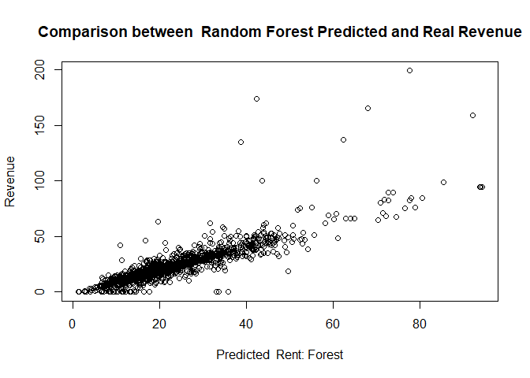

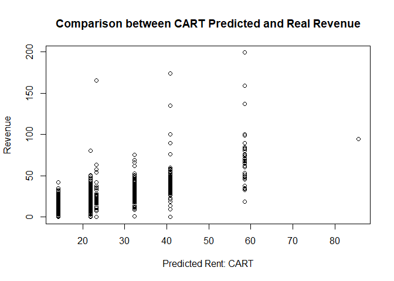

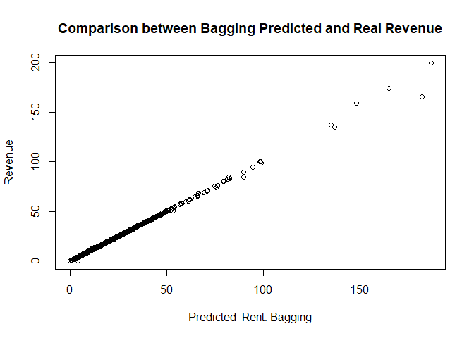

    ## Distribution not specified, assuming gaussian ...

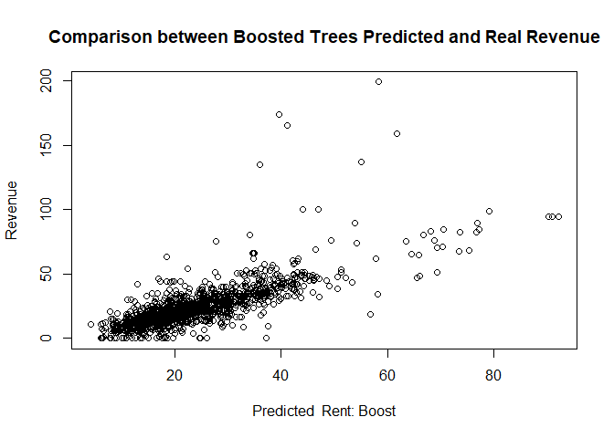

**Step 2 : Compare their RMSE to find out which one is the best
predictive model**

    ## RMSE of Linear Model is  11.46214

    ## RMSE of CART Model is  11.84696

    ## RMSE of Random Forest Model is  8.41229

    ## RMSE of Bagging Model is  0.7087992

    ## RMSE of Gradient Boosting is  10.60783

We compare all model’s RMSE , and it shows that Bagging model has the
lowest rmse, the second best model us Random Forest model.

Now we choose the 2 smallest RMSE model to calculate the k-fold
cross-validation standard error

    ## Random Forest 
    ## 
    ## 6256 samples
    ##   23 predictor
    ## 
    ## No pre-processing
    ## Resampling: Cross-Validated (10 fold) 
    ## Summary of sample sizes: 5630, 5630, 5631, 5631, 5630, 5630, ... 
    ## Resampling results across tuning parameters:
    ## 
    ##   mtry  RMSE      Rsquared   MAE     
    ##    2    8.605783  0.7001076  5.009610
    ##    9    7.223195  0.7840355  3.629031
    ##   16    7.387146  0.7763243  3.714357
    ## 
    ## RMSE was used to select the optimal model using the smallest value.
    ## The final value used for the model was mtry = 9.

    ## Bagged CART 
    ## 
    ## 6256 samples
    ##   23 predictor
    ## 
    ## No pre-processing
    ## Resampling: Cross-Validated (10 fold) 
    ## Summary of sample sizes: 5631, 5633, 5629, 5631, 5629, 5630, ... 
    ## Resampling results:
    ## 
    ##   RMSE      Rsquared  MAE     
    ##   9.940349  0.582486  6.313252

the result shows that Random\_forest\_model with mtry=9 is the best
prediction model

Then we try to know the importance of each variable
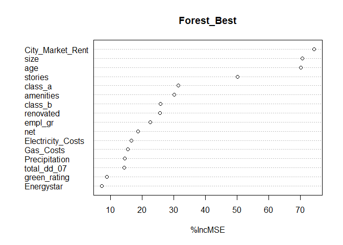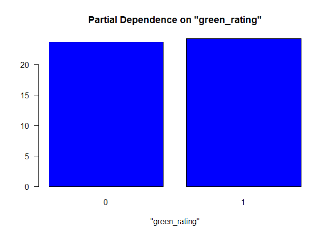
Because the random forest model is not a linear model, it’s hard to
measure the partial effect of green certification. As a result, we
decide to use the average partial of green rating to know more precise
effect of green certification on revenue.

We calculate the difference of predicted revenue on “green
certified”(dummy variable), then take the average of the difference We
can see that the average effect of green certification on the rent
income is almost 0.

    ## The average effect of green certification on the rent income is  0

**Step 3 : Conclusion**

The best predictive models for revenue is the Random Forest
Model.Holding all else fixed, the average change in rental income per
square foot related to green certification, is almost 0 dollars per
square foot.

# Question 4: Predictive Model Building: California Housing

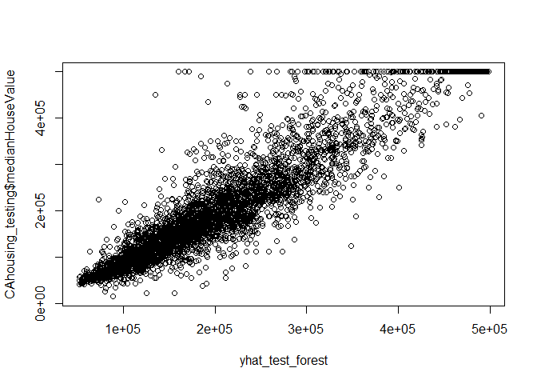

    ## RMSE of Random Forest is  48194.08

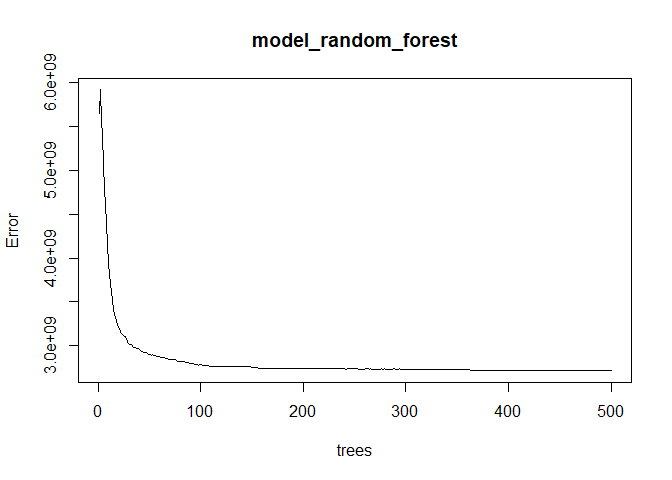

    ## Distribution not specified, assuming gaussian ...

Calculate the RMES of each model

    ## RMSE of RandomForest is  48194.08

    ## RMSE of bagging is  46795.07

    ## RMSE of CART is  78148.02

    ## RMSE of Boosting is  50866.76

We decide to choose model\_bagging as the best predictive model because
it has the smallest RMSE.

*Plot the pictures * The plot of the original data
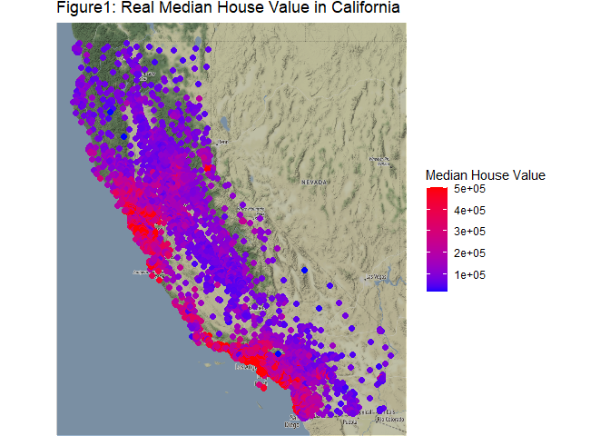 We
can see that in the California, the high actual median house value
usually located in the middle and south of the western coast of
California.

The plot of model’s prediction of median House value
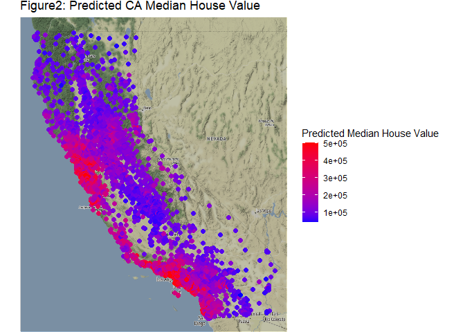
From the above figure, we can see that the distribution of predicted
value are very simliar to the real values.

The plot of model’s errors/residuals
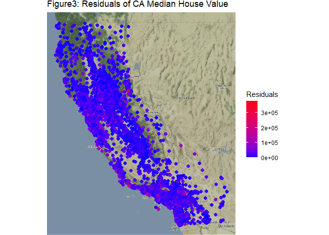 The
absolute values of errors are really low, so we can say that this is a
good model to predict

**Conclusion** Our predictive model works well, we can see that high
median value really located in the middle and south of the Western coast
of California.
