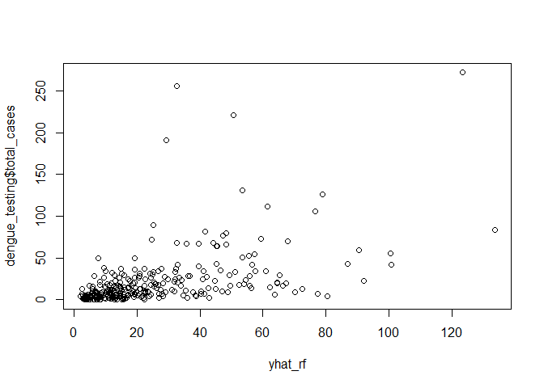
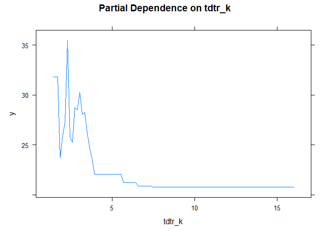
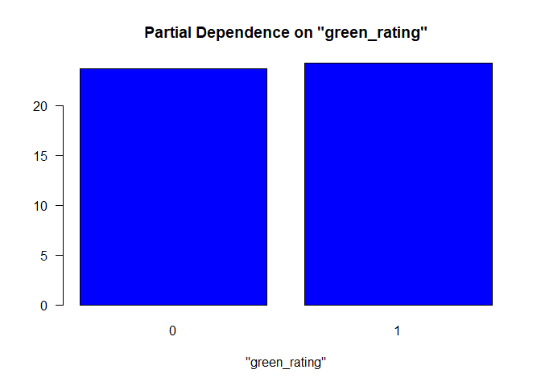

# Question 1 : What causes what?

## Problem 1: Why can’t I just get data from a few different cities and run the regression of “Crime” on “Police” to understand how more cops in the streets affect crime? (“Crime” refers to some measure of crime rate and “Police” measures the number of cops in a city.)

We could not just get data from a few different cities and run
regression of “Crime” on “Police” because in most cases, high-crime
cities have an incentive to hire a lot of cops, which adds confounders
in the analysis of the causal effect of cops on crime.

## Problem 2: How were the researchers from UPenn able to isolate this effect? Briefly describe their approach and discuss their result in the “Table 2” below, from the researchers’ paper.

They used the district and day fixed effect so they controlled their
analyses in Washington DC. In this situation, the researchers find an
example where they get a lot of police for reasons unrelated to crime to
explore whether there is a causal relationship between more police and
less crime.

They firstly regressed the daily total number of crimes in D.C. on the
high alert level, and secondly regressed the daily total number of
crimes in D.C. on both the high alert level and logged midday METRO
ridership. In the first regression (results in 1st column), the
coefficient -7.316 indicates that daily total number of crimes in D.C.
would decrease by about 7.3 on the high alert days and it is
statistically significant at the 5% level. In the second column (results
in 2nd column), after controlling the ridership, the coefficients
indicate that the coefficient of the high alert level drops to about
6.05, and the number of daily crimes in D.C. would increase by about 1.7
if Metro ridership increases by 10%, and this estimated coefficient is
statistically significant at 1% level. Since this increase is small, we
can learn that the change in ridership is not strongly correlated with
the change in the number of daily crimes in D.C. on high-alert days. We
can conclude that more police results in less crime.

## Problem 3: Why did they have to control for Metro ridership? What was that trying to capture?

Since after adding more cops, they made a hypothesis that the tourists
were less likely to visit Washington or to go out during that particular
time. Then they checked that hypothesis by looking at ridership levels
on the Metro system, and the number of tourists actually was not
diminished on high terror days, so they suggested the number of victims
was largely unchanged. They wanted to capture that the number of
tourists was the same during the high terror days, and then the
reductions of number of crimes was less likely to be related to the
number of tourists.

## Problem 4: Below I am showing you “Table 4” from the researchers’ paper. Just focus on the first column of the table. Can you describe the model being estimated here? What is the conclusion?

The model here describes the effect of high alerts in different
districts on the number of crimes. The regression tells us that the
expected number of daily crimes would decrease by about 2.62 in District
1 (the national mall) during the high alert days, and this estimated
coefficient is statistically significant at a 1% level. The expected
number of daily crimes would decrease by about 0.57 in other districts
but this estimated coefficient is not statistically significant at the
5% level. And in this case, the expected number of daily crimes in D.C.
would increase by about 0.024 if Metro ridership increases by 1%. Since
the coefficient of interaction between high-alert and District 1(the
national mall) is obviously larger than that between high-alert and
other districts, we could believe that the total crime decline during
high-alert periods is mainly concentrated in District 1.

# Question 2: Tree modeling: dengue cases

    ##   city season total_cases   ndvi_ne   ndvi_nw   ndvi_se   ndvi_sw
    ## 1   sj spring           4 0.1226000 0.1037250 0.1984833 0.1776167
    ## 2   sj spring           5 0.1699000 0.1421750 0.1623571 0.1554857
    ## 3   sj spring           4 0.0322500 0.1729667 0.1572000 0.1708429
    ## 4   sj spring           3 0.1286333 0.2450667 0.2275571 0.2358857
    ## 5   sj spring           6 0.1962000 0.2622000 0.2512000 0.2473400
    ## 6   sj summer           2        NA 0.1748500 0.2543143 0.1817429
    ##   precipitation_amt air_temp_k avg_temp_k dew_point_temp_k max_air_temp_k
    ## 1             12.42   297.5729   297.7429         292.4143          299.8
    ## 2             22.82   298.2114   298.4429         293.9514          300.9
    ## 3             34.54   298.7814   298.8786         295.4343          300.5
    ## 4             15.36   298.9871   299.2286         295.3100          301.4
    ## 5              7.52   299.5186   299.6643         295.8214          301.9
    ## 6              9.58   299.6300   299.7643         295.8514          302.4
    ##   min_air_temp_k precip_amt_kg_per_m2 relative_humidity_percent
    ## 1          295.9                32.00                  73.36571
    ## 2          296.4                17.94                  77.36857
    ## 3          297.3                26.10                  82.05286
    ## 4          297.0                13.90                  80.33714
    ## 5          297.5                12.20                  80.46000
    ## 6          298.1                26.49                  79.89143
    ##   specific_humidity   tdtr_k
    ## 1          14.01286 2.628571
    ## 2          15.37286 2.371429
    ## 3          16.84857 2.300000
    ## 4          16.67286 2.428571
    ## 5          17.21000 3.014286
    ## 6          17.21286 2.100000

    ##   city season total_cases   ndvi_ne   ndvi_nw   ndvi_se   ndvi_sw
    ## 1   sj spring           4 0.1226000 0.1037250 0.1984833 0.1776167
    ## 2   sj spring           5 0.1699000 0.1421750 0.1623571 0.1554857
    ## 3   sj spring           4 0.0322500 0.1729667 0.1572000 0.1708429
    ## 4   sj spring           3 0.1286333 0.2450667 0.2275571 0.2358857
    ## 5   sj spring           6 0.1962000 0.2622000 0.2512000 0.2473400
    ## 6   sj summer           2 0.1468334 0.1748500 0.2543143 0.1817429
    ##   precipitation_amt air_temp_k avg_temp_k dew_point_temp_k max_air_temp_k
    ## 1             12.42   297.5729   297.7429         292.4143          299.8
    ## 2             22.82   298.2114   298.4429         293.9514          300.9
    ## 3             34.54   298.7814   298.8786         295.4343          300.5
    ## 4             15.36   298.9871   299.2286         295.3100          301.4
    ## 5              7.52   299.5186   299.6643         295.8214          301.9
    ## 6              9.58   299.6300   299.7643         295.8514          302.4
    ##   min_air_temp_k precip_amt_kg_per_m2 relative_humidity_percent
    ## 1          295.9                32.00                  73.36571
    ## 2          296.4                17.94                  77.36857
    ## 3          297.3                26.10                  82.05286
    ## 4          297.0                13.90                  80.33714
    ## 5          297.5                12.20                  80.46000
    ## 6          298.1                26.49                  79.89143
    ##   specific_humidity   tdtr_k
    ## 1          14.01286 2.628571
    ## 2          15.37286 2.371429
    ## 3          16.84857 2.300000
    ## 4          16.67286 2.428571
    ## 5          17.21000 3.014286
    ## 6          17.21286 2.100000

    ## Distribution not specified, assuming gaussian ...

We predicted the dengue cases with CART model, Random Forest model and
Gradient-boosted model, and find the best model with lowest RMSE.

    ## The RMSE of CART model is  33.45982

    ## The RMSE of RandomForest model is  32.61906

    ## The RMSE of Gradient Boosting model is  31.09545

We also evaluate the performance of three models by comparing their MSE.

    ## Distribution not specified, assuming gaussian ...

    ## The MSE of CART Model is  1067.61

    ## The MSE of randomForest is  1044.275

    ## The MSE of Gradient Boosting is  937.041

Because the gradient-boosted model has the smallest out-of-sample RMSE
and MSE, we decided to choose it as the model to make partial dependence
plots

We choose “tdtr\_k” to make a partial dependence plots because we think
that if the DTR is bigger, it’s more difficult for mosquito to live as a
result, we want to know whether DTR affect the total dengue fever cases
and we can see that it has big influence on the infection cases.

# Question 3: Predictive model building: green certification

Our goal for this problem: find the best predictive model. The revenue
per square foot per calendar year and use this model to quantify the
average change in rental income per square foot(whether in absolute or
percentage terms) associated with green certification.

Step description Step1. Build many models Step2. Model selection(compare
the RMSE of every model and choose the best model) Step3. write the
report tells that why you choose this method, modeling choice and
conclusion

    ##   CS_PropertyID cluster   size empl_gr  Rent leasing_rate stories age renovated
    ## 1        379105       1 260300    2.22 38.56        91.39      14  16         0
    ## 2        122151       1  67861    2.22 28.57        87.14       5  27         0
    ## 3        379839       1 164848    2.22 33.31        88.94      13  36         1
    ## 4         94614       1  93372    2.22 35.00        97.04      13  46         1
    ## 5        379285       1 174307    2.22 40.69        96.58      16   5         0
    ## 6         94765       1 231633    2.22 43.16        92.74      14  20         0
    ##   class_a class_b LEED Energystar green_rating net amenities cd_total_07
    ## 1       1       0    0          1            1   0         1        4988
    ## 2       0       1    0          0            0   0         1        4988
    ## 3       0       1    0          0            0   0         1        4988
    ## 4       0       1    0          0            0   0         0        4988
    ## 5       1       0    0          0            0   0         1        4988
    ## 6       1       0    0          0            0   0         1        4988
    ##   hd_total07 total_dd_07 Precipitation  Gas_Costs Electricity_Costs
    ## 1         58        5046         42.57 0.01370000        0.02900000
    ## 2         58        5046         42.57 0.01373149        0.02904455
    ## 3         58        5046         42.57 0.01373149        0.02904455
    ## 4         58        5046         42.57 0.01373149        0.02904455
    ## 5         58        5046         42.57 0.01373149        0.02904455
    ## 6         58        5046         42.57 0.01373149        0.02904455
    ##   City_Market_Rent
    ## 1            36.78
    ## 2            36.78
    ## 3            36.78
    ## 4            36.78
    ## 5            36.78
    ## 6            36.78

**Step 1 : Build the model**

    ## Start:  AIC=29582.58
    ## revenue ~ (CS_PropertyID + cluster + size + empl_gr + Rent + 
    ##     leasing_rate + stories + age + renovated + class_a + class_b + 
    ##     LEED + Energystar + green_rating + net + amenities + cd_total_07 + 
    ##     hd_total07 + total_dd_07 + Precipitation + Gas_Costs + Electricity_Costs + 
    ##     City_Market_Rent) - cluster - CS_PropertyID - LEED - Rent - 
    ##     leasing_rate - cd_total_07 - hd_total07
    ## 
    ##                                      Df Sum of Sq     RSS   AIC
    ## + size:City_Market_Rent               1     35995  668006 29256
    ## + size:Electricity_Costs              1     27003  676998 29340
    ## + stories:City_Market_Rent            1     17677  686323 29425
    ## + stories:Electricity_Costs           1     10043  693957 29495
    ## + class_a:City_Market_Rent            1      7724  696276 29516
    ## + amenities:City_Market_Rent          1      5996  698005 29531
    ## + amenities:Electricity_Costs         1      4099  699902 29548
    ## + class_b:City_Market_Rent            1      3351  700649 29555
    ## + size:total_dd_07                    1      2985  701016 29558
    ## + age:City_Market_Rent                1      2874  701127 29559
    ## + Electricity_Costs:City_Market_Rent  1      2774  701227 29560
    ## + class_a:Electricity_Costs           1      2746  701254 29560
    ## + empl_gr:Electricity_Costs           1      2444  701556 29563
    ## + total_dd_07:Precipitation           1      1738  702263 29569
    ## + size:amenities                      1      1596  702405 29570
    ## + green_rating:amenities              1      1468  702532 29572
    ## + stories:total_dd_07                 1      1450  702550 29572
    ## + size:green_rating                   1      1353  702648 29573
    ## + class_b:Electricity_Costs           1      1255  702745 29573
    ## + size:net                            1      1217  702783 29574
    ## + size:Energystar                     1      1191  702809 29574
    ## + stories:green_rating                1      1173  702827 29574
    ## + size:class_b                        1      1164  702836 29574
    ## + Energystar:amenities                1      1155  702846 29574
    ## + empl_gr:class_a                     1      1083  702917 29575
    ## + stories:Energystar                  1      1071  702929 29575
    ## + amenities:total_dd_07               1      1061  702939 29575
    ## + empl_gr:Gas_Costs                   1      1059  702942 29575
    ## + stories:net                         1       989  703011 29576
    ## + stories:renovated                   1       952  703049 29576
    ## + renovated:Precipitation             1       932  703068 29576
    ## + empl_gr:class_b                     1       852  703148 29577
    ## + size:Gas_Costs                      1       819  703182 29577
    ## + stories:amenities                   1       800  703200 29577
    ## + net:Gas_Costs                       1       763  703237 29578
    ## + class_a:total_dd_07                 1       701  703299 29578
    ## + renovated:City_Market_Rent          1       658  703342 29579
    ## + class_a:amenities                   1       652  703348 29579
    ## + Gas_Costs:City_Market_Rent          1       649  703351 29579
    ## + Precipitation:Electricity_Costs     1       637  703364 29579
    ## + green_rating:City_Market_Rent       1       589  703411 29579
    ## + Energystar:City_Market_Rent         1       528  703472 29580
    ## + empl_gr:total_dd_07                 1       516  703484 29580
    ## + size:class_a                        1       507  703494 29580
    ## + amenities:Gas_Costs                 1       498  703503 29580
    ## + age:class_b                         1       467  703534 29580
    ## + green_rating:total_dd_07            1       462  703538 29580
    ## - stories                             1        13  704014 29581
    ## + net:Electricity_Costs               1       433  703567 29581
    ## - empl_gr                             1        20  704020 29581
    ## - Energystar                          1        39  704039 29581
    ## + empl_gr:amenities                   1       393  703607 29581
    ## + size:Precipitation                  1       390  703610 29581
    ## + size:renovated                      1       370  703631 29581
    ## + age:class_a                         1       369  703631 29581
    ## + Energystar:total_dd_07              1       359  703642 29581
    ## + green_rating:Electricity_Costs      1       348  703652 29581
    ## + amenities:Precipitation             1       345  703656 29582
    ## + age:green_rating                    1       326  703675 29582
    ## + Energystar:Electricity_Costs        1       317  703683 29582
    ## - Precipitation                       1       133  704134 29582
    ## + net:amenities                       1       317  703684 29582
    ## + green_rating:Precipitation          1       312  703688 29582
    ## - renovated                           1       156  704156 29582
    ## + stories:Gas_Costs                   1       273  703728 29582
    ## + class_a:green_rating                1       261  703739 29582
    ## + age:Electricity_Costs               1       259  703741 29582
    ## + size:stories                        1       259  703741 29582
    ## + class_a:Gas_Costs                   1       256  703744 29582
    ## + age:renovated                       1       234  703767 29582
    ## + Energystar:Precipitation            1       227  703773 29583
    ## <none>                                             704000 29583
    ## + age:Precipitation                   1       210  703790 29583
    ## + class_b:net                         1       204  703797 29583
    ## + class_a:net                         1       198  703803 29583
    ## - green_rating                        1       254  704254 29583
    ## + class_b:amenities                   1       196  703804 29583
    ## + class_b:green_rating                1       182  703818 29583
    ## + class_b:total_dd_07                 1       181  703819 29583
    ## + stories:age                         1       175  703825 29583
    ## + stories:class_a                     1       173  703827 29583
    ## + empl_gr:green_rating                1       163  703837 29583
    ## + empl_gr:Energystar                  1       161  703839 29583
    ## + renovated:net                       1       144  703856 29583
    ## - age                                 1       313  704313 29583
    ## + renovated:class_a                   1       136  703864 29583
    ## + renovated:amenities                 1       132  703868 29583
    ## + empl_gr:City_Market_Rent            1       117  703883 29584
    ## + empl_gr:age                         1       113  703887 29584
    ## + size:age                            1       110  703891 29584
    ## + class_a:Energystar                  1       105  703895 29584
    ## + empl_gr:Precipitation               1       100  703900 29584
    ## + renovated:total_dd_07               1        92  703908 29584
    ## + age:Energystar                      1        92  703909 29584
    ## + class_a:Precipitation               1        86  703915 29584
    ## + total_dd_07:Gas_Costs               1        80  703921 29584
    ## + Precipitation:City_Market_Rent      1        79  703922 29584
    ## + renovated:Electricity_Costs         1        65  703935 29584
    ## + renovated:class_b                   1        64  703936 29584
    ## + net:Precipitation                   1        59  703941 29584
    ## + class_b:Energystar                  1        55  703946 29584
    ## + empl_gr:renovated                   1        53  703947 29584
    ## + age:amenities                       1        46  703954 29584
    ## + green_rating:Gas_Costs              1        44  703957 29584
    ## + class_b:Gas_Costs                   1        43  703957 29584
    ## + age:net                             1        40  703960 29584
    ## + Precipitation:Gas_Costs             1        39  703962 29584
    ## + size:empl_gr                        1        38  703963 29584
    ## + renovated:Gas_Costs                 1        27  703973 29584
    ## + net:City_Market_Rent                1        22  703978 29584
    ## + empl_gr:net                         1        19  703981 29584
    ## + age:Gas_Costs                       1        18  703983 29584
    ## + Energystar:Gas_Costs                1        14  703987 29584
    ## + empl_gr:stories                     1        11  703990 29584
    ## + green_rating:net                    1         9  703991 29584
    ## + class_b:Precipitation               1         9  703991 29584
    ## + stories:class_b                     1         9  703991 29584
    ## + Energystar:net                      1         7  703994 29585
    ## + Gas_Costs:Electricity_Costs         1         5  703996 29585
    ## + renovated:green_rating              1         3  703997 29585
    ## + net:total_dd_07                     1         3  703998 29585
    ## + stories:Precipitation               1         3  703998 29585
    ## + total_dd_07:Electricity_Costs       1         2  703998 29585
    ## + total_dd_07:City_Market_Rent        1         1  704000 29585
    ## + age:total_dd_07                     1         1  704000 29585
    ## + renovated:Energystar                1         0  704000 29585
    ## - net                                 1      1287  705288 29592
    ## - Gas_Costs                           1      1980  705981 29598
    ## - amenities                           1      2822  706823 29606
    ## - Electricity_Costs                   1      4540  708541 29621
    ## - total_dd_07                         1      5234  709234 29627
    ## - class_b                             1      5546  709546 29630
    ## - size                                1      8268  712269 29654
    ## - class_a                             1      8774  712774 29658
    ## - City_Market_Rent                    1    393406 1097406 32358
    ## 
    ## Step:  AIC=29256.25
    ## revenue ~ size + empl_gr + stories + age + renovated + class_a + 
    ##     class_b + Energystar + green_rating + net + amenities + total_dd_07 + 
    ##     Precipitation + Gas_Costs + Electricity_Costs + City_Market_Rent + 
    ##     size:City_Market_Rent
    ## 
    ##                                      Df Sum of Sq    RSS   AIC
    ## + empl_gr:Electricity_Costs           1      1788 666218 29242
    ## + size:amenities                      1      1543 666462 29244
    ## + empl_gr:class_a                     1      1406 666600 29245
    ## + total_dd_07:City_Market_Rent        1      1366 666640 29245
    ## + stories:class_a                     1      1348 666658 29246
    ## + green_rating:amenities              1      1176 666830 29247
    ## + size:Precipitation                  1      1161 666845 29247
    ## + size:stories                        1      1127 666879 29248
    ## + empl_gr:class_b                     1      1059 666947 29248
    ## + stories:Precipitation               1       941 667065 29249
    ## + Energystar:amenities                1       931 667075 29250
    ## + class_a:Precipitation               1       836 667170 29250
    ## + Precipitation:City_Market_Rent      1       727 667279 29251
    ## + size:Electricity_Costs              1       693 667313 29252
    ## + renovated:Precipitation             1       688 667318 29252
    ## + stories:City_Market_Rent            1       678 667328 29252
    ## + stories:class_b                     1       650 667356 29252
    ## + empl_gr:total_dd_07                 1       647 667359 29252
    ## + size:class_a                        1       641 667365 29252
    ## + empl_gr:Gas_Costs                   1       640 667365 29252
    ## + stories:amenities                   1       630 667376 29252
    ## + class_a:amenities                   1       623 667382 29252
    ## + renovated:City_Market_Rent          1       606 667400 29253
    ## + age:City_Market_Rent                1       547 667459 29253
    ## + stories:Energystar                  1       496 667509 29254
    ## + amenities:Gas_Costs                 1       496 667510 29254
    ## + stories:green_rating                1       490 667515 29254
    ## + Electricity_Costs:City_Market_Rent  1       474 667532 29254
    ## + amenities:Precipitation             1       474 667532 29254
    ## + size:green_rating                   1       469 667537 29254
    ## + empl_gr:amenities                   1       458 667548 29254
    ## + size:Energystar                     1       445 667560 29254
    ## + amenities:Electricity_Costs         1       436 667570 29254
    ## + net:Gas_Costs                       1       434 667572 29254
    ## + total_dd_07:Electricity_Costs       1       429 667577 29254
    ## - Precipitation                       1        22 668028 29255
    ## - Energystar                          1        52 668058 29255
    ## + empl_gr:City_Market_Rent            1       349 667656 29255
    ## + Gas_Costs:City_Market_Rent          1       340 667666 29255
    ## + size:empl_gr                        1       338 667667 29255
    ## + size:renovated                      1       315 667691 29255
    ## + class_b:Precipitation               1       312 667694 29255
    ## + net:City_Market_Rent                1       306 667699 29255
    ## + size:age                            1       302 667704 29255
    ## - empl_gr                             1       139 668145 29256
    ## + green_rating:Precipitation          1       265 667741 29256
    ## + class_b:amenities                   1       257 667748 29256
    ## + age:green_rating                    1       248 667758 29256
    ## + empl_gr:Precipitation               1       230 667776 29256
    ## <none>                                            668006 29256
    ## + green_rating:City_Market_Rent       1       208 667798 29256
    ## + Energystar:Precipitation            1       197 667808 29256
    ## + empl_gr:age                         1       197 667809 29256
    ## + green_rating:total_dd_07            1       192 667814 29256
    ## + renovated:total_dd_07               1       191 667815 29257
    ## + total_dd_07:Precipitation           1       187 667818 29257
    ## + Precipitation:Gas_Costs             1       179 667827 29257
    ## + size:class_b                        1       174 667832 29257
    ## + Energystar:City_Market_Rent         1       168 667838 29257
    ## + green_rating:Electricity_Costs      1       165 667841 29257
    ## + net:total_dd_07                     1       163 667843 29257
    ## + empl_gr:green_rating                1       157 667848 29257
    ## + empl_gr:Energystar                  1       157 667849 29257
    ## + Energystar:Electricity_Costs        1       150 667855 29257
    ## + amenities:total_dd_07               1       150 667856 29257
    ## + age:total_dd_07                     1       150 667856 29257
    ## + class_a:Gas_Costs                   1       142 667864 29257
    ## + age:Precipitation                   1       139 667867 29257
    ## + renovated:class_b                   1       138 667868 29257
    ## + Energystar:total_dd_07              1       137 667869 29257
    ## + class_a:total_dd_07                 1       137 667869 29257
    ## - renovated                           1       291 668297 29257
    ## + size:total_dd_07                    1       116 667890 29257
    ## + class_a:green_rating                1       107 667899 29257
    ## + age:renovated                       1       101 667904 29257
    ## - green_rating                        1       326 668332 29257
    ## + net:amenities                       1       100 667906 29257
    ## + net:Electricity_Costs               1        87 667919 29257
    ## + renovated:Gas_Costs                 1        68 667937 29258
    ## + empl_gr:stories                     1        64 667941 29258
    ## + green_rating:Gas_Costs              1        64 667942 29258
    ## + class_b:green_rating                1        61 667945 29258
    ## + empl_gr:renovated                   1        60 667945 29258
    ## + Precipitation:Electricity_Costs     1        60 667946 29258
    ## + age:class_b                         1        53 667953 29258
    ## + age:Energystar                      1        49 667956 29258
    ## + Gas_Costs:Electricity_Costs         1        48 667958 29258
    ## + size:net                            1        47 667959 29258
    ## + stories:net                         1        45 667960 29258
    ## + age:Electricity_Costs               1        45 667961 29258
    ## + amenities:City_Market_Rent          1        43 667963 29258
    ## + class_b:total_dd_07                 1        40 667966 29258
    ## + stories:Electricity_Costs           1        38 667968 29258
    ## + renovated:Electricity_Costs         1        35 667970 29258
    ## + stories:Gas_Costs                   1        35 667971 29258
    ## + stories:renovated                   1        32 667974 29258
    ## + class_b:net                         1        30 667976 29258
    ## + class_a:net                         1        29 667977 29258
    ## + empl_gr:net                         1        28 667977 29258
    ## - stories                             1       401 668407 29258
    ## - net                                 1       402 668408 29258
    ## + Energystar:Gas_Costs                1        24 667982 29258
    ## + stories:age                         1        23 667983 29258
    ## + class_a:Energystar                  1        22 667983 29258
    ## + total_dd_07:Gas_Costs               1        21 667985 29258
    ## + age:class_a                         1        19 667987 29258
    ## + renovated:amenities                 1        18 667988 29258
    ## + age:net                             1        16 667990 29258
    ## + class_b:City_Market_Rent            1        15 667991 29258
    ## + renovated:green_rating              1        15 667991 29258
    ## + age:amenities                       1        13 667993 29258
    ## + stories:total_dd_07                 1         9 667997 29258
    ## + class_a:Electricity_Costs           1         7 667999 29258
    ## + renovated:class_a                   1         6 668000 29258
    ## + renovated:Energystar                1         6 668000 29258
    ## + net:Precipitation                   1         5 668001 29258
    ## + class_b:Energystar                  1         3 668002 29258
    ## + green_rating:net                    1         3 668003 29258
    ## + class_a:City_Market_Rent            1         2 668004 29258
    ## + class_b:Electricity_Costs           1         1 668005 29258
    ## + size:Gas_Costs                      1         1 668005 29258
    ## + renovated:net                       1         1 668005 29258
    ## + class_b:Gas_Costs                   1         0 668005 29258
    ## + Energystar:net                      1         0 668006 29258
    ## + age:Gas_Costs                       1         0 668006 29258
    ## - age                                 1       658 668664 29260
    ## - Gas_Costs                           1       715 668721 29261
    ## - Electricity_Costs                   1      1423 669429 29268
    ## - total_dd_07                         1      1870 669876 29272
    ## - amenities                           1      2974 670980 29282
    ## - class_b                             1      5758 673763 29308
    ## - class_a                             1      7802 675807 29327
    ## - size:City_Market_Rent               1     35995 704000 29583
    ## 
    ## Step:  AIC=29241.48
    ## revenue ~ size + empl_gr + stories + age + renovated + class_a + 
    ##     class_b + Energystar + green_rating + net + amenities + total_dd_07 + 
    ##     Precipitation + Gas_Costs + Electricity_Costs + City_Market_Rent + 
    ##     size:City_Market_Rent + empl_gr:Electricity_Costs
    ## 
    ##                                      Df Sum of Sq    RSS   AIC
    ## + total_dd_07:City_Market_Rent        1      1838 664380 29226
    ## + size:amenities                      1      1523 664695 29229
    ## + stories:class_a                     1      1452 664766 29230
    ## + size:Precipitation                  1      1322 664895 29231
    ## + size:stories                        1      1185 665033 29232
    ## + empl_gr:class_a                     1      1130 665088 29233
    ## + green_rating:amenities              1      1116 665101 29233
    ## + stories:Precipitation               1      1042 665175 29234
    ## + empl_gr:class_b                     1       977 665240 29234
    ## + Energystar:amenities                1       886 665331 29235
    ## + class_a:Precipitation               1       868 665349 29235
    ## + Precipitation:City_Market_Rent      1       852 665365 29236
    ## + stories:City_Market_Rent            1       806 665412 29236
    ## + class_a:amenities                   1       773 665444 29236
    ## + age:City_Market_Rent                1       695 665522 29237
    ## + size:class_a                        1       694 665523 29237
    ## + size:Electricity_Costs              1       690 665528 29237
    ## + renovated:Precipitation             1       681 665536 29237
    ## + stories:class_b                     1       668 665550 29237
    ## + stories:amenities                   1       655 665562 29237
    ## + size:empl_gr                        1       579 665639 29238
    ## + renovated:City_Market_Rent          1       577 665641 29238
    ## + empl_gr:Precipitation               1       537 665680 29238
    ## + Gas_Costs:City_Market_Rent          1       534 665684 29239
    ## + amenities:Precipitation             1       499 665718 29239
    ## + stories:Energystar                  1       498 665719 29239
    ## + net:Gas_Costs                       1       482 665735 29239
    ## + stories:green_rating                1       481 665736 29239
    ## + size:green_rating                   1       442 665775 29239
    ## + amenities:Electricity_Costs         1       440 665778 29239
    ## + size:Energystar                     1       429 665788 29239
    ## + net:City_Market_Rent                1       387 665830 29240
    ## + class_b:Precipitation               1       379 665839 29240
    ## - Energystar                          1        49 666267 29240
    ## + green_rating:Precipitation          1       368 665849 29240
    ## + empl_gr:amenities                   1       340 665878 29240
    ## + size:renovated                      1       338 665879 29240
    ## + amenities:Gas_Costs                 1       329 665889 29240
    ## + green_rating:City_Market_Rent       1       328 665890 29240
    ## + total_dd_07:Electricity_Costs       1       322 665895 29241
    ## - Precipitation                       1       112 666329 29241
    ## + Energystar:Precipitation            1       291 665926 29241
    ## + size:age                            1       283 665935 29241
    ## + Electricity_Costs:City_Market_Rent  1       281 665937 29241
    ## + class_b:amenities                   1       280 665937 29241
    ## + Energystar:City_Market_Rent         1       274 665944 29241
    ## + age:green_rating                    1       254 665963 29241
    ## + empl_gr:green_rating                1       242 665975 29241
    ## + empl_gr:Energystar                  1       241 665976 29241
    ## + Precipitation:Electricity_Costs     1       238 665980 29241
    ## + amenities:total_dd_07               1       231 665987 29241
    ## + class_a:total_dd_07                 1       222 665996 29241
    ## <none>                                            666218 29242
    ## + renovated:total_dd_07               1       212 666005 29242
    ## + net:total_dd_07                     1       201 666017 29242
    ## + green_rating:total_dd_07            1       198 666020 29242
    ## + empl_gr:stories                     1       196 666021 29242
    ## + size:class_b                        1       189 666028 29242
    ## + green_rating:Electricity_Costs      1       171 666047 29242
    ## + Energystar:Electricity_Costs        1       160 666057 29242
    ## + class_a:Gas_Costs                   1       151 666066 29242
    ## + Energystar:total_dd_07              1       144 666074 29242
    ## + renovated:class_b                   1       140 666078 29242
    ## + age:Precipitation                   1       136 666082 29242
    ## + size:total_dd_07                    1       131 666086 29242
    ## - green_rating                        1       302 666520 29242
    ## + empl_gr:net                         1       119 666098 29242
    ## + age:total_dd_07                     1       105 666112 29243
    ## + class_a:green_rating                1        92 666126 29243
    ## + net:Electricity_Costs               1        89 666129 29243
    ## - net                                 1       341 666559 29243
    ## + age:renovated                       1        82 666136 29243
    ## + renovated:Gas_Costs                 1        80 666138 29243
    ## + green_rating:Gas_Costs              1        79 666138 29243
    ## + Precipitation:Gas_Costs             1        78 666139 29243
    ## + net:amenities                       1        71 666146 29243
    ## + class_b:total_dd_07                 1        67 666150 29243
    ## - stories                             1       365 666582 29243
    ## + age:class_b                         1        61 666157 29243
    ## + stories:Gas_Costs                   1        53 666165 29243
    ## + class_b:green_rating                1        52 666165 29243
    ## + age:Energystar                      1        52 666166 29243
    ## + empl_gr:age                         1        50 666167 29243
    ## - renovated                           1       376 666594 29243
    ## + empl_gr:Gas_Costs                   1        46 666171 29243
    ## + stories:Electricity_Costs           1        42 666176 29243
    ## + size:net                            1        40 666177 29243
    ## + Energystar:Gas_Costs                1        39 666179 29243
    ## + amenities:City_Market_Rent          1        35 666182 29243
    ## + renovated:Electricity_Costs         1        34 666184 29243
    ## + stories:net                         1        33 666184 29243
    ## + class_a:Electricity_Costs           1        25 666192 29243
    ## + stories:renovated                   1        22 666195 29243
    ## + class_b:net                         1        21 666197 29243
    ## + age:Electricity_Costs               1        21 666197 29243
    ## + empl_gr:renovated                   1        19 666198 29243
    ## + age:class_a                         1        18 666199 29243
    ## + class_a:net                         1        17 666201 29243
    ## + class_a:Energystar                  1        16 666202 29243
    ## + stories:age                         1        15 666203 29243
    ## + renovated:green_rating              1        14 666204 29243
    ## + renovated:amenities                 1        14 666204 29243
    ## + total_dd_07:Precipitation           1        12 666205 29243
    ## + net:Precipitation                   1        12 666206 29243
    ## + age:net                             1        11 666206 29243
    ## + stories:total_dd_07                 1         9 666208 29243
    ## + class_b:Electricity_Costs           1         8 666210 29243
    ## + class_b:City_Market_Rent            1         7 666211 29243
    ## + class_a:City_Market_Rent            1         7 666211 29243
    ## + renovated:class_a                   1         6 666212 29243
    ## + renovated:Energystar                1         5 666212 29243
    ## + age:amenities                       1         5 666213 29243
    ## + empl_gr:total_dd_07                 1         2 666216 29244
    ## + total_dd_07:Gas_Costs               1         1 666216 29244
    ## + class_b:Energystar                  1         1 666216 29244
    ## + Gas_Costs:Electricity_Costs         1         1 666216 29244
    ## + class_b:Gas_Costs                   1         1 666217 29244
    ## + green_rating:net                    1         0 666217 29244
    ## + age:Gas_Costs                       1         0 666217 29244
    ## + Energystar:net                      1         0 666217 29244
    ## + size:Gas_Costs                      1         0 666217 29244
    ## + empl_gr:City_Market_Rent            1         0 666217 29244
    ## + renovated:net                       1         0 666218 29244
    ## - age                                 1       789 667007 29247
    ## - Gas_Costs                           1       798 667015 29247
    ## - total_dd_07                         1       907 667125 29248
    ## - empl_gr:Electricity_Costs           1      1788 668006 29256
    ## - amenities                           1      3333 669550 29271
    ## - class_b                             1      5396 671613 29290
    ## - class_a                             1      7547 673764 29310
    ## - size:City_Market_Rent               1     35339 701556 29563
    ## 
    ## Step:  AIC=29226.2
    ## revenue ~ size + empl_gr + stories + age + renovated + class_a + 
    ##     class_b + Energystar + green_rating + net + amenities + total_dd_07 + 
    ##     Precipitation + Gas_Costs + Electricity_Costs + City_Market_Rent + 
    ##     size:City_Market_Rent + empl_gr:Electricity_Costs + total_dd_07:City_Market_Rent
    ## 
    ##                                      Df Sum of Sq    RSS   AIC
    ## + size:amenities                      1      1529 662851 29214
    ## + size:Precipitation                  1      1373 663007 29215
    ## + stories:class_a                     1      1351 663029 29216
    ## + size:stories                        1      1222 663158 29217
    ## + empl_gr:class_a                     1      1178 663202 29217
    ## + green_rating:amenities              1      1178 663202 29217
    ## + stories:Precipitation               1      1042 663338 29218
    ## + empl_gr:class_b                     1      1028 663351 29219
    ## + Energystar:amenities                1       960 663420 29219
    ## + class_a:amenities                   1       789 663591 29221
    ## + size:Electricity_Costs              1       754 663626 29221
    ## + class_a:Precipitation               1       705 663675 29222
    ## + size:class_a                        1       656 663724 29222
    ## + stories:amenities                   1       649 663731 29222
    ## + size:empl_gr                        1       624 663756 29222
    ## + stories:class_b                     1       582 663798 29223
    ## + empl_gr:Precipitation               1       555 663825 29223
    ## + amenities:Precipitation             1       535 663845 29223
    ## + renovated:City_Market_Rent          1       481 663899 29224
    ## + renovated:Precipitation             1       466 663914 29224
    ## + stories:Energystar                  1       445 663935 29224
    ## + stories:green_rating                1       429 663951 29224
    ## + amenities:Gas_Costs                 1       419 663961 29224
    ## + green_rating:Precipitation          1       412 663968 29224
    ## + net:Gas_Costs                       1       400 663980 29224
    ## + amenities:Electricity_Costs         1       399 663981 29224
    ## + size:green_rating                   1       380 664000 29225
    ## - Energystar                          1        57 664437 29225
    ## + size:Energystar                     1       367 664013 29225
    ## + stories:City_Market_Rent            1       367 664013 29225
    ## - Precipitation                       1        63 664443 29225
    ## + empl_gr:amenities                   1       353 664027 29225
    ## + size:renovated                      1       341 664039 29225
    ## + total_dd_07:Precipitation           1       338 664042 29225
    ## + class_b:Precipitation               1       326 664054 29225
    ## + Energystar:Precipitation            1       323 664056 29225
    ## + class_b:amenities                   1       297 664083 29225
    ## + size:age                            1       293 664087 29225
    ## + net:City_Market_Rent                1       277 664103 29226
    ## + empl_gr:green_rating                1       266 664114 29226
    ## + empl_gr:Energystar                  1       264 664116 29226
    ## + age:total_dd_07                     1       257 664123 29226
    ## + amenities:total_dd_07               1       254 664126 29226
    ## + age:green_rating                    1       237 664143 29226
    ## + age:City_Market_Rent                1       230 664150 29226
    ## + size:total_dd_07                    1       215 664165 29226
    ## <none>                                            664380 29226
    ## + empl_gr:stories                     1       191 664189 29226
    ## + renovated:class_b                   1       166 664214 29227
    ## + class_a:Gas_Costs                   1       165 664215 29227
    ## + size:class_b                        1       163 664217 29227
    ## + green_rating:total_dd_07            1       154 664226 29227
    ## + age:Electricity_Costs               1       151 664229 29227
    ## + green_rating:City_Market_Rent       1       148 664232 29227
    ## + net:total_dd_07                     1       147 664233 29227
    ## + empl_gr:total_dd_07                 1       129 664251 29227
    ## + stories:Electricity_Costs           1       117 664263 29227
    ## - green_rating                        1       309 664689 29227
    ## + age:Precipitation                   1       107 664273 29227
    ## + class_a:green_rating                1       106 664274 29227
    ## + Energystar:City_Market_Rent         1       105 664275 29227
    ## + Energystar:total_dd_07              1       104 664276 29227
    ## + renovated:Gas_Costs                 1       102 664278 29227
    ## + empl_gr:net                         1       100 664280 29227
    ## + green_rating:Electricity_Costs      1       100 664280 29227
    ## - net                                 1       329 664709 29227
    ## + class_b:City_Market_Rent            1        92 664288 29227
    ## + Energystar:Electricity_Costs        1        91 664289 29227
    ## + net:Electricity_Costs               1        89 664290 29227
    ## + age:class_b                         1        89 664291 29227
    ## + class_a:total_dd_07                 1        88 664291 29227
    ## + green_rating:Gas_Costs              1        84 664296 29227
    ## + renovated:total_dd_07               1        80 664300 29227
    ## - renovated                           1       348 664728 29228
    ## + empl_gr:age                         1        71 664309 29228
    ## + age:renovated                       1        70 664310 29228
    ## + net:amenities                       1        68 664312 29228
    ## + class_b:green_rating                1        62 664318 29228
    ## + age:Energystar                      1        51 664329 29228
    ## + empl_gr:Gas_Costs                   1        46 664334 29228
    ## + stories:total_dd_07                 1        46 664334 29228
    ## + Electricity_Costs:City_Market_Rent  1        44 664336 29228
    ## + total_dd_07:Electricity_Costs       1        42 664338 29228
    ## + Energystar:Gas_Costs                1        40 664340 29228
    ## + size:net                            1        39 664341 29228
    ## + stories:net                         1        32 664348 29228
    ## + stories:Gas_Costs                   1        31 664349 29228
    ## + stories:renovated                   1        28 664352 29228
    ## + class_a:City_Market_Rent            1        26 664354 29228
    ## + class_a:Energystar                  1        26 664354 29228
    ## + Precipitation:Gas_Costs             1        24 664356 29228
    ## + renovated:green_rating              1        23 664357 29228
    ## + empl_gr:renovated                   1        19 664361 29228
    ## + Precipitation:City_Market_Rent      1        18 664362 29228
    ## + class_b:total_dd_07                 1        17 664363 29228
    ## + stories:age                         1        17 664363 29228
    ## + class_b:net                         1        16 664364 29228
    ## + Gas_Costs:Electricity_Costs         1        14 664366 29228
    ## + renovated:amenities                 1        13 664367 29228
    ## + renovated:Electricity_Costs         1        12 664368 29228
    ## + renovated:Energystar                1        11 664369 29228
    ## + class_a:net                         1        11 664369 29228
    ## + age:amenities                       1        10 664370 29228
    ## + age:net                             1         8 664372 29228
    ## + empl_gr:City_Market_Rent            1         5 664375 29228
    ## + class_b:Energystar                  1         4 664376 29228
    ## + amenities:City_Market_Rent          1         4 664376 29228
    ## + net:Precipitation                   1         4 664376 29228
    ## + Gas_Costs:City_Market_Rent          1         3 664377 29228
    ## + total_dd_07:Gas_Costs               1         2 664378 29228
    ## + age:class_a                         1         2 664378 29228
    ## + Energystar:net                      1         2 664378 29228
    ## + renovated:class_a                   1         1 664379 29228
    ## + class_b:Gas_Costs                   1         1 664379 29228
    ## + age:Gas_Costs                       1         1 664379 29228
    ## + Precipitation:Electricity_Costs     1         1 664379 29228
    ## + class_b:Electricity_Costs           1         0 664379 29228
    ## + size:Gas_Costs                      1         0 664379 29228
    ## + class_a:Electricity_Costs           1         0 664380 29228
    ## + green_rating:net                    1         0 664380 29228
    ## + renovated:net                       1         0 664380 29228
    ## - stories                             1       461 664841 29229
    ## - age                                 1       952 665332 29233
    ## - Gas_Costs                           1      1248 665628 29236
    ## - total_dd_07:City_Market_Rent        1      1838 666218 29242
    ## - empl_gr:Electricity_Costs           1      2260 666640 29245
    ## - amenities                           1      3620 668000 29258
    ## - class_b                             1      5369 669749 29275
    ## - class_a                             1      7174 671554 29291
    ## - size:City_Market_Rent               1     37118 701498 29564
    ## 
    ## Step:  AIC=29213.78
    ## revenue ~ size + empl_gr + stories + age + renovated + class_a + 
    ##     class_b + Energystar + green_rating + net + amenities + total_dd_07 + 
    ##     Precipitation + Gas_Costs + Electricity_Costs + City_Market_Rent + 
    ##     size:City_Market_Rent + empl_gr:Electricity_Costs + total_dd_07:City_Market_Rent + 
    ##     size:amenities
    ## 
    ##                                      Df Sum of Sq    RSS   AIC
    ## + size:Precipitation                  1      1148 661703 29205
    ## + empl_gr:class_a                     1      1065 661786 29206
    ## + green_rating:amenities              1      1012 661839 29206
    ## + empl_gr:class_b                     1       936 661915 29207
    ## + stories:Precipitation               1       921 661930 29207
    ## + stories:class_a                     1       898 661953 29207
    ## + Energystar:amenities                1       835 662016 29208
    ## + class_a:Precipitation               1       687 662164 29209
    ## + size:Electricity_Costs              1       679 662172 29209
    ## + size:stories                        1       640 662211 29210
    ## + empl_gr:Precipitation               1       570 662281 29210
    ## + renovated:City_Market_Rent          1       562 662289 29211
    ## + stories:City_Market_Rent            1       556 662295 29211
    ## + size:empl_gr                        1       519 662332 29211
    ## + amenities:Gas_Costs                 1       506 662345 29211
    ## + renovated:Precipitation             1       506 662345 29211
    ## + size:age                            1       484 662367 29211
    ## + size:renovated                      1       432 662419 29212
    ## + green_rating:Precipitation          1       402 662449 29212
    ## + net:Gas_Costs                       1       396 662455 29212
    ## - Energystar                          1        45 662896 29212
    ## + stories:green_rating                1       378 662473 29212
    ## + stories:Energystar                  1       372 662479 29212
    ## - Precipitation                       1        57 662908 29212
    ## + stories:class_b                     1       353 662498 29213
    ## + size:green_rating                   1       351 662500 29213
    ## + class_b:Precipitation               1       345 662506 29213
    ## + amenities:Electricity_Costs         1       338 662513 29213
    ## + amenities:Precipitation             1       327 662524 29213
    ## + empl_gr:amenities                   1       320 662531 29213
    ## + Energystar:Precipitation            1       318 662532 29213
    ## + total_dd_07:Precipitation           1       318 662533 29213
    ## + size:Energystar                     1       303 662548 29213
    ## + size:class_a                        1       284 662567 29213
    ## + net:City_Market_Rent                1       282 662569 29213
    ## + age:total_dd_07                     1       277 662574 29213
    ## + age:green_rating                    1       251 662600 29213
    ## + empl_gr:green_rating                1       236 662615 29214
    ## + empl_gr:Energystar                  1       234 662617 29214
    ## <none>                                            662851 29214
    ## + size:total_dd_07                    1       205 662646 29214
    ## + empl_gr:total_dd_07                 1       181 662670 29214
    ## + age:City_Market_Rent                1       179 662672 29214
    ## - net                                 1       245 663096 29214
    ## + class_a:amenities                   1       178 662672 29214
    ## + age:Electricity_Costs               1       178 662673 29214
    ## + renovated:class_b                   1       173 662678 29214
    ## + net:total_dd_07                     1       165 662686 29214
    ## + green_rating:total_dd_07            1       151 662700 29214
    ## - green_rating                        1       274 663125 29214
    ## + class_a:Gas_Costs                   1       149 662702 29214
    ## + empl_gr:stories                     1       141 662710 29215
    ## + class_b:City_Market_Rent            1       141 662710 29215
    ## - stories                             1       284 663135 29215
    ## + green_rating:City_Market_Rent       1       130 662721 29215
    ## + age:Precipitation                   1       123 662728 29215
    ## + amenities:total_dd_07               1       119 662732 29215
    ## + renovated:Gas_Costs                 1       114 662737 29215
    ## + Energystar:total_dd_07              1       101 662750 29215
    ## + class_a:green_rating                1        91 662760 29215
    ## + Energystar:City_Market_Rent         1        91 662760 29215
    ## + renovated:total_dd_07               1        90 662761 29215
    ## + age:class_b                         1        88 662763 29215
    ## + green_rating:Electricity_Costs      1        84 662767 29215
    ## + age:amenities                       1        81 662770 29215
    ## + net:Electricity_Costs               1        79 662772 29215
    ## + empl_gr:net                         1        79 662772 29215
    ## + class_a:City_Market_Rent            1        76 662775 29215
    ## + green_rating:Gas_Costs              1        75 662776 29215
    ## + empl_gr:Gas_Costs                   1        74 662777 29215
    ## + Energystar:Electricity_Costs        1        74 662777 29215
    ## + empl_gr:age                         1        70 662781 29215
    ## + stories:age                         1        70 662781 29215
    ## + class_a:total_dd_07                 1        57 662794 29215
    ## + stories:Electricity_Costs           1        54 662797 29215
    ## - renovated                           1       370 663221 29215
    ## + age:Energystar                      1        52 662799 29215
    ## + total_dd_07:Electricity_Costs       1        51 662800 29215
    ## + class_b:green_rating                1        50 662801 29215
    ## + class_b:amenities                   1        50 662801 29215
    ## + age:renovated                       1        48 662803 29215
    ## + net:amenities                       1        46 662805 29215
    ## + Energystar:Gas_Costs                1        42 662809 29215
    ## + Electricity_Costs:City_Market_Rent  1        40 662811 29215
    ## + stories:amenities                   1        38 662813 29215
    ## + size:class_b                        1        30 662821 29216
    ## + stories:total_dd_07                 1        28 662823 29216
    ## + renovated:amenities                 1        26 662825 29216
    ## + empl_gr:renovated                   1        25 662826 29216
    ## + Gas_Costs:Electricity_Costs         1        25 662826 29216
    ## + renovated:green_rating              1        20 662831 29216
    ## + stories:Gas_Costs                   1        19 662832 29216
    ## + Precipitation:Gas_Costs             1        18 662833 29216
    ## + class_a:Energystar                  1        17 662834 29216
    ## + renovated:Electricity_Costs         1        16 662835 29216
    ## + amenities:City_Market_Rent          1        14 662837 29216
    ## + class_b:total_dd_07                 1        11 662840 29216
    ## + size:net                            1        11 662840 29216
    ## + renovated:Energystar                1        10 662841 29216
    ## + stories:net                         1         8 662843 29216
    ## + class_b:net                         1         8 662843 29216
    ## + stories:renovated                   1         7 662844 29216
    ## + Gas_Costs:City_Market_Rent          1         6 662845 29216
    ## + class_a:Electricity_Costs           1         6 662845 29216
    ## + age:net                             1         5 662846 29216
    ## + net:Precipitation                   1         5 662846 29216
    ## + class_a:net                         1         4 662847 29216
    ## + class_b:Electricity_Costs           1         3 662848 29216
    ## + Precipitation:City_Market_Rent      1         3 662848 29216
    ## + empl_gr:City_Market_Rent            1         2 662849 29216
    ## + class_b:Gas_Costs                   1         2 662849 29216
    ## + Energystar:net                      1         2 662849 29216
    ## + class_b:Energystar                  1         1 662850 29216
    ## + size:Gas_Costs                      1         1 662850 29216
    ## + age:Gas_Costs                       1         1 662850 29216
    ## + age:class_a                         1         1 662850 29216
    ## + total_dd_07:Gas_Costs               1         1 662850 29216
    ## + renovated:class_a                   1         1 662850 29216
    ## + renovated:net                       1         0 662850 29216
    ## + Precipitation:Electricity_Costs     1         0 662851 29216
    ## + green_rating:net                    1         0 662851 29216
    ## - age                                 1      1000 663851 29221
    ## - Gas_Costs                           1      1276 664127 29224
    ## - size:amenities                      1      1529 664380 29226
    ## - total_dd_07:City_Market_Rent        1      1844 664695 29229
    ## - empl_gr:Electricity_Costs           1      2238 665089 29233
    ## - class_b                             1      4439 667290 29254
    ## - class_a                             1      5684 668534 29265
    ## - size:City_Market_Rent               1     37075 699926 29552
    ## 
    ## Step:  AIC=29204.94
    ## revenue ~ size + empl_gr + stories + age + renovated + class_a + 
    ##     class_b + Energystar + green_rating + net + amenities + total_dd_07 + 
    ##     Precipitation + Gas_Costs + Electricity_Costs + City_Market_Rent + 
    ##     size:City_Market_Rent + empl_gr:Electricity_Costs + total_dd_07:City_Market_Rent + 
    ##     size:amenities + size:Precipitation
    ## 
    ##                                      Df Sum of Sq    RSS   AIC
    ## + green_rating:amenities              1      1070 660633 29197
    ## + stories:class_a                     1       922 660780 29198
    ## + Energystar:amenities                1       911 660792 29198
    ## + empl_gr:class_a                     1       904 660798 29198
    ## + empl_gr:class_b                     1       860 660842 29199
    ## + amenities:Gas_Costs                 1       850 660853 29199
    ## + stories:City_Market_Rent            1       674 661029 29201
    ## + renovated:City_Market_Rent          1       642 661061 29201
    ## + size:Gas_Costs                      1       630 661072 29201
    ## + stories:Energystar                  1       511 661191 29202
    ## + stories:Gas_Costs                   1       505 661198 29202
    ## + empl_gr:Precipitation               1       499 661204 29202
    ## + size:stories                        1       485 661217 29202
    ## + stories:green_rating                1       472 661230 29203
    ## + class_a:Gas_Costs                   1       471 661232 29203
    ## + size:green_rating                   1       465 661238 29203
    ## + size:Energystar                     1       465 661238 29203
    ## + net:Gas_Costs                       1       460 661243 29203
    ## + renovated:Precipitation             1       456 661247 29203
    ## + size:renovated                      1       438 661265 29203
    ## + age:total_dd_07                     1       408 661294 29203
    ## + size:age                            1       376 661327 29203
    ## + stories:class_b                     1       371 661332 29203
    ## - Energystar                          1        54 661756 29203
    ## + size:class_a                        1       342 661361 29204
    ## - stories                             1       103 661805 29204
    ## + age:Electricity_Costs               1       298 661405 29204
    ## + green_rating:Precipitation          1       272 661430 29204
    ## + size:empl_gr                        1       255 661448 29205
    ## + empl_gr:amenities                   1       240 661463 29205
    ## + age:green_rating                    1       237 661466 29205
    ## + net:City_Market_Rent                1       234 661468 29205
    ## + class_a:amenities                   1       234 661469 29205
    ## <none>                                            661703 29205
    ## + Energystar:Precipitation            1       200 661502 29205
    ## + empl_gr:green_rating                1       198 661505 29205
    ## + total_dd_07:Precipitation           1       196 661506 29205
    ## + empl_gr:Energystar                  1       196 661507 29205
    ## + renovated:class_b                   1       175 661527 29205
    ## + net:total_dd_07                     1       167 661535 29205
    ## + amenities:Electricity_Costs         1       165 661538 29205
    ## + green_rating:total_dd_07            1       157 661546 29206
    ## + empl_gr:total_dd_07                 1       155 661548 29206
    ## - net                                 1       269 661972 29206
    ## - green_rating                        1       277 661980 29206
    ## + class_b:City_Market_Rent            1       135 661568 29206
    ## + class_a:Precipitation               1       134 661569 29206
    ## + green_rating:City_Market_Rent       1       130 661572 29206
    ## + age:City_Market_Rent                1       128 661574 29206
    ## + empl_gr:Gas_Costs                   1       119 661584 29206
    ## + size:Electricity_Costs              1       118 661585 29206
    ## + renovated:Gas_Costs                 1       118 661585 29206
    ## + Energystar:total_dd_07              1       112 661591 29206
    ## + stories:total_dd_07                 1       110 661592 29206
    ## + class_a:green_rating                1       104 661599 29206
    ## + age:class_b                         1       103 661599 29206
    ## + class_a:City_Market_Rent            1       100 661603 29206
    ## + Energystar:City_Market_Rent         1        92 661611 29206
    ## - renovated                           1       334 662036 29206
    ## + net:Electricity_Costs               1        84 661619 29206
    ## + class_b:Precipitation               1        82 661620 29206
    ## + renovated:total_dd_07               1        82 661621 29206
    ## + class_b:amenities                   1        81 661622 29206
    ## + empl_gr:net                         1        68 661635 29206
    ## + green_rating:Electricity_Costs      1        65 661638 29206
    ## + Energystar:Electricity_Costs        1        61 661641 29206
    ## + class_b:green_rating                1        60 661642 29206
    ## + class_a:Electricity_Costs           1        58 661644 29206
    ## + empl_gr:age                         1        54 661649 29206
    ## + class_b:Gas_Costs                   1        54 661649 29206
    ## + net:amenities                       1        54 661649 29206
    ## + age:Energystar                      1        53 661649 29206
    ## + size:class_b                        1        53 661650 29206
    ## + age:renovated                       1        51 661651 29207
    ## + Gas_Costs:City_Market_Rent          1        51 661651 29207
    ## + age:amenities                       1        50 661652 29207
    ## + stories:age                         1        50 661653 29207
    ## + green_rating:Gas_Costs              1        40 661663 29207
    ## + empl_gr:stories                     1        40 661663 29207
    ## + net:Precipitation                   1        39 661664 29207
    ## + size:net                            1        36 661666 29207
    ## + Electricity_Costs:City_Market_Rent  1        33 661670 29207
    ## + amenities:Precipitation             1        31 661672 29207
    ## + size:total_dd_07                    1        30 661672 29207
    ## + renovated:green_rating              1        30 661673 29207
    ## + class_a:Energystar                  1        28 661675 29207
    ## + stories:amenities                   1        23 661679 29207
    ## + age:Gas_Costs                       1        23 661679 29207
    ## + amenities:total_dd_07               1        23 661680 29207
    ## + class_b:Electricity_Costs           1        23 661680 29207
    ## + stories:net                         1        22 661681 29207
    ## + renovated:amenities                 1        21 661682 29207
    ## + empl_gr:renovated                   1        20 661682 29207
    ## + stories:Electricity_Costs           1        19 661683 29207
    ## + Gas_Costs:Electricity_Costs         1        18 661685 29207
    ## + total_dd_07:Electricity_Costs       1        18 661685 29207
    ## + renovated:Energystar                1        17 661686 29207
    ## + Precipitation:Gas_Costs             1        16 661686 29207
    ## + stories:Precipitation               1        13 661690 29207
    ## + Energystar:Gas_Costs                1        13 661690 29207
    ## + class_b:net                         1        11 661691 29207
    ## + age:net                             1         9 661694 29207
    ## + class_a:net                         1         8 661694 29207
    ## + Precipitation:Electricity_Costs     1         5 661697 29207
    ## + class_b:Energystar                  1         5 661698 29207
    ## + renovated:net                       1         5 661698 29207
    ## + age:Precipitation                   1         5 661698 29207
    ## + Precipitation:City_Market_Rent      1         4 661698 29207
    ## + renovated:Electricity_Costs         1         4 661699 29207
    ## + stories:renovated                   1         3 661700 29207
    ## + renovated:class_a                   1         2 661700 29207
    ## + amenities:City_Market_Rent          1         2 661701 29207
    ## + empl_gr:City_Market_Rent            1         1 661702 29207
    ## + total_dd_07:Gas_Costs               1         1 661702 29207
    ## + green_rating:net                    1         0 661702 29207
    ## + class_b:total_dd_07                 1         0 661702 29207
    ## + age:class_a                         1         0 661703 29207
    ## + Energystar:net                      1         0 661703 29207
    ## + class_a:total_dd_07                 1         0 661703 29207
    ## - age                                 1      1057 662759 29213
    ## - size:Precipitation                  1      1148 662851 29214
    ## - size:amenities                      1      1304 663007 29215
    ## - Gas_Costs                           1      1397 663100 29216
    ## - total_dd_07:City_Market_Rent        1      1890 663593 29221
    ## - empl_gr:Electricity_Costs           1      2412 664115 29226
    ## - class_b                             1      4598 666301 29246
    ## - class_a                             1      5560 667262 29255
    ## - size:City_Market_Rent               1     37811 699514 29551
    ## 
    ## Step:  AIC=29196.82
    ## revenue ~ size + empl_gr + stories + age + renovated + class_a + 
    ##     class_b + Energystar + green_rating + net + amenities + total_dd_07 + 
    ##     Precipitation + Gas_Costs + Electricity_Costs + City_Market_Rent + 
    ##     size:City_Market_Rent + empl_gr:Electricity_Costs + total_dd_07:City_Market_Rent + 
    ##     size:amenities + size:Precipitation + green_rating:amenities
    ## 
    ##                                      Df Sum of Sq    RSS   AIC
    ## + stories:class_a                     1       846 659787 29191
    ## + empl_gr:class_a                     1       840 659793 29191
    ## + empl_gr:class_b                     1       809 659824 29191
    ## + amenities:Gas_Costs                 1       795 659838 29191
    ## + renovated:City_Market_Rent          1       681 659952 29192
    ## + size:Gas_Costs                      1       667 659966 29193
    ## + stories:City_Market_Rent            1       661 659972 29193
    ## + stories:Gas_Costs                   1       543 660090 29194
    ## + size:stories                        1       511 660122 29194
    ## + class_a:Gas_Costs                   1       492 660141 29194
    ## + age:total_dd_07                     1       469 660164 29194
    ## + size:age                            1       442 660191 29195
    ## + empl_gr:Precipitation               1       438 660195 29195
    ## + renovated:Precipitation             1       432 660201 29195
    ## + net:Gas_Costs                       1       426 660207 29195
    ## - Energystar                          1         8 660641 29195
    ## + size:renovated                      1       382 660251 29195
    ## + stories:class_b                     1       351 660282 29196
    ## + age:Electricity_Costs               1       341 660292 29196
    ## - stories                             1       110 660743 29196
    ## + size:class_a                        1       284 660349 29196
    ## + empl_gr:amenities                   1       250 660383 29196
    ## + net:City_Market_Rent                1       228 660405 29197
    ## + total_dd_07:Precipitation           1       223 660410 29197
    ## + size:empl_gr                        1       219 660414 29197
    ## + age:green_rating                    1       217 660416 29197
    ## <none>                                            660633 29197
    ## + amenities:Electricity_Costs         1       203 660430 29197
    ## + age:amenities                       1       181 660452 29197
    ## - net                                 1       250 660883 29197
    ## + stories:Energystar                  1       171 660462 29197
    ## + net:total_dd_07                     1       163 660471 29197
    ## + renovated:class_b                   1       154 660479 29197
    ## + green_rating:City_Market_Rent       1       154 660479 29197
    ## + class_b:City_Market_Rent            1       153 660480 29197
    ## + green_rating:Precipitation          1       152 660481 29197
    ## + empl_gr:green_rating                1       151 660482 29197
    ## + empl_gr:Energystar                  1       149 660485 29197
    ## + size:Energystar                     1       135 660498 29198
    ## + stories:green_rating                1       127 660506 29198
    ## + empl_gr:total_dd_07                 1       123 660510 29198
    ## + size:green_rating                   1       120 660513 29198
    ## + empl_gr:Gas_Costs                   1       120 660513 29198
    ## + class_a:City_Market_Rent            1       119 660514 29198
    ## + size:Electricity_Costs              1       112 660521 29198
    ## + age:City_Market_Rent                1       110 660523 29198
    ## + renovated:Gas_Costs                 1       109 660524 29198
    ## + class_a:Precipitation               1       105 660528 29198
    ## + green_rating:total_dd_07            1       102 660531 29198
    ## + Energystar:Precipitation            1       100 660533 29198
    ## + Energystar:City_Market_Rent         1       100 660533 29198
    ## + stories:total_dd_07                 1        95 660538 29198
    ## - renovated                           1       328 660961 29198
    ## + class_b:Energystar                  1        84 660549 29198
    ## + class_a:amenities                   1        84 660549 29198
    ## + stories:age                         1        79 660554 29198
    ## + age:class_b                         1        76 660557 29198
    ## + empl_gr:net                         1        75 660558 29198
    ## + class_b:Precipitation               1        75 660559 29198
    ## + net:Electricity_Costs               1        73 660560 29198
    ## + Energystar:total_dd_07              1        70 660563 29198
    ## + class_a:Electricity_Costs           1        66 660567 29198
    ## + renovated:total_dd_07               1        65 660568 29198
    ## + renovated:amenities                 1        62 660571 29198
    ## + class_b:Gas_Costs                   1        60 660573 29198
    ## + amenities:Precipitation             1        58 660575 29198
    ## + Gas_Costs:City_Market_Rent          1        57 660576 29198
    ## + amenities:total_dd_07               1        54 660579 29198
    ## + age:Energystar                      1        50 660583 29198
    ## + empl_gr:age                         1        48 660585 29198
    ## + class_a:Energystar                  1        45 660588 29198
    ## + Electricity_Costs:City_Market_Rent  1        44 660590 29198
    ## + net:amenities                       1        43 660590 29198
    ## + age:renovated                       1        43 660590 29198
    ## + size:net                            1        39 660594 29198
    ## + size:class_b                        1        36 660597 29199
    ## + net:Precipitation                   1        32 660601 29199
    ## + age:Gas_Costs                       1        31 660602 29199
    ## + empl_gr:stories                     1        28 660605 29199
    ## + class_b:amenities                   1        27 660606 29199
    ## + green_rating:Gas_Costs              1        27 660606 29199
    ## + stories:net                         1        24 660609 29199
    ## + size:total_dd_07                    1        23 660610 29199
    ## + total_dd_07:Electricity_Costs       1        23 660610 29199
    ## + class_b:Electricity_Costs           1        22 660612 29199
    ## + empl_gr:renovated                   1        20 660613 29199
    ## + Gas_Costs:Electricity_Costs         1        19 660614 29199
    ## + Precipitation:Gas_Costs             1        17 660616 29199
    ## + stories:Electricity_Costs           1        15 660618 29199
    ## + Energystar:Electricity_Costs        1        15 660618 29199
    ## + stories:Precipitation               1        13 660620 29199
    ## + green_rating:Electricity_Costs      1        13 660620 29199
    ## + class_b:green_rating                1        12 660621 29199
    ## + stories:renovated                   1        11 660622 29199
    ## + class_b:net                         1         8 660625 29199
    ## + Energystar:amenities                1         8 660625 29199
    ## + renovated:net                       1         8 660625 29199
    ## + class_a:net                         1         6 660627 29199
    ## + age:net                             1         6 660628 29199
    ## + renovated:green_rating              1         5 660628 29199
    ## + Precipitation:City_Market_Rent      1         4 660629 29199
    ## + Energystar:net                      1         4 660629 29199
    ## + Energystar:Gas_Costs                1         3 660630 29199
    ## + green_rating:net                    1         3 660630 29199
    ## + class_a:green_rating                1         3 660630 29199
    ## + stories:amenities                   1         3 660630 29199
    ## + Precipitation:Electricity_Costs     1         2 660631 29199
    ## + empl_gr:City_Market_Rent            1         2 660631 29199
    ## + renovated:class_a                   1         2 660631 29199
    ## + renovated:Electricity_Costs         1         1 660632 29199
    ## + renovated:Energystar                1         1 660632 29199
    ## + total_dd_07:Gas_Costs               1         1 660632 29199
    ## + amenities:City_Market_Rent          1         1 660632 29199
    ## + age:Precipitation                   1         1 660632 29199
    ## + class_b:total_dd_07                 1         0 660633 29199
    ## + age:class_a                         1         0 660633 29199
    ## + class_a:total_dd_07                 1         0 660633 29199
    ## - age                                 1       944 661577 29204
    ## - green_rating:amenities              1      1070 661703 29205
    ## - size:amenities                      1      1142 661775 29206
    ## - size:Precipitation                  1      1206 661839 29206
    ## - Gas_Costs                           1      1314 661947 29207
    ## - total_dd_07:City_Market_Rent        1      1951 662584 29213
    ## - empl_gr:Electricity_Costs           1      2359 662992 29217
    ## - class_b                             1      4454 665087 29237
    ## - class_a                             1      5505 666139 29247
    ## - size:City_Market_Rent               1     37704 698337 29542
    ## 
    ## Step:  AIC=29190.8
    ## revenue ~ size + empl_gr + stories + age + renovated + class_a + 
    ##     class_b + Energystar + green_rating + net + amenities + total_dd_07 + 
    ##     Precipitation + Gas_Costs + Electricity_Costs + City_Market_Rent + 
    ##     size:City_Market_Rent + empl_gr:Electricity_Costs + total_dd_07:City_Market_Rent + 
    ##     size:amenities + size:Precipitation + green_rating:amenities + 
    ##     stories:class_a
    ## 
    ##                                      Df Sum of Sq    RSS   AIC
    ## + size:age                            1      1227 658560 29181
    ## + stories:age                         1       859 658928 29185
    ## + amenities:Gas_Costs                 1       849 658938 29185
    ## + size:Gas_Costs                      1       776 659011 29185
    ## + empl_gr:class_a                     1       735 659051 29186
    ## + empl_gr:class_b                     1       717 659069 29186
    ## + renovated:City_Market_Rent          1       700 659086 29186
    ## + stories:Gas_Costs                   1       632 659154 29187
    ## + empl_gr:Precipitation               1       552 659235 29188
    ## + class_a:Gas_Costs                   1       519 659267 29188
    ## + age:total_dd_07                     1       508 659279 29188
    ## + stories:City_Market_Rent            1       463 659324 29188
    ## + renovated:Precipitation             1       433 659354 29189
    ## - Energystar                          1        10 659797 29189
    ## + net:Gas_Costs                       1       393 659394 29189
    ## + age:Electricity_Costs               1       340 659446 29190
    ## + size:renovated                      1       301 659486 29190
    ## + total_dd_07:Precipitation           1       293 659493 29190
    ## + size:class_b                        1       290 659496 29190
    ## + stories:class_b                     1       274 659512 29190
    ## + age:green_rating                    1       251 659535 29190
    ## + renovated:class_b                   1       249 659537 29190
    ## + net:City_Market_Rent                1       243 659543 29191
    ## + age:amenities                       1       227 659559 29191
    ## + class_b:City_Market_Rent            1       220 659566 29191
    ## + amenities:Electricity_Costs         1       218 659569 29191
    ## - net                                 1       206 659993 29191
    ## <none>                                            659787 29191
    ## + empl_gr:amenities                   1       208 659578 29191
    ## + net:total_dd_07                     1       198 659589 29191
    ## + size:stories                        1       190 659596 29191
    ## + class_a:City_Market_Rent            1       189 659598 29191
    ## + size:empl_gr                        1       189 659598 29191
    ## - renovated                           1       252 660039 29191
    ## + class_a:Electricity_Costs           1       157 659629 29191
    ## + age:class_b                         1       146 659641 29191
    ## + empl_gr:total_dd_07                 1       142 659644 29191
    ## + empl_gr:green_rating                1       139 659647 29192
    ## + empl_gr:Energystar                  1       137 659650 29192
    ## + green_rating:Precipitation          1       136 659650 29192
    ## + green_rating:City_Market_Rent       1       129 659657 29192
    ## + empl_gr:Gas_Costs                   1       124 659663 29192
    ## + size:Electricity_Costs              1       115 659671 29192
    ## + renovated:Gas_Costs                 1        96 659690 29192
    ## + stories:Energystar                  1        94 659693 29192
    ## + Energystar:Precipitation            1        91 659696 29192
    ## + age:City_Market_Rent                1        88 659699 29192
    ## + Energystar:City_Market_Rent         1        82 659705 29192
    ## + green_rating:total_dd_07            1        82 659705 29192
    ## + class_b:Gas_Costs                   1        81 659706 29192
    ## + stories:renovated                   1        80 659707 29192
    ## + Electricity_Costs:City_Market_Rent  1        79 659708 29192
    ## + stories:total_dd_07                 1        79 659708 29192
    ## + renovated:amenities                 1        75 659712 29192
    ## + class_b:Electricity_Costs           1        72 659715 29192
    ## + size:Energystar                     1        72 659715 29192
    ## + amenities:total_dd_07               1        67 659720 29192
    ## + amenities:Precipitation             1        65 659721 29192
    ## + class_a:total_dd_07                 1        65 659722 29192
    ## + age:Energystar                      1        63 659724 29192
    ## + Gas_Costs:City_Market_Rent          1        62 659725 29192
    ## + stories:green_rating                1        57 659729 29192
    ## + class_b:total_dd_07                 1        57 659730 29192
    ## + size:green_rating                   1        55 659731 29192
    ## + Energystar:total_dd_07              1        55 659732 29192
    ## + net:Electricity_Costs               1        54 659732 29192
    ## + renovated:total_dd_07               1        49 659738 29192
    ## + empl_gr:net                         1        48 659738 29192
    ## + class_b:Energystar                  1        44 659742 29192
    ## + empl_gr:age                         1        44 659743 29192
    ## + age:renovated                       1        41 659745 29192
    ## + stories:amenities                   1        36 659750 29193
    ## + Gas_Costs:Electricity_Costs         1        29 659758 29193
    ## + net:Precipitation                   1        29 659758 29193
    ## + green_rating:Gas_Costs              1        28 659758 29193
    ## + total_dd_07:Electricity_Costs       1        26 659760 29193
    ## + renovated:class_a                   1        26 659760 29193
    ## + net:amenities                       1        25 659762 29193
    ## + size:class_a                        1        24 659763 29193
    ## + empl_gr:stories                     1        19 659768 29193
    ## + empl_gr:renovated                   1        19 659768 29193
    ## + class_a:Precipitation               1        19 659768 29193
    ## + size:total_dd_07                    1        18 659768 29193
    ## + class_a:Energystar                  1        18 659768 29193
    ## + age:Gas_Costs                       1        16 659771 29193
    ## + class_a:amenities                   1        15 659772 29193
    ## + age:class_a                         1        14 659772 29193
    ## + Energystar:Electricity_Costs        1        13 659774 29193
    ## + Precipitation:Gas_Costs             1        13 659774 29193
    ## + class_b:Precipitation               1        11 659776 29193
    ## + size:net                            1        11 659776 29193
    ## + green_rating:Electricity_Costs      1        11 659776 29193
    ## + Energystar:amenities                1         7 659780 29193
    ## + stories:Precipitation               1         6 659780 29193
    ## + stories:Electricity_Costs           1         6 659781 29193
    ## + Energystar:net                      1         5 659781 29193
    ## + renovated:net                       1         5 659782 29193
    ## + age:net                             1         4 659782 29193
    ## + Energystar:Gas_Costs                1         4 659782 29193
    ## + class_b:net                         1         4 659782 29193
    ## + green_rating:net                    1         3 659783 29193
    ## + stories:net                         1         3 659783 29193
    ## + renovated:Electricity_Costs         1         3 659784 29193
    ## + renovated:green_rating              1         2 659784 29193
    ## + class_a:net                         1         2 659785 29193
    ## + class_b:amenities                   1         1 659786 29193
    ## + class_a:green_rating                1         1 659786 29193
    ## + amenities:City_Market_Rent          1         1 659786 29193
    ## + total_dd_07:Gas_Costs               1         1 659786 29193
    ## + class_b:green_rating                1         1 659786 29193
    ## + age:Precipitation                   1         1 659786 29193
    ## + empl_gr:City_Market_Rent            1         1 659786 29193
    ## + Precipitation:Electricity_Costs     1         0 659786 29193
    ## + renovated:Energystar                1         0 659786 29193
    ## + Precipitation:City_Market_Rent      1         0 659786 29193
    ## - size:amenities                      1       776 660562 29196
    ## - stories:class_a                     1       846 660633 29197
    ## - green_rating:amenities              1       994 660780 29198
    ## - age                                 1      1085 660872 29199
    ## - Gas_Costs                           1      1182 660969 29200
    ## - size:Precipitation                  1      1227 661014 29200
    ## - total_dd_07:City_Market_Rent        1      1864 661651 29206
    ## - empl_gr:Electricity_Costs           1      2444 662231 29212
    ## - class_b                             1      3884 663671 29226
    ## - size:City_Market_Rent               1     38508 698295 29544
    ## 
    ## Step:  AIC=29181.16
    ## revenue ~ size + empl_gr + stories + age + renovated + class_a + 
    ##     class_b + Energystar + green_rating + net + amenities + total_dd_07 + 
    ##     Precipitation + Gas_Costs + Electricity_Costs + City_Market_Rent + 
    ##     size:City_Market_Rent + empl_gr:Electricity_Costs + total_dd_07:City_Market_Rent + 
    ##     size:amenities + size:Precipitation + green_rating:amenities + 
    ##     stories:class_a + size:age
    ## 
    ##                                      Df Sum of Sq    RSS   AIC
    ## + amenities:Gas_Costs                 1       740 657820 29176
    ## + stories:Gas_Costs                   1       660 657900 29177
    ## + empl_gr:class_a                     1       652 657908 29177
    ## + empl_gr:class_b                     1       649 657911 29177
    ## + renovated:City_Market_Rent          1       643 657917 29177
    ## + empl_gr:Precipitation               1       608 657952 29177
    ## + size:renovated                      1       586 657974 29178
    ## + class_a:Gas_Costs                   1       578 657982 29178
    ## + renovated:Precipitation             1       568 657991 29178
    ## + size:Gas_Costs                      1       555 658005 29178
    ## + renovated:class_b                   1       437 658123 29179
    ## + net:Gas_Costs                       1       431 658128 29179
    ## + size:stories                        1       430 658130 29179
    ## - Energystar                          1         4 658564 29179
    ## + age:class_a                         1       366 658194 29180
    ## + age:green_rating                    1       363 658197 29180
    ## + total_dd_07:Precipitation           1       337 658223 29180
    ## + age:class_b                         1       315 658245 29180
    ## + stories:class_b                     1       313 658247 29180
    ## + age:total_dd_07                     1       302 658258 29180
    ## + size:class_a                        1       283 658277 29181
    ## + age:Electricity_Costs               1       243 658317 29181
    ## + net:City_Market_Rent                1       215 658345 29181
    ## + amenities:Electricity_Costs         1       211 658349 29181
    ## <none>                                            658560 29181
    ## + net:total_dd_07                     1       203 658357 29181
    ## + stories:City_Market_Rent            1       201 658359 29181
    ## - net                                 1       229 658789 29181
    ## + empl_gr:amenities                   1       181 658379 29181
    ## + size:empl_gr                        1       171 658389 29182
    ## + green_rating:Precipitation          1       166 658394 29182
    ## + class_b:City_Market_Rent            1       162 658398 29182
    ## - renovated                           1       264 658824 29182
    ## + green_rating:City_Market_Rent       1       151 658409 29182
    ## + empl_gr:total_dd_07                 1       142 658418 29182
    ## + size:green_rating                   1       142 658418 29182
    ## + size:Energystar                     1       139 658421 29182
    ## + empl_gr:Gas_Costs                   1       134 658426 29182
    ## + renovated:class_a                   1       133 658427 29182
    ## + stories:Energystar                  1       129 658431 29182
    ## + empl_gr:green_rating                1       125 658435 29182
    ## + empl_gr:Energystar                  1       123 658437 29182
    ## + Energystar:Precipitation            1       114 658446 29182
    ## + class_a:City_Market_Rent            1       113 658447 29182
    ## + Electricity_Costs:City_Market_Rent  1       113 658447 29182
    ## + age:Energystar                      1       112 658447 29182
    ## + size:Electricity_Costs              1       110 658450 29182
    ## + green_rating:total_dd_07            1       110 658450 29182
    ## + Gas_Costs:City_Market_Rent          1       106 658454 29182
    ## + class_b:Gas_Costs                   1       106 658454 29182
    ## + stories:green_rating                1       102 658458 29182
    ## + Energystar:City_Market_Rent         1        99 658461 29182
    ## + class_a:Electricity_Costs           1        99 658461 29182
    ## + renovated:Gas_Costs                 1        98 658462 29182
    ## + renovated:total_dd_07               1        95 658465 29182
    ## + size:total_dd_07                    1        92 658468 29182
    ## + stories:total_dd_07                 1        83 658477 29182
    ## + age:City_Market_Rent                1        79 658481 29182
    ## + Energystar:total_dd_07              1        77 658483 29182
    ## + net:Electricity_Costs               1        75 658485 29182
    ## + stories:age                         1        75 658485 29182
    ## + class_a:total_dd_07                 1        65 658495 29183
    ## + amenities:Precipitation             1        64 658496 29183
    ## + age:Precipitation                   1        59 658501 29183
    ## + empl_gr:net                         1        59 658501 29183
    ## + amenities:total_dd_07               1        52 658508 29183
    ## + class_b:total_dd_07                 1        52 658508 29183
    ## + empl_gr:age                         1        47 658513 29183
    ## + class_b:Electricity_Costs           1        41 658519 29183
    ## + net:amenities                       1        38 658522 29183
    ## + green_rating:Gas_Costs              1        36 658524 29183
    ## + net:Precipitation                   1        34 658526 29183
    ## + age:amenities                       1        31 658529 29183
    ## + stories:amenities                   1        29 658531 29183
    ## + class_b:Energystar                  1        29 658531 29183
    ## + size:net                            1        27 658533 29183
    ## + renovated:Electricity_Costs         1        25 658535 29183
    ## + class_a:amenities                   1        25 658535 29183
    ## + Energystar:Electricity_Costs        1        25 658535 29183
    ## + total_dd_07:Electricity_Costs       1        23 658537 29183
    ## + green_rating:Electricity_Costs      1        22 658538 29183
    ## + age:renovated                       1        22 658538 29183
    ## + empl_gr:stories                     1        20 658540 29183
    ## + class_a:Precipitation               1        18 658541 29183
    ## + renovated:amenities                 1        18 658542 29183
    ## + age:net                             1        18 658542 29183
    ## + empl_gr:renovated                   1        17 658543 29183
    ## + stories:Precipitation               1        13 658547 29183
    ## + stories:renovated                   1        11 658548 29183
    ## + class_b:net                         1        10 658550 29183
    ## + age:Gas_Costs                       1        10 658550 29183
    ## + Gas_Costs:Electricity_Costs         1        10 658550 29183
    ## + Precipitation:Gas_Costs             1        10 658550 29183
    ## + stories:net                         1        10 658550 29183
    ## + class_b:Precipitation               1         9 658551 29183
    ## + class_a:Energystar                  1         9 658551 29183
    ## + Energystar:Gas_Costs                1         8 658552 29183
    ## + class_a:green_rating                1         7 658553 29183
    ## + total_dd_07:Gas_Costs               1         7 658553 29183
    ## + class_a:net                         1         6 658554 29183
    ## + Energystar:amenities                1         6 658554 29183
    ## + stories:Electricity_Costs           1         4 658556 29183
    ## + Precipitation:Electricity_Costs     1         3 658557 29183
    ## + Energystar:net                      1         3 658557 29183
    ## + amenities:City_Market_Rent          1         2 658558 29183
    ## + class_b:amenities                   1         2 658558 29183
    ## + green_rating:net                    1         1 658559 29183
    ## + class_b:green_rating                1         1 658559 29183
    ## + renovated:net                       1         1 658559 29183
    ## + Precipitation:City_Market_Rent      1         0 658560 29183
    ## + size:class_b                        1         0 658560 29183
    ## + renovated:Energystar                1         0 658560 29183
    ## + empl_gr:City_Market_Rent            1         0 658560 29183
    ## + renovated:green_rating              1         0 658560 29183
    ## - size:amenities                      1       885 659445 29188
    ## - size:Precipitation                  1      1032 659592 29189
    ## - green_rating:amenities              1      1075 659635 29189
    ## - size:age                            1      1227 659787 29191
    ## - Gas_Costs                           1      1337 659897 29192
    ## - stories:class_a                     1      1631 660191 29195
    ## - total_dd_07:City_Market_Rent        1      1844 660404 29197
    ## - empl_gr:Electricity_Costs           1      2421 660981 29202
    ## - class_b                             1      4202 662762 29219
    ## - size:City_Market_Rent               1     39228 697788 29541
    ## 
    ## Step:  AIC=29176.12
    ## revenue ~ size + empl_gr + stories + age + renovated + class_a + 
    ##     class_b + Energystar + green_rating + net + amenities + total_dd_07 + 
    ##     Precipitation + Gas_Costs + Electricity_Costs + City_Market_Rent + 
    ##     size:City_Market_Rent + empl_gr:Electricity_Costs + total_dd_07:City_Market_Rent + 
    ##     size:amenities + size:Precipitation + green_rating:amenities + 
    ##     stories:class_a + size:age + amenities:Gas_Costs
    ## 
    ##                                      Df Sum of Sq    RSS   AIC
    ## + amenities:Precipitation             1      1017 656803 29168
    ## + stories:Gas_Costs                   1       755 657064 29171
    ## + renovated:Precipitation             1       653 657166 29172
    ## + renovated:City_Market_Rent          1       623 657197 29172
    ## + empl_gr:class_a                     1       611 657208 29172
    ## + size:renovated                      1       611 657209 29172
    ## + empl_gr:class_b                     1       609 657211 29172
    ## + class_a:Gas_Costs                   1       599 657221 29172
    ## + empl_gr:Precipitation               1       514 657306 29173
    ## - Energystar                          1         4 657824 29174
    ## + renovated:class_b                   1       402 657418 29174
    ## + total_dd_07:Precipitation           1       385 657434 29175
    ## + size:stories                        1       374 657445 29175
    ## + age:green_rating                    1       365 657455 29175
    ## + size:class_a                        1       353 657467 29175
    ## + age:class_a                         1       341 657478 29175
    ## + Gas_Costs:City_Market_Rent          1       332 657488 29175
    ## + stories:class_b                     1       325 657495 29175
    ## + age:class_b                         1       309 657511 29175
    ## + size:Gas_Costs                      1       294 657525 29175
    ## + net:Gas_Costs                       1       229 657590 29176
    ## + age:total_dd_07                     1       227 657593 29176
    ## + net:total_dd_07                     1       210 657609 29176
    ## <none>                                            657820 29176
    ## + green_rating:Precipitation          1       210 657610 29176
    ## + class_b:Gas_Costs                   1       209 657610 29176
    ## + stories:City_Market_Rent            1       183 657637 29176
    ## + net:City_Market_Rent                1       177 657643 29176
    ## + age:Electricity_Costs               1       175 657645 29177
    ## + green_rating:City_Market_Rent       1       173 657647 29177
    ## + empl_gr:Gas_Costs                   1       164 657656 29177
    ## + class_b:City_Market_Rent            1       163 657656 29177
    ## + empl_gr:amenities                   1       162 657657 29177
    ## + age:Precipitation                   1       159 657661 29177
    ## + size:green_rating                   1       158 657662 29177
    ## + Energystar:Precipitation            1       155 657665 29177
    ## + size:Energystar                     1       153 657667 29177
    ## + size:total_dd_07                    1       150 657669 29177
    ## - renovated                           1       279 658099 29177
    ## + stories:Energystar                  1       140 657680 29177
    ## + amenities:total_dd_07               1       139 657680 29177
    ## + green_rating:total_dd_07            1       138 657682 29177
    ## + amenities:Electricity_Costs         1       135 657685 29177
    ## - net                                 1       294 658114 29177
    ## + stories:total_dd_07                 1       125 657695 29177
    ## + size:empl_gr                        1       124 657696 29177
    ## + Energystar:City_Market_Rent         1       122 657697 29177
    ## + empl_gr:total_dd_07                 1       121 657699 29177
    ## + renovated:total_dd_07               1       120 657700 29177
    ## + class_a:City_Market_Rent            1       116 657704 29177
    ## + empl_gr:green_rating                1       116 657704 29177
    ## + renovated:class_a                   1       116 657704 29177
    ## + stories:green_rating                1       115 657705 29177
    ## + empl_gr:Energystar                  1       114 657706 29177
    ## + Electricity_Costs:City_Market_Rent  1       109 657711 29177
    ## + age:Energystar                      1       104 657716 29177
    ## + Energystar:total_dd_07              1       102 657718 29177
    ## + stories:age                         1       101 657719 29177
    ## + net:amenities                       1        89 657731 29177
    ## + size:Electricity_Costs              1        84 657735 29177
    ## + Gas_Costs:Electricity_Costs         1        82 657737 29177
    ## + empl_gr:net                         1        75 657745 29177
    ## + class_a:amenities                   1        73 657747 29177
    ## + total_dd_07:Gas_Costs               1        73 657747 29177
    ## + class_a:Precipitation               1        70 657750 29178
    ## + green_rating:Gas_Costs              1        61 657758 29178
    ## + renovated:Gas_Costs                 1        60 657759 29178
    ## + age:City_Market_Rent                1        59 657761 29178
    ## + empl_gr:age                         1        52 657768 29178
    ## + class_b:total_dd_07                 1        43 657777 29178
    ## + Precipitation:Electricity_Costs     1        36 657783 29178
    ## + class_a:total_dd_07                 1        35 657785 29178
    ## + Energystar:Electricity_Costs        1        33 657787 29178
    ## + green_rating:Electricity_Costs      1        31 657789 29178
    ## + class_a:Electricity_Costs           1        30 657789 29178
    ## + renovated:Electricity_Costs         1        30 657790 29178
    ## + Energystar:Gas_Costs                1        28 657792 29178
    ## + class_b:Energystar                  1        26 657794 29178
    ## + size:net                            1        25 657795 29178
    ## + age:renovated                       1        24 657795 29178
    ## + stories:Electricity_Costs           1        21 657799 29178
    ## + total_dd_07:Electricity_Costs       1        19 657801 29178
    ## + net:Electricity_Costs               1        19 657801 29178
    ## + empl_gr:renovated                   1        18 657802 29178
    ## + class_b:amenities                   1        14 657805 29178
    ## + class_b:Precipitation               1        14 657805 29178
    ## + Energystar:amenities                1        14 657806 29178
    ## + age:amenities                       1        11 657808 29178
    ## + renovated:amenities                 1        11 657809 29178
    ## + stories:amenities                   1        10 657810 29178
    ## + stories:renovated                   1        10 657810 29178
    ## + class_a:green_rating                1        10 657810 29178
    ## + net:Precipitation                   1         7 657812 29178
    ## + empl_gr:City_Market_Rent            1         7 657812 29178
    ## + age:net                             1         7 657813 29178
    ## + class_a:Energystar                  1         7 657813 29178
    ## + empl_gr:stories                     1         6 657814 29178
    ## + class_b:Electricity_Costs           1         6 657814 29178
    ## + Energystar:net                      1         6 657814 29178
    ## + stories:Precipitation               1         5 657815 29178
    ## + Precipitation:Gas_Costs             1         5 657815 29178
    ## + stories:net                         1         5 657815 29178
    ## + green_rating:net                    1         3 657817 29178
    ## + amenities:City_Market_Rent          1         3 657817 29178
    ## + age:Gas_Costs                       1         3 657817 29178
    ## + class_b:green_rating                1         2 657818 29178
    ## + Precipitation:City_Market_Rent      1         1 657819 29178
    ## + size:class_b                        1         1 657819 29178
    ## + class_b:net                         1         0 657819 29178
    ## + renovated:net                       1         0 657820 29178
    ## + renovated:green_rating              1         0 657820 29178
    ## + class_a:net                         1         0 657820 29178
    ## + renovated:Energystar                1         0 657820 29178
    ## - amenities:Gas_Costs                 1       740 658560 29181
    ## - size:amenities                      1       931 658751 29183
    ## - green_rating:amenities              1      1017 658836 29184
    ## - size:age                            1      1118 658938 29185
    ## - size:Precipitation                  1      1341 659161 29187
    ## - stories:class_a                     1      1647 659467 29190
    ## - total_dd_07:City_Market_Rent        1      1973 659793 29193
    ## - empl_gr:Electricity_Costs           1      2190 660010 29195
    ## - class_b                             1      4055 661875 29213
    ## - size:City_Market_Rent               1     39756 697576 29541
    ## 
    ## Step:  AIC=29168.44
    ## revenue ~ size + empl_gr + stories + age + renovated + class_a + 
    ##     class_b + Energystar + green_rating + net + amenities + total_dd_07 + 
    ##     Precipitation + Gas_Costs + Electricity_Costs + City_Market_Rent + 
    ##     size:City_Market_Rent + empl_gr:Electricity_Costs + total_dd_07:City_Market_Rent + 
    ##     size:amenities + size:Precipitation + green_rating:amenities + 
    ##     stories:class_a + size:age + amenities:Gas_Costs + amenities:Precipitation
    ## 
    ##                                      Df Sum of Sq    RSS   AIC
    ## + stories:Gas_Costs                   1       832 655971 29163
    ## + class_a:Gas_Costs                   1       815 655988 29163
    ## + renovated:City_Market_Rent          1       712 656091 29164
    ## + renovated:Precipitation             1       681 656122 29164
    ## + size:renovated                      1       644 656159 29164
    ## + empl_gr:Precipitation               1       501 656302 29166
    ## + empl_gr:class_b                     1       484 656320 29166
    ## + size:stories                        1       450 656353 29166
    ## - Energystar                          1         2 656806 29167
    ## + empl_gr:class_a                     1       408 656395 29167
    ## + renovated:class_b                   1       389 656414 29167
    ## + Gas_Costs:City_Market_Rent          1       383 656420 29167
    ## + size:class_a                        1       371 656432 29167
    ## + age:green_rating                    1       352 656452 29167
    ## + stories:class_b                     1       351 656452 29167
    ## + class_b:Gas_Costs                   1       348 656456 29167
    ## + age:class_b                         1       341 656462 29167
    ## + age:class_a                         1       339 656464 29167
    ## + total_dd_07:Precipitation           1       278 656525 29168
    ## + age:total_dd_07                     1       266 656538 29168
    ## + stories:City_Market_Rent            1       217 656587 29168
    ## <none>                                            656803 29168
    ## + Gas_Costs:Electricity_Costs         1       209 656594 29169
    ## + empl_gr:Gas_Costs                   1       197 656606 29169
    ## + size:Gas_Costs                      1       195 656608 29169
    ## + net:total_dd_07                     1       195 656608 29169
    ## + class_b:City_Market_Rent            1       189 656614 29169
    ## + age:Electricity_Costs               1       176 656627 29169
    ## + net:City_Market_Rent                1       158 656645 29169
    ## + green_rating:City_Market_Rent       1       150 656653 29169
    ## + green_rating:Precipitation          1       144 656659 29169
    ## + size:green_rating                   1       141 656662 29169
    ## + class_a:City_Market_Rent            1       134 656669 29169
    ## + size:Energystar                     1       133 656670 29169
    ## + stories:Energystar                  1       130 656673 29169
    ## + stories:total_dd_07                 1       129 656674 29169
    ## + size:total_dd_07                    1       127 656676 29169
    ## + renovated:total_dd_07               1       127 656676 29169
    ## + net:amenities                       1       123 656680 29169
    ## + empl_gr:total_dd_07                 1       120 656683 29169
    ## + net:Gas_Costs                       1       112 656691 29169
    ## + stories:green_rating                1       107 656696 29169
    ## + empl_gr:green_rating                1       106 656697 29169
    ## - renovated                           1       314 657117 29169
    ## + renovated:class_a                   1       105 656698 29169
    ## + total_dd_07:Gas_Costs               1       104 656699 29170
    ## + empl_gr:Energystar                  1       104 656699 29170
    ## + green_rating:total_dd_07            1       100 656703 29170
    ## + Energystar:City_Market_Rent         1        99 656704 29170
    ## + class_a:amenities                   1        98 656705 29170
    ## + stories:age                         1        94 656709 29170
    ## - net                                 1       327 657130 29170
    ## + Energystar:Precipitation            1        93 656710 29170
    ## + age:Energystar                      1        90 656713 29170
    ## + empl_gr:net                         1        87 656716 29170
    ## + size:Electricity_Costs              1        82 656721 29170
    ## + class_b:total_dd_07                 1        74 656729 29170
    ## + age:Precipitation                   1        72 656731 29170
    ## + age:City_Market_Rent                1        69 656734 29170
    ## + Energystar:total_dd_07              1        68 656735 29170
    ## + class_a:total_dd_07                 1        66 656737 29170
    ## + size:empl_gr                        1        62 656741 29170
    ## + stories:amenities                   1        62 656741 29170
    ## + empl_gr:age                         1        51 656752 29170
    ## + renovated:Gas_Costs                 1        50 656753 29170
    ## + green_rating:Gas_Costs              1        49 656754 29170
    ## + age:renovated                       1        42 656762 29170
    ## + class_b:Energystar                  1        31 656772 29170
    ## + class_a:Electricity_Costs           1        31 656772 29170
    ## + stories:Electricity_Costs           1        23 656780 29170
    ## + empl_gr:renovated                   1        23 656781 29170
    ## + Electricity_Costs:City_Market_Rent  1        22 656781 29170
    ## + age:Gas_Costs                       1        21 656782 29170
    ## + Energystar:Electricity_Costs        1        21 656782 29170
    ## + green_rating:Electricity_Costs      1        20 656783 29170
    ## + Energystar:Gas_Costs                1        20 656783 29170
    ## + size:net                            1        18 656785 29170
    ## + empl_gr:City_Market_Rent            1        15 656788 29170
    ## + stories:renovated                   1        14 656790 29170
    ## + renovated:Electricity_Costs         1        13 656790 29170
    ## + Precipitation:City_Market_Rent      1        12 656791 29170
    ## + class_a:Energystar                  1        11 656792 29170
    ## + Energystar:net                      1        10 656793 29170
    ## + Precipitation:Gas_Costs             1         9 656794 29170
    ## + green_rating:net                    1         7 656796 29170
    ## + Precipitation:Electricity_Costs     1         7 656796 29170
    ## + total_dd_07:Electricity_Costs       1         6 656797 29170
    ## + age:amenities                       1         6 656797 29170
    ## + class_a:green_rating                1         6 656797 29170
    ## + amenities:total_dd_07               1         6 656798 29170
    ## + Energystar:amenities                1         5 656798 29170
    ## + empl_gr:amenities                   1         5 656798 29170
    ## + stories:Precipitation               1         4 656799 29170
    ## + class_a:net                         1         3 656800 29170
    ## + class_b:Electricity_Costs           1         3 656800 29170
    ## + class_b:amenities                   1         2 656801 29170
    ## + class_b:net                         1         2 656801 29170
    ## + stories:net                         1         2 656801 29170
    ## + amenities:City_Market_Rent          1         2 656801 29170
    ## + age:net                             1         1 656802 29170
    ## + amenities:Electricity_Costs         1         1 656802 29170
    ## + class_b:green_rating                1         1 656802 29170
    ## + class_b:Precipitation               1         1 656803 29170
    ## + size:class_b                        1         1 656803 29170
    ## + net:Electricity_Costs               1         1 656803 29170
    ## + net:Precipitation                   1         0 656803 29170
    ## + renovated:green_rating              1         0 656803 29170
    ## + empl_gr:stories                     1         0 656803 29170
    ## + class_a:Precipitation               1         0 656803 29170
    ## + renovated:net                       1         0 656803 29170
    ## + renovated:amenities                 1         0 656803 29170
    ## + renovated:Energystar                1         0 656803 29170
    ## - size:Precipitation                  1       547 657350 29172
    ## - size:amenities                      1       694 657497 29173
    ## - size:age                            1      1016 657819 29176
    ## - amenities:Precipitation             1      1017 657820 29176
    ## - green_rating:amenities              1      1122 657925 29177
    ## - amenities:Gas_Costs                 1      1693 658496 29183
    ## - stories:class_a                     1      1708 658511 29183
    ## - empl_gr:Electricity_Costs           1      1970 658773 29185
    ## - total_dd_07:City_Market_Rent        1      2147 658950 29187
    ## - class_b                             1      3807 660611 29203
    ## - size:City_Market_Rent               1     38767 695570 29525
    ## 
    ## Step:  AIC=29162.52
    ## revenue ~ size + empl_gr + stories + age + renovated + class_a + 
    ##     class_b + Energystar + green_rating + net + amenities + total_dd_07 + 
    ##     Precipitation + Gas_Costs + Electricity_Costs + City_Market_Rent + 
    ##     size:City_Market_Rent + empl_gr:Electricity_Costs + total_dd_07:City_Market_Rent + 
    ##     size:amenities + size:Precipitation + green_rating:amenities + 
    ##     stories:class_a + size:age + amenities:Gas_Costs + amenities:Precipitation + 
    ##     stories:Gas_Costs
    ## 
    ##                                      Df Sum of Sq    RSS   AIC
    ## + renovated:City_Market_Rent          1       707 655264 29158
    ## + size:renovated                      1       700 655271 29158
    ## + renovated:Precipitation             1       660 655312 29158
    ## + empl_gr:Precipitation               1       493 655479 29160
    ## + empl_gr:class_b                     1       436 655535 29160
    ## + renovated:class_b                   1       418 655553 29161
    ## - Energystar                          1         5 655976 29161
    ## + age:Electricity_Costs               1       394 655577 29161
    ## + age:green_rating                    1       376 655595 29161
    ## + age:class_a                         1       368 655603 29161
    ## + age:class_b                         1       351 655621 29161
    ## + empl_gr:class_a                     1       338 655633 29161
    ## + size:stories                        1       325 655646 29161
    ## + age:total_dd_07                     1       323 655648 29161
    ## + size:class_a                        1       317 655654 29162
    ## + stories:class_b                     1       301 655671 29162
    ## + Gas_Costs:City_Market_Rent          1       280 655691 29162
    ## + class_a:Gas_Costs                   1       255 655716 29162
    ## + size:total_dd_07                    1       254 655717 29162
    ## + total_dd_07:Precipitation           1       227 655744 29162
    ## <none>                                            655971 29163
    ## + empl_gr:Gas_Costs                   1       202 655769 29163
    ## + net:total_dd_07                     1       198 655773 29163
    ## + stories:City_Market_Rent            1       197 655775 29163
    ## + class_b:City_Market_Rent            1       192 655779 29163
    ## + class_b:Gas_Costs                   1       186 655785 29163
    ## + class_a:Electricity_Costs           1       181 655790 29163
    ## + stories:total_dd_07                 1       180 655792 29163
    ## + net:City_Market_Rent                1       171 655801 29163
    ## + size:green_rating                   1       145 655826 29163
    ## + green_rating:City_Market_Rent       1       139 655832 29163
    ## + size:Energystar                     1       136 655835 29163
    ## + stories:amenities                   1       132 655839 29163
    ## + Gas_Costs:Electricity_Costs         1       132 655840 29163
    ## + renovated:class_a                   1       129 655842 29163
    ## + renovated:total_dd_07               1       122 655849 29163
    ## + empl_gr:total_dd_07                 1       121 655850 29163
    ## + class_a:City_Market_Rent            1       121 655850 29163
    ## + green_rating:Precipitation          1       120 655851 29163
    ## + net:Gas_Costs                       1       120 655851 29163
    ## + stories:Energystar                  1       119 655853 29163
    ## + net:amenities                       1       107 655864 29164
    ## + age:City_Market_Rent                1       103 655869 29164
    ## + stories:green_rating                1        98 655873 29164
    ## + class_a:total_dd_07                 1        96 655875 29164
    ## + stories:Precipitation               1        96 655876 29164
    ## + class_b:total_dd_07                 1        95 655876 29164
    ## + empl_gr:net                         1        94 655877 29164
    ## + green_rating:total_dd_07            1        93 655878 29164
    ## + age:Energystar                      1        93 655879 29164
    ## + empl_gr:green_rating                1        93 655879 29164
    ## - net                                 1       327 656298 29164
    ## + Energystar:City_Market_Rent         1        92 655879 29164
    ## + empl_gr:Energystar                  1        91 655881 29164
    ## + age:Gas_Costs                       1        87 655884 29164
    ## + age:Precipitation                   1        84 655887 29164
    ## - renovated                           1       342 656313 29164
    ## + Energystar:Precipitation            1        77 655894 29164
    ## + stories:age                         1        74 655898 29164
    ## + class_a:amenities                   1        71 655900 29164
    ## + size:Gas_Costs                      1        66 655906 29164
    ## + Energystar:total_dd_07              1        64 655908 29164
    ## + total_dd_07:Gas_Costs               1        63 655908 29164
    ## + stories:Electricity_Costs           1        48 655923 29164
    ## + empl_gr:age                         1        43 655929 29164
    ## + age:renovated                       1        40 655931 29164
    ## + class_b:Energystar                  1        38 655933 29164
    ## + green_rating:Gas_Costs              1        34 655937 29164
    ## + size:net                            1        25 655947 29164
    ## + green_rating:Electricity_Costs      1        25 655947 29164
    ## + size:empl_gr                        1        23 655948 29164
    ## + Energystar:Gas_Costs                1        23 655949 29164
    ## + empl_gr:City_Market_Rent            1        22 655950 29164
    ## + empl_gr:renovated                   1        20 655951 29164
    ## + class_b:Electricity_Costs           1        20 655952 29164
    ## + Precipitation:City_Market_Rent      1        19 655952 29164
    ## + Energystar:Electricity_Costs        1        19 655953 29164
    ## + renovated:Gas_Costs                 1        17 655954 29164
    ## + class_a:Energystar                  1        15 655956 29164
    ## + class_a:Precipitation               1        12 655959 29164
    ## + Energystar:amenities                1        12 655960 29164
    ## + Energystar:net                      1        11 655960 29164
    ## + stories:net                         1        11 655960 29164
    ## + Electricity_Costs:City_Market_Rent  1        10 655961 29164
    ## + empl_gr:stories                     1         9 655962 29164
    ## + green_rating:net                    1         8 655963 29164
    ## + amenities:Electricity_Costs         1         7 655964 29164
    ## + class_a:green_rating                1         5 655967 29165
    ## + amenities:total_dd_07               1         3 655968 29165
    ## + age:net                             1         3 655969 29165
    ## + stories:renovated                   1         2 655969 29165
    ## + class_b:amenities                   1         2 655969 29165
    ## + renovated:Electricity_Costs         1         2 655969 29165
    ## + total_dd_07:Electricity_Costs       1         2 655970 29165
    ## + amenities:City_Market_Rent          1         1 655970 29165
    ## + age:amenities                       1         1 655970 29165
    ## + class_a:net                         1         1 655970 29165
    ## + net:Electricity_Costs               1         1 655970 29165
    ## + size:Electricity_Costs              1         1 655970 29165
    ## + net:Precipitation                   1         0 655971 29165
    ## + renovated:green_rating              1         0 655971 29165
    ## + class_b:green_rating                1         0 655971 29165
    ## + renovated:amenities                 1         0 655971 29165
    ## + renovated:net                       1         0 655971 29165
    ## + Precipitation:Electricity_Costs     1         0 655971 29165
    ## + class_b:net                         1         0 655971 29165
    ## + Precipitation:Gas_Costs             1         0 655971 29165
    ## + class_b:Precipitation               1         0 655971 29165
    ## + renovated:Energystar                1         0 655971 29165
    ## + size:class_b                        1         0 655971 29165
    ## + empl_gr:amenities                   1         0 655971 29165
    ## - size:amenities                      1       558 656529 29166
    ## - stories:Gas_Costs                   1       832 656803 29168
    ## - size:age                            1      1034 657005 29170
    ## - amenities:Precipitation             1      1093 657064 29171
    ## - size:Precipitation                  1      1122 657093 29171
    ## - green_rating:amenities              1      1167 657138 29172
    ## - stories:class_a                     1      1858 657829 29178
    ## - amenities:Gas_Costs                 1      1868 657839 29178
    ## - total_dd_07:City_Market_Rent        1      2059 658030 29180
    ## - empl_gr:Electricity_Costs           1      2096 658067 29181
    ## - class_b                             1      3616 659587 29195
    ## - size:City_Market_Rent               1     39439 695411 29526
    ## 
    ## Step:  AIC=29157.77
    ## revenue ~ size + empl_gr + stories + age + renovated + class_a + 
    ##     class_b + Energystar + green_rating + net + amenities + total_dd_07 + 
    ##     Precipitation + Gas_Costs + Electricity_Costs + City_Market_Rent + 
    ##     size:City_Market_Rent + empl_gr:Electricity_Costs + total_dd_07:City_Market_Rent + 
    ##     size:amenities + size:Precipitation + green_rating:amenities + 
    ##     stories:class_a + size:age + amenities:Gas_Costs + amenities:Precipitation + 
    ##     stories:Gas_Costs + renovated:City_Market_Rent
    ## 
    ##                                      Df Sum of Sq    RSS   AIC
    ## + size:renovated                      1       781 654483 29152
    ## + renovated:Precipitation             1       679 654585 29153
    ## + renovated:total_dd_07               1       634 654630 29154
    ## + empl_gr:Precipitation               1       472 654792 29155
    ## + empl_gr:class_b                     1       421 654843 29156
    ## + age:class_b                         1       418 654846 29156
    ## - Energystar                          1         5 655268 29156
    ## + renovated:class_b                   1       366 654897 29156
    ## + age:green_rating                    1       358 654906 29156
    ## + age:City_Market_Rent                1       344 654919 29157
    ## + empl_gr:class_a                     1       330 654934 29157
    ## + size:class_a                        1       328 654936 29157
    ## + age:class_a                         1       327 654936 29157
    ## + stories:class_b                     1       325 654939 29157
    ## + Gas_Costs:City_Market_Rent          1       317 654947 29157
    ## + renovated:Electricity_Costs         1       302 654962 29157
    ## + size:stories                        1       298 654966 29157
    ## + size:total_dd_07                    1       270 654994 29157
    ## + empl_gr:Gas_Costs                   1       249 655014 29157
    ## + class_a:Gas_Costs                   1       241 655023 29158
    ## + age:Electricity_Costs               1       239 655025 29158
    ## + stories:total_dd_07                 1       214 655050 29158
    ## <none>                                            655264 29158
    ## + total_dd_07:Precipitation           1       209 655055 29158
    ## + net:total_dd_07                     1       204 655060 29158
    ## + class_b:Gas_Costs                   1       180 655084 29158
    ## + age:total_dd_07                     1       169 655095 29158
    ## + stories:City_Market_Rent            1       166 655098 29158
    ## + size:green_rating                   1       163 655101 29158
    ## + size:Energystar                     1       154 655110 29158
    ## + green_rating:City_Market_Rent       1       152 655112 29158
    ## + class_b:City_Market_Rent            1       150 655114 29158
    ## + net:City_Market_Rent                1       149 655115 29158
    ## + empl_gr:total_dd_07                 1       144 655120 29158
    ## + class_a:Electricity_Costs           1       137 655127 29159
    ## + age:Precipitation                   1       136 655127 29159
    ## + stories:Energystar                  1       134 655130 29159
    ## + stories:amenities                   1       127 655136 29159
    ## + Gas_Costs:Electricity_Costs         1       125 655138 29159
    ## + green_rating:Precipitation          1       121 655142 29159
    ## + green_rating:total_dd_07            1       114 655150 29159
    ## + stories:green_rating                1       112 655151 29159
    ## + age:Gas_Costs                       1       112 655152 29159
    ## - net                                 1       309 655573 29159
    ## + net:amenities                       1       107 655156 29159
    ## + Energystar:City_Market_Rent         1       102 655161 29159
    ## + net:Gas_Costs                       1        99 655165 29159
    ## + empl_gr:net                         1        94 655170 29159
    ## + empl_gr:green_rating                1        91 655173 29159
    ## + empl_gr:Energystar                  1        89 655175 29159
    ## + class_a:City_Market_Rent            1        85 655179 29159
    ## + class_a:amenities                   1        84 655180 29159
    ## + Energystar:total_dd_07              1        82 655182 29159
    ## + renovated:class_a                   1        78 655186 29159
    ## + Energystar:Precipitation            1        77 655187 29159
    ## + age:Energystar                      1        72 655192 29159
    ## + stories:Precipitation               1        69 655194 29159
    ## + class_b:total_dd_07                 1        63 655201 29159
    ## + class_a:total_dd_07                 1        61 655203 29159
    ## + stories:age                         1        58 655206 29159
    ## + total_dd_07:Gas_Costs               1        55 655209 29159
    ## + size:Gas_Costs                      1        55 655209 29159
    ## + Electricity_Costs:City_Market_Rent  1        53 655211 29159
    ## + empl_gr:age                         1        45 655219 29159
    ## + age:renovated                       1        37 655227 29159
    ## + stories:Electricity_Costs           1        37 655227 29159
    ## + green_rating:Gas_Costs              1        35 655229 29159
    ## + class_b:Energystar                  1        34 655230 29159
    ## + green_rating:Electricity_Costs      1        33 655231 29160
    ## + empl_gr:City_Market_Rent            1        29 655235 29160
    ## + Energystar:Electricity_Costs        1        27 655237 29160
    ## + size:empl_gr                        1        24 655240 29160
    ## + Energystar:Gas_Costs                1        23 655241 29160
    ## + size:net                            1        17 655247 29160
    ## + class_a:Precipitation               1        17 655247 29160
    ## + renovated:Gas_Costs                 1        14 655250 29160
    ## + class_a:Energystar                  1        13 655251 29160
    ## + Energystar:amenities                1        11 655253 29160
    ## + empl_gr:renovated                   1        10 655253 29160
    ## + empl_gr:stories                     1        10 655254 29160
    ## + age:net                             1        10 655254 29160
    ## + class_b:Electricity_Costs           1         9 655255 29160
    ## + stories:net                         1         7 655257 29160
    ## + Energystar:net                      1         6 655258 29160
    ## + class_a:green_rating                1         6 655258 29160
    ## + Precipitation:City_Market_Rent      1         6 655258 29160
    ## + amenities:total_dd_07               1         4 655259 29160
    ## + class_b:amenities                   1         4 655259 29160
    ## + green_rating:net                    1         4 655260 29160
    ## + amenities:Electricity_Costs         1         4 655260 29160
    ## + renovated:net                       1         3 655261 29160
    ## + Precipitation:Electricity_Costs     1         2 655262 29160
    ## + size:Electricity_Costs              1         2 655262 29160
    ## + renovated:green_rating              1         2 655262 29160
    ## + age:amenities                       1         2 655262 29160
    ## + class_b:green_rating                1         1 655263 29160
    ## + renovated:amenities                 1         1 655263 29160
    ## + class_b:Precipitation               1         1 655263 29160
    ## + class_a:net                         1         1 655263 29160
    ## + Precipitation:Gas_Costs             1         1 655263 29160
    ## + renovated:Energystar                1         1 655263 29160
    ## + net:Electricity_Costs               1         0 655263 29160
    ## + total_dd_07:Electricity_Costs       1         0 655264 29160
    ## + amenities:City_Market_Rent          1         0 655264 29160
    ## + empl_gr:amenities                   1         0 655264 29160
    ## + net:Precipitation                   1         0 655264 29160
    ## + class_b:net                         1         0 655264 29160
    ## + size:class_b                        1         0 655264 29160
    ## + stories:renovated                   1         0 655264 29160
    ## - size:amenities                      1       593 655856 29161
    ## - renovated:City_Market_Rent          1       707 655971 29163
    ## - stories:Gas_Costs                   1       828 656091 29164
    ## - size:age                            1       976 656240 29165
    ## - size:Precipitation                  1      1162 656426 29167
    ## - amenities:Precipitation             1      1184 656448 29167
    ## - green_rating:amenities              1      1211 656475 29167
    ## - stories:class_a                     1      1858 657122 29174
    ## - amenities:Gas_Costs                 1      1916 657180 29174
    ## - total_dd_07:City_Market_Rent        1      1946 657210 29174
    ## - empl_gr:Electricity_Costs           1      2045 657309 29175
    ## - class_b                             1      3382 658645 29188
    ## - size:City_Market_Rent               1     39376 694639 29521
    ## 
    ## Step:  AIC=29152.3
    ## revenue ~ size + empl_gr + stories + age + renovated + class_a + 
    ##     class_b + Energystar + green_rating + net + amenities + total_dd_07 + 
    ##     Precipitation + Gas_Costs + Electricity_Costs + City_Market_Rent + 
    ##     size:City_Market_Rent + empl_gr:Electricity_Costs + total_dd_07:City_Market_Rent + 
    ##     size:amenities + size:Precipitation + green_rating:amenities + 
    ##     stories:class_a + size:age + amenities:Gas_Costs + amenities:Precipitation + 
    ##     stories:Gas_Costs + renovated:City_Market_Rent + size:renovated
    ## 
    ##                                      Df Sum of Sq    RSS   AIC
    ## + stories:renovated                   1      1513 652970 29140
    ## + size:stories                        1       647 653836 29148
    ## + size:class_a                        1       614 653869 29148
    ## + renovated:Precipitation             1       498 653985 29150
    ## + renovated:total_dd_07               1       438 654045 29150
    ## + empl_gr:Precipitation               1       437 654046 29150
    ## + empl_gr:class_b                     1       427 654055 29150
    ## - Energystar                          1         6 654489 29150
    ## + stories:class_b                     1       365 654118 29151
    ## + age:class_b                         1       348 654134 29151
    ## + empl_gr:class_a                     1       332 654151 29151
    ## + age:green_rating                    1       321 654162 29151
    ## + Gas_Costs:City_Market_Rent          1       319 654163 29151
    ## + age:City_Market_Rent                1       319 654164 29151
    ## + age:Electricity_Costs               1       278 654205 29152
    ## + empl_gr:Gas_Costs                   1       277 654206 29152
    ## + size:total_dd_07                    1       262 654221 29152
    ## + renovated:Electricity_Costs         1       223 654260 29152
    ## + age:class_a                         1       221 654262 29152
    ## + class_a:Gas_Costs                   1       219 654264 29152
    ## + net:total_dd_07                     1       213 654270 29152
    ## + age:total_dd_07                     1       210 654272 29152
    ## <none>                                            654483 29152
    ## + total_dd_07:Precipitation           1       204 654278 29152
    ## + stories:total_dd_07                 1       189 654294 29153
    ## + age:renovated                       1       186 654297 29153
    ## + class_b:Gas_Costs                   1       178 654305 29153
    ## + class_b:City_Market_Rent            1       172 654311 29153
    ## + renovated:class_b                   1       163 654319 29153
    ## + empl_gr:total_dd_07                 1       149 654333 29153
    ## + class_a:Electricity_Costs           1       149 654333 29153
    ## + stories:age                         1       141 654341 29153
    ## + stories:City_Market_Rent            1       140 654343 29153
    ## + age:Precipitation                   1       139 654344 29153
    ## + net:City_Market_Rent                1       125 654358 29153
    ## + green_rating:City_Market_Rent       1       122 654361 29153
    ## + age:Gas_Costs                       1       121 654361 29153
    ## + net:amenities                       1       116 654366 29153
    ## + renovated:amenities                 1       115 654368 29153
    ## + Gas_Costs:Electricity_Costs         1       115 654368 29153
    ## + stories:Precipitation               1       113 654370 29153
    ## + green_rating:Precipitation          1       112 654371 29153
    ## + size:green_rating                   1       108 654374 29153
    ## + size:Energystar                     1       107 654376 29153
    ## + net:Gas_Costs                       1       103 654379 29153
    ## + stories:amenities                   1        99 654384 29153
    ## + class_b:total_dd_07                 1        94 654389 29153
    ## + class_a:City_Market_Rent            1        93 654389 29153
    ## + empl_gr:green_rating                1        92 654391 29153
    ## + stories:Energystar                  1        91 654392 29153
    ## + empl_gr:Energystar                  1        90 654393 29153
    ## + green_rating:total_dd_07            1        88 654395 29154
    ## + empl_gr:net                         1        85 654398 29154
    ## - net                                 1       338 654821 29154
    ## + Energystar:City_Market_Rent         1        78 654405 29154
    ## + class_a:total_dd_07                 1        76 654407 29154
    ## + class_a:amenities                   1        74 654409 29154
    ## + stories:green_rating                1        69 654414 29154
    ## + Energystar:Precipitation            1        68 654414 29154
    ## + Energystar:total_dd_07              1        61 654422 29154
    ## + age:Energystar                      1        56 654427 29154
    ## + empl_gr:age                         1        50 654432 29154
    ## + total_dd_07:Gas_Costs               1        48 654434 29154
    ## + Electricity_Costs:City_Market_Rent  1        48 654435 29154
    ## + size:Gas_Costs                      1        41 654442 29154
    ## + class_b:Energystar                  1        39 654443 29154
    ## + green_rating:Gas_Costs              1        35 654448 29154
    ## + empl_gr:City_Market_Rent            1        34 654449 29154
    ## + size:class_b                        1        33 654449 29154
    ## + size:net                            1        33 654450 29154
    ## + stories:Electricity_Costs           1        28 654455 29154
    ## + class_a:Precipitation               1        27 654456 29154
    ## + green_rating:Electricity_Costs      1        21 654462 29154
    ## + size:empl_gr                        1        20 654462 29154
    ## + Energystar:Gas_Costs                1        20 654462 29154
    ## + Energystar:Electricity_Costs        1        17 654466 29154
    ## + class_a:Energystar                  1        16 654466 29154
    ## + Energystar:net                      1        16 654467 29154
    ## + renovated:class_a                   1        16 654467 29154
    ## + renovated:Gas_Costs                 1        15 654468 29154
    ## + class_b:Electricity_Costs           1        15 654468 29154
    ## + renovated:green_rating              1        13 654470 29154
    ## + empl_gr:stories                     1        12 654471 29154
    ## + green_rating:net                    1        12 654471 29154
    ## + stories:net                         1        11 654471 29154
    ## + Precipitation:City_Market_Rent      1        11 654472 29154
    ## + Energystar:amenities                1        10 654473 29154
    ## + renovated:Energystar                1         9 654474 29154
    ## + renovated:net                       1         6 654477 29154
    ## + empl_gr:renovated                   1         6 654477 29154
    ## + net:Precipitation                   1         5 654478 29154
    ## + class_a:green_rating                1         4 654479 29154
    ## + age:net                             1         4 654479 29154
    ## + Precipitation:Gas_Costs             1         3 654480 29154
    ## + amenities:total_dd_07               1         2 654480 29154
    ## + amenities:City_Market_Rent          1         2 654481 29154
    ## + amenities:Electricity_Costs         1         2 654481 29154
    ## + class_b:amenities                   1         1 654481 29154
    ## + size:Electricity_Costs              1         1 654481 29154
    ## + class_b:Precipitation               1         1 654482 29154
    ## + class_a:net                         1         1 654482 29154
    ## + empl_gr:amenities                   1         0 654482 29154
    ## + net:Electricity_Costs               1         0 654482 29154
    ## + age:amenities                       1         0 654482 29154
    ## + class_b:green_rating                1         0 654482 29154
    ## + Precipitation:Electricity_Costs     1         0 654482 29154
    ## + class_b:net                         1         0 654483 29154
    ## + total_dd_07:Electricity_Costs       1         0 654483 29154
    ## - size:amenities                      1       703 655186 29157
    ## - size:renovated                      1       781 655264 29158
    ## - renovated:City_Market_Rent          1       789 655271 29158
    ## - stories:Gas_Costs                   1       886 655369 29159
    ## - green_rating:amenities              1      1151 655634 29161
    ## - size:Precipitation                  1      1167 655650 29161
    ## - amenities:Precipitation             1      1233 655716 29162
    ## - size:age                            1      1281 655763 29163
    ## - stories:class_a                     1      1864 656347 29168
    ## - total_dd_07:City_Market_Rent        1      1949 656431 29169
    ## - amenities:Gas_Costs                 1      1991 656473 29169
    ## - empl_gr:Electricity_Costs           1      2071 656554 29170
    ## - class_b                             1      3509 657991 29184
    ## - size:City_Market_Rent               1     40050 694532 29522
    ## 
    ## Step:  AIC=29139.83
    ## revenue ~ size + empl_gr + stories + age + renovated + class_a + 
    ##     class_b + Energystar + green_rating + net + amenities + total_dd_07 + 
    ##     Precipitation + Gas_Costs + Electricity_Costs + City_Market_Rent + 
    ##     size:City_Market_Rent + empl_gr:Electricity_Costs + total_dd_07:City_Market_Rent + 
    ##     size:amenities + size:Precipitation + green_rating:amenities + 
    ##     stories:class_a + size:age + amenities:Gas_Costs + amenities:Precipitation + 
    ##     stories:Gas_Costs + renovated:City_Market_Rent + size:renovated + 
    ##     stories:renovated
    ## 
    ##                                      Df Sum of Sq    RSS   AIC
    ## + size:stories                        1       698 652272 29135
    ## + renovated:Precipitation             1       623 652347 29136
    ## + renovated:total_dd_07               1       550 652419 29137
    ## + size:class_a                        1       508 652462 29137
    ## + stories:class_b                     1       478 652492 29137
    ## + empl_gr:Precipitation               1       449 652521 29138
    ## + empl_gr:class_b                     1       433 652537 29138
    ## - Energystar                          1         5 652975 29138
    ## + stories:City_Market_Rent            1       376 652594 29138
    ## + empl_gr:class_a                     1       351 652619 29139
    ## + renovated:class_b                   1       342 652628 29139
    ## + age:class_b                         1       323 652647 29139
    ## + age:City_Market_Rent                1       321 652649 29139
    ## + age:green_rating                    1       298 652672 29139
    ## + renovated:Electricity_Costs         1       282 652688 29139
    ## + empl_gr:Gas_Costs                   1       262 652708 29139
    ## + age:Electricity_Costs               1       256 652714 29139
    ## + class_b:City_Market_Rent            1       248 652722 29139
    ## + Gas_Costs:City_Market_Rent          1       248 652722 29139
    ## + class_a:Electricity_Costs           1       248 652722 29140
    ## + class_a:Gas_Costs                   1       232 652738 29140
    ## + age:class_a                         1       217 652753 29140
    ## + size:total_dd_07                    1       216 652754 29140
    ## <none>                                            652970 29140
    ## + net:total_dd_07                     1       202 652768 29140
    ## + total_dd_07:Precipitation           1       196 652773 29140
    ## + age:total_dd_07                     1       196 652774 29140
    ## + stories:Precipitation               1       179 652791 29140
    ## + class_b:total_dd_07                 1       171 652799 29140
    ## + stories:total_dd_07                 1       167 652803 29140
    ## + class_a:City_Market_Rent            1       161 652809 29140
    ## + class_b:Gas_Costs                   1       160 652810 29140
    ## + age:Precipitation                   1       151 652818 29140
    ## + age:renovated                       1       148 652822 29140
    ## + empl_gr:total_dd_07                 1       145 652825 29140
    ## + net:City_Market_Rent                1       138 652832 29141
    ## + class_a:total_dd_07                 1       135 652835 29141
    ## + green_rating:City_Market_Rent       1       121 652849 29141
    ## + Gas_Costs:Electricity_Costs         1       121 652849 29141
    ## + net:amenities                       1       110 652859 29141
    ## + green_rating:Precipitation          1       106 652864 29141
    ## + stories:Energystar                  1       103 652867 29141
    ## + size:Energystar                     1       103 652867 29141
    ## + size:green_rating                   1       102 652868 29141
    ## + empl_gr:net                         1       102 652868 29141
    ## + empl_gr:green_rating                1        97 652873 29141
    ## + empl_gr:Energystar                  1        95 652875 29141
    ## + age:Gas_Costs                       1        95 652875 29141
    ## + net:Gas_Costs                       1        79 652891 29141
    ## + stories:green_rating                1        78 652892 29141
    ## + green_rating:total_dd_07            1        78 652892 29141
    ## + Energystar:City_Market_Rent         1        76 652894 29141
    ## + stories:amenities                   1        74 652896 29141
    ## - net                                 1       349 653319 29141
    ## + class_a:amenities                   1        66 652904 29141
    ## + Energystar:Precipitation            1        66 652904 29141
    ## + empl_gr:age                         1        61 652909 29141
    ## + class_b:Electricity_Costs           1        57 652913 29141
    ## + stories:Electricity_Costs           1        56 652914 29141
    ## + total_dd_07:Gas_Costs               1        55 652915 29141
    ## + age:Energystar                      1        53 652917 29141
    ## + Energystar:total_dd_07              1        53 652917 29141
    ## + empl_gr:City_Market_Rent            1        42 652928 29141
    ## + class_b:Energystar                  1        36 652934 29142
    ## + green_rating:Gas_Costs              1        34 652936 29142
    ## + renovated:green_rating              1        28 652942 29142
    ## + size:empl_gr                        1        27 652943 29142
    ## + size:net                            1        25 652944 29142
    ## + renovated:class_a                   1        25 652945 29142
    ## + renovated:amenities                 1        24 652946 29142
    ## + size:Gas_Costs                      1        21 652949 29142
    ## + Energystar:Gas_Costs                1        20 652950 29142
    ## + renovated:Energystar                1        20 652950 29142
    ## + Electricity_Costs:City_Market_Rent  1        19 652951 29142
    ## + green_rating:Electricity_Costs      1        18 652952 29142
    ## + class_a:Precipitation               1        16 652954 29142
    ## + size:class_b                        1        16 652954 29142
    ## + class_a:Energystar                  1        15 652955 29142
    ## + Energystar:Electricity_Costs        1        15 652955 29142
    ## + empl_gr:renovated                   1        14 652956 29142
    ## + Energystar:net                      1        13 652957 29142
    ## + Precipitation:City_Market_Rent      1        12 652958 29142
    ## + empl_gr:stories                     1        12 652958 29142
    ## + green_rating:net                    1        10 652960 29142
    ## + stories:net                         1        10 652960 29142
    ## + Energystar:amenities                1         9 652961 29142
    ## + renovated:Gas_Costs                 1         5 652965 29142
    ## + age:amenities                       1         5 652965 29142
    ## + size:Electricity_Costs              1         4 652966 29142
    ## + amenities:total_dd_07               1         4 652966 29142
    ## + class_a:green_rating                1         4 652966 29142
    ## + renovated:net                       1         2 652968 29142
    ## + age:net                             1         2 652968 29142
    ## + amenities:City_Market_Rent          1         2 652968 29142
    ## + amenities:Electricity_Costs         1         1 652969 29142
    ## + empl_gr:amenities                   1         1 652969 29142
    ## + Precipitation:Gas_Costs             1         1 652969 29142
    ## + class_a:net                         1         1 652969 29142
    ## + class_b:amenities                   1         1 652969 29142
    ## + class_b:green_rating                1         0 652970 29142
    ## + stories:age                         1         0 652970 29142
    ## + Precipitation:Electricity_Costs     1         0 652970 29142
    ## + total_dd_07:Electricity_Costs       1         0 652970 29142
    ## + net:Precipitation                   1         0 652970 29142
    ## + class_b:net                         1         0 652970 29142
    ## + class_b:Precipitation               1         0 652970 29142
    ## + net:Electricity_Costs               1         0 652970 29142
    ## - size:amenities                      1       541 653511 29143
    ## - renovated:City_Market_Rent          1       711 653681 29145
    ## - stories:Gas_Costs                   1       714 653684 29145
    ## - size:Precipitation                  1       965 653934 29147
    ## - green_rating:amenities              1      1201 654171 29149
    ## - size:age                            1      1228 654198 29150
    ## - amenities:Precipitation             1      1377 654347 29151
    ## - stories:renovated                   1      1513 654483 29152
    ## - empl_gr:Electricity_Costs           1      2009 654979 29157
    ## - total_dd_07:City_Market_Rent        1      2044 655014 29157
    ## - amenities:Gas_Costs                 1      2124 655094 29158
    ## - size:renovated                      1      2294 655264 29160
    ## - stories:class_a                     1      2477 655447 29162
    ## - class_b                             1      3316 656286 29170
    ## - size:City_Market_Rent               1     40716 693685 29516
    ## 
    ## Step:  AIC=29135.13
    ## revenue ~ size + empl_gr + stories + age + renovated + class_a + 
    ##     class_b + Energystar + green_rating + net + amenities + total_dd_07 + 
    ##     Precipitation + Gas_Costs + Electricity_Costs + City_Market_Rent + 
    ##     size:City_Market_Rent + empl_gr:Electricity_Costs + total_dd_07:City_Market_Rent + 
    ##     size:amenities + size:Precipitation + green_rating:amenities + 
    ##     stories:class_a + size:age + amenities:Gas_Costs + amenities:Precipitation + 
    ##     stories:Gas_Costs + renovated:City_Market_Rent + size:renovated + 
    ##     stories:renovated + size:stories
    ## 
    ##                                      Df Sum of Sq    RSS   AIC
    ## + renovated:Precipitation             1       638 651634 29131
    ## + renovated:total_dd_07               1       552 651720 29132
    ## + stories:class_b                     1       503 651769 29132
    ## + empl_gr:Precipitation               1       472 651799 29133
    ## + empl_gr:class_b                     1       439 651833 29133
    ## - Energystar                          1         4 652276 29133
    ## + stories:City_Market_Rent            1       412 651860 29133
    ## + empl_gr:class_a                     1       360 651912 29134
    ## + size:total_dd_07                    1       358 651913 29134
    ## + age:City_Market_Rent                1       332 651940 29134
    ## + age:class_b                         1       316 651956 29134
    ## + renovated:Electricity_Costs         1       314 651958 29134
    ## + renovated:class_b                   1       305 651966 29134
    ## + stories:total_dd_07                 1       292 651980 29134
    ## + age:green_rating                    1       284 651988 29134
    ## + class_b:City_Market_Rent            1       257 652015 29135
    ## + empl_gr:Gas_Costs                   1       254 652018 29135
    ## + Gas_Costs:City_Market_Rent          1       238 652034 29135
    ## + class_a:Gas_Costs                   1       232 652039 29135
    ## + age:renovated                       1       219 652053 29135
    ## + size:class_a                        1       211 652060 29135
    ## + age:class_a                         1       211 652061 29135
    ## + net:total_dd_07                     1       211 652061 29135
    ## <none>                                            652272 29135
    ## + age:Electricity_Costs               1       198 652074 29135
    ## + class_a:Electricity_Costs           1       195 652077 29135
    ## + total_dd_07:Precipitation           1       195 652077 29135
    ## + age:Precipitation                   1       192 652079 29135
    ## + class_b:total_dd_07                 1       182 652089 29135
    ## + age:total_dd_07                     1       159 652113 29136
    ## + net:City_Market_Rent                1       154 652117 29136
    ## + class_a:City_Market_Rent            1       153 652118 29136
    ## + empl_gr:total_dd_07                 1       148 652124 29136
    ## + class_b:Gas_Costs                   1       148 652124 29136
    ## + class_a:amenities                   1       128 652143 29136
    ## + Gas_Costs:Electricity_Costs         1       127 652145 29136
    ## + net:amenities                       1       125 652147 29136
    ## + green_rating:Precipitation          1       117 652154 29136
    ## + class_a:total_dd_07                 1       116 652156 29136
    ## + stories:Precipitation               1       115 652156 29136
    ## + empl_gr:net                         1       114 652158 29136
    ## + green_rating:City_Market_Rent       1       113 652159 29136
    ## + size:Energystar                     1       113 652159 29136
    ## + size:green_rating                   1       112 652160 29136
    ## + stories:Energystar                  1       112 652160 29136
    ## - size:amenities                      1       311 652583 29136
    ## + empl_gr:green_rating                1        99 652173 29136
    ## + empl_gr:Energystar                  1        97 652175 29136
    ## + size:Gas_Costs                      1        92 652180 29136
    ## + stories:green_rating                1        87 652185 29136
    ## + age:Gas_Costs                       1        85 652187 29136
    ## + net:Gas_Costs                       1        84 652188 29136
    ## + stories:amenities                   1        81 652190 29136
    ## + Energystar:Precipitation            1        75 652196 29136
    ## + green_rating:total_dd_07            1        75 652197 29136
    ## + Energystar:City_Market_Rent         1        68 652203 29137
    ## + empl_gr:age                         1        61 652210 29137
    ## + stories:Electricity_Costs           1        59 652213 29137
    ## + total_dd_07:Gas_Costs               1        53 652219 29137
    ## + Energystar:total_dd_07              1        53 652219 29137
    ## + class_b:Electricity_Costs           1        52 652220 29137
    ## + age:Energystar                      1        49 652223 29137
    ## - net                                 1       370 652641 29137
    ## + empl_gr:City_Market_Rent            1        45 652227 29137
    ## + class_b:Energystar                  1        43 652228 29137
    ## + renovated:amenities                 1        43 652229 29137
    ## + green_rating:Gas_Costs              1        40 652232 29137
    ## + renovated:green_rating              1        34 652237 29137
    ## + class_a:Precipitation               1        33 652238 29137
    ## + stories:age                         1        27 652245 29137
    ## + renovated:Energystar                1        25 652247 29137
    ## + size:empl_gr                        1        24 652248 29137
    ## + age:amenities                       1        24 652248 29137
    ## + green_rating:Electricity_Costs      1        24 652248 29137
    ## + size:net                            1        23 652249 29137
    ## + Energystar:Gas_Costs                1        22 652250 29137
    ## + Energystar:Electricity_Costs        1        21 652250 29137
    ## + Energystar:net                      1        21 652250 29137
    ## + class_a:Energystar                  1        20 652252 29137
    ## + green_rating:net                    1        17 652255 29137
    ## + empl_gr:stories                     1        15 652256 29137
    ## + size:class_b                        1        15 652257 29137
    ## + empl_gr:renovated                   1        14 652257 29137
    ## + Precipitation:City_Market_Rent      1        12 652259 29137
    ## + Electricity_Costs:City_Market_Rent  1        11 652261 29137
    ## + Energystar:amenities                1         9 652262 29137
    ## + amenities:total_dd_07               1         9 652263 29137
    ## + stories:net                         1         7 652264 29137
    ## + renovated:Gas_Costs                 1         7 652265 29137
    ## + size:Electricity_Costs              1         6 652266 29137
    ## + renovated:class_a                   1         5 652267 29137
    ## + amenities:Electricity_Costs         1         5 652267 29137
    ## + renovated:net                       1         4 652268 29137
    ## + age:net                             1         3 652269 29137
    ## + class_a:green_rating                1         2 652270 29137
    ## + Precipitation:Gas_Costs             1         1 652271 29137
    ## + empl_gr:amenities                   1         1 652271 29137
    ## + Precipitation:Electricity_Costs     1         1 652271 29137
    ## + amenities:City_Market_Rent          1         0 652271 29137
    ## + total_dd_07:Electricity_Costs       1         0 652271 29137
    ## + class_b:amenities                   1         0 652271 29137
    ## + class_a:net                         1         0 652271 29137
    ## + class_b:Precipitation               1         0 652271 29137
    ## + class_b:net                         1         0 652272 29137
    ## + net:Electricity_Costs               1         0 652272 29137
    ## + class_b:green_rating                1         0 652272 29137
    ## + net:Precipitation                   1         0 652272 29137
    ## - stories:Gas_Costs                   1       558 652830 29139
    ## - size:Precipitation                  1       654 652926 29139
    ## - renovated:City_Market_Rent          1       688 652960 29140
    ## - size:stories                        1       698 652970 29140
    ## - green_rating:amenities              1      1265 653536 29145
    ## - amenities:Precipitation             1      1494 653766 29147
    ## - stories:renovated                   1      1564 653836 29148
    ## - size:age                            1      1625 653897 29149
    ## - stories:class_a                     1      1720 653992 29150
    ## - empl_gr:Electricity_Costs           1      2021 654292 29153
    ## - amenities:Gas_Costs                 1      2112 654384 29153
    ## - total_dd_07:City_Market_Rent        1      2116 654387 29153
    ## - size:renovated                      1      2681 654953 29159
    ## - class_b                             1      3276 655548 29165
    ## - size:City_Market_Rent               1     41298 693570 29517
    ## 
    ## Step:  AIC=29131.01
    ## revenue ~ size + empl_gr + stories + age + renovated + class_a + 
    ##     class_b + Energystar + green_rating + net + amenities + total_dd_07 + 
    ##     Precipitation + Gas_Costs + Electricity_Costs + City_Market_Rent + 
    ##     size:City_Market_Rent + empl_gr:Electricity_Costs + total_dd_07:City_Market_Rent + 
    ##     size:amenities + size:Precipitation + green_rating:amenities + 
    ##     stories:class_a + size:age + amenities:Gas_Costs + amenities:Precipitation + 
    ##     stories:Gas_Costs + renovated:City_Market_Rent + size:renovated + 
    ##     stories:renovated + size:stories + renovated:Precipitation
    ## 
    ##                                      Df Sum of Sq    RSS   AIC
    ## + stories:class_b                     1       489 651145 29128
    ## + empl_gr:Precipitation               1       456 651178 29129
    ## + renovated:Gas_Costs                 1       455 651179 29129
    ## - Energystar                          1         5 651639 29129
    ## + stories:City_Market_Rent            1       398 651236 29129
    ## + age:Electricity_Costs               1       388 651246 29129
    ## + empl_gr:class_b                     1       383 651251 29129
    ## + size:total_dd_07                    1       351 651284 29130
    ## + class_a:Gas_Costs                   1       331 651303 29130
    ## + age:total_dd_07                     1       325 651309 29130
    ## + empl_gr:class_a                     1       287 651347 29130
    ## + age:City_Market_Rent                1       287 651347 29130
    ## + class_b:City_Market_Rent            1       278 651356 29130
    ## + age:green_rating                    1       270 651364 29130
    ## + renovated:class_b                   1       268 651366 29130
    ## + stories:total_dd_07                 1       265 651369 29131
    ## + age:class_b                         1       248 651386 29131
    ## + class_a:Electricity_Costs           1       242 651393 29131
    ## + net:total_dd_07                     1       237 651398 29131
    ## + size:class_a                        1       236 651398 29131
    ## + total_dd_07:Precipitation           1       225 651409 29131
    ## + class_b:total_dd_07                 1       220 651414 29131
    ## + empl_gr:Gas_Costs                   1       209 651425 29131
    ## <none>                                            651634 29131
    ## + class_b:Gas_Costs                   1       208 651426 29131
    ## + Gas_Costs:City_Market_Rent          1       200 651434 29131
    ## + renovated:total_dd_07               1       193 651441 29131
    ## + age:class_a                         1       184 651450 29131
    ## + class_a:City_Market_Rent            1       170 651464 29131
    ## + net:City_Market_Rent                1       159 651475 29132
    ## + age:renovated                       1       158 651476 29132
    ## + class_a:total_dd_07                 1       155 651479 29132
    ## + stories:Precipitation               1       144 651490 29132
    ## + class_a:amenities                   1       130 651504 29132
    ## + green_rating:City_Market_Rent       1       118 651516 29132
    ## + net:amenities                       1       116 651518 29132
    ## + empl_gr:net                         1       115 651519 29132
    ## + size:Gas_Costs                      1       115 651519 29132
    ## + stories:Energystar                  1       110 651524 29132
    ## + size:green_rating                   1       110 651524 29132
    ## + size:Energystar                     1       109 651525 29132
    ## + empl_gr:total_dd_07                 1       103 651531 29132
    ## + Gas_Costs:Electricity_Costs         1        97 651537 29132
    ## - size:amenities                      1       323 651957 29132
    ## + stories:amenities                   1        92 651542 29132
    ## + renovated:Electricity_Costs         1        92 651542 29132
    ## + net:Gas_Costs                       1        92 651542 29132
    ## + empl_gr:green_rating                1        89 651545 29132
    ## + stories:green_rating                1        88 651546 29132
    ## + empl_gr:Energystar                  1        87 651547 29132
    ## + class_b:Electricity_Costs           1        84 651550 29132
    ## + Energystar:City_Market_Rent         1        73 651561 29132
    ## + green_rating:total_dd_07            1        70 651564 29132
    ## + green_rating:Precipitation          1        67 651567 29132
    ## - net                                 1       350 651984 29132
    ## + age:Energystar                      1        54 651580 29133
    ## + stories:Electricity_Costs           1        53 651581 29133
    ## + Energystar:total_dd_07              1        48 651586 29133
    ## + class_b:Energystar                  1        47 651587 29133
    ## + renovated:amenities                 1        44 651590 29133
    ## + total_dd_07:Gas_Costs               1        41 651593 29133
    ## + Energystar:Precipitation            1        37 651597 29133
    ## + empl_gr:City_Market_Rent            1        25 651609 29133
    ## + empl_gr:age                         1        23 651611 29133
    ## + class_a:Energystar                  1        22 651612 29133
    ## + green_rating:Gas_Costs              1        22 651613 29133
    ## + renovated:green_rating              1        21 651613 29133
    ## + green_rating:Electricity_Costs      1        18 651616 29133
    ## + empl_gr:stories                     1        17 651617 29133
    ## + stories:age                         1        16 651618 29133
    ## + size:empl_gr                        1        16 651618 29133
    ## + Energystar:net                      1        15 651619 29133
    ## + Energystar:Electricity_Costs        1        15 651619 29133
    ## + age:amenities                       1        15 651619 29133
    ## + Electricity_Costs:City_Market_Rent  1        13 651621 29133
    ## + size:net                            1        13 651621 29133
    ## + size:class_b                        1        12 651623 29133
    ## + Energystar:amenities                1        11 651623 29133
    ## + green_rating:net                    1        11 651623 29133
    ## + class_b:Precipitation               1        11 651624 29133
    ## + renovated:Energystar                1        10 651624 29133
    ## + amenities:total_dd_07               1        10 651625 29133
    ## + Energystar:Gas_Costs                1         9 651625 29133
    ## + renovated:class_a                   1         8 651626 29133
    ## + age:Precipitation                   1         7 651627 29133
    ## + Precipitation:Gas_Costs             1         6 651628 29133
    ## + age:Gas_Costs                       1         5 651629 29133
    ## + Precipitation:Electricity_Costs     1         3 651631 29133
    ## + class_a:net                         1         2 651632 29133
    ## + size:Electricity_Costs              1         2 651632 29133
    ## + stories:net                         1         2 651632 29133
    ## + renovated:net                       1         2 651632 29133
    ## + amenities:Electricity_Costs         1         2 651633 29133
    ## + empl_gr:renovated                   1         1 651633 29133
    ## + Precipitation:City_Market_Rent      1         1 651633 29133
    ## + empl_gr:amenities                   1         1 651633 29133
    ## + class_b:amenities                   1         1 651633 29133
    ## + amenities:City_Market_Rent          1         1 651633 29133
    ## + class_a:green_rating                1         1 651633 29133
    ## + age:net                             1         1 651633 29133
    ## + class_a:Precipitation               1         1 651634 29133
    ## + net:Precipitation                   1         0 651634 29133
    ## + class_b:green_rating                1         0 651634 29133
    ## + class_b:net                         1         0 651634 29133
    ## + total_dd_07:Electricity_Costs       1         0 651634 29133
    ## + net:Electricity_Costs               1         0 651634 29133
    ## - stories:Gas_Costs                   1       527 652161 29134
    ## - size:Precipitation                  1       599 652233 29135
    ## - renovated:Precipitation             1       638 652272 29135
    ## - renovated:City_Market_Rent          1       693 652327 29136
    ## - size:stories                        1       713 652347 29136
    ## - green_rating:amenities              1      1247 652881 29141
    ## - amenities:Precipitation             1      1528 653162 29144
    ## - stories:renovated                   1      1693 653327 29145
    ## - size:age                            1      1731 653365 29146
    ## - stories:class_a                     1      1804 653438 29146
    ## - total_dd_07:City_Market_Rent        1      1858 653492 29147
    ## - empl_gr:Electricity_Costs           1      1952 653586 29148
    ## - amenities:Gas_Costs                 1      2237 653871 29151
    ## - size:renovated                      1      2610 654244 29154
    ## - class_b                             1      3309 654943 29161
    ## - size:City_Market_Rent               1     40461 692095 29506
    ## 
    ## Step:  AIC=29128.32
    ## revenue ~ size + empl_gr + stories + age + renovated + class_a + 
    ##     class_b + Energystar + green_rating + net + amenities + total_dd_07 + 
    ##     Precipitation + Gas_Costs + Electricity_Costs + City_Market_Rent + 
    ##     size:City_Market_Rent + empl_gr:Electricity_Costs + total_dd_07:City_Market_Rent + 
    ##     size:amenities + size:Precipitation + green_rating:amenities + 
    ##     stories:class_a + size:age + amenities:Gas_Costs + amenities:Precipitation + 
    ##     stories:Gas_Costs + renovated:City_Market_Rent + size:renovated + 
    ##     stories:renovated + size:stories + renovated:Precipitation + 
    ##     stories:class_b
    ## 
    ##                                      Df Sum of Sq    RSS   AIC
    ## + empl_gr:Precipitation               1       480 650665 29126
    ## + age:Electricity_Costs               1       459 650686 29126
    ## - Energystar                          1         6 651151 29126
    ## + empl_gr:class_b                     1       405 650740 29126
    ## + age:total_dd_07                     1       398 650747 29127
    ## + renovated:Gas_Costs                 1       397 650748 29127
    ## + size:total_dd_07                    1       385 650760 29127
    ## + stories:City_Market_Rent            1       359 650786 29127
    ## + size:class_a                        1       330 650815 29127
    ## + total_dd_07:Precipitation           1       303 650842 29127
    ## + class_a:Gas_Costs                   1       302 650843 29127
    ## + empl_gr:class_a                     1       283 650862 29128
    ## + age:green_rating                    1       275 650870 29128
    ## + stories:total_dd_07                 1       273 650872 29128
    ## + class_a:Electricity_Costs           1       258 650887 29128
    ## + net:total_dd_07                     1       248 650898 29128
    ## + class_b:City_Market_Rent            1       244 650901 29128
    ## + age:City_Market_Rent                1       238 650907 29128
    ## + age:class_a                         1       212 650933 29128
    ## <none>                                            651145 29128
    ## + empl_gr:Gas_Costs                   1       199 650946 29128
    ## + class_b:Gas_Costs                   1       193 650952 29129
    ## + Gas_Costs:City_Market_Rent          1       188 650957 29129
    ## + renovated:total_dd_07               1       188 650957 29129
    ## + class_a:total_dd_07                 1       174 650972 29129
    ## + class_a:City_Market_Rent            1       168 650977 29129
    ## + renovated:class_b                   1       163 650982 29129
    ## + net:City_Market_Rent                1       158 650987 29129
    ## + age:class_b                         1       157 650988 29129
    ## + stories:Precipitation               1       149 650996 29129
    ## - size:amenities                      1       277 651422 29129
    ## + empl_gr:net                         1       136 651009 29129
    ## + size:Gas_Costs                      1       130 651015 29129
    ## + class_a:amenities                   1       116 651029 29129
    ## + green_rating:City_Market_Rent       1       114 651031 29129
    ## + age:renovated                       1       113 651032 29129
    ## + size:green_rating                   1       111 651034 29129
    ## + class_b:total_dd_07                 1       109 651037 29129
    ## + size:Energystar                     1       108 651037 29129
    ## + net:amenities                       1       107 651038 29129
    ## + stories:Energystar                  1       106 651039 29129
    ## + stories:amenities                   1       103 651042 29129
    ## + empl_gr:green_rating                1        92 651053 29129
    ## + empl_gr:Energystar                  1        91 651055 29129
    ## + renovated:Electricity_Costs         1        90 651055 29129
    ## + empl_gr:total_dd_07                 1        89 651056 29130
    ## + stories:green_rating                1        85 651060 29130
    ## + Gas_Costs:Electricity_Costs         1        80 651066 29130
    ## + net:Gas_Costs                       1        77 651068 29130
    ## + Energystar:City_Market_Rent         1        70 651075 29130
    ## + green_rating:Precipitation          1        65 651080 29130
    ## + green_rating:total_dd_07            1        63 651082 29130
    ## + class_b:amenities                   1        62 651083 29130
    ## - net                                 1       359 651504 29130
    ## + age:Energystar                      1        55 651090 29130
    ## + total_dd_07:Gas_Costs               1        50 651095 29130
    ## + class_b:Energystar                  1        50 651095 29130
    ## + renovated:amenities                 1        49 651096 29130
    ## + stories:Electricity_Costs           1        46 651099 29130
    ## + size:class_b                        1        44 651101 29130
    ## + Energystar:total_dd_07              1        41 651104 29130
    ## + class_b:Electricity_Costs           1        39 651106 29130
    ## + Energystar:Precipitation            1        36 651109 29130
    ## + class_a:Energystar                  1        25 651120 29130
    ## + Electricity_Costs:City_Market_Rent  1        25 651120 29130
    ## + green_rating:Gas_Costs              1        23 651122 29130
    ## + empl_gr:age                         1        19 651126 29130
    ## + size:empl_gr                        1        19 651126 29130
    ## + renovated:green_rating              1        19 651127 29130
    ## + empl_gr:City_Market_Rent            1        17 651128 29130
    ## + Energystar:net                      1        17 651128 29130
    ## + green_rating:Electricity_Costs      1        17 651129 29130
    ## + renovated:class_a                   1        16 651129 29130
    ## + empl_gr:stories                     1        14 651131 29130
    ## + Energystar:Electricity_Costs        1        14 651132 29130
    ## + Energystar:amenities                1        12 651133 29130
    ## + green_rating:net                    1        12 651133 29130
    ## + size:net                            1        12 651133 29130
    ## + age:Gas_Costs                       1        10 651135 29130
    ## + Energystar:Gas_Costs                1        10 651136 29130
    ## + renovated:Energystar                1         9 651136 29130
    ## + amenities:total_dd_07               1         9 651136 29130
    ## + Precipitation:Electricity_Costs     1         6 651139 29130
    ## + Precipitation:Gas_Costs             1         5 651140 29130
    ## + empl_gr:renovated                   1         3 651142 29130
    ## + age:amenities                       1         3 651142 29130
    ## + class_a:net                         1         2 651143 29130
    ## + age:Precipitation                   1         2 651143 29130
    ## + age:net                             1         2 651143 29130
    ## + amenities:Electricity_Costs         1         2 651143 29130
    ## + size:Electricity_Costs              1         2 651143 29130
    ## + empl_gr:amenities                   1         1 651144 29130
    ## + stories:net                         1         1 651144 29130
    ## + renovated:net                       1         1 651144 29130
    ## + class_b:Precipitation               1         1 651144 29130
    ## + class_a:green_rating                1         0 651145 29130
    ## + class_b:green_rating                1         0 651145 29130
    ## + class_b:net                         1         0 651145 29130
    ## + net:Electricity_Costs               1         0 651145 29130
    ## + net:Precipitation                   1         0 651145 29130
    ## + amenities:City_Market_Rent          1         0 651145 29130
    ## + class_a:Precipitation               1         0 651145 29130
    ## + total_dd_07:Electricity_Costs       1         0 651145 29130
    ## + Precipitation:City_Market_Rent      1         0 651145 29130
    ## + stories:age                         1         0 651145 29130
    ## - stories:Gas_Costs                   1       471 651616 29131
    ## - stories:class_b                     1       489 651634 29131
    ## - size:Precipitation                  1       552 651697 29132
    ## - renovated:Precipitation             1       623 651769 29132
    ## - renovated:City_Market_Rent          1       722 651867 29133
    ## - size:stories                        1       739 651884 29133
    ## - green_rating:amenities              1      1182 652327 29138
    ## - amenities:Precipitation             1      1575 652720 29141
    ## - stories:class_a                     1      1602 652747 29142
    ## - size:age                            1      1799 652944 29144
    ## - stories:renovated                   1      1812 652957 29144
    ## - total_dd_07:City_Market_Rent        1      1917 653062 29145
    ## - empl_gr:Electricity_Costs           1      2038 653183 29146
    ## - amenities:Gas_Costs                 1      2284 653429 29148
    ## - size:renovated                      1      2779 653924 29153
    ## - size:City_Market_Rent               1     40446 691591 29503
    ## 
    ## Step:  AIC=29125.7
    ## revenue ~ size + empl_gr + stories + age + renovated + class_a + 
    ##     class_b + Energystar + green_rating + net + amenities + total_dd_07 + 
    ##     Precipitation + Gas_Costs + Electricity_Costs + City_Market_Rent + 
    ##     size:City_Market_Rent + empl_gr:Electricity_Costs + total_dd_07:City_Market_Rent + 
    ##     size:amenities + size:Precipitation + green_rating:amenities + 
    ##     stories:class_a + size:age + amenities:Gas_Costs + amenities:Precipitation + 
    ##     stories:Gas_Costs + renovated:City_Market_Rent + size:renovated + 
    ##     stories:renovated + size:stories + renovated:Precipitation + 
    ##     stories:class_b + empl_gr:Precipitation
    ## 
    ##                                      Df Sum of Sq    RSS   AIC
    ## + age:Electricity_Costs               1       454 650211 29123
    ## + renovated:Gas_Costs                 1       440 650224 29124
    ## + empl_gr:class_b                     1       420 650245 29124
    ## + empl_gr:Gas_Costs                   1       415 650249 29124
    ## - Energystar                          1         6 650670 29124
    ## + stories:City_Market_Rent            1       404 650261 29124
    ## + age:total_dd_07                     1       388 650277 29124
    ## + empl_gr:class_a                     1       347 650317 29124
    ## + size:class_a                        1       332 650333 29125
    ## + size:total_dd_07                    1       331 650334 29125
    ## + empl_gr:City_Market_Rent            1       326 650338 29125
    ## + total_dd_07:Precipitation           1       315 650349 29125
    ## + class_a:Gas_Costs                   1       298 650367 29125
    ## + age:green_rating                    1       283 650381 29125
    ## + age:City_Market_Rent                1       277 650388 29125
    ## + stories:total_dd_07                 1       244 650421 29125
    ## + class_b:City_Market_Rent            1       239 650426 29125
    ## + net:total_dd_07                     1       239 650426 29125
    ## + age:class_a                         1       237 650428 29125
    ## + class_a:Electricity_Costs           1       235 650430 29125
    ## + Gas_Costs:City_Market_Rent          1       210 650454 29126
    ## <none>                                            650665 29126
    ## + renovated:total_dd_07               1       187 650478 29126
    ## + class_b:Gas_Costs                   1       183 650482 29126
    ## + renovated:class_b                   1       180 650485 29126
    ## + net:City_Market_Rent                1       163 650502 29126
    ## + class_a:total_dd_07                 1       161 650504 29126
    ## + age:class_b                         1       160 650505 29126
    ## + class_a:City_Market_Rent            1       149 650516 29126
    ## + size:Gas_Costs                      1       148 650517 29126
    ## - size:amenities                      1       271 650935 29126
    ## + stories:Precipitation               1       137 650528 29126
    ## + Gas_Costs:Electricity_Costs         1       131 650534 29126
    ## + age:renovated                       1       127 650538 29127
    ## + green_rating:City_Market_Rent       1       121 650544 29127
    ## + class_a:amenities                   1       117 650548 29127
    ## + stories:amenities                   1       115 650549 29127
    ## + class_b:total_dd_07                 1       105 650560 29127
    ## + net:Gas_Costs                       1       101 650563 29127
    ## + size:green_rating                   1        99 650566 29127
    ## + size:Energystar                     1        96 650569 29127
    ## + net:amenities                       1        89 650576 29127
    ## + stories:Energystar                  1        88 650577 29127
    ## + empl_gr:net                         1        83 650582 29127
    ## + Energystar:City_Market_Rent         1        74 650591 29127
    ## + empl_gr:age                         1        70 650595 29127
    ## + renovated:Electricity_Costs         1        70 650595 29127
    ## + stories:green_rating                1        70 650595 29127
    ## + empl_gr:green_rating                1        70 650595 29127
    ## + empl_gr:Energystar                  1        69 650596 29127
    ## + class_b:Energystar                  1        66 650599 29127
    ## + green_rating:total_dd_07            1        61 650604 29127
    ## + age:Energystar                      1        56 650609 29127
    ## + class_b:amenities                   1        54 650610 29127
    ## + green_rating:Precipitation          1        47 650618 29127
    ## + total_dd_07:Gas_Costs               1        46 650619 29127
    ## + empl_gr:stories                     1        46 650619 29127
    ## + renovated:amenities                 1        40 650624 29127
    ## + Energystar:total_dd_07              1        40 650624 29127
    ## + size:class_b                        1        40 650625 29127
    ## + class_b:Electricity_Costs           1        39 650626 29127
    ## + class_a:Energystar                  1        37 650627 29127
    ## + empl_gr:total_dd_07                 1        32 650633 29127
    ## + stories:Electricity_Costs           1        32 650633 29127
    ## - net                                 1       385 651050 29127
    ## + Precipitation:City_Market_Rent      1        25 650640 29128
    ## + green_rating:Gas_Costs              1        24 650641 29128
    ## + Energystar:Precipitation            1        23 650642 29128
    ## + renovated:class_a                   1        18 650647 29128
    ## + Energystar:net                      1        15 650650 29128
    ## + renovated:green_rating              1        14 650651 29128
    ## + green_rating:Electricity_Costs      1        14 650651 29128
    ## + Energystar:amenities                1        13 650652 29128
    ## + amenities:total_dd_07               1        12 650653 29128
    ## + green_rating:net                    1        11 650654 29128
    ## + Energystar:Electricity_Costs        1        11 650654 29128
    ## + Energystar:Gas_Costs                1        10 650654 29128
    ## + size:net                            1         8 650657 29128
    ## + size:Electricity_Costs              1         7 650658 29128
    ## + age:Gas_Costs                       1         7 650658 29128
    ## + renovated:Energystar                1         6 650658 29128
    ## + total_dd_07:Electricity_Costs       1         6 650659 29128
    ## + age:amenities                       1         5 650660 29128
    ## + class_a:net                         1         5 650660 29128
    ## + age:Precipitation                   1         4 650661 29128
    ## + Electricity_Costs:City_Market_Rent  1         3 650661 29128
    ## + amenities:Electricity_Costs         1         3 650661 29128
    ## + size:empl_gr                        1         3 650662 29128
    ## + class_b:green_rating                1         2 650662 29128
    ## + Precipitation:Electricity_Costs     1         2 650663 29128
    ## + class_a:Precipitation               1         2 650663 29128
    ## + class_b:net                         1         2 650663 29128
    ## + age:net                             1         1 650663 29128
    ## + Precipitation:Gas_Costs             1         1 650664 29128
    ## + renovated:net                       1         1 650664 29128
    ## + net:Precipitation                   1         1 650664 29128
    ## + class_b:Precipitation               1         0 650664 29128
    ## + net:Electricity_Costs               1         0 650665 29128
    ## + stories:net                         1         0 650665 29128
    ## + amenities:City_Market_Rent          1         0 650665 29128
    ## + class_a:green_rating                1         0 650665 29128
    ## + empl_gr:renovated                   1         0 650665 29128
    ## + empl_gr:amenities                   1         0 650665 29128
    ## + stories:age                         1         0 650665 29128
    ## - stories:Gas_Costs                   1       460 651125 29128
    ## - empl_gr:Precipitation               1       480 651145 29128
    ## - size:Precipitation                  1       493 651157 29128
    ## - stories:class_b                     1       513 651178 29129
    ## - renovated:Precipitation             1       607 651272 29130
    ## - renovated:City_Market_Rent          1       699 651364 29130
    ## - size:stories                        1       763 651428 29131
    ## - green_rating:amenities              1      1115 651780 29134
    ## - amenities:Precipitation             1      1560 652225 29139
    ## - stories:class_a                     1      1705 652370 29140
    ## - stories:renovated                   1      1828 652492 29141
    ## - size:age                            1      1864 652529 29142
    ## - total_dd_07:City_Market_Rent        1      1923 652588 29142
    ## - amenities:Gas_Costs                 1      2138 652803 29144
    ## - empl_gr:Electricity_Costs           1      2190 652855 29145
    ## - size:renovated                      1      2767 653432 29150
    ## - size:City_Market_Rent               1     39489 690154 29492
    ## 
    ## Step:  AIC=29123.34
    ## revenue ~ size + empl_gr + stories + age + renovated + class_a + 
    ##     class_b + Energystar + green_rating + net + amenities + total_dd_07 + 
    ##     Precipitation + Gas_Costs + Electricity_Costs + City_Market_Rent + 
    ##     size:City_Market_Rent + empl_gr:Electricity_Costs + total_dd_07:City_Market_Rent + 
    ##     size:amenities + size:Precipitation + green_rating:amenities + 
    ##     stories:class_a + size:age + amenities:Gas_Costs + amenities:Precipitation + 
    ##     stories:Gas_Costs + renovated:City_Market_Rent + size:renovated + 
    ##     stories:renovated + size:stories + renovated:Precipitation + 
    ##     stories:class_b + empl_gr:Precipitation + age:Electricity_Costs
    ## 
    ##                                      Df Sum of Sq    RSS   AIC
    ## + age:City_Market_Rent                1      1333 648878 29113
    ## + renovated:Gas_Costs                 1       666 649545 29119
    ## + size:class_a                        1       420 649791 29121
    ## - Energystar                          1         2 650213 29121
    ## + empl_gr:Gas_Costs                   1       403 649808 29122
    ## + stories:City_Market_Rent            1       401 649810 29122
    ## + empl_gr:class_b                     1       391 649820 29122
    ## + renovated:total_dd_07               1       352 649859 29122
    ## + class_a:Gas_Costs                   1       317 649894 29122
    ## + empl_gr:City_Market_Rent            1       317 649894 29122
    ## + renovated:Electricity_Costs         1       298 649913 29123
    ## + age:green_rating                    1       295 649916 29123
    ## + empl_gr:class_a                     1       293 649918 29123
    ## + size:total_dd_07                    1       256 649955 29123
    ## + total_dd_07:Precipitation           1       250 649961 29123
    ## + net:total_dd_07                     1       213 649998 29123
    ## <none>                                            650211 29123
    ## + age:class_a                         1       198 650013 29123
    ## + renovated:class_b                   1       194 650017 29124
    ## + stories:total_dd_07                 1       187 650024 29124
    ## + age:renovated                       1       170 650041 29124
    ## + green_rating:City_Market_Rent       1       169 650042 29124
    ## + size:Gas_Costs                      1       169 650042 29124
    ## + stories:Precipitation               1       159 650052 29124
    ## + net:Gas_Costs                       1       157 650054 29124
    ## + class_b:City_Market_Rent            1       156 650055 29124
    ## + net:City_Market_Rent                1       154 650057 29124
    ## + class_a:amenities                   1       149 650062 29124
    ## + class_b:Gas_Costs                   1       147 650064 29124
    ## + Gas_Costs:City_Market_Rent          1       145 650066 29124
    ## - size:amenities                      1       272 650483 29124
    ## + age:class_b                         1       135 650076 29124
    ## + Gas_Costs:Electricity_Costs         1       132 650079 29124
    ## + stories:amenities                   1       128 650083 29124
    ## + green_rating:total_dd_07            1       123 650088 29124
    ## + Energystar:City_Market_Rent         1       110 650101 29124
    ## + net:amenities                       1       108 650103 29124
    ## + size:Energystar                     1       105 650106 29124
    ## + size:green_rating                   1       104 650107 29124
    ## + Energystar:total_dd_07              1        94 650117 29124
    ## + stories:Energystar                  1        91 650120 29125
    ## + empl_gr:net                         1        73 650138 29125
    ## + size:class_b                        1        71 650140 29125
    ## + stories:green_rating                1        70 650141 29125
    ## + green_rating:Precipitation          1        65 650146 29125
    ## + age:Energystar                      1        65 650146 29125
    ## + class_b:Energystar                  1        62 650150 29125
    ## + empl_gr:green_rating                1        61 650150 29125
    ## + empl_gr:Energystar                  1        61 650150 29125
    ## + class_b:amenities                   1        59 650152 29125
    ## + empl_gr:stories                     1        54 650157 29125
    ## + Energystar:Electricity_Costs        1        53 650158 29125
    ## + green_rating:Electricity_Costs      1        52 650159 29125
    ## + amenities:Electricity_Costs         1        51 650161 29125
    ## + class_b:total_dd_07                 1        51 650161 29125
    ## - net                                 1       365 650576 29125
    ## + age:total_dd_07                     1        49 650162 29125
    ## + class_a:City_Market_Rent            1        48 650163 29125
    ## + amenities:total_dd_07               1        47 650164 29125
    ## + green_rating:Gas_Costs              1        44 650167 29125
    ## + class_a:total_dd_07                 1        37 650174 29125
    ## + empl_gr:age                         1        36 650175 29125
    ## + Energystar:Precipitation            1        36 650175 29125
    ## + class_a:Electricity_Costs           1        36 650175 29125
    ## + empl_gr:total_dd_07                 1        36 650176 29125
    ## + class_a:Energystar                  1        35 650176 29125
    ## + size:Electricity_Costs              1        35 650176 29125
    ## + age:Precipitation                   1        34 650177 29125
    ## + renovated:amenities                 1        34 650177 29125
    ## + age:amenities                       1        29 650182 29125
    ## + Precipitation:City_Market_Rent      1        27 650184 29125
    ## + total_dd_07:Gas_Costs               1        26 650185 29125
    ## + class_a:Precipitation               1        17 650194 29125
    ## + Energystar:Gas_Costs                1        17 650195 29125
    ## + renovated:class_a                   1        13 650198 29125
    ## + size:net                            1        11 650200 29125
    ## + amenities:City_Market_Rent          1        10 650201 29125
    ## + net:Electricity_Costs               1        10 650201 29125
    ## + Energystar:net                      1        10 650201 29125
    ## + renovated:green_rating              1         9 650202 29125
    ## + Energystar:amenities                1         8 650203 29125
    ## + stories:Electricity_Costs           1         8 650203 29125
    ## + green_rating:net                    1         8 650203 29125
    ## + class_b:Precipitation               1         6 650205 29125
    ## + class_a:net                         1         5 650206 29125
    ## + renovated:Energystar                1         4 650207 29125
    ## + stories:age                         1         4 650207 29125
    ## + Precipitation:Gas_Costs             1         3 650208 29125
    ## + net:Precipitation                   1         3 650208 29125
    ## + age:Gas_Costs                       1         2 650209 29125
    ## + renovated:net                       1         2 650209 29125
    ## + class_b:Electricity_Costs           1         2 650209 29125
    ## + empl_gr:renovated                   1         2 650209 29125
    ## + class_b:green_rating                1         1 650210 29125
    ## + class_b:net                         1         1 650210 29125
    ## + age:net                             1         1 650210 29125
    ## + empl_gr:amenities                   1         0 650211 29125
    ## + stories:net                         1         0 650211 29125
    ## + Precipitation:Electricity_Costs     1         0 650211 29125
    ## + size:empl_gr                        1         0 650211 29125
    ## + Electricity_Costs:City_Market_Rent  1         0 650211 29125
    ## + total_dd_07:Electricity_Costs       1         0 650211 29125
    ## + class_a:green_rating                1         0 650211 29125
    ## - age:Electricity_Costs               1       454 650665 29126
    ## - empl_gr:Precipitation               1       475 650686 29126
    ## - renovated:City_Market_Rent          1       501 650712 29126
    ## - stories:class_b                     1       585 650796 29127
    ## - stories:Gas_Costs                   1       657 650868 29128
    ## - size:Precipitation                  1       661 650872 29128
    ## - size:stories                        1       675 650887 29128
    ## - renovated:Precipitation             1       812 651023 29129
    ## - green_rating:amenities              1      1158 651369 29133
    ## - amenities:Precipitation             1      1565 651776 29136
    ## - size:age                            1      1731 651943 29138
    ## - stories:class_a                     1      1818 652029 29139
    ## - stories:renovated                   1      1827 652038 29139
    ## - amenities:Gas_Costs                 1      2048 652259 29141
    ## - empl_gr:Electricity_Costs           1      2179 652390 29142
    ## - total_dd_07:City_Market_Rent        1      2187 652398 29142
    ## - size:renovated                      1      2762 652973 29148
    ## - size:City_Market_Rent               1     39729 689940 29492
    ## 
    ## Step:  AIC=29112.5
    ## revenue ~ size + empl_gr + stories + age + renovated + class_a + 
    ##     class_b + Energystar + green_rating + net + amenities + total_dd_07 + 
    ##     Precipitation + Gas_Costs + Electricity_Costs + City_Market_Rent + 
    ##     size:City_Market_Rent + empl_gr:Electricity_Costs + total_dd_07:City_Market_Rent + 
    ##     size:amenities + size:Precipitation + green_rating:amenities + 
    ##     stories:class_a + size:age + amenities:Gas_Costs + amenities:Precipitation + 
    ##     stories:Gas_Costs + renovated:City_Market_Rent + size:renovated + 
    ##     stories:renovated + size:stories + renovated:Precipitation + 
    ##     stories:class_b + empl_gr:Precipitation + age:Electricity_Costs + 
    ##     age:City_Market_Rent
    ## 
    ##                                      Df Sum of Sq    RSS   AIC
    ## + renovated:Electricity_Costs         1       933 647945 29106
    ## + renovated:Gas_Costs                 1       891 647988 29106
    ## + empl_gr:Gas_Costs                   1       623 648256 29109
    ## + renovated:total_dd_07               1       582 648296 29109
    ## + class_a:City_Market_Rent            1       491 648388 29110
    ## + Gas_Costs:City_Market_Rent          1       435 648443 29110
    ## - Energystar                          1         0 648878 29111
    ## + class_b:City_Market_Rent            1       409 648469 29111
    ## + empl_gr:class_b                     1       398 648480 29111
    ## + stories:City_Market_Rent            1       381 648497 29111
    ## + class_a:Gas_Costs                   1       354 648524 29111
    ## + total_dd_07:Precipitation           1       331 648547 29111
    ## + net:Gas_Costs                       1       316 648562 29112
    ## + age:class_a                         1       304 648574 29112
    ## + empl_gr:City_Market_Rent            1       292 648586 29112
    ## + size:class_a                        1       288 648590 29112
    ## + empl_gr:class_a                     1       271 648608 29112
    ## + age:green_rating                    1       270 648608 29112
    ## + size:total_dd_07                    1       254 648624 29112
    ## <none>                                            648878 29113
    ## + net:City_Market_Rent                1       206 648672 29113
    ## + stories:total_dd_07                 1       197 648681 29113
    ## + net:total_dd_07                     1       197 648681 29113
    ## + Gas_Costs:Electricity_Costs         1       196 648682 29113
    ## - size:amenities                      1       222 649101 29113
    ## + stories:Precipitation               1       181 648697 29113
    ## + size:Gas_Costs                      1       179 648700 29113
    ## + age:Precipitation                   1       176 648702 29113
    ## + age:class_b                         1       140 648738 29113
    ## + renovated:class_b                   1       132 648746 29113
    ## + class_a:amenities                   1       125 648753 29113
    ## + class_b:Gas_Costs                   1       121 648758 29113
    ## + size:Energystar                     1       118 648760 29113
    ## + stories:amenities                   1       117 648762 29113
    ## + size:green_rating                   1       110 648768 29113
    ## - net                                 1       305 649183 29113
    ## + green_rating:total_dd_07            1       106 648772 29114
    ## + stories:Energystar                  1       105 648773 29114
    ## + net:amenities                       1       104 648774 29114
    ## + size:Electricity_Costs              1       103 648775 29114
    ## + age:renovated                       1        96 648783 29114
    ## + Energystar:total_dd_07              1        79 648799 29114
    ## + stories:green_rating                1        79 648800 29114
    ## + green_rating:City_Market_Rent       1        74 648804 29114
    ## + empl_gr:net                         1        67 648811 29114
    ## + empl_gr:stories                     1        65 648814 29114
    ## + age:Energystar                      1        64 648814 29114
    ## + class_b:Energystar                  1        63 648815 29114
    ## + empl_gr:total_dd_07                 1        63 648816 29114
    ## + green_rating:Precipitation          1        56 648822 29114
    ## + age:total_dd_07                     1        54 648824 29114
    ## + class_a:Precipitation               1        54 648825 29114
    ## + net:Electricity_Costs               1        53 648825 29114
    ## + empl_gr:green_rating                1        53 648825 29114
    ## + green_rating:Gas_Costs              1        52 648827 29114
    ## + empl_gr:Energystar                  1        51 648827 29114
    ## + class_b:total_dd_07                 1        51 648827 29114
    ## + total_dd_07:Gas_Costs               1        51 648827 29114
    ## + Energystar:Electricity_Costs        1        49 648830 29114
    ## + class_b:amenities                   1        47 648831 29114
    ## + Electricity_Costs:City_Market_Rent  1        45 648833 29114
    ## + Energystar:City_Market_Rent         1        39 648840 29114
    ## + green_rating:Electricity_Costs      1        38 648840 29114
    ## + amenities:total_dd_07               1        37 648841 29114
    ## + class_a:Energystar                  1        37 648842 29114
    ## + class_a:total_dd_07                 1        34 648845 29114
    ## + class_a:Electricity_Costs           1        32 648847 29114
    ## + class_b:Precipitation               1        30 648848 29114
    ## + size:class_b                        1        30 648849 29114
    ## + empl_gr:age                         1        29 648850 29114
    ## + Energystar:Precipitation            1        25 648854 29114
    ## + age:amenities                       1        24 648854 29114
    ## + amenities:City_Market_Rent          1        23 648855 29114
    ## + age:Gas_Costs                       1        23 648855 29114
    ## + amenities:Electricity_Costs         1        21 648857 29114
    ## + renovated:class_a                   1        20 648858 29114
    ## + Precipitation:City_Market_Rent      1        20 648858 29114
    ## + class_a:net                         1        16 648863 29114
    ## + renovated:amenities                 1        14 648864 29114
    ## + size:net                            1        14 648865 29114
    ## + Precipitation:Gas_Costs             1        12 648866 29114
    ## + empl_gr:renovated                   1        12 648866 29114
    ## + Precipitation:Electricity_Costs     1        11 648867 29114
    ## + Energystar:net                      1        11 648868 29114
    ## + net:Precipitation                   1        10 648868 29114
    ## + green_rating:net                    1         9 648870 29114
    ## + Energystar:amenities                1         8 648871 29114
    ## + Energystar:Gas_Costs                1         7 648871 29114
    ## + stories:age                         1         7 648871 29114
    ## + class_b:net                         1         7 648872 29114
    ## + renovated:net                       1         6 648872 29114
    ## + renovated:green_rating              1         6 648873 29114
    ## + class_b:Electricity_Costs           1         5 648873 29115
    ## + total_dd_07:Electricity_Costs       1         3 648876 29115
    ## + renovated:Energystar                1         2 648876 29115
    ## + class_b:green_rating                1         2 648876 29115
    ## + stories:net                         1         1 648877 29115
    ## + age:net                             1         1 648877 29115
    ## + empl_gr:amenities                   1         1 648878 29115
    ## + size:empl_gr                        1         0 648878 29115
    ## + class_a:green_rating                1         0 648878 29115
    ## + stories:Electricity_Costs           1         0 648878 29115
    ## - stories:class_b                     1       531 649409 29116
    ## - empl_gr:Precipitation               1       581 649459 29116
    ## - size:stories                        1       599 649477 29116
    ## - size:Precipitation                  1       843 649721 29119
    ## - renovated:City_Market_Rent          1       910 649789 29119
    ## - renovated:Precipitation             1      1002 649881 29120
    ## - stories:Gas_Costs                   1      1125 650003 29121
    ## - green_rating:amenities              1      1178 650056 29122
    ## - total_dd_07:City_Market_Rent        1      1299 650177 29123
    ## - age:City_Market_Rent                1      1333 650211 29123
    ## - size:age                            1      1474 650352 29125
    ## - age:Electricity_Costs               1      1509 650388 29125
    ## - stories:class_a                     1      1667 650545 29127
    ## - amenities:Precipitation             1      1704 650582 29127
    ## - stories:renovated                   1      1804 650683 29128
    ## - amenities:Gas_Costs                 1      1854 650732 29128
    ## - empl_gr:Electricity_Costs           1      2414 651293 29134
    ## - size:renovated                      1      2679 651558 29136
    ## - size:City_Market_Rent               1     36347 685226 29452
    ## 
    ## Step:  AIC=29105.5
    ## revenue ~ size + empl_gr + stories + age + renovated + class_a + 
    ##     class_b + Energystar + green_rating + net + amenities + total_dd_07 + 
    ##     Precipitation + Gas_Costs + Electricity_Costs + City_Market_Rent + 
    ##     size:City_Market_Rent + empl_gr:Electricity_Costs + total_dd_07:City_Market_Rent + 
    ##     size:amenities + size:Precipitation + green_rating:amenities + 
    ##     stories:class_a + size:age + amenities:Gas_Costs + amenities:Precipitation + 
    ##     stories:Gas_Costs + renovated:City_Market_Rent + size:renovated + 
    ##     stories:renovated + size:stories + renovated:Precipitation + 
    ##     stories:class_b + empl_gr:Precipitation + age:Electricity_Costs + 
    ##     age:City_Market_Rent + renovated:Electricity_Costs
    ## 
    ##                                      Df Sum of Sq    RSS   AIC
    ## + empl_gr:Gas_Costs                   1       587 647358 29102
    ## + class_a:City_Market_Rent            1       538 647407 29102
    ## + empl_gr:class_b                     1       444 647501 29103
    ## + class_b:City_Market_Rent            1       433 647512 29103
    ## - Energystar                          1         1 647946 29104
    ## + Gas_Costs:City_Market_Rent          1       379 647566 29104
    ## + stories:City_Market_Rent            1       376 647569 29104
    ## + age:class_a                         1       365 647581 29104
    ## + empl_gr:class_a                     1       314 647631 29105
    ## + empl_gr:City_Market_Rent            1       302 647643 29105
    ## + renovated:Gas_Costs                 1       281 647664 29105
    ## + total_dd_07:Precipitation           1       279 647666 29105
    ## + size:Electricity_Costs              1       276 647669 29105
    ## + age:green_rating                    1       247 647698 29105
    ## + age:Precipitation                   1       237 647708 29105
    ## + stories:Precipitation               1       220 647725 29105
    ## + size:class_a                        1       217 647728 29105
    ## <none>                                            647945 29106
    ## + net:City_Market_Rent                1       199 647746 29106
    ## + class_a:Gas_Costs                   1       199 647746 29106
    ## + net:total_dd_07                     1       195 647750 29106
    ## + renovated:class_b                   1       190 647755 29106
    ## + net:Gas_Costs                       1       185 647760 29106
    ## + size:total_dd_07                    1       171 647774 29106
    ## - size:amenities                      1       251 648197 29106
    ## + age:class_b                         1       161 647784 29106
    ## + stories:amenities                   1       138 647807 29106
    ## + Gas_Costs:Electricity_Costs         1       130 647815 29106
    ## + stories:total_dd_07                 1       122 647823 29106
    ## + size:Energystar                     1       121 647824 29106
    ## + size:green_rating                   1       107 647838 29107
    ## + stories:Energystar                  1       107 647838 29107
    ## + class_a:Precipitation               1       103 647842 29107
    ## + green_rating:total_dd_07            1        96 647849 29107
    ## + green_rating:Gas_Costs              1        84 647861 29107
    ## + net:amenities                       1        81 647864 29107
    ## + empl_gr:net                         1        78 647867 29107
    ## + stories:green_rating                1        77 647868 29107
    ## + class_a:amenities                   1        75 647870 29107
    ## + Electricity_Costs:City_Market_Rent  1        72 647873 29107
    ## - net                                 1       343 648288 29107
    ## + renovated:total_dd_07               1        72 647873 29107
    ## + Energystar:total_dd_07              1        71 647874 29107
    ## + age:renovated                       1        70 647875 29107
    ## + age:Energystar                      1        70 647875 29107
    ## + amenities:total_dd_07               1        65 647880 29107
    ## + empl_gr:stories                     1        63 647882 29107
    ## + green_rating:Precipitation          1        62 647883 29107
    ## + empl_gr:total_dd_07                 1        59 647886 29107
    ## + class_b:Energystar                  1        59 647886 29107
    ## + green_rating:City_Market_Rent       1        58 647887 29107
    ## + empl_gr:green_rating                1        53 647892 29107
    ## + empl_gr:Energystar                  1        52 647893 29107
    ## + renovated:amenities                 1        50 647895 29107
    ## + class_b:total_dd_07                 1        50 647895 29107
    ## + class_b:Gas_Costs                   1        49 647896 29107
    ## + renovated:class_a                   1        44 647901 29107
    ## + empl_gr:age                         1        43 647902 29107
    ## + amenities:Electricity_Costs         1        41 647904 29107
    ## + Energystar:Electricity_Costs        1        41 647905 29107
    ## + size:Gas_Costs                      1        38 647907 29107
    ## + class_b:Precipitation               1        36 647909 29107
    ## + class_a:Electricity_Costs           1        34 647911 29107
    ## + class_a:Energystar                  1        33 647912 29107
    ## + total_dd_07:Gas_Costs               1        31 647914 29107
    ## + age:total_dd_07                     1        29 647916 29107
    ## + Energystar:City_Market_Rent         1        26 647919 29107
    ## + Energystar:Precipitation            1        25 647920 29107
    ## + age:amenities                       1        23 647922 29107
    ## + class_b:Electricity_Costs           1        23 647922 29107
    ## + green_rating:Electricity_Costs      1        22 647923 29107
    ## + class_b:amenities                   1        21 647924 29107
    ## + class_a:net                         1        20 647925 29107
    ## + amenities:City_Market_Rent          1        19 647926 29107
    ## + Precipitation:Gas_Costs             1        16 647929 29107
    ## + stories:Electricity_Costs           1        14 647931 29107
    ## + net:Electricity_Costs               1        14 647931 29107
    ## + class_a:total_dd_07                 1        14 647931 29107
    ## + Energystar:net                      1        12 647933 29107
    ## + stories:age                         1        12 647934 29107
    ## + green_rating:net                    1        11 647934 29107
    ## + size:class_b                        1        10 647935 29107
    ## + Precipitation:City_Market_Rent      1        10 647935 29107
    ## + Precipitation:Electricity_Costs     1        10 647935 29107
    ## + class_b:net                         1         8 647937 29107
    ## + Energystar:Gas_Costs                1         8 647937 29107
    ## + age:Gas_Costs                       1         7 647938 29107
    ## + size:net                            1         7 647938 29107
    ## + Energystar:amenities                1         5 647940 29108
    ## + net:Precipitation                   1         3 647942 29108
    ## + class_b:green_rating                1         2 647943 29108
    ## + renovated:net                       1         2 647943 29108
    ## + age:net                             1         1 647944 29108
    ## + renovated:green_rating              1         0 647945 29108
    ## + stories:net                         1         0 647945 29108
    ## + empl_gr:amenities                   1         0 647945 29108
    ## + class_a:green_rating                1         0 647945 29108
    ## + empl_gr:renovated                   1         0 647945 29108
    ## + size:empl_gr                        1         0 647945 29108
    ## + renovated:Energystar                1         0 647945 29108
    ## + total_dd_07:Electricity_Costs       1         0 647945 29108
    ## - renovated:Precipitation             1       478 648423 29108
    ## - empl_gr:Precipitation               1       523 648468 29109
    ## - stories:class_b                     1       551 648496 29109
    ## - size:stories                        1       587 648532 29109
    ## - size:Precipitation                  1       911 648856 29112
    ## - renovated:Electricity_Costs         1       933 648878 29113
    ## - total_dd_07:City_Market_Rent        1      1106 649051 29114
    ## - green_rating:amenities              1      1180 649125 29115
    ## - stories:Gas_Costs                   1      1249 649194 29116
    ## - size:age                            1      1507 649452 29118
    ## - amenities:Precipitation             1      1614 649560 29119
    ## - amenities:Gas_Costs                 1      1634 649579 29119
    ## - stories:class_a                     1      1732 649677 29120
    ## - renovated:City_Market_Rent          1      1779 649724 29121
    ## - stories:renovated                   1      1873 649818 29122
    ## - age:City_Market_Rent                1      1968 649913 29123
    ## - empl_gr:Electricity_Costs           1      2295 650240 29126
    ## - age:Electricity_Costs               1      2366 650311 29126
    ## - size:renovated                      1      2660 650605 29129
    ## - size:City_Market_Rent               1     36237 684182 29444
    ## 
    ## Step:  AIC=29101.83
    ## revenue ~ size + empl_gr + stories + age + renovated + class_a + 
    ##     class_b + Energystar + green_rating + net + amenities + total_dd_07 + 
    ##     Precipitation + Gas_Costs + Electricity_Costs + City_Market_Rent + 
    ##     size:City_Market_Rent + empl_gr:Electricity_Costs + total_dd_07:City_Market_Rent + 
    ##     size:amenities + size:Precipitation + green_rating:amenities + 
    ##     stories:class_a + size:age + amenities:Gas_Costs + amenities:Precipitation + 
    ##     stories:Gas_Costs + renovated:City_Market_Rent + size:renovated + 
    ##     stories:renovated + size:stories + renovated:Precipitation + 
    ##     stories:class_b + empl_gr:Precipitation + age:Electricity_Costs + 
    ##     age:City_Market_Rent + renovated:Electricity_Costs + empl_gr:Gas_Costs
    ## 
    ##                                      Df Sum of Sq    RSS   AIC
    ## + class_a:City_Market_Rent            1       553 646805 29099
    ## + stories:City_Market_Rent            1       457 646901 29099
    ## + class_b:City_Market_Rent            1       430 646929 29100
    ## - Energystar                          1         0 647359 29100
    ## + age:class_a                         1       412 646946 29100
    ## + empl_gr:class_b                     1       361 646998 29100
    ## + size:Electricity_Costs              1       358 647001 29100
    ## + total_dd_07:Precipitation           1       282 647077 29101
    ## + renovated:Gas_Costs                 1       267 647091 29101
    ## + age:green_rating                    1       266 647092 29101
    ## + stories:Precipitation               1       262 647096 29101
    ## + net:City_Market_Rent                1       253 647105 29101
    ## + empl_gr:class_a                     1       247 647111 29101
    ## + empl_gr:net                         1       230 647129 29102
    ## + net:total_dd_07                     1       225 647133 29102
    ## + size:class_a                        1       208 647151 29102
    ## <none>                                            647358 29102
    ## + class_a:Gas_Costs                   1       199 647160 29102
    ## + renovated:class_b                   1       197 647161 29102
    ## + age:Precipitation                   1       188 647171 29102
    ## + net:Gas_Costs                       1       162 647196 29102
    ## + age:class_b                         1       161 647197 29102
    ## + empl_gr:City_Market_Rent            1       161 647197 29102
    ## + Gas_Costs:Electricity_Costs         1       158 647200 29102
    ## + Gas_Costs:City_Market_Rent          1       154 647205 29102
    ## - net                                 1       267 647626 29102
    ## - size:amenities                      1       278 647636 29103
    ## + stories:amenities                   1       126 647232 29103
    ## + size:total_dd_07                    1       121 647237 29103
    ## + green_rating:Gas_Costs              1       113 647245 29103
    ## + size:Energystar                     1       109 647250 29103
    ## + class_a:Precipitation               1       104 647255 29103
    ## + size:green_rating                   1        99 647260 29103
    ## + green_rating:total_dd_07            1        96 647262 29103
    ## + empl_gr:total_dd_07                 1        94 647265 29103
    ## + stories:Energystar                  1        90 647268 29103
    ## + age:Energystar                      1        84 647274 29103
    ## + stories:total_dd_07                 1        83 647275 29103
    ## + amenities:total_dd_07               1        78 647281 29103
    ## + renovated:total_dd_07               1        76 647283 29103
    ## + Energystar:total_dd_07              1        73 647285 29103
    ## + class_a:amenities                   1        72 647286 29103
    ## + empl_gr:stories                     1        71 647287 29103
    ## + renovated:class_a                   1        66 647292 29103
    ## + net:amenities                       1        66 647292 29103
    ## + stories:green_rating                1        65 647293 29103
    ## + green_rating:Precipitation          1        59 647299 29103
    ## + class_b:Energystar                  1        53 647305 29103
    ## + amenities:Electricity_Costs         1        52 647306 29103
    ## + age:renovated                       1        52 647306 29103
    ## + renovated:amenities                 1        51 647308 29103
    ## + age:total_dd_07                     1        48 647310 29103
    ## + green_rating:City_Market_Rent       1        48 647311 29103
    ## + class_b:Precipitation               1        46 647313 29103
    ## + class_b:total_dd_07                 1        44 647315 29103
    ## + class_b:Gas_Costs                   1        43 647316 29103
    ## + Electricity_Costs:City_Market_Rent  1        41 647317 29103
    ## + Energystar:Electricity_Costs        1        35 647323 29104
    ## + class_a:Electricity_Costs           1        33 647325 29104
    ## + size:Gas_Costs                      1        31 647328 29104
    ## + class_a:Energystar                  1        29 647330 29104
    ## + empl_gr:green_rating                1        25 647333 29104
    ## + empl_gr:Energystar                  1        24 647334 29104
    ## + Precipitation:Electricity_Costs     1        24 647334 29104
    ## + stories:Electricity_Costs           1        23 647335 29104
    ## + class_a:net                         1        23 647335 29104
    ## + class_b:amenities                   1        22 647337 29104
    ## + Energystar:Precipitation            1        21 647337 29104
    ## + age:amenities                       1        20 647338 29104
    ## + Energystar:Gas_Costs                1        19 647339 29104
    ## + Energystar:City_Market_Rent         1        19 647339 29104
    ## + green_rating:Electricity_Costs      1        18 647341 29104
    ## + Energystar:net                      1        17 647341 29104
    ## + class_b:Electricity_Costs           1        17 647341 29104
    ## + total_dd_07:Electricity_Costs       1        17 647341 29104
    ## + green_rating:net                    1        16 647343 29104
    ## + amenities:City_Market_Rent          1        14 647344 29104
    ## + class_a:total_dd_07                 1        14 647344 29104
    ## + stories:age                         1        14 647345 29104
    ## + age:Gas_Costs                       1         9 647349 29104
    ## + empl_gr:age                         1         9 647350 29104
    ## + size:class_b                        1         8 647351 29104
    ## + class_b:net                         1         7 647351 29104
    ## + Energystar:amenities                1         5 647353 29104
    ## + size:net                            1         5 647354 29104
    ## + net:Electricity_Costs               1         5 647354 29104
    ## + size:empl_gr                        1         4 647355 29104
    ## + empl_gr:amenities                   1         3 647355 29104
    ## + renovated:Energystar                1         2 647356 29104
    ## + empl_gr:renovated                   1         1 647357 29104
    ## + net:Precipitation                   1         1 647357 29104
    ## + total_dd_07:Gas_Costs               1         1 647357 29104
    ## + class_b:green_rating                1         1 647357 29104
    ## + renovated:green_rating              1         0 647358 29104
    ## + Precipitation:City_Market_Rent      1         0 647358 29104
    ## + age:net                             1         0 647358 29104
    ## + renovated:net                       1         0 647358 29104
    ## + Precipitation:Gas_Costs             1         0 647358 29104
    ## + stories:net                         1         0 647358 29104
    ## + class_a:green_rating                1         0 647358 29104
    ## - renovated:Precipitation             1       429 647788 29104
    ## - stories:class_b                     1       533 647891 29105
    ## - size:stories                        1       577 647935 29105
    ## - empl_gr:Gas_Costs                   1       587 647945 29106
    ## - empl_gr:Precipitation               1       810 648169 29108
    ## - renovated:Electricity_Costs         1       897 648256 29109
    ## - size:Precipitation                  1       988 648346 29109
    ## - total_dd_07:City_Market_Rent        1      1067 648426 29110
    ## - green_rating:amenities              1      1168 648527 29111
    ## - stories:Gas_Costs                   1      1307 648665 29112
    ## - size:age                            1      1518 648876 29115
    ## - amenities:Precipitation             1      1703 649061 29116
    ## - amenities:Gas_Costs                 1      1705 649063 29116
    ## - stories:class_a                     1      1729 649087 29117
    ## - stories:renovated                   1      1836 649195 29118
    ## - renovated:City_Market_Rent          1      1892 649251 29118
    ## - empl_gr:Electricity_Costs           1      1904 649262 29118
    ## - age:City_Market_Rent                1      2193 649551 29121
    ## - age:Electricity_Costs               1      2471 649829 29124
    ## - size:renovated                      1      2666 650025 29126
    ## - size:City_Market_Rent               1     35839 683197 29437
    ## 
    ## Step:  AIC=29098.48
    ## revenue ~ size + empl_gr + stories + age + renovated + class_a + 
    ##     class_b + Energystar + green_rating + net + amenities + total_dd_07 + 
    ##     Precipitation + Gas_Costs + Electricity_Costs + City_Market_Rent + 
    ##     size:City_Market_Rent + empl_gr:Electricity_Costs + total_dd_07:City_Market_Rent + 
    ##     size:amenities + size:Precipitation + green_rating:amenities + 
    ##     stories:class_a + size:age + amenities:Gas_Costs + amenities:Precipitation + 
    ##     stories:Gas_Costs + renovated:City_Market_Rent + size:renovated + 
    ##     stories:renovated + size:stories + renovated:Precipitation + 
    ##     stories:class_b + empl_gr:Precipitation + age:Electricity_Costs + 
    ##     age:City_Market_Rent + renovated:Electricity_Costs + empl_gr:Gas_Costs + 
    ##     class_a:City_Market_Rent
    ## 
    ##                                      Df Sum of Sq    RSS   AIC
    ## + age:class_a                         1       531 646274 29095
    ## - Energystar                          1         1 646806 29097
    ## + total_dd_07:Precipitation           1       390 646416 29097
    ## + empl_gr:class_b                     1       332 646474 29097
    ## + size:Electricity_Costs              1       329 646476 29097
    ## + size:class_a                        1       303 646503 29098
    ## + age:green_rating                    1       295 646511 29098
    ## + class_a:Gas_Costs                   1       232 646574 29098
    ## + renovated:Gas_Costs                 1       224 646581 29098
    ## + net:total_dd_07                     1       223 646583 29098
    ## + empl_gr:class_a                     1       215 646590 29098
    ## + Gas_Costs:Electricity_Costs         1       213 646592 29098
    ## + empl_gr:net                         1       211 646595 29098
    ## + stories:City_Market_Rent            1       208 646597 29099
    ## + net:City_Market_Rent                1       208 646597 29099
    ## <none>                                            646805 29099
    ## + Gas_Costs:City_Market_Rent          1       202 646603 29099
    ## + age:Precipitation                   1       202 646604 29099
    ## + age:class_b                         1       193 646613 29099
    ## + stories:Precipitation               1       183 646622 29099
    ## + net:Gas_Costs                       1       169 646636 29099
    ## + empl_gr:City_Market_Rent            1       159 646647 29099
    ## - net                                 1       268 647074 29099
    ## + renovated:class_b                   1       142 646663 29099
    ## + green_rating:total_dd_07            1       134 646671 29099
    ## + stories:amenities                   1       134 646672 29099
    ## + amenities:total_dd_07               1       130 646676 29099
    ## + green_rating:Gas_Costs              1       115 646690 29099
    ## + Electricity_Costs:City_Market_Rent  1       114 646691 29099
    ## + green_rating:City_Market_Rent       1       113 646692 29099
    ## + age:Energystar                      1       108 646697 29099
    ## + Energystar:total_dd_07              1       106 646699 29100
    ## - size:amenities                      1       314 647119 29100
    ## + size:Energystar                     1        99 646706 29100
    ## + amenities:Electricity_Costs         1        96 646709 29100
    ## + empl_gr:total_dd_07                 1        94 646712 29100
    ## + size:total_dd_07                    1        92 646714 29100
    ## + size:green_rating                   1        88 646718 29100
    ## + stories:Energystar                  1        84 646721 29100
    ## + class_a:amenities                   1        83 646723 29100
    ## + empl_gr:stories                     1        82 646724 29100
    ## + renovated:total_dd_07               1        74 646731 29100
    ## + class_b:Gas_Costs                   1        69 646736 29100
    ## + Energystar:City_Market_Rent         1        67 646739 29100
    ## + stories:Electricity_Costs           1        66 646739 29100
    ## + Precipitation:Electricity_Costs     1        64 646741 29100
    ## + green_rating:Precipitation          1        62 646744 29100
    ## + net:amenities                       1        59 646747 29100
    ## + stories:green_rating                1        59 646747 29100
    ## + Energystar:Electricity_Costs        1        53 646753 29100
    ## + stories:total_dd_07                 1        51 646754 29100
    ## + renovated:amenities                 1        47 646758 29100
    ## + age:total_dd_07                     1        47 646758 29100
    ## + class_a:Precipitation               1        41 646764 29100
    ## + class_b:Energystar                  1        40 646765 29100
    ## + renovated:class_a                   1        39 646767 29100
    ## + age:renovated                       1        38 646767 29100
    ## + total_dd_07:Electricity_Costs       1        37 646769 29100
    ## + size:class_b                        1        31 646774 29100
    ## + size:Gas_Costs                      1        30 646775 29100
    ## + green_rating:Electricity_Costs      1        30 646775 29100
    ## + empl_gr:green_rating                1        25 646780 29100
    ## + Energystar:Precipitation            1        25 646781 29100
    ## + class_b:amenities                   1        24 646781 29100
    ## + empl_gr:Energystar                  1        24 646781 29100
    ## + age:amenities                       1        24 646781 29100
    ## + stories:age                         1        22 646783 29100
    ## + Energystar:Gas_Costs                1        21 646784 29100
    ## + class_b:City_Market_Rent            1        20 646785 29100
    ## + class_a:Energystar                  1        20 646786 29100
    ## + class_a:net                         1        19 646786 29100
    ## + class_a:Electricity_Costs           1        18 646788 29100
    ## + Energystar:net                      1        15 646790 29100
    ## + green_rating:net                    1        14 646791 29100
    ## + total_dd_07:Gas_Costs               1        13 646793 29100
    ## + class_b:Electricity_Costs           1        12 646793 29100
    ## + class_b:Precipitation               1        12 646794 29100
    ## + net:Electricity_Costs               1         8 646798 29100
    ## + size:empl_gr                        1         6 646800 29100
    ## + empl_gr:age                         1         5 646800 29100
    ## + class_a:total_dd_07                 1         5 646801 29100
    ## + Energystar:amenities                1         4 646801 29100
    ## + class_b:net                         1         4 646801 29100
    ## + renovated:Energystar                1         4 646802 29100
    ## + empl_gr:amenities                   1         4 646802 29100
    ## + Precipitation:City_Market_Rent      1         3 646802 29101
    ## + age:Gas_Costs                       1         3 646802 29101
    ## + amenities:City_Market_Rent          1         3 646802 29101
    ## + class_b:total_dd_07                 1         3 646803 29101
    ## + size:net                            1         2 646803 29101
    ## + net:Precipitation                   1         2 646803 29101
    ## + empl_gr:renovated                   1         2 646803 29101
    ## + renovated:green_rating              1         1 646804 29101
    ## + Precipitation:Gas_Costs             1         1 646805 29101
    ## + class_a:green_rating                1         1 646805 29101
    ## + renovated:net                       1         0 646805 29101
    ## + age:net                             1         0 646805 29101
    ## + stories:net                         1         0 646805 29101
    ## + class_b:green_rating                1         0 646805 29101
    ## - renovated:Precipitation             1       425 647231 29101
    ## - stories:class_b                     1       490 647295 29101
    ## - class_a:City_Market_Rent            1       553 647358 29102
    ## - size:stories                        1       566 647371 29102
    ## - empl_gr:Gas_Costs                   1       601 647407 29102
    ## - empl_gr:Precipitation               1       799 647604 29104
    ## - renovated:Electricity_Costs         1       944 647750 29106
    ## - size:Precipitation                  1      1001 647806 29106
    ## - total_dd_07:City_Market_Rent        1      1136 647942 29108
    ## - green_rating:amenities              1      1198 648004 29108
    ## - size:age                            1      1307 648112 29109
    ## - stories:Gas_Costs                   1      1324 648130 29109
    ## - stories:class_a                     1      1714 648519 29113
    ## - amenities:Gas_Costs                 1      1730 648536 29113
    ## - amenities:Precipitation             1      1789 648594 29114
    ## - empl_gr:Electricity_Costs           1      1892 648697 29115
    ## - stories:renovated                   1      1997 648802 29116
    ## - renovated:City_Market_Rent          1      2038 648844 29116
    ## - age:Electricity_Costs               1      2525 649330 29121
    ## - age:City_Market_Rent                1      2722 649528 29123
    ## - size:renovated                      1      2820 649625 29124
    ## - size:City_Market_Rent               1     33061 679866 29408
    ## 
    ## Step:  AIC=29095.35
    ## revenue ~ size + empl_gr + stories + age + renovated + class_a + 
    ##     class_b + Energystar + green_rating + net + amenities + total_dd_07 + 
    ##     Precipitation + Gas_Costs + Electricity_Costs + City_Market_Rent + 
    ##     size:City_Market_Rent + empl_gr:Electricity_Costs + total_dd_07:City_Market_Rent + 
    ##     size:amenities + size:Precipitation + green_rating:amenities + 
    ##     stories:class_a + size:age + amenities:Gas_Costs + amenities:Precipitation + 
    ##     stories:Gas_Costs + renovated:City_Market_Rent + size:renovated + 
    ##     stories:renovated + size:stories + renovated:Precipitation + 
    ##     stories:class_b + empl_gr:Precipitation + age:Electricity_Costs + 
    ##     age:City_Market_Rent + renovated:Electricity_Costs + empl_gr:Gas_Costs + 
    ##     class_a:City_Market_Rent + age:class_a
    ## 
    ##                                      Df Sum of Sq    RSS   AIC
    ## + size:class_a                        1       486 645788 29093
    ## - Energystar                          1         0 646275 29093
    ## + total_dd_07:Precipitation           1       390 645884 29094
    ## + empl_gr:class_b                     1       367 645907 29094
    ## + size:Electricity_Costs              1       314 645960 29094
    ## + class_a:Gas_Costs                   1       264 646010 29095
    ## + renovated:Gas_Costs                 1       253 646021 29095
    ## + empl_gr:class_a                     1       252 646023 29095
    ## + net:City_Market_Rent                1       244 646030 29095
    ## + stories:Precipitation               1       236 646038 29095
    ## + Gas_Costs:City_Market_Rent          1       235 646039 29095
    ## + empl_gr:net                         1       225 646049 29095
    ## + Gas_Costs:Electricity_Costs         1       217 646057 29095
    ## + net:total_dd_07                     1       214 646060 29095
    ## <none>                                            646274 29095
    ## + age:green_rating                    1       198 646076 29095
    ## + stories:City_Market_Rent            1       183 646091 29096
    ## + net:Gas_Costs                       1       179 646096 29096
    ## + empl_gr:City_Market_Rent            1       171 646103 29096
    ## - net                                 1       248 646522 29096
    ## + age:Precipitation                   1       151 646124 29096
    ## + green_rating:total_dd_07            1       130 646144 29096
    ## + stories:amenities                   1       128 646146 29096
    ## + amenities:total_dd_07               1       122 646153 29096
    ## + green_rating:Gas_Costs              1       111 646163 29096
    ## + size:Energystar                     1       109 646165 29096
    ## + green_rating:City_Market_Rent       1       108 646166 29096
    ## + Energystar:total_dd_07              1       105 646169 29096
    ## + empl_gr:total_dd_07                 1       104 646170 29096
    ## + size:green_rating                   1       103 646172 29096
    ## - size:amenities                      1       313 646587 29096
    ## + Electricity_Costs:City_Market_Rent  1        95 646180 29096
    ## + size:total_dd_07                    1        93 646182 29096
    ## + amenities:Electricity_Costs         1        91 646184 29097
    ## + size:class_b                        1        90 646184 29097
    ## + stories:Energystar                  1        90 646185 29097
    ## + age:renovated                       1        87 646188 29097
    ## + class_b:Gas_Costs                   1        86 646189 29097
    ## + stories:Electricity_Costs           1        86 646189 29097
    ## + empl_gr:stories                     1        76 646198 29097
    ## + renovated:amenities                 1        76 646198 29097
    ## + class_a:amenities                   1        76 646199 29097
    ## + renovated:total_dd_07               1        71 646203 29097
    ## + class_b:Energystar                  1        69 646206 29097
    ## + stories:green_rating                1        67 646208 29097
    ## + class_a:Precipitation               1        64 646211 29097
    ## + Energystar:City_Market_Rent         1        61 646214 29097
    ## + age:total_dd_07                     1        60 646215 29097
    ## + net:amenities                       1        59 646216 29097
    ## + green_rating:Precipitation          1        58 646217 29097
    ## + Energystar:Electricity_Costs        1        50 646225 29097
    ## + age:Energystar                      1        48 646226 29097
    ## + total_dd_07:Electricity_Costs       1        46 646228 29097
    ## - renovated:Precipitation             1       369 646643 29097
    ## + Precipitation:Electricity_Costs     1        45 646230 29097
    ## + class_a:Energystar                  1        42 646233 29097
    ## + size:Gas_Costs                      1        41 646234 29097
    ## + stories:total_dd_07                 1        30 646244 29097
    ## + empl_gr:green_rating                1        26 646249 29097
    ## + class_a:net                         1        26 646249 29097
    ## + green_rating:Electricity_Costs      1        26 646249 29097
    ## + empl_gr:Energystar                  1        25 646250 29097
    ## + Energystar:Precipitation            1        23 646252 29097
    ## + renovated:class_a                   1        22 646252 29097
    ## + renovated:class_b                   1        22 646253 29097
    ## + class_b:City_Market_Rent            1        21 646253 29097
    ## + class_b:Precipitation               1        20 646254 29097
    ## + Energystar:Gas_Costs                1        19 646256 29097
    ## + age:Gas_Costs                       1        18 646256 29097
    ## + Energystar:net                      1        17 646258 29097
    ## + green_rating:net                    1        16 646259 29097
    ## + class_b:amenities                   1        15 646259 29097
    ## + total_dd_07:Gas_Costs               1        15 646259 29097
    ## + class_a:Electricity_Costs           1        13 646262 29097
    ## + empl_gr:age                         1        11 646263 29097
    ## + class_b:Electricity_Costs           1         9 646266 29097
    ## + net:Electricity_Costs               1         7 646267 29097
    ## + class_b:net                         1         6 646268 29097
    ## + Energystar:amenities                1         6 646269 29097
    ## + class_a:total_dd_07                 1         5 646270 29097
    ## + age:amenities                       1         5 646270 29097
    ## + class_b:green_rating                1         4 646270 29097
    ## + size:net                            1         4 646270 29097
    ## + class_b:total_dd_07                 1         3 646271 29097
    ## + amenities:City_Market_Rent          1         3 646271 29097
    ## + size:empl_gr                        1         3 646272 29097
    ## + empl_gr:amenities                   1         3 646272 29097
    ## + net:Precipitation                   1         2 646273 29097
    ## + class_a:green_rating                1         2 646273 29097
    ## + renovated:Energystar                1         1 646273 29097
    ## + renovated:net                       1         1 646274 29097
    ## + age:net                             1         1 646274 29097
    ## + empl_gr:renovated                   1         1 646274 29097
    ## + Precipitation:Gas_Costs             1         0 646274 29097
    ## + stories:net                         1         0 646274 29097
    ## + stories:age                         1         0 646274 29097
    ## + age:class_b                         1         0 646274 29097
    ## + renovated:green_rating              1         0 646274 29097
    ## + Precipitation:City_Market_Rent      1         0 646274 29097
    ## - stories:class_b                     1       524 646798 29098
    ## - age:class_a                         1       531 646805 29099
    ## - size:stories                        1       557 646831 29099
    ## - empl_gr:Gas_Costs                   1       659 646933 29100
    ## - class_a:City_Market_Rent            1       671 646946 29100
    ## - empl_gr:Precipitation               1       867 647142 29102
    ## - renovated:Electricity_Costs         1      1022 647296 29103
    ## - size:Precipitation                  1      1024 647299 29103
    ## - total_dd_07:City_Market_Rent        1      1185 647460 29105
    ## - green_rating:amenities              1      1186 647460 29105
    ## - stories:Gas_Costs                   1      1381 647655 29107
    ## - amenities:Gas_Costs                 1      1671 647946 29110
    ## - size:age                            1      1762 648036 29110
    ## - amenities:Precipitation             1      1795 648070 29111
    ## - empl_gr:Electricity_Costs           1      1968 648243 29112
    ## - stories:class_a                     1      2005 648279 29113
    ## - stories:renovated                   1      2011 648285 29113
    ## - renovated:City_Market_Rent          1      2098 648373 29114
    ## - age:Electricity_Costs               1      2597 648872 29118
    ## - size:renovated                      1      2655 648930 29119
    ## - age:City_Market_Rent                1      3014 649288 29123
    ## - size:City_Market_Rent               1     32522 678796 29401
    ## 
    ## Step:  AIC=29092.64
    ## revenue ~ size + empl_gr + stories + age + renovated + class_a + 
    ##     class_b + Energystar + green_rating + net + amenities + total_dd_07 + 
    ##     Precipitation + Gas_Costs + Electricity_Costs + City_Market_Rent + 
    ##     size:City_Market_Rent + empl_gr:Electricity_Costs + total_dd_07:City_Market_Rent + 
    ##     size:amenities + size:Precipitation + green_rating:amenities + 
    ##     stories:class_a + size:age + amenities:Gas_Costs + amenities:Precipitation + 
    ##     stories:Gas_Costs + renovated:City_Market_Rent + size:renovated + 
    ##     stories:renovated + size:stories + renovated:Precipitation + 
    ##     stories:class_b + empl_gr:Precipitation + age:Electricity_Costs + 
    ##     age:City_Market_Rent + renovated:Electricity_Costs + empl_gr:Gas_Costs + 
    ##     class_a:City_Market_Rent + age:class_a + size:class_a
    ## 
    ##                                      Df Sum of Sq    RSS   AIC
    ## + size:class_b                        1     974.2 644814 29085
    ## + size:Electricity_Costs              1     419.4 645369 29091
    ## - Energystar                          1       1.3 645790 29091
    ## + total_dd_07:Precipitation           1     407.5 645381 29091
    ## + empl_gr:class_b                     1     359.6 645429 29091
    ## + stories:City_Market_Rent            1     312.3 645476 29092
    ## + class_a:Gas_Costs                   1     267.7 645521 29092
    ## + net:City_Market_Rent                1     264.5 645524 29092
    ## + net:total_dd_07                     1     247.3 645541 29092
    ## + renovated:Gas_Costs                 1     244.6 645544 29092
    ## + empl_gr:class_a                     1     240.1 645548 29092
    ## + Gas_Costs:City_Market_Rent          1     210.9 645577 29093
    ## + empl_gr:net                         1     210.8 645578 29093
    ## <none>                                            645788 29093
    ## - size:stories                        1     207.5 645996 29093
    ## - net                                 1     217.7 646006 29093
    ## + age:green_rating                    1     193.9 645594 29093
    ## + Gas_Costs:Electricity_Costs         1     191.4 645597 29093
    ## + stories:Precipitation               1     185.1 645603 29093
    ## + empl_gr:City_Market_Rent            1     175.7 645613 29093
    ## + age:Precipitation                   1     165.0 645623 29093
    ## + net:Gas_Costs                       1     160.7 645628 29093
    ## - size:amenities                      1     268.7 646057 29093
    ## + green_rating:total_dd_07            1     128.9 645659 29093
    ## + age:renovated                       1     128.3 645660 29093
    ## + amenities:total_dd_07               1     124.9 645663 29093
    ## + stories:amenities                   1     119.3 645669 29094
    ## + green_rating:City_Market_Rent       1     110.7 645678 29094
    ## + Electricity_Costs:City_Market_Rent  1     109.7 645679 29094
    ## + green_rating:Gas_Costs              1     105.4 645683 29094
    ## + Energystar:total_dd_07              1     103.0 645685 29094
    ## + amenities:Electricity_Costs         1      97.1 645691 29094
    ## + stories:age                         1      91.9 645696 29094
    ## + class_b:Gas_Costs                   1      89.8 645699 29094
    ## + renovated:amenities                 1      89.7 645699 29094
    ## + size:Energystar                     1      86.2 645702 29094
    ## + stories:Energystar                  1      85.7 645703 29094
    ## + empl_gr:total_dd_07                 1      84.3 645704 29094
    ## + class_b:Energystar                  1      80.9 645707 29094
    ## + size:green_rating                   1      78.6 645710 29094
    ## + empl_gr:stories                     1      77.3 645711 29094
    ## + size:total_dd_07                    1      76.8 645712 29094
    ## + renovated:total_dd_07               1      71.9 645716 29094
    ## + Energystar:City_Market_Rent         1      62.8 645726 29094
    ## + stories:green_rating                1      62.3 645726 29094
    ## + stories:total_dd_07                 1      61.9 645726 29094
    ## + total_dd_07:Electricity_Costs       1      59.4 645729 29094
    ## + stories:Electricity_Costs           1      55.0 645733 29094
    ## + Precipitation:Electricity_Costs     1      54.0 645734 29094
    ## + green_rating:Precipitation          1      53.2 645735 29094
    ## + class_a:Energystar                  1      50.9 645737 29094
    ## + net:amenities                       1      46.7 645742 29094
    ## + age:Energystar                      1      44.1 645744 29094
    ## + Energystar:Electricity_Costs        1      40.2 645748 29094
    ## + age:total_dd_07                     1      39.3 645749 29094
    ## + class_a:amenities                   1      38.2 645750 29094
    ## + class_a:net                         1      33.7 645755 29094
    ## + class_a:Precipitation               1      29.7 645759 29094
    ## + renovated:class_a                   1      27.0 645761 29094
    ## + class_b:City_Market_Rent            1      25.8 645763 29094
    ## + empl_gr:green_rating                1      24.6 645764 29094
    ## + empl_gr:Energystar                  1      23.6 645765 29094
    ## + Energystar:Precipitation            1      19.7 645769 29094
    ## + green_rating:Electricity_Costs      1      19.7 645769 29094
    ## + age:Gas_Costs                       1      19.0 645769 29095
    ## + renovated:class_b                   1      18.4 645770 29095
    ## + age:amenities                       1      16.6 645772 29095
    ## + Energystar:Gas_Costs                1      16.0 645772 29095
    ## + class_b:total_dd_07                 1      15.8 645773 29095
    ## + empl_gr:age                         1      13.8 645774 29095
    ## + Energystar:net                      1      13.8 645775 29095
    ## + total_dd_07:Gas_Costs               1      13.6 645775 29095
    ## + green_rating:net                    1      13.1 645775 29095
    ## + size:Gas_Costs                      1      10.7 645778 29095
    ## + class_b:net                         1      10.1 645778 29095
    ## + class_b:green_rating                1       8.0 645780 29095
    ## + class_b:Precipitation               1       6.8 645782 29095
    ## + age:class_b                         1       5.7 645783 29095
    ## + Energystar:amenities                1       5.6 645783 29095
    ## + class_a:green_rating                1       3.9 645784 29095
    ## + empl_gr:amenities                   1       3.7 645785 29095
    ## + stories:net                         1       3.0 645785 29095
    ## + class_b:Electricity_Costs           1       2.8 645786 29095
    ## + class_a:Electricity_Costs           1       2.6 645786 29095
    ## + size:empl_gr                        1       2.5 645786 29095
    ## + net:Electricity_Costs               1       2.5 645786 29095
    ## + class_b:amenities                   1       2.1 645786 29095
    ## + amenities:City_Market_Rent          1       1.9 645786 29095
    ## + net:Precipitation                   1       1.0 645787 29095
    ## + empl_gr:renovated                   1       0.9 645787 29095
    ## + Precipitation:Gas_Costs             1       0.7 645788 29095
    ## + renovated:Energystar                1       0.6 645788 29095
    ## + Precipitation:City_Market_Rent      1       0.5 645788 29095
    ## + age:net                             1       0.4 645788 29095
    ## + renovated:net                       1       0.2 645788 29095
    ## - renovated:Precipitation             1     412.8 646201 29095
    ## + class_a:total_dd_07                 1       0.2 645788 29095
    ## + renovated:green_rating              1       0.1 645788 29095
    ## + size:net                            1       0.0 645788 29095
    ## - size:class_a                        1     486.1 646274 29095
    ## - empl_gr:Gas_Costs                   1     655.5 646444 29097
    ## - stories:class_b                     1     658.9 646447 29097
    ## - age:class_a                         1     714.5 646503 29098
    ## - class_a:City_Market_Rent            1     829.3 646618 29099
    ## - empl_gr:Precipitation               1     872.3 646661 29099
    ## - renovated:Electricity_Costs         1     934.4 646723 29100
    ## - green_rating:amenities              1    1119.7 646908 29102
    ## - size:Precipitation                  1    1121.2 646910 29102
    ## - total_dd_07:City_Market_Rent        1    1272.3 647061 29103
    ## - stories:Gas_Costs                   1    1365.2 647154 29104
    ## - stories:class_a                     1    1478.9 647267 29105
    ## - amenities:Precipitation             1    1801.1 647589 29108
    ## - amenities:Gas_Costs                 1    1811.4 647600 29108
    ## - stories:renovated                   1    1904.7 647693 29109
    ## - empl_gr:Electricity_Costs           1    1982.5 647771 29110
    ## - renovated:City_Market_Rent          1    2031.0 647819 29110
    ## - size:age                            1    2224.9 648013 29112
    ## - age:Electricity_Costs               1    2583.5 648372 29116
    ## - size:renovated                      1    2726.6 648515 29117
    ## - age:City_Market_Rent                1    2910.7 648699 29119
    ## - size:City_Market_Rent               1   30694.5 676483 29381
    ## 
    ## Step:  AIC=29085.19
    ## revenue ~ size + empl_gr + stories + age + renovated + class_a + 
    ##     class_b + Energystar + green_rating + net + amenities + total_dd_07 + 
    ##     Precipitation + Gas_Costs + Electricity_Costs + City_Market_Rent + 
    ##     size:City_Market_Rent + empl_gr:Electricity_Costs + total_dd_07:City_Market_Rent + 
    ##     size:amenities + size:Precipitation + green_rating:amenities + 
    ##     stories:class_a + size:age + amenities:Gas_Costs + amenities:Precipitation + 
    ##     stories:Gas_Costs + renovated:City_Market_Rent + size:renovated + 
    ##     stories:renovated + size:stories + renovated:Precipitation + 
    ##     stories:class_b + empl_gr:Precipitation + age:Electricity_Costs + 
    ##     age:City_Market_Rent + renovated:Electricity_Costs + empl_gr:Gas_Costs + 
    ##     class_a:City_Market_Rent + age:class_a + size:class_a + size:class_b
    ## 
    ##                                      Df Sum of Sq    RSS   AIC
    ## - Energystar                          1       1.2 644815 29083
    ## + total_dd_07:Precipitation           1     408.3 644406 29083
    ## - stories:class_b                     1      17.2 644831 29083
    ## + size:Electricity_Costs              1     360.8 644453 29084
    ## + empl_gr:class_b                     1     357.6 644456 29084
    ## - stories:class_a                     1      60.0 644874 29084
    ## + stories:City_Market_Rent            1     286.7 644527 29084
    ## + class_a:Gas_Costs                   1     263.1 644551 29085
    ## + net:City_Market_Rent                1     259.6 644555 29085
    ## + renovated:Gas_Costs                 1     250.4 644564 29085
    ## - size:amenities                      1     165.9 644980 29085
    ## + empl_gr:class_a                     1     238.5 644576 29085
    ## + net:total_dd_07                     1     234.3 644580 29085
    ## - size:stories                        1     188.5 645003 29085
    ## + stories:Precipitation               1     221.0 644593 29085
    ## + empl_gr:net                         1     211.8 644602 29085
    ## + Gas_Costs:City_Market_Rent          1     211.7 644602 29085
    ## <none>                                            644814 29085
    ## + age:green_rating                    1     204.6 644610 29085
    ## - net                                 1     214.2 645028 29085
    ## + Gas_Costs:Electricity_Costs         1     182.5 644632 29085
    ## + empl_gr:City_Market_Rent            1     177.5 644637 29086
    ## + age:Precipitation                   1     173.7 644640 29086
    ## + amenities:total_dd_07               1     151.0 644663 29086
    ## + net:Gas_Costs                       1     146.1 644668 29086
    ## + green_rating:total_dd_07            1     137.9 644676 29086
    ## + size:total_dd_07                    1     115.0 644699 29086
    ## + green_rating:City_Market_Rent       1     114.1 644700 29086
    ## + Energystar:total_dd_07              1     111.0 644703 29086
    ## + green_rating:Gas_Costs              1     109.9 644704 29086
    ## + Electricity_Costs:City_Market_Rent  1     105.0 644709 29086
    ## + class_b:Gas_Costs                   1     104.8 644709 29086
    ## + amenities:Electricity_Costs         1      99.3 644715 29086
    ## + renovated:amenities                 1      93.8 644720 29086
    ## + stories:age                         1      92.8 644721 29086
    ## + size:Energystar                     1      90.4 644724 29086
    ## + stories:Energystar                  1      89.6 644724 29086
    ## + renovated:total_dd_07               1      87.9 644726 29086
    ## + size:green_rating                   1      82.8 644731 29086
    ## + empl_gr:total_dd_07                 1      81.7 644732 29086
    ## + empl_gr:stories                     1      78.8 644735 29086
    ## + class_b:Energystar                  1      76.4 644738 29087
    ## + age:renovated                       1      75.5 644739 29087
    ## + stories:Electricity_Costs           1      68.3 644746 29087
    ## + stories:green_rating                1      66.2 644748 29087
    ## + Energystar:City_Market_Rent         1      64.9 644749 29087
    ## + total_dd_07:Electricity_Costs       1      63.2 644751 29087
    ## + stories:amenities                   1      55.0 644759 29087
    ## + green_rating:Precipitation          1      54.9 644759 29087
    ## + age:Energystar                      1      50.5 644764 29087
    ## + net:amenities                       1      50.0 644764 29087
    ## + stories:total_dd_07                 1      49.0 644765 29087
    ## + class_a:Energystar                  1      45.1 644769 29087
    ## + Energystar:Electricity_Costs        1      42.2 644772 29087
    ## + Precipitation:Electricity_Costs     1      42.1 644772 29087
    ## + class_a:amenities                   1      41.8 644772 29087
    ## + class_a:Precipitation               1      34.8 644779 29087
    ## + age:total_dd_07                     1      32.2 644782 29087
    ## + class_b:amenities                   1      29.8 644784 29087
    ## + class_a:net                         1      28.0 644786 29087
    ## + empl_gr:green_rating                1      23.2 644791 29087
    ## + empl_gr:Energystar                  1      22.3 644792 29087
    ## + green_rating:Electricity_Costs      1      20.7 644793 29087
    ## + Energystar:Precipitation            1      20.4 644794 29087
    ## + renovated:class_b                   1      19.8 644794 29087
    ## + age:Gas_Costs                       1      19.6 644794 29087
    ## + empl_gr:age                         1      19.2 644795 29087
    ## + size:Gas_Costs                      1      19.1 644795 29087
    ## + Energystar:Gas_Costs                1      17.5 644797 29087
    ## + class_b:total_dd_07                 1      14.4 644800 29087
    ## + total_dd_07:Gas_Costs               1      14.3 644800 29087
    ## + renovated:class_a                   1      14.3 644800 29087
    ## + Energystar:net                      1      11.8 644802 29087
    ## + green_rating:net                    1      11.2 644803 29087
    ## + class_b:Electricity_Costs           1      10.9 644803 29087
    ## + class_b:net                         1      10.7 644803 29087
    ## + age:amenities                       1       7.8 644806 29087
    ## + class_b:green_rating                1       6.5 644808 29087
    ## + Energystar:amenities                1       5.8 644808 29087
    ## + empl_gr:amenities                   1       5.0 644809 29087
    ## + amenities:City_Market_Rent          1       4.8 644809 29087
    ## + class_b:Precipitation               1       4.2 644810 29087
    ## + class_b:City_Market_Rent            1       3.8 644810 29087
    ## + size:empl_gr                        1       3.1 644811 29087
    ## + class_a:Electricity_Costs           1       2.7 644811 29087
    ## + class_a:green_rating                1       2.5 644812 29087
    ## + renovated:Energystar                1       2.5 644812 29087
    ## + stories:net                         1       2.2 644812 29087
    ## + net:Electricity_Costs               1       2.0 644812 29087
    ## + renovated:net                       1       0.9 644813 29087
    ## + empl_gr:renovated                   1       0.8 644813 29087
    ## + age:class_b                         1       0.5 644814 29087
    ## + Precipitation:Gas_Costs             1       0.5 644814 29087
    ## + class_a:total_dd_07                 1       0.3 644814 29087
    ## + renovated:green_rating              1       0.3 644814 29087
    ## + net:Precipitation                   1       0.2 644814 29087
    ## + Precipitation:City_Market_Rent      1       0.0 644814 29087
    ## + age:net                             1       0.0 644814 29087
    ## + size:net                            1       0.0 644814 29087
    ## - renovated:Precipitation             1     447.5 645262 29088
    ## - empl_gr:Gas_Costs                   1     684.9 645499 29090
    ## - age:class_a                         1     761.6 645576 29091
    ## - class_a:City_Market_Rent            1     814.1 645628 29091
    ## - renovated:Electricity_Costs         1     953.9 645768 29092
    ## - empl_gr:Precipitation               1     968.6 645783 29093
    ## - size:class_b                        1     974.2 645788 29093
    ## - size:Precipitation                  1    1018.8 645833 29093
    ## - green_rating:amenities              1    1121.0 645935 29094
    ## - total_dd_07:City_Market_Rent        1    1298.2 646112 29096
    ## - stories:Gas_Costs                   1    1314.4 646128 29096
    ## - size:class_a                        1    1370.2 646184 29097
    ## - stories:renovated                   1    1675.3 646489 29099
    ## - amenities:Gas_Costs                 1    1855.1 646669 29101
    ## - amenities:Precipitation             1    1885.1 646699 29102
    ## - renovated:City_Market_Rent          1    2016.0 646830 29103
    ## - empl_gr:Electricity_Costs           1    2065.8 646880 29103
    ## - size:renovated                      1    2361.8 647176 29106
    ## - size:age                            1    2407.8 647222 29107
    ## - age:Electricity_Costs               1    2532.9 647347 29108
    ## - age:City_Market_Rent                1    2830.8 647645 29111
    ## - size:City_Market_Rent               1   30225.0 675039 29370
    ## 
    ## Step:  AIC=29083.21
    ## revenue ~ size + empl_gr + stories + age + renovated + class_a + 
    ##     class_b + green_rating + net + amenities + total_dd_07 + 
    ##     Precipitation + Gas_Costs + Electricity_Costs + City_Market_Rent + 
    ##     size:City_Market_Rent + empl_gr:Electricity_Costs + total_dd_07:City_Market_Rent + 
    ##     size:amenities + size:Precipitation + green_rating:amenities + 
    ##     stories:class_a + size:age + amenities:Gas_Costs + amenities:Precipitation + 
    ##     stories:Gas_Costs + renovated:City_Market_Rent + size:renovated + 
    ##     stories:renovated + size:stories + renovated:Precipitation + 
    ##     stories:class_b + empl_gr:Precipitation + age:Electricity_Costs + 
    ##     age:City_Market_Rent + renovated:Electricity_Costs + empl_gr:Gas_Costs + 
    ##     class_a:City_Market_Rent + age:class_a + size:class_a + size:class_b
    ## 
    ##                                      Df Sum of Sq    RSS   AIC
    ## + total_dd_07:Precipitation           1     407.4 644408 29081
    ## - stories:class_b                     1      17.3 644833 29081
    ## + size:Electricity_Costs              1     360.9 644454 29082
    ## + empl_gr:class_b                     1     357.2 644458 29082
    ## - stories:class_a                     1      59.8 644875 29082
    ## + stories:City_Market_Rent            1     286.2 644529 29082
    ## + class_a:Gas_Costs                   1     263.3 644552 29083
    ## + net:City_Market_Rent                1     258.4 644557 29083
    ## + renovated:Gas_Costs                 1     250.8 644565 29083
    ## - size:amenities                      1     166.4 644982 29083
    ## + empl_gr:class_a                     1     237.9 644577 29083
    ## + net:total_dd_07                     1     233.2 644582 29083
    ## - size:stories                        1     188.8 645004 29083
    ## + stories:Precipitation               1     221.5 644594 29083
    ## + Gas_Costs:City_Market_Rent          1     212.1 644603 29083
    ## + empl_gr:net                         1     211.6 644604 29083
    ## <none>                                            644815 29083
    ## + age:green_rating                    1     204.9 644610 29083
    ## - net                                 1     214.1 645029 29083
    ## + Gas_Costs:Electricity_Costs         1     182.1 644633 29083
    ## + empl_gr:City_Market_Rent            1     177.6 644638 29084
    ## + age:Precipitation                   1     173.6 644642 29084
    ## + amenities:total_dd_07               1     151.2 644664 29084
    ## + net:Gas_Costs                       1     145.7 644670 29084
    ## + green_rating:total_dd_07            1     130.3 644685 29084
    ## + size:total_dd_07                    1     114.7 644701 29084
    ## + green_rating:City_Market_Rent       1     112.4 644703 29084
    ## + Electricity_Costs:City_Market_Rent  1     104.7 644711 29084
    ## + class_b:Gas_Costs                   1     104.3 644711 29084
    ## + amenities:Electricity_Costs         1      99.5 644716 29084
    ## + green_rating:Gas_Costs              1      98.8 644717 29084
    ## + renovated:amenities                 1      93.4 644722 29084
    ## + stories:age                         1      93.0 644722 29084
    ## + renovated:total_dd_07               1      88.0 644727 29084
    ## + empl_gr:total_dd_07                 1      80.9 644734 29084
    ## + size:green_rating                   1      80.7 644735 29084
    ## + empl_gr:stories                     1      78.8 644736 29084
    ## + age:renovated                       1      75.9 644739 29085
    ## + stories:Electricity_Costs           1      68.5 644747 29085
    ## + stories:green_rating                1      65.1 644750 29085
    ## + total_dd_07:Electricity_Costs       1      62.5 644753 29085
    ## + stories:amenities                   1      55.3 644760 29085
    ## + net:amenities                       1      49.7 644766 29085
    ## + stories:total_dd_07                 1      48.9 644766 29085
    ## + green_rating:Precipitation          1      46.9 644768 29085
    ## + Precipitation:Electricity_Costs     1      42.1 644773 29085
    ## + class_a:amenities                   1      41.8 644773 29085
    ## + class_a:Precipitation               1      34.8 644781 29085
    ## + age:total_dd_07                     1      32.0 644783 29085
    ## + class_b:amenities                   1      29.8 644785 29085
    ## + class_a:net                         1      28.1 644787 29085
    ## + empl_gr:green_rating                1      22.6 644793 29085
    ## + age:Gas_Costs                       1      19.7 644796 29085
    ## + renovated:class_b                   1      19.7 644796 29085
    ## + empl_gr:age                         1      19.2 644796 29085
    ## + green_rating:Electricity_Costs      1      19.1 644796 29085
    ## + size:Gas_Costs                      1      19.0 644796 29085
    ## + class_b:total_dd_07                 1      14.2 644801 29085
    ## + renovated:class_a                   1      14.2 644801 29085
    ## + total_dd_07:Gas_Costs               1      14.1 644801 29085
    ## + green_rating:net                    1      11.3 644804 29085
    ## + class_b:Electricity_Costs           1      10.9 644804 29085
    ## + class_b:net                         1      10.8 644805 29085
    ## + age:amenities                       1       7.9 644807 29085
    ## + class_b:green_rating                1       6.4 644809 29085
    ## + empl_gr:amenities                   1       5.0 644810 29085
    ## + amenities:City_Market_Rent          1       4.9 644810 29085
    ## + class_b:Precipitation               1       4.3 644811 29085
    ## + class_b:City_Market_Rent            1       3.8 644812 29085
    ## + size:empl_gr                        1       3.1 644812 29085
    ## + class_a:Electricity_Costs           1       2.6 644813 29085
    ## + class_a:green_rating                1       2.4 644813 29085
    ## + stories:net                         1       2.1 644813 29085
    ## + net:Electricity_Costs               1       2.0 644813 29085
    ## + Energystar                          1       1.2 644814 29085
    ## + renovated:net                       1       0.9 644814 29085
    ## + empl_gr:renovated                   1       0.8 644814 29085
    ## + age:class_b                         1       0.5 644815 29085
    ## + Precipitation:Gas_Costs             1       0.5 644815 29085
    ## + renovated:green_rating              1       0.4 644815 29085
    ## + class_a:total_dd_07                 1       0.4 644815 29085
    ## + net:Precipitation                   1       0.2 644815 29085
    ## + Precipitation:City_Market_Rent      1       0.0 644815 29085
    ## + age:net                             1       0.0 644815 29085
    ## + size:net                            1       0.0 644815 29085
    ## - renovated:Precipitation             1     447.3 645263 29086
    ## - empl_gr:Gas_Costs                   1     684.5 645500 29088
    ## - age:class_a                         1     760.8 645576 29089
    ## - class_a:City_Market_Rent            1     813.9 645629 29089
    ## - renovated:Electricity_Costs         1     956.9 645772 29091
    ## - empl_gr:Precipitation               1     968.8 645784 29091
    ## - size:class_b                        1     974.4 645790 29091
    ## - size:Precipitation                  1    1017.8 645833 29091
    ## - green_rating:amenities              1    1154.5 645970 29092
    ## - total_dd_07:City_Market_Rent        1    1297.3 646113 29094
    ## - stories:Gas_Costs                   1    1314.1 646129 29094
    ## - size:class_a                        1    1369.6 646185 29095
    ## - stories:renovated                   1    1676.0 646491 29097
    ## - amenities:Gas_Costs                 1    1854.8 646670 29099
    ## - amenities:Precipitation             1    1886.8 646702 29100
    ## - renovated:City_Market_Rent          1    2018.7 646834 29101
    ## - empl_gr:Electricity_Costs           1    2066.0 646881 29101
    ## - size:renovated                      1    2361.9 647177 29104
    ## - size:age                            1    2406.9 647222 29105
    ## - age:Electricity_Costs               1    2548.5 647364 29106
    ## - age:City_Market_Rent                1    2838.4 647654 29109
    ## - size:City_Market_Rent               1   30228.3 675044 29368
    ## 
    ## Step:  AIC=29081.25
    ## revenue ~ size + empl_gr + stories + age + renovated + class_a + 
    ##     class_b + green_rating + net + amenities + total_dd_07 + 
    ##     Precipitation + Gas_Costs + Electricity_Costs + City_Market_Rent + 
    ##     size:City_Market_Rent + empl_gr:Electricity_Costs + total_dd_07:City_Market_Rent + 
    ##     size:amenities + size:Precipitation + green_rating:amenities + 
    ##     stories:class_a + size:age + amenities:Gas_Costs + amenities:Precipitation + 
    ##     stories:Gas_Costs + renovated:City_Market_Rent + size:renovated + 
    ##     stories:renovated + size:stories + renovated:Precipitation + 
    ##     stories:class_b + empl_gr:Precipitation + age:Electricity_Costs + 
    ##     age:City_Market_Rent + renovated:Electricity_Costs + empl_gr:Gas_Costs + 
    ##     class_a:City_Market_Rent + age:class_a + size:class_a + size:class_b + 
    ##     total_dd_07:Precipitation
    ## 
    ##                                      Df Sum of Sq    RSS   AIC
    ## - stories:class_b                     1       8.0 644416 29079
    ## + empl_gr:class_b                     1     363.9 644044 29080
    ## + size:Electricity_Costs              1     345.3 644063 29080
    ## - stories:class_a                     1      87.1 644495 29080
    ## + renovated:Gas_Costs                 1     308.6 644099 29080
    ## + stories:City_Market_Rent            1     291.6 644116 29080
    ## + class_a:Gas_Costs                   1     268.8 644139 29081
    ## - size:amenities                      1     163.4 644571 29081
    ## + empl_gr:class_a                     1     247.6 644160 29081
    ## + net:City_Market_Rent                1     245.0 644163 29081
    ## + total_dd_07:Gas_Costs               1     241.7 644166 29081
    ## + Gas_Costs:City_Market_Rent          1     232.7 644175 29081
    ## - size:stories                        1     187.3 644595 29081
    ## + net:total_dd_07                     1     213.0 644195 29081
    ## + stories:Precipitation               1     210.9 644197 29081
    ## <none>                                            644408 29081
    ## + age:green_rating                    1     201.9 644206 29081
    ## + age:Precipitation                   1     200.8 644207 29081
    ## - net                                 1     227.8 644636 29082
    ## + empl_gr:net                         1     183.2 644225 29082
    ## + empl_gr:City_Market_Rent            1     181.8 644226 29082
    ## + renovated:total_dd_07               1     164.1 644244 29082
    ## + green_rating:total_dd_07            1     145.6 644262 29082
    ## + net:Gas_Costs                       1     143.7 644264 29082
    ## + amenities:total_dd_07               1     137.3 644271 29082
    ## + green_rating:City_Market_Rent       1     128.7 644279 29082
    ## + size:total_dd_07                    1     118.8 644289 29082
    ## + green_rating:Gas_Costs              1     105.0 644303 29082
    ## + age:renovated                       1     103.7 644304 29082
    ## + amenities:Electricity_Costs         1     102.7 644305 29082
    ## + stories:age                         1      98.3 644310 29082
    ## + Gas_Costs:Electricity_Costs         1      98.2 644310 29082
    ## + class_b:Gas_Costs                   1      97.2 644311 29082
    ## + renovated:amenities                 1      91.9 644316 29082
    ## + size:green_rating                   1      88.5 644319 29082
    ## + empl_gr:total_dd_07                 1      77.3 644331 29083
    ## + empl_gr:stories                     1      74.4 644334 29083
    ## + stories:green_rating                1      73.4 644334 29083
    ## + stories:Electricity_Costs           1      68.4 644340 29083
    ## + green_rating:Precipitation          1      67.2 644341 29083
    ## + stories:total_dd_07                 1      61.0 644347 29083
    ## + Precipitation:Gas_Costs             1      58.5 644349 29083
    ## + net:amenities                       1      56.0 644352 29083
    ## + stories:amenities                   1      53.2 644355 29083
    ## + class_a:amenities                   1      50.5 644357 29083
    ## + class_a:Precipitation               1      46.9 644361 29083
    ## + Precipitation:Electricity_Costs     1      46.4 644362 29083
    ## + total_dd_07:Electricity_Costs       1      37.9 644370 29083
    ## + class_b:total_dd_07                 1      36.7 644371 29083
    ## + Electricity_Costs:City_Market_Rent  1      36.1 644372 29083
    ## + class_b:amenities                   1      31.9 644376 29083
    ## + empl_gr:green_rating                1      28.6 644379 29083
    ## + Precipitation:City_Market_Rent      1      27.9 644380 29083
    ## + class_a:net                         1      26.2 644382 29083
    ## + empl_gr:age                         1      26.2 644382 29083
    ## + size:Gas_Costs                      1      24.9 644383 29083
    ## + renovated:class_a                   1      19.6 644388 29083
    ## + green_rating:Electricity_Costs      1      18.7 644389 29083
    ## + age:Gas_Costs                       1      16.5 644391 29083
    ## + renovated:class_b                   1      15.6 644392 29083
    ## + age:total_dd_07                     1      15.5 644392 29083
    ## + class_b:net                         1      11.0 644397 29083
    ## + age:amenities                       1       8.8 644399 29083
    ## + green_rating:net                    1       8.6 644399 29083
    ## + class_b:Precipitation               1       6.6 644401 29083
    ## - total_dd_07:Precipitation           1     407.4 644815 29083
    ## + amenities:City_Market_Rent          1       4.7 644403 29083
    ## + age:class_b                         1       3.9 644404 29083
    ## + empl_gr:amenities                   1       3.7 644404 29083
    ## + class_b:City_Market_Rent            1       3.2 644405 29083
    ## + class_b:Electricity_Costs           1       2.8 644405 29083
    ## + class_b:green_rating                1       2.5 644405 29083
    ## + Energystar                          1       2.1 644406 29083
    ## + net:Electricity_Costs               1       2.1 644406 29083
    ## + stories:net                         1       1.8 644406 29083
    ## + size:empl_gr                        1       1.6 644406 29083
    ## + class_a:Electricity_Costs           1       1.3 644407 29083
    ## + renovated:green_rating              1       1.1 644407 29083
    ## + class_a:green_rating                1       0.8 644407 29083
    ## + net:Precipitation                   1       0.4 644408 29083
    ## + size:net                            1       0.2 644408 29083
    ## + empl_gr:renovated                   1       0.1 644408 29083
    ## + renovated:net                       1       0.1 644408 29083
    ## + age:net                             1       0.0 644408 29083
    ## + class_a:total_dd_07                 1       0.0 644408 29083
    ## - renovated:Precipitation             1     479.8 644888 29084
    ## - empl_gr:Gas_Costs                   1     689.2 645097 29086
    ## - age:class_a                         1     764.2 645172 29087
    ## - size:Precipitation                  1     883.1 645291 29088
    ## - renovated:Electricity_Costs         1     897.9 645306 29088
    ## - class_a:City_Market_Rent            1     945.5 645353 29088
    ## - size:class_b                        1     975.2 645383 29089
    ## - empl_gr:Precipitation               1     996.2 645404 29089
    ## - green_rating:amenities              1    1174.7 645583 29091
    ## - stories:Gas_Costs                   1    1211.5 645619 29091
    ## - size:class_a                        1    1380.6 645789 29093
    ## - total_dd_07:City_Market_Rent        1    1628.7 646037 29095
    ## - stories:renovated                   1    1693.0 646101 29096
    ## - amenities:Precipitation             1    1724.8 646133 29096
    ## - empl_gr:Electricity_Costs           1    1797.4 646205 29097
    ## - amenities:Gas_Costs                 1    1824.0 646232 29097
    ## - renovated:City_Market_Rent          1    2000.4 646408 29099
    ## - size:renovated                      1    2372.3 646780 29102
    ## - age:Electricity_Costs               1    2434.5 646842 29103
    ## - size:age                            1    2469.6 646878 29103
    ## - age:City_Market_Rent                1    3003.1 647411 29108
    ## - size:City_Market_Rent               1   29743.8 674152 29362
    ## 
    ## Step:  AIC=29079.33
    ## revenue ~ size + empl_gr + stories + age + renovated + class_a + 
    ##     class_b + green_rating + net + amenities + total_dd_07 + 
    ##     Precipitation + Gas_Costs + Electricity_Costs + City_Market_Rent + 
    ##     size:City_Market_Rent + empl_gr:Electricity_Costs + total_dd_07:City_Market_Rent + 
    ##     size:amenities + size:Precipitation + green_rating:amenities + 
    ##     stories:class_a + size:age + amenities:Gas_Costs + amenities:Precipitation + 
    ##     stories:Gas_Costs + renovated:City_Market_Rent + size:renovated + 
    ##     stories:renovated + size:stories + renovated:Precipitation + 
    ##     empl_gr:Precipitation + age:Electricity_Costs + age:City_Market_Rent + 
    ##     renovated:Electricity_Costs + empl_gr:Gas_Costs + class_a:City_Market_Rent + 
    ##     age:class_a + size:class_a + size:class_b + total_dd_07:Precipitation
    ## 
    ##                                      Df Sum of Sq    RSS   AIC
    ## + empl_gr:class_b                     1     365.9 644050 29078
    ## + size:Electricity_Costs              1     349.2 644067 29078
    ## + renovated:Gas_Costs                 1     303.3 644113 29078
    ## + stories:City_Market_Rent            1     292.5 644123 29079
    ## + class_a:Gas_Costs                   1     266.5 644149 29079
    ## + empl_gr:class_a                     1     247.5 644168 29079
    ## - size:amenities                      1     165.9 644582 29079
    ## + total_dd_07:Gas_Costs               1     245.7 644170 29079
    ## + net:City_Market_Rent                1     245.3 644171 29079
    ## + Gas_Costs:City_Market_Rent          1     230.3 644186 29079
    ## - size:stories                        1     186.8 644603 29079
    ## + net:total_dd_07                     1     214.5 644201 29079
    ## + stories:Precipitation               1     208.8 644207 29079
    ## <none>                                            644416 29079
    ## + age:green_rating                    1     201.4 644215 29079
    ## + age:Precipitation                   1     197.9 644218 29079
    ## + empl_gr:net                         1     184.6 644231 29080
    ## - net                                 1     228.5 644644 29080
    ## + empl_gr:City_Market_Rent            1     180.5 644235 29080
    ## + renovated:total_dd_07               1     163.2 644253 29080
    ## + green_rating:total_dd_07            1     144.3 644272 29080
    ## + net:Gas_Costs                       1     142.9 644273 29080
    ## + amenities:total_dd_07               1     135.7 644280 29080
    ## + green_rating:City_Market_Rent       1     128.4 644287 29080
    ## + size:total_dd_07                    1     117.2 644299 29080
    ## + green_rating:Gas_Costs              1     105.1 644311 29080
    ## + age:renovated                       1     104.9 644311 29080
    ## + amenities:Electricity_Costs         1     103.6 644312 29080
    ## + Gas_Costs:Electricity_Costs         1      95.6 644320 29080
    ## + class_b:Gas_Costs                   1      94.8 644321 29080
    ## + renovated:amenities                 1      92.5 644323 29080
    ## + stories:age                         1      91.1 644325 29080
    ## + size:green_rating                   1      88.1 644328 29081
    ## + empl_gr:total_dd_07                 1      78.5 644337 29081
    ## + empl_gr:stories                     1      73.8 644342 29081
    ## + stories:green_rating                1      72.9 644343 29081
    ## + stories:Electricity_Costs           1      68.0 644348 29081
    ## + green_rating:Precipitation          1      67.1 644349 29081
    ## + stories:total_dd_07                 1      62.5 644353 29081
    ## + Precipitation:Gas_Costs             1      59.5 644356 29081
    ## + stories:amenities                   1      56.8 644359 29081
    ## + net:amenities                       1      55.2 644361 29081
    ## + class_a:amenities                   1      49.1 644367 29081
    ## + Precipitation:Electricity_Costs     1      46.6 644369 29081
    ## + class_a:Precipitation               1      46.2 644370 29081
    ## + total_dd_07:Electricity_Costs       1      39.1 644377 29081
    ## + Electricity_Costs:City_Market_Rent  1      36.8 644379 29081
    ## + class_b:amenities                   1      35.2 644381 29081
    ## + class_b:total_dd_07                 1      31.6 644384 29081
    ## + empl_gr:green_rating                1      28.9 644387 29081
    ## + Precipitation:City_Market_Rent      1      27.0 644389 29081
    ## + class_a:net                         1      26.6 644389 29081
    ## + empl_gr:age                         1      25.5 644390 29081
    ## + size:Gas_Costs                      1      24.5 644391 29081
    ## + renovated:class_a                   1      19.9 644396 29081
    ## + green_rating:Electricity_Costs      1      18.6 644397 29081
    ## + age:total_dd_07                     1      16.2 644400 29081
    ## + age:Gas_Costs                       1      16.0 644400 29081
    ## + renovated:class_b                   1      12.4 644404 29081
    ## + class_b:net                         1      11.1 644405 29081
    ## + class_b:Precipitation               1       8.7 644407 29081
    ## + green_rating:net                    1       8.7 644407 29081
    ## + age:amenities                       1       8.4 644408 29081
    ## + stories:class_b                     1       8.0 644408 29081
    ## + amenities:City_Market_Rent          1       4.8 644411 29081
    ## + empl_gr:amenities                   1       3.6 644412 29081
    ## + class_b:City_Market_Rent            1       3.5 644412 29081
    ## + class_b:Electricity_Costs           1       3.4 644413 29081
    ## + class_b:green_rating                1       2.6 644413 29081
    ## + Energystar                          1       2.2 644414 29081
    ## + net:Electricity_Costs               1       1.9 644414 29081
    ## + stories:net                         1       1.9 644414 29081
    ## + age:class_b                         1       1.6 644414 29081
    ## + size:empl_gr                        1       1.5 644414 29081
    ## + class_a:Electricity_Costs           1       1.3 644415 29081
    ## + renovated:green_rating              1       1.1 644415 29081
    ## + class_a:green_rating                1       0.9 644415 29081
    ## + net:Precipitation                   1       0.4 644416 29081
    ## + empl_gr:renovated                   1       0.1 644416 29081
    ## + size:net                            1       0.1 644416 29081
    ## + renovated:net                       1       0.1 644416 29081
    ## + age:net                             1       0.0 644416 29081
    ## + class_a:total_dd_07                 1       0.0 644416 29081
    ## - total_dd_07:Precipitation           1     416.6 644833 29081
    ## - renovated:Precipitation             1     478.0 644894 29082
    ## - empl_gr:Gas_Costs                   1     686.1 645102 29084
    ## - stories:class_a                     1     709.3 645125 29084
    ## - age:class_a                         1     767.7 645184 29085
    ## - size:Precipitation                  1     885.2 645301 29086
    ## - renovated:Electricity_Costs         1     897.1 645313 29086
    ## - class_a:City_Market_Rent            1     946.0 645362 29087
    ## - empl_gr:Precipitation               1     992.7 645409 29087
    ## - green_rating:amenities              1    1169.9 645586 29089
    ## - stories:Gas_Costs                   1    1208.2 645624 29089
    ## - total_dd_07:City_Market_Rent        1    1643.6 646060 29093
    ## - size:class_b                        1    1719.2 646135 29094
    ## - amenities:Precipitation             1    1722.2 646138 29094
    ## - stories:renovated                   1    1733.8 646150 29094
    ## - empl_gr:Electricity_Costs           1    1798.5 646214 29095
    ## - amenities:Gas_Costs                 1    1825.5 646241 29095
    ## - renovated:City_Market_Rent          1    2001.8 646418 29097
    ## - size:class_a                        1    2070.1 646486 29097
    ## - age:Electricity_Costs               1    2448.5 646864 29101
    ## - size:renovated                      1    2451.2 646867 29101
    ## - size:age                            1    2483.7 646900 29101
    ## - age:City_Market_Rent                1    3001.6 647418 29106
    ## - size:City_Market_Rent               1   29895.7 674312 29361
    ## 
    ## Step:  AIC=29077.78
    ## revenue ~ size + empl_gr + stories + age + renovated + class_a + 
    ##     class_b + green_rating + net + amenities + total_dd_07 + 
    ##     Precipitation + Gas_Costs + Electricity_Costs + City_Market_Rent + 
    ##     size:City_Market_Rent + empl_gr:Electricity_Costs + total_dd_07:City_Market_Rent + 
    ##     size:amenities + size:Precipitation + green_rating:amenities + 
    ##     stories:class_a + size:age + amenities:Gas_Costs + amenities:Precipitation + 
    ##     stories:Gas_Costs + renovated:City_Market_Rent + size:renovated + 
    ##     stories:renovated + size:stories + renovated:Precipitation + 
    ##     empl_gr:Precipitation + age:Electricity_Costs + age:City_Market_Rent + 
    ##     renovated:Electricity_Costs + empl_gr:Gas_Costs + class_a:City_Market_Rent + 
    ##     age:class_a + size:class_a + size:class_b + total_dd_07:Precipitation + 
    ##     empl_gr:class_b
    ## 
    ##                                      Df Sum of Sq    RSS   AIC
    ## + size:Electricity_Costs              1     414.4 643636 29076
    ## + stories:City_Market_Rent            1     300.1 643750 29077
    ## + renovated:Gas_Costs                 1     261.3 643789 29077
    ## - size:amenities                      1     157.5 644208 29077
    ## + class_a:Gas_Costs                   1     253.3 643797 29077
    ## + total_dd_07:Gas_Costs               1     248.8 643801 29077
    ## + net:City_Market_Rent                1     246.1 643804 29077
    ## + stories:Precipitation               1     246.1 643804 29077
    ## + Gas_Costs:City_Market_Rent          1     242.1 643808 29077
    ## - size:stories                        1     192.3 644242 29078
    ## + net:total_dd_07                     1     214.8 643835 29078
    ## <none>                                            644050 29078
    ## + age:green_rating                    1     199.2 643851 29078
    ## + empl_gr:City_Market_Rent            1     198.1 643852 29078
    ## + age:Precipitation                   1     192.5 643858 29078
    ## - net                                 1     229.0 644279 29078
    ## + empl_gr:net                         1     173.9 643876 29078
    ## + renovated:total_dd_07               1     170.3 643880 29078
    ## + amenities:total_dd_07               1     170.2 643880 29078
    ## + green_rating:total_dd_07            1     153.8 643896 29078
    ## + net:Gas_Costs                       1     150.5 643900 29078
    ## + amenities:Electricity_Costs         1     136.7 643913 29078
    ## + green_rating:City_Market_Rent       1     123.0 643927 29079
    ## + empl_gr:stories                     1     119.6 643930 29079
    ## + green_rating:Gas_Costs              1     110.4 643940 29079
    ## + age:renovated                       1     101.0 643949 29079
    ## + size:total_dd_07                    1      97.7 643952 29079
    ## + stories:age                         1      91.0 643959 29079
    ## + empl_gr:total_dd_07                 1      87.2 643963 29079
    ## + size:green_rating                   1      86.6 643963 29079
    ## + Gas_Costs:Electricity_Costs         1      84.8 643965 29079
    ## + stories:Electricity_Costs           1      84.2 643966 29079
    ## + renovated:amenities                 1      83.4 643967 29079
    ## + class_b:Gas_Costs                   1      83.0 643967 29079
    ## + stories:green_rating                1      71.4 643979 29079
    ## + Precipitation:Gas_Costs             1      66.4 643984 29079
    ## + size:empl_gr                        1      62.3 643988 29079
    ## + stories:amenities                   1      61.1 643989 29079
    ## + empl_gr:amenities                   1      57.2 643993 29079
    ## + class_a:amenities                   1      52.3 643998 29079
    ## + stories:total_dd_07                 1      52.1 643998 29079
    ## + net:amenities                       1      50.9 643999 29079
    ## + green_rating:Precipitation          1      49.2 644001 29079
    ## + Precipitation:Electricity_Costs     1      48.4 644002 29079
    ## - empl_gr:class_b                     1     365.9 644416 29079
    ## + total_dd_07:Electricity_Costs       1      42.1 644008 29079
    ## + Electricity_Costs:City_Market_Rent  1      41.3 644009 29079
    ## + class_b:amenities                   1      38.0 644012 29079
    ## + empl_gr:renovated                   1      33.4 644017 29080
    ## + Precipitation:City_Market_Rent      1      31.5 644019 29080
    ## + class_a:net                         1      24.1 644026 29080
    ## + size:Gas_Costs                      1      23.5 644027 29080
    ## + green_rating:Electricity_Costs      1      21.7 644028 29080
    ## + class_b:Electricity_Costs           1      18.7 644031 29080
    ## + renovated:class_b                   1      16.9 644033 29080
    ## + renovated:class_a                   1      16.9 644033 29080
    ## + age:Gas_Costs                       1      15.5 644035 29080
    ## + class_a:Electricity_Costs           1      14.3 644036 29080
    ## + age:total_dd_07                     1      13.7 644036 29080
    ## + class_b:total_dd_07                 1      10.4 644040 29080
    ## + class_b:net                         1       9.9 644040 29080
    ## + class_a:Precipitation               1       9.6 644040 29080
    ## + age:amenities                       1       9.2 644041 29080
    ## + green_rating:net                    1       8.1 644042 29080
    ## + stories:class_b                     1       6.0 644044 29080
    ## + age:class_b                         1       5.4 644045 29080
    ## + class_a:total_dd_07                 1       5.0 644045 29080
    ## + class_b:green_rating                1       3.8 644046 29080
    ## + empl_gr:age                         1       2.8 644047 29080
    ## + Energystar                          1       2.7 644047 29080
    ## + amenities:City_Market_Rent          1       2.6 644047 29080
    ## + class_b:Precipitation               1       2.5 644048 29080
    ## + net:Electricity_Costs               1       2.5 644048 29080
    ## + stories:net                         1       2.1 644048 29080
    ## + class_b:City_Market_Rent            1       1.7 644048 29080
    ## + class_a:green_rating                1       1.5 644048 29080
    ## + renovated:green_rating              1       1.0 644049 29080
    ## + empl_gr:green_rating                1       0.8 644049 29080
    ## + empl_gr:class_a                     1       0.7 644049 29080
    ## + net:Precipitation                   1       0.6 644049 29080
    ## + size:net                            1       0.1 644050 29080
    ## + renovated:net                       1       0.1 644050 29080
    ## + age:net                             1       0.0 644050 29080
    ## - renovated:Precipitation             1     421.3 644471 29080
    ## - total_dd_07:Precipitation           1     422.3 644472 29080
    ## - empl_gr:Gas_Costs                   1     596.6 644647 29082
    ## - stories:class_a                     1     664.4 644714 29082
    ## - age:class_a                         1     806.6 644857 29084
    ## - size:Precipitation                  1     844.9 644895 29084
    ## - class_a:City_Market_Rent            1     911.7 644962 29085
    ## - renovated:Electricity_Costs         1     941.8 644992 29085
    ## - empl_gr:Precipitation               1     985.3 645035 29085
    ## - green_rating:amenities              1    1127.3 645177 29087
    ## - stories:Gas_Costs                   1    1149.1 645199 29087
    ## - amenities:Precipitation             1    1559.3 645609 29091
    ## - total_dd_07:City_Market_Rent        1    1663.4 645713 29092
    ## - amenities:Gas_Costs                 1    1665.6 645716 29092
    ## - stories:renovated                   1    1734.7 645785 29093
    ## - size:class_b                        1    1747.2 645797 29093
    ## - empl_gr:Electricity_Costs           1    1815.7 645866 29093
    ## - renovated:City_Market_Rent          1    2017.0 646067 29095
    ## - size:class_a                        1    2087.7 646138 29096
    ## - age:Electricity_Costs               1    2431.8 646482 29099
    ## - size:renovated                      1    2456.2 646506 29100
    ## - size:age                            1    2459.8 646510 29100
    ## - age:City_Market_Rent                1    3003.2 647053 29105
    ## - size:City_Market_Rent               1   29766.9 673817 29358
    ## 
    ## Step:  AIC=29075.75
    ## revenue ~ size + empl_gr + stories + age + renovated + class_a + 
    ##     class_b + green_rating + net + amenities + total_dd_07 + 
    ##     Precipitation + Gas_Costs + Electricity_Costs + City_Market_Rent + 
    ##     size:City_Market_Rent + empl_gr:Electricity_Costs + total_dd_07:City_Market_Rent + 
    ##     size:amenities + size:Precipitation + green_rating:amenities + 
    ##     stories:class_a + size:age + amenities:Gas_Costs + amenities:Precipitation + 
    ##     stories:Gas_Costs + renovated:City_Market_Rent + size:renovated + 
    ##     stories:renovated + size:stories + renovated:Precipitation + 
    ##     empl_gr:Precipitation + age:Electricity_Costs + age:City_Market_Rent + 
    ##     renovated:Electricity_Costs + empl_gr:Gas_Costs + class_a:City_Market_Rent + 
    ##     age:class_a + size:class_a + size:class_b + total_dd_07:Precipitation + 
    ##     empl_gr:class_b + size:Electricity_Costs
    ## 
    ##                                      Df Sum of Sq    RSS   AIC
    ## + size:total_dd_07                    1     646.5 642989 29072
    ## + stories:total_dd_07                 1     365.3 643270 29074
    ## + renovated:Gas_Costs                 1     317.6 643318 29075
    ## + stories:City_Market_Rent            1     311.8 643324 29075
    ## + net:City_Market_Rent                1     261.6 643374 29075
    ## + net:total_dd_07                     1     259.6 643376 29075
    ## - size:stories                        1     168.9 643805 29075
    ## - size:amenities                      1     170.5 643806 29075
    ## + Gas_Costs:City_Market_Rent          1     240.1 643396 29075
    ## + age:Precipitation                   1     235.6 643400 29076
    ## + total_dd_07:Gas_Costs               1     216.0 643420 29076
    ## + class_a:Gas_Costs                   1     214.3 643421 29076
    ## + stories:Precipitation               1     207.6 643428 29076
    ## <none>                                            643636 29076
    ## + age:green_rating                    1     193.1 643443 29076
    ## - net                                 1     225.3 643861 29076
    ## - size:Precipitation                  1     234.7 643870 29076
    ## + empl_gr:City_Market_Rent            1     167.1 643469 29076
    ## + net:Gas_Costs                       1     166.8 643469 29076
    ## + empl_gr:net                         1     160.0 643476 29076
    ## + renovated:total_dd_07               1     153.5 643482 29076
    ## + green_rating:Gas_Costs              1     127.8 643508 29077
    ## + green_rating:City_Market_Rent       1     126.7 643509 29077
    ## + green_rating:total_dd_07            1     124.3 643511 29077
    ## + age:renovated                       1     114.8 643521 29077
    ## + stories:age                         1     109.4 643526 29077
    ## + Gas_Costs:Electricity_Costs         1     106.8 643529 29077
    ## + empl_gr:total_dd_07                 1      91.9 643544 29077
    ## + size:Gas_Costs                      1      89.6 643546 29077
    ## + amenities:total_dd_07               1      86.8 643549 29077
    ## + size:green_rating                   1      82.2 643553 29077
    ## + renovated:amenities                 1      79.7 643556 29077
    ## + stories:green_rating                1      71.4 643564 29077
    ## + Precipitation:Electricity_Costs     1      71.3 643564 29077
    ## + class_b:Gas_Costs                   1      65.9 643570 29077
    ## + Precipitation:Gas_Costs             1      64.9 643571 29077
    ## + total_dd_07:Electricity_Costs       1      62.7 643573 29077
    ## + net:amenities                       1      58.7 643577 29077
    ## + stories:amenities                   1      58.6 643577 29077
    ## + empl_gr:stories                     1      55.4 643580 29077
    ## + green_rating:Precipitation          1      55.0 643581 29077
    ## + class_b:total_dd_07                 1      50.0 643586 29077
    ## + amenities:Electricity_Costs         1      45.6 643590 29077
    ## + class_a:amenities                   1      45.1 643591 29077
    ## + stories:Electricity_Costs           1      40.1 643596 29077
    ## - renovated:Precipitation             1     374.2 644010 29077
    ## + empl_gr:amenities                   1      32.3 643603 29077
    ## + class_b:amenities                   1      30.2 643605 29078
    ## + empl_gr:renovated                   1      27.8 643608 29078
    ## + Electricity_Costs:City_Market_Rent  1      27.2 643608 29078
    ## + Precipitation:City_Market_Rent      1      23.7 643612 29078
    ## + class_a:net                         1      21.1 643615 29078
    ## + renovated:class_a                   1      20.6 643615 29078
    ## + class_a:Electricity_Costs           1      20.2 643615 29078
    ## + size:empl_gr                        1      18.1 643618 29078
    ## + age:Gas_Costs                       1      17.5 643618 29078
    ## + age:total_dd_07                     1      16.8 643619 29078
    ## + class_a:Precipitation               1      16.7 643619 29078
    ## + renovated:class_b                   1      14.4 643621 29078
    ## + age:amenities                       1      11.2 643624 29078
    ## + green_rating:Electricity_Costs      1      10.2 643625 29078
    ## + class_a:total_dd_07                 1       8.8 643627 29078
    ## - total_dd_07:Precipitation           1     403.0 644039 29078
    ## + empl_gr:class_a                     1       8.6 643627 29078
    ## + class_b:net                         1       8.1 643628 29078
    ## + amenities:City_Market_Rent          1       8.1 643628 29078
    ## + green_rating:net                    1       8.0 643628 29078
    ## + empl_gr:age                         1       4.5 643631 29078
    ## + class_b:green_rating                1       3.7 643632 29078
    ## + class_b:City_Market_Rent            1       3.3 643632 29078
    ## + Energystar                          1       2.5 643633 29078
    ## + stories:class_b                     1       2.3 643633 29078
    ## + age:class_b                         1       2.3 643633 29078
    ## + class_b:Precipitation               1       2.1 643634 29078
    ## + net:Electricity_Costs               1       2.0 643634 29078
    ## + empl_gr:green_rating                1       1.7 643634 29078
    ## + renovated:green_rating              1       1.5 643634 29078
    ## + stories:net                         1       1.5 643634 29078
    ## + class_a:green_rating                1       1.3 643634 29078
    ## + class_b:Electricity_Costs           1       0.7 643635 29078
    ## + size:net                            1       0.6 643635 29078
    ## + net:Precipitation                   1       0.3 643635 29078
    ## + renovated:net                       1       0.1 643636 29078
    ## + age:net                             1       0.1 643636 29078
    ## - size:Electricity_Costs              1     414.4 644050 29078
    ## - empl_gr:class_b                     1     431.1 644067 29078
    ## - stories:class_a                     1     576.7 644212 29079
    ## - empl_gr:Gas_Costs                   1     678.0 644314 29080
    ## - age:class_a                         1     812.9 644449 29082
    ## - stories:Gas_Costs                   1     827.5 644463 29082
    ## - class_a:City_Market_Rent            1     883.6 644519 29082
    ## - empl_gr:Precipitation               1    1087.3 644723 29084
    ## - green_rating:amenities              1    1101.3 644737 29084
    ## - renovated:Electricity_Costs         1    1161.1 644797 29085
    ## - amenities:Gas_Costs                 1    1492.1 645128 29088
    ## - amenities:Precipitation             1    1524.5 645160 29089
    ## - total_dd_07:City_Market_Rent        1    1671.0 645307 29090
    ## - size:class_b                        1    1706.6 645342 29090
    ## - stories:renovated                   1    1762.1 645398 29091
    ## - empl_gr:Electricity_Costs           1    1827.5 645463 29092
    ## - size:class_a                        1    2146.1 645782 29095
    ## - renovated:City_Market_Rent          1    2224.5 645860 29095
    ## - size:renovated                      1    2486.8 646122 29098
    ## - size:age                            1    2534.3 646170 29098
    ## - age:Electricity_Costs               1    2802.2 646438 29101
    ## - age:City_Market_Rent                1    3278.8 646914 29106
    ## - size:City_Market_Rent               1    8161.2 651797 29153
    ## 
    ## Step:  AIC=29071.46
    ## revenue ~ size + empl_gr + stories + age + renovated + class_a + 
    ##     class_b + green_rating + net + amenities + total_dd_07 + 
    ##     Precipitation + Gas_Costs + Electricity_Costs + City_Market_Rent + 
    ##     size:City_Market_Rent + empl_gr:Electricity_Costs + total_dd_07:City_Market_Rent + 
    ##     size:amenities + size:Precipitation + green_rating:amenities + 
    ##     stories:class_a + size:age + amenities:Gas_Costs + amenities:Precipitation + 
    ##     stories:Gas_Costs + renovated:City_Market_Rent + size:renovated + 
    ##     stories:renovated + size:stories + renovated:Precipitation + 
    ##     empl_gr:Precipitation + age:Electricity_Costs + age:City_Market_Rent + 
    ##     renovated:Electricity_Costs + empl_gr:Gas_Costs + class_a:City_Market_Rent + 
    ##     age:class_a + size:class_a + size:class_b + total_dd_07:Precipitation + 
    ##     empl_gr:class_b + size:Electricity_Costs + size:total_dd_07
    ## 
    ##                                      Df Sum of Sq    RSS   AIC
    ## + renovated:Gas_Costs                 1     324.6 642665 29070
    ## + amenities:total_dd_07               1     321.2 642668 29070
    ## + Gas_Costs:City_Market_Rent          1     290.5 642699 29071
    ## - size:amenities                      1     120.7 643110 29071
    ## + total_dd_07:Gas_Costs               1     226.5 642763 29071
    ## + age:Precipitation                   1     222.2 642767 29071
    ## <none>                                            642989 29072
    ## + age:green_rating                    1     201.5 642788 29072
    ## + net:City_Market_Rent                1     191.2 642798 29072
    ## + class_a:Gas_Costs                   1     190.7 642798 29072
    ## + empl_gr:City_Market_Rent            1     189.1 642800 29072
    ## + net:Gas_Costs                       1     188.6 642800 29072
    ## + stories:City_Market_Rent            1     180.1 642809 29072
    ## + empl_gr:net                         1     169.4 642820 29072
    ## + green_rating:total_dd_07            1     166.9 642822 29072
    ## + net:total_dd_07                     1     159.6 642830 29072
    ## + green_rating:City_Market_Rent       1     152.7 642836 29072
    ## + renovated:total_dd_07               1     145.9 642843 29072
    ## + stories:age                         1     134.1 642855 29072
    ## - size:stories                        1     293.6 643283 29072
    ## + empl_gr:total_dd_07                 1     115.5 642874 29072
    ## + stories:Precipitation               1     114.3 642875 29072
    ## - net                                 1     300.0 643289 29072
    ## + age:renovated                       1     109.9 642879 29072
    ## + Precipitation:Electricity_Costs     1     100.0 642889 29073
    ## + green_rating:Gas_Costs              1      96.6 642893 29073
    ## + Gas_Costs:Electricity_Costs         1      95.4 642894 29073
    ## + net:amenities                       1      93.4 642896 29073
    ## + size:green_rating                   1      93.1 642896 29073
    ## + stories:green_rating                1      86.9 642902 29073
    ## + empl_gr:stories                     1      79.3 642910 29073
    ## + class_b:Gas_Costs                   1      75.7 642913 29073
    ## + Precipitation:City_Market_Rent      1      71.6 642918 29073
    ## + class_a:total_dd_07                 1      67.7 642921 29073
    ## - renovated:Precipitation             1     343.6 643333 29073
    ## + size:Gas_Costs                      1      66.5 642923 29073
    ## + renovated:amenities                 1      64.2 642925 29073
    ## + amenities:Electricity_Costs         1      60.3 642929 29073
    ## + stories:amenities                   1      53.6 642936 29073
    ## + Precipitation:Gas_Costs             1      51.6 642937 29073
    ## + class_a:amenities                   1      44.8 642944 29073
    ## + empl_gr:amenities                   1      39.4 642950 29073
    ## + renovated:class_b                   1      38.1 642951 29073
    ## + empl_gr:renovated                   1      29.9 642959 29073
    ## + size:empl_gr                        1      29.6 642960 29073
    ## + size:net                            1      29.2 642960 29073
    ## + class_b:amenities                   1      28.8 642960 29073
    ## + class_a:Electricity_Costs           1      26.5 642963 29073
    ## + green_rating:Precipitation          1      26.3 642963 29073
    ## + stories:Electricity_Costs           1      26.1 642963 29073
    ## + total_dd_07:Electricity_Costs       1      22.5 642967 29073
    ## + age:amenities                       1      17.8 642971 29073
    ## + green_rating:Electricity_Costs      1      16.2 642973 29073
    ## + amenities:City_Market_Rent          1      12.0 642977 29073
    ## + net:Electricity_Costs               1      11.4 642978 29073
    ## + age:Gas_Costs                       1      11.2 642978 29073
    ## - total_dd_07:Precipitation           1     400.3 643389 29073
    ## + class_a:net                         1       8.5 642981 29073
    ## + age:total_dd_07                     1       8.4 642981 29073
    ## + class_b:Precipitation               1       7.9 642981 29073
    ## + class_a:Precipitation               1       7.8 642981 29073
    ## + stories:net                         1       7.8 642981 29073
    ## + renovated:class_a                   1       6.6 642983 29073
    ## + green_rating:net                    1       5.6 642983 29073
    ## + empl_gr:age                         1       5.4 642984 29073
    ## + Electricity_Costs:City_Market_Rent  1       5.1 642984 29073
    ## + net:Precipitation                   1       4.7 642984 29073
    ## + empl_gr:class_a                     1       4.4 642985 29073
    ## + class_b:City_Market_Rent            1       4.4 642985 29073
    ## + class_b:green_rating                1       4.1 642985 29073
    ## + Energystar                          1       3.5 642986 29073
    ## + renovated:green_rating              1       3.2 642986 29073
    ## + age:class_b                         1       3.1 642986 29073
    ## + stories:class_b                     1       2.4 642987 29073
    ## + class_b:net                         1       2.1 642987 29073
    ## + class_a:green_rating                1       1.7 642987 29073
    ## + renovated:net                       1       1.3 642988 29074
    ## + class_b:Electricity_Costs           1       0.9 642988 29074
    ## + class_b:total_dd_07                 1       0.8 642988 29074
    ## + empl_gr:green_rating                1       0.5 642989 29074
    ## + stories:total_dd_07                 1       0.1 642989 29074
    ## + age:net                             1       0.0 642989 29074
    ## - empl_gr:class_b                     1     426.6 643416 29074
    ## - size:Precipitation                  1     471.0 643460 29074
    ## - stories:class_a                     1     528.6 643518 29075
    ## - empl_gr:Gas_Costs                   1     619.5 643609 29076
    ## - size:total_dd_07                    1     646.5 643636 29076
    ## - class_a:City_Market_Rent            1     743.6 643733 29077
    ## - stories:Gas_Costs                   1     796.1 643785 29077
    ## - age:class_a                         1     809.2 643798 29077
    ## - size:Electricity_Costs              1     963.2 643952 29079
    ## - empl_gr:Precipitation               1    1016.9 644006 29079
    ## - green_rating:amenities              1    1060.5 644050 29080
    ## - renovated:Electricity_Costs         1    1191.7 644181 29081
    ## - amenities:Precipitation             1    1463.6 644453 29084
    ## - total_dd_07:City_Market_Rent        1    1470.0 644459 29084
    ## - amenities:Gas_Costs                 1    1560.8 644550 29085
    ## - stories:renovated                   1    1679.9 644669 29086
    ## - empl_gr:Electricity_Costs           1    1774.0 644763 29087
    ## - size:class_b                        1    1828.4 644818 29087
    ## - size:class_a                        1    2293.2 645282 29092
    ## - renovated:City_Market_Rent          1    2330.9 645320 29092
    ## - size:renovated                      1    2469.0 645458 29093
    ## - age:Electricity_Costs               1    2872.1 645861 29097
    ## - size:age                            1    2931.6 645921 29098
    ## - age:City_Market_Rent                1    3365.1 646354 29102
    ## - size:City_Market_Rent               1    6527.8 649517 29133
    ## 
    ## Step:  AIC=29070.3
    ## revenue ~ size + empl_gr + stories + age + renovated + class_a + 
    ##     class_b + green_rating + net + amenities + total_dd_07 + 
    ##     Precipitation + Gas_Costs + Electricity_Costs + City_Market_Rent + 
    ##     size:City_Market_Rent + empl_gr:Electricity_Costs + total_dd_07:City_Market_Rent + 
    ##     size:amenities + size:Precipitation + green_rating:amenities + 
    ##     stories:class_a + size:age + amenities:Gas_Costs + amenities:Precipitation + 
    ##     stories:Gas_Costs + renovated:City_Market_Rent + size:renovated + 
    ##     stories:renovated + size:stories + renovated:Precipitation + 
    ##     empl_gr:Precipitation + age:Electricity_Costs + age:City_Market_Rent + 
    ##     renovated:Electricity_Costs + empl_gr:Gas_Costs + class_a:City_Market_Rent + 
    ##     age:class_a + size:class_a + size:class_b + total_dd_07:Precipitation + 
    ##     empl_gr:class_b + size:Electricity_Costs + size:total_dd_07 + 
    ##     renovated:Gas_Costs
    ## 
    ##                                      Df Sum of Sq    RSS   AIC
    ## + renovated:total_dd_07               1     373.7 642291 29069
    ## + total_dd_07:Gas_Costs               1     355.9 642309 29069
    ## + amenities:total_dd_07               1     325.4 642339 29069
    ## + Gas_Costs:City_Market_Rent          1     305.0 642360 29069
    ## - size:amenities                      1     134.5 642799 29070
    ## + age:Precipitation                   1     215.4 642449 29070
    ## <none>                                            642665 29070
    ## + age:green_rating                    1     200.0 642465 29070
    ## + green_rating:total_dd_07            1     175.8 642489 29071
    ## + net:total_dd_07                     1     170.0 642495 29071
    ## + net:City_Market_Rent                1     168.8 642496 29071
    ## + green_rating:City_Market_Rent       1     165.3 642499 29071
    ## + empl_gr:net                         1     164.4 642500 29071
    ## + stories:City_Market_Rent            1     146.5 642518 29071
    ## + empl_gr:City_Market_Rent            1     141.3 642523 29071
    ## + empl_gr:total_dd_07                 1     116.7 642548 29071
    ## + stories:age                         1     116.1 642548 29071
    ## + green_rating:Gas_Costs              1     115.3 642549 29071
    ## - size:stories                        1     298.3 642963 29071
    ## + empl_gr:renovated                   1     107.0 642558 29071
    ## + Precipitation:Electricity_Costs     1     102.2 642562 29071
    ## + stories:Precipitation               1     100.2 642564 29071
    ## + size:green_rating                   1      98.9 642566 29071
    ## + class_a:Gas_Costs                   1      97.8 642567 29071
    ## + net:Gas_Costs                       1      97.4 642567 29071
    ## + stories:green_rating                1      92.0 642573 29071
    ## - renovated:Gas_Costs                 1     324.6 642989 29072
    ## + Precipitation:Gas_Costs             1      85.8 642579 29072
    ## - net                                 1     327.7 642992 29072
    ## + net:amenities                       1      76.3 642588 29072
    ## + age:renovated                       1      74.0 642590 29072
    ## + renovated:amenities                 1      72.0 642592 29072
    ## + stories:amenities                   1      71.4 642593 29072
    ## + class_a:Electricity_Costs           1      69.9 642595 29072
    ## + empl_gr:stories                     1      69.0 642595 29072
    ## + class_a:total_dd_07                 1      62.2 642602 29072
    ## + Precipitation:City_Market_Rent      1      57.5 642607 29072
    ## + Gas_Costs:Electricity_Costs         1      50.7 642614 29072
    ## + stories:Electricity_Costs           1      47.6 642617 29072
    ## + amenities:Electricity_Costs         1      45.8 642619 29072
    ## + renovated:class_b                   1      43.7 642621 29072
    ## + age:total_dd_07                     1      34.5 642630 29072
    ## + class_b:Gas_Costs                   1      34.4 642630 29072
    ## + class_a:amenities                   1      32.9 642632 29072
    ## + empl_gr:amenities                   1      31.8 642633 29072
    ## - empl_gr:class_b                     1     381.1 643046 29072
    ## + size:empl_gr                        1      26.8 642638 29072
    ## + green_rating:Precipitation          1      25.7 642639 29072
    ## + size:Gas_Costs                      1      22.4 642642 29072
    ## + class_b:amenities                   1      21.3 642643 29072
    ## + green_rating:Electricity_Costs      1      20.1 642644 29072
    ## + total_dd_07:Electricity_Costs       1      19.9 642645 29072
    ## + size:net                            1      19.6 642645 29072
    ## - size:Precipitation                  1     394.2 643059 29072
    ## + age:amenities                       1      12.0 642652 29072
    ## + Electricity_Costs:City_Market_Rent  1      11.9 642653 29072
    ## + amenities:City_Market_Rent          1      10.3 642654 29072
    ## + class_a:net                         1      10.1 642654 29072
    ## + age:Gas_Costs                       1       8.8 642656 29072
    ## + class_a:Precipitation               1       7.8 642657 29072
    ## + class_b:Electricity_Costs           1       6.7 642658 29072
    ## + green_rating:net                    1       6.2 642658 29072
    ## + class_b:City_Market_Rent            1       6.0 642659 29072
    ## + stories:class_b                     1       5.5 642659 29072
    ## + stories:net                         1       5.0 642660 29072
    ## + class_b:green_rating                1       4.7 642660 29072
    ## + class_b:Precipitation               1       4.2 642660 29072
    ## + age:class_b                         1       3.8 642661 29072
    ## + class_b:net                         1       3.4 642661 29072
    ## + Energystar                          1       2.9 642662 29072
    ## + renovated:green_rating              1       2.1 642662 29072
    ## + class_a:green_rating                1       1.9 642663 29072
    ## + stories:total_dd_07                 1       1.7 642663 29072
    ## + renovated:class_a                   1       1.3 642663 29072
    ## + net:Precipitation                   1       0.8 642664 29072
    ## + class_b:total_dd_07                 1       0.7 642664 29072
    ## + empl_gr:class_a                     1       0.6 642664 29072
    ## + empl_gr:green_rating                1       0.3 642664 29072
    ## + renovated:net                       1       0.3 642664 29072
    ## + empl_gr:age                         1       0.1 642664 29072
    ## + net:Electricity_Costs               1       0.0 642664 29072
    ## + age:net                             1       0.0 642664 29072
    ## - renovated:Electricity_Costs         1     452.1 643117 29073
    ## - total_dd_07:Precipitation           1     460.1 643125 29073
    ## - stories:class_a                     1     518.7 643183 29073
    ## - empl_gr:Gas_Costs                   1     615.3 643280 29074
    ## - size:total_dd_07                    1     653.6 643318 29075
    ## - stories:Gas_Costs                   1     657.9 643322 29075
    ## - renovated:Precipitation             1     667.8 643332 29075
    ## - class_a:City_Market_Rent            1     697.5 643362 29075
    ## - age:class_a                         1     847.0 643512 29077
    ## - green_rating:amenities              1    1033.6 643698 29078
    ## - size:Electricity_Costs              1    1038.0 643702 29078
    ## - empl_gr:Precipitation               1    1112.7 643777 29079
    ## - amenities:Precipitation             1    1450.6 644115 29082
    ## - amenities:Gas_Costs                 1    1472.7 644137 29083
    ## - total_dd_07:City_Market_Rent        1    1508.7 644173 29083
    ## - renovated:City_Market_Rent          1    1571.4 644236 29084
    ## - stories:renovated                   1    1649.1 644314 29084
    ## - size:class_b                        1    1762.1 644427 29085
    ## - empl_gr:Electricity_Costs           1    1868.9 644533 29087
    ## - size:class_a                        1    2233.3 644898 29090
    ## - size:renovated                      1    2336.1 645001 29091
    ## - age:Electricity_Costs               1    2834.0 645498 29096
    ## - size:age                            1    3006.0 645670 29098
    ## - age:City_Market_Rent                1    3226.1 645891 29100
    ## - size:City_Market_Rent               1    6214.1 648879 29129
    ## 
    ## Step:  AIC=29068.66
    ## revenue ~ size + empl_gr + stories + age + renovated + class_a + 
    ##     class_b + green_rating + net + amenities + total_dd_07 + 
    ##     Precipitation + Gas_Costs + Electricity_Costs + City_Market_Rent + 
    ##     size:City_Market_Rent + empl_gr:Electricity_Costs + total_dd_07:City_Market_Rent + 
    ##     size:amenities + size:Precipitation + green_rating:amenities + 
    ##     stories:class_a + size:age + amenities:Gas_Costs + amenities:Precipitation + 
    ##     stories:Gas_Costs + renovated:City_Market_Rent + size:renovated + 
    ##     stories:renovated + size:stories + renovated:Precipitation + 
    ##     empl_gr:Precipitation + age:Electricity_Costs + age:City_Market_Rent + 
    ##     renovated:Electricity_Costs + empl_gr:Gas_Costs + class_a:City_Market_Rent + 
    ##     age:class_a + size:class_a + size:class_b + total_dd_07:Precipitation + 
    ##     empl_gr:class_b + size:Electricity_Costs + size:total_dd_07 + 
    ##     renovated:Gas_Costs + renovated:total_dd_07
    ## 
    ##                                      Df Sum of Sq    RSS   AIC
    ## + total_dd_07:Gas_Costs               1     409.7 641881 29067
    ## - renovated:Electricity_Costs         1      19.0 642310 29067
    ## + amenities:total_dd_07               1     347.8 641943 29067
    ## + Gas_Costs:City_Market_Rent          1     328.4 641962 29068
    ## - size:amenities                      1     138.4 642429 29068
    ## + age:Precipitation                   1     222.8 642068 29069
    ## + age:green_rating                    1     216.9 642074 29069
    ## <none>                                            642291 29069
    ## + green_rating:City_Market_Rent       1     176.7 642114 29069
    ## + net:total_dd_07                     1     167.2 642124 29069
    ## + green_rating:total_dd_07            1     155.5 642135 29069
    ## + empl_gr:net                         1     149.1 642142 29069
    ## + net:City_Market_Rent                1     148.7 642142 29069
    ## + empl_gr:City_Market_Rent            1     143.5 642147 29069
    ## + green_rating:Gas_Costs              1     134.3 642156 29069
    ## - size:stories                        1     280.4 642571 29069
    ## + stories:age                         1     111.3 642179 29070
    ## + empl_gr:renovated                   1     110.6 642180 29070
    ## + stories:City_Market_Rent            1     110.2 642181 29070
    ## + net:Gas_Costs                       1     106.1 642185 29070
    ## + size:green_rating                   1     102.9 642188 29070
    ## + Precipitation:Electricity_Costs     1     100.6 642190 29070
    ## + class_a:Gas_Costs                   1      98.4 642192 29070
    ## + stories:green_rating                1      95.2 642196 29070
    ## + empl_gr:total_dd_07                 1      94.4 642196 29070
    ## - net                                 1     322.0 642613 29070
    ## + stories:Precipitation               1      88.2 642203 29070
    ## + net:amenities                       1      83.5 642207 29070
    ## + Precipitation:Gas_Costs             1      80.0 642211 29070
    ## + empl_gr:stories                     1      75.7 642215 29070
    ## + renovated:class_b                   1      74.9 642216 29070
    ## + stories:amenities                   1      70.3 642220 29070
    ## + class_a:Electricity_Costs           1      59.9 642231 29070
    ## + renovated:amenities                 1      55.3 642236 29070
    ## + Gas_Costs:Electricity_Costs         1      50.3 642240 29070
    ## + Precipitation:City_Market_Rent      1      46.8 642244 29070
    ## + class_a:total_dd_07                 1      41.4 642249 29070
    ## + amenities:Electricity_Costs         1      40.0 642251 29070
    ## + size:Gas_Costs                      1      39.8 642251 29070
    ## - renovated:total_dd_07               1     373.7 642665 29070
    ## - empl_gr:class_b                     1     373.9 642665 29070
    ## + empl_gr:amenities                   1      36.6 642254 29070
    ## + class_b:Gas_Costs                   1      36.2 642255 29070
    ## + green_rating:Precipitation          1      35.0 642256 29070
    ## + class_a:amenities                   1      33.1 642258 29070
    ## + size:empl_gr                        1      31.8 642259 29070
    ## + stories:Electricity_Costs           1      27.7 642263 29070
    ## + Electricity_Costs:City_Market_Rent  1      27.4 642263 29070
    ## + age:renovated                       1      26.5 642264 29070
    ## + class_b:amenities                   1      25.5 642265 29070
    ## + green_rating:Electricity_Costs      1      23.2 642268 29070
    ## + size:net                            1      20.8 642270 29071
    ## + total_dd_07:Electricity_Costs       1      14.3 642276 29071
    ## + age:Gas_Costs                       1      13.1 642278 29071
    ## - size:Precipitation                  1     398.1 642689 29071
    ## + class_a:net                         1      11.6 642279 29071
    ## + stories:class_b                     1       8.7 642282 29071
    ## + age:amenities                       1       8.6 642282 29071
    ## + renovated:class_a                   1       7.8 642283 29071
    ## + class_a:Precipitation               1       7.3 642283 29071
    ## + renovated:green_rating              1       7.0 642284 29071
    ## + class_b:green_rating                1       5.6 642285 29071
    ## + class_b:City_Market_Rent            1       5.4 642285 29071
    ## + amenities:City_Market_Rent          1       5.2 642286 29071
    ## + green_rating:net                    1       5.0 642286 29071
    ## + stories:net                         1       4.8 642286 29071
    ## + class_b:net                         1       4.0 642287 29071
    ## + class_a:green_rating                1       2.8 642288 29071
    ## + Energystar                          1       2.3 642289 29071
    ## + net:Precipitation                   1       2.1 642289 29071
    ## + class_b:Electricity_Costs           1       1.7 642289 29071
    ## + class_b:Precipitation               1       1.6 642289 29071
    ## + class_b:total_dd_07                 1       1.3 642289 29071
    ## + renovated:net                       1       1.3 642289 29071
    ## + age:class_b                         1       0.9 642290 29071
    ## + net:Electricity_Costs               1       0.9 642290 29071
    ## + empl_gr:age                         1       0.4 642290 29071
    ## + empl_gr:green_rating                1       0.2 642291 29071
    ## + age:net                             1       0.2 642291 29071
    ## + stories:total_dd_07                 1       0.1 642291 29071
    ## + age:total_dd_07                     1       0.1 642291 29071
    ## + empl_gr:class_a                     1       0.0 642291 29071
    ## - stories:class_a                     1     490.6 642781 29071
    ## - renovated:Gas_Costs                 1     552.5 642843 29072
    ## - total_dd_07:Precipitation           1     620.4 642911 29073
    ## - empl_gr:Gas_Costs                   1     621.1 642912 29073
    ## - size:total_dd_07                    1     643.4 642934 29073
    ## - stories:Gas_Costs                   1     653.7 642944 29073
    ## - class_a:City_Market_Rent            1     697.9 642989 29074
    ## - renovated:Precipitation             1     701.3 642992 29074
    ## - age:class_a                         1     857.8 643149 29075
    ## - green_rating:amenities              1    1021.4 643312 29077
    ## - size:Electricity_Costs              1    1024.0 643315 29077
    ## - empl_gr:Precipitation               1    1202.1 643493 29078
    ## - total_dd_07:City_Market_Rent        1    1444.0 643735 29081
    ## - amenities:Precipitation             1    1534.2 643825 29082
    ## - amenities:Gas_Costs                 1    1550.6 643841 29082
    ## - renovated:City_Market_Rent          1    1587.1 643878 29082
    ## - stories:renovated                   1    1684.2 643975 29083
    ## - size:class_b                        1    1786.5 644077 29084
    ## - empl_gr:Electricity_Costs           1    1918.4 644209 29085
    ## - size:renovated                      1    2191.1 644482 29088
    ## - size:class_a                        1    2258.9 644550 29089
    ## - age:Electricity_Costs               1    2699.4 644990 29093
    ## - size:age                            1    2998.3 645289 29096
    ## - age:City_Market_Rent                1    3062.2 645353 29096
    ## - size:City_Market_Rent               1    6212.2 648503 29127
    ## 
    ## Step:  AIC=29066.67
    ## revenue ~ size + empl_gr + stories + age + renovated + class_a + 
    ##     class_b + green_rating + net + amenities + total_dd_07 + 
    ##     Precipitation + Gas_Costs + Electricity_Costs + City_Market_Rent + 
    ##     size:City_Market_Rent + empl_gr:Electricity_Costs + total_dd_07:City_Market_Rent + 
    ##     size:amenities + size:Precipitation + green_rating:amenities + 
    ##     stories:class_a + size:age + amenities:Gas_Costs + amenities:Precipitation + 
    ##     stories:Gas_Costs + renovated:City_Market_Rent + size:renovated + 
    ##     stories:renovated + size:stories + renovated:Precipitation + 
    ##     empl_gr:Precipitation + age:Electricity_Costs + age:City_Market_Rent + 
    ##     renovated:Electricity_Costs + empl_gr:Gas_Costs + class_a:City_Market_Rent + 
    ##     age:class_a + size:class_a + size:class_b + total_dd_07:Precipitation + 
    ##     empl_gr:class_b + size:Electricity_Costs + size:total_dd_07 + 
    ##     renovated:Gas_Costs + renovated:total_dd_07 + total_dd_07:Gas_Costs
    ## 
    ##                                      Df Sum of Sq    RSS   AIC
    ## + Gas_Costs:Electricity_Costs         1     933.5 640948 29060
    ## + Gas_Costs:City_Market_Rent          1     495.0 641386 29064
    ## - renovated:Electricity_Costs         1       4.0 641885 29065
    ## + amenities:total_dd_07               1     315.9 641565 29066
    ## - size:amenities                      1     147.6 642029 29066
    ## + age:Precipitation                   1     245.4 641636 29066
    ## + age:green_rating                    1     224.7 641656 29067
    ## + empl_gr:total_dd_07                 1     207.4 641674 29067
    ## <none>                                            641881 29067
    ## + net:Gas_Costs                       1     203.1 641678 29067
    ## + green_rating:City_Market_Rent       1     196.9 641684 29067
    ## + green_rating:total_dd_07            1     177.2 641704 29067
    ## + net:total_dd_07                     1     164.1 641717 29067
    ## + empl_gr:net                         1     160.2 641721 29067
    ## + net:City_Market_Rent                1     159.5 641722 29067
    ## + green_rating:Gas_Costs              1     159.5 641722 29067
    ## + empl_gr:City_Market_Rent            1     150.0 641731 29067
    ## - size:stories                        1     280.3 642161 29067
    ## + empl_gr:renovated                   1     129.6 641751 29067
    ## - net                                 1     284.5 642166 29067
    ## + stories:City_Market_Rent            1     110.7 641770 29068
    ## + Precipitation:City_Market_Rent      1     101.2 641780 29068
    ## + stories:age                         1      97.9 641783 29068
    ## + size:green_rating                   1      97.0 641784 29068
    ## + class_a:Gas_Costs                   1      95.5 641786 29068
    ## + stories:green_rating                1      92.2 641789 29068
    ## + net:amenities                       1      88.0 641793 29068
    ## + renovated:class_b                   1      86.9 641794 29068
    ## + stories:Precipitation               1      80.2 641801 29068
    ## + empl_gr:stories                     1      80.0 641801 29068
    ## + stories:amenities                   1      71.0 641810 29068
    ## + size:Gas_Costs                      1      66.8 641814 29068
    ## + class_a:total_dd_07                 1      66.2 641815 29068
    ## + renovated:amenities                 1      60.8 641820 29068
    ## + Precipitation:Electricity_Costs     1      54.7 641826 29068
    ## + total_dd_07:Electricity_Costs       1      50.5 641831 29068
    ## + class_a:Electricity_Costs           1      49.9 641831 29068
    ## - empl_gr:class_b                     1     364.5 642246 29068
    ## + green_rating:Precipitation          1      44.1 641837 29068
    ## + class_a:amenities                   1      37.1 641844 29068
    ## - size:Precipitation                  1     374.1 642255 29068
    ## + class_b:Gas_Costs                   1      35.2 641846 29068
    ## + size:net                            1      34.4 641847 29068
    ## + size:empl_gr                        1      33.5 641848 29068
    ## + age:renovated                       1      27.1 641854 29068
    ## + amenities:Electricity_Costs         1      24.9 641856 29068
    ## + empl_gr:amenities                   1      23.3 641858 29068
    ## + class_b:amenities                   1      21.8 641859 29069
    ## + net:Electricity_Costs               1      18.4 641863 29069
    ## + green_rating:Electricity_Costs      1      17.0 641864 29069
    ## + stories:Electricity_Costs           1      16.9 641864 29069
    ## + age:amenities                       1      14.2 641867 29069
    ## + class_a:Precipitation               1      14.1 641867 29069
    ## + stories:net                         1      11.0 641870 29069
    ## + renovated:class_a                   1       6.8 641874 29069
    ## + net:Precipitation                   1       6.2 641875 29069
    ## + class_b:City_Market_Rent            1       5.7 641875 29069
    ## + renovated:green_rating              1       5.2 641876 29069
    ## + age:Gas_Costs                       1       5.1 641876 29069
    ## + amenities:City_Market_Rent          1       5.0 641876 29069
    ## + renovated:net                       1       4.7 641876 29069
    ## + class_a:net                         1       4.7 641876 29069
    ## + stories:class_b                     1       4.5 641877 29069
    ## + class_b:green_rating                1       4.0 641877 29069
    ## + Electricity_Costs:City_Market_Rent  1       3.5 641878 29069
    ## + class_b:Precipitation               1       3.1 641878 29069
    ## + age:class_b                         1       2.9 641878 29069
    ## + Precipitation:Gas_Costs             1       2.3 641879 29069
    ## + green_rating:net                    1       2.3 641879 29069
    ## + class_a:green_rating                1       2.1 641879 29069
    ## + Energystar                          1       1.3 641880 29069
    ## + class_b:Electricity_Costs           1       1.2 641880 29069
    ## + stories:total_dd_07                 1       1.1 641880 29069
    ## + empl_gr:age                         1       0.9 641880 29069
    ## - total_dd_07:Gas_Costs               1     409.7 642291 29069
    ## + empl_gr:class_a                     1       0.7 641880 29069
    ## + age:total_dd_07                     1       0.6 641880 29069
    ## + class_b:net                         1       0.5 641881 29069
    ## + class_b:total_dd_07                 1       0.4 641881 29069
    ## + age:net                             1       0.0 641881 29069
    ## + empl_gr:green_rating                1       0.0 641881 29069
    ## - renovated:total_dd_07               1     427.6 642309 29069
    ## - stories:class_a                     1     514.3 642395 29070
    ## - size:total_dd_07                    1     658.6 642540 29071
    ## - class_a:City_Market_Rent            1     663.2 642544 29071
    ## - stories:Gas_Costs                   1     699.6 642581 29072
    ## - renovated:Gas_Costs                 1     736.3 642617 29072
    ## - age:class_a                         1     850.3 642731 29073
    ## - empl_gr:Gas_Costs                   1     863.3 642744 29073
    ## - renovated:Precipitation             1     892.1 642773 29073
    ## - size:Electricity_Costs              1     991.3 642872 29074
    ## - amenities:Gas_Costs                 1    1004.6 642886 29075
    ## - total_dd_07:Precipitation           1    1011.5 642893 29075
    ## - green_rating:amenities              1    1032.7 642914 29075
    ## - amenities:Precipitation             1    1257.0 643138 29077
    ## - empl_gr:Precipitation               1    1360.7 643242 29078
    ## - empl_gr:Electricity_Costs           1    1455.7 643337 29079
    ## - renovated:City_Market_Rent          1    1515.9 643397 29079
    ## - stories:renovated                   1    1630.4 643512 29081
    ## - total_dd_07:City_Market_Rent        1    1708.3 643589 29081
    ## - size:class_b                        1    1859.2 643740 29083
    ## - size:renovated                      1    2130.1 644011 29085
    ## - size:class_a                        1    2347.5 644229 29088
    ## - age:Electricity_Costs               1    2707.6 644589 29091
    ## - age:City_Market_Rent                1    3026.4 644907 29094
    ## - size:age                            1    3045.7 644927 29094
    ## - size:City_Market_Rent               1    6218.6 648100 29125
    ## 
    ## Step:  AIC=29059.57
    ## revenue ~ size + empl_gr + stories + age + renovated + class_a + 
    ##     class_b + green_rating + net + amenities + total_dd_07 + 
    ##     Precipitation + Gas_Costs + Electricity_Costs + City_Market_Rent + 
    ##     size:City_Market_Rent + empl_gr:Electricity_Costs + total_dd_07:City_Market_Rent + 
    ##     size:amenities + size:Precipitation + green_rating:amenities + 
    ##     stories:class_a + size:age + amenities:Gas_Costs + amenities:Precipitation + 
    ##     stories:Gas_Costs + renovated:City_Market_Rent + size:renovated + 
    ##     stories:renovated + size:stories + renovated:Precipitation + 
    ##     empl_gr:Precipitation + age:Electricity_Costs + age:City_Market_Rent + 
    ##     renovated:Electricity_Costs + empl_gr:Gas_Costs + class_a:City_Market_Rent + 
    ##     age:class_a + size:class_a + size:class_b + total_dd_07:Precipitation + 
    ##     empl_gr:class_b + size:Electricity_Costs + size:total_dd_07 + 
    ##     renovated:Gas_Costs + renovated:total_dd_07 + total_dd_07:Gas_Costs + 
    ##     Gas_Costs:Electricity_Costs
    ## 
    ##                                      Df Sum of Sq    RSS   AIC
    ## - renovated:Electricity_Costs         1       0.8 640948 29058
    ## + amenities:total_dd_07               1     332.6 640615 29058
    ## - size:amenities                      1     140.0 641088 29059
    ## + empl_gr:total_dd_07                 1     233.8 640714 29059
    ## + Precipitation:Electricity_Costs     1     230.1 640718 29059
    ## + age:green_rating                    1     213.6 640734 29060
    ## <none>                                            640948 29060
    ## + net:total_dd_07                     1     195.1 640753 29060
    ## + green_rating:total_dd_07            1     189.1 640759 29060
    ## + empl_gr:net                         1     188.6 640759 29060
    ## + green_rating:City_Market_Rent       1     184.1 640764 29060
    ## + age:Precipitation                   1     181.6 640766 29060
    ## + net:City_Market_Rent                1     149.0 640799 29060
    ## + empl_gr:renovated                   1     132.6 640815 29060
    ## + green_rating:Gas_Costs              1     128.4 640819 29060
    ## + class_a:Gas_Costs                   1     126.6 640821 29060
    ## + stories:City_Market_Rent            1     123.9 640824 29060
    ## + Gas_Costs:City_Market_Rent          1     120.4 640827 29060
    ## + stories:Precipitation               1     119.8 640828 29060
    ## + empl_gr:City_Market_Rent            1     111.8 640836 29061
    ## + stories:age                         1     109.6 640838 29061
    ## + net:amenities                       1     108.2 640839 29061
    ## - size:stories                        1     303.0 641251 29061
    ## + Precipitation:City_Market_Rent      1     100.4 640847 29061
    ## + class_a:total_dd_07                 1      94.8 640853 29061
    ## + stories:amenities                   1      90.4 640857 29061
    ## + size:green_rating                   1      88.4 640859 29061
    ## + empl_gr:stories                     1      88.4 640859 29061
    ## - empl_gr:class_b                     1     324.2 641272 29061
    ## + stories:green_rating                1      83.4 640864 29061
    ## - size:Precipitation                  1     328.1 641276 29061
    ## + renovated:class_b                   1      78.8 640869 29061
    ## + Precipitation:Gas_Costs             1      70.1 640877 29061
    ## - net                                 1     346.5 641294 29061
    ## + class_b:Gas_Costs                   1      56.2 640891 29061
    ## + net:Gas_Costs                       1      54.2 640893 29061
    ## + renovated:amenities                 1      48.2 640899 29061
    ## + green_rating:Precipitation          1      46.5 640901 29061
    ## + empl_gr:amenities                   1      46.0 640902 29061
    ## + size:empl_gr                        1      43.4 640904 29061
    ## + class_a:Electricity_Costs           1      41.0 640907 29061
    ## + Electricity_Costs:City_Market_Rent  1      40.8 640907 29061
    ## + total_dd_07:Electricity_Costs       1      40.3 640907 29061
    ## + class_a:amenities                   1      38.7 640909 29061
    ## + amenities:Electricity_Costs         1      27.4 640920 29061
    ## + age:renovated                       1      25.6 640922 29061
    ## + size:Gas_Costs                      1      23.5 640924 29061
    ## + class_b:amenities                   1      23.4 640924 29061
    ## + size:net                            1      21.4 640926 29061
    ## + age:amenities                       1      16.3 640931 29061
    ## + green_rating:Electricity_Costs      1      15.3 640932 29061
    ## + class_a:net                         1      14.1 640934 29061
    ## + class_a:Precipitation               1      14.1 640934 29061
    ## + stories:Electricity_Costs           1      12.0 640936 29062
    ## + class_b:Precipitation               1      10.7 640937 29062
    ## + amenities:City_Market_Rent          1       6.9 640941 29062
    ## + class_b:net                         1       6.2 640941 29062
    ## + stories:class_b                     1       5.5 640942 29062
    ## + net:Electricity_Costs               1       4.8 640943 29062
    ## + class_b:City_Market_Rent            1       4.8 640943 29062
    ## + renovated:class_a                   1       4.8 640943 29062
    ## + stories:net                         1       4.7 640943 29062
    ## + class_b:Electricity_Costs           1       4.0 640944 29062
    ## + green_rating:net                    1       3.9 640944 29062
    ## + class_b:green_rating                1       3.4 640944 29062
    ## + renovated:green_rating              1       3.4 640944 29062
    ## + class_a:green_rating                1       2.5 640945 29062
    ## + empl_gr:age                         1       1.8 640946 29062
    ## + age:class_b                         1       1.2 640946 29062
    ## + Energystar                          1       1.1 640946 29062
    ## + age:Gas_Costs                       1       0.4 640947 29062
    ## + net:Precipitation                   1       0.3 640947 29062
    ## + stories:total_dd_07                 1       0.2 640947 29062
    ## + age:net                             1       0.1 640948 29062
    ## + renovated:net                       1       0.1 640948 29062
    ## + class_b:total_dd_07                 1       0.1 640948 29062
    ## + empl_gr:class_a                     1       0.1 640948 29062
    ## + empl_gr:green_rating                1       0.1 640948 29062
    ## + age:total_dd_07                     1       0.0 640948 29062
    ## - renovated:total_dd_07               1     514.7 641462 29063
    ## - stories:class_a                     1     583.9 641532 29063
    ## - stories:Gas_Costs                   1     625.0 641573 29064
    ## - size:total_dd_07                    1     629.0 641577 29064
    ## - renovated:Gas_Costs                 1     744.2 641692 29065
    ## - class_a:City_Market_Rent            1     758.2 641706 29065
    ## - age:class_a                         1     815.7 641763 29066
    ## - renovated:Precipitation             1     897.8 641845 29066
    ## - Gas_Costs:Electricity_Costs         1     933.5 641881 29067
    ## - size:Electricity_Costs              1    1004.4 641952 29067
    ## - green_rating:amenities              1    1028.1 641976 29068
    ## - total_dd_07:Gas_Costs               1    1292.8 642240 29070
    ## - empl_gr:Gas_Costs                   1    1424.8 642372 29072
    ## - renovated:City_Market_Rent          1    1485.9 642434 29072
    ## - amenities:Precipitation             1    1496.8 642444 29072
    ## - empl_gr:Electricity_Costs           1    1561.1 642509 29073
    ## - amenities:Gas_Costs                 1    1590.8 642538 29073
    ## - stories:renovated                   1    1607.1 642555 29073
    ## - total_dd_07:City_Market_Rent        1    1738.3 642686 29075
    ## - size:class_b                        1    1767.7 642715 29075
    ## - total_dd_07:Precipitation           1    1808.9 642757 29075
    ## - empl_gr:Precipitation               1    1929.7 642877 29076
    ## - size:renovated                      1    2101.8 643049 29078
    ## - size:class_a                        1    2219.8 643167 29079
    ## - age:Electricity_Costs               1    2856.4 643804 29085
    ## - size:age                            1    3020.7 643968 29087
    ## - age:City_Market_Rent                1    3310.9 644258 29090
    ## - size:City_Market_Rent               1    5992.2 646940 29116
    ## 
    ## Step:  AIC=29057.58
    ## revenue ~ size + empl_gr + stories + age + renovated + class_a + 
    ##     class_b + green_rating + net + amenities + total_dd_07 + 
    ##     Precipitation + Gas_Costs + Electricity_Costs + City_Market_Rent + 
    ##     size:City_Market_Rent + empl_gr:Electricity_Costs + total_dd_07:City_Market_Rent + 
    ##     size:amenities + size:Precipitation + green_rating:amenities + 
    ##     stories:class_a + size:age + amenities:Gas_Costs + amenities:Precipitation + 
    ##     stories:Gas_Costs + renovated:City_Market_Rent + size:renovated + 
    ##     stories:renovated + size:stories + renovated:Precipitation + 
    ##     empl_gr:Precipitation + age:Electricity_Costs + age:City_Market_Rent + 
    ##     empl_gr:Gas_Costs + class_a:City_Market_Rent + age:class_a + 
    ##     size:class_a + size:class_b + total_dd_07:Precipitation + 
    ##     empl_gr:class_b + size:Electricity_Costs + size:total_dd_07 + 
    ##     renovated:Gas_Costs + renovated:total_dd_07 + total_dd_07:Gas_Costs + 
    ##     Gas_Costs:Electricity_Costs
    ## 
    ##                                      Df Sum of Sq    RSS   AIC
    ## + amenities:total_dd_07               1     332.9 640616 29056
    ## - size:amenities                      1     140.1 641089 29057
    ## + empl_gr:total_dd_07                 1     234.0 640714 29057
    ## + Precipitation:Electricity_Costs     1     229.8 640719 29057
    ## + age:green_rating                    1     212.2 640736 29058
    ## <none>                                            640948 29058
    ## + net:total_dd_07                     1     195.0 640753 29058
    ## + empl_gr:net                         1     189.1 640759 29058
    ## + green_rating:total_dd_07            1     189.1 640759 29058
    ## + green_rating:City_Market_Rent       1     182.7 640766 29058
    ## + age:Precipitation                   1     182.4 640766 29058
    ## + net:City_Market_Rent                1     149.6 640799 29058
    ## + green_rating:Gas_Costs              1     128.5 640820 29058
    ## + class_a:Gas_Costs                   1     125.8 640823 29058
    ## + stories:City_Market_Rent            1     124.6 640824 29058
    ## + empl_gr:renovated                   1     124.1 640824 29058
    ## + stories:Precipitation               1     120.5 640828 29058
    ## + Gas_Costs:City_Market_Rent          1     119.4 640829 29058
    ## + empl_gr:City_Market_Rent            1     112.5 640836 29059
    ## + stories:age                         1     110.0 640838 29059
    ## + net:amenities                       1     107.8 640841 29059
    ## - size:stories                        1     303.6 641252 29059
    ## + Precipitation:City_Market_Rent      1     100.2 640848 29059
    ## + class_a:total_dd_07                 1      95.5 640853 29059
    ## + stories:amenities                   1      90.3 640858 29059
    ## + size:green_rating                   1      88.2 640860 29059
    ## + empl_gr:stories                     1      87.9 640861 29059
    ## + stories:green_rating                1      83.3 640865 29059
    ## - empl_gr:class_b                     1     328.1 641276 29059
    ## - size:Precipitation                  1     328.2 641277 29059
    ## + renovated:class_b                   1      78.0 640870 29059
    ## + Precipitation:Gas_Costs             1      70.1 640878 29059
    ## - net                                 1     347.0 641295 29059
    ## + class_b:Gas_Costs                   1      55.6 640893 29059
    ## + net:Gas_Costs                       1      54.0 640894 29059
    ## + renovated:amenities                 1      48.9 640899 29059
    ## + green_rating:Precipitation          1      46.2 640902 29059
    ## + empl_gr:amenities                   1      45.8 640903 29059
    ## + size:empl_gr                        1      42.9 640905 29059
    ## + class_a:Electricity_Costs           1      41.0 640907 29059
    ## + total_dd_07:Electricity_Costs       1      40.7 640908 29059
    ## + Electricity_Costs:City_Market_Rent  1      40.3 640908 29059
    ## + class_a:amenities                   1      38.3 640910 29059
    ## + amenities:Electricity_Costs         1      27.8 640921 29059
    ## + age:renovated                       1      26.3 640922 29059
    ## + class_b:amenities                   1      22.9 640925 29059
    ## + size:Gas_Costs                      1      22.2 640926 29059
    ## + size:net                            1      21.4 640927 29059
    ## + age:amenities                       1      16.4 640932 29059
    ## + green_rating:Electricity_Costs      1      14.9 640933 29059
    ## + class_a:Precipitation               1      14.4 640934 29059
    ## + class_a:net                         1      14.1 640934 29059
    ## + stories:Electricity_Costs           1      12.2 640936 29060
    ## + class_b:Precipitation               1      10.8 640938 29060
    ## + amenities:City_Market_Rent          1       7.2 640941 29060
    ## + class_b:net                         1       6.2 640942 29060
    ## + stories:class_b                     1       5.3 640943 29060
    ## + net:Electricity_Costs               1       4.9 640943 29060
    ## + class_b:City_Market_Rent            1       4.7 640944 29060
    ## + stories:net                         1       4.7 640944 29060
    ## + class_b:Electricity_Costs           1       4.3 640944 29060
    ## + renovated:class_a                   1       4.2 640944 29060
    ## + green_rating:net                    1       4.0 640944 29060
    ## + class_b:green_rating                1       3.4 640945 29060
    ## + renovated:green_rating              1       3.4 640945 29060
    ## + class_a:green_rating                1       2.5 640946 29060
    ## + empl_gr:age                         1       1.6 640947 29060
    ## + age:class_b                         1       1.3 640947 29060
    ## + Energystar                          1       1.1 640947 29060
    ## + renovated:Electricity_Costs         1       0.8 640948 29060
    ## + age:Gas_Costs                       1       0.5 640948 29060
    ## + net:Precipitation                   1       0.3 640948 29060
    ## + stories:total_dd_07                 1       0.2 640948 29060
    ## + age:net                             1       0.1 640948 29060
    ## + age:total_dd_07                     1       0.1 640948 29060
    ## + class_b:total_dd_07                 1       0.1 640948 29060
    ## + renovated:net                       1       0.1 640948 29060
    ## + empl_gr:green_rating                1       0.1 640948 29060
    ## + empl_gr:class_a                     1       0.0 640948 29060
    ## - stories:class_a                     1     587.4 641536 29061
    ## - size:total_dd_07                    1     629.8 641578 29062
    ## - stories:Gas_Costs                   1     630.3 641579 29062
    ## - class_a:City_Market_Rent            1     760.0 641708 29063
    ## - age:class_a                         1     816.6 641765 29064
    ## - renovated:total_dd_07               1     818.1 641767 29064
    ## - Gas_Costs:Electricity_Costs         1     936.7 641885 29065
    ## - size:Electricity_Costs              1    1019.7 641968 29066
    ## - green_rating:amenities              1    1028.7 641977 29066
    ## - renovated:Gas_Costs                 1    1074.5 642023 29066
    ## - renovated:Precipitation             1    1085.2 642034 29066
    ## - total_dd_07:Gas_Costs               1    1311.9 642260 29068
    ## - empl_gr:Gas_Costs                   1    1426.6 642375 29070
    ## - amenities:Precipitation             1    1497.1 642446 29070
    ## - empl_gr:Electricity_Costs           1    1560.7 642509 29071
    ## - amenities:Gas_Costs                 1    1594.3 642543 29071
    ## - stories:renovated                   1    1609.2 642558 29071
    ## - total_dd_07:City_Market_Rent        1    1741.7 642690 29073
    ## - size:class_b                        1    1768.5 642717 29073
    ## - total_dd_07:Precipitation           1    1893.1 642842 29074
    ## - empl_gr:Precipitation               1    1953.2 642902 29075
    ## - renovated:City_Market_Rent          1    1992.5 642941 29075
    ## - size:renovated                      1    2118.1 643067 29076
    ## - size:class_a                        1    2219.4 643168 29077
    ## - size:age                            1    3019.9 643968 29085
    ## - age:Electricity_Costs               1    3351.2 644300 29088
    ## - age:City_Market_Rent                1    3612.2 644561 29091
    ## - size:City_Market_Rent               1    6012.4 646961 29114
    ## 
    ## Step:  AIC=29056.33
    ## revenue ~ size + empl_gr + stories + age + renovated + class_a + 
    ##     class_b + green_rating + net + amenities + total_dd_07 + 
    ##     Precipitation + Gas_Costs + Electricity_Costs + City_Market_Rent + 
    ##     size:City_Market_Rent + empl_gr:Electricity_Costs + total_dd_07:City_Market_Rent + 
    ##     size:amenities + size:Precipitation + green_rating:amenities + 
    ##     stories:class_a + size:age + amenities:Gas_Costs + amenities:Precipitation + 
    ##     stories:Gas_Costs + renovated:City_Market_Rent + size:renovated + 
    ##     stories:renovated + size:stories + renovated:Precipitation + 
    ##     empl_gr:Precipitation + age:Electricity_Costs + age:City_Market_Rent + 
    ##     empl_gr:Gas_Costs + class_a:City_Market_Rent + age:class_a + 
    ##     size:class_a + size:class_b + total_dd_07:Precipitation + 
    ##     empl_gr:class_b + size:Electricity_Costs + size:total_dd_07 + 
    ##     renovated:Gas_Costs + renovated:total_dd_07 + total_dd_07:Gas_Costs + 
    ##     Gas_Costs:Electricity_Costs + amenities:total_dd_07
    ## 
    ##                                      Df Sum of Sq    RSS   AIC
    ## - size:amenities                      1      87.8 640703 29055
    ## + Precipitation:Electricity_Costs     1     235.2 640380 29056
    ## + empl_gr:total_dd_07                 1     235.2 640380 29056
    ## + age:green_rating                    1     209.2 640406 29056
    ## <none>                                            640616 29056
    ## + empl_gr:net                         1     196.4 640419 29056
    ## + net:total_dd_07                     1     181.4 640434 29057
    ## + age:Precipitation                   1     180.5 640435 29057
    ## + green_rating:City_Market_Rent       1     169.6 640446 29057
    ## + green_rating:total_dd_07            1     160.3 640455 29057
    ## + class_a:Gas_Costs                   1     156.0 640460 29057
    ## + net:City_Market_Rent                1     144.9 640471 29057
    ## + Gas_Costs:City_Market_Rent          1     134.2 640481 29057
    ## + Precipitation:City_Market_Rent      1     133.8 640482 29057
    ## + empl_gr:renovated                   1     128.2 640487 29057
    ## + stories:Precipitation               1     127.5 640488 29057
    ## + stories:City_Market_Rent            1     125.6 640490 29057
    ## + green_rating:Gas_Costs              1     121.2 640494 29057
    ## + amenities:Electricity_Costs         1     118.9 640497 29057
    ## + empl_gr:City_Market_Rent            1     118.1 640497 29057
    ## + stories:amenities                   1     114.9 640501 29057
    ## + stories:age                         1     112.9 640503 29057
    ## + net:amenities                       1     107.7 640508 29057
    ## + class_a:amenities                   1      94.3 640521 29057
    ## + size:green_rating                   1      84.0 640532 29058
    ## + empl_gr:stories                     1      82.4 640533 29058
    ## - net                                 1     328.7 640944 29058
    ## + stories:green_rating                1      80.6 640535 29058
    ## + class_a:Electricity_Costs           1      78.6 640537 29058
    ## - amenities:total_dd_07               1     332.9 640948 29058
    ## + renovated:class_b                   1      65.6 640550 29058
    ## + Precipitation:Gas_Costs             1      65.0 640551 29058
    ## + class_b:Gas_Costs                   1      64.6 640551 29058
    ## - size:stories                        1     357.1 640973 29058
    ## + age:amenities                       1      52.6 640563 29058
    ## + net:Gas_Costs                       1      51.4 640564 29058
    ## + class_b:amenities                   1      48.0 640568 29058
    ## - empl_gr:class_b                     1     365.4 640981 29058
    ## + renovated:amenities                 1      43.8 640572 29058
    ## + green_rating:Precipitation          1      37.1 640578 29058
    ## + size:empl_gr                        1      36.1 640579 29058
    ## + amenities:City_Market_Rent          1      35.1 640580 29058
    ## + Electricity_Costs:City_Market_Rent  1      33.0 640583 29058
    ## + age:renovated                       1      31.3 640584 29058
    ## + total_dd_07:Electricity_Costs       1      29.8 640586 29058
    ## + size:net                            1      29.3 640586 29058
    ## + class_a:total_dd_07                 1      26.8 640589 29058
    ## + stories:Electricity_Costs           1      21.0 640595 29058
    ## + class_b:Precipitation               1      17.4 640598 29058
    ## + size:Gas_Costs                      1      11.6 640604 29058
    ## + green_rating:Electricity_Costs      1      10.9 640605 29058
    ## + class_a:net                         1       9.8 640606 29058
    ## + stories:class_b                     1       8.9 640607 29058
    ## + stories:net                         1       8.5 640607 29058
    ## + empl_gr:amenities                   1       8.1 640607 29058
    ## + class_a:Precipitation               1       7.2 640608 29058
    ## + class_b:Electricity_Costs           1       6.8 640609 29058
    ## + stories:total_dd_07                 1       5.5 640610 29058
    ## + green_rating:net                    1       4.8 640611 29058
    ## + net:Electricity_Costs               1       4.4 640611 29058
    ## + age:total_dd_07                     1       4.4 640611 29058
    ## + class_b:green_rating                1       4.2 640611 29058
    ## + renovated:green_rating              1       3.7 640612 29058
    ## + age:Gas_Costs                       1       3.4 640612 29058
    ## + class_a:green_rating                1       3.1 640612 29058
    ## + class_b:net                         1       3.0 640612 29058
    ## + class_b:total_dd_07                 1       2.4 640613 29058
    ## + renovated:class_a                   1       2.0 640614 29058
    ## + empl_gr:age                         1       1.9 640614 29058
    ## + class_b:City_Market_Rent            1       1.8 640614 29058
    ## + empl_gr:class_a                     1       1.7 640614 29058
    ## + Energystar                          1       1.0 640615 29058
    ## + age:net                             1       0.8 640615 29058
    ## + age:class_b                         1       0.5 640615 29058
    ## + renovated:Electricity_Costs         1       0.5 640615 29058
    ## + empl_gr:green_rating                1       0.1 640615 29058
    ## + renovated:net                       1       0.1 640615 29058
    ## + net:Precipitation                   1       0.1 640615 29058
    ## - size:Precipitation                  1     435.9 641051 29059
    ## - stories:class_a                     1     586.7 641202 29060
    ## - stories:Gas_Costs                   1     668.0 641284 29061
    ## - age:class_a                         1     804.5 641420 29062
    ## - class_a:City_Market_Rent            1     839.5 641455 29063
    ## - renovated:total_dd_07               1     863.8 641479 29063
    ## - size:total_dd_07                    1     867.6 641483 29063
    ## - Gas_Costs:Electricity_Costs         1     954.5 641570 29064
    ## - amenities:Precipitation             1     972.1 641588 29064
    ## - size:Electricity_Costs              1    1028.1 641644 29064
    ## - renovated:Gas_Costs                 1    1092.5 641708 29065
    ## - renovated:Precipitation             1    1097.6 641713 29065
    ## - green_rating:amenities              1    1098.1 641714 29065
    ## - total_dd_07:Gas_Costs               1    1286.1 641902 29067
    ## - empl_gr:Gas_Costs                   1    1412.1 642028 29068
    ## - amenities:Gas_Costs                 1    1554.8 642170 29070
    ## - stories:renovated                   1    1623.1 642239 29070
    ## - empl_gr:Electricity_Costs           1    1648.8 642264 29070
    ## - total_dd_07:City_Market_Rent        1    1728.0 642343 29071
    ## - size:class_b                        1    1842.9 642458 29072
    ## - total_dd_07:Precipitation           1    1843.3 642459 29072
    ## - empl_gr:Precipitation               1    1944.8 642560 29073
    ## - renovated:City_Market_Rent          1    2014.6 642630 29074
    ## - size:renovated                      1    2126.3 642742 29075
    ## - size:class_a                        1    2285.5 642901 29077
    ## - size:age                            1    3059.1 643675 29084
    ## - age:Electricity_Costs               1    3530.9 644146 29089
    ## - age:City_Market_Rent                1    3642.8 644258 29090
    ## - size:City_Market_Rent               1    6137.0 646753 29114
    ## 
    ## Step:  AIC=29055.18
    ## revenue ~ size + empl_gr + stories + age + renovated + class_a + 
    ##     class_b + green_rating + net + amenities + total_dd_07 + 
    ##     Precipitation + Gas_Costs + Electricity_Costs + City_Market_Rent + 
    ##     size:City_Market_Rent + empl_gr:Electricity_Costs + total_dd_07:City_Market_Rent + 
    ##     size:Precipitation + green_rating:amenities + stories:class_a + 
    ##     size:age + amenities:Gas_Costs + amenities:Precipitation + 
    ##     stories:Gas_Costs + renovated:City_Market_Rent + size:renovated + 
    ##     stories:renovated + size:stories + renovated:Precipitation + 
    ##     empl_gr:Precipitation + age:Electricity_Costs + age:City_Market_Rent + 
    ##     empl_gr:Gas_Costs + class_a:City_Market_Rent + age:class_a + 
    ##     size:class_a + size:class_b + total_dd_07:Precipitation + 
    ##     empl_gr:class_b + size:Electricity_Costs + size:total_dd_07 + 
    ##     renovated:Gas_Costs + renovated:total_dd_07 + total_dd_07:Gas_Costs + 
    ##     Gas_Costs:Electricity_Costs + amenities:total_dd_07
    ## 
    ##                                      Df Sum of Sq    RSS   AIC
    ## + Precipitation:Electricity_Costs     1     246.6 640457 29055
    ## + empl_gr:total_dd_07                 1     245.3 640458 29055
    ## + age:green_rating                    1     206.2 640497 29055
    ## <none>                                            640703 29055
    ## + empl_gr:net                         1     202.0 640501 29055
    ## + net:total_dd_07                     1     174.2 640529 29056
    ## + green_rating:City_Market_Rent       1     168.1 640535 29056
    ## + age:Precipitation                   1     163.1 640540 29056
    ## + class_a:Gas_Costs                   1     163.0 640540 29056
    ## + class_a:amenities                   1     160.2 640543 29056
    ## + green_rating:total_dd_07            1     153.7 640550 29056
    ## + net:City_Market_Rent                1     145.4 640558 29056
    ## + amenities:Electricity_Costs         1     140.3 640563 29056
    ## + Gas_Costs:City_Market_Rent          1     131.8 640572 29056
    ## + empl_gr:renovated                   1     130.1 640573 29056
    ## + Precipitation:City_Market_Rent      1     129.1 640574 29056
    ## + stories:age                         1     126.3 640577 29056
    ## + empl_gr:City_Market_Rent            1     119.8 640584 29056
    ## + green_rating:Gas_Costs              1     117.4 640586 29056
    ## + stories:Precipitation               1     117.0 640586 29056
    ## + net:amenities                       1     114.2 640589 29056
    ## + stories:City_Market_Rent            1     106.2 640597 29056
    ## + size:amenities                      1      87.8 640616 29056
    ## + class_b:amenities                   1      85.8 640618 29056
    ## + empl_gr:stories                     1      82.7 640621 29056
    ## + class_a:Electricity_Costs           1      82.3 640621 29056
    ## + size:green_rating                   1      80.4 640623 29056
    ## + stories:green_rating                1      80.1 640623 29056
    ## + age:amenities                       1      77.9 640625 29056
    ## + Precipitation:Gas_Costs             1      71.9 640631 29057
    ## + renovated:class_b                   1      68.2 640635 29057
    ## + class_b:Gas_Costs                   1      66.3 640637 29057
    ## - net                                 1     348.4 641052 29057
    ## + net:Gas_Costs                       1      50.6 640653 29057
    ## + amenities:City_Market_Rent          1      47.8 640656 29057
    ## + size:net                            1      36.6 640667 29057
    ## + size:empl_gr                        1      35.7 640668 29057
    ## + age:renovated                       1      35.7 640668 29057
    ## - empl_gr:class_b                     1     374.3 641078 29057
    ## + renovated:amenities                 1      35.1 640668 29057
    ## + total_dd_07:Electricity_Costs       1      32.5 640671 29057
    ## + green_rating:Precipitation          1      32.0 640671 29057
    ## + Electricity_Costs:City_Market_Rent  1      29.5 640674 29057
    ## + class_b:Precipitation               1      24.9 640678 29057
    ## - amenities:total_dd_07               1     385.2 641089 29057
    ## + class_a:total_dd_07                 1      21.7 640682 29057
    ## + stories:Electricity_Costs           1      17.4 640686 29057
    ## + stories:net                         1      12.5 640691 29057
    ## + stories:class_b                     1      11.0 640692 29057
    ## + green_rating:Electricity_Costs      1      11.0 640692 29057
    ## + size:Gas_Costs                      1      10.0 640693 29057
    ## + empl_gr:amenities                   1       9.3 640694 29057
    ## + class_a:net                         1       8.2 640695 29057
    ## + class_b:Electricity_Costs           1       7.8 640696 29057
    ## + age:Gas_Costs                       1       5.9 640697 29057
    ## + green_rating:net                    1       5.3 640698 29057
    ## + age:total_dd_07                     1       4.9 640698 29057
    ## + class_b:green_rating                1       4.2 640699 29057
    ## + stories:total_dd_07                 1       4.1 640699 29057
    ## + net:Electricity_Costs               1       4.1 640699 29057
    ## + renovated:green_rating              1       3.8 640700 29057
    ## + class_b:total_dd_07                 1       3.8 640700 29057
    ## + class_a:green_rating                1       3.2 640700 29057
    ## + class_a:Precipitation               1       2.5 640701 29057
    ## + renovated:class_a                   1       2.4 640701 29057
    ## + class_b:net                         1       2.2 640701 29057
    ## + class_b:City_Market_Rent            1       1.9 640701 29057
    ## + empl_gr:age                         1       1.7 640702 29057
    ## + empl_gr:class_a                     1       1.7 640702 29057
    ## + Energystar                          1       1.4 640702 29057
    ## + age:net                             1       1.0 640702 29057
    ## + renovated:Electricity_Costs         1       0.6 640703 29057
    ## + age:class_b                         1       0.6 640703 29057
    ## + stories:amenities                   1       0.3 640703 29057
    ## + renovated:net                       1       0.3 640703 29057
    ## + empl_gr:green_rating                1       0.1 640703 29057
    ## + net:Precipitation                   1       0.0 640703 29057
    ## - size:stories                        1     437.4 641141 29058
    ## - size:Precipitation                  1     467.0 641170 29058
    ## - stories:class_a                     1     604.1 641307 29059
    ## - stories:Gas_Costs                   1     700.6 641404 29060
    ## - age:class_a                         1     811.0 641514 29061
    ## - class_a:City_Market_Rent            1     824.5 641528 29061
    ## - renovated:total_dd_07               1     858.5 641562 29062
    ## - size:total_dd_07                    1     944.0 641647 29062
    ## - Gas_Costs:Electricity_Costs         1     961.6 641665 29063
    ## - amenities:Precipitation             1    1030.3 641734 29063
    ## - size:Electricity_Costs              1    1042.4 641746 29063
    ## - renovated:Gas_Costs                 1    1065.7 641769 29064
    ## - renovated:Precipitation             1    1080.9 641784 29064
    ## - green_rating:amenities              1    1152.4 641856 29064
    ## - total_dd_07:Gas_Costs               1    1280.0 641983 29066
    ## - empl_gr:Gas_Costs                   1    1387.1 642090 29067
    ## - amenities:Gas_Costs                 1    1609.6 642313 29069
    ## - empl_gr:Electricity_Costs           1    1678.4 642382 29070
    ## - stories:renovated                   1    1685.9 642389 29070
    ## - total_dd_07:City_Market_Rent        1    1724.2 642428 29070
    ## - total_dd_07:Precipitation           1    1835.3 642539 29071
    ## - empl_gr:Precipitation               1    1944.2 642648 29072
    ## - size:class_b                        1    1987.7 642691 29073
    ## - renovated:City_Market_Rent          1    1992.4 642696 29073
    ## - size:renovated                      1    2175.7 642879 29074
    ## - size:class_a                        1    2459.0 643162 29077
    ## - size:age                            1    3103.6 643807 29083
    ## - age:Electricity_Costs               1    3549.0 644252 29088
    ## - age:City_Market_Rent                1    3654.2 644358 29089
    ## - size:City_Market_Rent               1    6176.1 646879 29113
    ## 
    ## Step:  AIC=29054.78
    ## revenue ~ size + empl_gr + stories + age + renovated + class_a + 
    ##     class_b + green_rating + net + amenities + total_dd_07 + 
    ##     Precipitation + Gas_Costs + Electricity_Costs + City_Market_Rent + 
    ##     size:City_Market_Rent + empl_gr:Electricity_Costs + total_dd_07:City_Market_Rent + 
    ##     size:Precipitation + green_rating:amenities + stories:class_a + 
    ##     size:age + amenities:Gas_Costs + amenities:Precipitation + 
    ##     stories:Gas_Costs + renovated:City_Market_Rent + size:renovated + 
    ##     stories:renovated + size:stories + renovated:Precipitation + 
    ##     empl_gr:Precipitation + age:Electricity_Costs + age:City_Market_Rent + 
    ##     empl_gr:Gas_Costs + class_a:City_Market_Rent + age:class_a + 
    ##     size:class_a + size:class_b + total_dd_07:Precipitation + 
    ##     empl_gr:class_b + size:Electricity_Costs + size:total_dd_07 + 
    ##     renovated:Gas_Costs + renovated:total_dd_07 + total_dd_07:Gas_Costs + 
    ##     Gas_Costs:Electricity_Costs + amenities:total_dd_07 + Precipitation:Electricity_Costs
    ## 
    ##                                      Df Sum of Sq    RSS   AIC
    ## + age:green_rating                    1     211.0 640246 29055
    ## <none>                                            640457 29055
    ## + age:Precipitation                   1     203.5 640253 29055
    ## + Electricity_Costs:City_Market_Rent  1     200.6 640256 29055
    ## + empl_gr:net                         1     192.3 640264 29055
    ## + class_a:amenities                   1     167.9 640289 29055
    ## + Gas_Costs:City_Market_Rent          1     167.7 640289 29055
    ## + net:total_dd_07                     1     166.1 640291 29055
    ## + green_rating:City_Market_Rent       1     165.3 640291 29055
    ## + class_a:Gas_Costs                   1     164.3 640293 29055
    ## - Precipitation:Electricity_Costs     1     246.6 640703 29055
    ## + green_rating:total_dd_07            1     157.3 640299 29055
    ## + net:City_Market_Rent                1     138.1 640319 29055
    ## + stories:age                         1     130.6 640326 29056
    ## + empl_gr:renovated                   1     128.4 640328 29056
    ## + amenities:Electricity_Costs         1     128.1 640329 29056
    ## + empl_gr:total_dd_07                 1     127.3 640330 29056
    ## + net:amenities                       1     122.9 640334 29056
    ## + empl_gr:City_Market_Rent            1     106.8 640350 29056
    ## + green_rating:Gas_Costs              1     101.0 640356 29056
    ## + stories:Precipitation               1      90.5 640366 29056
    ## + renovated:class_b                   1      89.9 640367 29056
    ## + stories:City_Market_Rent            1      89.0 640368 29056
    ## + age:amenities                       1      87.5 640369 29056
    ## + class_b:amenities                   1      87.5 640369 29056
    ## + size:green_rating                   1      83.0 640374 29056
    ## + stories:green_rating                1      81.7 640375 29056
    ## + Precipitation:City_Market_Rent      1      81.3 640376 29056
    ## + class_a:Electricity_Costs           1      77.8 640379 29056
    ## + size:amenities                      1      76.5 640380 29056
    ## + empl_gr:stories                     1      75.4 640381 29056
    ## + class_b:Gas_Costs                   1      75.0 640382 29056
    ## + amenities:City_Market_Rent          1      74.7 640382 29056
    ## - net                                 1     341.3 640798 29056
    ## + Precipitation:Gas_Costs             1      62.4 640394 29056
    ## + net:Gas_Costs                       1      46.7 640410 29056
    ## + size:net                            1      40.3 640417 29056
    ## - empl_gr:class_b                     1     377.9 640835 29057
    ## + class_b:Precipitation               1      31.1 640426 29057
    ## + size:empl_gr                        1      30.7 640426 29057
    ## + green_rating:Precipitation          1      25.4 640431 29057
    ## + class_a:total_dd_07                 1      24.9 640432 29057
    ## + total_dd_07:Electricity_Costs       1      23.7 640433 29057
    ## + renovated:amenities                 1      23.7 640433 29057
    ## - amenities:total_dd_07               1     387.9 640845 29057
    ## + age:renovated                       1      21.6 640435 29057
    ## + stories:total_dd_07                 1      17.6 640439 29057
    ## + stories:Electricity_Costs           1      16.6 640440 29057
    ## + stories:net                         1      13.3 640443 29057
    ## + size:Gas_Costs                      1      13.1 640444 29057
    ## + empl_gr:amenities                   1      12.7 640444 29057
    ## + stories:class_b                     1      10.6 640446 29057
    ## + green_rating:Electricity_Costs      1       9.9 640447 29057
    ## + class_b:Electricity_Costs           1       7.7 640449 29057
    ## + class_a:net                         1       6.8 640450 29057
    ## + renovated:class_a                   1       5.4 640451 29057
    ## + class_b:green_rating                1       4.9 640452 29057
    ## + green_rating:net                    1       4.9 640452 29057
    ## + net:Electricity_Costs               1       4.3 640452 29057
    ## + age:total_dd_07                     1       3.8 640453 29057
    ## + class_a:green_rating                1       3.8 640453 29057
    ## + renovated:green_rating              1       3.7 640453 29057
    ## + class_b:total_dd_07                 1       3.1 640454 29057
    ## + class_b:City_Market_Rent            1       2.9 640454 29057
    ## + age:Gas_Costs                       1       2.3 640455 29057
    ## + Energystar                          1       1.9 640455 29057
    ## + age:class_b                         1       1.5 640455 29057
    ## + stories:amenities                   1       1.5 640455 29057
    ## + empl_gr:age                         1       1.5 640455 29057
    ## + class_b:net                         1       1.4 640455 29057
    ## + class_a:Precipitation               1       1.4 640455 29057
    ## + age:net                             1       1.2 640456 29057
    ## + renovated:Electricity_Costs         1       0.9 640456 29057
    ## + empl_gr:class_a                     1       0.9 640456 29057
    ## + renovated:net                       1       0.5 640456 29057
    ## + empl_gr:green_rating                1       0.0 640457 29057
    ## + net:Precipitation                   1       0.0 640457 29057
    ## - size:Precipitation                  1     433.5 640890 29057
    ## - size:stories                        1     443.4 640900 29057
    ## - stories:class_a                     1     623.0 641080 29059
    ## - stories:Gas_Costs                   1     695.6 641152 29060
    ## - class_a:City_Market_Rent            1     771.7 641229 29060
    ## - renovated:total_dd_07               1     853.8 641311 29061
    ## - age:class_a                         1     867.4 641324 29061
    ## - size:total_dd_07                    1     992.6 641449 29063
    ## - renovated:Precipitation             1    1030.3 641487 29063
    ## - renovated:Gas_Costs                 1    1030.3 641487 29063
    ## - amenities:Precipitation             1    1114.3 641571 29064
    ## - green_rating:amenities              1    1132.8 641590 29064
    ## - size:Electricity_Costs              1    1137.7 641595 29064
    ## - Gas_Costs:Electricity_Costs         1    1147.0 641604 29064
    ## - total_dd_07:City_Market_Rent        1    1306.9 641764 29066
    ## - empl_gr:Gas_Costs                   1    1350.1 641807 29066
    ## - total_dd_07:Gas_Costs               1    1360.4 641817 29066
    ## - amenities:Gas_Costs                 1    1638.3 642095 29069
    ## - stories:renovated                   1    1668.6 642125 29069
    ## - empl_gr:Electricity_Costs           1    1812.5 642269 29071
    ## - renovated:City_Market_Rent          1    1892.8 642350 29071
    ## - size:class_b                        1    2041.6 642498 29073
    ## - total_dd_07:Precipitation           1    2059.3 642516 29073
    ## - empl_gr:Precipitation               1    2061.2 642518 29073
    ## - size:renovated                      1    2185.7 642642 29074
    ## - size:class_a                        1    2491.8 642949 29077
    ## - size:age                            1    3101.4 643558 29083
    ## - age:Electricity_Costs               1    3514.5 643971 29087
    ## - age:City_Market_Rent                1    3581.2 644038 29088
    ## - size:City_Market_Rent               1    5951.0 646408 29111
    ## 
    ## Step:  AIC=29054.71
    ## revenue ~ size + empl_gr + stories + age + renovated + class_a + 
    ##     class_b + green_rating + net + amenities + total_dd_07 + 
    ##     Precipitation + Gas_Costs + Electricity_Costs + City_Market_Rent + 
    ##     size:City_Market_Rent + empl_gr:Electricity_Costs + total_dd_07:City_Market_Rent + 
    ##     size:Precipitation + green_rating:amenities + stories:class_a + 
    ##     size:age + amenities:Gas_Costs + amenities:Precipitation + 
    ##     stories:Gas_Costs + renovated:City_Market_Rent + size:renovated + 
    ##     stories:renovated + size:stories + renovated:Precipitation + 
    ##     empl_gr:Precipitation + age:Electricity_Costs + age:City_Market_Rent + 
    ##     empl_gr:Gas_Costs + class_a:City_Market_Rent + age:class_a + 
    ##     size:class_a + size:class_b + total_dd_07:Precipitation + 
    ##     empl_gr:class_b + size:Electricity_Costs + size:total_dd_07 + 
    ##     renovated:Gas_Costs + renovated:total_dd_07 + total_dd_07:Gas_Costs + 
    ##     Gas_Costs:Electricity_Costs + amenities:total_dd_07 + Precipitation:Electricity_Costs + 
    ##     age:green_rating
    ## 
    ##                                      Df Sum of Sq    RSS   AIC
    ## + Electricity_Costs:City_Market_Rent  1     211.2 640035 29055
    ## <none>                                            640246 29055
    ## + age:Precipitation                   1     200.6 640045 29055
    ## - age:green_rating                    1     211.0 640457 29055
    ## + empl_gr:net                         1     197.1 640049 29055
    ## + class_a:amenities                   1     182.7 640063 29055
    ## + Gas_Costs:City_Market_Rent          1     168.5 640077 29055
    ## + class_a:Gas_Costs                   1     167.4 640078 29055
    ## + green_rating:total_dd_07            1     167.1 640079 29055
    ## + net:total_dd_07                     1     166.1 640080 29055
    ## - Precipitation:Electricity_Costs     1     251.3 640497 29055
    ## + stories:age                         1     146.3 640099 29055
    ## + net:City_Market_Rent                1     146.0 640100 29055
    ## + green_rating:City_Market_Rent       1     145.6 640100 29055
    ## + empl_gr:total_dd_07                 1     131.7 640114 29055
    ## + empl_gr:renovated                   1     128.2 640118 29056
    ## + amenities:Electricity_Costs         1     122.0 640124 29056
    ## + net:amenities                       1     120.2 640126 29056
    ## + green_rating:Gas_Costs              1     117.0 640129 29056
    ## + empl_gr:City_Market_Rent            1     104.5 640141 29056
    ## + age:amenities                       1      93.9 640152 29056
    ## + class_b:amenities                   1      93.9 640152 29056
    ## + stories:green_rating                1      88.7 640157 29056
    ## + renovated:class_b                   1      87.9 640158 29056
    ## + class_b:Gas_Costs                   1      83.7 640162 29056
    ## - net                                 1     326.4 640572 29056
    ## + stories:Precipitation               1      82.8 640163 29056
    ## + class_a:Electricity_Costs           1      80.0 640166 29056
    ## + stories:City_Market_Rent            1      79.4 640166 29056
    ## + size:amenities                      1      79.1 640167 29056
    ## + Precipitation:City_Market_Rent      1      77.3 640168 29056
    ## + empl_gr:stories                     1      74.3 640171 29056
    ## + amenities:City_Market_Rent          1      74.0 640172 29056
    ## + size:green_rating                   1      71.7 640174 29056
    ## + Precipitation:Gas_Costs             1      65.7 640180 29056
    ## + net:Gas_Costs                       1      48.6 640197 29056
    ## + class_a:green_rating                1      48.3 640197 29056
    ## + class_b:green_rating                1      40.7 640205 29056
    ## + size:net                            1      39.6 640206 29056
    ## + class_b:Precipitation               1      36.1 640210 29056
    ## + green_rating:Precipitation          1      33.4 640212 29056
    ## - empl_gr:class_b                     1     376.9 640623 29056
    ## + size:empl_gr                        1      29.4 640216 29056
    ## + age:renovated                       1      28.9 640217 29056
    ## + renovated:amenities                 1      25.7 640220 29057
    ## - amenities:total_dd_07               1     385.5 640631 29057
    ## + class_a:total_dd_07                 1      23.2 640223 29057
    ## + total_dd_07:Electricity_Costs       1      21.9 640224 29057
    ## + renovated:green_rating              1      18.7 640227 29057
    ## + stories:total_dd_07                 1      17.7 640228 29057
    ## + size:Gas_Costs                      1      14.2 640232 29057
    ## + empl_gr:amenities                   1      14.1 640232 29057
    ## + stories:Electricity_Costs           1      14.1 640232 29057
    ## + stories:net                         1      12.8 640233 29057
    ## + green_rating:net                    1      12.3 640233 29057
    ## + stories:class_b                     1      11.2 640235 29057
    ## + class_b:Electricity_Costs           1       8.7 640237 29057
    ## + class_a:net                         1       6.9 640239 29057
    ## + age:Gas_Costs                       1       5.6 640240 29057
    ## + class_b:total_dd_07                 1       4.9 640241 29057
    ## + green_rating:Electricity_Costs      1       4.7 640241 29057
    ## + age:total_dd_07                     1       4.6 640241 29057
    ## + net:Electricity_Costs               1       4.0 640242 29057
    ## + class_b:City_Market_Rent            1       3.9 640242 29057
    ## + renovated:class_a                   1       3.6 640242 29057
    ## + age:class_b                         1       2.9 640243 29057
    ## + renovated:Electricity_Costs         1       2.4 640243 29057
    ## + empl_gr:age                         1       1.6 640244 29057
    ## + renovated:net                       1       1.5 640244 29057
    ## + class_b:net                         1       1.4 640244 29057
    ## + stories:amenities                   1       1.3 640244 29057
    ## + empl_gr:class_a                     1       0.9 640245 29057
    ## + class_a:Precipitation               1       0.8 640245 29057
    ## + empl_gr:green_rating                1       0.7 640245 29057
    ## + Energystar                          1       0.5 640245 29057
    ## + age:net                             1       0.2 640246 29057
    ## + net:Precipitation                   1       0.0 640246 29057
    ## - size:stories                        1     437.5 640683 29057
    ## - size:Precipitation                  1     438.9 640685 29057
    ## - stories:class_a                     1     642.2 640888 29059
    ## - stories:Gas_Costs                   1     712.4 640958 29060
    ## - age:class_a                         1     749.0 640995 29060
    ## - class_a:City_Market_Rent            1     785.1 641031 29060
    ## - renovated:total_dd_07               1     857.4 641103 29061
    ## - size:total_dd_07                    1    1003.4 641249 29063
    ## - renovated:Precipitation             1    1011.5 641257 29063
    ## - renovated:Gas_Costs                 1    1012.9 641259 29063
    ## - green_rating:amenities              1    1095.4 641341 29063
    ## - amenities:Precipitation             1    1102.9 641349 29064
    ## - Gas_Costs:Electricity_Costs         1    1133.7 641380 29064
    ## - size:Electricity_Costs              1    1139.7 641385 29064
    ## - total_dd_07:City_Market_Rent        1    1294.8 641541 29065
    ## - total_dd_07:Gas_Costs               1    1355.0 641601 29066
    ## - empl_gr:Gas_Costs                   1    1362.4 641608 29066
    ## - amenities:Gas_Costs                 1    1631.9 641878 29069
    ## - stories:renovated                   1    1649.0 641895 29069
    ## - empl_gr:Electricity_Costs           1    1811.8 642058 29070
    ## - renovated:City_Market_Rent          1    1870.6 642116 29071
    ## - total_dd_07:Precipitation           1    2057.7 642303 29073
    ## - size:class_b                        1    2060.2 642306 29073
    ## - empl_gr:Precipitation               1    2065.2 642311 29073
    ## - size:renovated                      1    2152.1 642398 29074
    ## - size:class_a                        1    2507.2 642753 29077
    ## - size:age                            1    3124.7 643370 29083
    ## - age:Electricity_Costs               1    3495.7 643742 29087
    ## - age:City_Market_Rent                1    3529.6 643775 29087
    ## - size:City_Market_Rent               1    5975.1 646221 29111
    ## 
    ## Step:  AIC=29054.65
    ## revenue ~ size + empl_gr + stories + age + renovated + class_a + 
    ##     class_b + green_rating + net + amenities + total_dd_07 + 
    ##     Precipitation + Gas_Costs + Electricity_Costs + City_Market_Rent + 
    ##     size:City_Market_Rent + empl_gr:Electricity_Costs + total_dd_07:City_Market_Rent + 
    ##     size:Precipitation + green_rating:amenities + stories:class_a + 
    ##     size:age + amenities:Gas_Costs + amenities:Precipitation + 
    ##     stories:Gas_Costs + renovated:City_Market_Rent + size:renovated + 
    ##     stories:renovated + size:stories + renovated:Precipitation + 
    ##     empl_gr:Precipitation + age:Electricity_Costs + age:City_Market_Rent + 
    ##     empl_gr:Gas_Costs + class_a:City_Market_Rent + age:class_a + 
    ##     size:class_a + size:class_b + total_dd_07:Precipitation + 
    ##     empl_gr:class_b + size:Electricity_Costs + size:total_dd_07 + 
    ##     renovated:Gas_Costs + renovated:total_dd_07 + total_dd_07:Gas_Costs + 
    ##     Gas_Costs:Electricity_Costs + amenities:total_dd_07 + Precipitation:Electricity_Costs + 
    ##     age:green_rating + Electricity_Costs:City_Market_Rent
    ## 
    ##                                      Df Sum of Sq    RSS   AIC
    ## <none>                                            640035 29055
    ## - Electricity_Costs:City_Market_Rent  1     211.2 640246 29055
    ## + class_a:Gas_Costs                   1     189.0 639845 29055
    ## + empl_gr:net                         1     187.9 639847 29055
    ## - age:green_rating                    1     221.7 640256 29055
    ## + class_a:amenities                   1     185.3 639849 29055
    ## + net:total_dd_07                     1     162.6 639872 29055
    ## + Precipitation:City_Market_Rent      1     160.3 639874 29055
    ## + green_rating:total_dd_07            1     158.1 639876 29055
    ## + net:City_Market_Rent                1     155.9 639879 29055
    ## + green_rating:City_Market_Rent       1     152.0 639882 29055
    ## + stories:City_Market_Rent            1     145.3 639889 29055
    ## + stories:Precipitation               1     141.2 639893 29055
    ## + age:Precipitation                   1     141.1 639893 29055
    ## + empl_gr:City_Market_Rent            1     133.9 639901 29055
    ## + stories:age                         1     124.4 639910 29055
    ## + empl_gr:renovated                   1     122.3 639912 29056
    ## + net:amenities                       1     120.3 639914 29056
    ## + green_rating:Gas_Costs              1     113.3 639921 29056
    ## + empl_gr:total_dd_07                 1     111.9 639923 29056
    ## + stories:green_rating                1     103.0 639932 29056
    ## + Gas_Costs:City_Market_Rent          1      98.7 639936 29056
    ## + class_b:amenities                   1      95.9 639939 29056
    ## + age:amenities                       1      89.0 639946 29056
    ## + class_b:Gas_Costs                   1      86.6 639948 29056
    ## + amenities:Electricity_Costs         1      86.0 639949 29056
    ## + size:green_rating                   1      84.6 639950 29056
    ## + size:amenities                      1      83.5 639951 29056
    ## - net                                 1     334.5 640369 29056
    ## + renovated:class_b                   1      74.4 639960 29056
    ## + empl_gr:stories                     1      71.8 639963 29056
    ## + class_a:Electricity_Costs           1      68.1 639966 29056
    ## + amenities:City_Market_Rent          1      46.8 639988 29056
    ## + class_a:green_rating                1      45.6 639989 29056
    ## + net:Gas_Costs                       1      43.7 639991 29056
    ## - amenities:total_dd_07               1     367.7 640402 29056
    ## + class_b:green_rating                1      40.9 639994 29056
    ## + age:renovated                       1      40.2 639994 29056
    ## + size:net                            1      38.7 639996 29056
    ## + class_b:Precipitation               1      36.8 639998 29056
    ## + stories:Electricity_Costs           1      32.4 640002 29056
    ## + Precipitation:Gas_Costs             1      32.1 640002 29056
    ## + renovated:amenities                 1      30.8 640004 29056
    ## + size:empl_gr                        1      27.9 640007 29056
    ## - empl_gr:class_b                     1     383.9 640418 29056
    ## + class_a:total_dd_07                 1      24.5 640010 29056
    ## + green_rating:Precipitation          1      23.7 640011 29056
    ## + renovated:green_rating              1      18.9 640016 29057
    ## + age:Gas_Costs                       1      18.4 640016 29057
    ## - size:stories                        1     391.5 640426 29057
    ## + total_dd_07:Electricity_Costs       1      15.0 640020 29057
    ## + green_rating:net                    1      13.3 640021 29057
    ## + empl_gr:amenities                   1      13.1 640021 29057
    ## + stories:net                         1      12.2 640022 29057
    ## + green_rating:Electricity_Costs      1      11.0 640024 29057
    ## + stories:class_b                     1      10.3 640024 29057
    ## + class_a:net                         1       9.4 640025 29057
    ## + stories:total_dd_07                 1       9.2 640025 29057
    ## + size:Gas_Costs                      1       8.1 640026 29057
    ## + net:Electricity_Costs               1       7.0 640028 29057
    ## + class_b:Electricity_Costs           1       6.0 640029 29057
    ## + renovated:Electricity_Costs         1       5.1 640029 29057
    ## + age:class_b                         1       5.0 640030 29057
    ## + class_b:total_dd_07                 1       4.6 640030 29057
    ## + class_b:net                         1       3.2 640031 29057
    ## + renovated:class_a                   1       1.8 640033 29057
    ## + empl_gr:class_a                     1       1.4 640033 29057
    ## + stories:amenities                   1       1.4 640033 29057
    ## + renovated:net                       1       1.1 640033 29057
    ## + empl_gr:age                         1       1.1 640033 29057
    ## + class_b:City_Market_Rent            1       0.9 640034 29057
    ## + empl_gr:green_rating                1       0.8 640034 29057
    ## + age:total_dd_07                     1       0.5 640034 29057
    ## + class_a:Precipitation               1       0.4 640034 29057
    ## + Energystar                          1       0.2 640034 29057
    ## + age:net                             1       0.1 640034 29057
    ## + net:Precipitation                   1       0.0 640035 29057
    ## - Precipitation:Electricity_Costs     1     430.2 640465 29057
    ## - size:Precipitation                  1     449.0 640484 29057
    ## - total_dd_07:City_Market_Rent        1     543.2 640578 29058
    ## - stories:class_a                     1     674.4 640709 29059
    ## - stories:Gas_Costs                   1     696.5 640731 29060
    ## - age:class_a                         1     740.8 640775 29060
    ## - size:total_dd_07                    1     887.5 640922 29061
    ## - class_a:City_Market_Rent            1     903.4 640938 29062
    ## - renovated:total_dd_07               1     930.9 640965 29062
    ## - renovated:Precipitation             1     990.5 641025 29062
    ## - amenities:Precipitation             1    1033.9 641068 29063
    ## - renovated:Gas_Costs                 1    1041.5 641076 29063
    ## - size:Electricity_Costs              1    1071.4 641106 29063
    ## - green_rating:amenities              1    1111.1 641146 29064
    ## - empl_gr:Gas_Costs                   1    1230.4 641265 29065
    ## - Gas_Costs:Electricity_Costs         1    1320.6 641355 29066
    ## - total_dd_07:Gas_Costs               1    1371.3 641406 29066
    ## - stories:renovated                   1    1569.9 641604 29068
    ## - amenities:Gas_Costs                 1    1617.4 641652 29068
    ## - empl_gr:Electricity_Costs           1    1720.6 641755 29069
    ## - empl_gr:Precipitation               1    1900.2 641935 29071
    ## - size:renovated                      1    2047.5 642082 29073
    ## - renovated:City_Market_Rent          1    2066.8 642101 29073
    ## - size:class_b                        1    2079.7 642114 29073
    ## - total_dd_07:Precipitation           1    2120.4 642155 29073
    ## - size:class_a                        1    2524.3 642559 29077
    ## - size:age                            1    3087.8 643122 29083
    ## - age:Electricity_Costs               1    3582.6 643617 29088
    ## - age:City_Market_Rent                1    3740.5 643775 29089
    ## - size:City_Market_Rent               1    5855.4 645890 29110

    ##                        (Intercept)                               size 
    ##                             24.184                              0.000 
    ##                            empl_gr                            stories 
    ##                              0.107                             -0.053 
    ##                                age                          renovated 
    ##                             -0.033                             -3.435 
    ##                            class_a                            class_b 
    ##                              7.902                              3.589 
    ##                      green_rating1                                net 
    ##                              2.905                             -1.315 
    ##                          amenities                        total_dd_07 
    ##                             -2.282                             -0.003 
    ##                      Precipitation                          Gas_Costs 
    ##                              1.107                          -6881.411 
    ##                  Electricity_Costs                   City_Market_Rent 
    ##                            130.820                              0.954 
    ##              size:City_Market_Rent          empl_gr:Electricity_Costs 
    ##                              0.000                           -126.219 
    ##       total_dd_07:City_Market_Rent                 size:Precipitation 
    ##                              0.000                              0.000 
    ##            green_rating1:amenities                    stories:class_a 
    ##                             -3.367                             -0.107 
    ##                           size:age                amenities:Gas_Costs 
    ##                              0.000                            783.951 
    ##            amenities:Precipitation                  stories:Gas_Costs 
    ##                             -0.112                             17.666 
    ##         renovated:City_Market_Rent                     size:renovated 
    ##                              0.154                              0.000 
    ##                  stories:renovated                       size:stories 
    ##                             -0.161                              0.000 
    ##            renovated:Precipitation              empl_gr:Precipitation 
    ##                              0.109                              0.012 
    ##              age:Electricity_Costs               age:City_Market_Rent 
    ##                              4.428                             -0.004 
    ##                  empl_gr:Gas_Costs           class_a:City_Market_Rent 
    ##                            231.940                             -0.100 
    ##                        age:class_a                       size:class_a 
    ##                              0.043                              0.000 
    ##                       size:class_b          total_dd_07:Precipitation 
    ##                              0.000                              0.000 
    ##                    empl_gr:class_b             size:Electricity_Costs 
    ##                             -0.064                              0.000 
    ##                   size:total_dd_07                renovated:Gas_Costs 
    ##                              0.000                           -507.378 
    ##              renovated:total_dd_07              total_dd_07:Gas_Costs 
    ##                              0.001                              0.738 
    ##        Gas_Costs:Electricity_Costs              amenities:total_dd_07 
    ##                          32925.905                              0.000 
    ##    Precipitation:Electricity_Costs                  age:green_rating1 
    ##                             -9.390                              0.042 
    ## Electricity_Costs:City_Market_Rent 
    ##                              3.981

    ## [1] 9.418644

Now we get the best linear model is : revenue ~ size + empl\_gr +
stories + age + renovated + class\_a + class\_b + green\_rating + net +
amenities + total\_dd\_07 + Precipitation + Gas\_Costs +
Electricity\_Costs + City\_Market\_Rent + size:City\_Market\_Rent +
stories:class\_a + empl\_gr:Electricity\_Costs + size:Precipitation +
green\_rating:amenities + age:total\_dd\_07 + age:green\_rating +
class\_a:Electricity\_Costs + amenities:Electricity\_Costs +
class\_a:Gas\_Costs + age:class\_a + empl\_gr:Precipitation +
class\_a:Precipitation + age:City\_Market\_Rent +
class\_a:total\_dd\_07 + stories:total\_dd\_07 +
renovated:City\_Market\_Rent + renovated:total\_dd\_07 +
Electricity\_Costs:City\_Market\_Rent + stories:renovated +
size:renovated + size:age + size:stories + total\_dd\_07:Precipitation +
Precipitation:Electricity\_Costs + size:Electricity\_Costs +
net:City\_Market\_Rent + class\_a:amenities + total\_dd\_07:Gas\_Costs +
Gas\_Costs:Electricity\_Costs + empl\_gr:Gas\_Costs +
amenities:Gas\_Costs + amenities:Precipitation +
class\_a:City\_Market\_Rent + class\_b:Precipitation

    ## [1] 2.585394

    ## Distribution not specified, assuming gaussian ...

    ## [1] 8.407799

**Step 2 : Compare their RMSE to find out which one is the best
predictive model**

    ## RMSE of Linear Model is  9.418644

    ## RMSE of CART Model is  10.3064

    ## RMSE of Random Forest Model is  6.778068

    ## RMSE of Bagging Model is  2.585394

    ## RMSE of Gradient Boosting is  8.407799

We compare all model’s RMSE , and it shows that Bagging model has the
lowest rmse, the second best model us Random Forest model.

Now we choose the 2 smallest RMSE model to calculate the k-fold
cross-validation standard error

    ## Random Forest 
    ## 
    ## 6256 samples
    ##   23 predictor
    ## 
    ## No pre-processing
    ## Resampling: Cross-Validated (10 fold) 
    ## Summary of sample sizes: 5631, 5629, 5631, 5631, 5631, 5629, ... 
    ## Resampling results across tuning parameters:
    ## 
    ##   mtry  RMSE      Rsquared   MAE     
    ##    2    8.990165  0.6909305  5.103228
    ##    9    7.495871  0.7775023  3.713407
    ##   16    7.639466  0.7683807  3.804744
    ## 
    ## RMSE was used to select the optimal model using the smallest value.
    ## The final value used for the model was mtry = 9.

    ## Bagged CART 
    ## 
    ## 6256 samples
    ##   23 predictor
    ## 
    ## No pre-processing
    ## Resampling: Cross-Validated (10 fold) 
    ## Summary of sample sizes: 5630, 5630, 5630, 5631, 5630, 5630, ... 
    ## Resampling results:
    ## 
    ##   RMSE      Rsquared   MAE     
    ##   10.51103  0.5606043  6.430547

the result shows that Random\_forest\_model with mtry=9 is the best
prediction model

Then we try to know the importance of each variable

Because the random forest model is not a linear model, it’s hard to
measure the partial effect of green certification. As a result, we
decide to use the average partial of green rating to know more precise
effect of green certification on revenue.

We calculate the difference of predicted revenue on “green
certified”(dummy variable), then take the average of the difference We
can see that the average effect of green certification on the rent
income is almost 0.

    ## The average effect of green certification on the rent income is  0

**Step 3 : Conclusion**

The best predictive models for revenue is the Random Forest
Model.Holding all else fixed, the average change in rental income per
square foot related to green certification, is almost 0 dollars per
square foot.

# Question 4: Predictive Model Building: California Housing

    ## RMSE of Random Forest is  52549.55

    ## Distribution not specified, assuming gaussian ...

Calculate the RMES of each model

    ## RMSE of RandomForest is  52549.55

    ## RMSE of bagging is  51620.61

    ## RMSE of CART is  79857.26

    ## RMSE of Boosting is  54468.9

We decide to choose model\_bagging as the best predictive model because
it has the smallest RMSE.

*Plot the pictures * The plot of the original data
 We
can see that in the California, the high actual median house value
usually located in the middle and south of the western coast of
California.

The plot of model’s prediction of median House value

From the above figure, we can see that the distribution of predicted
value are very simliar to the real values.

The plot of model’s errors/residuals
 The
absolute values of errors are really low, so we can say that this is a
good model to predict

**Conclusion** Our predictive model works well, we can see that high
median value really located in the middle and south of the Western coast
of California.
