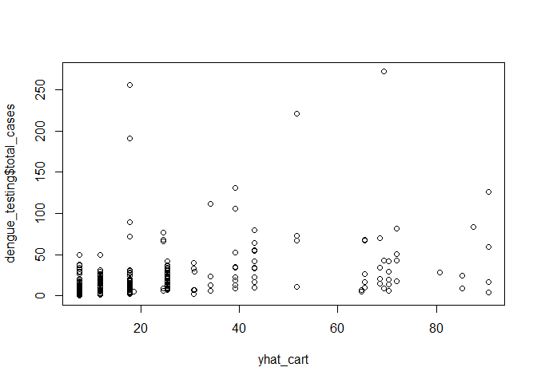
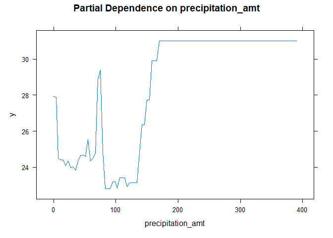
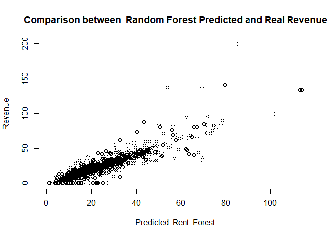
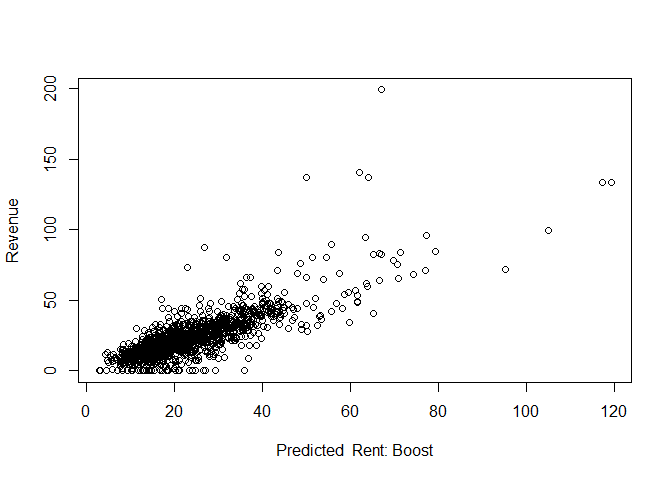
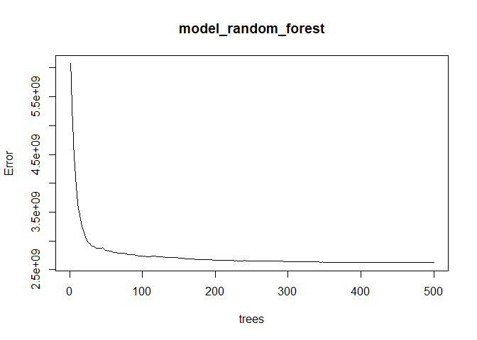

# Question 1 : What causes what?

## Problem 1: Why can’t I just get data from a few different cities and run the regression of “Crime” on “Police” to understand how more cops in the streets affect crime? (“Crime” refers to some measure of crime rate and “Police” measures the number of cops in a city.)

We could not just get data from a few different cities and run
regression of “Crime” on “Police” because in most cases, high-crime
cities have an incentive to hire a lot of cops, which adds confounders
in the analysis of the causal effect of cops on crime.

## Problem 2: How were the researchers from UPenn able to isolate this effect? Briefly describe their approach and discuss their result in the “Table 2” below, from the researchers’ paper.

They used the district and day fixed effect so they controlled their
analyses in Washington DC. In this situation, the researchers find an
example where they get a lot of police for reasons unrelated to crime to
explore whether there is a causal relationship between more police and
less crime.

They firstly regressed the daily total number of crimes in D.C. on the
high alert level, and secondly regressed the daily total number of
crimes in D.C. on both the high alert level and logged midday METRO
ridership. In the first regression (results in 1st column), the
coefficient -7.316 indicates that daily total number of crimes in D.C.
would decrease by about 7.3 on the high alert days and it is
statistically significant at the 5% level. In the second column (results
in 2nd column), after controlling the ridership, the coefficients
indicate that the coefficient of the high alert level drops to about
6.05, and the number of daily crimes in D.C. would increase by about 1.7
if Metro ridership increases by 10%, and this estimated coefficient is
statistically significant at 1% level. Since this increase is small, we
can learn that the change in ridership is not strongly correlated with
the change in the number of daily crimes in D.C. on high-alert days. We
can conclude that more police results in less crime.

## Problem 3: Why did they have to control for Metro ridership? What was that trying to capture?

Since after adding more cops, they made a hypothesis that the tourists
were less likely to visit Washington or to go out during that particular
time. Then they checked that hypothesis by looking at ridership levels
on the Metro system, and the number of tourists actually was not
diminished on high terror days, so they suggested the number of victims
was largely unchanged. They wanted to capture that the number of
tourists was the same during the high terror days, and then the
reductions of number of crimes was less likely to be related to the
number of tourists.

## Problem 4: Below I am showing you “Table 4” from the researchers’ paper. Just focus on the first column of the table. Can you describe the model being estimated here? What is the conclusion?

The model here describes the effect of high alerts in different
districts on the number of crimes. The regression tells us that the
expected number of daily crimes would decrease by about 2.62 in District
1 (the national mall) during the high alert days, and this estimated
coefficient is statistically significant at a 1% level. The expected
number of daily crimes would decrease by about 0.57 in other districts
but this estimated coefficient is not statistically significant at the
5% level. And in this case, the expected number of daily crimes in D.C.
would increase by about 0.024 if Metro ridership increases by 1%. Since
the coefficient of interaction between high-alert and District 1(the
national mall) is obviously larger than that between high-alert and
other districts, we could believe that the total crime decline during
high-alert periods is mainly concentrated in District 1.

# Question 2: Tree modeling: dengue cases

    ##   city season total_cases   ndvi_ne   ndvi_nw   ndvi_se   ndvi_sw
    ## 1   sj spring           4 0.1226000 0.1037250 0.1984833 0.1776167
    ## 2   sj spring           5 0.1699000 0.1421750 0.1623571 0.1554857
    ## 3   sj spring           4 0.0322500 0.1729667 0.1572000 0.1708429
    ## 4   sj spring           3 0.1286333 0.2450667 0.2275571 0.2358857
    ## 5   sj spring           6 0.1962000 0.2622000 0.2512000 0.2473400
    ## 6   sj summer           2        NA 0.1748500 0.2543143 0.1817429
    ##   precipitation_amt air_temp_k avg_temp_k dew_point_temp_k max_air_temp_k
    ## 1             12.42   297.5729   297.7429         292.4143          299.8
    ## 2             22.82   298.2114   298.4429         293.9514          300.9
    ## 3             34.54   298.7814   298.8786         295.4343          300.5
    ## 4             15.36   298.9871   299.2286         295.3100          301.4
    ## 5              7.52   299.5186   299.6643         295.8214          301.9
    ## 6              9.58   299.6300   299.7643         295.8514          302.4
    ##   min_air_temp_k precip_amt_kg_per_m2 relative_humidity_percent
    ## 1          295.9                32.00                  73.36571
    ## 2          296.4                17.94                  77.36857
    ## 3          297.3                26.10                  82.05286
    ## 4          297.0                13.90                  80.33714
    ## 5          297.5                12.20                  80.46000
    ## 6          298.1                26.49                  79.89143
    ##   specific_humidity   tdtr_k
    ## 1          14.01286 2.628571
    ## 2          15.37286 2.371429
    ## 3          16.84857 2.300000
    ## 4          16.67286 2.428571
    ## 5          17.21000 3.014286
    ## 6          17.21286 2.100000

    ##   city season total_cases   ndvi_ne   ndvi_nw   ndvi_se   ndvi_sw
    ## 1   sj spring           4 0.1226000 0.1037250 0.1984833 0.1776167
    ## 2   sj spring           5 0.1699000 0.1421750 0.1623571 0.1554857
    ## 3   sj spring           4 0.0322500 0.1729667 0.1572000 0.1708429
    ## 4   sj spring           3 0.1286333 0.2450667 0.2275571 0.2358857
    ## 5   sj spring           6 0.1962000 0.2622000 0.2512000 0.2473400
    ## 6   sj summer           2 0.1468334 0.1748500 0.2543143 0.1817429
    ##   precipitation_amt air_temp_k avg_temp_k dew_point_temp_k max_air_temp_k
    ## 1             12.42   297.5729   297.7429         292.4143          299.8
    ## 2             22.82   298.2114   298.4429         293.9514          300.9
    ## 3             34.54   298.7814   298.8786         295.4343          300.5
    ## 4             15.36   298.9871   299.2286         295.3100          301.4
    ## 5              7.52   299.5186   299.6643         295.8214          301.9
    ## 6              9.58   299.6300   299.7643         295.8514          302.4
    ##   min_air_temp_k precip_amt_kg_per_m2 relative_humidity_percent
    ## 1          295.9                32.00                  73.36571
    ## 2          296.4                17.94                  77.36857
    ## 3          297.3                26.10                  82.05286
    ## 4          297.0                13.90                  80.33714
    ## 5          297.5                12.20                  80.46000
    ## 6          298.1                26.49                  79.89143
    ##   specific_humidity   tdtr_k
    ## 1          14.01286 2.628571
    ## 2          15.37286 2.371429
    ## 3          16.84857 2.300000
    ## 4          16.67286 2.428571
    ## 5          17.21000 3.014286
    ## 6          17.21286 2.100000

    ## Distribution not specified, assuming gaussian ...

We predicted the dengue cases with CART model, Random Forest model and
Gradient-boosted model, and find the best model with lowest RMSE.

    ## The RMSE of CART model is  31.87375

    ## The RMSE of RandomForest model is  29.67098

    ## The RMSE of Gradient Boosting model is  31.32413

We also evaluate the performance of three models by comparing their MSE.

    ## Distribution not specified, assuming gaussian ...

    ## The MSE of CART Model is  973.0715

    ## The MSE of randomForest is  871.842

    ## The MSE of Gradient Boosting is  892.709

Because the gradient-boosted model has the smallest out-of-sample RMSE
and MSE, we decided to choose it as the model to make partial dependence
plots

We choose “tdtr\_k” to make a partial dependence plots because we think
that if the DTR is bigger, it’s more difficult for mosquito to live as a
result, we want to know whether DTR affect the total dengue fever cases
and we can see that it has big influence on the infection cases.

# Question 3: Predictive model building: green certification

Our goal for this problem: find the best predictive model. The revenue
per square foot per calendar year and use this model to quantify the
average change in rental income per square foot(whether in absolute or
percentage terms) associated with green certification.

Step description Step1. Build many models Step2. Model selection(compare
the RMSE of every model and choose the best model) Step3. write the
report tells that why you choose this method, modeling choice and
conclusion

    ##   CS_PropertyID cluster   size empl_gr  Rent leasing_rate stories age renovated
    ## 1        379105       1 260300    2.22 38.56        91.39      14  16         0
    ## 2        122151       1  67861    2.22 28.57        87.14       5  27         0
    ## 3        379839       1 164848    2.22 33.31        88.94      13  36         1
    ## 4         94614       1  93372    2.22 35.00        97.04      13  46         1
    ## 5        379285       1 174307    2.22 40.69        96.58      16   5         0
    ## 6         94765       1 231633    2.22 43.16        92.74      14  20         0
    ##   class_a class_b LEED Energystar green_rating net amenities cd_total_07
    ## 1       1       0    0          1            1   0         1        4988
    ## 2       0       1    0          0            0   0         1        4988
    ## 3       0       1    0          0            0   0         1        4988
    ## 4       0       1    0          0            0   0         0        4988
    ## 5       1       0    0          0            0   0         1        4988
    ## 6       1       0    0          0            0   0         1        4988
    ##   hd_total07 total_dd_07 Precipitation  Gas_Costs Electricity_Costs
    ## 1         58        5046         42.57 0.01370000        0.02900000
    ## 2         58        5046         42.57 0.01373149        0.02904455
    ## 3         58        5046         42.57 0.01373149        0.02904455
    ## 4         58        5046         42.57 0.01373149        0.02904455
    ## 5         58        5046         42.57 0.01373149        0.02904455
    ## 6         58        5046         42.57 0.01373149        0.02904455
    ##   City_Market_Rent
    ## 1            36.78
    ## 2            36.78
    ## 3            36.78
    ## 4            36.78
    ## 5            36.78
    ## 6            36.78

**Step 1 : Build the model**

    ## Start:  AIC=29383.66
    ## revenue ~ (CS_PropertyID + cluster + size + empl_gr + Rent + 
    ##     leasing_rate + stories + age + renovated + class_a + class_b + 
    ##     LEED + Energystar + green_rating + net + amenities + cd_total_07 + 
    ##     hd_total07 + total_dd_07 + Precipitation + Gas_Costs + Electricity_Costs + 
    ##     City_Market_Rent) - cluster - CS_PropertyID - LEED - Rent - 
    ##     leasing_rate - cd_total_07 - hd_total07
    ## 
    ##                                      Df Sum of Sq     RSS   AIC
    ## + size:City_Market_Rent               1     35591  646377 29050
    ## + size:Electricity_Costs              1     25950  656019 29143
    ## + stories:City_Market_Rent            1     17781  664187 29220
    ## + stories:Electricity_Costs           1     10440  671529 29289
    ## + amenities:City_Market_Rent          1      7000  674968 29321
    ## + class_a:City_Market_Rent            1      6000  675969 29330
    ## + amenities:Electricity_Costs         1      4612  677356 29343
    ## + size:total_dd_07                    1      4580  677389 29344
    ## + class_b:City_Market_Rent            1      3132  678837 29357
    ## + empl_gr:Electricity_Costs           1      3032  678936 29358
    ## + age:City_Market_Rent                1      2436  679532 29363
    ## + class_a:Electricity_Costs           1      2406  679562 29364
    ## + size:green_rating                   1      2187  679781 29366
    ## + stories:total_dd_07                 1      2117  679852 29366
    ## + Electricity_Costs:City_Market_Rent  1      1998  679970 29367
    ## + size:Energystar                     1      1971  679997 29368
    ## + stories:green_rating                1      1857  680112 29369
    ## + stories:Energystar                  1      1726  680242 29370
    ## + renovated:Precipitation             1      1538  680430 29372
    ## + total_dd_07:Precipitation           1      1487  680482 29372
    ## + renovated:City_Market_Rent          1      1438  680531 29372
    ## + class_b:Electricity_Costs           1      1219  680750 29374
    ## + empl_gr:class_a                     1      1182  680786 29375
    ## + green_rating:amenities              1      1158  680810 29375
    ## + stories:renovated                   1      1155  680814 29375
    ## + size:net                            1      1118  680850 29375
    ## + empl_gr:Gas_Costs                   1      1023  680945 29376
    ## + Energystar:amenities                1       916  681052 29377
    ## + size:class_b                        1       914  681054 29377
    ## + amenities:total_dd_07               1       911  681058 29377
    ## + class_a:total_dd_07                 1       841  681127 29378
    ## + amenities:Gas_Costs                 1       830  681138 29378
    ## + size:amenities                      1       822  681147 29378
    ## + empl_gr:total_dd_07                 1       788  681181 29378
    ## + empl_gr:class_b                     1       755  681213 29379
    ## + stories:net                         1       746  681223 29379
    ## + size:Gas_Costs                      1       602  681366 29380
    ## + net:Gas_Costs                       1       601  681367 29380
    ## + class_a:green_rating                1       526  681443 29381
    ## + stories:amenities                   1       502  681466 29381
    ## + green_rating:Precipitation          1       463  681506 29381
    ## + class_b:total_dd_07                 1       422  681546 29382
    ## - empl_gr                             1        19  681988 29382
    ## - Precipitation                       1        47  682016 29382
    ## - renovated                           1        58  682027 29382
    ## + empl_gr:amenities                   1       372  681596 29382
    ## + net:Electricity_Costs               1       372  681597 29382
    ## + Gas_Costs:City_Market_Rent          1       371  681598 29382
    ## + stories:age                         1       359  681609 29382
    ## + class_b:green_rating                1       354  681614 29382
    ## + age:class_b                         1       353  681616 29382
    ## + size:class_a                        1       351  681618 29382
    ## - Energystar                          1        94  682063 29383
    ## + size:renovated                      1       331  681638 29383
    ## + Energystar:Precipitation            1       326  681642 29383
    ## + stories:Gas_Costs                   1       326  681642 29383
    ## - stories                             1       110  682079 29383
    ## + green_rating:total_dd_07            1       324  681645 29383
    ## + empl_gr:age                         1       314  681654 29383
    ## + class_a:Gas_Costs                   1       305  681664 29383
    ## + Precipitation:Electricity_Costs     1       298  681671 29383
    ## + class_a:Energystar                  1       292  681676 29383
    ## + renovated:total_dd_07               1       281  681687 29383
    ## - age                                 1       166  682135 29383
    ## + renovated:class_a                   1       248  681721 29383
    ## + empl_gr:green_rating                1       247  681721 29383
    ## + stories:class_a                     1       243  681725 29383
    ## + empl_gr:Energystar                  1       240  681728 29383
    ## + Energystar:total_dd_07              1       237  681731 29383
    ## + age:Electricity_Costs               1       227  681742 29384
    ## <none>                                             681968 29384
    ## + empl_gr:City_Market_Rent            1       198  681770 29384
    ## + class_a:amenities                   1       190  681778 29384
    ## + net:Precipitation                   1       183  681785 29384
    ## + amenities:Precipitation             1       175  681793 29384
    ## + renovated:amenities                 1       173  681795 29384
    ## + class_a:Precipitation               1       164  681804 29384
    ## + age:renovated                       1       164  681805 29384
    ## + class_b:Energystar                  1       160  681809 29384
    ## + renovated:net                       1       153  681816 29384
    ## + age:Precipitation                   1       149  681820 29384
    ## - green_rating                        1       295  682264 29384
    ## + age:class_a                         1       139  681829 29384
    ## + empl_gr:Precipitation               1       136  681832 29384
    ## + net:amenities                       1       135  681833 29384
    ## + age:net                             1       135  681834 29384
    ## + size:stories                        1       126  681843 29385
    ## + Gas_Costs:Electricity_Costs         1       114  681854 29385
    ## + renovated:Gas_Costs                 1        81  681888 29385
    ## + age:green_rating                    1        68  681901 29385
    ## + green_rating:Electricity_Costs      1        67  681901 29385
    ## + class_b:amenities                   1        65  681903 29385
    ## + Energystar:Electricity_Costs        1        63  681905 29385
    ## + empl_gr:renovated                   1        56  681913 29385
    ## + class_b:net                         1        51  681918 29385
    ## + stories:Precipitation               1        46  681922 29385
    ## + empl_gr:net                         1        44  681924 29385
    ## + class_a:net                         1        36  681932 29385
    ## + age:Energystar                      1        32  681937 29385
    ## + age:Gas_Costs                       1        32  681937 29385
    ## + size:age                            1        29  681940 29385
    ## + Precipitation:Gas_Costs             1        27  681942 29385
    ## + total_dd_07:City_Market_Rent        1        25  681944 29385
    ## + stories:class_b                     1        22  681946 29385
    ## + size:empl_gr                        1        17  681952 29386
    ## + age:amenities                       1        15  681953 29386
    ## + green_rating:Gas_Costs              1        12  681956 29386
    ## + age:total_dd_07                     1        10  681958 29386
    ## + total_dd_07:Gas_Costs               1         9  681960 29386
    ## + green_rating:City_Market_Rent       1         9  681960 29386
    ## + Energystar:City_Market_Rent         1         6  681962 29386
    ## + class_b:Precipitation               1         5  681963 29386
    ## + renovated:Electricity_Costs         1         4  681965 29386
    ## + renovated:Energystar                1         4  681965 29386
    ## + net:total_dd_07                     1         4  681965 29386
    ## + renovated:class_b                   1         3  681966 29386
    ## + total_dd_07:Electricity_Costs       1         2  681966 29386
    ## + size:Precipitation                  1         2  681967 29386
    ## + renovated:green_rating              1         2  681967 29386
    ## + class_b:Gas_Costs                   1         1  681967 29386
    ## + Energystar:net                      1         1  681968 29386
    ## + green_rating:net                    1         1  681968 29386
    ## + Energystar:Gas_Costs                1         0  681968 29386
    ## + empl_gr:stories                     1         0  681968 29386
    ## + net:City_Market_Rent                1         0  681968 29386
    ## + Precipitation:City_Market_Rent      1         0  681968 29386
    ## - Gas_Costs                           1      1142  683111 29392
    ## - net                                 1      1175  683143 29392
    ## - amenities                           1      2701  684669 29406
    ## - total_dd_07                         1      2927  684896 29408
    ## - Electricity_Costs                   1      2994  684962 29409
    ## - class_b                             1      4683  686652 29424
    ## - size                                1      7522  689491 29450
    ## - class_a                             1      7911  689879 29454
    ## - City_Market_Rent                    1    384835 1066803 32181
    ## 
    ## Step:  AIC=29050.34
    ## revenue ~ size + empl_gr + stories + age + renovated + class_a + 
    ##     class_b + Energystar + green_rating + net + amenities + total_dd_07 + 
    ##     Precipitation + Gas_Costs + Electricity_Costs + City_Market_Rent + 
    ##     size:City_Market_Rent
    ## 
    ##                                      Df Sum of Sq    RSS   AIC
    ## + empl_gr:Electricity_Costs           1      2229 644148 29031
    ## + size:Precipitation                  1      1823 644554 29035
    ## + total_dd_07:City_Market_Rent        1      1751 644627 29035
    ## + stories:class_a                     1      1654 644723 29036
    ## + empl_gr:class_a                     1      1575 644802 29037
    ## + Precipitation:City_Market_Rent      1      1292 645085 29040
    ## + stories:Precipitation               1      1175 645203 29041
    ## + renovated:City_Market_Rent          1      1121 645256 29042
    ## + stories:City_Market_Rent            1      1087 645290 29042
    ## + size:green_rating                   1      1072 645305 29042
    ## + class_a:Precipitation               1      1060 645318 29042
    ## + renovated:Precipitation             1      1039 645338 29042
    ## + empl_gr:total_dd_07                 1       981 645396 29043
    ## + empl_gr:class_b                     1       975 645402 29043
    ## + green_rating:amenities              1       924 645453 29043
    ## + size:Electricity_Costs              1       897 645481 29044
    ## + stories:green_rating                1       868 645509 29044
    ## + size:Energystar                     1       827 645550 29044
    ## + stories:class_b                     1       811 645566 29045
    ## + Energystar:amenities                1       797 645580 29045
    ## + stories:Energystar                  1       764 645613 29045
    ## + amenities:Gas_Costs                 1       752 645626 29045
    ## + total_dd_07:Electricity_Costs       1       581 645796 29047
    ## + amenities:Electricity_Costs         1       574 645803 29047
    ## + empl_gr:Gas_Costs                   1       552 645825 29047
    ## + class_b:Precipitation               1       474 645903 29048
    ## + empl_gr:City_Market_Rent            1       467 645910 29048
    ## + empl_gr:age                         1       456 645921 29048
    ## + size:amenities                      1       445 645932 29048
    ## + empl_gr:amenities                   1       443 645935 29048
    ## + renovated:total_dd_07               1       421 645956 29048
    ## + age:City_Market_Rent                1       402 645976 29049
    ## + size:class_a                        1       391 645987 29049
    ## + size:stories                        1       361 646016 29049
    ## - Energystar                          1        71 646448 29049
    ## + size:total_dd_07                    1       337 646041 29049
    ## + net:Gas_Costs                       1       333 646045 29049
    ## + green_rating:Precipitation          1       332 646045 29049
    ## + net:City_Market_Rent                1       331 646047 29049
    ## + age:total_dd_07                     1       330 646047 29049
    ## + size:age                            1       328 646049 29049
    ## + stories:amenities                   1       323 646054 29049
    ## + class_a:green_rating                1       316 646061 29049
    ## + net:total_dd_07                     1       313 646064 29049
    ## + amenities:Precipitation             1       285 646093 29050
    ## + Precipitation:Electricity_Costs     1       282 646095 29050
    ## + size:empl_gr                        1       274 646103 29050
    ## + empl_gr:Precipitation               1       273 646104 29050
    ## - Precipitation                       1       160 646538 29050
    ## + class_a:City_Market_Rent            1       248 646130 29050
    ## - Gas_Costs                           1       171 646548 29050
    ## + empl_gr:green_rating                1       238 646140 29050
    ## - empl_gr                             1       176 646553 29050
    ## + empl_gr:Energystar                  1       232 646146 29050
    ## + Gas_Costs:Electricity_Costs         1       220 646157 29050
    ## + Energystar:Precipitation            1       218 646159 29050
    ## <none>                                            646377 29050
    ## - renovated                           1       209 646586 29050
    ## + age:class_a                         1       202 646176 29050
    ## + class_b:green_rating                1       184 646194 29051
    ## + class_a:Gas_Costs                   1       183 646195 29051
    ## + Electricity_Costs:City_Market_Rent  1       179 646198 29051
    ## + class_a:amenities                   1       175 646202 29051
    ## - stories                             1       255 646632 29051
    ## + class_a:total_dd_07                 1       140 646237 29051
    ## + Precipitation:Gas_Costs             1       140 646238 29051
    ## + class_a:Energystar                  1       139 646238 29051
    ## + Gas_Costs:City_Market_Rent          1       135 646243 29051
    ## - green_rating                        1       279 646657 29051
    ## + size:renovated                      1       132 646246 29051
    ## + amenities:City_Market_Rent          1       123 646254 29051
    ## + stories:renovated                   1       112 646265 29051
    ## + total_dd_07:Gas_Costs               1       108 646270 29051
    ## + total_dd_07:Precipitation           1       105 646273 29051
    ## + class_b:total_dd_07                 1       104 646274 29051
    ## + green_rating:City_Market_Rent       1       102 646275 29051
    ## + class_b:amenities                   1        98 646279 29051
    ## + age:renovated                       1        89 646288 29052
    ## + Energystar:City_Market_Rent         1        86 646291 29052
    ## + green_rating:total_dd_07            1        77 646300 29052
    ## - net                                 1       336 646714 29052
    ## + age:amenities                       1        73 646304 29052
    ## + age:Electricity_Costs               1        72 646306 29052
    ## + stories:Gas_Costs                   1        70 646307 29052
    ## + empl_gr:renovated                   1        67 646311 29052
    ## + age:green_rating                    1        66 646311 29052
    ## + size:class_b                        1        65 646313 29052
    ## + amenities:total_dd_07               1        63 646315 29052
    ## + empl_gr:net                         1        62 646315 29052
    ## + age:Precipitation                   1        59 646319 29052
    ## + class_b:Gas_Costs                   1        53 646324 29052
    ## + class_b:Energystar                  1        50 646327 29052
    ## + age:Energystar                      1        50 646328 29052
    ## + age:net                             1        48 646329 29052
    ## + class_b:City_Market_Rent            1        46 646332 29052
    ## + stories:total_dd_07                 1        43 646334 29052
    ## + renovated:amenities                 1        42 646336 29052
    ## + renovated:class_a                   1        42 646336 29052
    ## + net:Electricity_Costs               1        39 646339 29052
    ## + Energystar:total_dd_07              1        38 646339 29052
    ## + empl_gr:stories                     1        33 646345 29052
    ## + net:Precipitation                   1        29 646349 29052
    ## + stories:Electricity_Costs           1        17 646360 29052
    ## + class_a:Electricity_Costs           1        16 646361 29052
    ## + net:amenities                       1        15 646363 29052
    ## + renovated:Gas_Costs                 1        14 646363 29052
    ## + green_rating:Gas_Costs              1        14 646364 29052
    ## + Energystar:Electricity_Costs        1        14 646364 29052
    ## + class_a:net                         1        12 646366 29052
    ## + stories:age                         1        10 646367 29052
    ## + age:class_b                         1        10 646367 29052
    ## + size:net                            1        10 646367 29052
    ## + Energystar:net                      1         9 646368 29052
    ## + class_b:net                         1         7 646371 29052
    ## + renovated:green_rating              1         6 646371 29052
    ## + renovated:Energystar                1         5 646372 29052
    ## + green_rating:Electricity_Costs      1         5 646373 29052
    ## + renovated:class_b                   1         4 646374 29052
    ## + class_b:Electricity_Costs           1         2 646375 29052
    ## + green_rating:net                    1         1 646376 29052
    ## + renovated:net                       1         1 646376 29052
    ## + renovated:Electricity_Costs         1         1 646377 29052
    ## + age:Gas_Costs                       1         1 646377 29052
    ## + stories:net                         1         0 646377 29052
    ## + size:Gas_Costs                      1         0 646377 29052
    ## + Energystar:Gas_Costs                1         0 646377 29052
    ## - Electricity_Costs                   1       509 646886 29053
    ## - age                                 1       530 646907 29054
    ## - total_dd_07                         1       560 646938 29054
    ## - amenities                           1      2844 649221 29076
    ## - class_b                             1      4466 650844 29091
    ## - class_a                             1      6277 652654 29109
    ## - size:City_Market_Rent               1     35591 681968 29384
    ## 
    ## Step:  AIC=29030.73
    ## revenue ~ size + empl_gr + stories + age + renovated + class_a + 
    ##     class_b + Energystar + green_rating + net + amenities + total_dd_07 + 
    ##     Precipitation + Gas_Costs + Electricity_Costs + City_Market_Rent + 
    ##     size:City_Market_Rent + empl_gr:Electricity_Costs
    ## 
    ##                                      Df Sum of Sq    RSS   AIC
    ## + total_dd_07:City_Market_Rent        1      2315 641833 29010
    ## + size:Precipitation                  1      2081 642067 29013
    ## + stories:class_a                     1      1738 642410 29016
    ## + Precipitation:City_Market_Rent      1      1446 642702 29019
    ## + stories:Precipitation               1      1330 642818 29020
    ## + stories:City_Market_Rent            1      1266 642882 29020
    ## + empl_gr:class_a                     1      1193 642955 29021
    ## + renovated:City_Market_Rent          1      1079 643069 29022
    ## + class_a:Precipitation               1      1042 643106 29023
    ## + size:green_rating                   1      1027 643121 29023
    ## + renovated:Precipitation             1       991 643157 29023
    ## + empl_gr:class_b                     1       889 643259 29024
    ## + size:Electricity_Costs              1       887 643261 29024
    ## + stories:green_rating                1       861 643287 29024
    ## + green_rating:amenities              1       839 643309 29025
    ## + stories:class_b                     1       836 643312 29025
    ## + size:Energystar                     1       796 643352 29025
    ## + stories:Energystar                  1       763 643386 29025
    ## + Energystar:amenities                1       722 643426 29026
    ## + empl_gr:Precipitation               1       712 643437 29026
    ## + Precipitation:Electricity_Costs     1       671 643477 29026
    ## + size:empl_gr                        1       579 643569 29027
    ## + amenities:Electricity_Costs         1       578 643570 29027
    ## + class_b:Precipitation               1       551 643597 29027
    ## + amenities:Gas_Costs                 1       543 643605 29028
    ## + age:City_Market_Rent                1       524 643625 29028
    ## + renovated:total_dd_07               1       456 643692 29028
    ## + green_rating:Precipitation          1       450 643698 29028
    ## + total_dd_07:Electricity_Costs       1       432 643716 29029
    ## + net:City_Market_Rent                1       414 643734 29029
    ## + size:amenities                      1       414 643735 29029
    ## + size:class_a                        1       410 643738 29029
    ## + size:stories                        1       392 643756 29029
    ## + net:total_dd_07                     1       386 643762 29029
    ## + net:Gas_Costs                       1       382 643766 29029
    ## + size:total_dd_07                    1       369 643780 29029
    ## - Energystar                          1        63 644211 29029
    ## + empl_gr:green_rating                1       331 643817 29030
    ## + stories:amenities                   1       330 643818 29030
    ## + size:age                            1       328 643821 29030
    ## + empl_gr:Energystar                  1       324 643824 29030
    ## + Energystar:Precipitation            1       320 643828 29030
    ## + empl_gr:amenities                   1       304 643844 29030
    ## - total_dd_07                         1       118 644266 29030
    ## + amenities:Precipitation             1       294 643854 29030
    ## + class_a:green_rating                1       272 643876 29030
    ## + Gas_Costs:City_Market_Rent          1       271 643877 29030
    ## + age:total_dd_07                     1       269 643880 29030
    ## + class_a:amenities                   1       254 643894 29030
    ## + class_a:total_dd_07                 1       238 643910 29030
    ## + class_a:City_Market_Rent            1       227 643921 29031
    ## <none>                                            644148 29031
    ## + age:class_a                         1       204 643944 29031
    ## + empl_gr:net                         1       204 643944 29031
    ## + class_a:Gas_Costs                   1       192 643956 29031
    ## - Gas_Costs                           1       223 644371 29031
    ## - stories                             1       224 644372 29031
    ## + empl_gr:stories                     1       178 643970 29031
    ## + class_b:green_rating                1       177 643971 29031
    ## - green_rating                        1       254 644402 29031
    ## + class_b:total_dd_07                 1       152 643996 29031
    ## + empl_gr:age                         1       144 644004 29031
    ## + size:renovated                      1       140 644008 29031
    ## - renovated                           1       288 644436 29032
    ## + amenities:total_dd_07               1       124 644024 29032
    ## - net                                 1       289 644437 29032
    ## + class_a:Energystar                  1       112 644036 29032
    ## + class_b:amenities                   1       110 644038 29032
    ## + amenities:City_Market_Rent          1       101 644047 29032
    ## + stories:renovated                   1       101 644047 29032
    ## + stories:Gas_Costs                   1        88 644060 29032
    ## + green_rating:total_dd_07            1        80 644068 29032
    ## + age:renovated                       1        74 644075 29032
    ## + size:class_b                        1        72 644076 29032
    ## + age:green_rating                    1        66 644082 29032
    ## + Electricity_Costs:City_Market_Rent  1        54 644094 29032
    ## - Precipitation                       1       358 644506 29032
    ## + age:amenities                       1        53 644095 29032
    ## + age:Energystar                      1        50 644098 29032
    ## + class_b:Gas_Costs                   1        50 644098 29032
    ## + Precipitation:Gas_Costs             1        48 644100 29032
    ## + stories:total_dd_07                 1        47 644102 29032
    ## + net:Precipitation                   1        46 644102 29032
    ## + class_b:Energystar                  1        46 644102 29032
    ## + age:Precipitation                   1        45 644104 29032
    ## + age:net                             1        44 644104 29032
    ## + total_dd_07:Gas_Costs               1        43 644105 29032
    ## + green_rating:City_Market_Rent       1        43 644105 29032
    ## + renovated:class_a                   1        43 644105 29032
    ## + Gas_Costs:Electricity_Costs         1        43 644105 29032
    ## + age:Electricity_Costs               1        41 644107 29032
    ## + Energystar:total_dd_07              1        41 644108 29032
    ## + renovated:amenities                 1        39 644109 29032
    ## + net:Electricity_Costs               1        37 644111 29032
    ## + Energystar:City_Market_Rent         1        34 644114 29032
    ## + class_b:City_Market_Rent            1        32 644116 29032
    ## + class_a:net                         1        27 644121 29033
    ## + green_rating:Gas_Costs              1        20 644128 29033
    ## + stories:Electricity_Costs           1        19 644129 29033
    ## + class_b:net                         1        17 644131 29033
    ## + age:class_b                         1        15 644133 29033
    ## + Energystar:Electricity_Costs        1        15 644133 29033
    ## + Energystar:net                      1        15 644133 29033
    ## + empl_gr:Gas_Costs                   1         7 644141 29033
    ## + stories:age                         1         7 644141 29033
    ## + size:net                            1         6 644142 29033
    ## + renovated:green_rating              1         6 644142 29033
    ## + renovated:Gas_Costs                 1         6 644142 29033
    ## + renovated:Energystar                1         6 644142 29033
    ## + empl_gr:renovated                   1         6 644142 29033
    ## + green_rating:Electricity_Costs      1         5 644143 29033
    ## + green_rating:net                    1         5 644144 29033
    ## + net:amenities                       1         4 644144 29033
    ## + renovated:class_b                   1         4 644144 29033
    ## + class_a:Electricity_Costs           1         3 644145 29033
    ## + empl_gr:total_dd_07                 1         3 644145 29033
    ## + size:Gas_Costs                      1         2 644146 29033
    ## + total_dd_07:Precipitation           1         2 644147 29033
    ## + Energystar:Gas_Costs                1         1 644147 29033
    ## + renovated:Electricity_Costs         1         1 644147 29033
    ## + empl_gr:City_Market_Rent            1         0 644148 29033
    ## + stories:net                         1         0 644148 29033
    ## + age:Gas_Costs                       1         0 644148 29033
    ## + class_b:Electricity_Costs           1         0 644148 29033
    ## + renovated:net                       1         0 644148 29033
    ## - age                                 1       643 644791 29035
    ## - empl_gr:Electricity_Costs           1      2229 646377 29050
    ## - amenities                           1      3209 647357 29060
    ## - class_b                             1      4192 648341 29069
    ## - class_a                             1      6154 650302 29088
    ## - size:City_Market_Rent               1     34788 678936 29358
    ## 
    ## Step:  AIC=29010.2
    ## revenue ~ size + empl_gr + stories + age + renovated + class_a + 
    ##     class_b + Energystar + green_rating + net + amenities + total_dd_07 + 
    ##     Precipitation + Gas_Costs + Electricity_Costs + City_Market_Rent + 
    ##     size:City_Market_Rent + empl_gr:Electricity_Costs + total_dd_07:City_Market_Rent
    ## 
    ##                                      Df Sum of Sq    RSS   AIC
    ## + size:Precipitation                  1      2170 639663 28991
    ## + stories:class_a                     1      1643 640189 28996
    ## + stories:Precipitation               1      1343 640490 28999
    ## + empl_gr:class_a                     1      1261 640572 29000
    ## + renovated:City_Market_Rent          1       971 640862 29003
    ## + size:green_rating                   1       963 640870 29003
    ## + empl_gr:class_b                     1       962 640871 29003
    ## + size:Electricity_Costs              1       955 640878 29003
    ## + green_rating:amenities              1       906 640927 29003
    ## + class_a:Precipitation               1       856 640977 29004
    ## + stories:green_rating                1       820 641013 29004
    ## + Energystar:amenities                1       799 641034 29004
    ## + stories:class_b                     1       748 641084 29005
    ## + size:Energystar                     1       729 641104 29005
    ## + empl_gr:Precipitation               1       722 641111 29005
    ## + stories:Energystar                  1       717 641116 29005
    ## + stories:City_Market_Rent            1       706 641127 29005
    ## + renovated:Precipitation             1       680 641153 29006
    ## + amenities:Gas_Costs                 1       658 641174 29006
    ## + size:empl_gr                        1       643 641189 29006
    ## + class_a:City_Market_Rent            1       616 641217 29006
    ## + age:total_dd_07                     1       550 641283 29007
    ## + amenities:Electricity_Costs         1       514 641319 29007
    ## + green_rating:Precipitation          1       510 641323 29007
    ## + size:total_dd_07                    1       505 641328 29007
    ## + class_b:Precipitation               1       482 641351 29008
    ## + size:amenities                      1       427 641406 29008
    ## + size:stories                        1       414 641418 29008
    ## - Precipitation                       1         6 641838 29008
    ## + size:class_a                        1       377 641456 29009
    ## + empl_gr:green_rating                1       370 641463 29009
    ## + empl_gr:Energystar                  1       361 641472 29009
    ## + Energystar:Precipitation            1       357 641476 29009
    ## + size:age                            1       349 641484 29009
    ## - Energystar                          1        69 641902 29009
    ## + stories:amenities                   1       330 641502 29009
    ## + amenities:Precipitation             1       315 641518 29009
    ## + empl_gr:amenities                   1       311 641522 29009
    ## + net:total_dd_07                     1       309 641524 29009
    ## + net:Gas_Costs                       1       296 641537 29009
    ## + net:City_Market_Rent                1       290 641543 29009
    ## + class_a:green_rating                1       289 641544 29009
    ## + class_a:amenities                   1       278 641555 29010
    ## + age:Electricity_Costs               1       244 641589 29010
    ## + total_dd_07:Precipitation           1       231 641602 29010
    ## + green_rating:City_Market_Rent       1       222 641611 29010
    ## + renovated:total_dd_07               1       213 641619 29010
    ## + class_a:Gas_Costs                   1       210 641623 29010
    ## + Energystar:City_Market_Rent         1       210 641623 29010
    ## <none>                                            641833 29010
    ## + class_b:green_rating                1       191 641642 29010
    ## + class_b:City_Market_Rent            1       190 641642 29010
    ## + empl_gr:age                         1       186 641647 29010
    ## + empl_gr:stories                     1       178 641655 29011
    ## + empl_gr:net                         1       173 641660 29011
    ## - green_rating                        1       262 642095 29011
    ## + Gas_Costs:Electricity_Costs         1       145 641687 29011
    ## - renovated                           1       270 642103 29011
    ## - net                                 1       275 642108 29011
    ## + size:renovated                      1       134 641699 29011
    ## + class_a:Energystar                  1       130 641702 29011
    ## + class_b:amenities                   1       129 641704 29011
    ## + amenities:total_dd_07               1       128 641705 29011
    ## + age:class_a                         1       123 641710 29011
    ## - stories                             1       290 642123 29011
    ## + stories:renovated                   1       115 641718 29011
    ## + stories:total_dd_07                 1       110 641722 29011
    ## + age:City_Market_Rent                1        93 641740 29011
    ## + empl_gr:total_dd_07                 1        85 641748 29011
    ## + class_a:total_dd_07                 1        82 641751 29011
    ## + Gas_Costs:City_Market_Rent          1        80 641752 29011
    ## + Precipitation:Electricity_Costs     1        72 641760 29012
    ## + stories:Electricity_Costs           1        68 641765 29012
    ## + age:amenities                       1        66 641767 29012
    ## + age:renovated                       1        61 641772 29012
    ## + stories:Gas_Costs                   1        57 641775 29012
    ## + class_b:Energystar                  1        57 641776 29012
    ## + class_b:total_dd_07                 1        56 641776 29012
    ## + age:green_rating                    1        56 641777 29012
    ## + size:class_b                        1        56 641777 29012
    ## + class_a:Electricity_Costs           1        52 641781 29012
    ## + age:Energystar                      1        50 641783 29012
    ## + green_rating:total_dd_07            1        50 641783 29012
    ## + class_b:Gas_Costs                   1        48 641785 29012
    ## + total_dd_07:Electricity_Costs       1        41 641792 29012
    ## + age:net                             1        38 641794 29012
    ## + net:Electricity_Costs               1        36 641797 29012
    ## + amenities:City_Market_Rent          1        35 641797 29012
    ## + class_a:net                         1        35 641798 29012
    ## + renovated:amenities                 1        35 641798 29012
    ## + age:class_b                         1        34 641799 29012
    ## + green_rating:Gas_Costs              1        25 641808 29012
    ## + age:Precipitation                   1        24 641809 29012
    ## + net:Precipitation                   1        23 641810 29012
    ## + Energystar:net                      1        23 641810 29012
    ## + class_b:net                         1        22 641811 29012
    ## + Electricity_Costs:City_Market_Rent  1        19 641814 29012
    ## + Energystar:total_dd_07              1        18 641815 29012
    ## + renovated:class_a                   1        18 641815 29012
    ## + class_b:Electricity_Costs           1        15 641818 29012
    ## + total_dd_07:Gas_Costs               1        13 641820 29012
    ## + renovated:class_b                   1        12 641821 29012
    ## + renovated:green_rating              1        11 641822 29012
    ## + Precipitation:City_Market_Rent      1        10 641822 29012
    ## + green_rating:net                    1        10 641822 29012
    ## + renovated:Energystar                1        10 641823 29012
    ## + stories:age                         1         9 641824 29012
    ## + empl_gr:Gas_Costs                   1         6 641827 29012
    ## + Precipitation:Gas_Costs             1         6 641827 29012
    ## + empl_gr:renovated                   1         5 641828 29012
    ## + renovated:Electricity_Costs         1         5 641828 29012
    ## + empl_gr:City_Market_Rent            1         5 641828 29012
    ## + size:net                            1         4 641829 29012
    ## + size:Gas_Costs                      1         3 641830 29012
    ## + green_rating:Electricity_Costs      1         3 641830 29012
    ## + net:amenities                       1         3 641830 29012
    ## + Energystar:Gas_Costs                1         2 641831 29012
    ## + renovated:Gas_Costs                 1         1 641832 29012
    ## + stories:net                         1         1 641832 29012
    ## + age:Gas_Costs                       1         1 641832 29012
    ## + renovated:net                       1         0 641833 29012
    ## + Energystar:Electricity_Costs        1         0 641833 29012
    ## - Gas_Costs                           1       526 642359 29013
    ## - age                                 1       804 642637 29016
    ## - total_dd_07:City_Market_Rent        1      2315 644148 29031
    ## - empl_gr:Electricity_Costs           1      2794 644627 29035
    ## - amenities                           1      3537 645370 29043
    ## - class_b                             1      4162 645995 29049
    ## - class_a                             1      5828 647661 29065
    ## - size:City_Market_Rent               1     36952 678785 29358
    ## 
    ## Step:  AIC=28991.02
    ## revenue ~ size + empl_gr + stories + age + renovated + class_a + 
    ##     class_b + Energystar + green_rating + net + amenities + total_dd_07 + 
    ##     Precipitation + Gas_Costs + Electricity_Costs + City_Market_Rent + 
    ##     size:City_Market_Rent + empl_gr:Electricity_Costs + total_dd_07:City_Market_Rent + 
    ##     size:Precipitation
    ## 
    ##                                      Df Sum of Sq    RSS   AIC
    ## + stories:class_a                     1      1644 638019 28977
    ## + amenities:Gas_Costs                 1      1207 638456 28981
    ## + renovated:City_Market_Rent          1      1181 638482 28982
    ## + size:green_rating                   1      1136 638527 28982
    ## + size:Gas_Costs                      1      1113 638550 28982
    ## + empl_gr:class_a                     1      1044 638619 28983
    ## + stories:Gas_Costs                   1      1043 638620 28983
    ## + size:Energystar                     1      1036 638628 28983
    ## + stories:Energystar                  1       956 638707 28984
    ## + green_rating:amenities              1       951 638713 28984
    ## + stories:green_rating                1       939 638724 28984
    ## + stories:City_Market_Rent            1       886 638777 28984
    ## + Energystar:amenities                1       883 638780 28984
    ## + empl_gr:class_b                     1       861 638802 28985
    ## + age:total_dd_07                     1       804 638859 28985
    ## + stories:class_b                     1       755 638908 28986
    ## + class_a:Gas_Costs                   1       739 638924 28986
    ## + class_a:City_Market_Rent            1       701 638962 28986
    ## + empl_gr:Precipitation               1       632 639032 28987
    ## + renovated:Precipitation             1       609 639054 28987
    ## + age:Electricity_Costs               1       459 639204 28989
    ## + size:class_a                        1       453 639211 28989
    ## + net:Gas_Costs                       1       401 639262 28989
    ## + size:amenities                      1       341 639322 28990
    ## - stories                             1        70 639733 28990
    ## + empl_gr:green_rating                1       329 639334 28990
    ## + empl_gr:Energystar                  1       319 639344 28990
    ## - Energystar                          1        97 639760 28990
    ## + green_rating:Precipitation          1       311 639352 28990
    ## + class_a:green_rating                1       310 639353 28990
    ## + class_a:amenities                   1       303 639360 28990
    ## + size:stories                        1       297 639366 28990
    ## + stories:amenities                   1       294 639369 28990
    ## + net:total_dd_07                     1       290 639373 28990
    ## + size:empl_gr                        1       256 639407 28991
    ## + size:age                            1       241 639423 28991
    ## + green_rating:City_Market_Rent       1       239 639424 28991
    ## + amenities:Electricity_Costs         1       232 639431 28991
    ## + Energystar:City_Market_Rent         1       231 639432 28991
    ## + empl_gr:amenities                   1       225 639438 28991
    ## + net:City_Market_Rent                1       216 639447 28991
    ## + class_a:Electricity_Costs           1       210 639453 28991
    ## <none>                                            639663 28991
    ## + class_b:green_rating                1       203 639460 28991
    ## + renovated:total_dd_07               1       198 639465 28991
    ## + Energystar:Precipitation            1       197 639466 28991
    ## + class_b:City_Market_Rent            1       184 639479 28991
    ## - renovated                           1       241 639905 28991
    ## + class_b:amenities                   1       165 639498 28991
    ## + class_a:Energystar                  1       164 639499 28991
    ## + empl_gr:age                         1       157 639506 28992
    ## + size:renovated                      1       156 639507 28992
    ## + empl_gr:net                         1       149 639514 28992
    ## + Precipitation:Electricity_Costs     1       140 639523 28992
    ## + stories:total_dd_07                 1       129 639534 28992
    ## - green_rating                        1       289 639952 28992
    ## + Gas_Costs:Electricity_Costs         1       111 639552 28992
    ## + net:Precipitation                   1       106 639558 28992
    ## + total_dd_07:Precipitation           1       100 639563 28992
    ## + size:class_b                        1        92 639571 28992
    ## + stories:renovated                   1        91 639572 28992
    ## - net                                 1       323 639986 28992
    ## + age:class_a                         1        86 639577 28992
    ## + size:Electricity_Costs              1        81 639582 28992
    ## + class_b:Precipitation               1        80 639584 28992
    ## + class_b:Energystar                  1        75 639588 28992
    ## + stories:Electricity_Costs           1        74 639589 28992
    ## + class_a:Precipitation               1        73 639590 28992
    ## + age:Gas_Costs                       1        72 639591 28992
    ## + empl_gr:total_dd_07                 1        68 639595 28992
    ## + age:renovated                       1        64 639599 28992
    ## + class_b:Electricity_Costs           1        63 639600 28992
    ## + Precipitation:City_Market_Rent      1        62 639601 28992
    ## + net:Electricity_Costs               1        57 639606 28993
    ## + age:Precipitation                   1        53 639610 28993
    ## + age:net                             1        53 639611 28993
    ## + age:Energystar                      1        49 639614 28993
    ## + green_rating:total_dd_07            1        47 639616 28993
    ## + age:green_rating                    1        45 639618 28993
    ## + age:class_b                         1        44 639619 28993
    ## + age:City_Market_Rent                1        43 639620 28993
    ## + age:amenities                       1        40 639623 28993
    ## + size:net                            1        38 639626 28993
    ## + empl_gr:stories                     1        35 639628 28993
    ## + empl_gr:Gas_Costs                   1        34 639629 28993
    ## + renovated:Electricity_Costs         1        30 639633 28993
    ## + class_a:net                         1        26 639638 28993
    ## + Electricity_Costs:City_Market_Rent  1        26 639638 28993
    ## + renovated:amenities                 1        25 639638 28993
    ## + size:total_dd_07                    1        22 639641 28993
    ## + stories:Precipitation               1        20 639643 28993
    ## + Energystar:total_dd_07              1        19 639644 28993
    ## + renovated:class_b                   1        18 639645 28993
    ## + renovated:green_rating              1        17 639646 28993
    ## + class_b:net                         1        17 639646 28993
    ## + green_rating:Electricity_Costs      1        16 639647 28993
    ## + renovated:Energystar                1        14 639649 28993
    ## + renovated:net                       1        14 639649 28993
    ## + Energystar:net                      1        13 639650 28993
    ## + amenities:City_Market_Rent          1        11 639652 28993
    ## + total_dd_07:Gas_Costs               1        10 639653 28993
    ## + renovated:class_a                   1         7 639656 28993
    ## + Gas_Costs:City_Market_Rent          1         6 639657 28993
    ## + amenities:total_dd_07               1         6 639657 28993
    ## + net:amenities                       1         6 639657 28993
    ## + total_dd_07:Electricity_Costs       1         6 639657 28993
    ## + Precipitation:Gas_Costs             1         5 639658 28993
    ## + empl_gr:renovated                   1         4 639659 28993
    ## + class_b:total_dd_07                 1         4 639659 28993
    ## + green_rating:Gas_Costs              1         4 639659 28993
    ## + Energystar:Electricity_Costs        1         4 639659 28993
    ## + Energystar:Gas_Costs                1         4 639659 28993
    ## + green_rating:net                    1         4 639659 28993
    ## + stories:age                         1         3 639660 28993
    ## + stories:net                         1         3 639661 28993
    ## + class_a:total_dd_07                 1         1 639662 28993
    ## + renovated:Gas_Costs                 1         1 639662 28993
    ## + class_b:Gas_Costs                   1         1 639662 28993
    ## + empl_gr:City_Market_Rent            1         0 639663 28993
    ## + amenities:Precipitation             1         0 639663 28993
    ## - Gas_Costs                           1       684 640347 28996
    ## - age                                 1       879 640542 28998
    ## - size:Precipitation                  1      2170 641833 29010
    ## - total_dd_07:City_Market_Rent        1      2404 642067 29013
    ## - empl_gr:Electricity_Costs           1      3096 642760 29019
    ## - amenities                           1      3346 643009 29022
    ## - class_b                             1      4377 644040 29032
    ## - class_a                             1      5670 645333 29044
    ## - size:City_Market_Rent               1     39118 678781 29360
    ## 
    ## Step:  AIC=28976.92
    ## revenue ~ size + empl_gr + stories + age + renovated + class_a + 
    ##     class_b + Energystar + green_rating + net + amenities + total_dd_07 + 
    ##     Precipitation + Gas_Costs + Electricity_Costs + City_Market_Rent + 
    ##     size:City_Market_Rent + empl_gr:Electricity_Costs + total_dd_07:City_Market_Rent + 
    ##     size:Precipitation + stories:class_a
    ## 
    ##                                      Df Sum of Sq    RSS   AIC
    ## + amenities:Gas_Costs                 1      1312 636707 28966
    ## + renovated:City_Market_Rent          1      1234 636785 28967
    ## + size:Gas_Costs                      1      1222 636797 28967
    ## + stories:Gas_Costs                   1      1177 636842 28967
    ## + size:age                            1      1111 636908 28968
    ## + class_a:City_Market_Rent            1       991 637028 28969
    ## + age:total_dd_07                     1       884 637135 28970
    ## + empl_gr:class_a                     1       854 637165 28971
    ## + empl_gr:Precipitation               1       828 637192 28971
    ## + green_rating:amenities              1       812 637207 28971
    ## + size:green_rating                   1       801 637219 28971
    ## + class_a:Gas_Costs                   1       770 637249 28971
    ## + Energystar:amenities                1       767 637252 28971
    ## + size:Energystar                     1       723 637296 28972
    ## + stories:age                         1       719 637300 28972
    ## + empl_gr:class_b                     1       714 637306 28972
    ## + stories:Energystar                  1       649 637370 28973
    ## + renovated:Precipitation             1       625 637394 28973
    ## + stories:green_rating                1       618 637402 28973
    ## + stories:City_Market_Rent            1       617 637402 28973
    ## + size:class_b                        1       533 637486 28974
    ## + age:Electricity_Costs               1       477 637542 28974
    ## + class_a:Electricity_Costs           1       461 637558 28974
    ## + stories:class_b                     1       417 637602 28975
    ## + class_a:green_rating                1       382 637637 28975
    ## + net:total_dd_07                     1       370 637649 28975
    ## + net:Gas_Costs                       1       369 637650 28975
    ## + empl_gr:green_rating                1       309 637710 28976
    ## - Energystar                          1       104 638124 28976
    ## + empl_gr:Energystar                  1       299 637720 28976
    ## + class_b:City_Market_Rent            1       295 637724 28976
    ## + green_rating:City_Market_Rent       1       293 637727 28976
    ## + stories:renovated                   1       286 637733 28976
    ## + Energystar:City_Market_Rent         1       281 637738 28976
    ## + class_b:green_rating                1       277 637742 28976
    ## + green_rating:Precipitation          1       273 637746 28976
    ## - renovated                           1       155 638174 28976
    ## + net:City_Market_Rent                1       229 637790 28977
    ## + amenities:Electricity_Costs         1       224 637795 28977
    ## + size:empl_gr                        1       222 637797 28977
    ## + class_a:Energystar                  1       208 637811 28977
    ## <none>                                            638019 28977
    ## + class_b:Electricity_Costs           1       185 637834 28977
    ## + empl_gr:amenities                   1       184 637835 28977
    ## + Energystar:Precipitation            1       178 637841 28977
    ## - net                                 1       234 638253 28977
    ## + renovated:total_dd_07               1       163 637856 28977
    ## + total_dd_07:Precipitation           1       160 637859 28977
    ## + class_a:total_dd_07                 1       156 637863 28977
    ## + Gas_Costs:Electricity_Costs         1       147 637872 28978
    ## + empl_gr:age                         1       139 637880 28978
    ## - green_rating                        1       278 638297 28978
    ## + age:class_b                         1       129 637890 28978
    ## + size:class_a                        1       119 637900 28978
    ## + class_b:Energystar                  1       116 637903 28978
    ## + size:amenities                      1       116 637904 28978
    ## + Precipitation:Electricity_Costs     1       115 637904 28978
    ## + empl_gr:net                         1       104 637915 28978
    ## + net:Precipitation                   1       103 637917 28978
    ## + stories:total_dd_07                 1        99 637920 28978
    ## + age:amenities                       1        96 637923 28978
    ## + empl_gr:total_dd_07                 1        95 637924 28978
    ## + size:renovated                      1        83 637936 28978
    ## + size:Electricity_Costs              1        76 637943 28978
    ## + renovated:class_b                   1        73 637946 28978
    ## + class_b:total_dd_07                 1        66 637953 28978
    ## + age:green_rating                    1        64 637955 28978
    ## + class_a:amenities                   1        57 637962 28978
    ## + age:renovated                       1        55 637964 28978
    ## + age:net                             1        54 637965 28978
    ## + stories:amenities                   1        54 637966 28978
    ## + stories:Electricity_Costs           1        53 637966 28978
    ## + age:Precipitation                   1        52 637967 28978
    ## + Precipitation:City_Market_Rent      1        43 637976 28979
    ## + renovated:amenities                 1        42 637977 28979
    ## + empl_gr:Gas_Costs                   1        41 637978 28979
    ## + class_a:net                         1        40 637979 28979
    ## + age:Energystar                      1        39 637980 28979
    ## + net:Electricity_Costs               1        37 637982 28979
    ## + age:Gas_Costs                       1        36 637984 28979
    ## + stories:Precipitation               1        33 637986 28979
    ## + green_rating:total_dd_07            1        28 637991 28979
    ## + class_b:net                         1        26 637993 28979
    ## + green_rating:Electricity_Costs      1        24 637995 28979
    ## + class_b:amenities                   1        23 637996 28979
    ## + empl_gr:stories                     1        23 637996 28979
    ## + renovated:Electricity_Costs         1        21 637998 28979
    ## + age:City_Market_Rent                1        19 638000 28979
    ## + age:class_a                         1        15 638004 28979
    ## + Energystar:net                      1        15 638004 28979
    ## + size:total_dd_07                    1        14 638006 28979
    ## + total_dd_07:Gas_Costs               1        12 638008 28979
    ## + amenities:City_Market_Rent          1        11 638008 28979
    ## + total_dd_07:Electricity_Costs       1        11 638008 28979
    ## + renovated:Energystar                1        11 638009 28979
    ## + renovated:green_rating              1        10 638009 28979
    ## + stories:net                         1        10 638009 28979
    ## + Energystar:total_dd_07              1         9 638010 28979
    ## + Energystar:Electricity_Costs        1         8 638011 28979
    ## + renovated:net                       1         7 638012 28979
    ## + class_b:Gas_Costs                   1         7 638012 28979
    ## + renovated:class_a                   1         7 638012 28979
    ## + amenities:total_dd_07               1         5 638014 28979
    ## + Electricity_Costs:City_Market_Rent  1         4 638015 28979
    ## + empl_gr:renovated                   1         4 638015 28979
    ## + renovated:Gas_Costs                 1         4 638015 28979
    ## + green_rating:Gas_Costs              1         4 638015 28979
    ## + green_rating:net                    1         4 638015 28979
    ## + Gas_Costs:City_Market_Rent          1         3 638016 28979
    ## + size:net                            1         3 638016 28979
    ## + Precipitation:Gas_Costs             1         2 638017 28979
    ## + Energystar:Gas_Costs                1         2 638017 28979
    ## + class_b:Precipitation               1         2 638017 28979
    ## + size:stories                        1         2 638018 28979
    ## + empl_gr:City_Market_Rent            1         1 638019 28979
    ## + amenities:Precipitation             1         0 638019 28979
    ## + net:amenities                       1         0 638019 28979
    ## + class_a:Precipitation               1         0 638019 28979
    ## - Gas_Costs                           1       553 638573 28980
    ## - age                                 1      1066 639086 28985
    ## - stories:class_a                     1      1644 639663 28991
    ## - size:Precipitation                  1      2170 640189 28996
    ## - total_dd_07:City_Market_Rent        1      2308 640327 28998
    ## - amenities                           1      2326 640345 28998
    ## - empl_gr:Electricity_Costs           1      3178 641197 29006
    ## - class_b                             1      3443 641462 29009
    ## - size:City_Market_Rent               1     40491 678510 29360
    ## 
    ## Step:  AIC=28966.04
    ## revenue ~ size + empl_gr + stories + age + renovated + class_a + 
    ##     class_b + Energystar + green_rating + net + amenities + total_dd_07 + 
    ##     Precipitation + Gas_Costs + Electricity_Costs + City_Market_Rent + 
    ##     size:City_Market_Rent + empl_gr:Electricity_Costs + total_dd_07:City_Market_Rent + 
    ##     size:Precipitation + stories:class_a + amenities:Gas_Costs
    ## 
    ##                                      Df Sum of Sq    RSS   AIC
    ## + stories:Gas_Costs                   1      1286 635421 28955
    ## + renovated:City_Market_Rent          1      1167 635540 28957
    ## + size:age                            1      1003 635703 28958
    ## + class_a:City_Market_Rent            1       989 635718 28958
    ## + size:green_rating                   1       840 635867 28960
    ## + empl_gr:class_a                     1       810 635897 28960
    ## + amenities:Precipitation             1       759 635948 28961
    ## + size:Energystar                     1       756 635951 28961
    ## + green_rating:amenities              1       754 635953 28961
    ## + stories:age                         1       737 635969 28961
    ## + age:total_dd_07                     1       721 635986 28961
    ## + renovated:Precipitation             1       719 635988 28961
    ## + class_a:Gas_Costs                   1       717 635990 28961
    ## + empl_gr:Precipitation               1       694 636013 28961
    ## + Energystar:amenities                1       686 636021 28961
    ## + empl_gr:class_b                     1       667 636040 28962
    ## + stories:Energystar                  1       661 636046 28962
    ## + stories:green_rating                1       638 636069 28962
    ## + size:Gas_Costs                      1       605 636102 28962
    ## + stories:City_Market_Rent            1       555 636152 28963
    ## + stories:class_b                     1       430 636277 28964
    ## + size:class_b                        1       406 636301 28964
    ## + class_a:green_rating                1       399 636308 28964
    ## + net:total_dd_07                     1       382 636325 28964
    ## + age:Electricity_Costs               1       338 636369 28965
    ## + green_rating:Precipitation          1       327 636380 28965
    ## - Energystar                          1       100 636807 28965
    ## + empl_gr:green_rating                1       298 636409 28965
    ## + class_b:City_Market_Rent            1       294 636413 28965
    ## + empl_gr:Energystar                  1       289 636418 28965
    ## + class_b:green_rating                1       289 636418 28965
    ## + class_a:Electricity_Costs           1       283 636424 28965
    ## + stories:renovated                   1       272 636435 28965
    ## + green_rating:City_Market_Rent       1       265 636442 28965
    ## + Energystar:City_Market_Rent         1       248 636458 28966
    ## - renovated                           1       168 636875 28966
    ## + Energystar:Precipitation            1       230 636477 28966
    ## + class_a:Energystar                  1       215 636492 28966
    ## + renovated:total_dd_07               1       206 636501 28966
    ## <none>                                            636707 28966
    ## + total_dd_07:Precipitation           1       198 636509 28966
    ## + stories:total_dd_07                 1       169 636538 28966
    ## + empl_gr:amenities                   1       167 636540 28966
    ## + net:City_Market_Rent                1       166 636540 28966
    ## + size:empl_gr                        1       158 636549 28967
    ## + empl_gr:age                         1       155 636552 28967
    ## + size:amenities                      1       143 636564 28967
    ## + class_a:amenities                   1       141 636566 28967
    ## + empl_gr:net                         1       135 636572 28967
    ## - green_rating                        1       276 636983 28967
    ## + age:class_b                         1       121 636586 28967
    ## + class_b:Energystar                  1       120 636587 28967
    ## + amenities:Electricity_Costs         1       109 636598 28967
    ## + size:renovated                      1       105 636602 28967
    ## + stories:amenities                   1       105 636602 28967
    ## + class_a:total_dd_07                 1       102 636605 28967
    ## + net:Gas_Costs                       1        84 636623 28967
    ## + class_b:Electricity_Costs           1        78 636629 28967
    ## + Precipitation:City_Market_Rent      1        77 636630 28967
    ## + class_a:net                         1        76 636631 28967
    ## + amenities:total_dd_07               1        70 636637 28967
    ## + empl_gr:total_dd_07                 1        70 636637 28967
    ## + class_b:amenities                   1        67 636640 28967
    ## + age:green_rating                    1        65 636642 28967
    ## + size:total_dd_07                    1        61 636646 28967
    ## + class_b:net                         1        60 636647 28968
    ## - net                                 1       347 637054 28968
    ## + renovated:class_b                   1        59 636648 28968
    ## + class_b:total_dd_07                 1        58 636648 28968
    ## + size:class_a                        1        57 636650 28968
    ## + empl_gr:Gas_Costs                   1        57 636650 28968
    ## + age:renovated                       1        56 636651 28968
    ## + stories:Precipitation               1        55 636652 28968
    ## + class_b:Gas_Costs                   1        55 636652 28968
    ## + Gas_Costs:City_Market_Rent          1        53 636654 28968
    ## + age:amenities                       1        47 636660 28968
    ## + age:Energystar                      1        46 636661 28968
    ## + green_rating:total_dd_07            1        44 636663 28968
    ## + class_a:Precipitation               1        31 636676 28968
    ## + Precipitation:Electricity_Costs     1        28 636679 28968
    ## + age:net                             1        28 636679 28968
    ## + Precipitation:Gas_Costs             1        28 636679 28968
    ## + net:Precipitation                   1        27 636680 28968
    ## + age:Gas_Costs                       1        27 636680 28968
    ## + size:Electricity_Costs              1        26 636681 28968
    ## + net:amenities                       1        24 636683 28968
    ## + renovated:amenities                 1        23 636684 28968
    ## + Energystar:net                      1        22 636685 28968
    ## + stories:Electricity_Costs           1        22 636685 28968
    ## + Energystar:total_dd_07              1        19 636688 28968
    ## + age:class_a                         1        18 636689 28968
    ## + stories:net                         1        17 636690 28968
    ## + renovated:Gas_Costs                 1        16 636691 28968
    ## + total_dd_07:Gas_Costs               1        14 636693 28968
    ## + renovated:green_rating              1        14 636693 28968
    ## + renovated:Energystar                1        13 636694 28968
    ## + green_rating:Electricity_Costs      1        13 636694 28968
    ## + renovated:Electricity_Costs         1        12 636695 28968
    ## + age:City_Market_Rent                1         9 636698 28968
    ## + green_rating:net                    1         9 636698 28968
    ## + green_rating:Gas_Costs              1         9 636698 28968
    ## + total_dd_07:Electricity_Costs       1         7 636700 28968
    ## + empl_gr:stories                     1         6 636701 28968
    ## + Gas_Costs:Electricity_Costs         1         5 636702 28968
    ## + renovated:class_a                   1         5 636702 28968
    ## + empl_gr:renovated                   1         5 636702 28968
    ## + class_b:Precipitation               1         5 636702 28968
    ## + Electricity_Costs:City_Market_Rent  1         4 636703 28968
    ## + age:Precipitation                   1         3 636704 28968
    ## + empl_gr:City_Market_Rent            1         3 636704 28968
    ## + size:net                            1         3 636704 28968
    ## + net:Electricity_Costs               1         3 636704 28968
    ## + Energystar:Electricity_Costs        1         3 636704 28968
    ## + renovated:net                       1         2 636705 28968
    ## + amenities:City_Market_Rent          1         0 636707 28968
    ## + size:stories                        1         0 636707 28968
    ## + Energystar:Gas_Costs                1         0 636707 28968
    ## - age                                 1      1066 637773 28975
    ## - amenities:Gas_Costs                 1      1312 638019 28977
    ## - stories:class_a                     1      1749 638456 28981
    ## - total_dd_07:City_Market_Rent        1      2487 639194 28988
    ## - size:Precipitation                  1      2748 639455 28991
    ## - empl_gr:Electricity_Costs           1      2875 639582 28992
    ## - class_b                             1      3273 639980 28996
    ## - size:City_Market_Rent               1     41134 677841 29356
    ## 
    ## Step:  AIC=28955.4
    ## revenue ~ size + empl_gr + stories + age + renovated + class_a + 
    ##     class_b + Energystar + green_rating + net + amenities + total_dd_07 + 
    ##     Precipitation + Gas_Costs + Electricity_Costs + City_Market_Rent + 
    ##     size:City_Market_Rent + empl_gr:Electricity_Costs + total_dd_07:City_Market_Rent + 
    ##     size:Precipitation + stories:class_a + amenities:Gas_Costs + 
    ##     stories:Gas_Costs
    ## 
    ##                                      Df Sum of Sq    RSS   AIC
    ## + renovated:City_Market_Rent          1      1187 634234 28946
    ## + size:age                            1      1056 634365 28947
    ## + class_a:City_Market_Rent            1       927 634494 28948
    ## + age:total_dd_07                     1       843 634579 28949
    ## + size:green_rating                   1       829 634593 28949
    ## + amenities:Precipitation             1       811 634610 28949
    ## + green_rating:amenities              1       770 634651 28950
    ## + class_a:Electricity_Costs           1       769 634653 28950
    ## + size:Energystar                     1       729 634693 28950
    ## + empl_gr:class_a                     1       711 634710 28950
    ## + stories:age                         1       697 634724 28951
    ## + empl_gr:Precipitation               1       676 634745 28951
    ## + Energystar:amenities                1       673 634748 28951
    ## + renovated:Precipitation             1       668 634753 28951
    ## + age:Electricity_Costs               1       630 634792 28951
    ## + stories:Energystar                  1       612 634810 28951
    ## + stories:green_rating                1       608 634813 28951
    ## + empl_gr:class_b                     1       607 634815 28951
    ## + stories:City_Market_Rent            1       527 634895 28952
    ## + size:class_b                        1       471 634950 28953
    ## + net:total_dd_07                     1       391 635030 28954
    ## + class_a:green_rating                1       388 635033 28954
    ## + stories:Electricity_Costs           1       377 635045 28954
    ## + stories:class_b                     1       362 635060 28954
    ## + green_rating:Precipitation          1       300 635122 28954
    ## + class_b:City_Market_Rent            1       296 635126 28955
    ## - Energystar                          1       112 635533 28955
    ## + empl_gr:green_rating                1       283 635138 28955
    ## + green_rating:City_Market_Rent       1       280 635141 28955
    ## + class_b:green_rating                1       280 635142 28955
    ## + empl_gr:Energystar                  1       276 635146 28955
    ## + Energystar:City_Market_Rent         1       262 635160 28955
    ## + stories:total_dd_07                 1       235 635186 28955
    ## - renovated                           1       187 635608 28955
    ## + Energystar:Precipitation            1       213 635208 28955
    ## <none>                                            635421 28955
    ## + class_a:Energystar                  1       197 635224 28956
    ## + renovated:total_dd_07               1       196 635226 28956
    ## + stories:renovated                   1       195 635226 28956
    ## + net:City_Market_Rent                1       178 635244 28956
    ## + size:total_dd_07                    1       172 635250 28956
    ## + amenities:Electricity_Costs         1       152 635270 28956
    ## + empl_gr:net                         1       148 635273 28956
    ## + class_b:Electricity_Costs           1       148 635273 28956
    ## + total_dd_07:Precipitation           1       145 635276 28956
    ## + class_a:total_dd_07                 1       142 635280 28956
    ## + empl_gr:age                         1       139 635282 28956
    ## + size:renovated                      1       129 635292 28956
    ## + empl_gr:amenities                   1       126 635296 28956
    ## - green_rating                        1       292 635713 28956
    ## + age:class_b                         1       111 635311 28956
    ## + class_b:Energystar                  1       106 635316 28956
    ## + size:class_a                        1       104 635318 28956
    ## + Precipitation:City_Market_Rent      1       100 635321 28956
    ## + class_a:Precipitation               1        99 635323 28956
    ## + age:Gas_Costs                       1        91 635330 28957
    ## + size:empl_gr                        1        86 635335 28957
    ## + size:amenities                      1        86 635335 28957
    ## + age:green_rating                    1        81 635340 28957
    ## + class_b:total_dd_07                 1        81 635340 28957
    ## + class_a:amenities                   1        81 635341 28957
    ## + age:amenities                       1        80 635341 28957
    ## + class_a:Gas_Costs                   1        75 635346 28957
    ## + empl_gr:total_dd_07                 1        71 635351 28957
    ## + renovated:class_b                   1        65 635356 28957
    ## + Precipitation:Electricity_Costs     1        61 635360 28957
    ## + net:Gas_Costs                       1        61 635361 28957
    ## + empl_gr:Gas_Costs                   1        58 635364 28957
    ## + amenities:total_dd_07               1        57 635365 28957
    ## + class_b:amenities                   1        55 635366 28957
    ## + age:renovated                       1        52 635370 28957
    ## + stories:Precipitation               1        51 635370 28957
    ## + class_a:net                         1        51 635370 28957
    ## + age:Energystar                      1        43 635378 28957
    ## + age:net                             1        40 635382 28957
    ## + green_rating:total_dd_07            1        39 635383 28957
    ## - net                                 1       370 635792 28957
    ## + class_b:net                         1        36 635385 28957
    ## + stories:amenities                   1        31 635391 28957
    ## + Energystar:net                      1        29 635392 28957
    ## + renovated:amenities                 1        28 635394 28957
    ## + renovated:Gas_Costs                 1        27 635394 28957
    ## + size:Electricity_Costs              1        25 635396 28957
    ## + age:City_Market_Rent                1        25 635397 28957
    ## + renovated:Electricity_Costs         1        24 635397 28957
    ## + net:Precipitation                   1        21 635400 28957
    ## + renovated:green_rating              1        17 635404 28957
    ## + Electricity_Costs:City_Market_Rent  1        17 635405 28957
    ## + Energystar:total_dd_07              1        16 635405 28957
    ## + size:stories                        1        16 635405 28957
    ## + renovated:Energystar                1        15 635407 28957
    ## + renovated:class_a                   1        14 635408 28957
    ## + green_rating:Electricity_Costs      1        14 635408 28957
    ## + green_rating:net                    1        13 635408 28957
    ## + class_b:Precipitation               1        13 635408 28957
    ## + Gas_Costs:City_Market_Rent          1        13 635409 28957
    ## + net:amenities                       1        12 635409 28957
    ## + age:class_a                         1        11 635411 28957
    ## + green_rating:Gas_Costs              1         9 635412 28957
    ## + Energystar:Electricity_Costs        1         8 635413 28957
    ## + net:Electricity_Costs               1         8 635413 28957
    ## + size:net                            1         6 635415 28957
    ## + empl_gr:City_Market_Rent            1         6 635415 28957
    ## + Precipitation:Gas_Costs             1         4 635417 28957
    ## + Energystar:Gas_Costs                1         4 635418 28957
    ## + empl_gr:renovated                   1         4 635418 28957
    ## + stories:net                         1         3 635419 28957
    ## + Gas_Costs:Electricity_Costs         1         2 635419 28957
    ## + renovated:net                       1         2 635419 28957
    ## + age:Precipitation                   1         2 635419 28957
    ## + total_dd_07:Electricity_Costs       1         1 635420 28957
    ## + size:Gas_Costs                      1         1 635421 28957
    ## + class_b:Gas_Costs                   1         1 635421 28957
    ## + total_dd_07:Gas_Costs               1         0 635421 28957
    ## + amenities:City_Market_Rent          1         0 635421 28957
    ## + empl_gr:stories                     1         0 635421 28957
    ## - age                                 1      1060 636482 28964
    ## - stories:Gas_Costs                   1      1286 636707 28966
    ## - amenities:Gas_Costs                 1      1421 636842 28967
    ## - stories:class_a                     1      1898 637320 28972
    ## - total_dd_07:City_Market_Rent        1      2374 637795 28977
    ## - class_b                             1      2977 638398 28983
    ## - empl_gr:Electricity_Costs           1      3055 638476 28983
    ## - size:Precipitation                  1      3968 639389 28992
    ## - size:City_Market_Rent               1     41848 677269 29352
    ## 
    ## Step:  AIC=28945.7
    ## revenue ~ size + empl_gr + stories + age + renovated + class_a + 
    ##     class_b + Energystar + green_rating + net + amenities + total_dd_07 + 
    ##     Precipitation + Gas_Costs + Electricity_Costs + City_Market_Rent + 
    ##     size:City_Market_Rent + empl_gr:Electricity_Costs + total_dd_07:City_Market_Rent + 
    ##     size:Precipitation + stories:class_a + amenities:Gas_Costs + 
    ##     stories:Gas_Costs + renovated:City_Market_Rent
    ## 
    ##                                      Df Sum of Sq    RSS   AIC
    ## + renovated:total_dd_07               1      1017 633217 28938
    ## + size:age                            1       954 633280 28938
    ## + amenities:Precipitation             1       925 633310 28939
    ## + size:green_rating                   1       920 633315 28939
    ## + size:Energystar                     1       824 633410 28940
    ## + green_rating:amenities              1       805 633429 28940
    ## + class_a:City_Market_Rent            1       750 633485 28940
    ## + empl_gr:class_a                     1       712 633523 28941
    ## + Energystar:amenities                1       704 633530 28941
    ## + stories:Energystar                  1       691 633543 28941
    ## + renovated:Precipitation             1       684 633550 28941
    ## + stories:green_rating                1       683 633552 28941
    ## + empl_gr:Precipitation               1       644 633590 28941
    ## + class_a:Electricity_Costs           1       626 633608 28942
    ## + stories:age                         1       601 633634 28942
    ## + empl_gr:class_b                     1       599 633635 28942
    ## + age:total_dd_07                     1       510 633724 28943
    ## + size:class_b                        1       431 633804 28943
    ## + class_a:green_rating                1       414 633820 28944
    ## + net:total_dd_07                     1       413 633822 28944
    ## + stories:City_Market_Rent            1       411 633824 28944
    ## + stories:class_b                     1       401 633833 28944
    ## + age:Electricity_Costs               1       370 633864 28944
    ## + stories:Electricity_Costs           1       320 633914 28945
    ## + green_rating:Precipitation          1       316 633919 28945
    ## + class_b:green_rating                1       307 633927 28945
    ## - Energystar                          1       114 634348 28945
    ## + empl_gr:green_rating                1       287 633947 28945
    ## + stories:total_dd_07                 1       282 633952 28945
    ## + empl_gr:Energystar                  1       279 633955 28945
    ## + green_rating:City_Market_Rent       1       254 633980 28945
    ## + renovated:Electricity_Costs         1       236 633999 28945
    ## + Energystar:City_Market_Rent         1       236 633999 28945
    ## + age:City_Market_Rent                1       225 634009 28946
    ## + Energystar:Precipitation            1       225 634009 28946
    ## + class_b:City_Market_Rent            1       221 634013 28946
    ## + class_a:Energystar                  1       215 634019 28946
    ## <none>                                            634234 28946
    ## + size:total_dd_07                    1       195 634039 28946
    ## + size:renovated                      1       184 634050 28946
    ## + age:class_b                         1       168 634066 28946
    ## + amenities:Electricity_Costs         1       155 634080 28946
    ## + net:City_Market_Rent                1       155 634080 28946
    ## + empl_gr:net                         1       146 634089 28946
    ## + empl_gr:age                         1       142 634092 28946
    ## + stories:renovated                   1       139 634095 28946
    ## + class_a:Precipitation               1       131 634103 28946
    ## + total_dd_07:Precipitation           1       129 634105 28946
    ## + age:Gas_Costs                       1       129 634105 28946
    ## - green_rating                        1       281 634515 28947
    ## + empl_gr:amenities                   1       123 634112 28947
    ## + class_b:Energystar                  1       121 634113 28947
    ## + size:amenities                      1       115 634119 28947
    ## + class_b:Electricity_Costs           1       106 634129 28947
    ## + class_a:amenities                   1       102 634132 28947
    ## + empl_gr:total_dd_07                 1        91 634143 28947
    ## + empl_gr:Gas_Costs                   1        89 634146 28947
    ## + size:empl_gr                        1        88 634146 28947
    ## + age:net                             1        81 634154 28947
    ## + size:class_a                        1        79 634155 28947
    ## + class_a:total_dd_07                 1        79 634156 28947
    ## + age:green_rating                    1        77 634157 28947
    ## + amenities:total_dd_07               1        74 634160 28947
    ## + age:amenities                       1        73 634161 28947
    ## + class_b:amenities                   1        73 634161 28947
    ## - net                                 1       335 634570 28947
    ## + green_rating:total_dd_07            1        62 634173 28947
    ## + class_a:Gas_Costs                   1        60 634174 28947
    ## + age:Energystar                      1        60 634174 28947
    ## + Precipitation:City_Market_Rent      1        52 634182 28947
    ## + net:Gas_Costs                       1        48 634186 28947
    ## + age:renovated                       1        46 634188 28947
    ## + stories:amenities                   1        44 634190 28947
    ## + Precipitation:Electricity_Costs     1        42 634192 28947
    ## + class_b:total_dd_07                 1        42 634192 28947
    ## + renovated:class_b                   1        42 634193 28947
    ## + class_a:net                         1        41 634193 28947
    ## + Energystar:total_dd_07              1        34 634201 28947
    ## + stories:Precipitation               1        32 634203 28947
    ## + class_b:net                         1        29 634206 28947
    ## + renovated:Gas_Costs                 1        28 634207 28947
    ## + class_b:Precipitation               1        23 634211 28948
    ## + Gas_Costs:City_Market_Rent          1        23 634212 28948
    ## + renovated:green_rating              1        19 634215 28948
    ## + renovated:Energystar                1        19 634215 28948
    ## + size:Electricity_Costs              1        19 634215 28948
    ## + net:Precipitation                   1        18 634216 28948
    ## + size:stories                        1        15 634219 28948
    ## + Energystar:net                      1        15 634219 28948
    ## + age:class_a                         1        14 634221 28948
    ## + net:amenities                       1        12 634222 28948
    ## + renovated:amenities                 1        11 634223 28948
    ## + empl_gr:City_Market_Rent            1        11 634223 28948
    ## + green_rating:Gas_Costs              1        10 634225 28948
    ## + net:Electricity_Costs               1         9 634226 28948
    ## + green_rating:Electricity_Costs      1         7 634227 28948
    ## + Gas_Costs:Electricity_Costs         1         6 634228 28948
    ## + stories:net                         1         6 634228 28948
    ## + age:Precipitation                   1         5 634230 28948
    ## + amenities:City_Market_Rent          1         5 634230 28948
    ## + green_rating:net                    1         4 634230 28948
    ## + size:Gas_Costs                      1         4 634230 28948
    ## + Energystar:Gas_Costs                1         4 634230 28948
    ## + Electricity_Costs:City_Market_Rent  1         3 634231 28948
    ## + Energystar:Electricity_Costs        1         3 634231 28948
    ## + size:net                            1         3 634232 28948
    ## + renovated:net                       1         2 634232 28948
    ## + total_dd_07:Electricity_Costs       1         2 634233 28948
    ## + renovated:class_a                   1         1 634233 28948
    ## + empl_gr:stories                     1         0 634234 28948
    ## + Precipitation:Gas_Costs             1         0 634234 28948
    ## + total_dd_07:Gas_Costs               1         0 634234 28948
    ## + empl_gr:renovated                   1         0 634234 28948
    ## + class_b:Gas_Costs                   1         0 634234 28948
    ## - age                                 1      1157 635391 28955
    ## - renovated:City_Market_Rent          1      1187 635421 28955
    ## - stories:Gas_Costs                   1      1306 635540 28957
    ## - amenities:Gas_Costs                 1      1351 635585 28957
    ## - stories:class_a                     1      1952 636187 28963
    ## - total_dd_07:City_Market_Rent        1      2250 636485 28966
    ## - class_b                             1      2805 637039 28971
    ## - empl_gr:Electricity_Costs           1      3013 637247 28973
    ## - size:Precipitation                  1      4211 638445 28985
    ## - size:City_Market_Rent               1     41674 675908 29342
    ## 
    ## Step:  AIC=28937.66
    ## revenue ~ size + empl_gr + stories + age + renovated + class_a + 
    ##     class_b + Energystar + green_rating + net + amenities + total_dd_07 + 
    ##     Precipitation + Gas_Costs + Electricity_Costs + City_Market_Rent + 
    ##     size:City_Market_Rent + empl_gr:Electricity_Costs + total_dd_07:City_Market_Rent + 
    ##     size:Precipitation + stories:class_a + amenities:Gas_Costs + 
    ##     stories:Gas_Costs + renovated:City_Market_Rent + renovated:total_dd_07
    ## 
    ##                                      Df Sum of Sq    RSS   AIC
    ## + age:total_dd_07                     1      1408 631809 28926
    ## + size:age                            1      1100 632118 28929
    ## + amenities:Precipitation             1      1000 632217 28930
    ## + age:Electricity_Costs               1       893 632324 28931
    ## + size:green_rating                   1       870 632348 28931
    ## + class_a:City_Market_Rent            1       811 632407 28932
    ## + size:Energystar                     1       789 632428 28932
    ## + green_rating:amenities              1       786 632431 28932
    ## + class_a:Electricity_Costs           1       766 632452 28932
    ## + stories:age                         1       741 632477 28932
    ## + empl_gr:class_a                     1       730 632488 28932
    ## + Energystar:amenities                1       676 632541 28933
    ## + stories:Energystar                  1       671 632547 28933
    ## + stories:green_rating                1       655 632562 28933
    ## + empl_gr:class_b                     1       614 632603 28934
    ## + empl_gr:Precipitation               1       612 632606 28934
    ## + size:class_b                        1       472 632746 28935
    ## + net:total_dd_07                     1       434 632783 28935
    ## + class_a:green_rating                1       406 632812 28936
    ## + stories:class_b                     1       389 632829 28936
    ## + stories:City_Market_Rent            1       343 632874 28936
    ## + stories:renovated                   1       330 632887 28936
    ## - Energystar                          1       106 633324 28937
    ## + class_b:green_rating                1       293 632925 28937
    ## + empl_gr:green_rating                1       284 632933 28937
    ## + green_rating:Precipitation          1       279 632938 28937
    ## + empl_gr:Energystar                  1       277 632941 28937
    ## + green_rating:City_Market_Rent       1       273 632944 28937
    ## + Energystar:City_Market_Rent         1       255 632962 28937
    ## + stories:Electricity_Costs           1       252 632965 28937
    ## + class_b:City_Market_Rent            1       241 632977 28937
    ## + total_dd_07:Precipitation           1       223 632994 28938
    ## + class_a:Energystar                  1       218 633000 28938
    ## + stories:total_dd_07                 1       216 633002 28938
    ## <none>                                            633217 28938
    ## + Energystar:Precipitation            1       196 633022 28938
    ## + age:City_Market_Rent                1       183 633035 28938
    ## + renovated:Precipitation             1       162 633055 28938
    ## + size:total_dd_07                    1       161 633056 28938
    ## + size:amenities                      1       151 633066 28938
    ## + empl_gr:net                         1       150 633068 28938
    ## + empl_gr:age                         1       149 633068 28938
    ## + amenities:Electricity_Costs         1       148 633069 28938
    ## + class_b:Electricity_Costs           1       142 633075 28938
    ## + class_a:total_dd_07                 1       140 633077 28938
    ## - green_rating                        1       267 633485 28938
    ## + net:City_Market_Rent                1       136 633081 28938
    ## + age:amenities                       1       128 633089 28938
    ## + empl_gr:amenities                   1       128 633090 28938
    ## + age:class_b                         1       118 633099 28939
    ## + class_b:Energystar                  1       117 633100 28939
    ## + amenities:total_dd_07               1        98 633119 28939
    ## + size:class_a                        1        95 633123 28939
    ## + class_a:Precipitation               1        89 633129 28939
    ## + class_a:amenities                   1        84 633134 28939
    ## + size:empl_gr                        1        82 633136 28939
    ## + empl_gr:total_dd_07                 1        80 633138 28939
    ## + class_b:amenities                   1        74 633144 28939
    ## + age:green_rating                    1        71 633146 28939
    ## + age:net                             1        70 633148 28939
    ## + empl_gr:Gas_Costs                   1        67 633151 28939
    ## + renovated:Electricity_Costs         1        66 633152 28939
    ## + age:Gas_Costs                       1        63 633154 28939
    ## + class_b:total_dd_07                 1        63 633155 28939
    ## + size:renovated                      1        62 633155 28939
    ## + class_a:Gas_Costs                   1        61 633156 28939
    ## + stories:amenities                   1        59 633158 28939
    ## + renovated:class_b                   1        51 633166 28939
    ## + class_a:net                         1        51 633166 28939
    ## + age:Energystar                      1        49 633168 28939
    ## + renovated:amenities                 1        48 633169 28939
    ## - net                                 1       357 633575 28939
    ## + net:Gas_Costs                       1        41 633176 28939
    ## + stories:Precipitation               1        37 633181 28939
    ## + class_b:net                         1        34 633183 28939
    ## + net:Precipitation                   1        29 633189 28939
    ## + green_rating:total_dd_07            1        28 633189 28939
    ## + age:class_a                         1        25 633193 28939
    ## + age:Precipitation                   1        25 633193 28939
    ## + Electricity_Costs:City_Market_Rent  1        24 633194 28939
    ## + green_rating:Electricity_Costs      1        22 633196 28939
    ## + Precipitation:City_Market_Rent      1        18 633200 28940
    ## + Precipitation:Electricity_Costs     1        17 633201 28940
    ## + Energystar:net                      1        17 633201 28940
    ## + size:Electricity_Costs              1        14 633203 28940
    ## + Energystar:Electricity_Costs        1        14 633204 28940
    ## + Gas_Costs:City_Market_Rent          1        13 633205 28940
    ## + empl_gr:City_Market_Rent            1        12 633205 28940
    ## + Gas_Costs:Electricity_Costs         1        11 633206 28940
    ## + net:Electricity_Costs               1        11 633206 28940
    ## + stories:net                         1        11 633207 28940
    ## + Energystar:total_dd_07              1        11 633207 28940
    ## + age:renovated                       1        10 633207 28940
    ## + class_b:Precipitation               1        10 633208 28940
    ## + size:stories                        1        10 633208 28940
    ## + amenities:City_Market_Rent          1        10 633208 28940
    ## + size:Gas_Costs                      1         9 633208 28940
    ## + net:amenities                       1         9 633209 28940
    ## + green_rating:Gas_Costs              1         9 633209 28940
    ## + green_rating:net                    1         5 633213 28940
    ## + Precipitation:Gas_Costs             1         4 633213 28940
    ## + renovated:class_a                   1         4 633214 28940
    ## + Energystar:Gas_Costs                1         3 633214 28940
    ## + renovated:green_rating              1         3 633215 28940
    ## + total_dd_07:Electricity_Costs       1         2 633216 28940
    ## + size:net                            1         1 633216 28940
    ## + renovated:Energystar                1         1 633216 28940
    ## + renovated:Gas_Costs                 1         1 633216 28940
    ## + empl_gr:stories                     1         1 633216 28940
    ## + empl_gr:renovated                   1         1 633217 28940
    ## + total_dd_07:Gas_Costs               1         1 633217 28940
    ## + class_b:Gas_Costs                   1         0 633217 28940
    ## + renovated:net                       1         0 633217 28940
    ## - age                                 1      1014 634231 28946
    ## - renovated:total_dd_07               1      1017 634234 28946
    ## - stories:Gas_Costs                   1      1289 634506 28948
    ## - amenities:Gas_Costs                 1      1433 634650 28950
    ## - total_dd_07:City_Market_Rent        1      1703 634920 28953
    ## - stories:class_a                     1      1878 635096 28954
    ## - renovated:City_Market_Rent          1      2008 635226 28956
    ## - empl_gr:Electricity_Costs           1      2974 636191 28965
    ## - class_b                             1      3075 636293 28966
    ## - size:Precipitation                  1      4288 637506 28978
    ## - size:City_Market_Rent               1     41400 674618 29332
    ## 
    ## Step:  AIC=28925.73
    ## revenue ~ size + empl_gr + stories + age + renovated + class_a + 
    ##     class_b + Energystar + green_rating + net + amenities + total_dd_07 + 
    ##     Precipitation + Gas_Costs + Electricity_Costs + City_Market_Rent + 
    ##     size:City_Market_Rent + empl_gr:Electricity_Costs + total_dd_07:City_Market_Rent + 
    ##     size:Precipitation + stories:class_a + amenities:Gas_Costs + 
    ##     stories:Gas_Costs + renovated:City_Market_Rent + renovated:total_dd_07 + 
    ##     age:total_dd_07
    ## 
    ##                                      Df Sum of Sq    RSS   AIC
    ## + amenities:Precipitation             1      1099 630710 28917
    ## + age:City_Market_Rent                1      1008 630801 28918
    ## + size:green_rating                   1       897 630912 28919
    ## + green_rating:amenities              1       834 630975 28920
    ## + size:Energystar                     1       826 630983 28920
    ## + size:age                            1       794 631015 28920
    ## + Energystar:amenities                1       736 631073 28920
    ## + stories:Energystar                  1       692 631117 28921
    ## + empl_gr:class_a                     1       668 631141 28921
    ## + stories:green_rating                1       668 631141 28921
    ## + empl_gr:Precipitation               1       614 631195 28922
    ## + empl_gr:class_b                     1       578 631231 28922
    ## + stories:class_b                     1       539 631270 28922
    ## + stories:age                         1       524 631285 28923
    ## + class_a:City_Market_Rent            1       478 631331 28923
    ## + class_a:green_rating                1       431 631378 28924
    ## + size:class_b                        1       423 631386 28924
    ## + green_rating:Precipitation          1       380 631429 28924
    ## + amenities:total_dd_07               1       374 631436 28924
    ## + amenities:Electricity_Costs         1       371 631438 28924
    ## + stories:renovated                   1       330 631479 28925
    ## + net:total_dd_07                     1       326 631483 28925
    ## + class_b:green_rating                1       316 631493 28925
    ## - Energystar                          1        91 631900 28925
    ## + class_a:Electricity_Costs           1       284 631525 28925
    ## + Energystar:Precipitation            1       279 631530 28925
    ## + class_a:Precipitation               1       276 631533 28925
    ## + empl_gr:green_rating                1       257 631552 28925
    ## + stories:City_Market_Rent            1       256 631553 28925
    ## + empl_gr:Energystar                  1       249 631560 28925
    ## + class_a:Energystar                  1       235 631574 28925
    ## + renovated:Precipitation             1       220 631589 28926
    ## <none>                                            631809 28926
    ## + renovated:class_b                   1       197 631612 28926
    ## + age:Gas_Costs                       1       186 631623 28926
    ## + green_rating:City_Market_Rent       1       185 631624 28926
    ## + Energystar:City_Market_Rent         1       167 631642 28926
    ## + age:class_b                         1       166 631643 28926
    ## + size:amenities                      1       164 631645 28926
    ## + green_rating:total_dd_07            1       156 631653 28926
    ## + class_b:City_Market_Rent            1       152 631657 28926
    ## - green_rating                        1       258 632067 28926
    ## + stories:Electricity_Costs           1       140 631669 28926
    ## + total_dd_07:Precipitation           1       131 631678 28926
    ## + class_b:Energystar                  1       130 631679 28926
    ## + empl_gr:net                         1       126 631683 28927
    ## + empl_gr:amenities                   1       114 631695 28927
    ## + class_a:amenities                   1       114 631696 28927
    ## + net:City_Market_Rent                1       110 631700 28927
    ## + Energystar:total_dd_07              1       109 631700 28927
    ## + empl_gr:total_dd_07                 1       108 631701 28927
    ## + empl_gr:age                         1       107 631702 28927
    ## + empl_gr:Gas_Costs                   1        91 631718 28927
    ## + age:green_rating                    1        87 631722 28927
    ## + age:net                             1        85 631724 28927
    ## + stories:total_dd_07                 1        78 631731 28927
    ## + size:empl_gr                        1        72 631737 28927
    ## + Electricity_Costs:City_Market_Rent  1        70 631739 28927
    ## + size:renovated                      1        66 631743 28927
    ## + stories:amenities                   1        62 631747 28927
    ## + age:Precipitation                   1        60 631749 28927
    ## + size:class_a                        1        57 631752 28927
    ## + class_b:Electricity_Costs           1        55 631755 28927
    ## + net:Gas_Costs                       1        53 631756 28927
    ## + class_b:amenities                   1        52 631757 28927
    ## + renovated:Electricity_Costs         1        46 631763 28927
    ## + class_a:total_dd_07                 1        44 631765 28927
    ## + age:Energystar                      1        42 631767 28927
    ## + age:Electricity_Costs               1        37 631772 28927
    ## - net                                 1       368 632177 28927
    ## + age:amenities                       1        35 631774 28927
    ## + class_a:net                         1        32 631777 28927
    ## + renovated:class_a                   1        28 631781 28927
    ## + net:Precipitation                   1        28 631781 28928
    ## + renovated:amenities                 1        25 631784 28928
    ## + size:stories                        1        22 631787 28928
    ## + class_b:Precipitation               1        22 631787 28928
    ## + green_rating:Gas_Costs              1        21 631788 28928
    ## + size:total_dd_07                    1        21 631788 28928
    ## + total_dd_07:Electricity_Costs       1        20 631789 28928
    ## + class_a:Gas_Costs                   1        16 631793 28928
    ## + class_b:net                         1        13 631796 28928
    ## + net:amenities                       1        12 631797 28928
    ## + Energystar:Gas_Costs                1        12 631797 28928
    ## + age:class_a                         1        11 631798 28928
    ## + Gas_Costs:Electricity_Costs         1        10 631799 28928
    ## + empl_gr:City_Market_Rent            1         9 631800 28928
    ## + Gas_Costs:City_Market_Rent          1         9 631800 28928
    ## + size:Gas_Costs                      1         8 631801 28928
    ## + Energystar:net                      1         8 631801 28928
    ## + stories:Precipitation               1         7 631802 28928
    ## + stories:net                         1         6 631803 28928
    ## + size:net                            1         5 631804 28928
    ## + size:Electricity_Costs              1         3 631806 28928
    ## + age:renovated                       1         1 631808 28928
    ## + empl_gr:stories                     1         1 631808 28928
    ## + Energystar:Electricity_Costs        1         1 631808 28928
    ## + net:Electricity_Costs               1         1 631808 28928
    ## + green_rating:net                    1         1 631808 28928
    ## + renovated:Energystar                1         1 631808 28928
    ## + total_dd_07:Gas_Costs               1         1 631808 28928
    ## + renovated:green_rating              1         1 631809 28928
    ## + empl_gr:renovated                   1         0 631809 28928
    ## + class_b:total_dd_07                 1         0 631809 28928
    ## + class_b:Gas_Costs                   1         0 631809 28928
    ## + renovated:net                       1         0 631809 28928
    ## + Precipitation:City_Market_Rent      1         0 631809 28928
    ## + Precipitation:Electricity_Costs     1         0 631809 28928
    ## + Precipitation:Gas_Costs             1         0 631809 28928
    ## + amenities:City_Market_Rent          1         0 631809 28928
    ## + green_rating:Electricity_Costs      1         0 631809 28928
    ## + renovated:Gas_Costs                 1         0 631809 28928
    ## - amenities:Gas_Costs                 1      1240 633049 28936
    ## - age:total_dd_07                     1      1408 633217 28938
    ## - stories:Gas_Costs                   1      1452 633261 28938
    ## - renovated:total_dd_07               1      1915 633724 28943
    ## - renovated:City_Market_Rent          1      1930 633739 28943
    ## - stories:class_a                     1      1951 633760 28943
    ## - total_dd_07:City_Market_Rent        1      1974 633783 28943
    ## - empl_gr:Electricity_Costs           1      2944 634753 28953
    ## - class_b                             1      3193 635003 28955
    ## - size:Precipitation                  1      4787 636596 28971
    ## - size:City_Market_Rent               1     42724 674533 29333
    ## 
    ## Step:  AIC=28916.84
    ## revenue ~ size + empl_gr + stories + age + renovated + class_a + 
    ##     class_b + Energystar + green_rating + net + amenities + total_dd_07 + 
    ##     Precipitation + Gas_Costs + Electricity_Costs + City_Market_Rent + 
    ##     size:City_Market_Rent + empl_gr:Electricity_Costs + total_dd_07:City_Market_Rent + 
    ##     size:Precipitation + stories:class_a + amenities:Gas_Costs + 
    ##     stories:Gas_Costs + renovated:City_Market_Rent + renovated:total_dd_07 + 
    ##     age:total_dd_07 + amenities:Precipitation
    ## 
    ##                                      Df Sum of Sq    RSS   AIC
    ## + age:City_Market_Rent                1      1093 629617 28908
    ## + green_rating:amenities              1       948 629762 28909
    ## + size:green_rating                   1       929 629782 28910
    ## + Energystar:amenities                1       866 629844 28910
    ## + size:Energystar                     1       812 629898 28911
    ## + size:age                            1       709 630001 28912
    ## + stories:green_rating                1       694 630017 28912
    ## + stories:Energystar                  1       690 630021 28912
    ## + empl_gr:Precipitation               1       632 630079 28913
    ## + stories:class_b                     1       531 630180 28914
    ## + empl_gr:class_a                     1       502 630208 28914
    ## + class_a:City_Market_Rent            1       500 630210 28914
    ## + empl_gr:class_b                     1       494 630216 28914
    ## + stories:age                         1       457 630253 28914
    ## + class_a:green_rating                1       431 630280 28915
    ## + size:class_b                        1       402 630308 28915
    ## + class_b:green_rating                1       331 630380 28916
    ## - Energystar                          1        79 630789 28916
    ## + net:total_dd_07                     1       316 630395 28916
    ## + class_a:Electricity_Costs           1       315 630396 28916
    ## + green_rating:Precipitation          1       313 630398 28916
    ## + stories:renovated                   1       312 630398 28916
    ## + stories:City_Market_Rent            1       291 630419 28916
    ## + empl_gr:green_rating                1       266 630444 28916
    ## + empl_gr:Energystar                  1       257 630454 28916
    ## + renovated:Precipitation             1       232 630479 28917
    ## + class_a:Energystar                  1       229 630482 28917
    ## + green_rating:City_Market_Rent       1       207 630503 28917
    ## + Energystar:Precipitation            1       207 630503 28917
    ## <none>                                            630710 28917
    ## + renovated:class_b                   1       192 630518 28917
    ## + Energystar:City_Market_Rent         1       186 630524 28917
    ## + age:class_b                         1       183 630528 28917
    ## + class_b:City_Market_Rent            1       175 630536 28917
    ## - green_rating                        1       244 630954 28917
    ## + stories:Electricity_Costs           1       152 630559 28917
    ## + empl_gr:net                         1       136 630575 28918
    ## + class_b:Energystar                  1       134 630577 28918
    ## + class_a:amenities                   1       121 630589 28918
    ## + green_rating:total_dd_07            1       119 630592 28918
    ## + empl_gr:total_dd_07                 1       118 630592 28918
    ## + empl_gr:Gas_Costs                   1       118 630592 28918
    ## + empl_gr:age                         1       115 630595 28918
    ## + age:Gas_Costs                       1       108 630602 28918
    ## + class_a:Precipitation               1        94 630616 28918
    ## + size:renovated                      1        93 630618 28918
    ## + age:green_rating                    1        88 630622 28918
    ## + stories:total_dd_07                 1        86 630624 28918
    ## + amenities:total_dd_07               1        81 630629 28918
    ## + renovated:Electricity_Costs         1        78 630632 28918
    ## + net:City_Market_Rent                1        77 630633 28918
    ## + Energystar:total_dd_07              1        75 630636 28918
    ## + total_dd_07:Precipitation           1        68 630642 28918
    ## + size:amenities                      1        66 630645 28918
    ## + age:net                             1        65 630645 28918
    ## + amenities:Electricity_Costs         1        65 630646 28918
    ## + class_a:net                         1        55 630655 28918
    ## + class_b:Electricity_Costs           1        51 630659 28918
    ## + age:Energystar                      1        48 630663 28918
    ## + class_a:Gas_Costs                   1        48 630663 28918
    ## + size:class_a                        1        47 630663 28918
    ## + total_dd_07:Electricity_Costs       1        41 630669 28918
    ## + size:empl_gr                        1        35 630675 28919
    ## + net:Electricity_Costs               1        32 630678 28919
    ## + class_b:net                         1        29 630681 28919
    ## + net:amenities                       1        28 630682 28919
    ## + renovated:class_a                   1        26 630685 28919
    ## + age:Electricity_Costs               1        25 630685 28919
    ## + size:Gas_Costs                      1        21 630689 28919
    ## + class_b:amenities                   1        19 630691 28919
    ## + size:stories                        1        19 630691 28919
    ## + class_a:total_dd_07                 1        19 630692 28919
    ## + age:Precipitation                   1        19 630692 28919
    ## + empl_gr:City_Market_Rent            1        17 630693 28919
    ## + size:total_dd_07                    1        16 630695 28919
    ## + Gas_Costs:City_Market_Rent          1        15 630695 28919
    ## + empl_gr:stories                     1        14 630696 28919
    ## + Precipitation:Electricity_Costs     1        14 630696 28919
    ## + Electricity_Costs:City_Market_Rent  1        12 630698 28919
    ## + Energystar:net                      1        12 630699 28919
    ## + green_rating:Gas_Costs              1        12 630699 28919
    ## + amenities:City_Market_Rent          1        12 630699 28919
    ## + stories:net                         1        11 630699 28919
    ## + age:class_a                         1        11 630700 28919
    ## + net:Precipitation                   1         9 630702 28919
    ## + class_b:Gas_Costs                   1         8 630702 28919
    ## + class_b:total_dd_07                 1         6 630704 28919
    ## + age:renovated                       1         6 630705 28919
    ## + Energystar:Gas_Costs                1         5 630705 28919
    ## + stories:Precipitation               1         5 630706 28919
    ## + empl_gr:renovated                   1         3 630707 28919
    ## + green_rating:net                    1         3 630708 28919
    ## + renovated:amenities                 1         2 630708 28919
    ## + size:net                            1         2 630708 28919
    ## + Precipitation:City_Market_Rent      1         2 630709 28919
    ## - net                                 1       402 631112 28919
    ## + stories:amenities                   1         1 630709 28919
    ## + renovated:net                       1         1 630709 28919
    ## + renovated:Energystar                1         1 630709 28919
    ## + net:Gas_Costs                       1         1 630710 28919
    ## + Gas_Costs:Electricity_Costs         1         1 630710 28919
    ## + class_b:Precipitation               1         1 630710 28919
    ## + green_rating:Electricity_Costs      1         1 630710 28919
    ## + renovated:green_rating              1         0 630710 28919
    ## + renovated:Gas_Costs                 1         0 630710 28919
    ## + Energystar:Electricity_Costs        1         0 630710 28919
    ## + empl_gr:amenities                   1         0 630710 28919
    ## + size:Electricity_Costs              1         0 630710 28919
    ## + total_dd_07:Gas_Costs               1         0 630710 28919
    ## + age:amenities                       1         0 630710 28919
    ## + Precipitation:Gas_Costs             1         0 630710 28919
    ## - amenities:Precipitation             1      1099 631809 28926
    ## - age:total_dd_07                     1      1507 632217 28930
    ## - stories:Gas_Costs                   1      1523 632234 28930
    ## - stories:class_a                     1      2009 632720 28935
    ## - renovated:total_dd_07               1      2058 632768 28935
    ## - total_dd_07:City_Market_Rent        1      2093 632804 28936
    ## - renovated:City_Market_Rent          1      2114 632825 28936
    ## - amenities:Gas_Costs                 1      2317 633027 28938
    ## - empl_gr:Electricity_Costs           1      2652 633362 28941
    ## - class_b                             1      2970 633680 28944
    ## - size:Precipitation                  1      3164 633874 28946
    ## - size:City_Market_Rent               1     42033 672744 29319
    ## 
    ## Step:  AIC=28907.99
    ## revenue ~ size + empl_gr + stories + age + renovated + class_a + 
    ##     class_b + Energystar + green_rating + net + amenities + total_dd_07 + 
    ##     Precipitation + Gas_Costs + Electricity_Costs + City_Market_Rent + 
    ##     size:City_Market_Rent + empl_gr:Electricity_Costs + total_dd_07:City_Market_Rent + 
    ##     size:Precipitation + stories:class_a + amenities:Gas_Costs + 
    ##     stories:Gas_Costs + renovated:City_Market_Rent + renovated:total_dd_07 + 
    ##     age:total_dd_07 + amenities:Precipitation + age:City_Market_Rent
    ## 
    ##                                      Df Sum of Sq    RSS   AIC
    ## + class_a:City_Market_Rent            1      1495 628122 28895
    ## + size:green_rating                   1       982 628635 28900
    ## + green_rating:amenities              1       953 628664 28901
    ## + Energystar:amenities                1       872 628745 28901
    ## + size:Energystar                     1       844 628773 28902
    ## + empl_gr:Precipitation               1       743 628874 28903
    ## + stories:green_rating                1       741 628876 28903
    ## + stories:Energystar                  1       726 628891 28903
    ## + age:Electricity_Costs               1       579 629038 28904
    ## + class_a:Electricity_Costs           1       539 629078 28905
    ## + size:age                            1       526 629091 28905
    ## + empl_gr:class_a                     1       495 629122 28905
    ## + empl_gr:class_b                     1       495 629122 28905
    ## + stories:class_b                     1       464 629153 28905
    ## + size:class_b                        1       427 629190 28906
    ## + class_b:City_Market_Rent            1       420 629197 28906
    ## + class_a:green_rating                1       420 629198 28906
    ## + green_rating:City_Market_Rent       1       347 629271 28907
    ## - Energystar                          1        72 629689 28907
    ## + class_b:green_rating                1       325 629292 28907
    ## + stories:renovated                   1       320 629297 28907
    ## + net:total_dd_07                     1       306 629312 28907
    ## + Energystar:City_Market_Rent         1       306 629312 28907
    ## + green_rating:Precipitation          1       301 629316 28907
    ## + age:class_b                         1       255 629362 28908
    ## + empl_gr:green_rating                1       250 629367 28908
    ## + empl_gr:Energystar                  1       239 629378 28908
    ## + class_a:Energystar                  1       226 629391 28908
    ## + stories:age                         1       225 629392 28908
    ## + empl_gr:Gas_Costs                   1       219 629399 28908
    ## + renovated:Precipitation             1       215 629402 28908
    ## + age:Gas_Costs                       1       215 629402 28908
    ## <none>                                            629617 28908
    ## + Electricity_Costs:City_Market_Rent  1       189 629428 28908
    ## + stories:City_Market_Rent            1       188 629429 28908
    ## + Energystar:Precipitation            1       186 629431 28908
    ## + renovated:class_b                   1       180 629437 28908
    ## + Gas_Costs:City_Market_Rent          1       177 629440 28908
    ## + empl_gr:total_dd_07                 1       165 629453 28908
    ## - green_rating                        1       248 629866 28909
    ## + empl_gr:net                         1       140 629477 28909
    ## + class_a:Precipitation               1       138 629479 28909
    ## + class_b:Energystar                  1       133 629484 28909
    ## + total_dd_07:Precipitation           1       123 629494 28909
    ## + empl_gr:age                         1       120 629497 28909
    ## + age:Precipitation                   1       120 629498 28909
    ## + green_rating:total_dd_07            1       108 629509 28909
    ## + stories:Electricity_Costs           1       107 629510 28909
    ## + class_b:Electricity_Costs           1        97 629520 28909
    ## + size:renovated                      1        90 629527 28909
    ## + net:City_Market_Rent                1        85 629532 28909
    ## + class_a:amenities                   1        83 629534 28909
    ## + stories:total_dd_07                 1        82 629535 28909
    ## + amenities:total_dd_07               1        79 629538 28909
    ## + class_a:net                         1        76 629541 28909
    ## + age:green_rating                    1        75 629542 28909
    ## + size:class_a                        1        68 629549 28909
    ## + Energystar:total_dd_07              1        65 629552 28909
    ## + age:net                             1        55 629562 28909
    ## + age:Energystar                      1        54 629563 28909
    ## + renovated:class_a                   1        52 629565 28910
    ## + size:amenities                      1        46 629571 28910
    ## + class_b:net                         1        41 629576 28910
    ## + renovated:Electricity_Costs         1        41 629577 28910
    ## + size:empl_gr                        1        38 629579 28910
    ## + total_dd_07:Electricity_Costs       1        35 629583 28910
    ## - net                                 1       372 629989 28910
    ## + class_a:Gas_Costs                   1        30 629587 28910
    ## + class_a:total_dd_07                 1        24 629593 28910
    ## + size:Gas_Costs                      1        22 629595 28910
    ## + amenities:Electricity_Costs         1        22 629595 28910
    ## + stories:Precipitation               1        19 629598 28910
    ## + net:Electricity_Costs               1        18 629599 28910
    ## + size:stories                        1        17 629600 28910
    ## + net:amenities                       1        16 629601 28910
    ## + net:Precipitation                   1        14 629603 28910
    ## + Energystar:net                      1        14 629603 28910
    ## + empl_gr:stories                     1        14 629603 28910
    ## + amenities:City_Market_Rent          1        12 629605 28910
    ## + class_b:amenities                   1        12 629605 28910
    ## + class_b:Gas_Costs                   1        11 629606 28910
    ## + stories:net                         1        11 629606 28910
    ## + green_rating:Gas_Costs              1        10 629607 28910
    ## + total_dd_07:Gas_Costs               1        10 629607 28910
    ## + Gas_Costs:Electricity_Costs         1         9 629608 28910
    ## + green_rating:Electricity_Costs      1         9 629609 28910
    ## + size:total_dd_07                    1         8 629609 28910
    ## + net:Gas_Costs                       1         8 629610 28910
    ## + age:renovated                       1         7 629610 28910
    ## + empl_gr:City_Market_Rent            1         6 629611 28910
    ## + size:Electricity_Costs              1         5 629612 28910
    ## + class_b:total_dd_07                 1         5 629612 28910
    ## + green_rating:net                    1         4 629613 28910
    ## + age:class_a                         1         4 629613 28910
    ## + Precipitation:City_Market_Rent      1         4 629614 28910
    ## + renovated:Energystar                1         3 629614 28910
    ## + class_b:Precipitation               1         3 629614 28910
    ## + Precipitation:Gas_Costs             1         3 629614 28910
    ## + Energystar:Gas_Costs                1         3 629614 28910
    ## + size:net                            1         2 629615 28910
    ## + Energystar:Electricity_Costs        1         2 629615 28910
    ## + renovated:green_rating              1         2 629615 28910
    ## + Precipitation:Electricity_Costs     1         1 629616 28910
    ## + renovated:Gas_Costs                 1         1 629616 28910
    ## + empl_gr:renovated                   1         1 629616 28910
    ## + age:amenities                       1         0 629617 28910
    ## + stories:amenities                   1         0 629617 28910
    ## + renovated:net                       1         0 629617 28910
    ## + empl_gr:amenities                   1         0 629617 28910
    ## + renovated:amenities                 1         0 629617 28910
    ## - age:City_Market_Rent                1      1093 630710 28917
    ## - amenities:Precipitation             1      1184 630801 28918
    ## - total_dd_07:City_Market_Rent        1      1185 630802 28918
    ## - stories:Gas_Costs                   1      1757 631375 28923
    ## - stories:class_a                     1      1878 631496 28925
    ## - amenities:Gas_Costs                 1      2187 631804 28928
    ## - age:total_dd_07                     1      2400 632018 28930
    ## - renovated:total_dd_07               1      2414 632031 28930
    ## - empl_gr:Electricity_Costs           1      2716 632333 28933
    ## - renovated:City_Market_Rent          1      2776 632393 28934
    ## - class_b                             1      3009 632626 28936
    ## - size:Precipitation                  1      3199 632816 28938
    ## - size:City_Market_Rent               1     37655 667272 29269
    ## 
    ## Step:  AIC=28895.12
    ## revenue ~ size + empl_gr + stories + age + renovated + class_a + 
    ##     class_b + Energystar + green_rating + net + amenities + total_dd_07 + 
    ##     Precipitation + Gas_Costs + Electricity_Costs + City_Market_Rent + 
    ##     size:City_Market_Rent + empl_gr:Electricity_Costs + total_dd_07:City_Market_Rent + 
    ##     size:Precipitation + stories:class_a + amenities:Gas_Costs + 
    ##     stories:Gas_Costs + renovated:City_Market_Rent + renovated:total_dd_07 + 
    ##     age:total_dd_07 + amenities:Precipitation + age:City_Market_Rent + 
    ##     class_a:City_Market_Rent
    ## 
    ##                                      Df Sum of Sq    RSS   AIC
    ## + green_rating:amenities              1       981 627141 28887
    ## + size:green_rating                   1       964 627158 28888
    ## + Energystar:amenities                1       903 627220 28888
    ## + size:Energystar                     1       810 627312 28889
    ## + stories:green_rating                1       718 627405 28890
    ## + empl_gr:Precipitation               1       705 627418 28890
    ## + stories:Energystar                  1       696 627427 28890
    ## + age:Electricity_Costs               1       588 627534 28891
    ## + class_a:green_rating                1       523 627600 28892
    ## + empl_gr:class_b                     1       436 627686 28893
    ## + empl_gr:class_a                     1       427 627696 28893
    ## + stories:class_b                     1       422 627700 28893
    ## + class_b:green_rating                1       413 627709 28893
    ## + Electricity_Costs:City_Market_Rent  1       401 627722 28893
    ## + stories:renovated                   1       392 627730 28893
    ## + size:age                            1       358 627765 28894
    ## + age:class_b                         1       337 627785 28894
    ## - Energystar                          1        65 628187 28894
    ## + green_rating:Precipitation          1       314 627808 28894
    ## + net:total_dd_07                     1       313 627810 28894
    ## + class_a:Energystar                  1       296 627827 28894
    ## + age:Gas_Costs                       1       266 627857 28895
    ## + total_dd_07:Precipitation           1       263 627859 28895
    ## + empl_gr:green_rating                1       254 627868 28895
    ## + Gas_Costs:City_Market_Rent          1       246 627876 28895
    ## + empl_gr:Energystar                  1       243 627880 28895
    ## + empl_gr:Gas_Costs                   1       236 627887 28895
    ## + size:class_b                        1       229 627893 28895
    ## + renovated:Precipitation             1       221 627902 28895
    ## + class_a:total_dd_07                 1       216 627907 28895
    ## <none>                                            628122 28895
    ## + Energystar:Precipitation            1       200 627922 28895
    ## + green_rating:City_Market_Rent       1       192 627931 28895
    ## + class_b:Energystar                  1       186 627936 28895
    ## - green_rating                        1       227 628349 28895
    ## + empl_gr:total_dd_07                 1       169 627954 28895
    ## + amenities:total_dd_07               1       168 627954 28895
    ## + green_rating:total_dd_07            1       164 627958 28896
    ## + class_b:City_Market_Rent            1       163 627959 28896
    ## + Energystar:City_Market_Rent         1       153 627970 28896
    ## + age:Precipitation                   1       148 627975 28896
    ## + stories:age                         1       144 627978 28896
    ## + class_a:amenities                   1       117 628005 28896
    ## + empl_gr:age                         1       108 628014 28896
    ## + Energystar:total_dd_07              1       108 628015 28896
    ## + empl_gr:net                         1       102 628020 28896
    ## + age:net                             1        97 628026 28896
    ## + age:green_rating                    1        95 628027 28896
    ## + renovated:class_b                   1        90 628033 28896
    ## + size:renovated                      1        86 628037 28896
    ## + class_a:Electricity_Costs           1        84 628039 28896
    ## + amenities:Electricity_Costs         1        75 628047 28896
    ## + stories:Precipitation               1        68 628054 28896
    ## + class_a:net                         1        66 628057 28897
    ## + size:amenities                      1        63 628059 28897
    ## + class_a:Gas_Costs                   1        63 628059 28897
    ## + age:class_a                         1        55 628067 28897
    ## + total_dd_07:Gas_Costs               1        52 628071 28897
    ## + class_b:Gas_Costs                   1        50 628073 28897
    ## + stories:total_dd_07                 1        44 628078 28897
    ## + Gas_Costs:Electricity_Costs         1        39 628084 28897
    ## + net:City_Market_Rent                1        38 628085 28897
    ## + age:Energystar                      1        36 628086 28897
    ## + class_b:total_dd_07                 1        35 628088 28897
    ## + size:Gas_Costs                      1        35 628088 28897
    ## + Precipitation:Electricity_Costs     1        34 628089 28897
    ## + Precipitation:City_Market_Rent      1        33 628089 28897
    ## + stories:Electricity_Costs           1        32 628090 28897
    ## + class_b:net                         1        30 628093 28897
    ## + size:empl_gr                        1        30 628093 28897
    ## + class_a:Precipitation               1        29 628094 28897
    ## + amenities:City_Market_Rent          1        26 628096 28897
    ## + stories:net                         1        26 628096 28897
    ## + renovated:Electricity_Costs         1        26 628096 28897
    ## + net:Precipitation                   1        25 628098 28897
    ## - net                                 1       377 628500 28897
    ## + class_b:amenities                   1        24 628099 28897
    ## + empl_gr:stories                     1        21 628102 28897
    ## + size:stories                        1        18 628105 28897
    ## + renovated:class_a                   1        18 628105 28897
    ## + age:renovated                       1        16 628107 28897
    ## + class_b:Precipitation               1        16 628107 28897
    ## + net:Gas_Costs                       1        11 628112 28897
    ## + Energystar:net                      1        10 628113 28897
    ## + net:Electricity_Costs               1         9 628114 28897
    ## + green_rating:Gas_Costs              1         8 628115 28897
    ## + class_b:Electricity_Costs           1         8 628115 28897
    ## + empl_gr:City_Market_Rent            1         7 628115 28897
    ## + total_dd_07:Electricity_Costs       1         7 628116 28897
    ## + net:amenities                       1         6 628116 28897
    ## + size:total_dd_07                    1         6 628116 28897
    ## + renovated:Energystar                1         6 628117 28897
    ## + size:class_a                        1         5 628117 28897
    ## + renovated:Gas_Costs                 1         4 628119 28897
    ## + renovated:green_rating              1         3 628119 28897
    ## + stories:City_Market_Rent            1         3 628120 28897
    ## + green_rating:net                    1         2 628120 28897
    ## + Energystar:Gas_Costs                1         2 628120 28897
    ## + green_rating:Electricity_Costs      1         2 628121 28897
    ## + age:amenities                       1         2 628121 28897
    ## + stories:amenities                   1         2 628121 28897
    ## + empl_gr:renovated                   1         0 628122 28897
    ## + Energystar:Electricity_Costs        1         0 628122 28897
    ## + empl_gr:amenities                   1         0 628122 28897
    ## + renovated:amenities                 1         0 628122 28897
    ## + renovated:net                       1         0 628122 28897
    ## + Precipitation:Gas_Costs             1         0 628122 28897
    ## + size:net                            1         0 628122 28897
    ## + size:Electricity_Costs              1         0 628122 28897
    ## - amenities:Precipitation             1      1273 629395 28906
    ## - total_dd_07:City_Market_Rent        1      1352 629474 28907
    ## - class_a:City_Market_Rent            1      1495 629617 28908
    ## - stories:Gas_Costs                   1      1744 629866 28911
    ## - age:City_Market_Rent                1      2088 630210 28914
    ## - amenities:Gas_Costs                 1      2205 630327 28915
    ## - stories:class_a                     1      2221 630344 28915
    ## - age:total_dd_07                     1      2364 630487 28917
    ## - renovated:total_dd_07               1      2457 630579 28918
    ## - empl_gr:Electricity_Costs           1      2812 630935 28921
    ## - renovated:City_Market_Rent          1      2926 631049 28922
    ## - class_b                             1      2941 631064 28922
    ## - size:Precipitation                  1      3163 631285 28925
    ## - size:City_Market_Rent               1     36008 664131 29242
    ## 
    ## Step:  AIC=28887.34
    ## revenue ~ size + empl_gr + stories + age + renovated + class_a + 
    ##     class_b + Energystar + green_rating + net + amenities + total_dd_07 + 
    ##     Precipitation + Gas_Costs + Electricity_Costs + City_Market_Rent + 
    ##     size:City_Market_Rent + empl_gr:Electricity_Costs + total_dd_07:City_Market_Rent + 
    ##     size:Precipitation + stories:class_a + amenities:Gas_Costs + 
    ##     stories:Gas_Costs + renovated:City_Market_Rent + renovated:total_dd_07 + 
    ##     age:total_dd_07 + amenities:Precipitation + age:City_Market_Rent + 
    ##     class_a:City_Market_Rent + green_rating:amenities
    ## 
    ##                                      Df Sum of Sq    RSS   AIC
    ## + empl_gr:Precipitation               1       680 626461 28883
    ## + age:Electricity_Costs               1       619 626522 28883
    ## + size:green_rating                   1       498 626643 28884
    ## + stories:renovated                   1       431 626710 28885
    ## + Electricity_Costs:City_Market_Rent  1       428 626713 28885
    ## + empl_gr:class_b                     1       421 626720 28885
    ## - Energystar                          1         5 627146 28885
    ## + empl_gr:class_a                     1       396 626745 28885
    ## + size:Energystar                     1       391 626750 28885
    ## + size:age                            1       384 626757 28886
    ## + stories:class_b                     1       363 626778 28886
    ## + stories:Energystar                  1       318 626823 28886
    ## + stories:green_rating                1       310 626831 28886
    ## + age:class_b                         1       292 626849 28886
    ## + net:total_dd_07                     1       289 626852 28887
    ## + total_dd_07:Precipitation           1       282 626859 28887
    ## + age:Gas_Costs                       1       251 626890 28887
    ## + Gas_Costs:City_Market_Rent          1       249 626892 28887
    ## + size:class_b                        1       243 626898 28887
    ## + empl_gr:Gas_Costs                   1       238 626903 28887
    ## + class_a:total_dd_07                 1       236 626905 28887
    ## + amenities:total_dd_07               1       217 626924 28887
    ## + renovated:Precipitation             1       214 626927 28887
    ## + green_rating:Precipitation          1       201 626940 28887
    ## <none>                                            627141 28887
    ## + empl_gr:green_rating                1       200 626941 28887
    ## + empl_gr:Energystar                  1       188 626953 28888
    ## + stories:age                         1       165 626976 28888
    ## + class_b:City_Market_Rent            1       162 626979 28888
    ## + class_a:green_rating                1       147 626994 28888
    ## + empl_gr:total_dd_07                 1       146 626995 28888
    ## + green_rating:City_Market_Rent       1       140 627001 28888
    ## + green_rating:total_dd_07            1       132 627009 28888
    ## + age:Precipitation                   1       123 627018 28888
    ## + Energystar:Precipitation            1       117 627024 28888
    ## + age:green_rating                    1       114 627027 28888
    ## + Energystar:City_Market_Rent         1       112 627029 28888
    ## + empl_gr:net                         1       108 627033 28888
    ## + empl_gr:age                         1       103 627038 28888
    ## + class_b:green_rating                1       102 627039 28888
    ## + age:net                             1        91 627050 28888
    ## + Energystar:total_dd_07              1        88 627053 28889
    ## + amenities:Electricity_Costs         1        85 627056 28889
    ## + class_a:Electricity_Costs           1        82 627059 28889
    ## + renovated:class_b                   1        75 627066 28889
    ## + class_a:Gas_Costs                   1        74 627067 28889
    ## + stories:Precipitation               1        71 627070 28889
    ## + size:renovated                      1        71 627071 28889
    ## + class_a:net                         1        67 627075 28889
    ## + class_b:Gas_Costs                   1        60 627081 28889
    ## + total_dd_07:Gas_Costs               1        50 627091 28889
    ## + age:class_a                         1        49 627092 28889
    ## + class_b:total_dd_07                 1        49 627092 28889
    ## - net                                 1       362 627503 28889
    ## + class_a:Energystar                  1        38 627103 28889
    ## + net:City_Market_Rent                1        38 627103 28889
    ## + Precipitation:Electricity_Costs     1        37 627104 28889
    ## + Precipitation:City_Market_Rent      1        36 627105 28889
    ## + stories:Electricity_Costs           1        36 627105 28889
    ## + stories:total_dd_07                 1        35 627107 28889
    ## + Gas_Costs:Electricity_Costs         1        33 627109 28889
    ## + size:amenities                      1        32 627109 28889
    ## + renovated:Energystar                1        32 627109 28889
    ## + size:Gas_Costs                      1        31 627110 28889
    ## + class_b:net                         1        31 627110 28889
    ## + renovated:green_rating              1        30 627111 28889
    ## + renovated:Electricity_Costs         1        29 627113 28889
    ## + age:Energystar                      1        27 627114 28889
    ## + size:empl_gr                        1        27 627114 28889
    ## + stories:net                         1        24 627117 28889
    ## + green_rating:Electricity_Costs      1        23 627118 28889
    ## + net:Precipitation                   1        22 627119 28889
    ## + class_a:amenities                   1        22 627119 28889
    ## + empl_gr:stories                     1        22 627119 28889
    ## + age:amenities                       1        21 627120 28889
    ## + age:renovated                       1        21 627120 28889
    ## + amenities:City_Market_Rent          1        21 627120 28889
    ## + Energystar:net                      1        18 627123 28889
    ## + class_b:Precipitation               1        18 627123 28889
    ## + class_a:Precipitation               1        16 627125 28889
    ## + renovated:class_a                   1        14 627127 28889
    ## + size:stories                        1        14 627127 28889
    ## + class_b:Electricity_Costs           1        12 627129 28889
    ## + size:class_a                        1        11 627130 28889
    ## + green_rating:net                    1        10 627131 28889
    ## + net:Gas_Costs                       1        10 627131 28889
    ## + class_b:Energystar                  1         9 627132 28889
    ## + green_rating:Gas_Costs              1         9 627132 28889
    ## + net:Electricity_Costs               1         8 627133 28889
    ## + renovated:amenities                 1         7 627134 28889
    ## + empl_gr:City_Market_Rent            1         6 627135 28889
    ## + renovated:Gas_Costs                 1         6 627135 28889
    ## + total_dd_07:Electricity_Costs       1         5 627136 28889
    ## + Energystar:Electricity_Costs        1         5 627136 28889
    ## + stories:City_Market_Rent            1         4 627137 28889
    ## + net:amenities                       1         3 627138 28889
    ## + Energystar:Gas_Costs                1         3 627138 28889
    ## + size:total_dd_07                    1         2 627139 28889
    ## + stories:amenities                   1         2 627139 28889
    ## + Energystar:amenities                1         1 627140 28889
    ## + size:Electricity_Costs              1         1 627140 28889
    ## + class_b:amenities                   1         0 627141 28889
    ## + renovated:net                       1         0 627141 28889
    ## + Precipitation:Gas_Costs             1         0 627141 28889
    ## + empl_gr:renovated                   1         0 627141 28889
    ## + size:net                            1         0 627141 28889
    ## + empl_gr:amenities                   1         0 627141 28889
    ## - green_rating:amenities              1       981 628122 28895
    ## - amenities:Precipitation             1      1398 628539 28899
    ## - total_dd_07:City_Market_Rent        1      1414 628555 28899
    ## - class_a:City_Market_Rent            1      1523 628664 28901
    ## - stories:Gas_Costs                   1      1774 628916 28903
    ## - stories:class_a                     1      2053 629194 28906
    ## - age:City_Market_Rent                1      2108 629249 28906
    ## - amenities:Gas_Costs                 1      2233 629374 28908
    ## - age:total_dd_07                     1      2435 629576 28910
    ## - renovated:total_dd_07               1      2463 629604 28910
    ## - empl_gr:Electricity_Costs           1      2713 629854 28912
    ## - class_b                             1      2818 629959 28913
    ## - renovated:City_Market_Rent          1      2977 630118 28915
    ## - size:Precipitation                  1      3158 630299 28917
    ## - size:City_Market_Rent               1     35891 663032 29234
    ## 
    ## Step:  AIC=28882.55
    ## revenue ~ size + empl_gr + stories + age + renovated + class_a + 
    ##     class_b + Energystar + green_rating + net + amenities + total_dd_07 + 
    ##     Precipitation + Gas_Costs + Electricity_Costs + City_Market_Rent + 
    ##     size:City_Market_Rent + empl_gr:Electricity_Costs + total_dd_07:City_Market_Rent + 
    ##     size:Precipitation + stories:class_a + amenities:Gas_Costs + 
    ##     stories:Gas_Costs + renovated:City_Market_Rent + renovated:total_dd_07 + 
    ##     age:total_dd_07 + amenities:Precipitation + age:City_Market_Rent + 
    ##     class_a:City_Market_Rent + green_rating:amenities + empl_gr:Precipitation
    ## 
    ##                                      Df Sum of Sq    RSS   AIC
    ## + age:Electricity_Costs               1       672 625790 28878
    ## + empl_gr:Gas_Costs                   1       539 625922 28879
    ## + empl_gr:class_a                     1       500 625961 28880
    ## + size:green_rating                   1       466 625995 28880
    ## + stories:renovated                   1       455 626006 28880
    ## + empl_gr:class_b                     1       438 626023 28880
    ## + size:age                            1       413 626048 28880
    ## + stories:class_b                     1       399 626062 28881
    ## - Energystar                          1         3 626464 28881
    ## + empl_gr:City_Market_Rent            1       357 626104 28881
    ## + size:Energystar                     1       357 626104 28881
    ## + total_dd_07:Precipitation           1       306 626155 28882
    ## + Gas_Costs:City_Market_Rent          1       298 626163 28882
    ## + Electricity_Costs:City_Market_Rent  1       289 626173 28882
    ## + net:total_dd_07                     1       287 626174 28882
    ## + age:class_b                         1       287 626174 28882
    ## + stories:Energystar                  1       277 626184 28882
    ## + stories:green_rating                1       276 626185 28882
    ## + size:class_b                        1       268 626193 28882
    ## + class_a:total_dd_07                 1       264 626197 28882
    ## + empl_gr:age                         1       255 626206 28882
    ## + amenities:total_dd_07               1       235 626226 28882
    ## + age:Gas_Costs                       1       227 626234 28882
    ## + renovated:Precipitation             1       209 626252 28883
    ## <none>                                            626461 28883
    ## + stories:age                         1       183 626278 28883
    ## + empl_gr:green_rating                1       165 626296 28883
    ## + green_rating:Precipitation          1       161 626300 28883
    ## + empl_gr:Energystar                  1       155 626306 28883
    ## + class_b:City_Market_Rent            1       142 626319 28883
    ## + green_rating:City_Market_Rent       1       139 626322 28883
    ## + age:Precipitation                   1       134 626327 28883
    ## + class_a:green_rating                1       132 626329 28883
    ## + green_rating:total_dd_07            1       126 626335 28883
    ## + age:green_rating                    1       115 626346 28883
    ## + Energystar:City_Market_Rent         1       113 626348 28883
    ## + amenities:Electricity_Costs         1        94 626367 28884
    ## + class_b:green_rating                1        87 626374 28884
    ## + age:net                             1        87 626374 28884
    ## + Energystar:Precipitation            1        86 626375 28884
    ## + Energystar:total_dd_07              1        84 626377 28884
    ## + class_a:net                         1        83 626378 28884
    ## + renovated:class_b                   1        80 626382 28884
    ## + stories:Precipitation               1        78 626383 28884
    ## + empl_gr:stories                     1        76 626385 28884
    ## + class_a:Gas_Costs                   1        75 626386 28884
    ## + Gas_Costs:Electricity_Costs         1        74 626387 28884
    ## + class_a:Electricity_Costs           1        69 626392 28884
    ## + size:renovated                      1        59 626402 28884
    ## + age:class_a                         1        58 626403 28884
    ## + empl_gr:net                         1        58 626403 28884
    ## + class_b:Gas_Costs                   1        56 626405 28884
    ## + empl_gr:total_dd_07                 1        52 626409 28884
    ## + class_b:total_dd_07                 1        50 626411 28884
    ## + total_dd_07:Gas_Costs               1        48 626413 28884
    ## + renovated:Electricity_Costs         1        48 626413 28884
    ## + class_b:net                         1        42 626419 28884
    ## + net:City_Market_Rent                1        39 626422 28884
    ## + size:Gas_Costs                      1        36 626425 28884
    ## + stories:net                         1        36 626425 28884
    ## + renovated:Energystar                1        36 626425 28884
    ## + renovated:green_rating              1        35 626426 28884
    ## + green_rating:Electricity_Costs      1        33 626428 28884
    ## + size:amenities                      1        32 626429 28884
    ## + class_a:Energystar                  1        30 626432 28884
    ## + class_a:Precipitation               1        29 626432 28884
    ## + net:Precipitation                   1        29 626432 28884
    ## + age:Energystar                      1        28 626433 28884
    ## + Precipitation:Electricity_Costs     1        26 626435 28884
    ## + net:Gas_Costs                       1        23 626438 28884
    ## + class_a:amenities                   1        22 626439 28884
    ## + class_b:Precipitation               1        21 626440 28884
    ## + age:amenities                       1        21 626440 28884
    ## + stories:total_dd_07                 1        21 626441 28884
    ## + amenities:City_Market_Rent          1        20 626441 28884
    ## + stories:Electricity_Costs           1        19 626442 28884
    ## + Energystar:net                      1        17 626444 28884
    ## + age:renovated                       1        17 626445 28884
    ## + renovated:class_a                   1        15 626446 28884
    ## + size:class_a                        1        12 626449 28884
    ## + empl_gr:renovated                   1        11 626450 28884
    ## + stories:City_Market_Rent            1        10 626451 28885
    ## + Energystar:Electricity_Costs        1        10 626451 28885
    ## + class_b:Electricity_Costs           1        10 626451 28885
    ## + green_rating:net                    1        10 626451 28885
    ## + size:stories                        1         9 626452 28885
    ## + green_rating:Gas_Costs              1         8 626453 28885
    ## - net                                 1       395 626856 28885
    ## + renovated:amenities                 1         5 626456 28885
    ## + class_b:Energystar                  1         4 626457 28885
    ## + net:Electricity_Costs               1         3 626458 28885
    ## + Energystar:Gas_Costs                1         2 626459 28885
    ## + size:empl_gr                        1         2 626459 28885
    ## + empl_gr:amenities                   1         2 626460 28885
    ## + renovated:Gas_Costs                 1         1 626460 28885
    ## + size:Electricity_Costs              1         1 626460 28885
    ## + Energystar:amenities                1         1 626460 28885
    ## + stories:amenities                   1         1 626460 28885
    ## + size:total_dd_07                    1         1 626460 28885
    ## + Precipitation:Gas_Costs             1         1 626461 28885
    ## + size:net                            1         0 626461 28885
    ## + renovated:net                       1         0 626461 28885
    ## + total_dd_07:Electricity_Costs       1         0 626461 28885
    ## + Precipitation:City_Market_Rent      1         0 626461 28885
    ## + net:amenities                       1         0 626461 28885
    ## + class_b:amenities                   1         0 626461 28885
    ## - empl_gr:Precipitation               1       680 627141 28887
    ## - green_rating:amenities              1       957 627418 28890
    ## - total_dd_07:City_Market_Rent        1      1381 627842 28894
    ## - amenities:Precipitation             1      1420 627881 28895
    ## - class_a:City_Market_Rent            1      1484 627945 28895
    ## - stories:Gas_Costs                   1      1768 628229 28898
    ## - amenities:Gas_Costs                 1      2103 628564 28902
    ## - age:City_Market_Rent                1      2224 628685 28903
    ## - stories:class_a                     1      2233 628694 28903
    ## - renovated:total_dd_07               1      2437 628898 28905
    ## - class_b                             1      2498 628960 28905
    ## - age:total_dd_07                     1      2504 628965 28906
    ## - renovated:City_Market_Rent          1      2950 629411 28910
    ## - empl_gr:Electricity_Costs           1      2976 629437 28910
    ## - size:Precipitation                  1      3006 629467 28911
    ## - size:City_Market_Rent               1     34746 661207 29218
    ## 
    ## Step:  AIC=28877.84
    ## revenue ~ size + empl_gr + stories + age + renovated + class_a + 
    ##     class_b + Energystar + green_rating + net + amenities + total_dd_07 + 
    ##     Precipitation + Gas_Costs + Electricity_Costs + City_Market_Rent + 
    ##     size:City_Market_Rent + empl_gr:Electricity_Costs + total_dd_07:City_Market_Rent + 
    ##     size:Precipitation + stories:class_a + amenities:Gas_Costs + 
    ##     stories:Gas_Costs + renovated:City_Market_Rent + renovated:total_dd_07 + 
    ##     age:total_dd_07 + amenities:Precipitation + age:City_Market_Rent + 
    ##     class_a:City_Market_Rent + green_rating:amenities + empl_gr:Precipitation + 
    ##     age:Electricity_Costs
    ## 
    ##                                      Df Sum of Sq    RSS   AIC
    ## + empl_gr:Gas_Costs                   1       556 625234 28874
    ## + empl_gr:class_a                     1       464 625325 28875
    ## + stories:renovated                   1       462 625327 28875
    ## + size:green_rating                   1       459 625330 28875
    ## + size:age                            1       445 625344 28875
    ## + empl_gr:class_b                     1       429 625361 28876
    ## + stories:class_b                     1       407 625383 28876
    ## - Energystar                          1         0 625790 28876
    ## + size:Energystar                     1       374 625416 28876
    ## + empl_gr:City_Market_Rent            1       361 625429 28876
    ## + total_dd_07:Precipitation           1       339 625451 28877
    ## + Gas_Costs:City_Market_Rent          1       299 625491 28877
    ## + renovated:Precipitation             1       299 625491 28877
    ## + net:total_dd_07                     1       284 625506 28877
    ## + stories:Energystar                  1       280 625509 28877
    ## + class_a:total_dd_07                 1       277 625512 28877
    ## + stories:green_rating                1       270 625519 28877
    ## + size:class_b                        1       269 625521 28877
    ## + age:Precipitation                   1       238 625552 28878
    ## + amenities:total_dd_07               1       226 625563 28878
    ## + age:class_b                         1       225 625564 28878
    ## + Electricity_Costs:City_Market_Rent  1       222 625567 28878
    ## + empl_gr:age                         1       215 625575 28878
    ## + stories:age                         1       213 625577 28878
    ## <none>                                            625790 28878
    ## + green_rating:Precipitation          1       187 625602 28878
    ## + empl_gr:green_rating                1       156 625634 28878
    ## + green_rating:City_Market_Rent       1       155 625634 28878
    ## + class_b:City_Market_Rent            1       154 625636 28878
    ## + empl_gr:Energystar                  1       147 625643 28878
    ## + amenities:Electricity_Costs         1       143 625646 28878
    ## + Energystar:City_Market_Rent         1       135 625654 28879
    ## + class_a:green_rating                1       129 625660 28879
    ## + green_rating:total_dd_07            1       125 625664 28879
    ## + age:green_rating                    1       114 625675 28879
    ## + Gas_Costs:Electricity_Costs         1       110 625679 28879
    ## + class_a:Gas_Costs                   1       108 625682 28879
    ## + class_a:net                         1       105 625684 28879
    ## + Energystar:Precipitation            1       101 625689 28879
    ## + empl_gr:stories                     1        90 625700 28879
    ## + Energystar:total_dd_07              1        85 625705 28879
    ## + class_b:green_rating                1        84 625705 28879
    ## + net:Gas_Costs                       1        75 625715 28879
    ## + class_b:Electricity_Costs           1        71 625719 28879
    ## + age:Gas_Costs                       1        69 625720 28879
    ## + class_a:Precipitation               1        67 625722 28879
    ## + age:net                             1        66 625724 28879
    ## + empl_gr:total_dd_07                 1        63 625726 28879
    ## + class_b:net                         1        60 625729 28879
    ## + size:Gas_Costs                      1        57 625733 28879
    ## + total_dd_07:Gas_Costs               1        55 625734 28879
    ## + class_b:total_dd_07                 1        54 625735 28879
    ## + empl_gr:net                         1        53 625736 28879
    ## + size:renovated                      1        53 625737 28879
    ## + renovated:class_b                   1        49 625740 28879
    ## + age:class_a                         1        48 625742 28879
    ## + net:City_Market_Rent                1        45 625744 28879
    ## + net:Precipitation                   1        44 625746 28879
    ## + renovated:green_rating              1        43 625747 28879
    ## + class_b:Gas_Costs                   1        42 625748 28879
    ## + renovated:Electricity_Costs         1        39 625751 28880
    ## + renovated:Energystar                1        39 625751 28880
    ## + stories:Precipitation               1        37 625752 28880
    ## + stories:net                         1        36 625753 28880
    ## - net                                 1       364 626154 28880
    ## + size:amenities                      1        31 625758 28880
    ## + class_a:Energystar                  1        30 625760 28880
    ## + green_rating:Gas_Costs              1        26 625763 28880
    ## + class_a:amenities                   1        26 625764 28880
    ## + stories:total_dd_07                 1        25 625764 28880
    ## + amenities:City_Market_Rent          1        22 625767 28880
    ## + age:Energystar                      1        21 625768 28880
    ## + size:Electricity_Costs              1        21 625769 28880
    ## + size:stories                        1        20 625770 28880
    ## + Energystar:net                      1        16 625774 28880
    ## + green_rating:Electricity_Costs      1        15 625775 28880
    ## + stories:City_Market_Rent            1        14 625775 28880
    ## + Precipitation:Electricity_Costs     1        14 625776 28880
    ## + size:class_a                        1        13 625777 28880
    ## + green_rating:net                    1        10 625780 28880
    ## + age:amenities                       1        10 625780 28880
    ## + renovated:class_a                   1         7 625782 28880
    ## + empl_gr:renovated                   1         6 625783 28880
    ## + renovated:Gas_Costs                 1         6 625784 28880
    ## + age:renovated                       1         5 625784 28880
    ## + renovated:net                       1         5 625785 28880
    ## + Precipitation:Gas_Costs             1         4 625785 28880
    ## + Precipitation:City_Market_Rent      1         4 625786 28880
    ## + class_b:Energystar                  1         4 625786 28880
    ## + net:Electricity_Costs               1         4 625786 28880
    ## + total_dd_07:Electricity_Costs       1         4 625786 28880
    ## + renovated:amenities                 1         3 625786 28880
    ## + Energystar:Gas_Costs                1         3 625787 28880
    ## + class_b:Precipitation               1         3 625787 28880
    ## + Energystar:amenities                1         2 625787 28880
    ## + stories:Electricity_Costs           1         2 625788 28880
    ## + empl_gr:amenities                   1         1 625788 28880
    ## + class_a:Electricity_Costs           1         1 625788 28880
    ## + net:amenities                       1         1 625788 28880
    ## + size:total_dd_07                    1         1 625789 28880
    ## + stories:amenities                   1         1 625789 28880
    ## + Energystar:Electricity_Costs        1         0 625789 28880
    ## + size:net                            1         0 625789 28880
    ## + size:empl_gr                        1         0 625789 28880
    ## + class_b:amenities                   1         0 625789 28880
    ## - age:total_dd_07                     1       630 626420 28882
    ## - age:Electricity_Costs               1       672 626461 28883
    ## - empl_gr:Precipitation               1       733 626522 28883
    ## - green_rating:amenities              1       987 626777 28886
    ## - total_dd_07:City_Market_Rent        1      1325 627114 28889
    ## - amenities:Precipitation             1      1393 627183 28890
    ## - class_a:City_Market_Rent            1      1492 627282 28891
    ## - amenities:Gas_Costs                 1      1876 627666 28895
    ## - stories:class_a                     1      2140 627930 28897
    ## - stories:Gas_Costs                   1      2248 628037 28898
    ## - class_b                             1      2592 628381 28902
    ## - renovated:total_dd_07               1      2687 628476 28903
    ## - age:City_Market_Rent                1      2893 628683 28905
    ## - empl_gr:Electricity_Costs           1      3095 628884 28907
    ## - renovated:City_Market_Rent          1      3200 628990 28908
    ## - size:Precipitation                  1      3410 629200 28910
    ## - size:City_Market_Rent               1     35125 660914 29218
    ## 
    ## Step:  AIC=28874.28
    ## revenue ~ size + empl_gr + stories + age + renovated + class_a + 
    ##     class_b + Energystar + green_rating + net + amenities + total_dd_07 + 
    ##     Precipitation + Gas_Costs + Electricity_Costs + City_Market_Rent + 
    ##     size:City_Market_Rent + empl_gr:Electricity_Costs + total_dd_07:City_Market_Rent + 
    ##     size:Precipitation + stories:class_a + amenities:Gas_Costs + 
    ##     stories:Gas_Costs + renovated:City_Market_Rent + renovated:total_dd_07 + 
    ##     age:total_dd_07 + amenities:Precipitation + age:City_Market_Rent + 
    ##     class_a:City_Market_Rent + green_rating:amenities + empl_gr:Precipitation + 
    ##     age:Electricity_Costs + empl_gr:Gas_Costs
    ## 
    ##                                      Df Sum of Sq    RSS   AIC
    ## + stories:renovated                   1       439 624795 28872
    ## + size:green_rating                   1       432 624802 28872
    ## + size:age                            1       430 624804 28872
    ## + stories:class_b                     1       406 624827 28872
    ## - Energystar                          1         0 625234 28872
    ## + empl_gr:class_a                     1       399 624835 28872
    ## + empl_gr:class_b                     1       354 624880 28873
    ## + size:Energystar                     1       338 624896 28873
    ## + total_dd_07:Precipitation           1       336 624898 28873
    ## + net:total_dd_07                     1       318 624916 28873
    ## + class_a:total_dd_07                 1       288 624946 28873
    ## + size:class_b                        1       281 624952 28874
    ## + renovated:Precipitation             1       269 624965 28874
    ## + amenities:total_dd_07               1       257 624977 28874
    ## + stories:Energystar                  1       245 624989 28874
    ## + stories:green_rating                1       243 624991 28874
    ## + age:class_b                         1       231 625003 28874
    ## <none>                                            625234 28874
    ## + empl_gr:City_Market_Rent            1       199 625035 28874
    ## + age:Precipitation                   1       195 625039 28874
    ## + stories:age                         1       192 625042 28874
    ## + empl_gr:net                         1       181 625053 28875
    ## + green_rating:City_Market_Rent       1       181 625053 28875
    ## + green_rating:Precipitation          1       178 625056 28875
    ## + Electricity_Costs:City_Market_Rent  1       171 625063 28875
    ## + class_b:City_Market_Rent            1       167 625067 28875
    ## + amenities:Electricity_Costs         1       164 625069 28875
    ## + Energystar:City_Market_Rent         1       159 625074 28875
    ## + class_a:green_rating                1       135 625099 28875
    ## + Gas_Costs:Electricity_Costs         1       133 625101 28875
    ## + empl_gr:age                         1       123 625111 28875
    ## + green_rating:total_dd_07            1       122 625112 28875
    ## + age:green_rating                    1       121 625113 28875
    ## + class_a:net                         1       119 625114 28875
    ## + Gas_Costs:City_Market_Rent          1       108 625126 28875
    ## + empl_gr:green_rating                1       107 625126 28875
    ## - net                                 1       296 625530 28875
    ## + class_a:Gas_Costs                   1       101 625133 28875
    ## + empl_gr:Energystar                  1        99 625135 28875
    ## + empl_gr:stories                     1        94 625140 28875
    ## + Energystar:Precipitation            1        87 625146 28875
    ## + class_b:green_rating                1        86 625148 28875
    ## + Energystar:total_dd_07              1        84 625150 28875
    ## + class_b:Electricity_Costs           1        79 625155 28876
    ## + empl_gr:total_dd_07                 1        79 625155 28876
    ## + age:class_a                         1        71 625163 28876
    ## + class_a:Precipitation               1        70 625164 28876
    ## + age:net                             1        68 625166 28876
    ## + age:Gas_Costs                       1        68 625166 28876
    ## + net:City_Market_Rent                1        67 625167 28876
    ## + class_b:net                         1        65 625169 28876
    ## + class_b:total_dd_07                 1        65 625169 28876
    ## + renovated:class_b                   1        63 625171 28876
    ## + size:renovated                      1        62 625172 28876
    ## + renovated:green_rating              1        61 625172 28876
    ## + net:Gas_Costs                       1        59 625175 28876
    ## + renovated:Energystar                1        57 625177 28876
    ## + size:Electricity_Costs              1        47 625187 28876
    ## + size:Gas_Costs                      1        46 625188 28876
    ## + green_rating:Gas_Costs              1        40 625193 28876
    ## + stories:net                         1        40 625194 28876
    ## + size:amenities                      1        40 625194 28876
    ## + net:Precipitation                   1        36 625198 28876
    ## + class_b:Gas_Costs                   1        36 625198 28876
    ## + Precipitation:Electricity_Costs     1        33 625201 28876
    ## + total_dd_07:Electricity_Costs       1        32 625202 28876
    ## + class_a:Energystar                  1        32 625202 28876
    ## + Precipitation:Gas_Costs             1        30 625204 28876
    ## + amenities:City_Market_Rent          1        28 625206 28876
    ## + stories:City_Market_Rent            1        27 625207 28876
    ## + stories:Precipitation               1        26 625208 28876
    ## + class_a:amenities                   1        26 625208 28876
    ## + renovated:Electricity_Costs         1        25 625209 28876
    ## + renovated:class_a                   1        22 625212 28876
    ## + Energystar:net                      1        21 625213 28876
    ## + green_rating:Electricity_Costs      1        20 625214 28876
    ## + size:stories                        1        20 625214 28876
    ## + age:renovated                       1        16 625218 28876
    ## + age:Energystar                      1        16 625218 28876
    ## + size:class_a                        1        14 625220 28876
    ## + green_rating:net                    1        14 625220 28876
    ## + age:amenities                       1         9 625225 28876
    ## + total_dd_07:Gas_Costs               1         9 625225 28876
    ## + Energystar:Gas_Costs                1         8 625226 28876
    ## + stories:total_dd_07                 1         7 625227 28876
    ## + renovated:Gas_Costs                 1         5 625229 28876
    ## + class_b:Energystar                  1         4 625230 28876
    ## + size:total_dd_07                    1         3 625231 28876
    ## + stories:amenities                   1         3 625231 28876
    ## + renovated:net                       1         2 625232 28876
    ## + renovated:amenities                 1         2 625232 28876
    ## + Energystar:amenities                1         2 625232 28876
    ## + size:empl_gr                        1         2 625232 28876
    ## + class_a:Electricity_Costs           1         1 625233 28876
    ## + Precipitation:City_Market_Rent      1         1 625233 28876
    ## + Energystar:Electricity_Costs        1         1 625233 28876
    ## + class_b:Precipitation               1         1 625233 28876
    ## + empl_gr:renovated                   1         1 625233 28876
    ## + size:net                            1         1 625233 28876
    ## + net:amenities                       1         0 625234 28876
    ## + net:Electricity_Costs               1         0 625234 28876
    ## + class_b:amenities                   1         0 625234 28876
    ## + empl_gr:amenities                   1         0 625234 28876
    ## + stories:Electricity_Costs           1         0 625234 28876
    ## - empl_gr:Gas_Costs                   1       556 625790 28878
    ## - age:Electricity_Costs               1       688 625922 28879
    ## - age:total_dd_07                     1       709 625943 28879
    ## - green_rating:amenities              1       986 626220 28882
    ## - empl_gr:Precipitation               1      1048 626282 28883
    ## - total_dd_07:City_Market_Rent        1      1271 626505 28885
    ## - amenities:Precipitation             1      1480 626714 28887
    ## - class_a:City_Market_Rent            1      1511 626745 28887
    ## - amenities:Gas_Costs                 1      1931 627165 28892
    ## - stories:class_a                     1      2217 627451 28894
    ## - stories:Gas_Costs                   1      2289 627523 28895
    ## - class_b                             1      2611 627845 28898
    ## - empl_gr:Electricity_Costs           1      2664 627898 28899
    ## - renovated:total_dd_07               1      2668 627902 28899
    ## - age:City_Market_Rent                1      3164 628398 28904
    ## - renovated:City_Market_Rent          1      3354 628588 28906
    ## - size:Precipitation                  1      3543 628777 28908
    ## - size:City_Market_Rent               1     34672 659906 29210
    ## 
    ## Step:  AIC=28871.89
    ## revenue ~ size + empl_gr + stories + age + renovated + class_a + 
    ##     class_b + Energystar + green_rating + net + amenities + total_dd_07 + 
    ##     Precipitation + Gas_Costs + Electricity_Costs + City_Market_Rent + 
    ##     size:City_Market_Rent + empl_gr:Electricity_Costs + total_dd_07:City_Market_Rent + 
    ##     size:Precipitation + stories:class_a + amenities:Gas_Costs + 
    ##     stories:Gas_Costs + renovated:City_Market_Rent + renovated:total_dd_07 + 
    ##     age:total_dd_07 + amenities:Precipitation + age:City_Market_Rent + 
    ##     class_a:City_Market_Rent + green_rating:amenities + empl_gr:Precipitation + 
    ##     age:Electricity_Costs + empl_gr:Gas_Costs + stories:renovated
    ## 
    ##                                      Df Sum of Sq    RSS   AIC
    ## + size:renovated                      1      1814 622981 28856
    ## + size:green_rating                   1       542 624253 28869
    ## + size:Energystar                     1       422 624374 28870
    ## + stories:class_b                     1       410 624385 28870
    ## - Energystar                          1         0 624795 28870
    ## + empl_gr:class_a                     1       394 624401 28870
    ## + total_dd_07:Precipitation           1       355 624440 28870
    ## + size:class_b                        1       349 624446 28870
    ## + empl_gr:class_b                     1       348 624447 28870
    ## + renovated:Precipitation             1       338 624457 28871
    ## + stories:green_rating                1       332 624463 28871
    ## + size:age                            1       324 624471 28871
    ## + stories:Energystar                  1       322 624473 28871
    ## + net:total_dd_07                     1       322 624473 28871
    ## + renovated:class_a                   1       313 624482 28871
    ## + age:class_b                         1       268 624528 28871
    ## + amenities:total_dd_07               1       267 624528 28871
    ## + class_a:total_dd_07                 1       259 624536 28871
    ## + renovated:class_b                   1       221 624574 28872
    ## + empl_gr:City_Market_Rent            1       209 624586 28872
    ## + age:Precipitation                   1       204 624591 28872
    ## <none>                                            624795 28872
    ## + empl_gr:net                         1       186 624609 28872
    ## + green_rating:Precipitation          1       182 624613 28872
    ## + class_b:City_Market_Rent            1       176 624619 28872
    ## + Electricity_Costs:City_Market_Rent  1       173 624622 28872
    ## + amenities:Electricity_Costs         1       170 624625 28872
    ## + green_rating:City_Market_Rent       1       151 624644 28872
    ## + class_a:green_rating                1       148 624648 28872
    ## + Gas_Costs:Electricity_Costs         1       142 624653 28873
    ## + age:green_rating                    1       136 624659 28873
    ## + green_rating:total_dd_07            1       134 624661 28873
    ## + age:class_a                         1       132 624663 28873
    ## + Energystar:City_Market_Rent         1       130 624665 28873
    ## + class_a:net                         1       129 624667 28873
    ## + empl_gr:age                         1       128 624667 28873
    ## - net                                 1       275 625070 28873
    ## + class_a:Gas_Costs                   1       115 624680 28873
    ## + empl_gr:green_rating                1       109 624686 28873
    ## + empl_gr:Energystar                  1       101 624694 28873
    ## + Gas_Costs:City_Market_Rent          1       100 624695 28873
    ## + age:renovated                       1        98 624698 28873
    ## + class_b:green_rating                1        97 624698 28873
    ## + empl_gr:stories                     1        97 624698 28873
    ## + Energystar:total_dd_07              1        94 624701 28873
    ## + Energystar:Precipitation            1        91 624705 28873
    ## + net:City_Market_Rent                1        82 624713 28873
    ## + renovated:green_rating              1        80 624715 28873
    ## + renovated:Energystar                1        76 624719 28873
    ## + age:net                             1        75 624720 28873
    ## + empl_gr:total_dd_07                 1        74 624722 28873
    ## + class_b:net                         1        72 624723 28873
    ## + class_b:Electricity_Costs           1        71 624724 28873
    ## + stories:age                         1        63 624732 28873
    ## + class_b:total_dd_07                 1        61 624734 28873
    ## + age:Gas_Costs                       1        59 624736 28873
    ## + stories:net                         1        59 624736 28873
    ## + size:Electricity_Costs              1        59 624736 28873
    ## + renovated:amenities                 1        54 624741 28873
    ## + net:Gas_Costs                       1        53 624742 28873
    ## + stories:City_Market_Rent            1        51 624744 28873
    ## + size:Gas_Costs                      1        50 624745 28873
    ## + class_a:Precipitation               1        50 624745 28873
    ## + Precipitation:Electricity_Costs     1        48 624747 28873
    ## + size:stories                        1        44 624751 28874
    ## + Precipitation:Gas_Costs             1        42 624753 28874
    ## + class_b:Gas_Costs                   1        39 624756 28874
    ## + class_a:Energystar                  1        38 624757 28874
    ## + green_rating:Gas_Costs              1        38 624757 28874
    ## + size:class_a                        1        33 624762 28874
    ## + amenities:City_Market_Rent          1        33 624762 28874
    ## + total_dd_07:Electricity_Costs       1        33 624762 28874
    ## + stories:Precipitation               1        29 624766 28874
    ## + renovated:Electricity_Costs         1        23 624772 28874
    ## + net:Precipitation                   1        22 624774 28874
    ## + class_a:amenities                   1        20 624775 28874
    ## + size:amenities                      1        20 624775 28874
    ## + green_rating:Electricity_Costs      1        15 624780 28874
    ## + total_dd_07:Gas_Costs               1        14 624781 28874
    ## + Energystar:net                      1        13 624782 28874
    ## + age:Energystar                      1        10 624786 28874
    ## + green_rating:net                    1         8 624787 28874
    ## + Energystar:Gas_Costs                1         8 624788 28874
    ## + size:net                            1         8 624788 28874
    ## + stories:total_dd_07                 1         7 624788 28874
    ## + class_b:Energystar                  1         7 624788 28874
    ## + renovated:Gas_Costs                 1         6 624789 28874
    ## + Precipitation:City_Market_Rent      1         4 624791 28874
    ## + age:amenities                       1         4 624791 28874
    ## + empl_gr:renovated                   1         4 624791 28874
    ## + size:total_dd_07                    1         3 624792 28874
    ## + class_b:Precipitation               1         3 624792 28874
    ## + renovated:net                       1         2 624793 28874
    ## + Energystar:amenities                1         1 624794 28874
    ## + size:empl_gr                        1         1 624794 28874
    ## + Energystar:Electricity_Costs        1         0 624795 28874
    ## + stories:Electricity_Costs           1         0 624795 28874
    ## + net:Electricity_Costs               1         0 624795 28874
    ## + stories:amenities                   1         0 624795 28874
    ## + class_a:Electricity_Costs           1         0 624795 28874
    ## + net:amenities                       1         0 624795 28874
    ## + empl_gr:amenities                   1         0 624795 28874
    ## + class_b:amenities                   1         0 624795 28874
    ## - stories:renovated                   1       439 625234 28874
    ## - empl_gr:Gas_Costs                   1       532 625327 28875
    ## - age:Electricity_Costs               1       694 625489 28877
    ## - age:total_dd_07                     1       706 625501 28877
    ## - green_rating:amenities              1      1025 625820 28880
    ## - empl_gr:Precipitation               1      1068 625863 28881
    ## - total_dd_07:City_Market_Rent        1      1246 626041 28882
    ## - amenities:Precipitation             1      1460 626256 28885
    ## - class_a:City_Market_Rent            1      1587 626382 28886
    ## - amenities:Gas_Costs                 1      1901 626696 28889
    ## - stories:Gas_Costs                   1      2140 626935 28891
    ## - stories:class_a                     1      2497 627292 28895
    ## - class_b                             1      2532 627327 28895
    ## - empl_gr:Electricity_Costs           1      2689 627484 28897
    ## - renovated:total_dd_07               1      2972 627767 28900
    ## - age:City_Market_Rent                1      3218 628013 28902
    ## - size:Precipitation                  1      3407 628202 28904
    ## - renovated:City_Market_Rent          1      3412 628207 28904
    ## - size:City_Market_Rent               1     33903 658698 29201
    ## 
    ## Step:  AIC=28855.7
    ## revenue ~ size + empl_gr + stories + age + renovated + class_a + 
    ##     class_b + Energystar + green_rating + net + amenities + total_dd_07 + 
    ##     Precipitation + Gas_Costs + Electricity_Costs + City_Market_Rent + 
    ##     size:City_Market_Rent + empl_gr:Electricity_Costs + total_dd_07:City_Market_Rent + 
    ##     size:Precipitation + stories:class_a + amenities:Gas_Costs + 
    ##     stories:Gas_Costs + renovated:City_Market_Rent + renovated:total_dd_07 + 
    ##     age:total_dd_07 + amenities:Precipitation + age:City_Market_Rent + 
    ##     class_a:City_Market_Rent + green_rating:amenities + empl_gr:Precipitation + 
    ##     age:Electricity_Costs + empl_gr:Gas_Costs + stories:renovated + 
    ##     size:renovated
    ## 
    ##                                      Df Sum of Sq    RSS   AIC
    ## + stories:class_b                     1       535 622446 28852
    ## + size:age                            1       516 622465 28853
    ## + empl_gr:class_a                     1       408 622573 28854
    ## + size:green_rating                   1       405 622577 28854
    ## - Energystar                          1         1 622982 28854
    ## + size:class_b                        1       360 622621 28854
    ## + empl_gr:class_b                     1       357 622624 28854
    ## + total_dd_07:Precipitation           1       343 622638 28854
    ## + size:Energystar                     1       323 622658 28855
    ## + renovated:Precipitation             1       322 622659 28855
    ## + net:total_dd_07                     1       309 622672 28855
    ## + amenities:total_dd_07               1       282 622699 28855
    ## + stories:Energystar                  1       272 622709 28855
    ## + stories:green_rating                1       267 622714 28855
    ## + empl_gr:City_Market_Rent            1       233 622748 28855
    ## + age:Precipitation                   1       224 622757 28856
    ## + empl_gr:net                         1       206 622775 28856
    ## <none>                                            622981 28856
    ## + age:class_b                         1       197 622784 28856
    ## + class_a:total_dd_07                 1       176 622805 28856
    ## + green_rating:City_Market_Rent       1       168 622813 28856
    ## + stories:City_Market_Rent            1       168 622814 28856
    ## + green_rating:Precipitation          1       166 622815 28856
    ## + amenities:Electricity_Costs         1       163 622819 28856
    ## + class_b:City_Market_Rent            1       156 622825 28856
    ## + renovated:class_b                   1       151 622830 28856
    ## + Energystar:City_Market_Rent         1       150 622831 28856
    ## + empl_gr:age                         1       145 622836 28856
    ## + Gas_Costs:Electricity_Costs         1       139 622842 28856
    ## + renovated:class_a                   1       136 622845 28856
    ## + class_a:green_rating                1       136 622845 28856
    ## + class_a:net                         1       124 622857 28857
    ## + class_a:Gas_Costs                   1       118 622863 28857
    ## + empl_gr:green_rating                1       116 622865 28857
    ## + Electricity_Costs:City_Market_Rent  1       110 622871 28857
    ## + empl_gr:stories                     1       109 622872 28857
    ## + empl_gr:Energystar                  1       108 622873 28857
    ## + green_rating:total_dd_07            1       104 622877 28857
    ## + age:green_rating                    1        91 622890 28857
    ## + class_b:green_rating                1        90 622892 28857
    ## - net                                 1       314 623295 28857
    ## + Energystar:Precipitation            1        78 622903 28857
    ## + net:City_Market_Rent                1        76 622905 28857
    ## + empl_gr:total_dd_07                 1        75 622906 28857
    ## + Gas_Costs:City_Market_Rent          1        75 622906 28857
    ## + Energystar:total_dd_07              1        68 622913 28857
    ## + class_b:net                         1        67 622914 28857
    ## + size:Electricity_Costs              1        67 622914 28857
    ## + age:class_a                         1        60 622921 28857
    ## + age:net                             1        59 622922 28857
    ## + age:Gas_Costs                       1        56 622925 28857
    ## + stories:net                         1        44 622937 28857
    ## + Precipitation:Electricity_Costs     1        43 622939 28857
    ## + size:class_a                        1        42 622939 28857
    ## + Precipitation:Gas_Costs             1        42 622939 28857
    ## + class_a:Precipitation               1        41 622941 28857
    ## + total_dd_07:Electricity_Costs       1        40 622941 28857
    ## + net:Gas_Costs                       1        39 622942 28857
    ## + green_rating:Gas_Costs              1        38 622944 28857
    ## + class_b:Gas_Costs                   1        37 622944 28857
    ## + amenities:City_Market_Rent          1        37 622944 28857
    ## + class_a:Energystar                  1        36 622945 28857
    ## + renovated:Electricity_Costs         1        34 622947 28857
    ## + class_b:Electricity_Costs           1        31 622950 28857
    ## + renovated:Energystar                1        25 622956 28857
    ## + renovated:green_rating              1        25 622957 28858
    ## + size:stories                        1        25 622957 28858
    ## + green_rating:Electricity_Costs      1        24 622957 28858
    ## + age:Energystar                      1        23 622958 28858
    ## + size:amenities                      1        22 622959 28858
    ## + Energystar:net                      1        22 622960 28858
    ## + net:Precipitation                   1        21 622960 28858
    ## + size:total_dd_07                    1        20 622961 28858
    ## + size:Gas_Costs                      1        19 622962 28858
    ## + class_a:amenities                   1        17 622964 28858
    ## + class_b:total_dd_07                 1        17 622965 28858
    ## + stories:age                         1        16 622965 28858
    ## + green_rating:net                    1        15 622966 28858
    ## + age:renovated                       1        14 622968 28858
    ## + total_dd_07:Gas_Costs               1        13 622968 28858
    ## + stories:Precipitation               1        13 622968 28858
    ## + class_b:Precipitation               1         9 622972 28858
    ## + class_b:Energystar                  1         6 622975 28858
    ## + class_a:Electricity_Costs           1         6 622975 28858
    ## + Energystar:Gas_Costs                1         6 622975 28858
    ## + stories:Electricity_Costs           1         6 622976 28858
    ## + empl_gr:renovated                   1         4 622977 28858
    ## + class_b:amenities                   1         4 622977 28858
    ## + renovated:amenities                 1         4 622978 28858
    ## + stories:total_dd_07                 1         3 622978 28858
    ## + renovated:net                       1         3 622978 28858
    ## + age:amenities                       1         3 622978 28858
    ## + Energystar:Electricity_Costs        1         3 622978 28858
    ## + stories:amenities                   1         2 622979 28858
    ## + size:net                            1         1 622980 28858
    ## + Energystar:amenities                1         1 622980 28858
    ## + size:empl_gr                        1         1 622980 28858
    ## + Precipitation:City_Market_Rent      1         1 622980 28858
    ## + renovated:Gas_Costs                 1         0 622981 28858
    ## + empl_gr:amenities                   1         0 622981 28858
    ## + net:Electricity_Costs               1         0 622981 28858
    ## + net:amenities                       1         0 622981 28858
    ## - empl_gr:Gas_Costs                   1       553 623534 28859
    ## - age:Electricity_Costs               1       657 623639 28860
    ## - age:total_dd_07                     1       749 623730 28861
    ## - green_rating:amenities              1      1009 623990 28864
    ## - empl_gr:Precipitation               1      1024 624005 28864
    ## - total_dd_07:City_Market_Rent        1      1319 624300 28867
    ## - amenities:Precipitation             1      1654 624635 28870
    ## - class_a:City_Market_Rent            1      1784 624765 28872
    ## - size:renovated                      1      1814 624795 28872
    ## - stories:Gas_Costs                   1      1957 624938 28873
    ## - amenities:Gas_Costs                 1      2138 625120 28875
    ## - stories:renovated                   1      2191 625172 28876
    ## - class_b                             1      2463 625444 28878
    ## - empl_gr:Electricity_Costs           1      2593 625574 28880
    ## - renovated:total_dd_07               1      2797 625778 28882
    ## - stories:class_a                     1      2947 625928 28883
    ## - size:Precipitation                  1      3245 626227 28886
    ## - age:City_Market_Rent                1      3290 626271 28887
    ## - renovated:City_Market_Rent          1      3420 626401 28888
    ## - size:City_Market_Rent               1     35270 658251 29198
    ## 
    ## Step:  AIC=28852.33
    ## revenue ~ size + empl_gr + stories + age + renovated + class_a + 
    ##     class_b + Energystar + green_rating + net + amenities + total_dd_07 + 
    ##     Precipitation + Gas_Costs + Electricity_Costs + City_Market_Rent + 
    ##     size:City_Market_Rent + empl_gr:Electricity_Costs + total_dd_07:City_Market_Rent + 
    ##     size:Precipitation + stories:class_a + amenities:Gas_Costs + 
    ##     stories:Gas_Costs + renovated:City_Market_Rent + renovated:total_dd_07 + 
    ##     age:total_dd_07 + amenities:Precipitation + age:City_Market_Rent + 
    ##     class_a:City_Market_Rent + green_rating:amenities + empl_gr:Precipitation + 
    ##     age:Electricity_Costs + empl_gr:Gas_Costs + stories:renovated + 
    ##     size:renovated + stories:class_b
    ## 
    ##                                      Df Sum of Sq    RSS   AIC
    ## + size:age                            1       554 621892 28849
    ## + total_dd_07:Precipitation           1       423 622023 28850
    ## + size:green_rating                   1       415 622031 28850
    ## + empl_gr:class_a                     1       402 622044 28850
    ## - Energystar                          1         1 622447 28850
    ## + empl_gr:class_b                     1       386 622060 28850
    ## + size:Energystar                     1       331 622115 28851
    ## + renovated:Precipitation             1       320 622126 28851
    ## + net:total_dd_07                     1       320 622126 28851
    ## + amenities:total_dd_07               1       279 622168 28852
    ## + stories:Energystar                  1       277 622169 28852
    ## + stories:green_rating                1       274 622172 28852
    ## + empl_gr:net                         1       223 622223 28852
    ## + empl_gr:City_Market_Rent            1       216 622230 28852
    ## + age:Precipitation                   1       209 622237 28852
    ## + class_b:City_Market_Rent            1       208 622238 28852
    ## <none>                                            622446 28852
    ## + class_a:total_dd_07                 1       185 622261 28853
    ## + green_rating:Precipitation          1       176 622270 28853
    ## + amenities:Electricity_Costs         1       173 622273 28853
    ## + green_rating:City_Market_Rent       1       166 622280 28853
    ## + renovated:class_a                   1       164 622283 28853
    ## + stories:City_Market_Rent            1       157 622290 28853
    ## + Energystar:City_Market_Rent         1       149 622297 28853
    ## + size:class_b                        1       138 622309 28853
    ## + Electricity_Costs:City_Market_Rent  1       135 622311 28853
    ## + empl_gr:age                         1       132 622314 28853
    ## + empl_gr:green_rating                1       126 622320 28853
    ## + class_a:net                         1       125 622321 28853
    ## + class_a:green_rating                1       122 622324 28853
    ## + empl_gr:Energystar                  1       118 622329 28853
    ## + Gas_Costs:Electricity_Costs         1       112 622334 28853
    ## + age:class_b                         1       111 622335 28853
    ## + green_rating:total_dd_07            1       101 622345 28853
    ## + empl_gr:stories                     1        96 622350 28853
    ## + class_a:Gas_Costs                   1        96 622350 28853
    ## + class_b:total_dd_07                 1        95 622352 28853
    ## + class_b:green_rating                1        91 622355 28853
    ## + age:green_rating                    1        91 622355 28853
    ## + class_b:Electricity_Costs           1        87 622360 28854
    ## + Energystar:Precipitation            1        86 622360 28854
    ## + empl_gr:total_dd_07                 1        84 622362 28854
    ## + renovated:class_b                   1        76 622370 28854
    ## - net                                 1       322 622768 28854
    ## + net:City_Market_Rent                1        76 622370 28854
    ## + age:Gas_Costs                       1        75 622372 28854
    ## + class_b:net                         1        70 622376 28854
    ## + age:net                             1        68 622378 28854
    ## + size:Electricity_Costs              1        66 622380 28854
    ## + Energystar:total_dd_07              1        65 622381 28854
    ## + age:class_a                         1        64 622382 28854
    ## + Gas_Costs:City_Market_Rent          1        62 622384 28854
    ## + stories:age                         1        58 622389 28854
    ## + Precipitation:Electricity_Costs     1        51 622396 28854
    ## + stories:net                         1        49 622397 28854
    ## + total_dd_07:Electricity_Costs       1        46 622401 28854
    ## + class_a:Precipitation               1        45 622401 28854
    ## + amenities:City_Market_Rent          1        45 622401 28854
    ## + Precipitation:Gas_Costs             1        42 622404 28854
    ## + green_rating:Gas_Costs              1        41 622406 28854
    ## + renovated:Electricity_Costs         1        36 622410 28854
    ## + age:renovated                       1        35 622411 28854
    ## + net:Gas_Costs                       1        31 622415 28854
    ## + size:stories                        1        29 622417 28854
    ## + class_b:Gas_Costs                   1        28 622418 28854
    ## + class_a:Energystar                  1        28 622418 28854
    ## + renovated:Energystar                1        28 622419 28854
    ## + renovated:green_rating              1        27 622419 28854
    ## + age:Energystar                      1        25 622421 28854
    ## + size:class_a                        1        24 622423 28854
    ## + green_rating:Electricity_Costs      1        24 622423 28854
    ## + size:Gas_Costs                      1        23 622423 28854
    ## + Energystar:net                      1        22 622424 28854
    ## + net:Precipitation                   1        21 622426 28854
    ## + size:total_dd_07                    1        17 622430 28854
    ## + class_b:amenities                   1        16 622430 28854
    ## + green_rating:net                    1        16 622430 28854
    ## + total_dd_07:Gas_Costs               1        16 622431 28854
    ## + age:amenities                       1        14 622432 28854
    ## + class_a:amenities                   1        11 622435 28854
    ## + size:amenities                      1        11 622435 28854
    ## + stories:Precipitation               1        11 622436 28854
    ## + class_b:Energystar                  1         7 622439 28854
    ## + Energystar:Gas_Costs                1         7 622440 28854
    ## + class_a:Electricity_Costs           1         6 622440 28854
    ## + stories:Electricity_Costs           1         5 622441 28854
    ## + stories:total_dd_07                 1         4 622442 28854
    ## + Precipitation:City_Market_Rent      1         3 622443 28854
    ## + empl_gr:renovated                   1         3 622443 28854
    ## + Energystar:Electricity_Costs        1         3 622443 28854
    ## + class_b:Precipitation               1         2 622444 28854
    ## + renovated:amenities                 1         2 622444 28854
    ## + size:net                            1         2 622444 28854
    ## + renovated:net                       1         2 622444 28854
    ## + Energystar:amenities                1         1 622445 28854
    ## + net:Electricity_Costs               1         1 622445 28854
    ## + renovated:Gas_Costs                 1         0 622446 28854
    ## + empl_gr:amenities                   1         0 622446 28854
    ## + size:empl_gr                        1         0 622446 28854
    ## + stories:amenities                   1         0 622446 28854
    ## + net:amenities                       1         0 622446 28854
    ## - stories:class_b                     1       535 622981 28856
    ## - empl_gr:Gas_Costs                   1       553 622999 28856
    ## - age:Electricity_Costs               1       664 623111 28857
    ## - age:total_dd_07                     1       810 623256 28859
    ## - green_rating:amenities              1       936 623382 28860
    ## - empl_gr:Precipitation               1      1072 623518 28861
    ## - total_dd_07:City_Market_Rent        1      1392 623838 28864
    ## - amenities:Precipitation             1      1642 624088 28867
    ## - class_a:City_Market_Rent            1      1737 624183 28868
    ## - stories:Gas_Costs                   1      1856 624302 28869
    ## - size:renovated                      1      1939 624385 28870
    ## - stories:class_a                     1      2014 624461 28871
    ## - amenities:Gas_Costs                 1      2137 624583 28872
    ## - stories:renovated                   1      2308 624754 28874
    ## - empl_gr:Electricity_Costs           1      2682 625128 28877
    ## - renovated:total_dd_07               1      2839 625285 28879
    ## - age:City_Market_Rent                1      3177 625623 28882
    ## - size:Precipitation                  1      3206 625652 28883
    ## - renovated:City_Market_Rent          1      3438 625884 28885
    ## - size:City_Market_Rent               1     35258 657704 29195
    ## 
    ## Step:  AIC=28848.75
    ## revenue ~ size + empl_gr + stories + age + renovated + class_a + 
    ##     class_b + Energystar + green_rating + net + amenities + total_dd_07 + 
    ##     Precipitation + Gas_Costs + Electricity_Costs + City_Market_Rent + 
    ##     size:City_Market_Rent + empl_gr:Electricity_Costs + total_dd_07:City_Market_Rent + 
    ##     size:Precipitation + stories:class_a + amenities:Gas_Costs + 
    ##     stories:Gas_Costs + renovated:City_Market_Rent + renovated:total_dd_07 + 
    ##     age:total_dd_07 + amenities:Precipitation + age:City_Market_Rent + 
    ##     class_a:City_Market_Rent + green_rating:amenities + empl_gr:Precipitation + 
    ##     age:Electricity_Costs + empl_gr:Gas_Costs + stories:renovated + 
    ##     size:renovated + stories:class_b + size:age
    ## 
    ##                                      Df Sum of Sq    RSS   AIC
    ## + size:green_rating                   1       553 621339 28845
    ## + total_dd_07:Precipitation           1       462 621430 28846
    ## + size:Energystar                     1       404 621488 28847
    ## - Energystar                          1         0 621892 28847
    ## + empl_gr:class_a                     1       383 621509 28847
    ## + empl_gr:class_b                     1       369 621522 28847
    ## + renovated:Precipitation             1       352 621540 28847
    ## + stories:green_rating                1       337 621555 28847
    ## + net:total_dd_07                     1       332 621560 28847
    ## + age:Precipitation                   1       324 621568 28848
    ## + age:class_a                         1       319 621573 28848
    ## + stories:Energystar                  1       311 621581 28848
    ## + empl_gr:net                         1       236 621656 28848
    ## + renovated:class_a                   1       230 621662 28848
    ## + amenities:total_dd_07               1       224 621668 28849
    ## + empl_gr:City_Market_Rent            1       224 621668 28849
    ## <none>                                            621892 28849
    ## + class_b:City_Market_Rent            1       194 621698 28849
    ## + green_rating:Precipitation          1       192 621700 28849
    ## + age:class_b                         1       189 621703 28849
    ## + green_rating:City_Market_Rent       1       181 621711 28849
    ## + amenities:Electricity_Costs         1       170 621722 28849
    ## + Energystar:City_Market_Rent         1       157 621735 28849
    ## + empl_gr:age                         1       148 621744 28849
    ## + class_a:green_rating                1       147 621745 28849
    ## + Electricity_Costs:City_Market_Rent  1       129 621763 28850
    ## + age:green_rating                    1       128 621763 28850
    ## + empl_gr:green_rating                1       126 621766 28850
    ## + class_a:total_dd_07                 1       118 621774 28850
    ## + Gas_Costs:Electricity_Costs         1       118 621774 28850
    ## + empl_gr:Energystar                  1       117 621775 28850
    ## + renovated:class_b                   1       116 621776 28850
    ## + class_b:green_rating                1       113 621779 28850
    ## + class_a:net                         1       113 621779 28850
    ## + class_a:Gas_Costs                   1       110 621782 28850
    ## + stories:age                         1       105 621787 28850
    ## + Energystar:Precipitation            1        95 621797 28850
    ## + green_rating:total_dd_07            1        94 621798 28850
    ## + empl_gr:stories                     1        93 621799 28850
    ## + empl_gr:total_dd_07                 1        91 621801 28850
    ## + class_b:Electricity_Costs           1        90 621801 28850
    ## + age:net                             1        89 621803 28850
    ## + size:class_a                        1        83 621809 28850
    ## + class_b:total_dd_07                 1        77 621815 28850
    ## + age:Gas_Costs                       1        72 621820 28850
    ## + Gas_Costs:City_Market_Rent          1        67 621824 28850
    ## + net:City_Market_Rent                1        64 621827 28850
    ## + stories:City_Market_Rent            1        63 621829 28850
    ## + class_b:net                         1        61 621831 28850
    ## - net                                 1       337 622229 28850
    ## + Energystar:total_dd_07              1        60 621832 28850
    ## + renovated:Electricity_Costs         1        58 621834 28850
    ## + size:Gas_Costs                      1        58 621834 28850
    ## + Precipitation:Electricity_Costs     1        56 621836 28850
    ## + size:Electricity_Costs              1        53 621838 28850
    ## + total_dd_07:Electricity_Costs       1        53 621839 28850
    ## + green_rating:Gas_Costs              1        45 621847 28850
    ## + amenities:City_Market_Rent          1        45 621847 28850
    ## + class_a:Precipitation               1        44 621848 28850
    ## + Precipitation:Gas_Costs             1        44 621848 28850
    ## + net:Gas_Costs                       1        43 621849 28850
    ## + stories:net                         1        37 621855 28850
    ## + renovated:green_rating              1        36 621856 28850
    ## + class_a:Energystar                  1        35 621857 28850
    ## + renovated:Energystar                1        31 621861 28850
    ## + class_b:Gas_Costs                   1        31 621861 28850
    ## + net:Precipitation                   1        30 621862 28851
    ## + age:renovated                       1        30 621862 28851
    ## + green_rating:Electricity_Costs      1        27 621865 28851
    ## + Energystar:net                      1        23 621869 28851
    ## + class_b:amenities                   1        22 621870 28851
    ## + total_dd_07:Gas_Costs               1        20 621872 28851
    ## + size:amenities                      1        17 621875 28851
    ## + class_a:amenities                   1        16 621876 28851
    ## + green_rating:net                    1        16 621876 28851
    ## + age:Energystar                      1        14 621878 28851
    ## + class_b:Energystar                  1        11 621881 28851
    ## + stories:total_dd_07                 1         9 621883 28851
    ## + Energystar:Gas_Costs                1         8 621883 28851
    ## + class_a:Electricity_Costs           1         7 621885 28851
    ## + age:amenities                       1         5 621887 28851
    ## + renovated:amenities                 1         5 621887 28851
    ## + class_b:Precipitation               1         4 621888 28851
    ## + Precipitation:City_Market_Rent      1         3 621889 28851
    ## + Energystar:Electricity_Costs        1         3 621889 28851
    ## + empl_gr:renovated                   1         3 621889 28851
    ## + stories:Precipitation               1         2 621890 28851
    ## + Energystar:amenities                1         2 621890 28851
    ## + renovated:net                       1         2 621890 28851
    ## + size:empl_gr                        1         1 621891 28851
    ## + net:amenities                       1         0 621892 28851
    ## + empl_gr:amenities                   1         0 621892 28851
    ## + stories:amenities                   1         0 621892 28851
    ## + size:total_dd_07                    1         0 621892 28851
    ## + size:stories                        1         0 621892 28851
    ## + renovated:Gas_Costs                 1         0 621892 28851
    ## + size:net                            1         0 621892 28851
    ## + stories:Electricity_Costs           1         0 621892 28851
    ## + size:class_b                        1         0 621892 28851
    ## + net:Electricity_Costs               1         0 621892 28851
    ## - empl_gr:Gas_Costs                   1       541 622433 28852
    ## - size:age                            1       554 622446 28852
    ## - stories:class_b                     1       573 622465 28853
    ## - age:total_dd_07                     1       593 622485 28853
    ## - age:Electricity_Costs               1       698 622590 28854
    ## - green_rating:amenities              1       958 622850 28856
    ## - empl_gr:Precipitation               1      1104 622996 28858
    ## - total_dd_07:City_Market_Rent        1      1406 623298 28861
    ## - class_a:City_Market_Rent            1      1509 623401 28862
    ## - amenities:Precipitation             1      1546 623438 28862
    ## - stories:Gas_Costs                   1      1882 623774 28866
    ## - amenities:Gas_Costs                 1      2031 623923 28867
    ## - size:renovated                      1      2148 624040 28868
    ## - stories:renovated                   1      2324 624216 28870
    ## - stories:class_a                     1      2369 624261 28871
    ## - empl_gr:Electricity_Costs           1      2744 624636 28874
    ## - renovated:total_dd_07               1      2754 624646 28874
    ## - age:City_Market_Rent                1      2810 624702 28875
    ## - size:Precipitation                  1      3046 624938 28877
    ## - renovated:City_Market_Rent          1      3299 625191 28880
    ## - size:City_Market_Rent               1     35700 657592 29196
    ## 
    ## Step:  AIC=28845.19
    ## revenue ~ size + empl_gr + stories + age + renovated + class_a + 
    ##     class_b + Energystar + green_rating + net + amenities + total_dd_07 + 
    ##     Precipitation + Gas_Costs + Electricity_Costs + City_Market_Rent + 
    ##     size:City_Market_Rent + empl_gr:Electricity_Costs + total_dd_07:City_Market_Rent + 
    ##     size:Precipitation + stories:class_a + amenities:Gas_Costs + 
    ##     stories:Gas_Costs + renovated:City_Market_Rent + renovated:total_dd_07 + 
    ##     age:total_dd_07 + amenities:Precipitation + age:City_Market_Rent + 
    ##     class_a:City_Market_Rent + green_rating:amenities + empl_gr:Precipitation + 
    ##     age:Electricity_Costs + empl_gr:Gas_Costs + stories:renovated + 
    ##     size:renovated + stories:class_b + size:age + size:green_rating
    ## 
    ##                                      Df Sum of Sq    RSS   AIC
    ## + total_dd_07:Precipitation           1       502 620837 28842
    ## - Energystar                          1         6 621345 28843
    ## + empl_gr:class_a                     1       380 620959 28843
    ## + empl_gr:class_b                     1       364 620975 28844
    ## + renovated:Precipitation             1       362 620977 28844
    ## + age:class_a                         1       353 620986 28844
    ## + age:Precipitation                   1       334 621005 28844
    ## + net:total_dd_07                     1       330 621009 28844
    ## + green_rating:City_Market_Rent       1       299 621040 28844
    ## + Energystar:City_Market_Rent         1       279 621060 28844
    ## + renovated:class_a                   1       253 621086 28845
    ## + empl_gr:net                         1       243 621095 28845
    ## + empl_gr:City_Market_Rent            1       230 621109 28845
    ## + amenities:total_dd_07               1       215 621124 28845
    ## <none>                                            621339 28845
    ## + age:class_b                         1       193 621145 28845
    ## + class_b:City_Market_Rent            1       185 621153 28845
    ## + Electricity_Costs:City_Market_Rent  1       152 621187 28846
    ## + amenities:Electricity_Costs         1       151 621188 28846
    ## + empl_gr:age                         1       149 621190 28846
    ## + Gas_Costs:Electricity_Costs         1       121 621218 28846
    ## + green_rating:Precipitation          1       121 621218 28846
    ## + renovated:class_b                   1       121 621218 28846
    ## + class_a:total_dd_07                 1       120 621219 28846
    ## + green_rating:Electricity_Costs      1       119 621220 28846
    ## + class_a:Gas_Costs                   1       118 621221 28846
    ## + empl_gr:green_rating                1       115 621224 28846
    ## + class_a:net                         1       113 621226 28846
    ## + stories:age                         1       110 621229 28846
    ## + empl_gr:Energystar                  1       107 621232 28846
    ## + age:green_rating                    1        94 621245 28846
    ## + empl_gr:stories                     1        94 621245 28846
    ## + empl_gr:total_dd_07                 1        93 621246 28846
    ## + class_b:Electricity_Costs           1        88 621251 28846
    ## + age:net                             1        87 621252 28846
    ## + stories:City_Market_Rent            1        81 621257 28846
    ## + class_b:total_dd_07                 1        78 621261 28846
    ## + net:City_Market_Rent                1        69 621269 28847
    ## + size:Electricity_Costs              1        69 621270 28847
    ## + size:class_a                        1        68 621271 28847
    ## - net                                 1       331 621670 28847
    ## + age:Gas_Costs                       1        65 621274 28847
    ## + total_dd_07:Electricity_Costs       1        65 621274 28847
    ## + Gas_Costs:City_Market_Rent          1        65 621274 28847
    ## + Precipitation:Electricity_Costs     1        65 621274 28847
    ## + class_b:net                         1        62 621277 28847
    ## + Energystar:net                      1        61 621278 28847
    ## + Energystar:Electricity_Costs        1        61 621278 28847
    ## + renovated:Electricity_Costs         1        56 621283 28847
    ## + stories:green_rating                1        53 621285 28847
    ## + size:Gas_Costs                      1        51 621288 28847
    ## + Energystar:Precipitation            1        50 621288 28847
    ## + Precipitation:Gas_Costs             1        50 621289 28847
    ## + stories:net                         1        49 621290 28847
    ## + amenities:City_Market_Rent          1        47 621292 28847
    ## + green_rating:net                    1        46 621293 28847
    ## + class_a:Precipitation               1        41 621298 28847
    ## + green_rating:Gas_Costs              1        41 621298 28847
    ## + class_a:green_rating                1        41 621298 28847
    ## + net:Gas_Costs                       1        40 621298 28847
    ## + class_b:Gas_Costs                   1        34 621305 28847
    ## + class_b:amenities                   1        31 621307 28847
    ## + renovated:Energystar                1        29 621310 28847
    ## + class_a:amenities                   1        28 621311 28847
    ## + size:amenities                      1        26 621312 28847
    ## + renovated:green_rating              1        26 621313 28847
    ## + total_dd_07:Gas_Costs               1        26 621313 28847
    ## + age:renovated                       1        26 621313 28847
    ## + class_b:green_rating                1        25 621314 28847
    ## + net:Precipitation                   1        22 621317 28847
    ## + green_rating:total_dd_07            1        20 621318 28847
    ## + age:amenities                       1        18 621320 28847
    ## + age:Energystar                      1        14 621325 28847
    ## + renovated:amenities                 1        12 621327 28847
    ## + stories:Energystar                  1        10 621329 28847
    ## + class_a:Electricity_Costs           1         8 621331 28847
    ## + size:Energystar                     1         8 621331 28847
    ## + Energystar:total_dd_07              1         7 621332 28847
    ## + stories:total_dd_07                 1         6 621333 28847
    ## + renovated:net                       1         5 621333 28847
    ## + Precipitation:City_Market_Rent      1         5 621334 28847
    ## + Energystar:Gas_Costs                1         4 621335 28847
    ## + class_b:Precipitation               1         3 621336 28847
    ## + empl_gr:renovated                   1         3 621336 28847
    ## + class_b:Energystar                  1         3 621336 28847
    ## + stories:Precipitation               1         2 621337 28847
    ## + Energystar:amenities                1         2 621337 28847
    ## + size:class_b                        1         1 621338 28847
    ## + class_a:Energystar                  1         1 621338 28847
    ## + net:amenities                       1         1 621338 28847
    ## + size:stories                        1         1 621338 28847
    ## + size:net                            1         0 621338 28847
    ## + size:empl_gr                        1         0 621339 28847
    ## + empl_gr:amenities                   1         0 621339 28847
    ## + stories:amenities                   1         0 621339 28847
    ## + renovated:Gas_Costs                 1         0 621339 28847
    ## + stories:Electricity_Costs           1         0 621339 28847
    ## + size:total_dd_07                    1         0 621339 28847
    ## + net:Electricity_Costs               1         0 621339 28847
    ## - green_rating:amenities              1       483 621822 28848
    ## - empl_gr:Gas_Costs                   1       505 621844 28848
    ## - size:green_rating                   1       553 621892 28849
    ## - age:total_dd_07                     1       584 621923 28849
    ## - stories:class_b                     1       591 621930 28849
    ## - size:age                            1       692 622031 28850
    ## - age:Electricity_Costs               1       698 622037 28850
    ## - empl_gr:Precipitation               1      1056 622395 28854
    ## - total_dd_07:City_Market_Rent        1      1354 622693 28857
    ## - class_a:City_Market_Rent            1      1464 622803 28858
    ## - amenities:Precipitation             1      1518 622857 28859
    ## - stories:Gas_Costs                   1      1861 623200 28862
    ## - size:renovated                      1      2009 623348 28863
    ## - amenities:Gas_Costs                 1      2047 623386 28864
    ## - stories:class_a                     1      2329 623668 28867
    ## - stories:renovated                   1      2338 623676 28867
    ## - empl_gr:Electricity_Costs           1      2699 624038 28870
    ## - renovated:total_dd_07               1      2758 624097 28871
    ## - age:City_Market_Rent                1      2798 624137 28871
    ## - size:Precipitation                  1      3141 624480 28875
    ## - renovated:City_Market_Rent          1      3367 624706 28877
    ## - size:City_Market_Rent               1     34760 656099 29184
    ## 
    ## Step:  AIC=28842.14
    ## revenue ~ size + empl_gr + stories + age + renovated + class_a + 
    ##     class_b + Energystar + green_rating + net + amenities + total_dd_07 + 
    ##     Precipitation + Gas_Costs + Electricity_Costs + City_Market_Rent + 
    ##     size:City_Market_Rent + empl_gr:Electricity_Costs + total_dd_07:City_Market_Rent + 
    ##     size:Precipitation + stories:class_a + amenities:Gas_Costs + 
    ##     stories:Gas_Costs + renovated:City_Market_Rent + renovated:total_dd_07 + 
    ##     age:total_dd_07 + amenities:Precipitation + age:City_Market_Rent + 
    ##     class_a:City_Market_Rent + green_rating:amenities + empl_gr:Precipitation + 
    ##     age:Electricity_Costs + empl_gr:Gas_Costs + stories:renovated + 
    ##     size:renovated + stories:class_b + size:age + size:green_rating + 
    ##     total_dd_07:Precipitation
    ## 
    ##                                      Df Sum of Sq    RSS   AIC
    ## - Energystar                          1         8 620845 28840
    ## + empl_gr:class_a                     1       389 620449 28840
    ## + empl_gr:class_b                     1       373 620465 28840
    ## + age:Precipitation                   1       365 620472 28841
    ## + renovated:Precipitation             1       361 620476 28841
    ## + age:class_a                         1       361 620476 28841
    ## + net:total_dd_07                     1       294 620543 28841
    ## + green_rating:City_Market_Rent       1       268 620570 28841
    ## + Energystar:City_Market_Rent         1       250 620588 28842
    ## + renovated:class_a                   1       246 620591 28842
    ## + empl_gr:City_Market_Rent            1       240 620597 28842
    ## + total_dd_07:Gas_Costs               1       239 620598 28842
    ## + age:class_b                         1       233 620605 28842
    ## + empl_gr:net                         1       210 620627 28842
    ## <none>                                            620837 28842
    ## + amenities:total_dd_07               1       198 620639 28842
    ## + class_b:City_Market_Rent            1       190 620647 28842
    ## + green_rating:Precipitation          1       170 620668 28842
    ## + empl_gr:age                         1       169 620668 28842
    ## + amenities:Electricity_Costs         1       158 620680 28843
    ## + empl_gr:green_rating                1       130 620708 28843
    ## + green_rating:Electricity_Costs      1       124 620713 28843
    ## + class_a:Gas_Costs                   1       124 620713 28843
    ## + empl_gr:Energystar                  1       122 620715 28843
    ## + renovated:class_b                   1       118 620720 28843
    ## + stories:age                         1       111 620726 28843
    ## + class_a:net                         1       106 620731 28843
    ## + class_a:total_dd_07                 1       102 620736 28843
    ## + age:green_rating                    1        92 620746 28843
    ## + empl_gr:stories                     1        89 620748 28843
    ## + stories:City_Market_Rent            1        84 620753 28843
    ## + age:net                             1        83 620754 28843
    ## + empl_gr:total_dd_07                 1        82 620756 28843
    ## + Energystar:Precipitation            1        80 620757 28843
    ## + Gas_Costs:City_Market_Rent          1        72 620766 28843
    ## + size:class_a                        1        71 620767 28843
    ## + size:Electricity_Costs              1        66 620771 28844
    ## + age:Gas_Costs                       1        65 620772 28844
    ## + class_b:Electricity_Costs           1        61 620777 28844
    ## + net:City_Market_Rent                1        61 620777 28844
    ## + Energystar:net                      1        59 620778 28844
    ## + class_b:net                         1        59 620779 28844
    ## + size:Gas_Costs                      1        57 620780 28844
    ## + total_dd_07:Electricity_Costs       1        55 620782 28844
    ## + class_a:Precipitation               1        54 620784 28844
    ## + Energystar:Electricity_Costs        1        53 620784 28844
    ## + Gas_Costs:Electricity_Costs         1        52 620785 28844
    ## + Electricity_Costs:City_Market_Rent  1        52 620785 28844
    ## + stories:green_rating                1        52 620785 28844
    ## + green_rating:Gas_Costs              1        51 620786 28844
    ## + stories:net                         1        47 620791 28844
    ## + Precipitation:Electricity_Costs     1        47 620791 28844
    ## + amenities:City_Market_Rent          1        46 620792 28844
    ## + class_a:green_rating                1        45 620792 28844
    ## + green_rating:net                    1        44 620794 28844
    ## + net:Gas_Costs                       1        41 620796 28844
    ## + class_b:total_dd_07                 1        40 620797 28844
    ## - net                                 1       358 621195 28844
    ## + class_a:amenities                   1        36 620802 28844
    ## + renovated:Energystar                1        35 620803 28844
    ## + class_b:green_rating                1        34 620804 28844
    ## + class_b:amenities                   1        33 620805 28844
    ## + renovated:green_rating              1        33 620805 28844
    ## + class_b:Gas_Costs                   1        27 620810 28844
    ## + size:amenities                      1        27 620811 28844
    ## + net:Precipitation                   1        25 620812 28844
    ## + renovated:Electricity_Costs         1        25 620812 28844
    ## + green_rating:total_dd_07            1        24 620813 28844
    ## + age:amenities                       1        21 620816 28844
    ## + age:Energystar                      1        14 620824 28844
    ## + age:renovated                       1        13 620824 28844
    ## + Energystar:total_dd_07              1        13 620825 28844
    ## + renovated:net                       1        12 620825 28844
    ## + renovated:amenities                 1        12 620826 28844
    ## + Precipitation:City_Market_Rent      1        11 620826 28844
    ## + stories:total_dd_07                 1        10 620828 28844
    ## + stories:Energystar                  1         9 620829 28844
    ## + class_a:Electricity_Costs           1         8 620829 28844
    ## + Energystar:Gas_Costs                1         7 620830 28844
    ## + empl_gr:renovated                   1         7 620831 28844
    ## + size:Energystar                     1         6 620831 28844
    ## + class_b:Precipitation               1         6 620832 28844
    ## + class_a:Energystar                  1         3 620834 28844
    ## + net:amenities                       1         3 620835 28844
    ## + Energystar:amenities                1         3 620835 28844
    ## + Precipitation:Gas_Costs             1         2 620836 28844
    ## + stories:Precipitation               1         1 620836 28844
    ## + size:stories                        1         1 620837 28844
    ## + class_b:Energystar                  1         1 620837 28844
    ## + stories:Electricity_Costs           1         1 620837 28844
    ## + size:class_b                        1         1 620837 28844
    ## + renovated:Gas_Costs                 1         0 620837 28844
    ## + stories:amenities                   1         0 620837 28844
    ## + net:Electricity_Costs               1         0 620837 28844
    ## + size:net                            1         0 620837 28844
    ## + empl_gr:amenities                   1         0 620837 28844
    ## + size:total_dd_07                    1         0 620837 28844
    ## + size:empl_gr                        1         0 620837 28844
    ## - green_rating:amenities              1       486 621323 28845
    ## - empl_gr:Gas_Costs                   1       499 621336 28845
    ## - total_dd_07:Precipitation           1       502 621339 28845
    ## - age:total_dd_07                     1       510 621347 28845
    ## - size:green_rating                   1       592 621430 28846
    ## - stories:class_b                     1       685 621522 28847
    ## - age:Electricity_Costs               1       741 621578 28848
    ## - size:age                            1       743 621580 28848
    ## - empl_gr:Precipitation               1      1099 621936 28851
    ## - amenities:Precipitation             1      1346 622184 28854
    ## - class_a:City_Market_Rent            1      1658 622495 28857
    ## - total_dd_07:City_Market_Rent        1      1729 622566 28858
    ## - stories:Gas_Costs                   1      1752 622589 28858
    ## - amenities:Gas_Costs                 1      1981 622818 28860
    ## - size:renovated                      1      2009 622846 28860
    ## - stories:renovated                   1      2366 623204 28864
    ## - empl_gr:Electricity_Costs           1      2375 623213 28864
    ## - stories:class_a                     1      2547 623384 28866
    ## - size:Precipitation                  1      2884 623722 28869
    ## - renovated:total_dd_07               1      2932 623769 28870
    ## - age:City_Market_Rent                1      3051 623888 28871
    ## - renovated:City_Market_Rent          1      3499 624337 28875
    ## - size:City_Market_Rent               1     34144 654982 29175
    ## 
    ## Step:  AIC=28840.22
    ## revenue ~ size + empl_gr + stories + age + renovated + class_a + 
    ##     class_b + green_rating + net + amenities + total_dd_07 + 
    ##     Precipitation + Gas_Costs + Electricity_Costs + City_Market_Rent + 
    ##     size:City_Market_Rent + empl_gr:Electricity_Costs + total_dd_07:City_Market_Rent + 
    ##     size:Precipitation + stories:class_a + amenities:Gas_Costs + 
    ##     stories:Gas_Costs + renovated:City_Market_Rent + renovated:total_dd_07 + 
    ##     age:total_dd_07 + amenities:Precipitation + age:City_Market_Rent + 
    ##     class_a:City_Market_Rent + green_rating:amenities + empl_gr:Precipitation + 
    ##     age:Electricity_Costs + empl_gr:Gas_Costs + stories:renovated + 
    ##     size:renovated + stories:class_b + size:age + size:green_rating + 
    ##     total_dd_07:Precipitation
    ## 
    ##                                      Df Sum of Sq    RSS   AIC
    ## + empl_gr:class_a                     1       387 620458 28838
    ## + empl_gr:class_b                     1       372 620473 28839
    ## + age:Precipitation                   1       364 620481 28839
    ## + renovated:Precipitation             1       361 620485 28839
    ## + age:class_a                         1       355 620490 28839
    ## + net:total_dd_07                     1       291 620554 28839
    ## + green_rating:City_Market_Rent       1       271 620574 28840
    ## + renovated:class_a                   1       244 620601 28840
    ## + total_dd_07:Gas_Costs               1       241 620604 28840
    ## + empl_gr:City_Market_Rent            1       240 620606 28840
    ## + age:class_b                         1       228 620618 28840
    ## + empl_gr:net                         1       210 620635 28840
    ## + amenities:total_dd_07               1       199 620647 28840
    ## <none>                                            620845 28840
    ## + class_b:City_Market_Rent            1       190 620655 28840
    ## + empl_gr:age                         1       169 620677 28841
    ## + amenities:Electricity_Costs         1       157 620688 28841
    ## + green_rating:Precipitation          1       140 620705 28841
    ## + green_rating:Electricity_Costs      1       130 620715 28841
    ## + empl_gr:green_rating                1       126 620719 28841
    ## + class_a:Gas_Costs                   1       125 620720 28841
    ## + renovated:class_b                   1       116 620729 28841
    ## + stories:age                         1       112 620733 28841
    ## + class_a:net                         1       106 620739 28841
    ## + class_a:total_dd_07                 1       101 620744 28841
    ## + age:green_rating                    1        97 620748 28841
    ## + empl_gr:stories                     1        89 620757 28841
    ## + stories:City_Market_Rent            1        83 620762 28841
    ## + age:net                             1        83 620762 28841
    ## + empl_gr:total_dd_07                 1        79 620766 28841
    ## + Gas_Costs:City_Market_Rent          1        73 620772 28842
    ## + size:class_a                        1        71 620775 28842
    ## + size:Electricity_Costs              1        67 620778 28842
    ## + age:Gas_Costs                       1        65 620781 28842
    ## + class_b:Electricity_Costs           1        61 620785 28842
    ## + net:City_Market_Rent                1        60 620785 28842
    ## + class_b:net                         1        59 620787 28842
    ## + size:Gas_Costs                      1        57 620788 28842
    ## + total_dd_07:Electricity_Costs       1        56 620789 28842
    ## + class_a:Precipitation               1        53 620792 28842
    ## + Electricity_Costs:City_Market_Rent  1        52 620794 28842
    ## + Gas_Costs:Electricity_Costs         1        51 620794 28842
    ## + stories:green_rating                1        49 620797 28842
    ## + class_a:green_rating                1        47 620798 28842
    ## + Precipitation:Electricity_Costs     1        46 620799 28842
    ## + stories:net                         1        46 620799 28842
    ## + amenities:City_Market_Rent          1        46 620800 28842
    ## + green_rating:net                    1        43 620802 28842
    ## + green_rating:Gas_Costs              1        41 620804 28842
    ## + net:Gas_Costs                       1        41 620805 28842
    ## + class_b:total_dd_07                 1        40 620805 28842
    ## - net                                 1       359 621204 28842
    ## + class_a:amenities                   1        36 620809 28842
    ## + renovated:green_rating              1        35 620810 28842
    ## + class_b:green_rating                1        35 620810 28842
    ## + class_b:amenities                   1        33 620813 28842
    ## + size:amenities                      1        28 620818 28842
    ## + class_b:Gas_Costs                   1        27 620818 28842
    ## + renovated:Electricity_Costs         1        26 620820 28842
    ## + net:Precipitation                   1        25 620821 28842
    ## + age:amenities                       1        22 620824 28842
    ## + green_rating:total_dd_07            1        19 620826 28842
    ## + age:renovated                       1        12 620833 28842
    ## + renovated:amenities                 1        12 620833 28842
    ## + renovated:net                       1        12 620833 28842
    ## + Precipitation:City_Market_Rent      1        12 620834 28842
    ## + stories:total_dd_07                 1         9 620836 28842
    ## + class_a:Electricity_Costs           1         8 620837 28842
    ## + Energystar                          1         8 620837 28842
    ## + empl_gr:renovated                   1         7 620839 28842
    ## + class_b:Precipitation               1         6 620840 28842
    ## + net:amenities                       1         3 620843 28842
    ## + Precipitation:Gas_Costs             1         2 620844 28842
    ## + stories:Precipitation               1         1 620844 28842
    ## + stories:Electricity_Costs           1         1 620845 28842
    ## + size:stories                        1         1 620845 28842
    ## + size:class_b                        1         1 620845 28842
    ## + renovated:Gas_Costs                 1         0 620845 28842
    ## + stories:amenities                   1         0 620845 28842
    ## + net:Electricity_Costs               1         0 620845 28842
    ## + size:net                            1         0 620845 28842
    ## + empl_gr:amenities                   1         0 620845 28842
    ## + size:total_dd_07                    1         0 620845 28842
    ## + size:empl_gr                        1         0 620845 28842
    ## - empl_gr:Gas_Costs                   1       499 621344 28843
    ## - total_dd_07:Precipitation           1       500 621345 28843
    ## - age:total_dd_07                     1       509 621354 28843
    ## - green_rating:amenities              1       535 621380 28844
    ## - size:green_rating                   1       584 621430 28844
    ## - stories:class_b                     1       683 621528 28845
    ## - size:age                            1       747 621593 28846
    ## - age:Electricity_Costs               1       750 621596 28846
    ## - empl_gr:Precipitation               1      1104 621949 28849
    ## - amenities:Precipitation             1      1353 622199 28852
    ## - class_a:City_Market_Rent            1      1660 622505 28855
    ## - total_dd_07:City_Market_Rent        1      1727 622572 28856
    ## - stories:Gas_Costs                   1      1753 622598 28856
    ## - amenities:Gas_Costs                 1      1983 622828 28858
    ## - size:renovated                      1      2007 622852 28858
    ## - stories:renovated                   1      2366 623211 28862
    ## - empl_gr:Electricity_Costs           1      2382 623228 28862
    ## - stories:class_a                     1      2544 623389 28864
    ## - size:Precipitation                  1      2877 623723 28867
    ## - renovated:total_dd_07               1      2942 623787 28868
    ## - age:City_Market_Rent                1      3064 623909 28869
    ## - renovated:City_Market_Rent          1      3502 624347 28873
    ## - size:City_Market_Rent               1     34156 655001 29173
    ## 
    ## Step:  AIC=28838.31
    ## revenue ~ size + empl_gr + stories + age + renovated + class_a + 
    ##     class_b + green_rating + net + amenities + total_dd_07 + 
    ##     Precipitation + Gas_Costs + Electricity_Costs + City_Market_Rent + 
    ##     size:City_Market_Rent + empl_gr:Electricity_Costs + total_dd_07:City_Market_Rent + 
    ##     size:Precipitation + stories:class_a + amenities:Gas_Costs + 
    ##     stories:Gas_Costs + renovated:City_Market_Rent + renovated:total_dd_07 + 
    ##     age:total_dd_07 + amenities:Precipitation + age:City_Market_Rent + 
    ##     class_a:City_Market_Rent + green_rating:amenities + empl_gr:Precipitation + 
    ##     age:Electricity_Costs + empl_gr:Gas_Costs + stories:renovated + 
    ##     size:renovated + stories:class_b + size:age + size:green_rating + 
    ##     total_dd_07:Precipitation + empl_gr:class_a
    ## 
    ##                                      Df Sum of Sq    RSS   AIC
    ## + age:class_a                         1       392 620066 28836
    ## + age:Precipitation                   1       307 620152 28837
    ## + renovated:Precipitation             1       306 620152 28837
    ## + net:total_dd_07                     1       290 620168 28837
    ## + green_rating:City_Market_Rent       1       283 620175 28838
    ## + renovated:class_a                   1       274 620184 28838
    ## + total_dd_07:Gas_Costs               1       266 620192 28838
    ## + amenities:total_dd_07               1       258 620200 28838
    ## + age:class_b                         1       255 620203 28838
    ## + empl_gr:stories                     1       234 620224 28838
    ## + amenities:Electricity_Costs         1       216 620242 28838
    ## <none>                                            620458 28838
    ## + class_b:City_Market_Rent            1       189 620269 28838
    ## + empl_gr:net                         1       177 620281 28839
    ## + class_a:total_dd_07                 1       174 620284 28839
    ## + size:empl_gr                        1       144 620314 28839
    ## + renovated:class_b                   1       135 620323 28839
    ## + class_a:Gas_Costs                   1       124 620334 28839
    ## + empl_gr:City_Market_Rent            1       121 620337 28839
    ## + green_rating:Electricity_Costs      1       118 620340 28839
    ## + stories:age                         1       112 620346 28839
    ## + size:Electricity_Costs              1       108 620350 28839
    ## + green_rating:Precipitation          1       107 620351 28839
    ## + class_a:net                         1       105 620353 28839
    ## + class_b:Electricity_Costs           1        98 620360 28839
    ## + age:green_rating                    1        98 620360 28839
    ## + stories:City_Market_Rent            1        87 620371 28839
    ## + age:net                             1        83 620375 28840
    ## + class_b:total_dd_07                 1        72 620386 28840
    ## + empl_gr:amenities                   1        71 620387 28840
    ## + empl_gr:total_dd_07                 1        70 620388 28840
    ## + size:class_a                        1        68 620390 28840
    ## + Gas_Costs:City_Market_Rent          1        68 620390 28840
    ## + Electricity_Costs:City_Market_Rent  1        64 620394 28840
    ## + age:Gas_Costs                       1        64 620394 28840
    ## + net:City_Market_Rent                1        59 620399 28840
    ## + class_b:net                         1        58 620400 28840
    ## + size:Gas_Costs                      1        57 620401 28840
    ## + total_dd_07:Electricity_Costs       1        55 620403 28840
    ## + net:Gas_Costs                       1        49 620409 28840
    ## + stories:net                         1        49 620409 28840
    ## + stories:green_rating                1        49 620409 28840
    ## + class_a:green_rating                1        46 620412 28840
    ## + Precipitation:Electricity_Costs     1        44 620414 28840
    ## + green_rating:Gas_Costs              1        43 620415 28840
    ## + green_rating:net                    1        41 620417 28840
    ## + amenities:City_Market_Rent          1        40 620418 28840
    ## + empl_gr:green_rating                1        39 620419 28840
    ## + Gas_Costs:Electricity_Costs         1        38 620420 28840
    ## + class_a:amenities                   1        37 620421 28840
    ## + renovated:green_rating              1        36 620422 28840
    ## + class_b:amenities                   1        36 620422 28840
    ## + class_b:green_rating                1        34 620424 28840
    ## - net                                 1       363 620821 28840
    ## + renovated:Electricity_Costs         1        29 620429 28840
    ## + size:amenities                      1        29 620429 28840
    ## + net:Precipitation                   1        27 620431 28840
    ## + green_rating:total_dd_07            1        25 620433 28840
    ## + empl_gr:class_b                     1        24 620434 28840
    ## + empl_gr:age                         1        21 620437 28840
    ## + class_b:Gas_Costs                   1        21 620437 28840
    ## + age:amenities                       1        21 620437 28840
    ## + empl_gr:renovated                   1        16 620442 28840
    ## + age:renovated                       1        15 620443 28840
    ## + renovated:amenities                 1        15 620443 28840
    ## + renovated:net                       1        13 620445 28840
    ## - empl_gr:class_a                     1       387 620845 28840
    ## + Energystar                          1         9 620449 28840
    ## + stories:Electricity_Costs           1         5 620453 28840
    ## + class_a:Precipitation               1         5 620453 28840
    ## + Precipitation:City_Market_Rent      1         5 620453 28840
    ## + stories:total_dd_07                 1         4 620454 28840
    ## + Precipitation:Gas_Costs             1         3 620455 28840
    ## + size:total_dd_07                    1         2 620456 28840
    ## + class_b:Precipitation               1         2 620456 28840
    ## + net:amenities                       1         1 620457 28840
    ## + size:class_b                        1         1 620457 28840
    ## + net:Electricity_Costs               1         1 620457 28840
    ## + renovated:Gas_Costs                 1         0 620458 28840
    ## + size:stories                        1         0 620458 28840
    ## + stories:amenities                   1         0 620458 28840
    ## + class_a:Electricity_Costs           1         0 620458 28840
    ## + size:net                            1         0 620458 28840
    ## + stories:Precipitation               1         0 620458 28840
    ## - empl_gr:Gas_Costs                   1       438 620896 28841
    ## - age:total_dd_07                     1       500 620958 28841
    ## - total_dd_07:Precipitation           1       508 620966 28841
    ## - green_rating:amenities              1       514 620972 28842
    ## - size:green_rating                   1       581 621039 28842
    ## - stories:class_b                     1       677 621135 28843
    ## - age:Electricity_Costs               1       715 621173 28844
    ## - size:age                            1       725 621183 28844
    ## - amenities:Precipitation             1      1182 621640 28848
    ## - empl_gr:Precipitation               1      1190 621648 28848
    ## - class_a:City_Market_Rent            1      1594 622052 28852
    ## - stories:Gas_Costs                   1      1640 622098 28853
    ## - total_dd_07:City_Market_Rent        1      1748 622206 28854
    ## - amenities:Gas_Costs                 1      1823 622281 28855
    ## - size:renovated                      1      2016 622474 28857
    ## - stories:renovated                   1      2371 622829 28860
    ## - empl_gr:Electricity_Costs           1      2379 622837 28860
    ## - stories:class_a                     1      2454 622912 28861
    ## - size:Precipitation                  1      2724 623182 28864
    ## - renovated:total_dd_07               1      2916 623374 28866
    ## - age:City_Market_Rent                1      2990 623448 28866
    ## - renovated:City_Market_Rent          1      3475 623933 28871
    ## - size:City_Market_Rent               1     34000 654458 29170
    ## 
    ## Step:  AIC=28836.36
    ## revenue ~ size + empl_gr + stories + age + renovated + class_a + 
    ##     class_b + green_rating + net + amenities + total_dd_07 + 
    ##     Precipitation + Gas_Costs + Electricity_Costs + City_Market_Rent + 
    ##     size:City_Market_Rent + empl_gr:Electricity_Costs + total_dd_07:City_Market_Rent + 
    ##     size:Precipitation + stories:class_a + amenities:Gas_Costs + 
    ##     stories:Gas_Costs + renovated:City_Market_Rent + renovated:total_dd_07 + 
    ##     age:total_dd_07 + amenities:Precipitation + age:City_Market_Rent + 
    ##     class_a:City_Market_Rent + green_rating:amenities + empl_gr:Precipitation + 
    ##     age:Electricity_Costs + empl_gr:Gas_Costs + stories:renovated + 
    ##     size:renovated + stories:class_b + size:age + size:green_rating + 
    ##     total_dd_07:Precipitation + empl_gr:class_a + age:class_a
    ## 
    ##                                      Df Sum of Sq    RSS   AIC
    ## + green_rating:City_Market_Rent       1       283 619783 28836
    ## + net:total_dd_07                     1       276 619790 28836
    ## + renovated:Precipitation             1       267 619798 28836
    ## + amenities:total_dd_07               1       258 619808 28836
    ## + total_dd_07:Gas_Costs               1       248 619818 28836
    ## + age:Precipitation                   1       247 619819 28836
    ## + empl_gr:stories                     1       233 619833 28836
    ## + amenities:Electricity_Costs         1       210 619856 28836
    ## <none>                                            620066 28836
    ## + class_b:City_Market_Rent            1       190 619876 28836
    ## + class_a:total_dd_07                 1       187 619879 28837
    ## + empl_gr:net                         1       174 619892 28837
    ## + class_a:Gas_Costs                   1       145 619921 28837
    ## + size:empl_gr                        1       141 619925 28837
    ## + size:class_a                        1       135 619930 28837
    ## + empl_gr:City_Market_Rent            1       128 619937 28837
    ## + green_rating:Electricity_Costs      1       122 619944 28837
    ## + class_a:net                         1       117 619949 28837
    ## + size:Electricity_Costs              1       101 619965 28837
    ## + green_rating:Precipitation          1        99 619967 28837
    ## + Gas_Costs:City_Market_Rent          1        92 619974 28837
    ## + class_b:Electricity_Costs           1        87 619979 28838
    ## + empl_gr:total_dd_07                 1        77 619989 28838
    ## + net:City_Market_Rent                1        77 619989 28838
    ## + size:Gas_Costs                      1        73 619992 28838
    ## + empl_gr:amenities                   1        73 619993 28838
    ## + class_b:total_dd_07                 1        71 619994 28838
    ## + renovated:class_a                   1        71 619995 28838
    ## + stories:City_Market_Rent            1        71 619995 28838
    ## + class_b:net                         1        65 620001 28838
    ## + Precipitation:Electricity_Costs     1        61 620005 28838
    ## + net:Gas_Costs                       1        59 620006 28838
    ## + Electricity_Costs:City_Market_Rent  1        58 620008 28838
    ## + age:net                             1        58 620008 28838
    ## + age:green_rating                    1        57 620009 28838
    ## - net                                 1       343 620409 28838
    ## + stories:green_rating                1        54 620012 28838
    ## + stories:age                         1        52 620014 28838
    ## + stories:net                         1        46 620020 28838
    ## + total_dd_07:Electricity_Costs       1        44 620021 28838
    ## + green_rating:net                    1        43 620022 28838
    ## + green_rating:Gas_Costs              1        42 620024 28838
    ## + Gas_Costs:Electricity_Costs         1        42 620024 28838
    ## + amenities:City_Market_Rent          1        39 620027 28838
    ## + renovated:Electricity_Costs         1        37 620028 28838
    ## + empl_gr:green_rating                1        36 620030 28838
    ## + class_a:amenities                   1        33 620032 28838
    ## + age:Gas_Costs                       1        31 620035 28838
    ## + class_b:Gas_Costs                   1        30 620036 28838
    ## + size:amenities                      1        29 620037 28838
    ## + renovated:class_b                   1        28 620038 28838
    ## + green_rating:total_dd_07            1        28 620038 28838
    ## + renovated:green_rating              1        27 620038 28838
    ## + class_b:amenities                   1        27 620038 28838
    ## + empl_gr:age                         1        25 620040 28838
    ## + empl_gr:class_b                     1        25 620041 28838
    ## + net:Precipitation                   1        25 620041 28838
    ## + class_a:green_rating                1        22 620044 28838
    ## + age:class_b                         1        22 620044 28838
    ## + renovated:net                       1        17 620049 28838
    ## + Energystar                          1        16 620049 28838
    ## + empl_gr:renovated                   1        16 620050 28838
    ## + class_b:green_rating                1        16 620050 28838
    ## + Precipitation:City_Market_Rent      1        14 620052 28838
    ## + stories:Electricity_Costs           1        11 620055 28838
    ## + class_a:Precipitation               1         9 620056 28838
    ## + renovated:amenities                 1         7 620059 28838
    ## + age:amenities                       1         6 620060 28838
    ## + renovated:Gas_Costs                 1         5 620061 28838
    ## - age:class_a                         1       392 620458 28838
    ## + size:class_b                        1         4 620062 28838
    ## + Precipitation:Gas_Costs             1         4 620062 28838
    ## + size:total_dd_07                    1         3 620063 28838
    ## + age:renovated                       1         2 620064 28838
    ## + stories:Precipitation               1         2 620064 28838
    ## + net:Electricity_Costs               1         1 620065 28838
    ## + net:amenities                       1         1 620065 28838
    ## + class_b:Precipitation               1         0 620065 28838
    ## + stories:amenities                   1         0 620065 28838
    ## + size:stories                        1         0 620065 28838
    ## + stories:total_dd_07                 1         0 620066 28838
    ## + class_a:Electricity_Costs           1         0 620066 28838
    ## + size:net                            1         0 620066 28838
    ## - empl_gr:class_a                     1       425 620490 28839
    ## - empl_gr:Gas_Costs                   1       485 620550 28839
    ## - green_rating:amenities              1       507 620573 28840
    ## - total_dd_07:Precipitation           1       516 620582 28840
    ## - age:total_dd_07                     1       544 620610 28840
    ## - size:green_rating                   1       614 620679 28841
    ## - age:Electricity_Costs               1       700 620766 28841
    ## - stories:class_b                     1       704 620770 28842
    ## - size:age                            1      1044 621110 28845
    ## - amenities:Precipitation             1      1160 621225 28846
    ## - empl_gr:Precipitation               1      1265 621330 28847
    ## - stories:Gas_Costs                   1      1694 621760 28851
    ## - amenities:Gas_Costs                 1      1745 621811 28852
    ## - class_a:City_Market_Rent            1      1747 621813 28852
    ## - total_dd_07:City_Market_Rent        1      1805 621870 28853
    ## - size:renovated                      1      1917 621982 28854
    ## - stories:renovated                   1      2400 622466 28859
    ## - empl_gr:Electricity_Costs           1      2444 622510 28859
    ## - stories:class_a                     1      2713 622779 28862
    ## - size:Precipitation                  1      2756 622822 28862
    ## - renovated:total_dd_07               1      2952 623018 28864
    ## - age:City_Market_Rent                1      3244 623310 28867
    ## - renovated:City_Market_Rent          1      3488 623554 28870
    ## - size:City_Market_Rent               1     33551 653616 29164
    ## 
    ## Step:  AIC=28835.5
    ## revenue ~ size + empl_gr + stories + age + renovated + class_a + 
    ##     class_b + green_rating + net + amenities + total_dd_07 + 
    ##     Precipitation + Gas_Costs + Electricity_Costs + City_Market_Rent + 
    ##     size:City_Market_Rent + empl_gr:Electricity_Costs + total_dd_07:City_Market_Rent + 
    ##     size:Precipitation + stories:class_a + amenities:Gas_Costs + 
    ##     stories:Gas_Costs + renovated:City_Market_Rent + renovated:total_dd_07 + 
    ##     age:total_dd_07 + amenities:Precipitation + age:City_Market_Rent + 
    ##     class_a:City_Market_Rent + green_rating:amenities + empl_gr:Precipitation + 
    ##     age:Electricity_Costs + empl_gr:Gas_Costs + stories:renovated + 
    ##     size:renovated + stories:class_b + size:age + size:green_rating + 
    ##     total_dd_07:Precipitation + empl_gr:class_a + age:class_a + 
    ##     green_rating:City_Market_Rent
    ## 
    ##                                      Df Sum of Sq    RSS   AIC
    ## + amenities:total_dd_07               1       274 619509 28835
    ## + net:total_dd_07                     1       269 619514 28835
    ## + renovated:Precipitation             1       256 619527 28835
    ## + age:Precipitation                   1       253 619531 28835
    ## + total_dd_07:Gas_Costs               1       231 619552 28835
    ## + empl_gr:stories                     1       230 619553 28835
    ## + green_rating:total_dd_07            1       222 619561 28835
    ## + amenities:Electricity_Costs         1       212 619571 28835
    ## + class_a:total_dd_07                 1       207 619576 28835
    ## <none>                                            619783 28836
    ## + class_b:City_Market_Rent            1       181 619602 28836
    ## + empl_gr:net                         1       166 619617 28836
    ## + class_a:Gas_Costs                   1       147 619636 28836
    ## + size:empl_gr                        1       146 619638 28836
    ## + size:class_a                        1       136 619647 28836
    ## + empl_gr:City_Market_Rent            1       133 619650 28836
    ## + green_rating:Precipitation          1       131 619652 28836
    ## - green_rating:City_Market_Rent       1       283 620066 28836
    ## + class_a:net                         1       111 619672 28836
    ## + Gas_Costs:City_Market_Rent          1       100 619684 28837
    ## + size:Electricity_Costs              1        92 619691 28837
    ## + class_b:Electricity_Costs           1        84 619699 28837
    ## + empl_gr:total_dd_07                 1        83 619701 28837
    ## + renovated:class_a                   1        82 619701 28837
    ## + stories:City_Market_Rent            1        82 619701 28837
    ## + empl_gr:amenities                   1        81 619702 28837
    ## + class_b:total_dd_07                 1        79 619704 28837
    ## + net:City_Market_Rent                1        74 619709 28837
    ## + size:Gas_Costs                      1        73 619710 28837
    ## + net:Gas_Costs                       1        70 619713 28837
    ## + Precipitation:Electricity_Costs     1        67 619716 28837
    ## + age:net                             1        67 619716 28837
    ## + class_b:net                         1        61 619722 28837
    ## + amenities:City_Market_Rent          1        61 619722 28837
    ## + green_rating:Gas_Costs              1        54 619729 28837
    ## + age:green_rating                    1        50 619733 28837
    ## + Gas_Costs:Electricity_Costs         1        50 619734 28837
    ## + stories:age                         1        49 619734 28837
    ## + total_dd_07:Electricity_Costs       1        47 619736 28837
    ## + renovated:Electricity_Costs         1        44 619739 28837
    ## - net                                 1       353 620136 28837
    ## + stories:net                         1        42 619741 28837
    ## + Electricity_Costs:City_Market_Rent  1        42 619741 28837
    ## + stories:green_rating                1        41 619742 28837
    ## + empl_gr:green_rating                1        39 619744 28837
    ## + renovated:class_b                   1        33 619751 28837
    ## + class_a:amenities                   1        32 619751 28837
    ## + class_b:Gas_Costs                   1        32 619751 28837
    ## + net:Precipitation                   1        32 619751 28837
    ## + size:amenities                      1        30 619753 28837
    ## + age:Gas_Costs                       1        28 619755 28837
    ## + empl_gr:age                         1        27 619757 28837
    ## + class_b:amenities                   1        26 619757 28837
    ## + renovated:green_rating              1        26 619757 28837
    ## + empl_gr:class_b                     1        25 619758 28837
    ## + green_rating:net                    1        22 619761 28837
    ## + green_rating:Electricity_Costs      1        20 619763 28837
    ## + Precipitation:City_Market_Rent      1        20 619763 28837
    ## + age:class_b                         1        20 619764 28837
    ## + empl_gr:renovated                   1        17 619766 28837
    ## + class_a:Precipitation               1        13 619770 28837
    ## + renovated:net                       1        13 619771 28837
    ## + Energystar                          1        11 619772 28837
    ## + renovated:amenities                 1         9 619774 28837
    ## + stories:Electricity_Costs           1         8 619776 28837
    ## + age:amenities                       1         7 619777 28837
    ## + renovated:Gas_Costs                 1         6 619778 28837
    ## + class_a:green_rating                1         5 619778 28838
    ## + size:total_dd_07                    1         5 619778 28838
    ## + size:class_b                        1         4 619779 28838
    ## - age:class_a                         1       392 620175 28838
    ## + stories:Precipitation               1         4 619780 28838
    ## + age:renovated                       1         3 619781 28838
    ## + net:Electricity_Costs               1         2 619781 28838
    ## + class_b:green_rating                1         2 619781 28838
    ## + net:amenities                       1         2 619781 28838
    ## + Precipitation:Gas_Costs             1         1 619782 28838
    ## + stories:amenities                   1         0 619783 28838
    ## + class_a:Electricity_Costs           1         0 619783 28838
    ## + class_b:Precipitation               1         0 619783 28838
    ## + size:stories                        1         0 619783 28838
    ## + size:net                            1         0 619783 28838
    ## + stories:total_dd_07                 1         0 619783 28838
    ## - green_rating:amenities              1       410 620194 28838
    ## - empl_gr:class_a                     1       437 620220 28838
    ## - total_dd_07:Precipitation           1       484 620267 28838
    ## - empl_gr:Gas_Costs                   1       512 620295 28839
    ## - age:total_dd_07                     1       520 620303 28839
    ## - stories:class_b                     1       702 620485 28841
    ## - age:Electricity_Costs               1       720 620503 28841
    ## - size:green_rating                   1       735 620518 28841
    ## - size:age                            1      1084 620867 28844
    ## - amenities:Precipitation             1      1183 620967 28845
    ## - empl_gr:Precipitation               1      1269 621053 28846
    ## - class_a:City_Market_Rent            1      1524 621307 28849
    ## - stories:Gas_Costs                   1      1733 621517 28851
    ## - amenities:Gas_Costs                 1      1740 621523 28851
    ## - total_dd_07:City_Market_Rent        1      1918 621701 28853
    ## - size:renovated                      1      1930 621713 28853
    ## - stories:renovated                   1      2366 622149 28857
    ## - empl_gr:Electricity_Costs           1      2375 622158 28857
    ## - stories:class_a                     1      2716 622499 28861
    ## - size:Precipitation                  1      2784 622567 28862
    ## - renovated:total_dd_07               1      2931 622714 28863
    ## - age:City_Market_Rent                1      3349 623132 28867
    ## - renovated:City_Market_Rent          1      3526 623309 28869
    ## - size:City_Market_Rent               1     33545 653328 29163
    ## 
    ## Step:  AIC=28834.73
    ## revenue ~ size + empl_gr + stories + age + renovated + class_a + 
    ##     class_b + green_rating + net + amenities + total_dd_07 + 
    ##     Precipitation + Gas_Costs + Electricity_Costs + City_Market_Rent + 
    ##     size:City_Market_Rent + empl_gr:Electricity_Costs + total_dd_07:City_Market_Rent + 
    ##     size:Precipitation + stories:class_a + amenities:Gas_Costs + 
    ##     stories:Gas_Costs + renovated:City_Market_Rent + renovated:total_dd_07 + 
    ##     age:total_dd_07 + amenities:Precipitation + age:City_Market_Rent + 
    ##     class_a:City_Market_Rent + green_rating:amenities + empl_gr:Precipitation + 
    ##     age:Electricity_Costs + empl_gr:Gas_Costs + stories:renovated + 
    ##     size:renovated + stories:class_b + size:age + size:green_rating + 
    ##     total_dd_07:Precipitation + empl_gr:class_a + age:class_a + 
    ##     green_rating:City_Market_Rent + amenities:total_dd_07
    ## 
    ##                                      Df Sum of Sq    RSS   AIC
    ## + age:Precipitation                   1       287 619222 28834
    ## + net:total_dd_07                     1       276 619232 28834
    ## + renovated:Precipitation             1       247 619262 28834
    ## + empl_gr:stories                     1       208 619301 28835
    ## + total_dd_07:Gas_Costs               1       199 619309 28835
    ## + green_rating:total_dd_07            1       199 619309 28835
    ## <none>                                            619509 28835
    ## + class_b:City_Market_Rent            1       191 619318 28835
    ## + class_a:Gas_Costs                   1       165 619343 28835
    ## + empl_gr:net                         1       160 619349 28835
    ## + size:class_a                        1       133 619376 28835
    ## + size:empl_gr                        1       132 619377 28835
    ## + green_rating:Precipitation          1       128 619380 28835
    ## - amenities:total_dd_07               1       274 619783 28836
    ## + Gas_Costs:City_Market_Rent          1       120 619389 28836
    ## + empl_gr:City_Market_Rent            1       119 619390 28836
    ## + class_a:net                         1       105 619404 28836
    ## + stories:City_Market_Rent            1        98 619411 28836
    ## - green_rating:City_Market_Rent       1       299 619808 28836
    ## + class_a:total_dd_07                 1        91 619418 28836
    ## + empl_gr:total_dd_07                 1        84 619425 28836
    ## - net                                 1       315 619824 28836
    ## + net:City_Market_Rent                1        77 619432 28836
    ## + size:Gas_Costs                      1        74 619435 28836
    ## + renovated:class_a                   1        73 619436 28836
    ## + net:Gas_Costs                       1        71 619437 28836
    ## + age:net                             1        71 619438 28836
    ## + Gas_Costs:Electricity_Costs         1        67 619441 28836
    ## + class_a:amenities                   1        62 619447 28836
    ## + class_b:Electricity_Costs           1        60 619448 28836
    ## + total_dd_07:Electricity_Costs       1        55 619453 28836
    ## + stories:age                         1        55 619454 28836
    ## + class_b:net                         1        54 619455 28836
    ## + green_rating:Gas_Costs              1        54 619455 28836
    ## + age:green_rating                    1        52 619457 28836
    ## + Precipitation:Electricity_Costs     1        50 619458 28836
    ## + Electricity_Costs:City_Market_Rent  1        49 619460 28836
    ## + size:Electricity_Costs              1        47 619462 28836
    ## + renovated:Electricity_Costs         1        44 619464 28836
    ## + stories:net                         1        44 619464 28836
    ## + class_b:amenities                   1        40 619469 28836
    ## + stories:green_rating                1        39 619470 28836
    ## + class_b:total_dd_07                 1        37 619472 28836
    ## + class_b:Gas_Costs                   1        37 619472 28836
    ## + empl_gr:green_rating                1        35 619473 28836
    ## + stories:total_dd_07                 1        31 619478 28836
    ## + empl_gr:amenities                   1        30 619479 28836
    ## + renovated:green_rating              1        29 619480 28836
    ## + age:Gas_Costs                       1        28 619481 28836
    ## + renovated:class_b                   1        28 619481 28837
    ## + net:Precipitation                   1        27 619482 28837
    ## + age:amenities                       1        25 619484 28837
    ## + green_rating:Electricity_Costs      1        25 619484 28837
    ## + green_rating:net                    1        21 619487 28837
    ## + Precipitation:City_Market_Rent      1        21 619488 28837
    ## + empl_gr:renovated                   1        20 619489 28837
    ## + amenities:Electricity_Costs         1        18 619491 28837
    ## + age:class_b                         1        18 619491 28837
    ## + empl_gr:age                         1        18 619491 28837
    ## + empl_gr:class_b                     1        17 619491 28837
    ## + size:amenities                      1        16 619492 28837
    ## + renovated:net                       1        12 619497 28837
    ## + renovated:amenities                 1        11 619498 28837
    ## + class_a:Electricity_Costs           1        10 619498 28837
    ## + Energystar                          1        10 619498 28837
    ## + class_a:Precipitation               1        10 619499 28837
    ## + size:total_dd_07                    1         9 619499 28837
    ## + renovated:Gas_Costs                 1         7 619501 28837
    ## + stories:Precipitation               1         5 619504 28837
    ## + class_a:green_rating                1         5 619504 28837
    ## - age:class_a                         1       392 619901 28837
    ## + size:class_b                        1         3 619505 28837
    ## + net:Electricity_Costs               1         2 619506 28837
    ## + age:renovated                       1         2 619507 28837
    ## + class_b:green_rating                1         2 619507 28837
    ## + amenities:City_Market_Rent          1         2 619507 28837
    ## + stories:amenities                   1         1 619507 28837
    ## + class_b:Precipitation               1         1 619508 28837
    ## + net:amenities                       1         1 619508 28837
    ## + Precipitation:Gas_Costs             1         1 619508 28837
    ## + size:net                            1         0 619509 28837
    ## + size:stories                        1         0 619509 28837
    ## + stories:Electricity_Costs           1         0 619509 28837
    ## - green_rating:amenities              1       443 619952 28837
    ## - total_dd_07:Precipitation           1       464 619973 28837
    ## - empl_gr:class_a                     1       502 620011 28838
    ## - empl_gr:Gas_Costs                   1       539 620048 28838
    ## - age:total_dd_07                     1       655 620164 28839
    ## - stories:class_b                     1       693 620202 28840
    ## - age:Electricity_Costs               1       705 620214 28840
    ## - size:green_rating                   1       727 620236 28840
    ## - amenities:Precipitation             1       743 620252 28840
    ## - size:age                            1      1000 620509 28843
    ## - empl_gr:Precipitation               1      1312 620821 28846
    ## - amenities:Gas_Costs                 1      1614 621123 28849
    ## - class_a:City_Market_Rent            1      1641 621149 28849
    ## - stories:Gas_Costs                   1      1694 621202 28850
    ## - total_dd_07:City_Market_Rent        1      1935 621444 28852
    ## - size:renovated                      1      1936 621444 28852
    ## - stories:renovated                   1      2391 621899 28857
    ## - empl_gr:Electricity_Costs           1      2463 621971 28858
    ## - stories:class_a                     1      2683 622191 28860
    ## - size:Precipitation                  1      2725 622233 28860
    ## - renovated:total_dd_07               1      3105 622614 28864
    ## - age:City_Market_Rent                1      3421 622929 28867
    ## - renovated:City_Market_Rent          1      3578 623086 28869
    ## - size:City_Market_Rent               1     33032 652540 29158
    ## 
    ## Step:  AIC=28833.84
    ## revenue ~ size + empl_gr + stories + age + renovated + class_a + 
    ##     class_b + green_rating + net + amenities + total_dd_07 + 
    ##     Precipitation + Gas_Costs + Electricity_Costs + City_Market_Rent + 
    ##     size:City_Market_Rent + empl_gr:Electricity_Costs + total_dd_07:City_Market_Rent + 
    ##     size:Precipitation + stories:class_a + amenities:Gas_Costs + 
    ##     stories:Gas_Costs + renovated:City_Market_Rent + renovated:total_dd_07 + 
    ##     age:total_dd_07 + amenities:Precipitation + age:City_Market_Rent + 
    ##     class_a:City_Market_Rent + green_rating:amenities + empl_gr:Precipitation + 
    ##     age:Electricity_Costs + empl_gr:Gas_Costs + stories:renovated + 
    ##     size:renovated + stories:class_b + size:age + size:green_rating + 
    ##     total_dd_07:Precipitation + empl_gr:class_a + age:class_a + 
    ##     green_rating:City_Market_Rent + amenities:total_dd_07 + age:Precipitation
    ## 
    ##                                      Df Sum of Sq    RSS   AIC
    ## + net:total_dd_07                     1       286 618936 28833
    ## + class_a:Gas_Costs                   1       282 618940 28833
    ## + total_dd_07:Gas_Costs               1       219 619003 28834
    ## + class_b:City_Market_Rent            1       206 619016 28834
    ## + green_rating:total_dd_07            1       204 619018 28834
    ## <none>                                            619222 28834
    ## + empl_gr:stories                     1       183 619039 28834
    ## + empl_gr:net                         1       161 619061 28834
    ## + size:class_a                        1       150 619072 28834
    ## + size:empl_gr                        1       111 619111 28835
    ## - age:Precipitation                   1       287 619509 28835
    ## + class_a:net                         1       103 619119 28835
    ## + empl_gr:total_dd_07                 1        97 619125 28835
    ## + renovated:Precipitation             1        92 619130 28835
    ## + empl_gr:City_Market_Rent            1        92 619130 28835
    ## + stories:City_Market_Rent            1        91 619131 28835
    ## - green_rating:City_Market_Rent       1       307 619529 28835
    ## - amenities:total_dd_07               1       309 619531 28835
    ## + Gas_Costs:City_Market_Rent          1        86 619136 28835
    ## - net                                 1       311 619533 28835
    ## + class_a:total_dd_07                 1        81 619141 28835
    ## + renovated:class_a                   1        78 619144 28835
    ## + green_rating:Precipitation          1        78 619144 28835
    ## + net:City_Market_Rent                1        77 619145 28835
    ## + size:Gas_Costs                      1        76 619146 28835
    ## + net:Gas_Costs                       1        73 619149 28835
    ## + class_a:amenities                   1        72 619150 28835
    ## + total_dd_07:Electricity_Costs       1        72 619150 28835
    ## + age:net                             1        72 619150 28835
    ## + age:Gas_Costs                       1        68 619153 28835
    ## - age:class_a                         1       328 619550 28835
    ## + Precipitation:Electricity_Costs     1        60 619162 28835
    ## + class_b:Gas_Costs                   1        60 619162 28835
    ## + class_b:net                         1        54 619168 28835
    ## + class_b:Electricity_Costs           1        54 619168 28835
    ## + size:Electricity_Costs              1        54 619168 28835
    ## + class_b:amenities                   1        52 619170 28835
    ## + age:green_rating                    1        51 619171 28835
    ## + Gas_Costs:Electricity_Costs         1        50 619172 28835
    ## + renovated:Gas_Costs                 1        46 619175 28835
    ## + empl_gr:renovated                   1        40 619181 28835
    ## + stories:net                         1        39 619183 28835
    ## + green_rating:Gas_Costs              1        39 619183 28835
    ## + class_b:total_dd_07                 1        39 619183 28835
    ## + stories:green_rating                1        37 619184 28836
    ## + renovated:Electricity_Costs         1        36 619186 28836
    ## + stories:age                         1        36 619186 28836
    ## + net:Precipitation                   1        34 619188 28836
    ## + empl_gr:green_rating                1        31 619191 28836
    ## + renovated:green_rating              1        29 619193 28836
    ## + Electricity_Costs:City_Market_Rent  1        25 619197 28836
    ## + size:amenities                      1        24 619198 28836
    ## + green_rating:Electricity_Costs      1        24 619198 28836
    ## + age:amenities                       1        24 619198 28836
    ## + renovated:class_b                   1        23 619199 28836
    ## + class_b:Precipitation               1        22 619200 28836
    ## + empl_gr:class_b                     1        22 619200 28836
    ## + class_a:Precipitation               1        19 619203 28836
    ## + green_rating:net                    1        17 619205 28836
    ## + amenities:Electricity_Costs         1        15 619207 28836
    ## + empl_gr:amenities                   1        15 619207 28836
    ## + stories:total_dd_07                 1        15 619207 28836
    ## + class_a:Electricity_Costs           1        14 619208 28836
    ## + Precipitation:City_Market_Rent      1        12 619210 28836
    ## + renovated:amenities                 1        12 619210 28836
    ## + renovated:net                       1        11 619211 28836
    ## + Energystar                          1        11 619211 28836
    ## + age:renovated                       1         9 619213 28836
    ## + stories:Precipitation               1         8 619214 28836
    ## + class_a:green_rating                1         6 619216 28836
    ## + size:class_b                        1         6 619216 28836
    ## + age:class_b                         1         5 619217 28836
    ## + Precipitation:Gas_Costs             1         4 619218 28836
    ## + size:total_dd_07                    1         2 619220 28836
    ## + class_b:green_rating                1         2 619220 28836
    ## + net:amenities                       1         2 619220 28836
    ## + net:Electricity_Costs               1         2 619220 28836
    ## + amenities:City_Market_Rent          1         1 619221 28836
    ## + size:stories                        1         0 619221 28836
    ## + stories:Electricity_Costs           1         0 619222 28836
    ## + empl_gr:age                         1         0 619222 28836
    ## + size:net                            1         0 619222 28836
    ## + stories:amenities                   1         0 619222 28836
    ## - green_rating:amenities              1       425 619647 28836
    ## - empl_gr:class_a                     1       439 619661 28836
    ## - total_dd_07:Precipitation           1       489 619711 28837
    ## - empl_gr:Gas_Costs                   1       489 619711 28837
    ## - amenities:Precipitation             1       629 619851 28838
    ## - stories:class_b                     1       678 619900 28839
    ## - size:green_rating                   1       736 619958 28839
    ## - age:total_dd_07                     1       817 620039 28840
    ## - age:Electricity_Costs               1       831 620053 28840
    ## - size:age                            1      1099 620320 28843
    ## - empl_gr:Precipitation               1      1314 620536 28845
    ## - amenities:Gas_Costs                 1      1636 620858 28848
    ## - class_a:City_Market_Rent            1      1667 620888 28849
    ## - stories:Gas_Costs                   1      1805 621027 28850
    ## - total_dd_07:City_Market_Rent        1      1894 621116 28851
    ## - size:renovated                      1      1986 621208 28852
    ## - stories:renovated                   1      2425 621647 28856
    ## - size:Precipitation                  1      2448 621670 28857
    ## - empl_gr:Electricity_Costs           1      2455 621677 28857
    ## - stories:class_a                     1      2696 621918 28859
    ## - renovated:total_dd_07               1      3006 622228 28862
    ## - renovated:City_Market_Rent          1      3658 622880 28869
    ## - age:City_Market_Rent                1      3687 622909 28869
    ## - size:City_Market_Rent               1     32806 652028 29155
    ## 
    ## Step:  AIC=28832.95
    ## revenue ~ size + empl_gr + stories + age + renovated + class_a + 
    ##     class_b + green_rating + net + amenities + total_dd_07 + 
    ##     Precipitation + Gas_Costs + Electricity_Costs + City_Market_Rent + 
    ##     size:City_Market_Rent + empl_gr:Electricity_Costs + total_dd_07:City_Market_Rent + 
    ##     size:Precipitation + stories:class_a + amenities:Gas_Costs + 
    ##     stories:Gas_Costs + renovated:City_Market_Rent + renovated:total_dd_07 + 
    ##     age:total_dd_07 + amenities:Precipitation + age:City_Market_Rent + 
    ##     class_a:City_Market_Rent + green_rating:amenities + empl_gr:Precipitation + 
    ##     age:Electricity_Costs + empl_gr:Gas_Costs + stories:renovated + 
    ##     size:renovated + stories:class_b + size:age + size:green_rating + 
    ##     total_dd_07:Precipitation + empl_gr:class_a + age:class_a + 
    ##     green_rating:City_Market_Rent + amenities:total_dd_07 + age:Precipitation + 
    ##     net:total_dd_07
    ## 
    ##                                      Df Sum of Sq    RSS   AIC
    ## + class_a:Gas_Costs                   1       292 618644 28832
    ## + class_b:City_Market_Rent            1       215 618721 28833
    ## + total_dd_07:Gas_Costs               1       215 618721 28833
    ## + green_rating:total_dd_07            1       204 618732 28833
    ## <none>                                            618936 28833
    ## + empl_gr:stories                     1       177 618759 28833
    ## + size:class_a                        1       170 618767 28833
    ## + net:Electricity_Costs               1       116 618820 28834
    ## - net:total_dd_07                     1       286 619222 28834
    ## + size:empl_gr                        1       104 618832 28834
    ## + renovated:Precipitation             1       103 618833 28834
    ## + empl_gr:net                         1       102 618834 28834
    ## - age:Precipitation                   1       296 619232 28834
    ## + class_a:total_dd_07                 1        99 618837 28834
    ## - green_rating:City_Market_Rent       1       299 619235 28834
    ## + empl_gr:City_Market_Rent            1        93 618844 28834
    ## + empl_gr:total_dd_07                 1        90 618846 28834
    ## + Gas_Costs:City_Market_Rent          1        89 618847 28834
    ## + stories:City_Market_Rent            1        89 618847 28834
    ## + renovated:class_a                   1        82 618854 28834
    ## - age:class_a                         1       314 619250 28834
    ## + size:Gas_Costs                      1        80 618856 28834
    ## - amenities:total_dd_07               1       318 619254 28834
    ## + green_rating:Precipitation          1        72 618864 28834
    ## + age:Gas_Costs                       1        71 618865 28834
    ## + class_a:amenities                   1        71 618865 28834
    ## + size:Electricity_Costs              1        71 618865 28834
    ## + net:Gas_Costs                       1        68 618868 28834
    ## + class_b:Gas_Costs                   1        62 618874 28834
    ## + total_dd_07:Electricity_Costs       1        60 618876 28834
    ## + class_b:Electricity_Costs           1        60 618876 28834
    ## + net:amenities                       1        58 618878 28834
    ## + Precipitation:Electricity_Costs     1        58 618878 28834
    ## + Gas_Costs:Electricity_Costs         1        58 618879 28834
    ## + age:green_rating                    1        53 618883 28834
    ## + size:net                            1        53 618883 28834
    ## + class_b:amenities                   1        50 618886 28834
    ## + class_b:total_dd_07                 1        50 618886 28834
    ## + renovated:net                       1        47 618889 28835
    ## + renovated:Gas_Costs                 1        47 618890 28835
    ## + renovated:Electricity_Costs         1        40 618896 28835
    ## + empl_gr:renovated                   1        39 618897 28835
    ## + stories:green_rating                1        39 618897 28835
    ## + class_a:net                         1        39 618897 28835
    ## + green_rating:Gas_Costs              1        38 618898 28835
    ## + age:net                             1        34 618902 28835
    ## + empl_gr:green_rating                1        31 618905 28835
    ## + renovated:green_rating              1        29 618907 28835
    ## + stories:age                         1        29 618907 28835
    ## + size:amenities                      1        27 618910 28835
    ## + green_rating:Electricity_Costs      1        24 618913 28835
    ## + age:amenities                       1        23 618913 28835
    ## + empl_gr:class_b                     1        23 618913 28835
    ## + renovated:class_b                   1        22 618914 28835
    ## + class_b:Precipitation               1        21 618915 28835
    ## + class_b:net                         1        19 618917 28835
    ## + class_a:Precipitation               1        19 618917 28835
    ## + Electricity_Costs:City_Market_Rent  1        19 618917 28835
    ## + net:City_Market_Rent                1        17 618919 28835
    ## + Precipitation:City_Market_Rent      1        17 618920 28835
    ## + Energystar                          1        14 618922 28835
    ## + renovated:amenities                 1        14 618922 28835
    ## + empl_gr:amenities                   1        13 618923 28835
    ## + green_rating:net                    1        13 618924 28835
    ## + amenities:Electricity_Costs         1        12 618924 28835
    ## + age:renovated                       1        11 618925 28835
    ## + class_a:Electricity_Costs           1        11 618925 28835
    ## + size:class_b                        1        10 618926 28835
    ## + stories:Precipitation               1        10 618927 28835
    ## + age:class_b                         1         7 618929 28835
    ## + class_a:green_rating                1         6 618930 28835
    ## + Precipitation:Gas_Costs             1         3 618933 28835
    ## + stories:total_dd_07                 1         3 618933 28835
    ## + class_b:green_rating                1         3 618933 28835
    ## + stories:Electricity_Costs           1         2 618934 28835
    ## + size:total_dd_07                    1         1 618935 28835
    ## + size:stories                        1         1 618935 28835
    ## + stories:net                         1         1 618935 28835
    ## + empl_gr:age                         1         0 618936 28835
    ## + amenities:City_Market_Rent          1         0 618936 28835
    ## + net:Precipitation                   1         0 618936 28835
    ## + stories:amenities                   1         0 618936 28835
    ## - green_rating:amenities              1       416 619353 28835
    ## - empl_gr:class_a                     1       436 619372 28835
    ## - total_dd_07:Precipitation           1       454 619390 28836
    ## - empl_gr:Gas_Costs                   1       518 619454 28836
    ## - amenities:Precipitation             1       620 619557 28837
    ## - stories:class_b                     1       686 619622 28838
    ## - size:green_rating                   1       727 619663 28838
    ## - age:total_dd_07                     1       773 619709 28839
    ## - age:Electricity_Costs               1       830 619766 28839
    ## - size:age                            1      1103 620039 28842
    ## - empl_gr:Precipitation               1      1324 620261 28844
    ## - amenities:Gas_Costs                 1      1647 620583 28848
    ## - class_a:City_Market_Rent            1      1666 620602 28848
    ## - total_dd_07:City_Market_Rent        1      1796 620732 28849
    ## - stories:Gas_Costs                   1      1809 620745 28849
    ## - size:renovated                      1      1979 620915 28851
    ## - stories:renovated                   1      2419 621356 28855
    ## - size:Precipitation                  1      2433 621369 28856
    ## - empl_gr:Electricity_Costs           1      2495 621431 28856
    ## - stories:class_a                     1      2745 621681 28859
    ## - renovated:total_dd_07               1      2974 621911 28861
    ## - age:City_Market_Rent                1      3669 622605 28868
    ## - renovated:City_Market_Rent          1      3696 622633 28868
    ## - size:City_Market_Rent               1     33052 651989 29156
    ## 
    ## Step:  AIC=28831.99
    ## revenue ~ size + empl_gr + stories + age + renovated + class_a + 
    ##     class_b + green_rating + net + amenities + total_dd_07 + 
    ##     Precipitation + Gas_Costs + Electricity_Costs + City_Market_Rent + 
    ##     size:City_Market_Rent + empl_gr:Electricity_Costs + total_dd_07:City_Market_Rent + 
    ##     size:Precipitation + stories:class_a + amenities:Gas_Costs + 
    ##     stories:Gas_Costs + renovated:City_Market_Rent + renovated:total_dd_07 + 
    ##     age:total_dd_07 + amenities:Precipitation + age:City_Market_Rent + 
    ##     class_a:City_Market_Rent + green_rating:amenities + empl_gr:Precipitation + 
    ##     age:Electricity_Costs + empl_gr:Gas_Costs + stories:renovated + 
    ##     size:renovated + stories:class_b + size:age + size:green_rating + 
    ##     total_dd_07:Precipitation + empl_gr:class_a + age:class_a + 
    ##     green_rating:City_Market_Rent + amenities:total_dd_07 + age:Precipitation + 
    ##     net:total_dd_07 + class_a:Gas_Costs
    ## 
    ##                                      Df Sum of Sq    RSS   AIC
    ## + total_dd_07:Gas_Costs               1       236 618408 28832
    ## + green_rating:total_dd_07            1       217 618427 28832
    ## + class_b:City_Market_Rent            1       207 618437 28832
    ## <none>                                            618644 28832
    ## + class_a:total_dd_07                 1       188 618456 28832
    ## + empl_gr:stories                     1       175 618469 28832
    ## + size:Gas_Costs                      1       173 618471 28832
    ## + size:class_a                        1       173 618471 28832
    ## + renovated:Precipitation             1       112 618532 28833
    ## + empl_gr:net                         1       111 618533 28833
    ## + size:empl_gr                        1       104 618540 28833
    ## - class_a:Gas_Costs                   1       292 618936 28833
    ## - net:total_dd_07                     1       296 618940 28833
    ## + class_b:total_dd_07                 1        94 618550 28833
    ## - green_rating:City_Market_Rent       1       305 618949 28833
    ## + empl_gr:total_dd_07                 1        89 618555 28833
    ## + green_rating:Precipitation          1        88 618555 28833
    ## + renovated:class_a                   1        88 618556 28833
    ## + Gas_Costs:City_Market_Rent          1        87 618557 28833
    ## + empl_gr:City_Market_Rent            1        87 618557 28833
    ## + stories:City_Market_Rent            1        71 618573 28833
    ## + total_dd_07:Electricity_Costs       1        68 618576 28833
    ## + Precipitation:Electricity_Costs     1        67 618577 28833
    ## - age:class_a                         1       330 618973 28833
    ## + net:Electricity_Costs               1        66 618578 28833
    ## + class_b:Gas_Costs                   1        61 618583 28833
    ## + class_a:Electricity_Costs           1        57 618586 28833
    ## + Gas_Costs:Electricity_Costs         1        54 618590 28833
    ## + size:Electricity_Costs              1        51 618592 28834
    ## + class_a:amenities                   1        51 618593 28834
    ## + age:green_rating                    1        50 618594 28834
    ## + empl_gr:renovated                   1        47 618597 28834
    ## + size:net                            1        47 618597 28834
    ## + stories:green_rating                1        44 618600 28834
    ## - amenities:total_dd_07               1       352 618996 28834
    ## + class_a:Precipitation               1        43 618601 28834
    ## + renovated:net                       1        42 618602 28834
    ## + age:net                             1        39 618605 28834
    ## + green_rating:Gas_Costs              1        39 618605 28834
    ## + net:amenities                       1        37 618607 28834
    ## + class_b:amenities                   1        36 618608 28834
    ## + empl_gr:green_rating                1        29 618615 28834
    ## + size:amenities                      1        28 618616 28834
    ## + renovated:green_rating              1        27 618617 28834
    ## + class_b:Electricity_Costs           1        26 618617 28834
    ## + net:Gas_Costs                       1        25 618619 28834
    ## + empl_gr:class_b                     1        24 618620 28834
    ## + class_a:net                         1        23 618621 28834
    ## + renovated:Electricity_Costs         1        22 618622 28834
    ## + age:Gas_Costs                       1        22 618622 28834
    ## + Electricity_Costs:City_Market_Rent  1        20 618623 28834
    ## + renovated:class_b                   1        20 618624 28834
    ## + age:amenities                       1        19 618625 28834
    ## + Precipitation:City_Market_Rent      1        16 618628 28834
    ## + age:renovated                       1        16 618628 28834
    ## + renovated:Gas_Costs                 1        16 618628 28834
    ## + amenities:Electricity_Costs         1        16 618628 28834
    ## + stories:age                         1        15 618628 28834
    ## + green_rating:net                    1        15 618629 28834
    ## + empl_gr:amenities                   1        15 618629 28834
    ## + net:City_Market_Rent                1        14 618630 28834
    ## + green_rating:Electricity_Costs      1        13 618631 28834
    ## + Energystar                          1        13 618631 28834
    ## + renovated:amenities                 1        11 618633 28834
    ## + size:class_b                        1        11 618633 28834
    ## + class_b:net                         1         9 618635 28834
    ## + class_b:Precipitation               1         8 618636 28834
    ## + stories:total_dd_07                 1         5 618639 28834
    ## + Precipitation:Gas_Costs             1         5 618639 28834
    ## + age:class_b                         1         4 618639 28834
    ## + class_a:green_rating                1         3 618641 28834
    ## + net:Precipitation                   1         2 618642 28834
    ## + size:stories                        1         1 618643 28834
    ## + stories:Precipitation               1         1 618643 28834
    ## + class_b:green_rating                1         1 618643 28834
    ## + size:total_dd_07                    1         0 618643 28834
    ## + stories:Electricity_Costs           1         0 618644 28834
    ## + amenities:City_Market_Rent          1         0 618644 28834
    ## + stories:amenities                   1         0 618644 28834
    ## + stories:net                         1         0 618644 28834
    ## + empl_gr:age                         1         0 618644 28834
    ## - age:Precipitation                   1       417 619061 28834
    ## - green_rating:amenities              1       425 619069 28834
    ## - empl_gr:class_a                     1       426 619070 28834
    ## - total_dd_07:Precipitation           1       468 619112 28835
    ## - empl_gr:Gas_Costs                   1       499 619143 28835
    ## - stories:class_b                     1       643 619287 28837
    ## - amenities:Precipitation             1       655 619299 28837
    ## - age:total_dd_07                     1       698 619342 28837
    ## - size:green_rating                   1       747 619391 28838
    ## - stories:Gas_Costs                   1       751 619395 28838
    ## - age:Electricity_Costs               1       921 619564 28839
    ## - size:age                            1      1173 619816 28842
    ## - empl_gr:Precipitation               1      1331 619975 28843
    ## - amenities:Gas_Costs                 1      1654 620298 28847
    ## - class_a:City_Market_Rent            1      1765 620409 28848
    ## - total_dd_07:City_Market_Rent        1      1858 620502 28849
    ## - size:renovated                      1      1991 620635 28850
    ## - size:Precipitation                  1      2272 620916 28853
    ## - stories:renovated                   1      2460 621103 28855
    ## - empl_gr:Electricity_Costs           1      2503 621147 28855
    ## - stories:class_a                     1      2692 621336 28857
    ## - renovated:total_dd_07               1      2913 621557 28859
    ## - renovated:City_Market_Rent          1      3682 622326 28867
    ## - age:City_Market_Rent                1      3793 622436 28868
    ## - size:City_Market_Rent               1     33170 651814 29157
    ## 
    ## Step:  AIC=28831.6
    ## revenue ~ size + empl_gr + stories + age + renovated + class_a + 
    ##     class_b + green_rating + net + amenities + total_dd_07 + 
    ##     Precipitation + Gas_Costs + Electricity_Costs + City_Market_Rent + 
    ##     size:City_Market_Rent + empl_gr:Electricity_Costs + total_dd_07:City_Market_Rent + 
    ##     size:Precipitation + stories:class_a + amenities:Gas_Costs + 
    ##     stories:Gas_Costs + renovated:City_Market_Rent + renovated:total_dd_07 + 
    ##     age:total_dd_07 + amenities:Precipitation + age:City_Market_Rent + 
    ##     class_a:City_Market_Rent + green_rating:amenities + empl_gr:Precipitation + 
    ##     age:Electricity_Costs + empl_gr:Gas_Costs + stories:renovated + 
    ##     size:renovated + stories:class_b + size:age + size:green_rating + 
    ##     total_dd_07:Precipitation + empl_gr:class_a + age:class_a + 
    ##     green_rating:City_Market_Rent + amenities:total_dd_07 + age:Precipitation + 
    ##     net:total_dd_07 + class_a:Gas_Costs + total_dd_07:Gas_Costs
    ## 
    ##                                      Df Sum of Sq    RSS   AIC
    ## + Gas_Costs:Electricity_Costs         1       708 617699 28826
    ## + size:Gas_Costs                      1       226 618182 28831
    ## + green_rating:total_dd_07            1       224 618184 28831
    ## + class_a:total_dd_07                 1       224 618184 28831
    ## + class_b:City_Market_Rent            1       206 618201 28832
    ## <none>                                            618408 28832
    ## + size:class_a                        1       185 618222 28832
    ## + empl_gr:stories                     1       183 618225 28832
    ## + empl_gr:total_dd_07                 1       168 618239 28832
    ## - total_dd_07:Gas_Costs               1       236 618644 28832
    ## + Gas_Costs:City_Market_Rent          1       152 618255 28832
    ## + net:Electricity_Costs               1       137 618270 28832
    ## + renovated:Precipitation             1       131 618277 28832
    ## + empl_gr:net                         1       122 618286 28832
    ## + total_dd_07:Electricity_Costs       1       120 618288 28832
    ## + size:empl_gr                        1       112 618296 28833
    ## - green_rating:City_Market_Rent       1       287 618695 28833
    ## + class_b:total_dd_07                 1       105 618303 28833
    ## - net:total_dd_07                     1       292 618700 28833
    ## + green_rating:Precipitation          1        96 618312 28833
    ## + empl_gr:City_Market_Rent            1        95 618313 28833
    ## - age:class_a                         1       312 618720 28833
    ## - class_a:Gas_Costs                   1       313 618721 28833
    ## - amenities:total_dd_07               1       316 618723 28833
    ## + renovated:class_a                   1        80 618328 28833
    ## + net:Gas_Costs                       1        77 618331 28833
    ## + stories:City_Market_Rent            1        73 618335 28833
    ## + age:Gas_Costs                       1        66 618342 28833
    ## + size:net                            1        65 618343 28833
    ## + class_a:Precipitation               1        59 618349 28833
    ## + class_b:Gas_Costs                   1        59 618349 28833
    ## + renovated:net                       1        56 618352 28833
    ## + class_a:amenities                   1        54 618354 28833
    ## + age:green_rating                    1        50 618357 28833
    ## + class_a:Electricity_Costs           1        48 618359 28833
    ## + Precipitation:Gas_Costs             1        47 618360 28833
    ## + empl_gr:renovated                   1        45 618363 28833
    ## + stories:green_rating                1        44 618363 28833
    ## + Precipitation:City_Market_Rent      1        44 618364 28833
    ## + age:net                             1        43 618365 28833
    ## + size:Electricity_Costs              1        43 618365 28833
    ## + green_rating:Gas_Costs              1        42 618365 28833
    ## + net:amenities                       1        40 618368 28833
    ## + Precipitation:Electricity_Costs     1        39 618368 28833
    ## + renovated:Gas_Costs                 1        38 618370 28833
    ## + class_b:amenities                   1        35 618373 28833
    ## + size:amenities                      1        32 618375 28833
    ## + class_b:Electricity_Costs           1        31 618376 28833
    ## + renovated:Electricity_Costs         1        26 618382 28833
    ## + empl_gr:green_rating                1        25 618382 28833
    ## + renovated:green_rating              1        24 618384 28833
    ## + age:amenities                       1        23 618385 28833
    ## + renovated:class_b                   1        22 618385 28833
    ## + empl_gr:class_b                     1        19 618389 28833
    ## + net:City_Market_Rent                1        18 618389 28833
    ## + green_rating:Electricity_Costs      1        18 618390 28833
    ## + class_a:net                         1        16 618391 28833
    ## + size:class_b                        1        14 618394 28834
    ## + amenities:Electricity_Costs         1        14 618394 28834
    ## + age:renovated                       1        13 618395 28834
    ## + green_rating:net                    1        12 618396 28834
    ## + empl_gr:amenities                   1        12 618396 28834
    ## + stories:age                         1        11 618397 28834
    ## + renovated:amenities                 1        10 618398 28834
    ## + Energystar                          1        10 618398 28834
    ## + stories:total_dd_07                 1         8 618400 28834
    ## + class_b:Precipitation               1         6 618402 28834
    ## + age:class_b                         1         5 618403 28834
    ## + class_b:net                         1         5 618403 28834
    ## + class_a:green_rating                1         3 618404 28834
    ## + Electricity_Costs:City_Market_Rent  1         2 618405 28834
    ## + size:stories                        1         2 618406 28834
    ## + stories:net                         1         2 618406 28834
    ## + class_b:green_rating                1         1 618406 28834
    ## + stories:Electricity_Costs           1         1 618407 28834
    ## + amenities:City_Market_Rent          1         1 618407 28834
    ## + stories:Precipitation               1         0 618407 28834
    ## + net:Precipitation                   1         0 618407 28834
    ## + size:total_dd_07                    1         0 618408 28834
    ## + stories:amenities                   1         0 618408 28834
    ## + empl_gr:age                         1         0 618408 28834
    ## - green_rating:amenities              1       433 618841 28834
    ## - empl_gr:class_a                     1       443 618850 28834
    ## - age:Precipitation                   1       446 618854 28834
    ## - amenities:Precipitation             1       557 618965 28835
    ## - empl_gr:Gas_Costs                   1       649 619056 28836
    ## - age:total_dd_07                     1       677 619084 28836
    ## - total_dd_07:Precipitation           1       682 619089 28837
    ## - stories:class_b                     1       692 619100 28837
    ## - size:green_rating                   1       747 619154 28837
    ## - stories:Gas_Costs                   1       776 619183 28837
    ## - age:Electricity_Costs               1       939 619346 28839
    ## - size:age                            1      1179 619586 28842
    ## - amenities:Gas_Costs                 1      1236 619644 28842
    ## - empl_gr:Precipitation               1      1436 619844 28844
    ## - class_a:City_Market_Rent            1      1735 620142 28847
    ## - size:renovated                      1      1996 620403 28850
    ## - empl_gr:Electricity_Costs           1      2029 620436 28850
    ## - total_dd_07:City_Market_Rent        1      2054 620462 28850
    ## - size:Precipitation                  1      2162 620570 28851
    ## - stories:renovated                   1      2443 620850 28854
    ## - stories:class_a                     1      2809 621217 28858
    ## - renovated:total_dd_07               1      2934 621342 28859
    ## - renovated:City_Market_Rent          1      3749 622157 28867
    ## - age:City_Market_Rent                1      3779 622186 28868
    ## - size:City_Market_Rent               1     32946 651353 29154
    ## 
    ## Step:  AIC=28826.43
    ## revenue ~ size + empl_gr + stories + age + renovated + class_a + 
    ##     class_b + green_rating + net + amenities + total_dd_07 + 
    ##     Precipitation + Gas_Costs + Electricity_Costs + City_Market_Rent + 
    ##     size:City_Market_Rent + empl_gr:Electricity_Costs + total_dd_07:City_Market_Rent + 
    ##     size:Precipitation + stories:class_a + amenities:Gas_Costs + 
    ##     stories:Gas_Costs + renovated:City_Market_Rent + renovated:total_dd_07 + 
    ##     age:total_dd_07 + amenities:Precipitation + age:City_Market_Rent + 
    ##     class_a:City_Market_Rent + green_rating:amenities + empl_gr:Precipitation + 
    ##     age:Electricity_Costs + empl_gr:Gas_Costs + stories:renovated + 
    ##     size:renovated + stories:class_b + size:age + size:green_rating + 
    ##     total_dd_07:Precipitation + empl_gr:class_a + age:class_a + 
    ##     green_rating:City_Market_Rent + amenities:total_dd_07 + age:Precipitation + 
    ##     net:total_dd_07 + class_a:Gas_Costs + total_dd_07:Gas_Costs + 
    ##     Gas_Costs:Electricity_Costs
    ## 
    ##                                      Df Sum of Sq    RSS   AIC
    ## + class_a:total_dd_07                 1       280 617419 28826
    ## + green_rating:total_dd_07            1       242 617457 28826
    ## + class_b:City_Market_Rent            1       218 617481 28826
    ## <none>                                            617699 28826
    ## + empl_gr:total_dd_07                 1       190 617509 28827
    ## + empl_gr:stories                     1       188 617512 28827
    ## + Precipitation:Electricity_Costs     1       177 617522 28827
    ## + size:class_a                        1       170 617529 28827
    ## + renovated:Precipitation             1       159 617540 28827
    ## + size:Gas_Costs                      1       153 617546 28827
    ## + empl_gr:net                         1       143 617556 28827
    ## + class_b:total_dd_07                 1       123 617576 28827
    ## + size:empl_gr                        1       122 617578 28827
    ## + total_dd_07:Electricity_Costs       1       106 617593 28827
    ## + green_rating:Precipitation          1        97 617602 28828
    ## - green_rating:City_Market_Rent       1       303 618002 28828
    ## + stories:City_Market_Rent            1        90 617610 28828
    ## - age:class_a                         1       308 618008 28828
    ## + age:Gas_Costs                       1        84 617615 28828
    ## + class_a:Precipitation               1        77 617622 28828
    ## + renovated:class_a                   1        74 617625 28828
    ## + empl_gr:City_Market_Rent            1        72 617627 28828
    ## - net:total_dd_07                     1       325 618024 28828
    ## - class_a:Gas_Costs                   1       332 618031 28828
    ## + net:amenities                       1        55 617644 28828
    ## + class_b:Gas_Costs                   1        54 617646 28828
    ## - amenities:total_dd_07               1       342 618041 28828
    ## + size:net                            1        52 617647 28828
    ## + class_a:Electricity_Costs           1        50 617649 28828
    ## + size:Electricity_Costs              1        49 617651 28828
    ## + Precipitation:City_Market_Rent      1        48 617651 28828
    ## + class_a:amenities                   1        48 617652 28828
    ## + age:net                             1        45 617655 28828
    ## + age:green_rating                    1        42 617657 28828
    ## + stories:green_rating                1        41 617658 28828
    ## + empl_gr:renovated                   1        41 617658 28828
    ## + renovated:net                       1        35 617664 28828
    ## + class_b:amenities                   1        31 617668 28828
    ## + green_rating:Gas_Costs              1        30 617669 28828
    ## + size:amenities                      1        27 617672 28828
    ## + net:Electricity_Costs               1        26 617673 28828
    ## + class_a:net                         1        26 617674 28828
    ## + Electricity_Costs:City_Market_Rent  1        26 617674 28828
    ## + empl_gr:green_rating                1        24 617675 28828
    ## + age:amenities                       1        23 617676 28828
    ## + renovated:green_rating              1        21 617678 28828
    ## + renovated:class_b                   1        21 617678 28828
    ## + empl_gr:amenities                   1        20 617679 28828
    ## + empl_gr:class_b                     1        19 617681 28828
    ## + green_rating:net                    1        17 617682 28828
    ## + green_rating:Electricity_Costs      1        17 617683 28828
    ## + class_b:Electricity_Costs           1        17 617683 28828
    ## + stories:age                         1        14 617685 28828
    ## + renovated:amenities                 1        13 617686 28828
    ## + net:City_Market_Rent                1        12 617687 28828
    ## + age:renovated                       1        12 617687 28828
    ## + class_b:net                         1        12 617688 28828
    ## + size:class_b                        1        11 617688 28828
    ## + renovated:Gas_Costs                 1        10 617689 28828
    ## + amenities:Electricity_Costs         1        10 617689 28828
    ## + net:Precipitation                   1        10 617689 28828
    ## + Energystar                          1         9 617690 28828
    ## + stories:Precipitation               1         7 617692 28828
    ## + age:class_b                         1         5 617694 28828
    ## + stories:total_dd_07                 1         4 617695 28828
    ## + size:stories                        1         3 617696 28828
    ## - age:Precipitation                   1       392 618091 28828
    ## + class_a:green_rating                1         3 617696 28828
    ## + Gas_Costs:City_Market_Rent          1         2 617697 28828
    ## + stories:Electricity_Costs           1         2 617697 28828
    ## + net:Gas_Costs                       1         2 617697 28828
    ## + Precipitation:Gas_Costs             1         1 617698 28828
    ## + class_b:green_rating                1         1 617698 28828
    ## + class_b:Precipitation               1         1 617698 28828
    ## + renovated:Electricity_Costs         1         1 617698 28828
    ## + stories:amenities                   1         1 617698 28828
    ## + amenities:City_Market_Rent          1         1 617698 28828
    ## + size:total_dd_07                    1         1 617699 28828
    ## + stories:net                         1         0 617699 28828
    ## + empl_gr:age                         1         0 617699 28828
    ## - empl_gr:class_a                     1       412 618111 28829
    ## - green_rating:amenities              1       430 618129 28829
    ## - age:total_dd_07                     1       636 618335 28831
    ## - amenities:Precipitation             1       637 618336 28831
    ## - stories:class_b                     1       652 618351 28831
    ## - Gas_Costs:Electricity_Costs         1       708 618408 28832
    ## - stories:Gas_Costs                   1       711 618410 28832
    ## - size:green_rating                   1       752 618451 28832
    ## - total_dd_07:Gas_Costs               1       891 618590 28833
    ## - empl_gr:Gas_Costs                   1      1068 618767 28835
    ## - age:Electricity_Costs               1      1104 618803 28836
    ## - size:age                            1      1190 618889 28837
    ## - total_dd_07:Precipitation           1      1279 618978 28837
    ## - amenities:Gas_Costs                 1      1702 619401 28842
    ## - class_a:City_Market_Rent            1      1881 619580 28844
    ## - empl_gr:Precipitation               1      1903 619603 28844
    ## - size:renovated                      1      1974 619673 28844
    ## - total_dd_07:City_Market_Rent        1      2062 619761 28845
    ## - empl_gr:Electricity_Costs           1      2119 619818 28846
    ## - size:Precipitation                  1      2158 619857 28846
    ## - stories:renovated                   1      2418 620118 28849
    ## - stories:class_a                     1      2793 620493 28853
    ## - renovated:total_dd_07               1      2966 620665 28854
    ## - renovated:City_Market_Rent          1      3828 621528 28863
    ## - age:City_Market_Rent                1      4144 621843 28866
    ## - size:City_Market_Rent               1     32471 650170 29145
    ## 
    ## Step:  AIC=28825.6
    ## revenue ~ size + empl_gr + stories + age + renovated + class_a + 
    ##     class_b + green_rating + net + amenities + total_dd_07 + 
    ##     Precipitation + Gas_Costs + Electricity_Costs + City_Market_Rent + 
    ##     size:City_Market_Rent + empl_gr:Electricity_Costs + total_dd_07:City_Market_Rent + 
    ##     size:Precipitation + stories:class_a + amenities:Gas_Costs + 
    ##     stories:Gas_Costs + renovated:City_Market_Rent + renovated:total_dd_07 + 
    ##     age:total_dd_07 + amenities:Precipitation + age:City_Market_Rent + 
    ##     class_a:City_Market_Rent + green_rating:amenities + empl_gr:Precipitation + 
    ##     age:Electricity_Costs + empl_gr:Gas_Costs + stories:renovated + 
    ##     size:renovated + stories:class_b + size:age + size:green_rating + 
    ##     total_dd_07:Precipitation + empl_gr:class_a + age:class_a + 
    ##     green_rating:City_Market_Rent + amenities:total_dd_07 + age:Precipitation + 
    ##     net:total_dd_07 + class_a:Gas_Costs + total_dd_07:Gas_Costs + 
    ##     Gas_Costs:Electricity_Costs + class_a:total_dd_07
    ## 
    ##                                      Df Sum of Sq    RSS   AIC
    ## + class_a:Electricity_Costs           1       588 616832 28822
    ## - amenities:total_dd_07               1       145 617565 28825
    ## <none>                                            617419 28826
    ## + class_b:City_Market_Rent            1       195 617224 28826
    ## + empl_gr:total_dd_07                 1       189 617230 28826
    ## + green_rating:total_dd_07            1       182 617238 28826
    ## + empl_gr:stories                     1       173 617246 28826
    ## + size:Gas_Costs                      1       166 617253 28826
    ## + renovated:Precipitation             1       166 617253 28826
    ## + Precipitation:Electricity_Costs     1       149 617271 28826
    ## + empl_gr:net                         1       148 617271 28826
    ## - class_a:total_dd_07                 1       280 617699 28826
    ## + size:class_a                        1       114 617305 28826
    ## + stories:City_Market_Rent            1       112 617308 28827
    ## + size:empl_gr                        1       110 617309 28827
    ## + total_dd_07:Electricity_Costs       1       106 617314 28827
    ## + green_rating:Precipitation          1        95 617324 28827
    ## + stories:total_dd_07                 1        95 617325 28827
    ## + age:Gas_Costs                       1        74 617345 28827
    ## - green_rating:City_Market_Rent       1       323 617743 28827
    ## - age:class_a                         1       327 617746 28827
    ## + empl_gr:City_Market_Rent            1        63 617356 28827
    ## + renovated:class_a                   1        59 617361 28827
    ## + Electricity_Costs:City_Market_Rent  1        54 617365 28827
    ## + net:amenities                       1        53 617366 28827
    ## + class_b:Gas_Costs                   1        52 617367 28827
    ## + empl_gr:renovated                   1        49 617371 28827
    ## + size:net                            1        46 617373 28827
    ## + age:net                             1        44 617375 28827
    ## + age:green_rating                    1        41 617378 28827
    ## + size:amenities                      1        41 617378 28827
    ## + stories:age                         1        39 617380 28827
    ## + Precipitation:City_Market_Rent      1        38 617381 28827
    ## + class_a:amenities                   1        35 617384 28827
    ## + renovated:net                       1        33 617387 28827
    ## - net:total_dd_07                     1       363 617782 28827
    ## + green_rating:Electricity_Costs      1        31 617388 28827
    ## + stories:green_rating                1        31 617388 28827
    ## + size:total_dd_07                    1        28 617391 28827
    ## + green_rating:Gas_Costs              1        26 617393 28827
    ## + class_a:net                         1        26 617393 28827
    ## + class_b:amenities                   1        25 617395 28827
    ## + class_b:Electricity_Costs           1        24 617395 28827
    ## + empl_gr:green_rating                1        24 617396 28827
    ## + renovated:green_rating              1        22 617397 28827
    ## + empl_gr:amenities                   1        22 617398 28827
    ## + net:Electricity_Costs               1        21 617399 28827
    ## + empl_gr:class_b                     1        21 617399 28827
    ## + green_rating:net                    1        18 617401 28827
    ## + age:amenities                       1        17 617403 28827
    ## + renovated:class_b                   1        16 617403 28827
    ## + net:Precipitation                   1        15 617404 28827
    ## + size:Electricity_Costs              1        13 617406 28828
    ## + amenities:Electricity_Costs         1        13 617406 28828
    ## + class_b:net                         1        11 617408 28828
    ## + Energystar                          1        11 617409 28828
    ## + net:City_Market_Rent                1        10 617409 28828
    ## + class_b:Precipitation               1        10 617409 28828
    ## + renovated:amenities                 1         9 617410 28828
    ## + age:renovated                       1         8 617412 28828
    ## + Gas_Costs:City_Market_Rent          1         7 617412 28828
    ## + class_a:green_rating                1         6 617414 28828
    ## + stories:Electricity_Costs           1         6 617414 28828
    ## + size:stories                        1         5 617415 28828
    ## + renovated:Gas_Costs                 1         4 617415 28828
    ## + Precipitation:Gas_Costs             1         4 617415 28828
    ## + amenities:City_Market_Rent          1         4 617416 28828
    ## + class_b:green_rating                1         3 617416 28828
    ## + class_a:Precipitation               1         3 617416 28828
    ## + age:class_b                         1         3 617416 28828
    ## + class_b:total_dd_07                 1         3 617417 28828
    ## + stories:Precipitation               1         2 617418 28828
    ## + renovated:Electricity_Costs         1         1 617418 28828
    ## + size:class_b                        1         1 617419 28828
    ## + empl_gr:age                         1         0 617419 28828
    ## + net:Gas_Costs                       1         0 617419 28828
    ## + stories:amenities                   1         0 617419 28828
    ## + stories:net                         1         0 617419 28828
    ## - age:Precipitation                   1       400 617820 28828
    ## - green_rating:amenities              1       427 617847 28828
    ## - class_a:Gas_Costs                   1       454 617874 28828
    ## - empl_gr:class_a                     1       498 617918 28829
    ## - stories:Gas_Costs                   1       596 618015 28830
    ## - stories:class_b                     1       656 618076 28830
    ## - amenities:Precipitation             1       674 618093 28830
    ## - Gas_Costs:Electricity_Costs         1       765 618184 28831
    ## - size:green_rating                   1       766 618185 28831
    ## - age:total_dd_07                     1       857 618277 28832
    ## - total_dd_07:Gas_Costs               1       985 618404 28834
    ## - size:age                            1      1096 618516 28835
    ## - empl_gr:Gas_Costs                   1      1105 618525 28835
    ## - age:Electricity_Costs               1      1145 618564 28835
    ## - total_dd_07:Precipitation           1      1347 618767 28837
    ## - amenities:Gas_Costs                 1      1695 619114 28841
    ## - size:renovated                      1      1830 619249 28842
    ## - size:Precipitation                  1      1846 619266 28842
    ## - total_dd_07:City_Market_Rent        1      1940 619360 28843
    ## - empl_gr:Precipitation               1      1988 619408 28844
    ## - class_a:City_Market_Rent            1      2124 619543 28845
    ## - empl_gr:Electricity_Costs           1      2161 619581 28846
    ## - stories:renovated                   1      2251 619670 28846
    ## - stories:class_a                     1      2476 619895 28849
    ## - renovated:total_dd_07               1      3078 620497 28855
    ## - renovated:City_Market_Rent          1      3916 621335 28863
    ## - age:City_Market_Rent                1      4353 621772 28868
    ## - size:City_Market_Rent               1     32302 649721 29143
    ## 
    ## Step:  AIC=28821.64
    ## revenue ~ size + empl_gr + stories + age + renovated + class_a + 
    ##     class_b + green_rating + net + amenities + total_dd_07 + 
    ##     Precipitation + Gas_Costs + Electricity_Costs + City_Market_Rent + 
    ##     size:City_Market_Rent + empl_gr:Electricity_Costs + total_dd_07:City_Market_Rent + 
    ##     size:Precipitation + stories:class_a + amenities:Gas_Costs + 
    ##     stories:Gas_Costs + renovated:City_Market_Rent + renovated:total_dd_07 + 
    ##     age:total_dd_07 + amenities:Precipitation + age:City_Market_Rent + 
    ##     class_a:City_Market_Rent + green_rating:amenities + empl_gr:Precipitation + 
    ##     age:Electricity_Costs + empl_gr:Gas_Costs + stories:renovated + 
    ##     size:renovated + stories:class_b + size:age + size:green_rating + 
    ##     total_dd_07:Precipitation + empl_gr:class_a + age:class_a + 
    ##     green_rating:City_Market_Rent + amenities:total_dd_07 + age:Precipitation + 
    ##     net:total_dd_07 + class_a:Gas_Costs + total_dd_07:Gas_Costs + 
    ##     Gas_Costs:Electricity_Costs + class_a:total_dd_07 + class_a:Electricity_Costs
    ## 
    ##                                      Df Sum of Sq    RSS   AIC
    ## - amenities:total_dd_07               1       122 616954 28821
    ## + green_rating:total_dd_07            1       201 616631 28822
    ## + empl_gr:total_dd_07                 1       198 616633 28822
    ## <none>                                            616832 28822
    ## + class_b:City_Market_Rent            1       195 616636 28822
    ## + empl_gr:stories                     1       189 616643 28822
    ## + size:Gas_Costs                      1       173 616658 28822
    ## + renovated:Precipitation             1       166 616665 28822
    ## + empl_gr:net                         1       162 616670 28822
    ## + stories:total_dd_07                 1       153 616679 28822
    ## + total_dd_07:Electricity_Costs       1       143 616688 28822
    ## + class_a:Precipitation               1       130 616701 28822
    ## + size:Electricity_Costs              1       129 616703 28822
    ## + size:empl_gr                        1       128 616704 28822
    ## + green_rating:Precipitation          1       126 616706 28822
    ## + class_b:Electricity_Costs           1       111 616721 28823
    ## + amenities:Electricity_Costs         1       105 616727 28823
    ## + stories:City_Market_Rent            1       103 616729 28823
    ## + size:class_a                        1        97 616734 28823
    ## + Electricity_Costs:City_Market_Rent  1        92 616739 28823
    ## + Precipitation:Electricity_Costs     1        81 616750 28823
    ## + size:total_dd_07                    1        75 616757 28823
    ## + empl_gr:City_Market_Rent            1        58 616774 28823
    ## + class_b:Gas_Costs                   1        55 616777 28823
    ## + net:amenities                       1        53 616778 28823
    ## + class_a:amenities                   1        53 616779 28823
    ## + empl_gr:renovated                   1        52 616779 28823
    ## + size:amenities                      1        49 616782 28823
    ## + stories:age                         1        46 616786 28823
    ## + class_a:net                         1        46 616786 28823
    ## + green_rating:Gas_Costs              1        43 616788 28823
    ## + age:net                             1        41 616791 28823
    ## + class_b:amenities                   1        39 616793 28823
    ## + age:green_rating                    1        36 616795 28823
    ## + stories:green_rating                1        34 616797 28823
    ## + size:net                            1        33 616798 28823
    ## + net:Electricity_Costs               1        33 616799 28823
    ## + renovated:class_a                   1        32 616800 28823
    ## + renovated:net                       1        31 616800 28823
    ## + empl_gr:amenities                   1        30 616802 28823
    ## + Precipitation:City_Market_Rent      1        27 616805 28823
    ## + empl_gr:green_rating                1        25 616806 28823
    ## + stories:Electricity_Costs           1        24 616808 28823
    ## + class_b:net                         1        22 616810 28823
    ## - green_rating:City_Market_Rent       1       374 617206 28823
    ## + empl_gr:class_b                     1        20 616812 28823
    ## + green_rating:net                    1        19 616813 28824
    ## + age:Gas_Costs                       1        16 616815 28824
    ## + renovated:green_rating              1        16 616816 28824
    ## + net:Precipitation                   1        15 616816 28824
    ## + net:City_Market_Rent                1        13 616819 28824
    ## + green_rating:Electricity_Costs      1        12 616820 28824
    ## + age:amenities                       1         9 616822 28824
    ## + Gas_Costs:City_Market_Rent          1         9 616822 28824
    ## - empl_gr:class_a                     1       386 617218 28824
    ## + Energystar                          1         8 616823 28824
    ## + stories:Precipitation               1         8 616824 28824
    ## + age:renovated                       1         8 616824 28824
    ## + renovated:amenities                 1         7 616825 28824
    ## + renovated:class_b                   1         6 616825 28824
    ## + amenities:City_Market_Rent          1         6 616826 28824
    ## + class_b:Precipitation               1         4 616827 28824
    ## + age:class_b                         1         4 616828 28824
    ## - net:total_dd_07                     1       392 617224 28824
    ## + Precipitation:Gas_Costs             1         3 616829 28824
    ## + net:Gas_Costs                       1         2 616830 28824
    ## + class_b:total_dd_07                 1         2 616830 28824
    ## + renovated:Gas_Costs                 1         2 616830 28824
    ## + size:stories                        1         1 616830 28824
    ## + class_a:green_rating                1         1 616831 28824
    ## + stories:net                         1         1 616831 28824
    ## + empl_gr:age                         1         1 616831 28824
    ## + stories:amenities                   1         0 616831 28824
    ## + class_b:green_rating                1         0 616832 28824
    ## + renovated:Electricity_Costs         1         0 616832 28824
    ## + size:class_b                        1         0 616832 28824
    ## - age:class_a                         1       404 617235 28824
    ## - age:Electricity_Costs               1       419 617251 28824
    ## - green_rating:amenities              1       425 617257 28824
    ## - age:Precipitation                   1       514 617346 28825
    ## - class_a:Electricity_Costs           1       588 617419 28826
    ## - stories:Gas_Costs                   1       602 617434 28826
    ## - stories:class_b                     1       636 617468 28826
    ## - amenities:Precipitation             1       730 617561 28827
    ## - size:green_rating                   1       808 617640 28828
    ## - class_a:total_dd_07                 1       817 617649 28828
    ## - Gas_Costs:Electricity_Costs         1       850 617682 28828
    ## - class_a:Gas_Costs                   1       892 617724 28829
    ## - size:age                            1      1056 617888 28830
    ## - total_dd_07:Gas_Costs               1      1069 617901 28831
    ## - empl_gr:Gas_Costs                   1      1161 617993 28831
    ## - age:total_dd_07                     1      1257 618089 28832
    ## - class_a:City_Market_Rent            1      1351 618182 28833
    ## - total_dd_07:Precipitation           1      1389 618220 28834
    ## - amenities:Gas_Costs                 1      1587 618418 28836
    ## - total_dd_07:City_Market_Rent        1      1842 618674 28838
    ## - size:renovated                      1      1856 618688 28838
    ## - empl_gr:Precipitation               1      1961 618793 28840
    ## - size:Precipitation                  1      1992 618824 28840
    ## - empl_gr:Electricity_Costs           1      2147 618979 28841
    ## - stories:renovated                   1      2342 619174 28843
    ## - stories:class_a                     1      2422 619254 28844
    ## - renovated:total_dd_07               1      3034 619865 28850
    ## - renovated:City_Market_Rent          1      3872 620704 28859
    ## - age:City_Market_Rent                1      4100 620932 28861
    ## - size:City_Market_Rent               1     32890 649721 29145
    ## 
    ## Step:  AIC=28820.88
    ## revenue ~ size + empl_gr + stories + age + renovated + class_a + 
    ##     class_b + green_rating + net + amenities + total_dd_07 + 
    ##     Precipitation + Gas_Costs + Electricity_Costs + City_Market_Rent + 
    ##     size:City_Market_Rent + empl_gr:Electricity_Costs + total_dd_07:City_Market_Rent + 
    ##     size:Precipitation + stories:class_a + amenities:Gas_Costs + 
    ##     stories:Gas_Costs + renovated:City_Market_Rent + renovated:total_dd_07 + 
    ##     age:total_dd_07 + amenities:Precipitation + age:City_Market_Rent + 
    ##     class_a:City_Market_Rent + green_rating:amenities + empl_gr:Precipitation + 
    ##     age:Electricity_Costs + empl_gr:Gas_Costs + stories:renovated + 
    ##     size:renovated + stories:class_b + size:age + size:green_rating + 
    ##     total_dd_07:Precipitation + empl_gr:class_a + age:class_a + 
    ##     green_rating:City_Market_Rent + age:Precipitation + net:total_dd_07 + 
    ##     class_a:Gas_Costs + total_dd_07:Gas_Costs + Gas_Costs:Electricity_Costs + 
    ##     class_a:total_dd_07 + class_a:Electricity_Costs
    ## 
    ##                                      Df Sum of Sq    RSS   AIC
    ## + amenities:Electricity_Costs         1       226 616727 28821
    ## + green_rating:total_dd_07            1       202 616752 28821
    ## + empl_gr:total_dd_07                 1       200 616753 28821
    ## + empl_gr:stories                     1       200 616753 28821
    ## <none>                                            616954 28821
    ## + class_b:City_Market_Rent            1       184 616769 28821
    ## + renovated:Precipitation             1       180 616773 28821
    ## + size:Gas_Costs                      1       174 616779 28821
    ## + empl_gr:net                         1       168 616785 28821
    ## + size:Electricity_Costs              1       158 616796 28821
    ## + total_dd_07:Electricity_Costs       1       136 616817 28822
    ## + size:empl_gr                        1       135 616819 28822
    ## + green_rating:Precipitation          1       130 616824 28822
    ## + amenities:total_dd_07               1       122 616832 28822
    ## + class_a:Precipitation               1       103 616851 28822
    ## + stories:total_dd_07                 1       102 616851 28822
    ## + stories:City_Market_Rent            1        98 616855 28822
    ## + class_b:Electricity_Costs           1        96 616858 28822
    ## + Electricity_Costs:City_Market_Rent  1        94 616859 28822
    ## + size:class_a                        1        88 616866 28822
    ## + Precipitation:Electricity_Costs     1        85 616868 28822
    ## + size:amenities                      1        66 616888 28822
    ## + empl_gr:City_Market_Rent            1        64 616890 28822
    ## + empl_gr:amenities                   1        60 616894 28822
    ## + net:amenities                       1        57 616897 28822
    ## + class_b:Gas_Costs                   1        51 616902 28822
    ## + stories:age                         1        51 616903 28822
    ## + empl_gr:renovated                   1        50 616904 28822
    ## + class_a:net                         1        49 616904 28822
    ## + green_rating:Gas_Costs              1        44 616910 28822
    ## + amenities:City_Market_Rent          1        43 616910 28822
    ## + size:total_dd_07                    1        41 616913 28823
    ## + age:net                             1        39 616914 28823
    ## + stories:Electricity_Costs           1        37 616916 28823
    ## + age:green_rating                    1        35 616918 28823
    ## + net:Electricity_Costs               1        34 616919 28823
    ## + stories:green_rating                1        34 616920 28823
    ## + size:net                            1        34 616920 28823
    ## + class_a:amenities                   1        33 616921 28823
    ## + renovated:net                       1        32 616921 28823
    ## + renovated:class_a                   1        32 616921 28823
    ## + class_b:amenities                   1        29 616924 28823
    ## - green_rating:City_Market_Rent       1       367 617320 28823
    ## + empl_gr:green_rating                1        28 616926 28823
    ## - empl_gr:class_a                     1       368 617322 28823
    ## + Precipitation:City_Market_Rent      1        26 616928 28823
    ## + class_b:net                         1        25 616929 28823
    ## + empl_gr:class_b                     1        24 616929 28823
    ## + green_rating:net                    1        19 616934 28823
    ## + renovated:green_rating              1        15 616939 28823
    ## + net:Precipitation                   1        13 616940 28823
    ## + net:City_Market_Rent                1        13 616941 28823
    ## + green_rating:Electricity_Costs      1        12 616941 28823
    ## + age:Gas_Costs                       1        12 616941 28823
    ## + Gas_Costs:City_Market_Rent          1         9 616945 28823
    ## + Energystar                          1         9 616945 28823
    ## + renovated:class_b                   1         7 616946 28823
    ## + age:renovated                       1         7 616947 28823
    ## + class_b:total_dd_07                 1         7 616947 28823
    ## + stories:Precipitation               1         6 616948 28823
    ## + renovated:amenities                 1         6 616948 28823
    ## + age:class_b                         1         5 616949 28823
    ## + stories:amenities                   1         3 616951 28823
    ## + net:Gas_Costs                       1         3 616951 28823
    ## + class_b:Precipitation               1         2 616951 28823
    ## + Precipitation:Gas_Costs             1         2 616951 28823
    ## + age:amenities                       1         2 616952 28823
    ## + class_a:green_rating                1         1 616952 28823
    ## + size:stories                        1         1 616952 28823
    ## + renovated:Gas_Costs                 1         1 616953 28823
    ## + stories:net                         1         1 616953 28823
    ## + size:class_b                        1         0 616953 28823
    ## - net:total_dd_07                     1       394 617348 28823
    ## + class_b:green_rating                1         0 616953 28823
    ## + renovated:Electricity_Costs         1         0 616954 28823
    ## + empl_gr:age                         1         0 616954 28823
    ## - green_rating:amenities              1       405 617359 28823
    ## - age:class_a                         1       411 617365 28823
    ## - age:Electricity_Costs               1       416 617370 28823
    ## - age:Precipitation                   1       489 617442 28824
    ## - stories:Gas_Costs                   1       607 617561 28825
    ## - class_a:Electricity_Costs           1       611 617565 28825
    ## - stories:class_b                     1       647 617600 28825
    ## - size:green_rating                   1       816 617770 28827
    ## - Gas_Costs:Electricity_Costs         1       849 617802 28828
    ## - class_a:Gas_Costs                   1       915 617869 28828
    ## - amenities:Precipitation             1      1022 617975 28829
    ## - class_a:total_dd_07                 1      1076 618029 28830
    ## - size:age                            1      1081 618035 28830
    ## - total_dd_07:Gas_Costs               1      1114 618068 28830
    ## - empl_gr:Gas_Costs                   1      1154 618107 28831
    ## - age:total_dd_07                     1      1218 618172 28831
    ## - class_a:City_Market_Rent            1      1324 618278 28832
    ## - total_dd_07:Precipitation           1      1442 618396 28834
    ## - amenities:Gas_Costs                 1      1630 618583 28835
    ## - total_dd_07:City_Market_Rent        1      1819 618773 28837
    ## - size:renovated                      1      1826 618780 28837
    ## - empl_gr:Precipitation               1      1947 618901 28839
    ## - size:Precipitation                  1      1979 618932 28839
    ## - empl_gr:Electricity_Costs           1      2094 619047 28840
    ## - stories:renovated                   1      2299 619252 28842
    ## - stories:class_a                     1      2396 619349 28843
    ## - renovated:total_dd_07               1      2953 619906 28849
    ## - renovated:City_Market_Rent          1      3856 620810 28858
    ## - age:City_Market_Rent                1      4078 621032 28860
    ## - size:City_Market_Rent               1     33210 650164 29147
    ## 
    ## Step:  AIC=28820.58
    ## revenue ~ size + empl_gr + stories + age + renovated + class_a + 
    ##     class_b + green_rating + net + amenities + total_dd_07 + 
    ##     Precipitation + Gas_Costs + Electricity_Costs + City_Market_Rent + 
    ##     size:City_Market_Rent + empl_gr:Electricity_Costs + total_dd_07:City_Market_Rent + 
    ##     size:Precipitation + stories:class_a + amenities:Gas_Costs + 
    ##     stories:Gas_Costs + renovated:City_Market_Rent + renovated:total_dd_07 + 
    ##     age:total_dd_07 + amenities:Precipitation + age:City_Market_Rent + 
    ##     class_a:City_Market_Rent + green_rating:amenities + empl_gr:Precipitation + 
    ##     age:Electricity_Costs + empl_gr:Gas_Costs + stories:renovated + 
    ##     size:renovated + stories:class_b + size:age + size:green_rating + 
    ##     total_dd_07:Precipitation + empl_gr:class_a + age:class_a + 
    ##     green_rating:City_Market_Rent + age:Precipitation + net:total_dd_07 + 
    ##     class_a:Gas_Costs + total_dd_07:Gas_Costs + Gas_Costs:Electricity_Costs + 
    ##     class_a:total_dd_07 + class_a:Electricity_Costs + amenities:Electricity_Costs
    ## 
    ##                                      Df Sum of Sq    RSS   AIC
    ## + class_b:City_Market_Rent            1       216 616511 28820
    ## + empl_gr:total_dd_07                 1       208 616519 28821
    ## + green_rating:total_dd_07            1       205 616522 28821
    ## <none>                                            616727 28821
    ## + size:Gas_Costs                      1       186 616541 28821
    ## + empl_gr:stories                     1       182 616545 28821
    ## - amenities:Electricity_Costs         1       226 616954 28821
    ## + empl_gr:net                         1       167 616560 28821
    ## + renovated:Precipitation             1       164 616564 28821
    ## + class_a:Precipitation               1       145 616582 28821
    ## + class_b:Electricity_Costs           1       139 616589 28821
    ## + stories:total_dd_07                 1       136 616592 28821
    ## + total_dd_07:Electricity_Costs       1       132 616595 28821
    ## + size:empl_gr                        1       124 616603 28821
    ## + green_rating:Precipitation          1       124 616604 28821
    ## + size:Electricity_Costs              1       103 616624 28822
    ## + size:class_a                        1       103 616625 28822
    ## + Electricity_Costs:City_Market_Rent  1       103 616625 28822
    ## + stories:City_Market_Rent            1       101 616626 28822
    ## + Precipitation:Electricity_Costs     1        95 616632 28822
    ## + size:amenities                      1        71 616656 28822
    ## + net:amenities                       1        65 616662 28822
    ## + size:total_dd_07                    1        63 616664 28822
    ## + class_a:amenities                   1        61 616666 28822
    ## + empl_gr:renovated                   1        56 616671 28822
    ## + empl_gr:City_Market_Rent            1        54 616673 28822
    ## + class_b:Gas_Costs                   1        49 616678 28822
    ## + class_a:net                         1        47 616681 28822
    ## + class_b:amenities                   1        46 616682 28822
    ## + stories:age                         1        45 616683 28822
    ## + green_rating:Gas_Costs              1        41 616686 28822
    ## + size:net                            1        39 616688 28822
    ## + age:green_rating                    1        37 616690 28822
    ## + age:net                             1        37 616691 28822
    ## + stories:green_rating                1        33 616695 28822
    ## + renovated:class_a                   1        31 616696 28822
    ## + renovated:net                       1        31 616697 28822
    ## + Precipitation:City_Market_Rent      1        26 616701 28822
    ## + net:Electricity_Costs               1        24 616704 28822
    ## + class_b:net                         1        23 616704 28822
    ## - green_rating:City_Market_Rent       1       371 617099 28822
    ## + empl_gr:green_rating                1        23 616705 28822
    ## + green_rating:net                    1        20 616708 28822
    ## + net:Precipitation                   1        18 616710 28822
    ## + Gas_Costs:City_Market_Rent          1        17 616710 28822
    ## + empl_gr:class_b                     1        17 616710 28822
    ## + stories:Electricity_Costs           1        17 616711 28822
    ## + renovated:green_rating              1        16 616711 28822
    ## + net:City_Market_Rent                1        15 616712 28822
    ## + renovated:amenities                 1        15 616712 28822
    ## + age:Gas_Costs                       1        15 616712 28822
    ## + empl_gr:amenities                   1        15 616713 28822
    ## + green_rating:Electricity_Costs      1        13 616714 28822
    ## + Energystar                          1         9 616718 28823
    ## + stories:Precipitation               1         9 616719 28823
    ## + amenities:City_Market_Rent          1         9 616719 28823
    ## + age:renovated                       1         8 616719 28823
    ## - net:total_dd_07                     1       387 617114 28823
    ## + class_b:Precipitation               1         6 616721 28823
    ## + age:amenities                       1         6 616721 28823
    ## + renovated:class_b                   1         6 616722 28823
    ## + stories:amenities                   1         5 616722 28823
    ## + Precipitation:Gas_Costs             1         4 616724 28823
    ## + age:class_b                         1         3 616724 28823
    ## + size:stories                        1         2 616725 28823
    ## + class_b:total_dd_07                 1         2 616726 28823
    ## + empl_gr:age                         1         1 616726 28823
    ## + class_a:green_rating                1         1 616726 28823
    ## + renovated:Gas_Costs                 1         1 616726 28823
    ## + amenities:total_dd_07               1         1 616727 28823
    ## + net:Gas_Costs                       1         1 616727 28823
    ## + class_b:green_rating                1         0 616727 28823
    ## + stories:net                         1         0 616727 28823
    ## + renovated:Electricity_Costs         1         0 616727 28823
    ## + size:class_b                        1         0 616727 28823
    ## - empl_gr:class_a                     1       398 617125 28823
    ## - age:class_a                         1       409 617137 28823
    ## - green_rating:amenities              1       420 617147 28823
    ## - age:Electricity_Costs               1       423 617150 28823
    ## - age:Precipitation                   1       519 617247 28824
    ## - amenities:Precipitation             1       614 617342 28825
    ## - stories:Gas_Costs                   1       644 617372 28825
    ## - stories:class_b                     1       652 617379 28825
    ## - class_a:Electricity_Costs           1       721 617448 28826
    ## - size:green_rating                   1       791 617518 28827
    ## - Gas_Costs:Electricity_Costs         1       849 617576 28827
    ## - class_a:Gas_Costs                   1       986 617714 28829
    ## - class_a:total_dd_07                 1      1029 617757 28829
    ## - total_dd_07:Gas_Costs               1      1065 617793 28829
    ## - size:age                            1      1090 617817 28830
    ## - amenities:Gas_Costs                 1      1119 617846 28830
    ## - empl_gr:Gas_Costs                   1      1163 617890 28830
    ## - age:total_dd_07                     1      1242 617969 28831
    ## - class_a:City_Market_Rent            1      1322 618049 28832
    ## - total_dd_07:Precipitation           1      1406 618134 28833
    ## - total_dd_07:City_Market_Rent        1      1817 618545 28837
    ## - size:renovated                      1      1849 618576 28837
    ## - empl_gr:Precipitation               1      1969 618696 28839
    ## - size:Precipitation                  1      2020 618748 28839
    ## - empl_gr:Electricity_Costs           1      2135 618862 28840
    ## - stories:renovated                   1      2338 619065 28842
    ## - stories:class_a                     1      2441 619168 28843
    ## - renovated:total_dd_07               1      2982 619709 28849
    ## - renovated:City_Market_Rent          1      3738 620465 28856
    ## - age:City_Market_Rent                1      3999 620726 28859
    ## - size:City_Market_Rent               1     31955 648682 29135
    ## 
    ## Step:  AIC=28820.39
    ## revenue ~ size + empl_gr + stories + age + renovated + class_a + 
    ##     class_b + green_rating + net + amenities + total_dd_07 + 
    ##     Precipitation + Gas_Costs + Electricity_Costs + City_Market_Rent + 
    ##     size:City_Market_Rent + empl_gr:Electricity_Costs + total_dd_07:City_Market_Rent + 
    ##     size:Precipitation + stories:class_a + amenities:Gas_Costs + 
    ##     stories:Gas_Costs + renovated:City_Market_Rent + renovated:total_dd_07 + 
    ##     age:total_dd_07 + amenities:Precipitation + age:City_Market_Rent + 
    ##     class_a:City_Market_Rent + green_rating:amenities + empl_gr:Precipitation + 
    ##     age:Electricity_Costs + empl_gr:Gas_Costs + stories:renovated + 
    ##     size:renovated + stories:class_b + size:age + size:green_rating + 
    ##     total_dd_07:Precipitation + empl_gr:class_a + age:class_a + 
    ##     green_rating:City_Market_Rent + age:Precipitation + net:total_dd_07 + 
    ##     class_a:Gas_Costs + total_dd_07:Gas_Costs + Gas_Costs:Electricity_Costs + 
    ##     class_a:total_dd_07 + class_a:Electricity_Costs + amenities:Electricity_Costs + 
    ##     class_b:City_Market_Rent
    ## 
    ##                                      Df Sum of Sq    RSS   AIC
    ## + empl_gr:total_dd_07                 1       227 616284 28820
    ## + green_rating:total_dd_07            1       206 616305 28820
    ## <none>                                            616511 28820
    ## + empl_gr:stories                     1       183 616328 28821
    ## + size:Gas_Costs                      1       182 616329 28821
    ## - class_b:City_Market_Rent            1       216 616727 28821
    ## + class_a:Precipitation               1       170 616341 28821
    ## + empl_gr:net                         1       167 616344 28821
    ## + renovated:Precipitation             1       152 616359 28821
    ## - amenities:Electricity_Costs         1       258 616769 28821
    ## + stories:total_dd_07                 1       133 616378 28821
    ## + green_rating:Precipitation          1       126 616385 28821
    ## + size:empl_gr                        1       125 616386 28821
    ## + total_dd_07:Electricity_Costs       1       120 616391 28821
    ## + Electricity_Costs:City_Market_Rent  1       116 616395 28821
    ## + size:class_a                        1       100 616411 28821
    ## + Precipitation:Electricity_Costs     1        97 616414 28821
    ## + size:Electricity_Costs              1        94 616417 28821
    ## + size:amenities                      1        74 616436 28822
    ## + stories:City_Market_Rent            1        73 616438 28822
    ## + size:total_dd_07                    1        68 616443 28822
    ## + class_a:amenities                   1        67 616443 28822
    ## + net:amenities                       1        64 616446 28822
    ## + class_a:net                         1        56 616455 28822
    ## + stories:age                         1        55 616456 28822
    ## + empl_gr:renovated                   1        55 616456 28822
    ## + empl_gr:City_Market_Rent            1        53 616458 28822
    ## + class_b:total_dd_07                 1        52 616459 28822
    ## + class_b:Gas_Costs                   1        44 616467 28822
    ## + green_rating:Gas_Costs              1        43 616468 28822
    ## + Precipitation:City_Market_Rent      1        39 616472 28822
    ## - green_rating:City_Market_Rent       1       360 616871 28822
    ## + age:green_rating                    1        33 616478 28822
    ## + size:net                            1        33 616478 28822
    ## + stories:green_rating                1        32 616479 28822
    ## + class_b:amenities                   1        31 616480 28822
    ## + renovated:net                       1        31 616480 28822
    ## + age:net                             1        30 616481 28822
    ## + renovated:class_a                   1        28 616483 28822
    ## + Gas_Costs:City_Market_Rent          1        28 616483 28822
    ## + class_b:net                         1        27 616484 28822
    ## + empl_gr:class_b                     1        24 616487 28822
    ## + class_b:Electricity_Costs           1        22 616488 28822
    ## + net:Electricity_Costs               1        22 616489 28822
    ## + empl_gr:green_rating                1        22 616489 28822
    ## + stories:Electricity_Costs           1        22 616489 28822
    ## + green_rating:net                    1        22 616489 28822
    ## + age:Gas_Costs                       1        20 616491 28822
    ## + net:Precipitation                   1        19 616492 28822
    ## + renovated:green_rating              1        14 616497 28822
    ## + net:City_Market_Rent                1        14 616497 28822
    ## + green_rating:Electricity_Costs      1        14 616497 28822
    ## + renovated:class_b                   1        14 616497 28822
    ## + empl_gr:amenities                   1        13 616498 28822
    ## + renovated:amenities                 1        11 616500 28822
    ## + stories:Precipitation               1        10 616501 28822
    ## + Energystar                          1         9 616502 28822
    ## + age:amenities                       1         7 616503 28822
    ## + stories:amenities                   1         7 616504 28822
    ## + Precipitation:Gas_Costs             1         7 616504 28822
    ## + class_b:Precipitation               1         6 616505 28822
    ## + age:class_b                         1         4 616507 28822
    ## + renovated:Gas_Costs                 1         2 616509 28822
    ## + empl_gr:age                         1         2 616509 28822
    ## + amenities:City_Market_Rent          1         2 616509 28822
    ## + size:stories                        1         1 616509 28822
    ## + age:renovated                       1         1 616510 28822
    ## + class_a:green_rating                1         1 616510 28822
    ## + stories:net                         1         1 616510 28822
    ## + net:Gas_Costs                       1         0 616511 28822
    ## - empl_gr:class_a                     1       394 616905 28822
    ## + amenities:total_dd_07               1         0 616511 28822
    ## + size:class_b                        1         0 616511 28822
    ## + renovated:Electricity_Costs         1         0 616511 28822
    ## + class_b:green_rating                1         0 616511 28822
    ## - net:total_dd_07                     1       396 616907 28822
    ## - age:class_a                         1       407 616918 28823
    ## - green_rating:amenities              1       421 616932 28823
    ## - age:Electricity_Costs               1       434 616945 28823
    ## - age:Precipitation                   1       538 617049 28824
    ## - amenities:Precipitation             1       584 617095 28824
    ## - stories:Gas_Costs                   1       643 617154 28825
    ## - stories:class_b                     1       710 617221 28826
    ## - class_a:Electricity_Costs           1       731 617242 28826
    ## - size:green_rating                   1       776 617287 28826
    ## - Gas_Costs:Electricity_Costs         1       858 617369 28827
    ## - class_a:Gas_Costs                   1       971 617482 28828
    ## - class_a:total_dd_07                 1      1000 617511 28829
    ## - total_dd_07:Gas_Costs               1      1069 617580 28829
    ## - size:age                            1      1076 617587 28829
    ## - amenities:Gas_Costs                 1      1086 617597 28829
    ## - empl_gr:Gas_Costs                   1      1185 617696 28830
    ## - age:total_dd_07                     1      1217 617728 28831
    ## - class_a:City_Market_Rent            1      1299 617810 28832
    ## - total_dd_07:Precipitation           1      1415 617926 28833
    ## - total_dd_07:City_Market_Rent        1      1733 618244 28836
    ## - size:renovated                      1      1837 618348 28837
    ## - empl_gr:Precipitation               1      1945 618456 28838
    ## - size:Precipitation                  1      2063 618574 28839
    ## - empl_gr:Electricity_Costs           1      2129 618640 28840
    ## - stories:renovated                   1      2345 618856 28842
    ## - stories:class_a                     1      2538 619049 28844
    ## - renovated:total_dd_07               1      2978 619489 28849
    ## - renovated:City_Market_Rent          1      3803 620314 28857
    ## - age:City_Market_Rent                1      4179 620690 28861
    ## - size:City_Market_Rent               1     32171 648682 29137
    ## 
    ## Step:  AIC=28820.09
    ## revenue ~ size + empl_gr + stories + age + renovated + class_a + 
    ##     class_b + green_rating + net + amenities + total_dd_07 + 
    ##     Precipitation + Gas_Costs + Electricity_Costs + City_Market_Rent + 
    ##     size:City_Market_Rent + empl_gr:Electricity_Costs + total_dd_07:City_Market_Rent + 
    ##     size:Precipitation + stories:class_a + amenities:Gas_Costs + 
    ##     stories:Gas_Costs + renovated:City_Market_Rent + renovated:total_dd_07 + 
    ##     age:total_dd_07 + amenities:Precipitation + age:City_Market_Rent + 
    ##     class_a:City_Market_Rent + green_rating:amenities + empl_gr:Precipitation + 
    ##     age:Electricity_Costs + empl_gr:Gas_Costs + stories:renovated + 
    ##     size:renovated + stories:class_b + size:age + size:green_rating + 
    ##     total_dd_07:Precipitation + empl_gr:class_a + age:class_a + 
    ##     green_rating:City_Market_Rent + age:Precipitation + net:total_dd_07 + 
    ##     class_a:Gas_Costs + total_dd_07:Gas_Costs + Gas_Costs:Electricity_Costs + 
    ##     class_a:total_dd_07 + class_a:Electricity_Costs + amenities:Electricity_Costs + 
    ##     class_b:City_Market_Rent + empl_gr:total_dd_07
    ## 
    ##                                      Df Sum of Sq    RSS   AIC
    ## + green_rating:total_dd_07            1       209 616076 28820
    ## <none>                                            616284 28820
    ## + renovated:Precipitation             1       177 616108 28820
    ## + size:Gas_Costs                      1       169 616115 28820
    ## - empl_gr:total_dd_07                 1       227 616511 28820
    ## + empl_gr:stories                     1       167 616117 28820
    ## - class_b:City_Market_Rent            1       235 616519 28821
    ## + Electricity_Costs:City_Market_Rent  1       152 616133 28821
    ## + class_a:Precipitation               1       146 616138 28821
    ## + green_rating:Precipitation          1       146 616139 28821
    ## + stories:total_dd_07                 1       145 616139 28821
    ## - amenities:Electricity_Costs         1       268 616552 28821
    ## + empl_gr:net                         1       119 616165 28821
    ## + size:empl_gr                        1        99 616185 28821
    ## + size:Electricity_Costs              1        96 616188 28821
    ## + size:class_a                        1        88 616196 28821
    ## + size:total_dd_07                    1        78 616207 28821
    ## + stories:City_Market_Rent            1        74 616210 28821
    ## + class_a:amenities                   1        70 616214 28821
    ## + size:amenities                      1        66 616219 28821
    ## + class_a:net                         1        59 616225 28822
    ## + net:amenities                       1        58 616226 28822
    ## + stories:age                         1        55 616229 28822
    ## + empl_gr:City_Market_Rent            1        54 616231 28822
    ## + green_rating:Gas_Costs              1        50 616234 28822
    ## + class_b:Gas_Costs                   1        49 616235 28822
    ## + empl_gr:renovated                   1        47 616237 28822
    ## + class_b:total_dd_07                 1        45 616239 28822
    ## + total_dd_07:Electricity_Costs       1        44 616240 28822
    ## + empl_gr:class_b                     1        37 616247 28822
    ## + renovated:net                       1        36 616249 28822
    ## + age:green_rating                    1        34 616251 28822
    ## + stories:green_rating                1        32 616252 28822
    ## + class_b:amenities                   1        32 616253 28822
    ## + class_b:net                         1        29 616255 28822
    ## + class_b:Electricity_Costs           1        28 616257 28822
    ## + size:net                            1        27 616257 28822
    ## + Precipitation:Electricity_Costs     1        27 616257 28822
    ## - green_rating:City_Market_Rent       1       367 616651 28822
    ## + age:net                             1        27 616258 28822
    ## + renovated:class_a                   1        26 616258 28822
    ## + green_rating:net                    1        26 616259 28822
    ## + age:Gas_Costs                       1        24 616260 28822
    ## + empl_gr:green_rating                1        23 616261 28822
    ## + net:Precipitation                   1        23 616261 28822
    ## + stories:Electricity_Costs           1        19 616265 28822
    ## + net:Electricity_Costs               1        17 616268 28822
    ## - empl_gr:class_a                     1       378 616663 28822
    ## + renovated:class_b                   1        15 616270 28822
    ## + net:City_Market_Rent                1        14 616270 28822
    ## + renovated:green_rating              1        13 616272 28822
    ## + Energystar                          1        12 616272 28822
    ## + renovated:amenities                 1        12 616272 28822
    ## + green_rating:Electricity_Costs      1        12 616273 28822
    ## + empl_gr:amenities                   1        11 616274 28822
    ## - net:total_dd_07                     1       384 616668 28822
    ## + age:amenities                       1         8 616276 28822
    ## + stories:amenities                   1         7 616277 28822
    ## + stories:Precipitation               1         7 616277 28822
    ## + class_b:Precipitation               1         7 616278 28822
    ## + amenities:City_Market_Rent          1         6 616278 28822
    ## + Precipitation:City_Market_Rent      1         6 616278 28822
    ## + age:class_b                         1         5 616279 28822
    ## + Precipitation:Gas_Costs             1         3 616281 28822
    ## + age:renovated                       1         2 616283 28822
    ## + stories:net                         1         2 616283 28822
    ## + renovated:Gas_Costs                 1         1 616283 28822
    ## + size:stories                        1         1 616283 28822
    ## + Gas_Costs:City_Market_Rent          1         1 616283 28822
    ## + size:class_b                        1         1 616283 28822
    ## + class_a:green_rating                1         1 616284 28822
    ## + renovated:Electricity_Costs         1         0 616284 28822
    ## + class_b:green_rating                1         0 616284 28822
    ## + empl_gr:age                         1         0 616284 28822
    ## + net:Gas_Costs                       1         0 616284 28822
    ## + amenities:total_dd_07               1         0 616284 28822
    ## - age:class_a                         1       415 616699 28822
    ## - age:Electricity_Costs               1       426 616711 28822
    ## - green_rating:amenities              1       445 616729 28823
    ## - age:Precipitation                   1       573 616857 28824
    ## - amenities:Precipitation             1       577 616862 28824
    ## - stories:Gas_Costs                   1       649 616933 28825
    ## - stories:class_b                     1       737 617022 28826
    ## - class_a:Electricity_Costs           1       744 617029 28826
    ## - size:green_rating                   1       777 617061 28826
    ## - empl_gr:Electricity_Costs           1       794 617078 28826
    ## - Gas_Costs:Electricity_Costs         1       886 617170 28827
    ## - class_a:Gas_Costs                   1       982 617266 28828
    ## - class_a:total_dd_07                 1      1004 617288 28828
    ## - amenities:Gas_Costs                 1      1080 617364 28829
    ## - size:age                            1      1103 617388 28829
    ## - total_dd_07:Gas_Costs               1      1208 617492 28830
    ## - age:total_dd_07                     1      1241 617525 28831
    ## - empl_gr:Gas_Costs                   1      1308 617592 28831
    ## - class_a:City_Market_Rent            1      1322 617606 28832
    ## - total_dd_07:City_Market_Rent        1      1370 617654 28832
    ## - total_dd_07:Precipitation           1      1543 617827 28834
    ## - size:renovated                      1      1845 618129 28837
    ## - size:Precipitation                  1      2111 618395 28840
    ## - empl_gr:Precipitation               1      2143 618428 28840
    ## - stories:renovated                   1      2336 618620 28842
    ## - stories:class_a                     1      2599 618884 28844
    ## - renovated:total_dd_07               1      2944 619228 28848
    ## - renovated:City_Market_Rent          1      3819 620103 28857
    ## - age:City_Market_Rent                1      4254 620539 28861
    ## - size:City_Market_Rent               1     31909 648193 29134
    ## 
    ## Step:  AIC=28819.97
    ## revenue ~ size + empl_gr + stories + age + renovated + class_a + 
    ##     class_b + green_rating + net + amenities + total_dd_07 + 
    ##     Precipitation + Gas_Costs + Electricity_Costs + City_Market_Rent + 
    ##     size:City_Market_Rent + empl_gr:Electricity_Costs + total_dd_07:City_Market_Rent + 
    ##     size:Precipitation + stories:class_a + amenities:Gas_Costs + 
    ##     stories:Gas_Costs + renovated:City_Market_Rent + renovated:total_dd_07 + 
    ##     age:total_dd_07 + amenities:Precipitation + age:City_Market_Rent + 
    ##     class_a:City_Market_Rent + green_rating:amenities + empl_gr:Precipitation + 
    ##     age:Electricity_Costs + empl_gr:Gas_Costs + stories:renovated + 
    ##     size:renovated + stories:class_b + size:age + size:green_rating + 
    ##     total_dd_07:Precipitation + empl_gr:class_a + age:class_a + 
    ##     green_rating:City_Market_Rent + age:Precipitation + net:total_dd_07 + 
    ##     class_a:Gas_Costs + total_dd_07:Gas_Costs + Gas_Costs:Electricity_Costs + 
    ##     class_a:total_dd_07 + class_a:Electricity_Costs + amenities:Electricity_Costs + 
    ##     class_b:City_Market_Rent + empl_gr:total_dd_07 + green_rating:total_dd_07
    ## 
    ##                                      Df Sum of Sq    RSS   AIC
    ## + green_rating:Electricity_Costs      1       343 615733 28819
    ## <none>                                            616076 28820
    ## - green_rating:total_dd_07            1       209 616284 28820
    ## + renovated:Precipitation             1       184 615892 28820
    ## + empl_gr:stories                     1       169 615907 28820
    ## + class_a:Precipitation               1       166 615910 28820
    ## - empl_gr:total_dd_07                 1       229 616305 28820
    ## + size:Gas_Costs                      1       162 615914 28820
    ## - class_b:City_Market_Rent            1       236 616312 28820
    ## + Electricity_Costs:City_Market_Rent  1       134 615942 28821
    ## + stories:total_dd_07                 1       127 615949 28821
    ## - amenities:Electricity_Costs         1       272 616348 28821
    ## + empl_gr:net                         1       121 615954 28821
    ## + size:empl_gr                        1        99 615977 28821
    ## + size:class_a                        1        90 615986 28821
    ## + size:Electricity_Costs              1        88 615988 28821
    ## + size:total_dd_07                    1        80 615996 28821
    ## + class_a:amenities                   1        72 616003 28821
    ## + stories:City_Market_Rent            1        69 616006 28821
    ## + size:amenities                      1        68 616008 28821
    ## + class_a:net                         1        61 616015 28821
    ## + net:amenities                       1        59 616017 28821
    ## + empl_gr:green_rating                1        58 616018 28821
    ## + empl_gr:City_Market_Rent            1        55 616021 28821
    ## + green_rating:Precipitation          1        54 616022 28821
    ## + stories:age                         1        53 616023 28821
    ## + class_b:Gas_Costs                   1        50 616026 28822
    ## + empl_gr:renovated                   1        50 616026 28822
    ## + age:green_rating                    1        48 616028 28822
    ## + class_b:total_dd_07                 1        45 616031 28822
    ## + Energystar                          1        37 616039 28822
    ## + empl_gr:class_b                     1        36 616039 28822
    ## + total_dd_07:Electricity_Costs       1        35 616041 28822
    ## + green_rating:net                    1        35 616041 28822
    ## + renovated:net                       1        35 616041 28822
    ## + class_b:amenities                   1        34 616042 28822
    ## + size:net                            1        32 616044 28822
    ## + class_b:net                         1        30 616046 28822
    ## + Precipitation:Electricity_Costs     1        27 616049 28822
    ## + class_b:Electricity_Costs           1        26 616049 28822
    ## + age:Gas_Costs                       1        26 616049 28822
    ## + age:net                             1        26 616050 28822
    ## + renovated:class_a                   1        26 616050 28822
    ## + net:Precipitation                   1        25 616051 28822
    ## + stories:Electricity_Costs           1        23 616052 28822
    ## + stories:green_rating                1        23 616052 28822
    ## + net:Electricity_Costs               1        17 616059 28822
    ## + net:City_Market_Rent                1        15 616061 28822
    ## + renovated:class_b                   1        15 616061 28822
    ## + renovated:amenities                 1        14 616061 28822
    ## - net:total_dd_07                     1       380 616456 28822
    ## + green_rating:Gas_Costs              1        13 616062 28822
    ## + empl_gr:amenities                   1        12 616064 28822
    ## + stories:Precipitation               1        12 616064 28822
    ## + renovated:green_rating              1        11 616065 28822
    ## + age:amenities                       1        10 616065 28822
    ## + class_b:Precipitation               1         9 616066 28822
    ## + Precipitation:City_Market_Rent      1         9 616067 28822
    ## + stories:amenities                   1         8 616068 28822
    ## + amenities:City_Market_Rent          1         5 616071 28822
    ## + age:class_b                         1         5 616071 28822
    ## + Precipitation:Gas_Costs             1         3 616072 28822
    ## + Gas_Costs:City_Market_Rent          1         3 616072 28822
    ## - empl_gr:class_a                     1       391 616466 28822
    ## + size:stories                        1         2 616074 28822
    ## + renovated:Gas_Costs                 1         1 616075 28822
    ## + age:renovated                       1         1 616075 28822
    ## + size:class_b                        1         1 616075 28822
    ## + stories:net                         1         1 616075 28822
    ## + renovated:Electricity_Costs         1         0 616075 28822
    ## + class_a:green_rating                1         0 616075 28822
    ## + class_b:green_rating                1         0 616075 28822
    ## + net:Gas_Costs                       1         0 616076 28822
    ## + empl_gr:age                         1         0 616076 28822
    ## + amenities:total_dd_07               1         0 616076 28822
    ## - age:class_a                         1       421 616497 28822
    ## - age:Electricity_Costs               1       431 616507 28822
    ## - green_rating:amenities              1       450 616526 28823
    ## - amenities:Precipitation             1       553 616629 28824
    ## - green_rating:City_Market_Rent       1       561 616637 28824
    ## - age:Precipitation                   1       584 616660 28824
    ## - size:green_rating                   1       606 616682 28824
    ## - stories:Gas_Costs                   1       660 616735 28825
    ## - stories:class_b                     1       726 616802 28825
    ## - class_a:Electricity_Costs           1       767 616843 28826
    ## - empl_gr:Electricity_Costs           1       771 616846 28826
    ## - Gas_Costs:Electricity_Costs         1       899 616975 28827
    ## - class_a:total_dd_07                 1       920 616996 28827
    ## - class_a:Gas_Costs                   1       993 617069 28828
    ## - amenities:Gas_Costs                 1      1062 617138 28829
    ## - size:age                            1      1103 617178 28829
    ## - total_dd_07:Gas_Costs               1      1223 617298 28830
    ## - class_a:City_Market_Rent            1      1299 617374 28831
    ## - age:total_dd_07                     1      1309 617385 28831
    ## - empl_gr:Gas_Costs                   1      1329 617405 28831
    ## - total_dd_07:City_Market_Rent        1      1433 617509 28833
    ## - total_dd_07:Precipitation           1      1555 617631 28834
    ## - size:renovated                      1      1834 617910 28837
    ## - empl_gr:Precipitation               1      2150 618226 28840
    ## - size:Precipitation                  1      2168 618244 28840
    ## - stories:renovated                   1      2317 618393 28842
    ## - stories:class_a                     1      2611 618687 28844
    ## - renovated:total_dd_07               1      2915 618991 28848
    ## - renovated:City_Market_Rent          1      3817 619892 28857
    ## - age:City_Market_Rent                1      4318 620394 28862
    ## - size:City_Market_Rent               1     32028 648104 29135
    ## 
    ## Step:  AIC=28818.48
    ## revenue ~ size + empl_gr + stories + age + renovated + class_a + 
    ##     class_b + green_rating + net + amenities + total_dd_07 + 
    ##     Precipitation + Gas_Costs + Electricity_Costs + City_Market_Rent + 
    ##     size:City_Market_Rent + empl_gr:Electricity_Costs + total_dd_07:City_Market_Rent + 
    ##     size:Precipitation + stories:class_a + amenities:Gas_Costs + 
    ##     stories:Gas_Costs + renovated:City_Market_Rent + renovated:total_dd_07 + 
    ##     age:total_dd_07 + amenities:Precipitation + age:City_Market_Rent + 
    ##     class_a:City_Market_Rent + green_rating:amenities + empl_gr:Precipitation + 
    ##     age:Electricity_Costs + empl_gr:Gas_Costs + stories:renovated + 
    ##     size:renovated + stories:class_b + size:age + size:green_rating + 
    ##     total_dd_07:Precipitation + empl_gr:class_a + age:class_a + 
    ##     green_rating:City_Market_Rent + age:Precipitation + net:total_dd_07 + 
    ##     class_a:Gas_Costs + total_dd_07:Gas_Costs + Gas_Costs:Electricity_Costs + 
    ##     class_a:total_dd_07 + class_a:Electricity_Costs + amenities:Electricity_Costs + 
    ##     class_b:City_Market_Rent + empl_gr:total_dd_07 + green_rating:total_dd_07 + 
    ##     green_rating:Electricity_Costs
    ## 
    ##                                      Df Sum of Sq    RSS   AIC
    ## <none>                                            615733 28819
    ## + renovated:Precipitation             1       188 615544 28819
    ## - empl_gr:total_dd_07                 1       217 615949 28819
    ## + empl_gr:stories                     1       163 615569 28819
    ## - class_b:City_Market_Rent            1       242 615975 28819
    ## + size:Gas_Costs                      1       149 615583 28819
    ## + class_a:Precipitation               1       140 615593 28819
    ## + empl_gr:net                         1       121 615611 28819
    ## + stories:total_dd_07                 1       120 615612 28819
    ## - amenities:Electricity_Costs         1       285 616017 28819
    ## + size:Electricity_Costs              1       101 615631 28820
    ## + size:class_a                        1        99 615634 28820
    ## + size:empl_gr                        1        98 615634 28820
    ## + Electricity_Costs:City_Market_Rent  1        88 615645 28820
    ## + size:amenities                      1        83 615650 28820
    ## + stories:City_Market_Rent            1        81 615651 28820
    ## + size:total_dd_07                    1        79 615653 28820
    ## + age:green_rating                    1        73 615659 28820
    ## + class_a:amenities                   1        68 615665 28820
    ## + class_b:Gas_Costs                   1        66 615666 28820
    ## + class_a:net                         1        62 615670 28820
    ## + empl_gr:City_Market_Rent            1        59 615673 28820
    ## + green_rating:Precipitation          1        58 615674 28820
    ## + net:amenities                       1        54 615678 28820
    ## + empl_gr:renovated                   1        51 615682 28820
    ## - green_rating:Electricity_Costs      1       343 616076 28820
    ## + stories:age                         1        46 615686 28820
    ## + class_b:total_dd_07                 1        44 615689 28820
    ## + green_rating:net                    1        43 615689 28820
    ## + empl_gr:green_rating                1        39 615693 28820
    ## + empl_gr:class_b                     1        36 615696 28820
    ## + Energystar                          1        36 615696 28820
    ## + renovated:net                       1        33 615700 28820
    ## + total_dd_07:Electricity_Costs       1        33 615700 28820
    ## + size:net                            1        32 615701 28820
    ## + class_b:net                         1        31 615701 28820
    ## + Precipitation:Electricity_Costs     1        31 615702 28820
    ## + class_b:amenities                   1        30 615703 28820
    ## + net:Precipitation                   1        28 615704 28820
    ## + renovated:class_a                   1        28 615705 28820
    ## + age:net                             1        28 615705 28820
    ## + stories:green_rating                1        24 615709 28820
    ## + class_b:Electricity_Costs           1        19 615713 28820
    ## + Precipitation:City_Market_Rent      1        18 615714 28820
    ## - net:total_dd_07                     1       377 616109 28820
    ## + renovated:class_b                   1        16 615716 28820
    ## + stories:Electricity_Costs           1        16 615717 28820
    ## + net:City_Market_Rent                1        16 615717 28820
    ## + stories:Precipitation               1        15 615718 28820
    ## + renovated:green_rating              1        14 615718 28820
    ## + renovated:amenities                 1        14 615719 28820
    ## - age:Electricity_Costs               1       381 616113 28820
    ## + stories:amenities                   1        12 615721 28820
    ## + age:Gas_Costs                       1        11 615722 28820
    ## + net:Electricity_Costs               1        10 615723 28820
    ## + age:amenities                       1         9 615724 28820
    ## + empl_gr:amenities                   1         9 615724 28820
    ## + amenities:City_Market_Rent          1         7 615726 28820
    ## + class_b:Precipitation               1         7 615726 28820
    ## + Precipitation:Gas_Costs             1         6 615727 28820
    ## + age:class_b                         1         5 615727 28820
    ## + renovated:Electricity_Costs         1         5 615727 28820
    ## + green_rating:Gas_Costs              1         4 615728 28820
    ## + class_b:green_rating                1         3 615730 28821
    ## + class_a:green_rating                1         3 615730 28821
    ## + renovated:Gas_Costs                 1         2 615730 28821
    ## + age:renovated                       1         2 615730 28821
    ## + Gas_Costs:City_Market_Rent          1         2 615731 28821
    ## + size:stories                        1         1 615731 28821
    ## + net:Gas_Costs                       1         0 615732 28821
    ## + stories:net                         1         0 615732 28821
    ## + amenities:total_dd_07               1         0 615732 28821
    ## + size:class_b                        1         0 615732 28821
    ## + empl_gr:age                         1         0 615732 28821
    ## - empl_gr:class_a                     1       395 616128 28821
    ## - age:class_a                         1       433 616165 28821
    ## - green_rating:City_Market_Rent       1       455 616188 28821
    ## - green_rating:amenities              1       526 616258 28822
    ## - amenities:Precipitation             1       527 616259 28822
    ## - green_rating:total_dd_07            1       540 616273 28822
    ## - age:Precipitation                   1       563 616295 28822
    ## - class_a:Electricity_Costs           1       670 616403 28823
    ## - stories:Gas_Costs                   1       675 616408 28823
    ## - size:green_rating                   1       684 616417 28823
    ## - stories:class_b                     1       731 616464 28824
    ## - empl_gr:Electricity_Costs           1       795 616527 28825
    ## - class_a:total_dd_07                 1       838 616570 28825
    ## - class_a:Gas_Costs                   1       864 616596 28825
    ## - Gas_Costs:Electricity_Costs         1       906 616639 28826
    ## - amenities:Gas_Costs                 1      1024 616757 28827
    ## - size:age                            1      1130 616862 28828
    ## - total_dd_07:Gas_Costs               1      1281 617013 28830
    ## - class_a:City_Market_Rent            1      1350 617082 28830
    ## - empl_gr:Gas_Costs                   1      1357 617090 28830
    ## - age:total_dd_07                     1      1389 617122 28831
    ## - total_dd_07:City_Market_Rent        1      1527 617259 28832
    ## - total_dd_07:Precipitation           1      1647 617379 28833
    ## - size:renovated                      1      1817 617550 28835
    ## - empl_gr:Precipitation               1      2211 617943 28839
    ## - size:Precipitation                  1      2229 617962 28839
    ## - stories:renovated                   1      2298 618030 28840
    ## - stories:class_a                     1      2619 618352 28843
    ## - renovated:total_dd_07               1      2950 618683 28846
    ## - renovated:City_Market_Rent          1      3872 619605 28856
    ## - age:City_Market_Rent                1      4373 620105 28861
    ## - size:City_Market_Rent               1     31810 647543 29132

    ##                     (Intercept)                            size 
    ##                          28.593                           0.000 
    ##                         empl_gr                         stories 
    ##                          -2.109                           0.125 
    ##                             age                       renovated 
    ##                           0.081                          -8.308 
    ##                         class_a                         class_b 
    ##                          12.886                           4.908 
    ##                   green_rating1                             net 
    ##                          16.779                          -5.036 
    ##                       amenities                     total_dd_07 
    ##                          -4.668                          -0.003 
    ##                   Precipitation                       Gas_Costs 
    ##                           0.708                       -7090.552 
    ##               Electricity_Costs                City_Market_Rent 
    ##                         134.701                           1.174 
    ##           size:City_Market_Rent       empl_gr:Electricity_Costs 
    ##                           0.000                        -103.475 
    ##    total_dd_07:City_Market_Rent              size:Precipitation 
    ##                           0.000                           0.000 
    ##                 stories:class_a             amenities:Gas_Costs 
    ##                          -0.346                         612.629 
    ##               stories:Gas_Costs      renovated:City_Market_Rent 
    ##                          19.871                           0.201 
    ##           renovated:total_dd_07                 age:total_dd_07 
    ##                           0.001                           0.000 
    ##         amenities:Precipitation            age:City_Market_Rent 
    ##                          -0.080                          -0.004 
    ##        class_a:City_Market_Rent         green_rating1:amenities 
    ##                          -0.187                          -2.429 
    ##           empl_gr:Precipitation           age:Electricity_Costs 
    ##                           0.014                           1.898 
    ##               empl_gr:Gas_Costs               stories:renovated 
    ##                         310.061                          -0.194 
    ##                  size:renovated                 stories:class_b 
    ##                           0.000                          -0.176 
    ##                        size:age              size:green_rating1 
    ##                           0.000                           0.000 
    ##       total_dd_07:Precipitation                 empl_gr:class_a 
    ##                           0.000                           0.066 
    ##                     age:class_a  green_rating1:City_Market_Rent 
    ##                           0.031                          -0.125 
    ##               age:Precipitation                 net:total_dd_07 
    ##                           0.001                           0.001 
    ##               class_a:Gas_Costs           total_dd_07:Gas_Costs 
    ##                         473.553                           0.730 
    ##     Gas_Costs:Electricity_Costs             class_a:total_dd_07 
    ##                       25500.151                          -0.001 
    ##       class_a:Electricity_Costs     amenities:Electricity_Costs 
    ##                        -162.086                          65.352 
    ##        class_b:City_Market_Rent             empl_gr:total_dd_07 
    ##                          -0.065                           0.000 
    ##       green_rating1:total_dd_07 green_rating1:Electricity_Costs 
    ##                          -0.001                        -175.037

    ## [1] 10.34222

Now we get the best linear model is : revenue ~ size + empl\_gr +
stories + age + renovated + class\_a + class\_b + green\_rating + net +
amenities + total\_dd\_07 + Precipitation + Gas\_Costs +
Electricity\_Costs + City\_Market\_Rent + size:City\_Market\_Rent +
stories:class\_a + empl\_gr:Electricity\_Costs + size:Precipitation +
green\_rating:amenities + age:total\_dd\_07 + age:green\_rating +
class\_a:Electricity\_Costs + amenities:Electricity\_Costs +
class\_a:Gas\_Costs + age:class\_a + empl\_gr:Precipitation +
class\_a:Precipitation + age:City\_Market\_Rent +
class\_a:total\_dd\_07 + stories:total\_dd\_07 +
renovated:City\_Market\_Rent + renovated:total\_dd\_07 +
Electricity\_Costs:City\_Market\_Rent + stories:renovated +
size:renovated + size:age + size:stories + total\_dd\_07:Precipitation +
Precipitation:Electricity\_Costs + size:Electricity\_Costs +
net:City\_Market\_Rent + class\_a:amenities + total\_dd\_07:Gas\_Costs +
Gas\_Costs:Electricity\_Costs + empl\_gr:Gas\_Costs +
amenities:Gas\_Costs + amenities:Precipitation +
class\_a:City\_Market\_Rent + class\_b:Precipitation

    ## Distribution not specified, assuming gaussian ...

**Step 2 : Compare their RMSE to find out which one is the best
predictive model**

    ## RMSE of Linear Model is  10.34222

    ## RMSE of CART Model is  10.68404

    ## RMSE of Random Forest Model is  7.291307

    ## RMSE of Bagging Model is  1.247845

    ## RMSE of Gradient Boosting is  9.385917

We compare all model’s RMSE , and it shows that Bagging model has the
lowest rmse, the second best model us Random Forest model.

Now we choose the 2 smallest RMSE model to calculate the k-fold
cross-validation standard error

    ## Random Forest 
    ## 
    ## 6256 samples
    ##   23 predictor
    ## 
    ## No pre-processing
    ## Resampling: Cross-Validated (10 fold) 
    ## Summary of sample sizes: 5631, 5631, 5629, 5630, 5629, 5630, ... 
    ## Resampling results across tuning parameters:
    ## 
    ##   mtry  RMSE      Rsquared   MAE     
    ##    2    8.667873  0.7019495  5.053416
    ##    9    7.343915  0.7796075  3.687873
    ##   16    7.529167  0.7677519  3.768972
    ## 
    ## RMSE was used to select the optimal model using the smallest value.
    ## The final value used for the model was mtry = 9.

    ## Bagged CART 
    ## 
    ## 6256 samples
    ##   23 predictor
    ## 
    ## No pre-processing
    ## Resampling: Cross-Validated (10 fold) 
    ## Summary of sample sizes: 5631, 5630, 5631, 5630, 5630, 5630, ... 
    ## Resampling results:
    ## 
    ##   RMSE      Rsquared  MAE    
    ##   10.22445  0.569639  6.40903

the result shows that Random\_forest\_model with mtry=9 is the best
prediction model

Then we try to know the importance of each variable

Because the random forest model is not a linear model, it’s hard to
measure the partial effect of green certification. As a result, we
decide to use the average partial of green rating to know more precise
effect of green certification on revenue.

We calculate the difference of predicted revenue on “green
certified”(dummy variable), then take the average of the difference We
can see that the average effect of green certification on the rent
income is almost 0.

    ## The average effect of green certification on the rent income is  0

**Step 3 : Conclusion**

The best predictive models for revenue is the Random Forest
Model.Holding all else fixed, the average change in rental income per
square foot related to green certification, is almost 0 dollars per
square foot.

# Question 4: Predictive Model Building: California Housing

    ## RMSE of Random Forest is  52247.98

    ## Distribution not specified, assuming gaussian ...

Calculate the RMES of each model

    ## RMSE of RandomForest is  52247.98

    ## RMSE of bagging is  50079.75

    ## RMSE of CART is  83942.32

    ## RMSE of Boosting is  54817.13

We decide to choose model\_bagging as the best predictive model because
it has the smallest RMSE.

*Plot the pictures * The plot of the original data
 We
can see that in the California, the high actual median house value
usually located in the middle and south of the western coast of
California.

The plot of model’s prediction of median House value

From the above figure, we can see that the distribution of predicted
value are very simliar to the real values.

The plot of model’s errors/residuals
 The
absolute values of errors are really low, so we can say that this is a
good model to predict

**Conclusion** Our predictive model works well, we can see that high
median value really located in the middle and south of the Western coast
of California.
