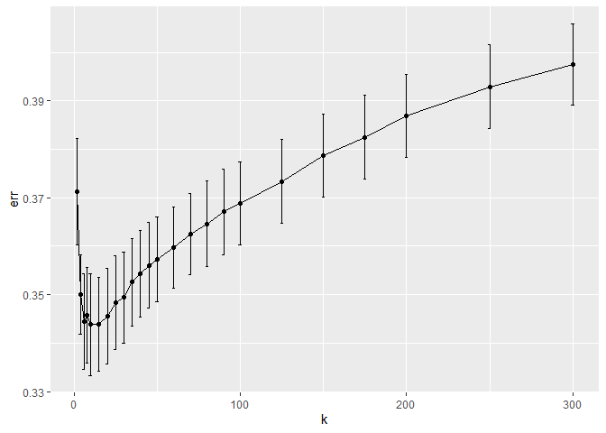
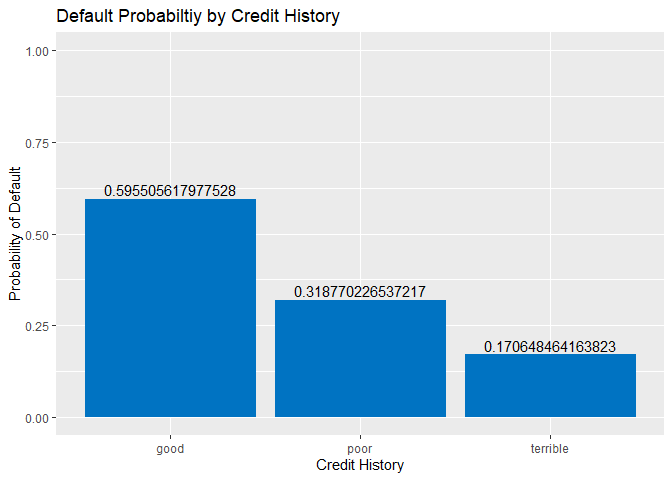
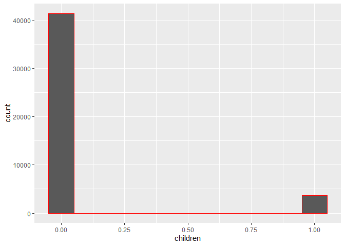
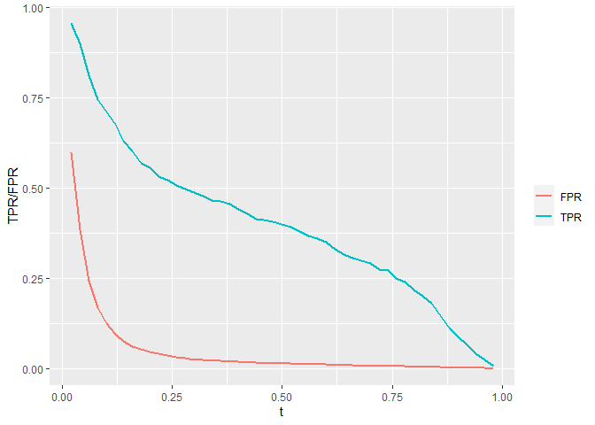
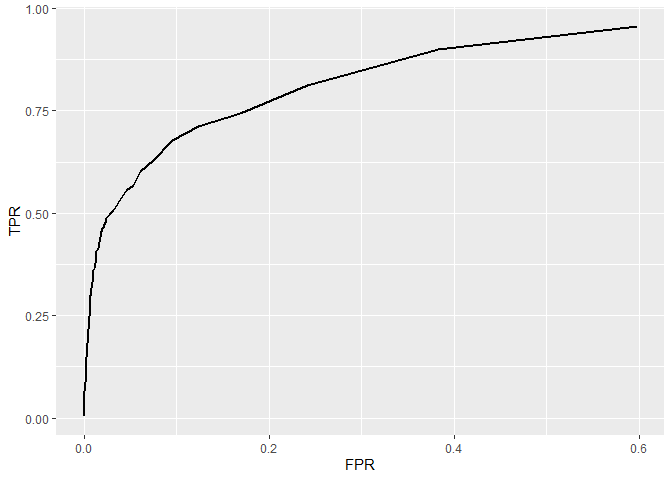
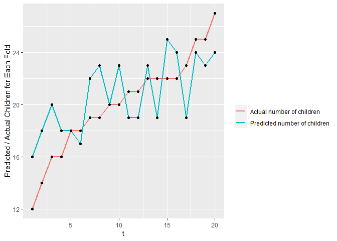

# Question 1: Saratoga house prices

    ## [1] 68578.35

    ## [1] 72976.74

    ## [1] 69052.32

## Since lm3 has the least rmse, lm3 is the best model among these above 3 lm models

    ##           k       err     std_err
    ## result.1  2 0.3712401 0.011057931
    ## result.2  4 0.3499795 0.008220215
    ## result.3  6 0.3445170 0.009870766
    ## result.4  8 0.3457580 0.009882270
    ## result.5 10 0.3437891 0.010429398
    ## result.6 15 0.3438651 0.009615332

 \##
We can get the best k according to the following:

    ## [1] 10

## Then we calculate the knn20 method RMSE

    ## [1] 0.3390831

## Then averaging the estimate of out-of-sample RMSE over many different random train/test splits for the linear models, either randomly or by cross-validation.

    ## [1] 64840.72 62749.47 58929.45

    ## [1] 0.3431504

    ## [1] 0.01382039

## Since the error from knn model is smaller than that in lm3, I think knn model does a better prediction in the price of house in NY.

# Question 2: Classification and retrospective sampling

    ## 
    ## Call:
    ## glm(formula = Default ~ +duration + amount + installment + age + 
    ##     history + purpose + foreign, family = "binomial", data = credit_training)
    ## 
    ## Deviance Residuals: 
    ##     Min       1Q   Median       3Q      Max  
    ## -2.3295  -0.8096  -0.5659   1.0152   2.3538  
    ## 
    ## Coefficients:
    ##                       Estimate Std. Error z value Pr(>|z|)    
    ## (Intercept)         -5.195e-01  5.259e-01  -0.988  0.32321    
    ## duration             2.605e-02  9.155e-03   2.846  0.00443 ** 
    ## amount               9.157e-05  3.937e-05   2.326  0.02004 *  
    ## installment          2.370e-01  8.552e-02   2.771  0.00559 ** 
    ## age                 -2.558e-02  8.153e-03  -3.138  0.00170 ** 
    ## historypoor         -1.108e+00  2.707e-01  -4.092 4.27e-05 ***
    ## historyterrible     -1.744e+00  3.081e-01  -5.659 1.52e-08 ***
    ## purposeedu           5.804e-01  4.018e-01   1.444  0.14863    
    ## purposegoods/repair -1.973e-02  2.793e-01  -0.071  0.94367    
    ## purposenewcar        7.724e-01  3.050e-01   2.532  0.01133 *  
    ## purposeusedcar      -7.704e-01  3.874e-01  -1.988  0.04677 *  
    ## foreigngerman       -8.747e-01  6.019e-01  -1.453  0.14614    
    ## ---
    ## Signif. codes:  0 '***' 0.001 '**' 0.01 '*' 0.05 '.' 0.1 ' ' 1
    ## 
    ## (Dispersion parameter for binomial family taken to be 1)
    ## 
    ##     Null deviance: 977.38  on 799  degrees of freedom
    ## Residual deviance: 855.23  on 788  degrees of freedom
    ## AIC: 879.23
    ## 
    ## Number of Fisher Scoring iterations: 4

    ##         (Intercept)            duration              amount         installment 
    ##               -0.52                0.03                0.00                0.24 
    ##                 age         historypoor     historyterrible          purposeedu 
    ##               -0.03               -1.11               -1.74                0.58 
    ## purposegoods/repair       purposenewcar      purposeusedcar       foreigngerman 
    ##               -0.02                0.77               -0.77               -0.87

    ##    yhat
    ## y     0   1
    ##   0 130  10
    ##   1  44  16

\##The coef for having poor and terrible credit history is -1.11 and
-1.88. They are statsitically signicifant. Having a poor or terrible
credit history multiplies odds of default by 0.33 and 0.15, which
counter-intuitively have negative effect on default. The retrospective,
“case-control” method that the bank used to select samples resulted in a
substantial oversampling of defaults, relative to a random sample of
loans in the bank’s overall portfolio. If the purpose of the model is to
screen prospective borrowers to classify them into “high” versus “low”
probability of default, this data set is not appropriate for building a
predictive model.

    ## 
    ##   0   1 
    ## 700 300

## To improve the sampling scheme under limited resources to get the data on all subjects in the loans, it requires a method to reduce the oversampling of defaults. Previously, the set of non-defauled loans (“controls”) is matched with similar set of defaulted loans, leaving “controls” less independent of the set of defaulted loans, the “controls” are not reprensentative of the source population that produced the default cases either. Selection bias resulted. A better sampling scheme should adhere to fixing these two issues. A random sampling method will give defaulted loans and non-defaulted loans equal chance of being selected, and the “controls” is selected independently from the cases.

## The second step is to increase the ratio between non-defaulted loan and defaulted loan. Since defaulted loans are rare cases and non-defaulted loans are plentiful, the statistical power of the study can be increased by enrolling more non-defaulted loans than the defaulted. However, ratio more than 4 controls over 1 case adds little impact on power. Therefore, if it is time-consuming or expensive to collect sets of controls, the ratio should not exceed 4:1. Alternatively, if it is not expensive, there is no reason to limit the number of non-defaulted loans. In this case of 300 defaulted loans, the number of non-defaulted loans can be increased from 700 to 1200 or even more. With these two steps, the sampling scheme will be improved.

# Question 3: Children and hotel reservations

    ##          hotel lead_time stays_in_weekend_nights stays_in_week_nights adults
    ## 1   City_Hotel       217                       1                    3      2
    ## 2   City_Hotel         2                       0                    1      2
    ## 3 Resort_Hotel        95                       2                    5      2
    ## 4 Resort_Hotel       143                       2                    6      2
    ## 5 Resort_Hotel       136                       1                    4      2
    ## 6   City_Hotel        67                       2                    2      2
    ##   children meal market_segment distribution_channel is_repeated_guest
    ## 1        0   BB  Offline_TA/TO                TA/TO                 0
    ## 2        0   BB         Direct               Direct                 0
    ## 3        0   BB      Online_TA                TA/TO                 0
    ## 4        0   HB      Online_TA                TA/TO                 0
    ## 5        0   HB         Direct               Direct                 0
    ## 6        0   SC      Online_TA                TA/TO                 0
    ##   previous_cancellations previous_bookings_not_canceled reserved_room_type
    ## 1                      0                              0                  A
    ## 2                      0                              0                  D
    ## 3                      0                              0                  A
    ## 4                      0                              0                  A
    ## 5                      0                              0                  F
    ## 6                      0                              0                  A
    ##   assigned_room_type booking_changes deposit_type days_in_waiting_list
    ## 1                  A               0   No_Deposit                    0
    ## 2                  K               0   No_Deposit                    0
    ## 3                  A               2   No_Deposit                    0
    ## 4                  A               0   No_Deposit                    0
    ## 5                  F               0   No_Deposit                    0
    ## 6                  A               0   No_Deposit                    0
    ##     customer_type average_daily_rate required_car_parking_spaces
    ## 1 Transient-Party              80.75                        none
    ## 2       Transient             170.00                        none
    ## 3       Transient               8.00                        none
    ## 4       Transient              81.00                        none
    ## 5       Transient             157.60                        none
    ## 6       Transient              49.09                        none
    ##   total_of_special_requests arrival_date
    ## 1                         1   2016-09-01
    ## 2                         3   2017-08-25
    ## 3                         2   2016-11-19
    ## 4                         1   2016-04-26
    ## 5                         4   2016-12-28
    ## 6                         1   2016-03-13

    ##          hotel lead_time stays_in_weekend_nights stays_in_week_nights adults
    ## 1 Resort_Hotel        47                       0                    2      2
    ## 2 Resort_Hotel        46                       0                    2      2
    ## 3   City_Hotel        22                       1                    2      2
    ## 4 Resort_Hotel       209                       2                    5      2
    ## 5   City_Hotel         1                       1                    0      2
    ## 6 Resort_Hotel       171                       2                    5      2
    ##   children meal market_segment distribution_channel is_repeated_guest
    ## 1        1   BB         Direct               Direct                 0
    ## 2        0   BB  Offline_TA/TO                TA/TO                 0
    ## 3        0   BB      Online_TA                TA/TO                 0
    ## 4        0   BB  Offline_TA/TO                TA/TO                 0
    ## 5        0   SC      Online_TA                TA/TO                 0
    ## 6        0   BB      Online_TA                TA/TO                 0
    ##   previous_cancellations previous_bookings_not_canceled reserved_room_type
    ## 1                      0                              0                  C
    ## 2                      0                              0                  D
    ## 3                      0                              0                  D
    ## 4                      0                              0                  A
    ## 5                      0                              0                  A
    ## 6                      0                              0                  D
    ##   assigned_room_type booking_changes deposit_type days_in_waiting_list
    ## 1                  C               0   No_Deposit                    0
    ## 2                  D               0   No_Deposit                    0
    ## 3                  D               0   No_Deposit                    0
    ## 4                  A               0   No_Deposit                    0
    ## 5                  B               0   No_Deposit                    0
    ## 6                  D               2   No_Deposit                    0
    ##     customer_type average_daily_rate required_car_parking_spaces
    ## 1       Transient             289.00                        none
    ## 2       Transient             162.00                        none
    ## 3       Transient             121.33                        none
    ## 4       Transient              76.22                        none
    ## 5       Transient              98.00                        none
    ## 6 Transient-Party             182.86                        none
    ##   total_of_special_requests arrival_date
    ## 1                         1   2017-08-23
    ## 2                         0   2016-12-30
    ## 3                         0   2017-03-13
    ## 4                         0   2016-07-12
    ## 5                         0   2016-08-07
    ## 6                         1   2017-07-25

    ## fold 1,2,3,4,5,6,7,8,9,10,done.

    ## fold 1,2,3,4,5,6,7,8,9,10,done.

    ## 49 x 1 sparse Matrix of class "dgCMatrix"
    ##                                           seg100
    ## intercept                          -4.4594267199
    ## hotelCity_Hotel                     0.6456819091
    ## hotelResort_Hotel                  -0.0005962879
    ## lead_time                           0.0005964019
    ## stays_in_weekend_nights             0.0340619094
    ## stays_in_week_nights               -0.0008622877
    ## adults                             -0.4917533396
    ## mealFB                              0.4541402081
    ## mealHB                              .           
    ## mealSC                             -1.0560210549
    ## mealUndefined                       .           
    ## market_segmentComplementary         0.0381026697
    ## market_segmentCorporate            -1.0232022646
    ## market_segmentDirect                .           
    ## market_segmentGroups               -1.1841931108
    ## market_segmentOffline_TA/TO         .           
    ## market_segmentOnline_TA             0.0229450544
    ## distribution_channelDirect          0.0923531718
    ## distribution_channelGDS            -1.3630945468
    ## distribution_channelTA/TO           .           
    ## is_repeated_guest                  -0.7099941023
    ## previous_cancellations              .           
    ## previous_bookings_not_canceled     -0.1081049413
    ## reserved_room_typeB                 1.6848060839
    ## reserved_room_typeC                 2.7320324300
    ## reserved_room_typeD                -1.1513504253
    ## reserved_room_typeE                -0.1646326183
    ## reserved_room_typeF                 1.5864043024
    ## reserved_room_typeG                 2.2289405006
    ## reserved_room_typeH                 3.2166319857
    ## assigned_room_typeB                 0.3135620833
    ## assigned_room_typeC                 1.4037409203
    ## assigned_room_typeD                 1.0763638056
    ## assigned_room_typeE                 0.6384986264
    ## assigned_room_typeF                 0.8874904991
    ## assigned_room_typeG                 1.0399202685
    ## assigned_room_typeH                 1.1848203555
    ## assigned_room_typeI                 1.0394599535
    ## assigned_room_typeK                 0.4022079321
    ## booking_changes                     0.2694347537
    ## deposit_typeNon_Refund              .           
    ## deposit_typeRefundable              .           
    ## days_in_waiting_list               -0.0013326947
    ## customer_typeGroup                 -0.2431042656
    ## customer_typeTransient              0.3297840729
    ## customer_typeTransient-Party       -0.4071310048
    ## average_daily_rate                  0.0101895780
    ## required_car_parking_spacesparking  .           
    ## total_of_special_requests           0.4712882311

    ##                             strong_interaction_name strong_interaction_beta
    ## 1   market_segmentOffline_TA/TO:reserved_room_typeH        3.79940771161942
    ## 2       market_segmentOnline_TA:reserved_room_typeB          -3.46527936398
    ## 3           reserved_room_typeF:assigned_room_typeK        3.30797852068824
    ## 4          market_segmentDirect:reserved_room_typeB        3.26382695750737
    ## 5             hotelResort_Hotel:reserved_room_typeB        3.23816670778364
    ## 6   market_segmentComplementary:reserved_room_typeF        3.21971713260496
    ## 7                 mealUndefined:reserved_room_typeG       -3.19834815035416
    ## 8  is_repeated_guest:previous_bookings_not_canceled        2.98166057568843
    ## 9   market_segmentComplementary:reserved_room_typeC        2.83728021513713
    ## 10          reserved_room_typeH:assigned_room_typeD        2.78716360450179
    ## 11          reserved_room_typeB:assigned_room_typeB       -2.73211403295252
    ## 12                       mealHB:reserved_room_typeF         2.7183016441531
    ## 13          reserved_room_typeD:assigned_room_typeD       -2.65704912775947
    ## 14          reserved_room_typeB:assigned_room_typeG        2.60047650397836
    ## 15      market_segmentOnline_TA:reserved_room_typeD        2.45333902578345
    ## 16            hotelResort_Hotel:reserved_room_typeE       -2.39036843591887
    ## 17                              reserved_room_typeE        2.28073952854933
    ## 18         market_segmentDirect:reserved_room_typeF        2.27644878700108
    ## 19       reserved_room_typeB:deposit_typeRefundable       -2.25161163246006
    ## 20                       mealSC:reserved_room_typeG        2.12097421028381
    ## 21            adults:previous_bookings_not_canceled       -2.08153650401271
    ## 22                mealUndefined:assigned_room_typeB       -1.90239075730287
    ## 23         market_segmentGroups:reserved_room_typeG         1.8499335400162
    ## 24                              reserved_room_typeF         1.8204470876151
    ## 25                              reserved_room_typeG        1.80029869875078
    ## 26          reserved_room_typeB:assigned_room_typeF        1.79708865110971
    ## 27         market_segmentDirect:reserved_room_typeG       -1.74466684402382
    ## 28         market_segmentDirect:assigned_room_typeC        1.66404281273466
    ## 29           reserved_room_typeH:average_daily_rate       -1.63754615434747
    ## 30                       mealFB:assigned_room_typeI       -1.63395473268237
    ##    abs_beta
    ## 1  3.799408
    ## 2  3.465279
    ## 3  3.307979
    ## 4  3.263827
    ## 5  3.238167
    ## 6  3.219717
    ## 7  3.198348
    ## 8  2.981661
    ## 9  2.837280
    ## 10 2.787164
    ## 11 2.732114
    ## 12 2.718302
    ## 13 2.657049
    ## 14 2.600477
    ## 15 2.453339
    ## 16 2.390368
    ## 17 2.280740
    ## 18 2.276449
    ## 19 2.251612
    ## 20 2.120974
    ## 21 2.081537
    ## 22 1.902391
    ## 23 1.849934
    ## 24 1.820447
    ## 25 1.800299
    ## 26 1.797089
    ## 27 1.744667
    ## 28 1.664043
    ## 29 1.637546
    ## 30 1.633955

    ##                                              (Intercept) 
    ##                                            -2.113172e+01 
    ##                                        hotelResort_Hotel 
    ##                                            -7.472666e-01 
    ##                                                lead_time 
    ##                                             1.351116e-03 
    ##                                  stays_in_weekend_nights 
    ##                                             6.931520e-02 
    ##                                     stays_in_week_nights 
    ##                                            -2.518288e-02 
    ##                                                   adults 
    ##                                            -6.412379e-01 
    ##                                                   mealFB 
    ##                                             1.275566e+00 
    ##                                                   mealHB 
    ##                                             2.323725e-01 
    ##                                                   mealSC 
    ##                                            -1.352988e+00 
    ##                                            mealUndefined 
    ##                                            -7.582126e-01 
    ##                              market_segmentComplementary 
    ##                                             1.888601e+01 
    ##                                  market_segmentCorporate 
    ##                                            -5.314122e+00 
    ##                                     market_segmentDirect 
    ##                                             1.891950e+01 
    ##                                     market_segmentGroups 
    ##                                            -5.701358e+00 
    ##                              market_segmentOffline_TA/TO 
    ##                                             1.728956e+01 
    ##                                  market_segmentOnline_TA 
    ##                                             1.640644e+01 
    ##                               distribution_channelDirect 
    ##                                             1.186983e+00 
    ##                                  distribution_channelGDS 
    ##                                            -1.318900e+01 
    ##                                distribution_channelTA/TO 
    ##                                             2.385779e-01 
    ##                                        is_repeated_guest 
    ##                                             4.149684e-01 
    ##                                   previous_cancellations 
    ##                                            -1.027137e-01 
    ##                           previous_bookings_not_canceled 
    ##                                            -1.329561e+00 
    ##                                      reserved_room_typeB 
    ##                                             1.796818e+00 
    ##                                      reserved_room_typeC 
    ##                                            -5.188494e+01 
    ##                                      reserved_room_typeD 
    ##                                            -2.744955e-01 
    ##                                      reserved_room_typeE 
    ##                                            -2.512350e+01 
    ##                                      reserved_room_typeF 
    ##                                             5.235114e+00 
    ##                                      reserved_room_typeG 
    ##                                            -2.386512e+01 
    ##                                      reserved_room_typeH 
    ##                                            -5.308320e+12 
    ##                                      assigned_room_typeB 
    ##                                             7.564665e-01 
    ##                                      assigned_room_typeC 
    ##                                             1.727519e+00 
    ##                                      assigned_room_typeD 
    ##                                             1.462388e+00 
    ##                                      assigned_room_typeE 
    ##                                             9.972605e-01 
    ##                                      assigned_room_typeF 
    ##                                             9.166861e-01 
    ##                                      assigned_room_typeG 
    ##                                             6.047421e-01 
    ##                                      assigned_room_typeH 
    ##                                             1.721306e+00 
    ##                                      assigned_room_typeI 
    ##                                             8.918847e-01 
    ##                                      assigned_room_typeK 
    ##                                            -5.149369e-01 
    ##                                          booking_changes 
    ##                                             2.762027e-01 
    ##                                     days_in_waiting_list 
    ##                                            -1.446064e-03 
    ##                                       customer_typeGroup 
    ##                                             1.081756e+00 
    ##                                   customer_typeTransient 
    ##                                             1.036722e+00 
    ##                             customer_typeTransient-Party 
    ##                                             7.984621e-01 
    ##                                       average_daily_rate 
    ##                                             1.064306e-02 
    ##                       required_car_parking_spacesparking 
    ##                                             4.134141e-01 
    ##                                total_of_special_requests 
    ##                                             5.321354e-01 
    ##                               mealFB:reserved_room_typeB 
    ##                                                       NA 
    ##                               mealHB:reserved_room_typeB 
    ##                                            -7.141057e+01 
    ##                               mealSC:reserved_room_typeB 
    ##                                             2.653317e-01 
    ##                        mealUndefined:reserved_room_typeB 
    ##                                                       NA 
    ##                               mealFB:reserved_room_typeC 
    ##                                            -2.961757e+00 
    ##                               mealHB:reserved_room_typeC 
    ##                                            -7.182062e-02 
    ##                               mealSC:reserved_room_typeC 
    ##                                                       NA 
    ##                        mealUndefined:reserved_room_typeC 
    ##                                            -6.673550e-01 
    ##                               mealFB:reserved_room_typeD 
    ##                                             7.435289e-02 
    ##                               mealHB:reserved_room_typeD 
    ##                                            -2.959360e-01 
    ##                               mealSC:reserved_room_typeD 
    ##                                             2.411520e+00 
    ##                        mealUndefined:reserved_room_typeD 
    ##                                             1.543857e+00 
    ##                               mealFB:reserved_room_typeE 
    ##                                            -2.496410e+01 
    ##                               mealHB:reserved_room_typeE 
    ##                                            -2.576841e-01 
    ##                               mealSC:reserved_room_typeE 
    ##                                            -2.077144e+01 
    ##                        mealUndefined:reserved_room_typeE 
    ##                                             2.240375e+00 
    ##                               mealFB:reserved_room_typeF 
    ##                                            -2.225537e+01 
    ##                               mealHB:reserved_room_typeF 
    ##                                            -3.709577e-01 
    ##                               mealSC:reserved_room_typeF 
    ##                                             3.154604e+00 
    ##                        mealUndefined:reserved_room_typeF 
    ##                                            -2.360426e+01 
    ##                               mealFB:reserved_room_typeG 
    ##                                             2.298051e+01 
    ##                               mealHB:reserved_room_typeG 
    ##                                            -1.278599e-01 
    ##                               mealSC:reserved_room_typeG 
    ##                                            -3.943943e+01 
    ##                        mealUndefined:reserved_room_typeG 
    ##                                             2.882910e+01 
    ##                               mealFB:reserved_room_typeH 
    ##                                            -2.803947e+01 
    ##                               mealHB:reserved_room_typeH 
    ##                                            -1.497469e-01 
    ##                               mealSC:reserved_room_typeH 
    ##                                                       NA 
    ##                        mealUndefined:reserved_room_typeH 
    ##                                                       NA 
    ##                  reserved_room_typeB:assigned_room_typeB 
    ##                                            -7.214472e-01 
    ##                  reserved_room_typeC:assigned_room_typeB 
    ##                                             2.373221e-01 
    ##                  reserved_room_typeD:assigned_room_typeB 
    ##                                             7.439530e-01 
    ##                  reserved_room_typeE:assigned_room_typeB 
    ##                                                       NA 
    ##                  reserved_room_typeF:assigned_room_typeB 
    ##                                            -3.817067e+00 
    ##                  reserved_room_typeG:assigned_room_typeB 
    ##                                                       NA 
    ##                  reserved_room_typeH:assigned_room_typeB 
    ##                                                       NA 
    ##                  reserved_room_typeB:assigned_room_typeC 
    ##                                                       NA 
    ##                  reserved_room_typeC:assigned_room_typeC 
    ##                                             2.658614e+01 
    ##                  reserved_room_typeD:assigned_room_typeC 
    ##                                            -2.340062e+01 
    ##                  reserved_room_typeE:assigned_room_typeC 
    ##                                             3.110142e+01 
    ##                  reserved_room_typeF:assigned_room_typeC 
    ##                                                       NA 
    ##                  reserved_room_typeG:assigned_room_typeC 
    ##                                             4.464722e+01 
    ##                  reserved_room_typeH:assigned_room_typeC 
    ##                                                       NA 
    ##                  reserved_room_typeB:assigned_room_typeD 
    ##                                            -6.815547e-01 
    ##                  reserved_room_typeC:assigned_room_typeD 
    ##                                             1.272318e+00 
    ##                  reserved_room_typeD:assigned_room_typeD 
    ##                                            -1.284611e+00 
    ##                  reserved_room_typeE:assigned_room_typeD 
    ##                                            -4.175002e+00 
    ##                  reserved_room_typeF:assigned_room_typeD 
    ##                                                       NA 
    ##                  reserved_room_typeG:assigned_room_typeD 
    ##                                                       NA 
    ##                  reserved_room_typeH:assigned_room_typeD 
    ##                                             5.308320e+12 
    ##                  reserved_room_typeB:assigned_room_typeE 
    ##                                             2.537543e+01 
    ##                  reserved_room_typeC:assigned_room_typeE 
    ##                                             2.738719e+01 
    ##                  reserved_room_typeD:assigned_room_typeE 
    ##                                            -8.142750e-01 
    ##                  reserved_room_typeE:assigned_room_typeE 
    ##                                             2.442592e+01 
    ##                  reserved_room_typeF:assigned_room_typeE 
    ##                                            -2.877792e+00 
    ##                  reserved_room_typeG:assigned_room_typeE 
    ##                                             9.438167e+01 
    ##                  reserved_room_typeH:assigned_room_typeE 
    ##                                                       NA 
    ##                  reserved_room_typeB:assigned_room_typeF 
    ##                                                       NA 
    ##                  reserved_room_typeC:assigned_room_typeF 
    ##                                             4.528885e+01 
    ##                  reserved_room_typeD:assigned_room_typeF 
    ##                                            -6.977485e-01 
    ##                  reserved_room_typeE:assigned_room_typeF 
    ##                                             2.448074e+01 
    ##                  reserved_room_typeF:assigned_room_typeF 
    ##                                            -2.159185e+00 
    ##                  reserved_room_typeG:assigned_room_typeF 
    ##                                             2.615090e+01 
    ##                  reserved_room_typeH:assigned_room_typeF 
    ##                                                       NA 
    ##                  reserved_room_typeB:assigned_room_typeG 
    ##                                            -3.544264e-02 
    ##                  reserved_room_typeC:assigned_room_typeG 
    ##                                             5.295765e+01 
    ##                  reserved_room_typeD:assigned_room_typeG 
    ##                                             2.608037e-01 
    ##                  reserved_room_typeE:assigned_room_typeG 
    ##                                             2.459977e+01 
    ##                  reserved_room_typeF:assigned_room_typeG 
    ##                                            -1.899240e+00 
    ##                  reserved_room_typeG:assigned_room_typeG 
    ##                                             2.579779e+01 
    ##                  reserved_room_typeH:assigned_room_typeG 
    ##                                             5.308320e+12 
    ##                  reserved_room_typeB:assigned_room_typeH 
    ##                                                       NA 
    ##                  reserved_room_typeC:assigned_room_typeH 
    ##                                             2.680203e+01 
    ##                  reserved_room_typeD:assigned_room_typeH 
    ##                                            -1.142003e+00 
    ##                  reserved_room_typeE:assigned_room_typeH 
    ##                                            -2.026895e+00 
    ##                  reserved_room_typeF:assigned_room_typeH 
    ##                                            -2.319945e+01 
    ##                  reserved_room_typeG:assigned_room_typeH 
    ##                                             2.240493e+01 
    ##                  reserved_room_typeH:assigned_room_typeH 
    ##                                             5.308320e+12 
    ##                  reserved_room_typeB:assigned_room_typeI 
    ##                                                       NA 
    ##                  reserved_room_typeC:assigned_room_typeI 
    ##                                             5.218469e+01 
    ##                  reserved_room_typeD:assigned_room_typeI 
    ##                                            -9.644279e-01 
    ##                  reserved_room_typeE:assigned_room_typeI 
    ##                                             2.073025e+00 
    ##                  reserved_room_typeF:assigned_room_typeI 
    ##                                            -2.707432e+00 
    ##                  reserved_room_typeG:assigned_room_typeI 
    ##                                             2.561126e+01 
    ##                  reserved_room_typeH:assigned_room_typeI 
    ##                                             5.308320e+12 
    ##                  reserved_room_typeB:assigned_room_typeK 
    ##                                             4.825960e-01 
    ##                  reserved_room_typeC:assigned_room_typeK 
    ##                                                       NA 
    ##                  reserved_room_typeD:assigned_room_typeK 
    ##                                             4.527844e-01 
    ##                  reserved_room_typeE:assigned_room_typeK 
    ##                                             4.171120e-01 
    ##                  reserved_room_typeF:assigned_room_typeK 
    ##                                            -2.227064e+00 
    ##                  reserved_room_typeG:assigned_room_typeK 
    ##                                             5.300707e+01 
    ##                  reserved_room_typeH:assigned_room_typeK 
    ##                                                       NA 
    ##                    hotelResort_Hotel:reserved_room_typeB 
    ##                                                       NA 
    ##                    hotelResort_Hotel:reserved_room_typeC 
    ##                                             2.788715e+01 
    ##                    hotelResort_Hotel:reserved_room_typeD 
    ##                                             8.390717e-01 
    ##                    hotelResort_Hotel:reserved_room_typeE 
    ##                                            -9.856617e-01 
    ##                    hotelResort_Hotel:reserved_room_typeF 
    ##                                            -2.923884e+00 
    ##                    hotelResort_Hotel:reserved_room_typeG 
    ##                                             1.419298e+00 
    ##                    hotelResort_Hotel:reserved_room_typeH 
    ##                                                       NA 
    ##          market_segmentComplementary:reserved_room_typeB 
    ##                                             1.089808e+00 
    ##              market_segmentCorporate:reserved_room_typeB 
    ##                                             3.894257e+00 
    ##                 market_segmentDirect:reserved_room_typeB 
    ##                                             1.665733e-02 
    ##                 market_segmentGroups:reserved_room_typeB 
    ##                                             5.637538e+01 
    ##          market_segmentOffline_TA/TO:reserved_room_typeB 
    ##                                             3.629127e-01 
    ##              market_segmentOnline_TA:reserved_room_typeB 
    ##                                                       NA 
    ##          market_segmentComplementary:reserved_room_typeC 
    ##                                            -2.663974e+01 
    ##              market_segmentCorporate:reserved_room_typeC 
    ##                                             3.174971e+00 
    ##                 market_segmentDirect:reserved_room_typeC 
    ##                                             4.960177e-01 
    ##                 market_segmentGroups:reserved_room_typeC 
    ##                                             2.442321e+00 
    ##          market_segmentOffline_TA/TO:reserved_room_typeC 
    ##                                             5.889568e-01 
    ##              market_segmentOnline_TA:reserved_room_typeC 
    ##                                                       NA 
    ##          market_segmentComplementary:reserved_room_typeD 
    ##                                             1.035087e+00 
    ##              market_segmentCorporate:reserved_room_typeD 
    ##                                             8.731236e-01 
    ##                 market_segmentDirect:reserved_room_typeD 
    ##                                             3.832334e-01 
    ##                 market_segmentGroups:reserved_room_typeD 
    ##                                             3.459161e-01 
    ##          market_segmentOffline_TA/TO:reserved_room_typeD 
    ##                                             2.385967e-01 
    ##              market_segmentOnline_TA:reserved_room_typeD 
    ##                                            -6.693140e-01 
    ##          market_segmentComplementary:reserved_room_typeE 
    ##                                             2.912140e+00 
    ##              market_segmentCorporate:reserved_room_typeE 
    ##                                            -2.277351e+01 
    ##                 market_segmentDirect:reserved_room_typeE 
    ##                                             1.567403e+00 
    ##                 market_segmentGroups:reserved_room_typeE 
    ##                                            -2.095581e+01 
    ##          market_segmentOffline_TA/TO:reserved_room_typeE 
    ##                                             1.472375e+00 
    ##              market_segmentOnline_TA:reserved_room_typeE 
    ##                                                       NA 
    ##          market_segmentComplementary:reserved_room_typeF 
    ##                                            -1.068700e+00 
    ##              market_segmentCorporate:reserved_room_typeF 
    ##                                             2.768309e+01 
    ##                 market_segmentDirect:reserved_room_typeF 
    ##                                            -5.485989e-01 
    ##                 market_segmentGroups:reserved_room_typeF 
    ##                                             1.231494e+00 
    ##          market_segmentOffline_TA/TO:reserved_room_typeF 
    ##                                            -1.208818e+00 
    ##              market_segmentOnline_TA:reserved_room_typeF 
    ##                                                       NA 
    ##          market_segmentComplementary:reserved_room_typeG 
    ##                                            -1.379877e+00 
    ##              market_segmentCorporate:reserved_room_typeG 
    ##                                            -1.877810e-01 
    ##                 market_segmentDirect:reserved_room_typeG 
    ##                                            -2.464962e-01 
    ##                 market_segmentGroups:reserved_room_typeG 
    ##                                            -2.491937e+01 
    ##          market_segmentOffline_TA/TO:reserved_room_typeG 
    ##                                             2.095135e+00 
    ##              market_segmentOnline_TA:reserved_room_typeG 
    ##                                                       NA 
    ##          market_segmentComplementary:reserved_room_typeH 
    ##                                                       NA 
    ##              market_segmentCorporate:reserved_room_typeH 
    ##                                                       NA 
    ##                 market_segmentDirect:reserved_room_typeH 
    ##                                            -2.817200e+00 
    ##                 market_segmentGroups:reserved_room_typeH 
    ##                                                       NA 
    ##          market_segmentOffline_TA/TO:reserved_room_typeH 
    ##                                                       NA 
    ##              market_segmentOnline_TA:reserved_room_typeH 
    ##                                                       NA 
    ##                                 mealFB:is_repeated_guest 
    ##                                            -2.844795e+00 
    ##                                 mealHB:is_repeated_guest 
    ##                                            -8.668607e-02 
    ##                                 mealSC:is_repeated_guest 
    ##                                             6.074149e-01 
    ##                          mealUndefined:is_repeated_guest 
    ##                                            -5.037444e+01 
    ##                    adults:previous_bookings_not_canceled 
    ##                                             5.229178e-01 
    ##                    mealFB:previous_bookings_not_canceled 
    ##                                            -2.307263e+01 
    ##                    mealHB:previous_bookings_not_canceled 
    ##                                             5.640561e-01 
    ##                    mealSC:previous_bookings_not_canceled 
    ##                                             4.613305e-02 
    ##             mealUndefined:previous_bookings_not_canceled 
    ##                                             2.702733e+01 
    ##           market_segmentComplementary:customer_typeGroup 
    ##                                            -2.595414e+01 
    ##               market_segmentCorporate:customer_typeGroup 
    ##                                            -9.455167e-01 
    ##                  market_segmentDirect:customer_typeGroup 
    ##                                            -2.782635e+01 
    ##                  market_segmentGroups:customer_typeGroup 
    ##                                            -1.103996e+00 
    ##           market_segmentOffline_TA/TO:customer_typeGroup 
    ##                                            -1.782216e+00 
    ##               market_segmentOnline_TA:customer_typeGroup 
    ##                                                       NA 
    ##       market_segmentComplementary:customer_typeTransient 
    ##                                            -2.861166e+00 
    ##           market_segmentCorporate:customer_typeTransient 
    ##                                             2.006710e+01 
    ##              market_segmentDirect:customer_typeTransient 
    ##                                            -3.371519e+00 
    ##              market_segmentGroups:customer_typeTransient 
    ##                                            -1.028267e+01 
    ##       market_segmentOffline_TA/TO:customer_typeTransient 
    ##                                            -7.542621e-01 
    ##           market_segmentOnline_TA:customer_typeTransient 
    ##                                             7.371234e-02 
    ## market_segmentComplementary:customer_typeTransient-Party 
    ##                                            -1.653735e+00 
    ##     market_segmentCorporate:customer_typeTransient-Party 
    ##                                             2.023496e+01 
    ##        market_segmentDirect:customer_typeTransient-Party 
    ##                                            -3.338478e+00 
    ##        market_segmentGroups:customer_typeTransient-Party 
    ##                                             1.996324e+01 
    ## market_segmentOffline_TA/TO:customer_typeTransient-Party 
    ##                                            -2.837619e+00 
    ##     market_segmentOnline_TA:customer_typeTransient-Party 
    ##                                                       NA 
    ##                    is_repeated_guest:assigned_room_typeB 
    ##                                             5.618440e-01 
    ##                    is_repeated_guest:assigned_room_typeC 
    ##                                            -1.762311e+00 
    ##                    is_repeated_guest:assigned_room_typeD 
    ##                                            -1.549119e+00 
    ##                    is_repeated_guest:assigned_room_typeE 
    ##                                            -2.528162e+01 
    ##                    is_repeated_guest:assigned_room_typeF 
    ##                                             4.483483e-01 
    ##                    is_repeated_guest:assigned_room_typeG 
    ##                                            -1.054685e+00 
    ##                    is_repeated_guest:assigned_room_typeH 
    ##                                            -1.008738e-01 
    ##                    is_repeated_guest:assigned_room_typeI 
    ##                                            -8.318669e-01 
    ##                    is_repeated_guest:assigned_room_typeK 
    ##                                             1.898469e+00 
    ##   assigned_room_typeB:required_car_parking_spacesparking 
    ##                                            -1.776103e+00 
    ##   assigned_room_typeC:required_car_parking_spacesparking 
    ##                                            -9.258623e-01 
    ##   assigned_room_typeD:required_car_parking_spacesparking 
    ##                                            -4.237990e-01 
    ##   assigned_room_typeE:required_car_parking_spacesparking 
    ##                                            -4.178099e-01 
    ##   assigned_room_typeF:required_car_parking_spacesparking 
    ##                                            -4.450762e-01 
    ##   assigned_room_typeG:required_car_parking_spacesparking 
    ##                                            -4.065398e-01 
    ##   assigned_room_typeH:required_car_parking_spacesparking 
    ##                                            -4.900860e-01 
    ##   assigned_room_typeI:required_car_parking_spacesparking 
    ##                                             1.440054e+00 
    ##   assigned_room_typeK:required_car_parking_spacesparking 
    ##                                            -2.267842e+01

    ##                     [,1]       [,2]    [,3]   [,4]   
    ## measurement         "Deviance" "TPR"   "FPR"  "FDR"  
    ## eval_baseline1      "5154.285" "0"     "0"    "NaN"  
    ## eval_baseline2      "3751.486" "0.324" "0.01" "0.263"
    ## eval_lasso_selected "3682.351" "0.357" "0.01" "0.23"

## We can see that the lasso model has the smallest deviance, the highest TPR(higher is better)

## and the lowest FPR & FDR (Both 2 are “lower is better”)

\## The ROC curve of our best model

 \##
We can see that our model doesn’t perform well \## The prediction isn’t
accurate. The predict numbers wiggle more than actual number.
