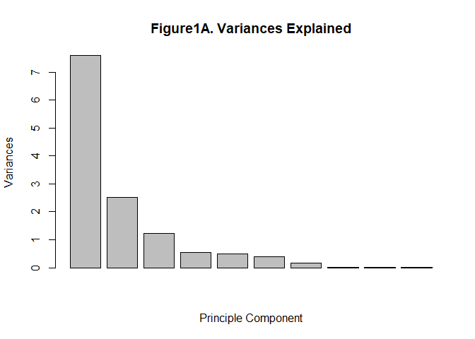
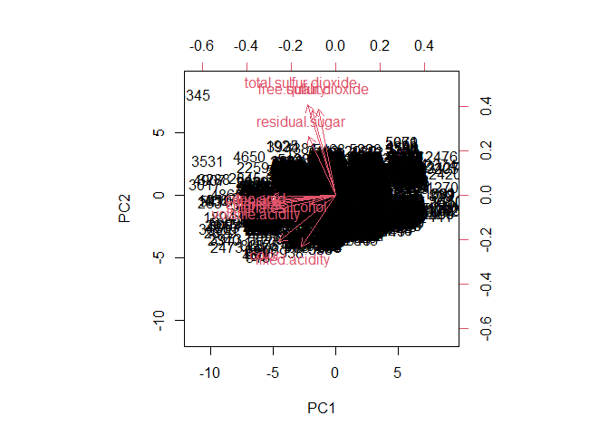
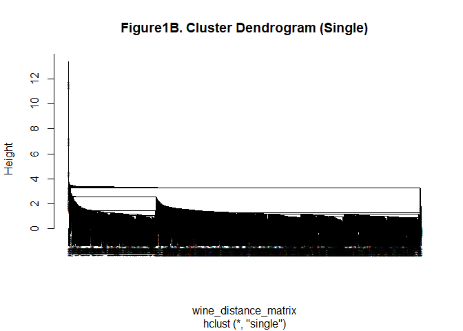
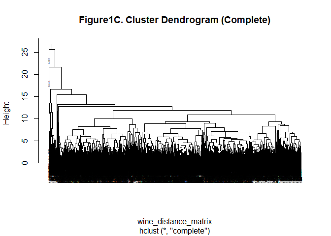
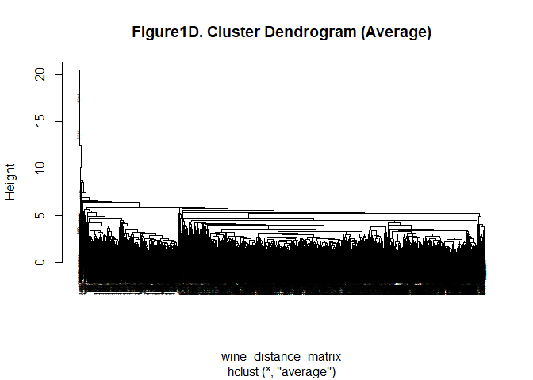
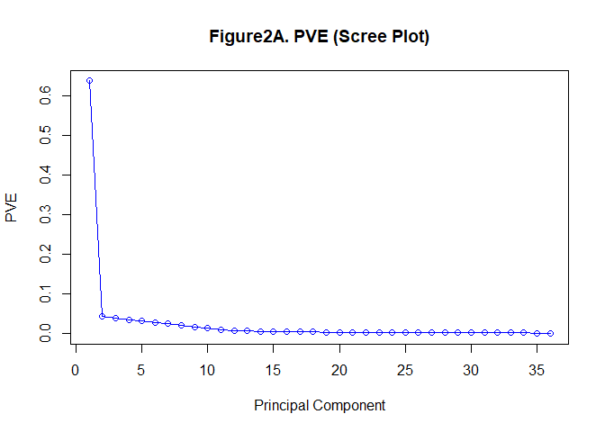
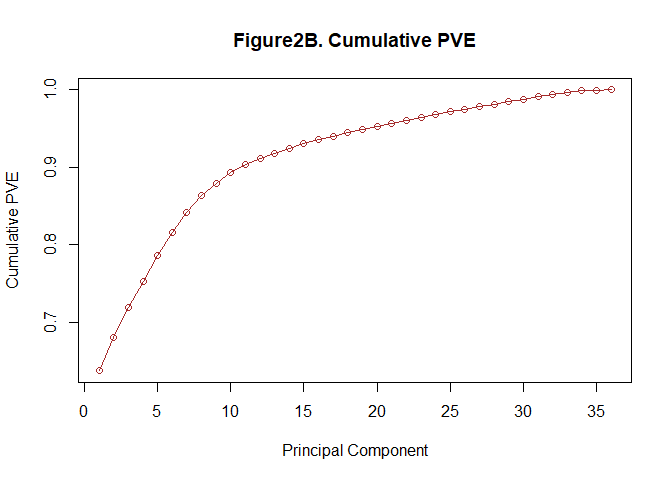
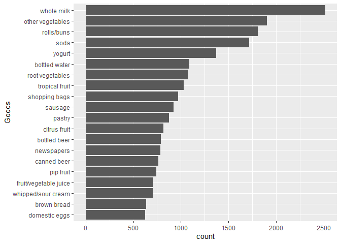
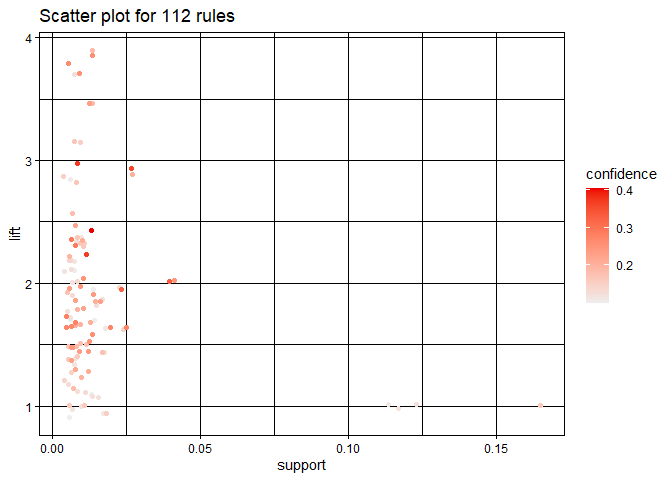
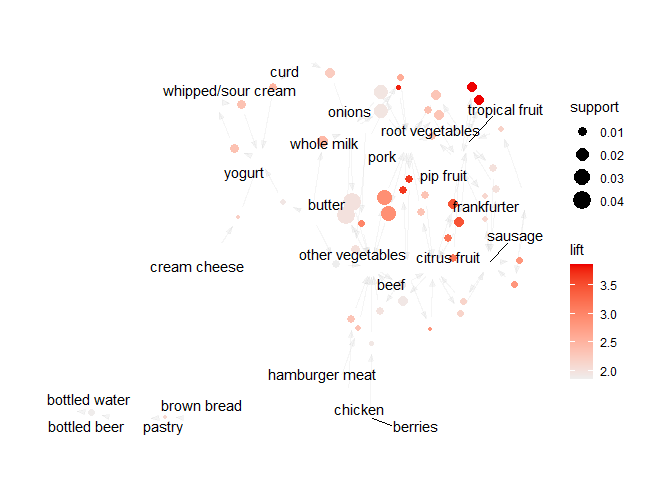

# Problem1: Clustering and PCA

The data set in problem 1 contains information on 11 chemical properties
of 6500 different bottles of vinho verde wine from northern Portugal.
Our task is to choose an unsupervised learning method to distinguish the
colors and qualities of wines contained in the data on chemical
properties, after running both a clustering algorithm and PCA. It should
be noted that before analyzing problems, the color variables are
converted to 1 for red and 2 for white.

**Part 1: PCA–Principle Component Analysis**

Before running PCA, the variables should be scaled firstly.

    ## Importance of components:
    ##                           PC1    PC2    PC3     PC4     PC5     PC6     PC7
    ## Standard deviation     2.7550 1.5876 1.1025 0.73768 0.71213 0.62027 0.41795
    ## Proportion of Variance 0.5838 0.1939 0.0935 0.04186 0.03901 0.02959 0.01344
    ## Cumulative Proportion  0.5838 0.7777 0.8712 0.91309 0.95210 0.98169 0.99513
    ##                            PC8     PC9    PC10    PC11    PC12      PC13
    ## Standard deviation     0.15153 0.13429 0.12698 0.07488 0.02421 0.0004722
    ## Proportion of Variance 0.00177 0.00139 0.00124 0.00043 0.00005 0.0000000
    ## Cumulative Proportion  0.99690 0.99828 0.99952 0.99995 1.00000 1.0000000

From this plot and summarized table above, we can learn that the first
four principle components can explain about 91.3% variances of data, so
4 principle components are selected to analyze problems convincingly.
Then a biplot below shows the scores of the principal components and the
positions of the loading vectors, where the specific values of the load
vectors are given in the table below.

    ##                              PC1          PC2          PC3          PC4
    ## fixed.acidity        -0.19077683 -0.290025718 -0.336260232  0.124215285
    ## volatile.acidity     -0.35525556 -0.086094618  0.004987411 -0.002185412
    ## citric.acid          -0.35917071 -0.009916111  0.018684316 -0.015409803
    ## residual.sugar       -0.15301218  0.329390424 -0.409698250 -0.685258813
    ## chlorides            -0.36074132 -0.034483189  0.022126971 -0.010135647
    ## free.sulfur.dioxide  -0.09744605  0.483349169 -0.144372684  0.633266986
    ## total.sulfur.dioxide -0.15523345  0.510715923 -0.083547403  0.194904935
    ## density              -0.36098618 -0.025258659  0.031729859 -0.018140464
    ## pH                   -0.35459542 -0.047357257  0.055303276  0.013606892
    ## sulphates            -0.35770820 -0.058613272  0.003522946  0.018204331
    ## alcohol              -0.13674490 -0.046597544  0.749778484 -0.048273665
    ## quality              -0.12974116  0.476713210  0.329097839 -0.248257532
    ## color                -0.31893242 -0.261700428 -0.125850579  0.104034476

From the results in the table and the biplot above, the values of
volatile.acidity, density and color are similar in the first principle
component and dioxide value is significant in the principle component,
so the ability to distinguish the red wines from the white wines is not
strong.

**Part 2: A clustering algorithm – hierarchical clustering**

Hierarchical clustering is selected to do the clustering analysis.
Firstly, we should normalize the variables. Then use the single linkage,
the complete linkage and the average linkage methods to do hierarchical
clustering on the variables respectively, using the Euclidean distance
as an indicator of the dissimilarity variables. A significant advantage
of the hierarchical clustering method is that it can output a
fascinating tree representation about individual observations, i.e., a
dendrogram.

From the three dendrograms, it is obvious that using complete linkage to
do hierarchical clustering can yield categories of relatively more
balanced size. Since the dataset is very large, we set k=10 rather than
4 in PCA before.

    ##         
    ## cluster2    0    1
    ##       1  2873 1231
    ##       2     0  168
    ##       3    12   26
    ##       4   164    4
    ##       5     0   15
    ##       6  1845  153
    ##       7     0    2
    ##       8     2    0
    ##       9     1    0
    ##       10    1    0

As the simple table shows, it is easy for us to distinguish the color of
wines in some clusters. For example, white wines occupy the majority in
cluster 4 and 6 while the reds occupy the majority in cluster 2 and 5.
Especially, in the last four clusters, it is more obvious to distinguish
the colors.

We then distinguished the quality of wines.

    ##         
    ## cluster2    3    4    5    6    7    8    9
    ##       1    15  133 1583 1826  487   59    1
    ##       2     0    0   39   94   33    2    0
    ##       3     1    1   26    9    1    0    0
    ##       4     5    5  119   39    0    0    0
    ##       5     4    5    6    0    0    0    0
    ##       6     4   71  364  865  558  132    4
    ##       7     0    1    1    0    0    0    0
    ##       8     0    0    0    2    0    0    0
    ##       9     0    0    0    1    0    0    0
    ##       10    1    0    0    0    0    0    0

Comparing to color of wines, it is not very easy to distinguish the
higher from the lower quality wines except for the last three clusters
by using clustering. However, recalling the biplot in PCA before, the
values of quality in PC2 is relatively very large (0.48), so it is easy
to distinguish the higher from lower quality wines in PCA.

# Problem 2: Market Segmentation

One purpose of market segmentation is to segment the market by
identifying people who are more inclined to accept a particular form of
advertising or who are more likely to buy a particular product. The data
in this problem was collected in the course of a market-research study
using followers of the Twitter account of a large consumer drinks brand
called “NutrientH20”(just to have a label). The goal is to analyze this
data, and to prepare a short report for NutrientH20 that identifies any
interesting market segments that appear to stand out in their
social-media audience. We decided to come up with some interesting,
well-supported insights about the audience and give the client some
insight as to how they might position their brand to maximally appeal to
each market segment.

**Part 1: Summaries of dataset**

    ##     chatter       current_events      travel       photo_sharing   
    ##  Min.   : 0.000   Min.   :0.000   Min.   : 0.000   Min.   : 0.000  
    ##  1st Qu.: 2.000   1st Qu.:1.000   1st Qu.: 0.000   1st Qu.: 1.000  
    ##  Median : 3.000   Median :1.000   Median : 1.000   Median : 2.000  
    ##  Mean   : 4.399   Mean   :1.526   Mean   : 1.585   Mean   : 2.697  
    ##  3rd Qu.: 6.000   3rd Qu.:2.000   3rd Qu.: 2.000   3rd Qu.: 4.000  
    ##  Max.   :26.000   Max.   :8.000   Max.   :26.000   Max.   :21.000  
    ##  uncategorized      tv_film      sports_fandom       politics     
    ##  Min.   :0.000   Min.   : 0.00   Min.   : 0.000   Min.   : 0.000  
    ##  1st Qu.:0.000   1st Qu.: 0.00   1st Qu.: 0.000   1st Qu.: 0.000  
    ##  Median :1.000   Median : 1.00   Median : 1.000   Median : 1.000  
    ##  Mean   :0.813   Mean   : 1.07   Mean   : 1.594   Mean   : 1.789  
    ##  3rd Qu.:1.000   3rd Qu.: 1.00   3rd Qu.: 2.000   3rd Qu.: 2.000  
    ##  Max.   :9.000   Max.   :17.00   Max.   :20.000   Max.   :37.000  
    ##       food            family        home_and_garden      music        
    ##  Min.   : 0.000   Min.   : 0.0000   Min.   :0.0000   Min.   : 0.0000  
    ##  1st Qu.: 0.000   1st Qu.: 0.0000   1st Qu.:0.0000   1st Qu.: 0.0000  
    ##  Median : 1.000   Median : 1.0000   Median :0.0000   Median : 0.0000  
    ##  Mean   : 1.397   Mean   : 0.8639   Mean   :0.5207   Mean   : 0.6793  
    ##  3rd Qu.: 2.000   3rd Qu.: 1.0000   3rd Qu.:1.0000   3rd Qu.: 1.0000  
    ##  Max.   :16.000   Max.   :10.0000   Max.   :5.0000   Max.   :13.0000  
    ##       news        online_gaming       shopping      health_nutrition
    ##  Min.   : 0.000   Min.   : 0.000   Min.   : 0.000   Min.   : 0.000  
    ##  1st Qu.: 0.000   1st Qu.: 0.000   1st Qu.: 0.000   1st Qu.: 0.000  
    ##  Median : 0.000   Median : 0.000   Median : 1.000   Median : 1.000  
    ##  Mean   : 1.206   Mean   : 1.209   Mean   : 1.389   Mean   : 2.567  
    ##  3rd Qu.: 1.000   3rd Qu.: 1.000   3rd Qu.: 2.000   3rd Qu.: 3.000  
    ##  Max.   :20.000   Max.   :27.000   Max.   :12.000   Max.   :41.000  
    ##   college_uni     sports_playing      cooking            eco        
    ##  Min.   : 0.000   Min.   :0.0000   Min.   : 0.000   Min.   :0.0000  
    ##  1st Qu.: 0.000   1st Qu.:0.0000   1st Qu.: 0.000   1st Qu.:0.0000  
    ##  Median : 1.000   Median :0.0000   Median : 1.000   Median :0.0000  
    ##  Mean   : 1.549   Mean   :0.6392   Mean   : 1.998   Mean   :0.5123  
    ##  3rd Qu.: 2.000   3rd Qu.:1.0000   3rd Qu.: 2.000   3rd Qu.:1.0000  
    ##  Max.   :30.000   Max.   :8.0000   Max.   :33.000   Max.   :6.0000  
    ##    computers          business         outdoors           crafts      
    ##  Min.   : 0.0000   Min.   :0.0000   Min.   : 0.0000   Min.   :0.0000  
    ##  1st Qu.: 0.0000   1st Qu.:0.0000   1st Qu.: 0.0000   1st Qu.:0.0000  
    ##  Median : 0.0000   Median :0.0000   Median : 0.0000   Median :0.0000  
    ##  Mean   : 0.6491   Mean   :0.4232   Mean   : 0.7827   Mean   :0.5159  
    ##  3rd Qu.: 1.0000   3rd Qu.:1.0000   3rd Qu.: 1.0000   3rd Qu.:1.0000  
    ##  Max.   :16.0000   Max.   :6.0000   Max.   :12.0000   Max.   :7.0000  
    ##    automotive           art             religion          beauty       
    ##  Min.   : 0.0000   Min.   : 0.0000   Min.   : 0.000   Min.   : 0.0000  
    ##  1st Qu.: 0.0000   1st Qu.: 0.0000   1st Qu.: 0.000   1st Qu.: 0.0000  
    ##  Median : 0.0000   Median : 0.0000   Median : 0.000   Median : 0.0000  
    ##  Mean   : 0.8299   Mean   : 0.7248   Mean   : 1.095   Mean   : 0.7052  
    ##  3rd Qu.: 1.0000   3rd Qu.: 1.0000   3rd Qu.: 1.000   3rd Qu.: 1.0000  
    ##  Max.   :13.0000   Max.   :18.0000   Max.   :20.000   Max.   :14.0000  
    ##    parenting           dating            school        personal_fitness
    ##  Min.   : 0.0000   Min.   : 0.0000   Min.   : 0.0000   Min.   : 0.000  
    ##  1st Qu.: 0.0000   1st Qu.: 0.0000   1st Qu.: 0.0000   1st Qu.: 0.000  
    ##  Median : 0.0000   Median : 0.0000   Median : 0.0000   Median : 0.000  
    ##  Mean   : 0.9213   Mean   : 0.7109   Mean   : 0.7677   Mean   : 1.462  
    ##  3rd Qu.: 1.0000   3rd Qu.: 1.0000   3rd Qu.: 1.0000   3rd Qu.: 2.000  
    ##  Max.   :14.0000   Max.   :24.0000   Max.   :11.0000   Max.   :19.000  
    ##     fashion        small_business        spam             adult        
    ##  Min.   : 0.0000   Min.   :0.0000   Min.   :0.00000   Min.   : 0.0000  
    ##  1st Qu.: 0.0000   1st Qu.:0.0000   1st Qu.:0.00000   1st Qu.: 0.0000  
    ##  Median : 0.0000   Median :0.0000   Median :0.00000   Median : 0.0000  
    ##  Mean   : 0.9966   Mean   :0.3363   Mean   :0.00647   Mean   : 0.4033  
    ##  3rd Qu.: 1.0000   3rd Qu.:1.0000   3rd Qu.:0.00000   3rd Qu.: 0.0000  
    ##  Max.   :18.0000   Max.   :6.0000   Max.   :2.00000   Max.   :26.0000

Genarally, the summary of dataset shows that the most popular field is
chatter, then some relatively popular fields contain photo-sharing,
health-nutrition, cooking, and so on. In contrast, these areas such as
business, small business, eco, which are in the business field, are less
popular with the public.

**Part 2: Method–PCA**

PCA, principle component analysis, is a widely used class of methods in
exploratory data analysis.

Before doing PCA, the variables should be centered and scaled. This is
what sets PCA apart from other guided and unguided learning techniques.

    ## Importance of components:
    ##                           PC1     PC2     PC3     PC4     PC5     PC6     PC7
    ## Standard deviation     4.7901 1.24598 1.17792 1.11143 1.09756 1.02439 0.95299
    ## Proportion of Variance 0.6374 0.04312 0.03854 0.03431 0.03346 0.02915 0.02523
    ## Cumulative Proportion  0.6374 0.68049 0.71903 0.75335 0.78681 0.81596 0.84118
    ##                            PC8     PC9    PC10    PC11    PC12    PC13    PC14
    ## Standard deviation     0.88886 0.74999 0.72201 0.63002 0.51296 0.49885 0.48223
    ## Proportion of Variance 0.02195 0.01562 0.01448 0.01103 0.00731 0.00691 0.00646
    ## Cumulative Proportion  0.86313 0.87876 0.89324 0.90426 0.91157 0.91848 0.92494
    ##                           PC15   PC16    PC17    PC18    PC19    PC20    PC21
    ## Standard deviation     0.44388 0.4328 0.40543 0.39606 0.38596 0.38033 0.37588
    ## Proportion of Variance 0.00547 0.0052 0.00457 0.00436 0.00414 0.00402 0.00392
    ## Cumulative Proportion  0.93042 0.9356 0.94019 0.94454 0.94868 0.95270 0.95662
    ##                           PC22    PC23    PC24    PC25    PC26    PC27    PC28
    ## Standard deviation     0.37188 0.36858 0.36629 0.36358 0.35814 0.34694 0.34438
    ## Proportion of Variance 0.00384 0.00377 0.00373 0.00367 0.00356 0.00334 0.00329
    ## Cumulative Proportion  0.96047 0.96424 0.96797 0.97164 0.97520 0.97854 0.98184
    ##                           PC29    PC30    PC31    PC32    PC33    PC34    PC35
    ## Standard deviation     0.34217 0.33781 0.33287 0.32449 0.30627 0.27898 0.17880
    ## Proportion of Variance 0.00325 0.00317 0.00308 0.00292 0.00261 0.00216 0.00089
    ## Cumulative Proportion  0.98509 0.98826 0.99134 0.99426 0.99687 0.99903 0.99992
    ##                           PC36
    ## Standard deviation     0.05391
    ## Proportion of Variance 0.00008
    ## Cumulative Proportion  1.00000

The scree plot (PVE) and the cumulative PVE plot can decide the number
of principle components that will be needed. It shows that from about
8th to 10th components, the cumulative PVE curve tends to be flat. Also.
from the results in the table above, we can learn that the first eight
principle components are able to explain about 86.3% variances of data,
so 8 principle components can be selected to analyze problems
convincingly.

**Part 3: Results**

    ##                         PC1         PC2           PC3           PC4
    ## chatter          0.11209436 -0.10743212  0.3934699927 -0.2242585154
    ## current_events   0.17937017  0.02096689  0.0422732134 -0.0296155587
    ## travel           0.14686657  0.18236436  0.0089174062 -0.2705288979
    ## photo_sharing    0.13748816 -0.23267065  0.3856225890 -0.1495149430
    ## uncategorized    0.18496123 -0.07302189  0.0603684377  0.0465969999
    ## tv_film          0.16537891  0.05325504  0.0392665411  0.0938506452
    ## sports_fandom    0.15788551  0.16094238 -0.1939639491  0.0586961114
    ## politics         0.13323697  0.23072652 -0.0010593391 -0.3927090182
    ## food             0.16992144  0.04364553 -0.2424233948  0.0688517575
    ## family           0.18796309  0.07345794 -0.0631768341  0.0424910952
    ## home_and_garden  0.19522533  0.02394640 -0.0009120473  0.0083294293
    ## music            0.18764272 -0.01306012  0.0448978407  0.0423517734
    ## news             0.15602436  0.16463372 -0.0599567668 -0.2275593325
    ## online_gaming    0.13281669  0.07298073  0.1451653414  0.5021146982
    ## shopping         0.16419142 -0.08509270  0.2503509424 -0.1367463733
    ## health_nutrition 0.09527617 -0.47950292 -0.4224952251 -0.0323932378
    ## college_uni      0.12799000  0.07967757  0.1937887104  0.5197077269
    ## sports_playing   0.19072283  0.02851778  0.0544047462  0.1645918870
    ## cooking          0.11503348 -0.43945389  0.1133423884 -0.0008565557
    ## eco              0.19531330 -0.01114757 -0.0162746183 -0.0114454219
    ## computers        0.18471243  0.10123733  0.0062584441 -0.1557663738
    ## business         0.19725948  0.02467051  0.0261510039 -0.0204218007
    ## outdoors         0.18178523 -0.14964843 -0.1846932444 -0.0242790520
    ## crafts           0.19527458  0.03010044 -0.0154350997  0.0133583246
    ## automotive       0.17744453  0.09815167  0.0135016672 -0.0884365024
    ## art              0.16545625  0.03342213  0.0136070415  0.0756542382
    ## religion         0.16517703  0.13180237 -0.1970831879  0.0806309200
    ## beauty           0.18020053 -0.13378630  0.0977123145  0.0118107042
    ## parenting        0.17692690  0.10686748 -0.1591767545  0.0505247494
    ## dating           0.15994121 -0.01253876  0.0256638030 -0.0369614718
    ## school           0.18688843  0.06441144 -0.0673767756  0.0214946909
    ## personal_fitness 0.14200814 -0.37155582 -0.3314384849 -0.0267773506
    ## fashion          0.16246879 -0.22042645  0.1676430184  0.0084967661
    ## small_business   0.19798158  0.03727092  0.0269120059  0.0057073602
    ## spam             0.20267595  0.03809313 -0.0025266577  0.0104910771
    ## adult            0.09690372  0.22335536 -0.1204206532 -0.0657306002
    ##                           PC5           PC6           PC7          PC8
    ## chatter           0.134642292 -0.4619206971  0.1677417921 -0.181978464
    ## current_events    0.009854655 -0.0627491825 -0.0202404846  0.131366907
    ## travel           -0.303367003  0.1685447142  0.0144969751 -0.140566144
    ## photo_sharing     0.153942329 -0.1174129730 -0.0232160784 -0.207221003
    ## uncategorized    -0.057731573  0.1196647538  0.3503197692  0.164684154
    ## tv_film          -0.092182969  0.0134892137  0.1275922654  0.361761879
    ## sports_fandom     0.326724431  0.0452638689  0.1307622282 -0.251508078
    ## politics         -0.345145209  0.1744797553  0.0375683895 -0.284949868
    ## food              0.195311661 -0.0009766035  0.1139163656 -0.173628217
    ## family            0.136586526 -0.0197696825  0.0069502194 -0.040564730
    ## home_and_garden  -0.010520235 -0.0256493647 -0.0260240353  0.146352446
    ## music            -0.012676807  0.0098874634 -0.0002178457  0.149657662
    ## news             -0.188444823  0.1092892216  0.0110855487 -0.126991008
    ## online_gaming    -0.265405463 -0.0771992326 -0.0872097503 -0.300616658
    ## shopping          0.092018858 -0.2689713864  0.0572062103 -0.039190707
    ## health_nutrition -0.226551283 -0.2164348191  0.0271948313 -0.122498902
    ## college_uni      -0.284455786 -0.0539964278 -0.0011880674 -0.262259338
    ## sports_playing   -0.087592607 -0.0247511721 -0.0365099096  0.005554605
    ## cooking           0.077137707  0.4611088784 -0.2554079557 -0.147122562
    ## eco              -0.010731390 -0.0711409780 -0.0303414137  0.104318717
    ## computers        -0.138287900  0.0662322155 -0.0239571997 -0.051301398
    ## business         -0.014529366 -0.0263757065 -0.0209644294  0.124793644
    ## outdoors         -0.111312358 -0.0857608296 -0.0265226746  0.040693016
    ## crafts            0.025425153 -0.0260105226  0.0103031642  0.126792308
    ## automotive       -0.022316928 -0.0196102952 -0.0125823951 -0.042253518
    ## art              -0.064949531  0.0223460025  0.0543094974  0.344546812
    ## religion          0.317316385  0.0665548514  0.1206520612 -0.181233518
    ## beauty            0.122858606  0.2624263560 -0.1443636290  0.034801671
    ## parenting         0.261587940  0.0317005524  0.0676691337 -0.149655657
    ## dating           -0.031353391 -0.0241780087  0.0712799677  0.125331056
    ## school            0.197627160  0.0128969859  0.0535886330 -0.021030373
    ## personal_fitness -0.172331513 -0.1959518155  0.0117621393 -0.065790885
    ## fashion           0.109235488  0.3415705931 -0.1947096870  0.001430433
    ## small_business   -0.018280822 -0.0230967379 -0.0327990826  0.153037128
    ## spam             -0.012229093 -0.0301672733 -0.0517591757  0.160743722
    ## adult             0.086107751 -0.2974754055 -0.7909445848  0.043214630

In the table above, higher numbers of certain elements represent major
characteristics of each market segment. To be specific, the values in
the first principle component are similar to each other, so this is not
very helpful to decide audiences’ appeal to any market segment. More
attention is paid to the following principle components below. In the
fourth principle components, these audiences might be the group among
undergraduates and graduates who are studying in school, because they
care about college and university (0.51), online games (0.50), sports
(0.16) and TV shows and films (0.09) more over the other elements, which
are all concerns for the teenage age group and students. In the fifth
principle component, this represents mainly a middle-aged group, since
these audiences care much about religion (0.31), parenting (0.26) and
sports (0.32). In the sixth principle component, the audiences may be a
group of women, who pay much attention to cooking (0.46), fashion (0.34)
and beauty (0.26). In the eighth principle component, the audiences may
be a group of cultural artists or people who focus on the art field,
because they care more about art (0.34), TV shows and films (0.36). So
for each segmented principle components of the population, the clients
are able to position their brand to maximally appeal to each market
segment, by the needs of specific categories of customers.

# Problem 3: Association rules for grocery purchases

The data file in this problem is a list of shopping baskets: one
person’s basket for each row, with multiple items per row separated by
commas. The goal is to use the data on grocery purchases and find some
interesting association rules for these shopping baskets.

The graph above shows the top 20 popular goods among our customers in
the dataset. We can see that whole milk ranks the most among these top
20 goods. Other vegetables, rolls/buns and soda are also very popular
following after whole milk.

In the data pre-processing, we should firstly split data into a list of
goods for each customer. After several steps we can run the ‘apriori’
algorithm. (Look at rules with support&gt;0.01, confidence&gt;0.1 and
length &lt;=5) Then make a plot of all the rules below.

The plot shows that there are so many rules here that makes it difficult
for us to learn about the association rules well. So, we will look at
subsets driven by the plot.

By choosing 50 rules for simplicity, this can make sense to some extent.
For example, whipped/sour cream, cheese, butter, cream point to yogurt,
since they all belong to the milk/dairy products. On the other hand,
beef, onions, berries, chicken point to other vegetables. This also
looks meaningful to us!
